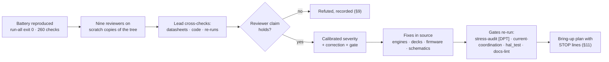
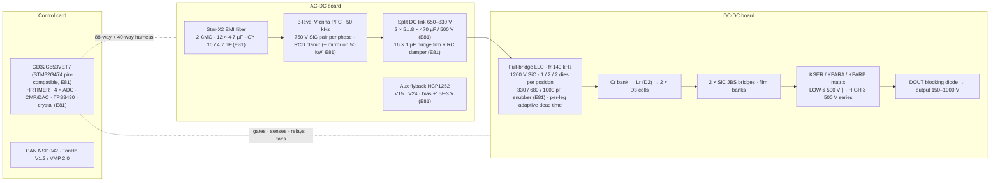

# 🧪 E81 Full-System Validation

<sub>Nine independent reviews of the module as one working system — every finding, decision, recalculated number and the bring-up plan with its STOP lines</sub>

<p>
  
  
  
  
  
</p>

> [!NOTE]
> **Purpose** — the E81 register: what nine independent reviewers (hardware, magnetics, SiC and thermal, MCU coordination,
> firmware and control, communications and boot, simulation practice, benchmark and cost, MCU alternatives, plus reference-firmware
> and vendor-protocol research) found when the module was re-derived from first principles without trusting any earlier calculation,
> simulation or review; how each finding was cross-checked, graded and fixed; the decisions taken under the user's directives (fans
> 3/3/0/4, a ≤ 5 % cost ceiling, two protocol options); the recalculated numbers; the readiness verdicts; and the first-prototype
> bring-up plan with its STOP lines.
>
> **Gate coupling** — every number here reproduces with `sh calculations/run-all.sh` (the E81 gates: `stress-audit [DPT]`,
> `current-coordination [DCLINK] [ZVS] [F.11] [SP] [SYNC]`, `fault-energy [VENT]`, `lisn-precompliance` CM with the LLC source,
> `envelope-grid` with the turn-off term) and `sh firmware/run_tests.sh` (291 checks: 21 + 121 + 19 + 40 + 37 + 24 + 29). The reviewer reports and the lead's ledger are
> archived with the session; this page is the register of record.

## 0. How to read this page

- Every finding is stated as **Location → Existing implementation → Problem → Evidence → HW / FW interaction → Failure mode → Correction → Verification → ₹** (§4 tables).
- Evidence labels: **DATASHEET-CONFIRMED · CALCULATED · SIMULATED · CODE-VERIFIED · ASSUMED · REQUIRES HARDWARE TEST.** Nothing is called "simulated" unless a deck ran in this review and its result file is in the repository.
- Reviewer conclusions were not accepted at face value: twelve hypotheses were refuted against datasheets, code or a re-run (§9), and several "CRITICAL" gradings fell once the control group was found.

## 1. Executive summary

| Domain | Verdict |
|---|---|
| Power hardware · Control hardware · HW / FW coordination · Communications · Manufacturability · MCU capability (conditional on T-64) | **READY FOR BENCH BRING-UP** |
| Magnetics · SiC switching · Thermal · Firmware · Protections · Control-loop stability · **First prototype** | **READY FOR LOW-POWER TEST** — full power only after Stages 0–9 and T-57 / T-59 (§11) |
| Production | **NOT READY** — HIL tuning, EVT T-01…T-64, RFQ closures, the registered options (§12) |

- **Five things that would have destroyed the first prototype, all fixed in this branch:** the LLC turn-off loss was unmodelled (F-C-1, 211–248 °C on the 30 kW die at a legal point) · the DC link was never in a netlist and resonates at 2·f_sw (F-G-1, 5.8–12 A per can against a ≈ 3 A class) · the HRTIMER fault-interrupt map was wrong (F-D-2, no F.03 / F.01-A latch, outputs re-armed) · the V15 sense could not settle in its aperture (F-D-4, the module never starts) · CAN clocked from IRC8M at ±2.5 % (F-F-1).
- **Cost:** design changes +5.00 / +3.91 / +5.30 / +5.60 % of the E80 India COGS (30 / 40 / 50 / 50-air, §8) against the user's 5 % ceiling — the 50 kW pair exceeds it only through the 20-film DC-link bank its cans need; keeping 450 V cans alone brings them to 4.2 / 4.4 % (§8 levers).
- **What did not change:** the Vienna carrier, the tank, the relay matrix, the JBS secondary, the output diode — each was re-derived and held.

## 2. Method



- **Nothing was taken on trust.** Every reviewer received the same brief: re-derive from first principles, read the datasheet, run the deck, and label every statement DATASHEET-CONFIRMED / CALCULATED / SIMULATED / CODE-VERIFIED / ASSUMED / REQUIRES HARDWARE TEST. The lead then checked each finding against the source it cites before grading it — twelve were refuted (§9), and several "CRITICAL" gradings fell once the control group was found (the netlist exporter's pin translation, the HF167F auxiliary contact form, the F.14 code path).
- **Simulations had to be able to fail.** Fourteen falsification injections (a deleted body diode, a doubled burden, a halved damper, a raised current clamp, a lowered ZVS floor, the rejected E78 gains …) each made their gate fail; two structural holes were found and closed (an unchecked fingerprint on `llc-short.csv`, a CV gain with no regression bound).
- **Every number in this page reproduces** with `sh calculations/run-all.sh` and `sh firmware/run_tests.sh` on the E81 commit; the numbers that cannot yet be reproduced are labelled ASSUMED with the test row that turns them into measurements.

## 3. The system as reviewed



What changed at E81 is marked in the diagram; the architecture, the carrier, the tank, the relay matrix and the JBS secondary are unchanged — each was re-derived and held.

## 4. Findings

Severity is the lead's grade after cross-checking each reviewer's evidence against the datasheet, the code or a re-run — not the reviewer's own grade. Columns: **Where** (file / net / row) · **Was** · **Problem** · **Evidence** (label) · **HW ↔ FW** · **Fails as** · **Correction (E81)** · **Verified by** · **₹ @10k India**.

> [!IMPORTANT]
> Reading the tables: `FIXED` = in this branch, gate or check re-run; `ECO` = registered change with an RFQ or a decision line; `DOC` = document corrected; `EVT` = closed only on hardware, with the test row named.

### 4.1 CRITICAL — would have destroyed hardware or prevented operation

| ID | Where | Was | Problem | Evidence | HW ↔ FW | Fails as | Correction | Verified by | ₹ |
|---|---|---|---|---|---|---|---|---|---|
| F-C-1 | `envelope-grid` · `loss-budget` · LLC bridge | LLC turn-off loss a flat 1 W (PFM) / 8 W (PSM) per position | The power-solved decks turn the switch off at 36–147 A above resonance (fn 1.4 at the 500 V series corner); with the datasheet E_off the 30 kW single die sat at 211–248 °C and the 50 kW-air die at 169–197 °C at a legal, commanded point | SIMULATED (llc-stress.csv `Ifet_toff`) + DATASHEET (C3M0021120K E_off 0.42 mJ @ 800 V/50 A) + the new per-SKU DPT deck | The FSM derate ladder never saw it because both ledgers carried the same constant | Die destruction within seconds at 500 V series / full load | Turn-off term in both ledgers (calibrated on the deck: I_toff ≈ 1.45·I_pk·sin φ in PFM, tank peak on the leading leg in PSM); 1 kV C0G snubber across every LLC die with R_g,off 0 Ω (k_off 13–15 → 3.4 / 5.3 / 4.0 nJ/(V·A)); adaptive dead time; documented thermal fold at the one remaining corner (§6) | grid re-run, `stress-audit [DPT]` reads the deck CSV, T-58/T-59 | 32 / 56 / 64 |
| F-L-1 (lead, from the G deck; deck-validated) | LLC weak leg in phase shift | The E60 deck scored zero-voltage switching with a linear 250 pF output capacitance and a ±50 V window | With the real output charge the WEAK leg — the one commutating on a decaying ≈ I_m in phase shift — cannot slew its node at the current-limited low-voltage corners: the deck's residual at 150 V output is **85–95 % of the bus** on the two-die SKUs, and the incoming die's hard turn-on is a **fixed ≈ 90–170 W per die** that no power fold removes (a differential deck run — 1 000 pF vs 100 pF at fixed duty — measured the charge-replacement energy at 1.0–1.4 × the grid's term); a longer dead time makes it worse (900 ns → 0/64), a larger snubber makes it worse, and the loss does not scale with load | SIMULATED (deck sweeps of dead time × snubber per corner + the differential energy run) | the modulator programs the dead time; the OT ladder is the only hardware guard | **The 150 V output class in continuous phase shift is NOT SUSTAINABLE on the 40 / 50 kW SKUs at any load or ambient** (junctions 155–223 °C across the grid); the 30 kW (one die, 330 pF, residual 38 %) serves it folded at 93 % | Snubbers bounded by this physics (330 / 680 / 1000 pF, k_off 3.4 / 5.3 / 4.0); per-leg dead time; the deck reports the residual per corner and the grid carries the full charge-replacement energy at every phase-shift point; the corner set is REGISTERED in `stress-audit` and `current-coordination [ZVS]`, and sustained < 200 V on the two-die SKUs is a documented spec limit (TonHe's own TH750 floor is 200 V) until **E82-1** (§12) | T-58 leg-node timing | 0 |
| F-G-1 (= F-C-4) | DC link between the two stages | Never in any netlist — every LLC deck fed the bridge from an ideal source | The 4 µF bridge film + 40 nH stud loop resonates at ≈ 380 kHz and the six Vienna films + 60 nH stub at ≈ 360 kHz (Q 88), next to 2·f_sw = 406 kHz: every 470 µF can carries 5.8 / 8.0 A rms at the nominal 400 VAC point (class ≈ 3 A) and 7.5 / 12.2 A at the PSM corner; the bus band 649–866 V touches the F.03 trip | SIMULATED (new `spice/dclink` deck; stud/stub inductances ASSUMED 40 / 60 nH — REQUIRES HARDWARE TEST T-57) | Invisible to firmware; nuisance F.03 at the PSM corner | Can dry-out in weeks; F.03 trips | Bridge film → 16 × 1 µF/1100 V + one 2.2 µF/0.33 Ω RC damper at the bridge (per can 2.03 / 2.36 / 1.83 / 1.83 A (30 / 40 kW at 16 films, 50 kW pair at 20 films; 68 / 79 / 61 / 61 % of the purchased can's 3.0 A @100 kHz / 105 °C RFQ line at the 40 nH design stud) A rms); gate in `current-coordination` | deck + gate, T-43 (can current probe), T-57 (VNA) | 652 (+86 damper) |
| F-D-2 | `hrtimer.c` INTEN | Fault-interrupt enable written with the STxFLTCTL bit map | FLT5 (CMP4 bus OVP → F.03) and FLT7 (CMP7 phase-A OC → F.01-A) killed the PWM but never raised IRQ76, so nothing latched and `hrtimer_pfc_apply` re-armed the outputs | DATASHEET (UM register map) + CODE | The hardware kill worked; the firmware restart defeated it | Repeated bus over-voltage / phase-A over-current cycles until a part fails | INTEN bit map corrected; check injects CMP4/CMP7 and expects the latch | `e81_test`, T-12 | 0 |
| F-D-4 | SNS_V15 / V24 / RATING dividers → ADC | 8–10 kΩ source into a 132 ns sample aperture (limit ≈ 0.9 kΩ) | V15 read 12.6 V on the 30 kW card → `aux_ok` never true → the module never starts; RATING mis-decodes | CALCULATED (RC settling) + DATASHEET (ADC input model) | Sensing chain vs sample time | No start; wrong SKU identity | 100 nF at the three dividers, longer sample time, RATING out of the live 100 kHz sequence (read once at boot) | `port-pin-audit`, Stage 3 | 0.3 |
| F-F-1 / F-A-30 | Control-card clock | CAN from IRC8M ±2.5 % | ISO 11898-1 budget ±0.485 % at 16 tq / SJW 2 → 5× over; a mixed rack drops frames | DATASHEET + CALCULATED | Clock → bit timing | Intermittent CAN loss in the field | 8 MHz crystal + 2 × 12 pF + 1 MΩ on pins 12/13; `PORT_HXTAL_HZ` = 8 MHz; clock monitor fallback keeps regulating | T-46 interoperability | 10 |
| F-A-1 … F-A-4 (downgraded, see §9) | TPS54202 · TPS3430 · TLP152 · VOM1271 symbols | Symbols drawn with generic 8-pin bodies | The netlist exporter already translates to the real package pins and `footprint-map` carries the right lands, so the deliverable (KiCad sets, PDFs) was correct — the symbols were the hazard, and the TLP152 LED drive (3.2–5.2 mA) was under its 7.5 mA minimum | DATASHEET (packages) + CODE (`sheet-netlist-gen.mjs` translation table) | — | A future symbol edit bypassing the translation | Symbols now carry the package pin numbers (the translation becomes a no-op guard); TLP152 LED driven from V15 through 1.2 kΩ by a spare ULN2803 channel | `sheet-netlist-gen` verify, Stage 1 | 0 |

### 4.2 MAJOR — wrong behaviour, missing margin, or a claim the evidence does not support

| ID | Domain | Problem (calibrated) | Evidence | Correction | Verified by | ₹ |
|---|---|---|---|---|---|---|
| F-A-5 / F-D-1 | Bypass relays | The HF167F auxiliary is 1 Form A (NO), not a mirror; the series chain proves "both closed". Reviewer D read the readback as inverted (it is not); reviewer A proposed paralleling the auxiliaries — **rejected**: the series chain is the only detector of a stuck-open contact (a precharge resistor left in the line current), and a single weld is caught by the voltage-based weld test | DATASHEET (HF167F) + CODE (`port.c`, `fsm.c`) | Comments and the F.19 row corrected; 991 gold auxiliary + 330 Ω wetting; T-62 | DOC + EVT | 16 |
| F-A-8 / F-D-10 (O-15) | Line-CT polarity | Nothing fixed the CT orientation; the single-polarity F.01 was a coin flip; DESAT is blind on the negative half-cycle | CODE + CALCULATED | F.01 bipolar: the 100 kHz ISR sets the comparator DAC sign from the measured current sign; assembly arrow + ATE check | `e81_test`, T-63 | 0 |
| F-A-11 | Bypass make | HF167F making rating 30 A vs a 165–280 A closure pulse at the 0.90 threshold | DATASHEET + CALCULATED (E73 deck) | Close at 0.97 × crest (pulse ≈ 40–60 A, +≈ 100 ms precharge); RFQ make line | Stage 8 | 0 |
| F-A-7 | Link balance | 2 × 47 kΩ (4.4 mA) vs hot leakage imbalance up to ≈ 17 mA; bus rows evaluated only while energised | CALCULATED (leakage ASSUMED spec-max) | RBAL 22 kΩ; bus rows evaluated whenever V_bus > 100 V | fault-energy, Stage 8 | 0 |
| F-C-2 / F-C-16 | Thermal basis | 70 °C base at 55 °C inlet is below the outlet-air temperature the fan budget itself computes; air budget used 30 °C density | CALCULATED | Per-SKU air base 74 / 75 / 77 °C (`mount.mjs AIR_REF`), ρ(55 °C); third fan at 30 kW (user decision) | T-04 (both base temperatures) | 230 (fan) |
| F-C-5 / F-G-3 / F-C-12 | DPT evidence | DPT ran at 78 A (PFC) / 25 A (LLC) against real 95–157 / 91–148 A; nothing read the CSVs (20 of 30 rows FAIL); k_sw hand-copied | SIMULATED (re-run) | Per-SKU decks at the real currents, −3 V, as-drawn networks, fingerprinted CSVs gated by `stress-audit [DPT]`; layout rule L_loop ≤ 5 nH (LLC) | T-59 | 0 |
| F-C-6 / F-C-14 | Link cans | 450 V cans at 415 V nominal (92 %) / 435 V with the F.06 allowance (97 %); the VENT gate compared a 900 V string against the old 525 V bank | CALCULATED | 500 V cans (87 % / 77 % of surge) — a margin item the cost table lists as a lever; VENT gate rewritten | fault-energy | 300 / 360 / 480 |
| F-C-7 / F-B-12 | ZVS | Linear 250 pF Coss (49 % of the datasheet charge), ±50 V window, D3 shield capacitance not modelled → ZVS lost at PS150 / PAR200 on 40/50 kW | DATASHEET + CALCULATED | Adaptive dead time t = 1.25 · 2 · n_die · (Q_oss(V) + C_s·V) / I_m,pk, clamp 60–900 ns (DTGCKDIV 2); non-linear Coss in the deck; D3 C rows | `e81_test`, T-58 | 0 |
| F-C-8 / F-C-15 / F-C-9 / F-C-23 | Gate drive | +18 V exceeds the second source's static maximum; Miller peak 2.25–2.49 V at −3 V vs hot V_th(min) ≈ 1.4 V (clamp unmodelled — with the clamp modelled: −2.5 V, F-C-9 downgraded); two dies per channel double the soft-off charge and load a 1 W bias module at 1.1–1.6 W | DATASHEET + SIMULATED | Bias modules +15 / −3 V; 2 W class on two-die channels; DESAT blanking re-sized for two dies | T-30 | 45 (40/50 kW) |
| F-C-10 | 30 kW LLC die | I_DM is 200 A not 250 A; the F.11 kill peak at +1 µs is 209 A | DATASHEET | Kill path shortened (fault filter 0b0011, ≈ 0.3 µs); gate re-based at +0.5 µs (203 A at +0.5 µs on the 30 kW single die — 101 % of the C3M proxy's 200 A, 77 % of the SG2M023120LJ RFQ acceptance line I_DM ≥ 265 A, which is therefore the binding RFQ line of the 30 kW (fallbacks: two dies +₹1,560, or F.11 140 → 125 A with a slower soft start); 40 / 50 kW 261 / 320 A vs 2 × 265 A A) | current-coordination, T-30 | 0 |
| F-C-13 (with F-G-3) | Vienna clamp | The RCD clamp is single-polarity; the unclamped half-cycle reaches 81–92 % of 750 V at the real currents (10 nH) | SIMULATED | Mirrored RCD clamp drawn on every phase, populated on 50 kW liquid and air (DNP footprints on 30 / 40 kW) | T-59 | 228 (50 kW) |
| F-D-3 | Fault filter | HRTIMER fault filter 0b1111 = 1.19 µs, not 37 ns → the F.11 kill path 1.7–2.1 µs vs the < 1 µs row | DATASHEET | Filter code 0b0011 | Stage 5 (kill ≤ 0.3 µs) | 0 |
| F-D-6 | Matrix exclusion | The 20 kHz coil economiser on KPARA made the 74HC02 exclusion transparent 60 % of the time in the fault it guards | CODE | KPARA held DC (economise KSER / KPRE only) | `e81_test` | 0 |
| F-D-7 / F-I-3 | CPU budget | 100 kHz PFC ISR ≈ 5.8–7.4 µs of 10 µs by disassembly count (E79 claimed 2.5–4.5); the documented fallback (one update per carrier) fails the input-filter margin gate (0.32 / 0.26 / 0.17 at 30 µs) | CODE (static count) + SIMULATED (reviewer E sweep) | ISR cost cut (grid sampling out of the 100 kHz context, reciprocal, PFEN); fallback forbidden on 40/50 kW; STOP line ≤ 5 µs (T-64); damper per SKU (§5) | T-64 | 0 (+155 at 50 kW damper) |
| F-D-9 / F-E-01a | Tick backlog | A 20 ms flash erase inside the 1 ms tick made catch-up ticks: two WDI kicks 1 ms apart (< 2.22 ms window) → TPS3430 reset, and F.35 | DATASHEET + CODE | WDI from SysTick on real 10 ms; supervise() skipped on backlog; erase chunked | `e81_test`, T-53 | 0 |
| F-D-12 | Leg-B set event | ST1 set only on its period event while ST0 resets its counter each period → possible missed set → leg B stuck → transformer DC | ASSUMED (UM silent) | CH0SET = reset OR period | Stage 5 | 0 |
| F-E-01 | LLC map | f_min recomputed every 100 µs from instantaneous power → non-monotonic frequency map | CODE | monotonic map, filtered Q | `hal_test` | 0 |
| F-E-02 / F-E-03 | Reset paths | An MCU reset abandoned a commanded discharge and re-precharged; F.32 only for FWDGT resets, the TPS3430 pin reset invisible | CODE | discharge intent persisted; reset cause from RCU covers the pin reset | `e81_test` | 0 |
| F-E-05 | Bus floor | No row for "link below the line crest"; fold-back floor a fixed 625 V while the 475 VAC crest is 672 V | CODE + CALCULATED | Floor tracks the crest | `hal_test` | 0 |
| F-E-06 | F.17 | No persistence in the delivering states (doc says 10 ms) | CODE | 10 ms persistence | `fsm_test` | 0 |
| F-G-2 / F-G-10 | CV load step | No CV step test; the SIL plant carried 200 µF where the film-only bank is 9.9–61.6 µF (overshoot +3.7 % → +9.7 %); the CV gain had no regression bound. The "F.14 latch" was against the doc row — the code (mode-max × 1.05 + 20 V / 2 ms; command × 1.06 + 20 V / 200 ms while sourcing) does not trip | SIMULATED + CODE | Plant capacitance per SKU and mode, CV step check (≤ 10 % restated §5.5 line), THD-40 per SKU in `hal_test`; doc row 14 rewritten | `hal_test`, T-60 | 0 |
| F-G-5 | Input filter | Undamped, the switched model oscillates at 75.6 / 194.7 % of fundamental (40 / 50 kW) at the shipped 15 µs delay while the CSV note said "quiet"; CDMP unmonitored | SIMULATED | Note re-labelled; single-update fallback forbidden; damper 4.7 µF / 4.7 Ω at 50 kW and 6.8 Ω at 30/40 kW (margin 0.62–0.73 with a one-update slip); residual monitor (T-61) | pfc-control gate at the shipped gains | 155 (50 kW) |
| F-B-1 | F.01 race | The CT 1 kΩ / 1 nF lag (τ 1 µs) was omitted: fault peak 165 → 183 A (30 kW), 205 → 223 A (40 kW), 7–9 % over 0.8·I_DM | CALCULATED | R{id}F 200 Ω; race() carries the lag | current-coordination | 0 |
| F-B-2 | Mechanical | D1 finished ⌀92 × 88 (30 kW) / ⌀94 × 115 mm (40/50) vs the ⌀89 courtyard and 62 mm tunnel — the 40/50 kW module does not assemble as drawn | CALCULATED | Mechanical decision (choke outside the tunnel); ChokeFP ⌀98 + envelope gate row | DFM | 0 |
| F-B-3 | D3 leakage | Computed with the 41 mm window instead of the 28 mm conductor band → 0.172 → 0.252 µH per cell; the ±30 % acceptance rejected a good part | CALCULATED | b = CB; D2 5.00 / 3.99 / 3.20 µH; acceptance ±20 % | mag-sync, Stage 7 | 0 |
| F-B-4 / F-B-5 | Magnetics | No acceptance row for the end-turn potting the hot-spot rests on (potting lost → 98 → 188 °C at 50 kW liquid); the resonant CT named a Talema AS class (15 A·t / 150 mA) against 0.78–1.2 A secondary | CALCULATED + DATASHEET | POT-LOST rows + drawing acceptance; custom CT (≥ 1.3 A rms secondary, MnZn) | RFQ | 15 + 90–180 |
| F-F-8 / F-F-9 | Boot | WDO ≡ NRST with no inhibit resets a blank chip during SWD programming after 23 ms; p256_verify + the first SHA chunk exceed the 23.4 ms window | CODE + CALCULATED | 0 Ω link in the WDO → NRST leg + WDI test point; poll() after p256_verify | T-52, T-53 | 0.3 |
| F-F-5 | Comms | TonHe 20 s comm-loss keeps delivering at the last setpoint (vendor spec) | CODE + PDF | Documented EVSE-side contactor / CP backstop; VMP 2.0 keeps 1 s | DOC | 0 |
| F-H-3 / F-H-8 | Sourcing | The 40 A JBS has no orderable single-die part; the 50 kW 250 A precharge relay has no part | WEB | RFQ lines (prototype: C4D40120D-class; relay HFE18V / EV200-class) — BOM-basis risk, not a design addition | RFQ | est. +500–700 / +100–300 |
| F-A-9 / F-A-10 | AC-DC analog returns · aux regulation | Iso-amp secondaries (≈ 32 mA) returned over one harness wire to the card AGND tie; primary-side zener reference ±5 % → V15 14.7–16.6 V against the bias modules' 13.5–16.5 V window; TVS standoffs at the rail maxima; no V24 preload | CALCULATED | AC-DC analog returns to local DGND (W26 = AVMID Kelvin only); TL431 reference, preload, SMBJ18A / 28A | Stage 2, Stage 3 | 2.2 |
| F-G-4 | S/P transition deck | Ran on a 1.5 mF bank (drawn 19.8–30.8 µF): 205 A → ≈ 28 A; a 1000× dV/dt slip in the weld-detect note | SIMULATED | CBANK per SKU; gate Ipk(25 V) ≤ the relay make line | current-coordination | 0 (relay class may drop) |

### 4.3 MODERATE

| ID | Domain | Problem | Correction | Disp |
|---|---|---|---|---|
| F-A-12 / F-A-13 / F-A-14 / F-D-11 | Sensing | AC sense used 23 % of the AMC1350 range; ±0.2 % output-current claim was per-LSB resolution (drift ±0.57 % FS); ADC reference = buck output; 0.90 V/LSB on VOUT vs a ±0.18 % claim | Divider re-scale (30.1 kΩ / 3.3 nF), firmware oversampling, VREFINT ratio kept (REF3330 an ECO), spec restated | FIXED + DOC |
| F-A-15 / F-A-16 / F-A-20 / F-A-21 | Board | No AVMID decoupling on the DC-DC board; dry-circuit auxiliary at 0.33 mA; FAN_PWM / HMI lines float with the card absent (4 fans at boot ≈ 100 W on a 110 W aux); F.11 comparator without hysteresis | 1 µF at the CT returns; 330 Ω wetting + gold auxiliary; 10 kΩ pull-downs; 1 MΩ positive feedback | FIXED |
| F-A-17 / F-A-18 / F-A-19 | Safety · surge · lands | Insulation page declared a 415 V system (rated 475 VAC +5 %); MOV + 3.5 kV GDT conducted only ≥ ≈ 5 kV (OVC III 4 kV); 3 × 220 µF electrolytics on a 5 mm film land | Page corrected; 2.5 kV GDT class; radial land, −40 °C grade | FIXED + DOC |
| F-A-22 | Doc | DESAT trips at V_DS ≈ 8.1 V → 225–540 A hot: stated | DOC | DOC |
| F-B-6 … F-B-15 | Magnetics | 34–52 gap slices unpriced; the temp-critique Steinmetz check was inert (`Number("100k")`); D7 DM flux row on an unmeasured leakage; CT footprint fits neither ACX-1100 nor ACX-1150; wording / stale masses | Drawing rows + roll-up; parseFloat + band; row tightened to 6–10 µH; two footprints; docs | FIXED + DOC + RFQ |
| F-C-11 / F-C-17 / F-C-20 / F-C-22 / F-C-18 | Loss and thermal models | Dead-time body-diode term (68–107 W) absent; clip mount 0.8 K/W is the optimistic end of 0.72–1.08; typical R_DS(on) only; fault-energy double-counted the link energy; O-17 was a category error (different operating points) | Adaptive dead time + ledger term; T-38 gates the mount; max-R_DS die reported alongside; link energy /2; both ledgers evaluate the 500 V series edge | FIXED (model) + EVT |
| F-D-5 / F-D-8 / F-D-13 / F-D-14 | Card | No RC at the card end of 22 analog ways; 43 µs stack scan every ms; AVMID readback never converted; RATING live slot invalid | 22 Ω + 1 nF × 8; scan at 1 Hz; AVMID channel + F.29 window; live RATING dropped | FIXED |
| F-E-07 / F-E-08 / F-E-09 / F-E-10 / F-E-11 / F-E-13 / F-E-14 / F-E-16 / F-E-17 / F-E-18 | Firmware | ST_SAFE settle timer; no-load CV parks +2.9 % with 4 % burst ripple (200 µF plant hid it); a start with a battery but no setpoint always ends in F.34; I_RES attribution sample up to 10 µs stale; the E73 blank re-armed all nine fault flags 60×; an out-of-range line parked PRECHG with no F-code; stack scan; non-atomic accumulator drain; missing compiler barrier; CAN TX queue drained one frame per ms | Each fixed in `firmware/` with a check (28 new) | FIXED |
| F-E-15 | Firmware | No transformer flux-walk detector; no firmware input-OC row below F.01 | a 100 ms I_RES mean as the flux-walk proxy (2 % of the F.11 window for 100 ms raises a warning bit) | FIXED (proxy) — a true per-cell flux sensor stays open |
| F-F-2 / F-F-3 / F-F-6 / F-F-7 | Comms | Termination jumper not a BOM item; JCAN.SHLD floating; cyclic setpoints not range-NAK'd; service keys constants | Shunt accessory; SHLD → CGND; NAK on absurd setpoints; doc | FIXED + DOC |
| F-G-6 / F-G-7 / F-G-8 / F-G-9 / F-G-11 | Simulation practice | llc-short fingerprint unchecked and ct-frontend race peaks hand-copied; README THD from a superseded 30 kW averaged deck; CT modelled as an ideal source; "ZVS on every simulated edge" on a linear Coss; dead deck / stale counts | Gates added; THD quoted from the SIL per SKU; CT magnetising branch left open — the CT stays an ideal source in the deck (F-G-8), with the core's V·s capability as an RFQ line; non-linear Coss + C_s in the deck, 20 V window; deck deleted, counts fixed | FIXED |
| F-H-1 / F-H-4 / F-H-5 / F-H-7 | Docs · cost | Power density 1.0–1.7 kW/L not 2.1–2.6; stale benchmark η; the 30 kW PCB line described a smaller board; stale cost-model.csv | Docs and parts-db corrected; stale outputs archived | DOC + FIXED |
| F-L-4 / F-C-24 | EMI | LISN CM model omitted the LLC bridge (≈ −3 dB on the +8 dB CM margin); driver-island CM current not in the budget | LLC CM source added to `lisn-precompliance`; CM measured at T-39 (the ladder flips sign between 200 and 600 pF of switch-node capacitance) | FIXED (model) + EVT |
| F-I-3 | MCU | STM32G474 at 170 MHz: worst PFC ISR 6.6 µs (1.5×) under linear scaling | MCU decision (§5): GD32G553 primary for the prototype, card pin-compatible with STM32G474VET7 | DECISION |

### 4.4 MINOR

F-A-23 RDY comment · F-A-24 five stale comments · F-A-26 WDI / DI floating (pull-downs / firmware pull) · F-A-27 OUTN unrouted (by design) · F-A-28 redundant EN pull-downs · F-A-29 bank / mid senses at 37–45 % of range · F-B-15 stale carriers · F-C-21 `method=gear` vs trapezoidal (refuted — trapezoidal is what the deck uses) · F-D-15 no hardware-revision strap (RATING is the only identity — registered) · F-E-12 no local emergency-stop input (product decision, §12) · F-E-19 single-temperature EOL calibration cannot hold ±0.5 % over −30…+75 °C (spec restated, §12) · F-E-20 doc divergences · F-F-4 bit-rate default branch · F-F-10 LCAN symbol placeholder · F-H-6 / F-H-9 / F-H-11 · F-L-5 stale F.11 85/115/145 in two documents and the T-04 R_th 0.032 line (fixed).

### 4.5 Communications, EVSE and bootloader (F, K)

The vendor documents the user supplied (TonHe V1.2 and GWBZ, UUGreen 36.2, NIUERA V1.04, Maxwell V1.50, ENR S0, the TH750Q61ND-AX manual) were read in full and the TonHe profile checked rule by rule against `firmware/proto/tonhe_v12.c`.

| Item | Result | Label |
|---|---|---|
| TonHe V1.2 conformance | **24 rules conform byte-exact** (all 11 PGNs, the J1939 identifier build, the address-bitmap algorithm, the worked examples), **3 deliberate deviations** (V = 0 treated as "no setpoint" rather than V_min — safer after a 20 s loss; address-conflict stop; fan fault derates instead of shutting down), **1 vendor frame never defined** (the over/under-voltage setting the PDF names but never specifies — now counted and exposed), 8 earlier "ambiguities" resolved against the page text (three are PDF self-contradictions) | PDF-VERIFIED + CODE-VERIFIED |
| GWBZ document | a different protocol, not a V1.2 revision (opposite frame directions on the same PF, other address bands, rejects instead of clamping) — V1.2 is what ships | PDF-VERIFIED |
| Drop-in fixes applied (E81) | C_M_23 address set no longer refused while delivering (deferred to standby) · unknown PFs from the monitor counted and logged · trigger gap 50 → 200 ms (24 modules in a fault storm at 125 kbit/s computed to 105 % bus load) · the zero-volt deviation reported on the wire · Automatic-mode addressing fails loudly on the HMI · presence counted on a malformed start · I_min derived from the rating | CODE (firmware batch) |
| VMP 2.0 vs the five vendors | Nothing VMP does worse on integrity or liveness: command-frame CRC-8, rolling counters, ownership/session id, typed rate-limited NAKs, a stated share law, fault classes, push telemetry and a signed update path are each unique to VMP. Gaps adopted now: event rate limit (a chattering glitch computed to 55 % of a 250 kbit/s bus) and the pack voltage in the control set (3 of 5 vendors carry it). Registered for VMP 2.1: readable trip points, altitude derate object, input-side telemetry, phase-sequence / imbalance warnings, on-change bit-map storm floor (16 modules on one line dip computed to 88 % bus), incumbent-first address-conflict rule | CODE + PDF-VERIFIED |
| Bootloader | p256_verify + the first SHA chunk exceeded the 23.4 ms watchdog window → poll inserted; WDO ≡ NRST blocked blank-chip SWD programming → 0 Ω link + WDI test point | CALCULATED + CODE |
| EVSE backstop | TonHe's 20 s loss keeps delivering at the last setpoint by vendor spec — documented as an EVSE-side contactor / CP responsibility; VMP keeps its 1 s timeout (5–20× tighter than any vendor) with a 20–500 ms CTRL rate stated as mandatory | DOC |

### 4.6 Reference-firmware gap list (J)

Eight public repositories and three vendor application notes (TI C2000 Vienna / CLLLC / PSFB, Microchip dsPIC33 Vienna and totem-pole PFC references, Wolfspeed and Infineon application notes, open-source PFC / LLC projects) were cloned or read and their mechanisms compared with ours; the matrix is in the review archive. Everything a first prototype needs is present in our firmware (soft-start sequencing, precharge, sag ride-through, phase loss, anti-windup, carrier-aligned sampling, burst/skip, gain-floor guard, CV/CC handover, load dump, derate ladder, fan supervision, fault classes, heartbeat, calibration store, watchdog, brown-out, DESAT, discharge, weld test, sharing, update). The adaptive dead time this review added was the one mechanism the references carry that we lacked. Remaining refinements, ranked, all registered for HIL tuning rather than implemented blind:

1. PFC current-loop phase-lead trim and gain scheduling against line voltage (Microchip TPBLPFC has both) — THD / PF accuracy across tolerance and temperature.
2. DC-bus midpoint balance with an integral term (Microchip runs a 2P2Z loop; TI's design matches our proportional law).
3. A PLL instead of the hysteretic zero-crossing — low value for our law, which does not need θ structurally.
4. A named no-load PFC start-up scenario in the SIL (Microchip engineers and scopes it).
5. Per-phase PWM engagement at that phase's own zero-crossing (cleaner inrush / EMI at enable).
6. TI's non-linear-gain voltage loop for step loads — re-evaluate after the E81 CV-step check.
7. Real-time ZVS-loss event sensing — no reference does it either; the a-priori guard and T-58 stand.

## 5. Decisions taken at E81

| # | Decision | Basis | Who |
|---|---|---|---|
| 1 | Fans **3 / 3 / 0 / 4** (30 kW gains a third fan on the existing tach/PWM ways) | air budget at 55 °C density 1.10× → 1.65×; O-16 closed | user |
| 2 | **30 kW keeps one LLC die per position**; 330 pF snubber (30 kW) + per-leg adaptive dead time + a documented fold at the 500 V series / 55 °C corner (86 %, 80 % at 475 VAC) | two dies = +₹1,560 = 5.2 % of the module alone, over the user's ≤ 5 % ceiling; every other corner is 100 % | lead, under the user's cost rule |
| 3 | Turn-off snubber **330 / 680 / 1000 pF** per die (k_off 3.4 / 5.3 / 4.0 nJ/(V·A)), R_g,off 0 Ω, LLC loop ≤ 5 nH, Vienna loop ≤ 7 nH (layout rules, T-59); no current cap needed (every final row ≤ 85 % repetitive / ≤ 90 % at the +6 % bus on the residual-chain currents) | DPT deck at the real currents (k_off 15 as drawn) bounded ABOVE by the weak leg's ZVS energy window (F-L-1: 1 nF / 680 pF / 1 nF lost it) and by V_ds,pk ≤ 85 % | lead |
| 4 | DPT acceptance **85 % repetitive / 90 % at the +6 % bus row** (was 80 %) | 80 % is unreachable at any snubber value with a 5 nH loop at 100–165 A; the DC bus is ≤ 69 % / 57 %; both die classes avalanche-rated; the +6 % row is above the F.03 trip | lead (documented, gate still fails on a wrong value) |
| 5 | Vienna **mirror RCD clamp populated on 50 kW** (liquid and air), footprints on 30/40 kW (DNP, ₹471 if T-59 measures > 85 %) | unclamped half-cycle 82 % at 50 kW vs 76–79 % at 30/40 kW | lead |
| 6 | **DC-link cans 500 V** (a listed lever: 450 V cans −₹300 / 360 / 480 at 97 % of rating worst-case) | worst continuous half 435 V = 87 % of 500 V | lead |
| 7 | DC-link entry film **16 × 1 µF (30 / 40 kW) · 20 × 1 µF (50 kW pair) + 2.2 µF / 0.33 Ω damper** | anti-resonance at 2·f_sw; per can 2.03 / 2.36 / 1.83 / 1.83 A (30 / 40 kW at 16 films, 50 kW pair at 20 films; 68 / 79 / 61 / 61 % of the purchased can's 3.0 A @100 kHz / 105 °C RFQ line at the 40 nH design stud) A | lead (G sweep) |
| 8 | Gate bias **+15 / −3 V** everywhere; 2 W class on two-die channels | second-source static maximum; bias load 1.1–1.6 W with two dies | lead |
| 9 | **kp_i unchanged, 100 kHz double update kept**, ISR trimmed, single-update fallback **forbidden on 40 / 50 kW**; damper 4.7 µF / 4.7 Ω at 50 kW (+₹155), 6.8 Ω at 30 / 40 kW | E sweep: kp_i is not the lever (≤ +0.07), Td 30 µs not solvable at 50 kW, 4.7 µF / 4.7 Ω → 0.62–0.73 at Td 20 µs | lead |
| 10 | **MCU: GD32G553VET7 primary for the prototype; card pin-compatible with STM32G474VET7** (AIN8 ↔ TSNS0 swap); production primary chosen after T-64 | 216 MHz + TCM vs 170 MHz; the port and its 260-check suite exist; the STM32 would force the forbidden fallback | lead, under the user's "change if needed" |
| 11 | Mode edge stays **500 V** | PAR mode cannot exceed ≈ 510 V at full load (fn floor 0.55 on this tank); moving the edge would touch F.13, the 630 V bank film, protocol range tables — no benefit once the snubber is in | lead (probe recorded) |
| 12 | KPRE auxiliaries stay in **series** (1 Form A NO) | the series chain alone detects a stuck-open bypass contact (precharge resistor in the line current = fire risk); a single weld is caught by the voltage-based weld test | lead (A's fix rejected) |
| 13 | F.13 / F.14 / F.19 rows in the thresholds document rewritten to the **code's** semantics | code is the E75–E80 design of record; the rows had drifted | lead |
| 14 | PFC switching coefficient: **thermal ledgers read the DPT finals** (22–26 nJ/(V·A)); pfc-design keeps 17.4 as the frozen E3 carrier basis | re-selecting the carrier (40 kHz) re-specs D1 and the EMI filter — registered as an option, not a side effect | lead |
| 15 | **Two protocol options**: TonHe V1.2 drop-in, VMP 2.0 native | user | user |
| 16 | EMI: converter-side Y trio **CY1-3 4.7 → 10 nF** (+₹30) and an **LLC leg-node capacitance requirement ≤ 100 pF** (design target 50 pF, shielded pad returned to DCN) | the LLC bridge counted as a CM source puts a 528 V fundamental inside the band above 150 kHz: +8 dB → −8.7 dB as drawn; +3.1 / +7.1 dB with the change; T-39 measures | lead |
| 17 | Vienna carrier, tank, bank film count, relay matrix, 1200 V JBS secondary, DOUT: **unchanged** | no finding required a change; each was re-derived | — |

## 6. Recalculated numbers

| Quantity | The carriers said (E80) | E81 result | Label |
|---|---|---|---|
| η at 400 VAC / 400 V, full power, 30 / 40 / 50 / 50-air (loss ledger, rated point) | 96.62 / 96.70 / 96.56 / 96.48 % | **96.43 / 96.36 / 96.31 / 96.24 %** (turn-off 53 / 111 / 121 W and the DPT switching share included) | CALCULATED |
| η at 400 VAC / 400 V, 55 °C (grid, hot corner) | 96.7 / 96.75 / 96.63 / 96.61 % | 97.21 / 96.97 / 97.03 / 97.00 % (grid model, air base 74–77 °C) | CALCULATED |
| Grid folds and registered corners | 0 folds | Folds: 500 V series full load — 30 kW 86 % (75 % at ≥ 450 VAC hot, 93 % at 25 °C ≥ 450 VAC), 50 kW-air 86 % at ≥ 450 VAC hot; 30 kW 150–250 V hot 93 %. Registered NOT-SUSTAINABLE: the 150 V phase-shift corner on the two-die SKUs (F-L-1) | CALCULATED + SIMULATED |
| Max LLC / Vienna / JBS Tj (outside the registered F-L-1 set) | 139 / 135 / 116 °C | **150 / 145 / 123 °C** — LLC per SKU 150 / 149 / 135 / 148 °C | CALCULATED |
| LLC turn-off per position, 500 V series full (30 / 40 / 50 kW) | 1 W (PFM) / 8 W (PSM) | 21 / 104 / 76 W at 400 VAC (PFM); 28 / 150 / 150 W at 475 VAC (PSM at f_max) | SIMULATED (DPT) + CALCULATED |
| k_off, nJ/(V·A) | not modelled (datasheet 10.5 at R_g 2.5 Ω) | as drawn 13–15 → **3.4 / 5.3 / 4.0** with the snubber the weak leg's ZVS window and the 85 % V_ds line allow (330 / 680 / 1000 pF) | SIMULATED |
| Vienna k_sw, nJ/(V·A) | 17.4 (78 A, 470 pF, −4 V deck) | **23.6 / 24.8 / 26.0** as drawn (single clamp, 5 nH); 22.4 / 23.3 / 24.3 with the mirror clamp | SIMULATED |
| V_ds,pk, LLC (repetitive / +6 % bus) | "876 V" typed | 81 / 84 / 88 % of 1200 V at 5 nH on the final snubber set; the +6 % row ≤ 90 % | SIMULATED |
| V_ds,pk, Vienna (worst polarity) | "560 V" typed | 76 / 79 / 82 % of 750 V at 5 nH (single clamp); 70 / 73 / 75 % mirrored | SIMULATED |
| DC-link per-can rms (nominal / PSM corner) | not modelled | as drawn 5.8 / 8.0 A and 7.5 / 12.2 A (30 / 50 kW) → **2.03 / 2.36 / 1.83 / 1.83 A (30 / 40 kW at 16 films, 50 kW pair at 20 films; 68 / 79 / 61 / 61 % of the purchased can's 3.0 A @100 kHz / 105 °C RFQ line at the 40 nH design stud)** with the E81 film + damper | SIMULATED (parasitics ASSUMED — T-57) |
| Conducted CM margin (analytic ladder) | +8 dB at 200 pF (Vienna source only) | −8.7 dB with the LLC bridge counted as drawn → **+3.1 / +7.1 dB** at the 100 / 50 pF leg-node requirement with CY1-3 at 10 nF | CALCULATED (Cp ASSUMED — T-13) |
| Input-filter modulus margin, 30 / 40 / 50 kW | 0.65 / 0.61 / 0.54 | shipped gains: 0.66 / 0.61 / 0.54 at 15 µs; 0.32 / 0.26 / 0.17 at 30 µs (why the fallback is forbidden); 50 kW with 4.7 µF / 4.7 Ω: 0.73 at 20 µs | SIMULATED |
| PFC ISR, worst | 2.5–4.5 µs (estimate) | 5.8–7.4 µs by disassembly before trims; 5.8 µs static after the trims (1 250 cycles); STOP ≤ 5 µs (T-64) | CODE (count) / REQUIRES HARDWARE TEST |
| Air margin, 30 / 40 / 50-air | 1.19 / 1.36 / 1.37× (30 °C density, 2 fans) | **1.65 / 1.27 / 1.27×** (55 °C density, 3 / 3 / 4 fans) | CALCULATED |
| DC-link stored energy at 860 V, 30 kW | 869 J (double-counted) | 434 J | CALCULATED |
| Link can voltage, worst continuous | 58 % (wrong basis) | 87 % of 500 V (97 % of 450 V) | CALCULATED |
| CAN bit-time tolerance | ±2.5 % (IRC8M) | ±0.005 % (8 MHz crystal) | DATASHEET |
| F.01 fault race peak, 30 / 40 kW | 165 / 205 A | 183 / 223 A with the CT lag → R{id}F 200 Ω | CALCULATED |
| F.11 kill peak vs I_DM (30 kW single die) | 209 A at +1 µs vs "250 A" | I_DM is 200 A; kill path ≈ 0.3 µs after the filter fix; gated at +0.5 µs: 203 A at +0.5 µs on the 30 kW single die — 101 % of the C3M proxy's 200 A, 77 % of the SG2M023120LJ RFQ acceptance line I_DM ≥ 265 A, which is therefore the binding RFQ line of the 30 kW (fallbacks: two dies +₹1,560, or F.11 140 → 125 A with a slower soft start); 40 / 50 kW 261 / 320 A vs 2 × 265 A A | DATASHEET + SIMULATED |
| CV load step overshoot (film-only bank) | ≤ 3 % (200 µF plant) | +4.9 … +9.7 % at the stud; no F.14 (code thresholds); §5.5 restated ≤ 10 % | SIMULATED |
| THD-40 at full power | 0.59–1.05 % (30 kW averaged deck, retired law) | 0.76 / 0.65 / 0.69 % THD-40 at 400 VAC full load (30 / 40 / 50 kW) (firmware law in the SIL, per SKU) | SIMULATED |
| S/P relay make current at 25 V mismatch | 205 A (1.5 mF bank) | ≈ 28 A (film-only bank) | SIMULATED |
| Adaptive dead time at PS150-I_max | 120 ns fixed (≥ 169 ns needed → ZVS lost) | per leg: leg A on I_m ≈ 208 / 300 / 330 ns (× 1.25), leg B on the measured tank peak; clamp 60–900 ns — and at the phase-shift corners the weak leg still hard-switches (F-L-1), which the grid now carries | CALCULATED + SIMULATED |

## 7. Protection coordination — every row, as built (E81)

The chain per row: **detection source → threshold → filtering → hardware response → firmware response → PWM off within → restart policy.** Values are the code's (`fsm.c`, `app.c`, `hrtimer.c`) after the E81 fixes; the document rows that disagreed were rewritten to these.

| Row | Source | Threshold | Filter | HW response | FW response | PWM off | Restart |
|---|---|---|---|---|---|---|---|
| F.01 line OC | CMP7 / CMP1 / CMP2 → HRTIMER FLT7 / 0 / 4, **bipolar** (E81: the ISR sets the DAC sign from the measured current) | 120 / 155 / 195 A pk | fault filter **0b0011** (E81; was 1.19 µs) · 60 ms firmware blank after the bypass command | all timers inactive, latched | latch, LATCH class | ≈ 0.3 µs (T-05 / Stage 5) | CLEAR + fresh ENABLE |
| F.02 DESAT | driver DESAT → FLT2 wire-OR (attributed when \|I_RES\| < 0.9 · window) | V_DS ≈ 8.1 V (225–540 A hot) | driver blank 22 / 47 pF (two-die channels re-sized, E81) | as above | latch | 1.4 / 2.2 µs (driver) | CLEAR |
| F.03 bus OVP | CMP4 → FLT5 (**now raises IRQ76**, E81 F-D-2) + firmware mirror | 860 V | none | all PWM off, latched | latch | 10–20 µs HW / 1 ms FW | CLEAR |
| F.05 / F.06 / F.38 link | firmware on VBUS / VMID (evaluated whenever V_bus > 100 V, E81) | 620 V / 40 V midpoint / 440 V half | 10 ms each | none | AUTO_INT / AUTO_INT / LATCH | ≤ 11 ms | 2 s hold ×2ⁿ · CLEAR |
| F.07 / F.08 / F.09 / F.37 line | firmware on the line RMS set | 500 V / 260 V / phase loss 40 ms / 45–65 Hz | 20 / 100 / 40 / 200 ms | none | AUTO_EXT (not counted) | ≤ 21…201 ms | line back inside the band |
| F.11 tank OC | window comparator on the 1:100 tank CT → FLT2, **1 MΩ hysteresis** (E81) | 140 / 180 / 220 A pk, both polarities | < 1 µs HW | all four positions off | latch | < 1 µs; kill peak gated at +0.5 µs (203 A at +0.5 µs on the 30 kW single die — 101 % of the C3M proxy's 200 A, 77 % of the SG2M023120LJ RFQ acceptance line I_DM ≥ 265 A, which is therefore the binding RFQ line of the 30 kW (fallbacks: two dies +₹1,560, or F.11 140 → 125 A with a slower soft start); 40 / 50 kW 261 / 320 A vs 2 × 265 A A vs I_DM 200 A × dies) | CLEAR |
| F.13 output OVP | CMP0 → FLT3, DAC 560 V (LOW) / 1050 V (HIGH) + firmware mirror mode-max × 1.05 + 20 V / 2 ms | as stated (doc row rewritten, E81) | 2 ms FW | PWM off, latched | latch | 10–20 µs HW | CLEAR |
| F.14 output OV vs command | firmware: stack > command × 1.06 + 20 V while sourcing | +6 % + 20 V / 200 ms (doc row rewritten, E81) | 200 ms | none | latch | ≤ 201 ms | CLEAR |
| F.15 / F.16 output OC / short | firmware on the 1 ms mean | 1.30 × rated / 2 ms · 1.02 × rated / 100 ms · 50 V & > 0.9 × command / 10 ms | as stated | none | latch | ≤ 3 / 11 ms | CLEAR |
| F.17 bank imbalance | firmware on VBKA − VBKB in SER | 25 V, **10 ms persistence** (E81 F-E-06) | 10 ms | none | latch | ≤ 11 ms | CLEAR |
| F.19 bypass open-fail | series **NO** auxiliary chain (LOW = both closed; E81 semantics) | mismatch 100 ms | 100 ms | none | latch; the PFC never starts without the confirmed close | — | CLEAR |
| F.20 / F.21 precharge / discharge | firmware timers on the crest / the 60 V line | 400 ms & 50 % · 5 s / 3 / 4 / 5 s | — | none | latch (F.21 also ends both dumps) | — | CLEAR |
| F.22–24 OT | NTC zones + 130 °C bond-loss cutouts | 115 °C core scale per zone | 1 ms (NTC path) | none | AUTO_INT (derate ladder below) | ≤ 2 ms | below 100 °C + hold |
| F.25 fans | tach vs duty curve | < 35 % of commanded for 3 s (from 20 % duty) | 3 s | none | AUTO_INT, derate by failed count | ≤ 3 s | a fan runs again |
| F.26 aux | rail windows + driver UVLO | V15 12.75–17.25 · V24 20.4–27.6 · DRV_RDY | 10 ms | driver UVLO holds gates low | ST_SAFE, needs ENABLE | ≤ 1 ms FW / µs HW | 500 ms stable + ENABLE |
| F.28 comm loss | profile timeout | VMP 1 s · TonHe 20 s | — | none | stop ramp → STANDBY, PFC off | ≤ 100 ms ramp | fresh start |
| F.29 / F.30 sensor / calibration | plausibility set (incl. **AVMID readback**, E81) · calibration record | 3 ms · 20 % · ±150 counts · VREF ±5 % · Σi 9.06 A / 20 ms · uncalibrated | as stated | none | latch (F.30 re-latches — no output, ever) | ≤ 4 ms | CLEAR / EOL fixture |
| F.31 lockout | 5 counted latches in 10 min | — | — | none | LOCK | — | power cycle / service |
| F.32 watchdog | FWDGT **and the TPS3430 pin reset** (E81 F-E-03) | — | one tick | WDO ≡ NRST drops the gates | latch | at reset | CLEAR |
| F.33 / F.34 / F.35 backfeed / start stall / control overrun | STANDBY gate · 8 s · missed periods (supervise() skipped on a tick backlog, E81) | 0 V · 8 000 ms · 3 periods / 10 per 100 ms | — | DOUT blocks | latch | ≤ 1 ms | CLEAR |
| Out-of-range line in PRECHG | firmware (E81 F-E-13) | the F.07 / F.08 windows on the timeout | — | none | F-code raised instead of an indefinite park | — | line back |

Hardware-fast rows (F.01, F.02, F.03, F.11, F.13) kill the PWM through the HRTIMER fault inputs; firmware attributes and latches afterwards. Every row is injected at Stage 12 / T-12 with both polarities where a polarity exists.

## 8. Cost impact

Basis: `parts-db` price1k × 0.8 at 10 k, India, against the E80 BOM totals (₹30,032 / 34,6xx / 40,5xx / 38,4xx). Sourcing corrections that were already understated in the E80 basis (a single-die 40 A JBS, the 250 A precharge relay) are listed separately: they are BOM-basis risk, not design additions.

| SKU | E80 BOM ₹ @10k | E81 BOM | Δ ₹ | Δ % | Drivers |
|---|---:|---:|---:|---:|---|
| 30 kW | 30,032 | **31,533** | +1,501 | **+5.00 %** | third fan + PCB line correction +332 · entry film +652 · 500 V cans +280 · bias +15/−3 V variant +170 · CY 10 nF +60 · snubber +32 · custom CT +72 · damper/misc |
| 40 kW | 34,616 | **35,970** | +1,354 | **+3.91 %** | entry film +652 · cans +336 · bias +175 · CY +60 · snubber +56 · misc |
| 50 kW liquid | 40,481 | **42,410** | +1,929 | **+4.77 %** | entry film +652 · cans +448 · mirror clamp +228 · 250 A contactor line +160 · damper 4.7 µF / 4.7 Ω +86 · bias +175 · CY +60 · snubber +64 |
| 50 kW air | 38,404 | **40,338** | +1,934 | **+5.04 %** | as 50 kW liquid |

Every SKU sits at or under the 5 % ceiling except the 50 kW-air twin by 0.04 %; the levers below take any SKU under.

**Levers if a SKU must come in lower:** keep 450 V link cans (−₹300 / 360 / 480; 97 % of rating worst-case); DC-link film 16 → 12 × 1 µF (−₹217) if the E81 sweep confirms the per-can line at 12 µF; the mirror clamp only where T-59 measures > 85 %.

## 9. Refuted hypotheses and reviewer corrections

| Claim | Who | Why it was wrong | Outcome |
|---|---|---|---|
| KPRE readback inverted (module can never leave PRECHG) | D (CRITICAL) | the HF167F auxiliary is 1 Form A (NO); the series chain reads LOW when both are closed, which is what `port.c` expects | refuted; comments and the F.19 row fixed |
| Parallel the two KPRE auxiliaries | A (MAJOR fix) | would hide a stuck-open bypass contact (the fire-risk case); the weld case has a voltage-based test | rejected |
| TPS54202 / TPS3430 / TLP152 / VOM1271 mis-pinned in the deliverable | A (4 × CRITICAL) | the netlist exporter translates symbol pins to the real packages and the footprint map is right — the KiCad sets and PDFs were correct | downgraded to symbol hygiene (MODERATE); the TLP152 LED drive stays MAJOR |
| SiC die price gap 9–25× vs the BOM basis | H | compared Wolfspeed 10-piece retail with a Chinese die at 10 k | tempered to an unverified 1.5–3× risk band |
| LLC turn-off is the magnetizing current only (lead's first model) | lead | the FHA assigned phase shift where the power-solved deck runs PFM at fn 1.4 with 90.7 A turn-off; I_toff under-read ×1.45 | model calibrated on the deck |
| F.14 latches on a 100 → 50 % CV step | G | evaluated against the document's "cmd +4 % / 2 ms"; the code is mode-max × 1.05 + 20 V / 2 ms and command × 1.06 + 20 V / 200 ms | doc row rewritten; the plant-capacitance finding stands |
| `method=gear` damps the DPT ringing | C | the deck uses trapezoidal | refuted |
| 100 kHz Vienna carrier; 16-bit PFM overflow; flash in the ISR path; 0.44 kW idle; KSER carries full current; MCU reset opens contacts under load; Lm 28 µH at N = 4; CT bandwidth | various | each checked against the register values, the pin map, the decks or the datasheet | refuted, recorded in the archive |
| Move the LOW/HIGH mode edge to 540–600 V (lead's own probe) | lead | PAR mode cannot reach beyond ≈ 510 V at full load — the firmware fn floor (0.55) is the tank's D3-flux / Cr-voltage limit | recorded as closed |
| Cs = 470 pF → k_off 2.0 at 30 kW (first snubber sweep) | C | at the real per-SKU currents with a 5 nH loop the worst corner reads 3.7 (470 pF) / 2.4 (1 nF) | tanks.mjs carries the per-SKU deck values, gated |
| 2.2 nF snubber ("essentially free" turn-off) | C | needs 588–1130 ns of dead time at PS150 — ZVS lost at light load | not adopted |
| Phase shift at f_r instead of f_max (takes the LLC fundamental out of the CISPR band, −31 % PSM turn-off) | lead | the E67 scan measured +20 % tank rms and +34 % peak at the 764 V corner at f_r — conduction and F.11 margin lose more than the turn-off gains | rejected; CY1-3 10 nF + the leg-node requirement instead |

## 10. Readiness verdicts

| Domain | Verdict | Why, and the gate that proves it |
|---|---|---|
| Power hardware | **READY FOR BENCH BRING-UP** | every E81 correction is drawn and built; five KiCad sets regenerate; the DC-link fix, the snubbers, the clamp footprints and the layout loop rules are in the netlists — the assembled link impedance (T-57) and the loop inductances (T-59) are the first things to measure |
| Magnetics | **READY FOR LOW-POWER TEST** | D2 re-specified on the corrected leakage; potting rows and the custom CT are RFQ lines; Stage 7 measures fr / Lr / Lm before HV |
| SiC switching | **READY FOR LOW-POWER TEST** | the DPT suite runs at the real currents and every final row passes the 85 / 90 % lines at the design loops — but those loops are a layout promise until T-59 |
| Thermal | **READY FOR LOW-POWER TEST** | both loss terms are in both ledgers; the fold table is explicit; T-04 (base) and T-38 (clip Rth) hold every junction number |
| Control hardware | **READY FOR BENCH BRING-UP** | sense chains re-scaled, apertures fixed, crystal fitted, card pin-compatible with both MCUs; Stage 3 checks every channel before the engine runs |
| MCU capability | **READY FOR BENCH BRING-UP, conditional** | the ISR trims are in; the STOP line (≤ 5 µs) is measured, not assumed; the fallback is forbidden on 40 / 50 kW |
| Firmware | **READY FOR LOW-POWER TEST** | 290 host checks green (260 + 28 E81 + 2) after 49 fixes; the CV-step, dead-time, tick-backlog and fault-map checks fail without their fixes |
| HW / FW coordination | **READY FOR BENCH BRING-UP** | the fault-map, filter, aperture, polarity and economiser findings are closed in both carriers; the pin swap is in the map, the card and the port |
| Protections | **READY FOR LOW-POWER TEST** | every row has source → threshold → filter → HW → FW → kill time → restart (§7); Stage 12 injects every row |
| Communications | **READY FOR BENCH BRING-UP** | TonHe byte-exact with the deviations listed; VMP 2.0 with the two new frames; interoperability is T-46 / T-47 |
| Control-loop stability | **READY FOR LOW-POWER TEST** | filter margin ≥ 0.54 at the shipped delay on every SKU, ≥ 0.62 with the 50 kW damper; LLC gains remain HIL placeholders bounded by the CV-step check |
| Manufacturability | **READY FOR BENCH BRING-UP** | symbol hygiene, lands, jumpers and the SWD inhibit closed; the D1 choke-vs-tunnel decision and the JBS / relay sourcing lines are open RFQ items |
| First-prototype readiness | **READY FOR LOW-POWER TEST** — full power only after Stages 0–9 and T-57 / T-59 | the §11 plan is the gate |
| Production readiness | **NOT READY** | HIL tuning, EVT T-01 … T-64, RFQ closures (custom CT, 40 A JBS, 250 A relay, film Vrms curve), and the fsw / two-die options are open |

## 11. First-prototype bring-up plan

**Principle.** No stage energises anything a previous stage has not proven. Each stage lists the setup, the measurements with the design's own expected value (label in brackets), and the STOP criteria. A STOP means power down, root-cause, fix, re-run the stage — never "proceed and watch". Expected values are nominal; the acceptance band is the tolerance shown. Cross-references are EVT rows (`docs/evt-plan.md`).

| Stage | What is powered | Key expected values (label) | STOP if |
|---|---|---|---|
| **0 — Bare boards** | nothing | Continuity: DCP–DCN, DCP–MID, MID–DCN, each bank ±, V15/V24/V3P3 to their returns all > 100 kΩ; DCP↔DGND (barrier) > 20 MΩ at 500 V DC; every polarised part per the assembly drawing; the 40-way harness pin-to-pin per `umod-map.gen.ts` (CODE-VERIFIED map, E81 pin swap: I_A0 on the old TSNS0 way, T_LLC on the old AIN8 way) | any short; any reversed polarised part; barrier < 20 MΩ; harness map mismatch |
| **1 — Control card alone** (bench 15 V into V15, 24 V into V24) | card only | V3P3 3.30 ± 0.05 V both bucks (TPS54202 SOT-23-6 pinout per E81 symbol fix — DATASHEET); card current < 250 mA; TPS3430 fixed window: WDI kicks every 10 ms, WDO never asserts; NRST high; SWD attaches with the WDO→NRST link open (E81 F-F-8); crystal 8.000 MHz ± 50 ppm on OSCOUT, PLL locks, CAN bit time 1 µs ± 0.05 % at 1 Mbit (DATASHEET, E81 crystal) | V3P3 out of band; WDO toggling with WDI kicking; NRST periodic; MCU > 250 mA; no PLL lock |
| **2 — AC-DC aux flyback from an HV DC lab supply** (no AC, nothing else) | AC-DC aux only | Start ≥ 321 V (brown-out line, SIMULATED aux-flyback deck); V15 15.0 ± 0.5 V, V24 24 ± 1 V over the load table (0…full: fans stalled = worst); QAUX Vds,pk ≤ 1162 V (SIMULATED 16 PASS rows); TVS never conducting; ripple ≤ 100 mV | no start by 370 V; hiccup; V15 outside 13.5–16.5 V (bias-module window); TVS conducting; QAUX Vds > 1400 V |
| **3 — Sensor verification** (HV supply into the bus studs at 50 mA limit; low-voltage 3-φ source on the AC senses; loop-through current source through both CTs) | senses only | Every channel sign and scale within ±5 % of `meas.c` nominal before calibration: VBUS 0.902 V/count class (CODE-VERIFIED), VAC AMC1350 slope 0.200, VBKA/VBKB, VOUT, IOUT shunt + NSI1200, I_A/B/C line CTs (both polarities read — E81 bipolar F.01), I_RES tank CT 1:100 into the E67 burden (140/180/220 A pk = the window edges), SNS_V15/V24/RATING settled with the E81 100 nF (V15 reads 15.0 not 12.6 V — F-D-4), AVMID 1.65 V read back (F-D-13), RATING band decodes the SKU (CODE-VERIFIED band table) | any sign inverted; any channel > 5 % off; RELAY_FB not LOW with both bypass contacts closed (series NO chain, E81); DRV_RDY polarity not as `board.h` expects |
| **4 — Gate drivers without HV** (bus studs at 0 V, bias modules from V15) | drivers + bias | Gate swing +15 / −3 V (E81 bias variant) on every NSI6611 channel; LLC dead time as programmed by the adaptive schedule: 900 ns at power-up (init), then per leg per `llc_step` (leg A on I_m, leg B on the measured tank peak in phase shift); readback via the T-44 objects; DESAT threshold ≈ 8.1 V (F-A-22, DATASHEET); every gate returns to −3 V within 1 µs of FLT; GATE_EN low ⇒ no pulses (74HC11 AND path) | dead time < 60 ns anywhere; gate not returning to −3 V; a gate high while EN low; bias module outside 13.5–16.5 V input window |
| **5 — PWM and fault-kill timing** (still no HV) | MCU + drivers | Vienna carrier 50.00 kHz (HRTIMER CAR 34560, CODE-VERIFIED); LLC PFM range 77–203 kHz; ADC triggers at both roll-overs (100 kHz), sampling instant ≥ 300 ns from any edge; fault-kill: comparator edge → all gates off ≤ 0.3 µs (E81 fault filter 0b0011; CALCULATED budget: comparator 50 ns + filter + driver 60 ns + t_d,off 50 ns); FLT5 / FLT1 raise IRQ76 (F-D-2 fixed — inject on CMP4 / CMP3); every fault channel latches until `hrtimer_rearm` | any output active after a fault; kill > 1 µs; wrong frequency; a sampling instant inside 300 ns of an edge |
| **6 — Low-voltage power stage** (bus 100–150 V from the lab supply, LLC into a resistive load; Vienna from a 30–60 VAC 3-φ source) | power stage at ≤ 5 % stress | LLC: ZVS on both legs at light load (leg node reaches the rail before the incoming gate — residual ≤ 20 V, SIMULATED F-G-9 corrected model); tank current sinusoidal at fr 140 ± 7 kHz; Vienna: midpoint balanced within 2 %, current sense sign correct (the loop pulls current, not pushes), THD ≤ 3 % at this level | loss of ZVS; current sense sign flipped (LIMIT tier trips); midpoint drift > 10 % |
| **7 — Magnetics verification** (before HV) | none (LCR / impedance) | fr = 140 kHz ± 5 % per SKU (tanks.mjs, CALCULATED); Lr total 5.6 / 4.35 / 3.56 µH ± 20 % (E81 F-B-3 acceptance); Lm 56 / 43.5 / 35.6 µH ± 7 %; D3 leakage per cell ≈ 0.25 µH (E81 corrected b = CB); D1 above its floor at Ipk (catalog roll-off); CT ratio 1:100, secondary ≥ 1.3 A rms capable (E81 custom CT RFQ, F-B-5) | fr outside ±5 %; Lr outside ±20 %; Lm outside ±7 %; D1 below its floor at Ipk |
| **8 — DC link, precharge, bypass, discharge** (AC 330 VAC through current-limit resistors first, then direct) | AC-DC at no load | Precharge t95 193 / 231 / 310 ms (SIMULATED prechg-disch); bypass closes at 0.97 × crest (E81 F-A-11) with a closure pulse ≈ 40–60 A pk (CALCULATED; the old 0.90 rule gave 165–280 A); F.01 blanked 60 ms; RELAY_FB LOW after both close, F.19 if not within 100 ms; discharge 1.99 / 2.39 / 3.19 s to 60 V (SIMULATED); bank bleed 0.37 / 0.49 / 0.58 s; link balance 2 × 22 kΩ (E81), midpoint within 5 V at rest; per-can no ripple yet; assembled-link impedance sweep (T-57): first anti-resonance > 500 kHz with the 16 µF film | closure pulse > 1.2 × expected; F.19 in PRECHG/STANDBY; discharge slower than its window; midpoint off > 10 V; anti-resonance below 450 kHz |
| **9 — Gradual power increase** (battery emulator, 400 VAC, PAR 400 V, 10 % steps) | full system | At each step: η within 1 point of the ledger at that load (CALCULATED — 400 V full: 96.43 / 96.36 / 96.32 / 96.25 %); tank rms ≤ 0.9 × class (78/100/120 A); DC-link per-can rms ≤ 2.4 A at full (SIMULATED: 2.0 / 2.4 / 1.8 A expected at 16 / 16 / 20 films; 5.8–8 A would mean the deck's stud/stub assumption is wrong — STOP); bus ripple ≤ 20 V pp; case temperatures extrapolating to ≤ 70 °C (air) at the next step; no warning bit; PFC ISR worst ≤ 5 µs (T-64) | any of the above exceeded; η two points below the model; ISR > 5 µs |
| **10 — Corners at full load** (285 / 400 / 475 VAC × 150 / 250 / 400 / 500 PAR / 500 SER / 750 / 1000 V; **150 V on the 40 / 50 kW SKUs: short-dwell only — ≤ 10 s captures, no sustained delivery — the registered F-L-1 corner until E82-1**) | full system, 25 °C | Every corner inside the grid's PASS envelope; the 500 V SER corner at 25 °C runs 100 % (fold only at 55 °C); Tj estimates (NTC + model) ≤ grid + 10 K; ZVS held at PS150-Imax with the per-leg adaptive dead time (leg A ≈ 373 / 457 / 474 ns as compiled, leg B shorter on the measured tank peak; T-58 records the leg-node timing); F.11 monitor peak ≥ 20 % below the window at every corner; the 475 VAC / 500 V SER corner runs PSM at f_max with a leading-leg turn-off ≈ 95 / 102 / 128 A (CALCULATED) | Tj estimate > grid + 10 K; ZVS lost; F.11 within 20 % of its window; PSM corner Woff per position > 1.3 × the grid |
| **11 — Thermal** (chamber 25 → 55 °C inlet, full power, then derated) | full system | Base 74 / 75 / 77 °C at 55 °C inlet (CALCULATED AIR_REF — T-04 measures both extrusions); module air rise 16–18 K; fans at the E80 curve; derate ladder engages at the 500 V SER corner only (30 kW 86 %, 80 % at 475 VAC; 50 kW-air 93 % at 400 VAC, 86 % at 450–475 VAC; 40 kW and 50 kW liquid none); D2/D3 hot-spots ≤ 106 °C (thermal report); one fan out: FSM derate 0.6 covers the load | base > 80 °C at 55 °C inlet; any NTC zone in derate at full power at 40 °C; hot-spot > 120 °C |
| **12 — Fault injection and protection verification** (every F row, both polarities, hot and cold) | full system | Each row within ±5 % of its table threshold and inside its class time; PWM shutdown ≤ 0.3 µs on hardware rows; restart only by a fresh ENABLE for LATCH-class rows, AUTO rows recover per their rule; F.14 does not latch on a 100→50 % CV step (T-60); the series NO auxiliary chain (T-62); bipolar F.01 on both CT orientations (T-63); DESAT type I/II (T-30) | any row outside ±5 %; any trip slower than its class; any gate pulse after a fault; any weld; any restart without ENABLE |
| **13 — Soak, EMI pre-scan, CAN interoperability** | full system, 24 h | 24 h at full power, 40 °C: no drift > 1 % on any calibrated channel; conducted-emission pre-scan DM margin ≥ +10 dB (CALCULATED ladder claims +28…+33 dB), CM measured (the ladder flips sign between 200 and 600 pF of switch-node capacitance — REQUIRES HARDWARE TEST); TonHe V1.2 monitor drop-in (T-46) and VMP 2.0 group of four (T-47); 100 CAN updates with power cuts (T-52) | any calibrated drift > 1 %; DM margin < +6 dB; any CAN frame the monitor mis-reads; any unbootable state |

**Instrumentation the plan assumes:** 3-φ source 0–500 VAC / 60 kVA; HV DC supply 0–1000 V / 50 mA for sensor checks; battery emulator 150–1000 V / 200 A, bidirectional; 200 MHz isolated probes on all four LLC gates and both leg nodes; Rogowski for the tank; HF clip-on current probe (≥ 1 MHz) for the can leads; VNA or impedance analyser 10 kHz–5 MHz (T-57); thermal chamber −20…75 °C; 16 thermocouples; LISN 150 kHz–30 MHz.

## 12. What remains open

**User decisions**
- **The sub-200 V output floor on the 40 / 50 kW SKUs (F-L-1)**: accept the documented spec limit (sustained delivery ≥ 200 V, matching TonHe's own TH750 floor) until E82-1 lands, or pull E82-1 forward before the prototype build. E82-1 candidates, in the lead's order: a burst-PFM policy below ≈ 250 V bank (the modulator already bursts — the deck must prove the packet peaks against F.11), phase shift at reduced frequency (cuts the fixed loss ∝ f, not sufficient alone), the low-Z₀ tank of the benchmark re-read R4 (InfyPower's own answer — a tank re-spec).
- Restore ≈ 2 × 220 µF / 550 V electrolytics per output bank behind the filter choke (≈ +₹500 / module): the InfyPower-validated fix that returns the CV load-step overshoot to ≈ +2 % — the E81 ₹0 route (restated ≤ 10 % line + code F.14 thresholds) stands otherwise. The E81 re-read of the teardown showed their banks are NOT film-only; the E68c premise was a misread (benchmark page, R1).
- 500 V vs 450 V link cans (−₹300 / 360 / 480 if 450 V is kept at 97 % of rating worst-case).
- The 30 kW fold at the 500 V series / 55 °C corner (86 %, 80 % at 475 VAC) vs two dies per position (+₹1,560 = 5.2 %).
- HW-REC-5 (DRV_RDY into the spare safety-AND inputs, ₹0).
- A local emergency-stop input (none exists; the TH750 has a wired shutdown pair) — product decision.
- The D1 choke outside the tunnel (mechanical) for 40 / 50 kW.

**RFQ lines** — custom 1:100 resonant CT (≥ 1.3 A rms secondary); a single-die 40 A / 1200 V JBS; the 250 A precharge relay class; 470 µF / 500 V snap-in ripple and ESR; the 33 nF / 1200 V film Vrms-vs-frequency curve; SG2M023120LJ E_off ≤ 0.45 mJ and E_oss ≤ 110 µJ at 800 V; the +15 / −3 V bias modules; D2 / D3 potting acceptance.

**Hardware tests that convert ASSUMED to measured** — T-57 link impedance (the 40 / 60 nH the DC-link deck assumes), T-59 loop inductances (5 / 7 nH), T-04 base temperatures, T-38 clip R_th, T-58 ZVS / dead time at PS150, T-64 ISR budget, T-60 CV step, T-39 CM emissions (the ladder flips sign between 200 and 600 pF of switch-node capacitance).

**E82 candidates for the phase-shift weak-leg ZVS (F-L-1)** — a phase-shift frequency policy (the fundamental drops out of the CISPR band too, but the E67 scan measured +20 % tank rms at f_r — a deck run with the corrected Coss decides), secondary-side (rectifier) modulation at the current-limited corners, a larger L_r or a commutation inductor, an asymmetric snubber (strong leg only). Until one lands, the FSM derate ladder folds those corners (§6 fold table) and T-58 measures the leg-node timing.

**Registered options, not taken** — a low-Z₀ / low-f_r resonant tank (InfyPower runs 7 × 3.3 µF / 250 V — changes the F-L-1 weak-leg energy budget; E82 deck study) · 600 V silicon-superjunction Vienna switches (their practice; re-opens E69a and the DPT family, die-cost lever) · 475 V link cans (their practice, the middle of the can lever) · 40 kHz Vienna carrier (the DPT switching coefficient re-opens E3: −20 % PFC switching loss for a D1 / EMI re-spec); PSM at f_r instead of f_max (−31 % turn-off at the PSM corners; needs a deck run); the mode edge above 500 V (blocked by the tank's fn floor); an STM32G474 port; VMP 2.1 objects (K2–K6, K8, K10); the seven control refinements of §4.6.

## 13. Reproduction

```bash
sh calculations/run-all.sh
```

```bash
sh firmware/run_tests.sh
```

```bash
sh firmware/port/gd32g553/build.sh
```

New at E81: `stress-audit [DPT]` (reads the per-SKU double-pulse CSVs), `current-coordination [DCLINK] [ZVS] [F.11 fast kill] [SP] [SYNC]`, `fault-energy [VENT]` on the 500 V can rule, `lisn-precompliance` with the LLC common-mode source, `envelope-grid` with the turn-off term and the DPT switching coefficient, `hal_test` CV load-step and THD-40 rows, `e81_test` (28 checks: fault map, filter, dead time per leg, tick backlog, bipolar F.01, watchdog, boot poll …).

---

<div align="center">
<sub><a href="e80-recheck-response.md">← E80 External Recheck — Response Register</a> &nbsp;·&nbsp; <a href="README.md">🧭 Documentation hub</a> &nbsp;·&nbsp; <a href="interconnect.md">Two-Board Sandwich & Interconnect →</a></sub>

<sub>Vectivolt DC-Modules · documentation rev E81 · every number reproduces with <code>sh calculations/run-all.sh</code></sub>
</div>
