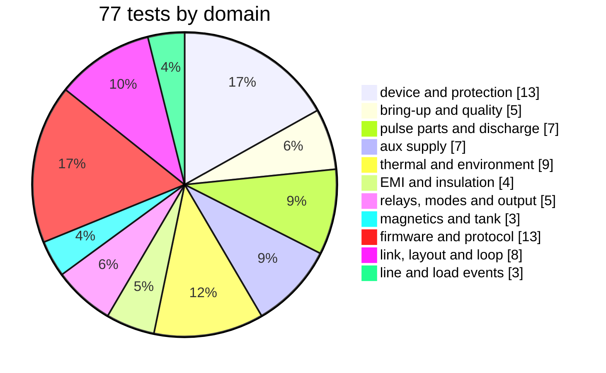
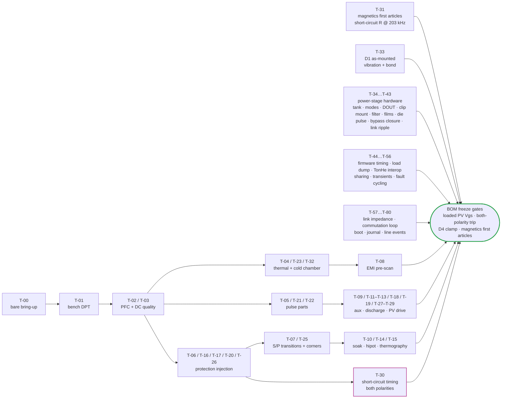

# 🔬 EVT Test Plan

The first-hardware campaign, test by test, and the rule that lets bench results reopen a calculation

  
  
  

> [!NOTE]
> **Purpose** — the first-hardware campaign for the board pairs: what each test does, how it is run, what passes,
> and which results gate the BOM freeze. End-of-line production tests derive from subsets of it.

> [!IMPORTANT]
> **The reopen rule.** Every test logs to the [verification matrix](verification-matrix.md). A simulation-vs-bench
> delta **above 20 % reopens the owning calculation or simulation** — the model is recalibrated before anything
> downstream of it is trusted.

## At a glance

<table>
<tr><td valign="top" width="52%">

| Domain | Tests |
|---|---|
| Device and protection | T-01 · T-06 · T-16 · T-17 · T-20 · T-26 · **T-30** · **T-37** · **T-41** · **T-42** · T-62 · T-63 · T-70 |
| Bring-up and power quality | T-00 · T-02 · T-03 · T-10 · T-19 |
| Pulse parts and discharge | T-05 · T-21 · T-22 · T-27 · T-28 · T-56 · T-77 |
| Aux supply | T-09 · T-11 · T-12 · T-18 · T-29 · T-55 · T-68 |
| Thermal and environment | T-04 · T-15 · T-23 · **T-32** · **T-33** · **T-38** · **T-43** · T-73 · T-79 |
| EMI and insulation | T-08 · T-13 · T-14 · **T-39** |
| Relays, output modes and output stage | T-07 · **T-35** · **T-36** · **T-40** · T-45 |
| Magnetics and tank | T-25 · **T-31** · **T-34** |
| Firmware, control and protocol | T-44 · T-46 · T-47 · T-48 · T-49 · T-52 · T-53 · T-54 · T-64 · T-65 · T-66 · T-67 · T-75 · T-80 |
| Link, layout and commutation loop | T-57 · T-58 · T-59 · T-60 · T-61 · T-71 · T-72 · T-74 |
| Line and load events | T-69 · T-76 · T-78 |

</td><td valign="top" width="48%">

</td></tr>
</table>

**Preconditions:** boards assembled minus SiC for T-00 bare bring-up · lab aux input · HV supply + 3-φ
variac / source · programmable load · LISN · thermal chamber.

## 1. Core campaign (T-00…T-10)

| ID | Test | Method / acceptance |
|---|---|---|
| T-00 | Bare bring-up | Aux rails from lab supply: V24/V15/V3P3 ±5%; MCU boot; HMI digits/buttons; all relays click-test via CAN service mode; gate pulses into dummy loads (PWM-disabled isolation check); 1 h CAN soak with 0 errors |
| T-01 | Bench DPT | Fixture on AC-DC + DC-DC positions; compare Vds_pk/dv/dt/Eon/Eoff vs `dpt-*-metrics.csv`; recalibrate the models; freeze the final Rg from the bench |
| T-02 | PFC quality | 30 kW pair @330/400/475 V: PF, THD-40 vs sim (≤5% spec; sim said ≤1.05%); midpoint dev <10 V; phase-loss foldback (F.09) |
| T-03 | DC output quality | Envelope sweep vs `llc-opmap.csv`: accuracy after cal (±0.5%/±1%), ripple ≤±0.5%, CV↔CC transitions, burst ripple at 5% load |
| T-04 | Thermal | Chamber 25→55→75 °C at full/derated power: Tj estimators vs thermocouples, choke/xfmr hotspots vs D1/D3 limits, fan curves; validates the clip-mount j→base Rth (T-38, 0.8 K/W) and the derating curve, against the [thermal report](thermal-report.md) spreading figures (upper face ≤ 0.045 K/W, lower ≤ 0.098 K/W at the 30 kW 330 VAC corner). Measure **BOTH** extrusion base temperatures and the inlet/outlet air ΔT at the 55 °C inlet, full power — expected base 74 / 75 / 77 °C (30 / 40 / 50 kW air, `mount.mjs AIR_REF`), module air rise 16–18 K; **STOP above 80 °C base** — a miss reopens `mount.mjs` and every Tj gate |
| T-05 | Pulse parts | Precharge ×20 cold-hot cycles (R temp <180 °C); discharge ×10 from 830 V — bus below 60 V inside the per-SKU window of T-22, resistors survive |
| T-06 | Protection injection | Each row of [protection thresholds](protection-thresholds.md): forced trip, measured threshold/latency vs table; DESAT via drain short-pulse jig; OVP via bus pump; watchdog kill line |
| T-07 | S/P transition | 100 cycles LOW↔HIGH under FSM at 0 A: contact currents (Rogowski) < 30 A; weld-detect provoked with forced stuck relay (jig) |
| T-08 | EMI pre-scan | LISN conducted 150 k–30 M, CISPR-32-class limits informal; gap analysis feeds the filter revision. One full-bridge LLC (no interleave) and the star-X2 filter — the filter pre-scan is **T-39** |
| T-09 | Aux robustness | Brown-out/black-out of bus 650→300 V: UVLO chain holds gates low (F.26), no spurious pulses (scope on 6 gates); harness-pull test: safe stop. **D4 rev E fault matrix at 830 and 860 V:** (a) V24 hard short on the harness side of RAUX24, (c) V15 short, (d) FB open (lift QAUXFB) — QAUX Id peak ≤ 8 A (current probe), D4 search-coil B̂ ≤ 310 mT, Vds ≤ 1360 V and DCLA Vr ≤ 1360 V (HV differential probe), NCP1252D latches within 10–20 ms, no component damage; (b) V24 short AT CAUX24 (no RAUX24 in the loop — the residual component-failure case) at 830 V only, record Id / B̂ / latch time, sacrificial unit; record whether VCC decays to 9 V while latched (latched ICC vs the 0.43–0.90 mA start-up feed) — restart after AC cycling only is the accepted fail-safe. Clamp: Vc ≤ 460 V at the limit current (FB-open) with the first-article leakage |
| T-10 | Soak + CAN | 48 h at 80% power cycling 25/100%; CAN 1 Hz telemetry integrity, HMI address persistence, fault-snapshot readout; energy counter vs meter ±2% |

### From EVT to end-of-line

End-of-line derives from the T-00 / T-03 / T-06 subsets: 100 % = aux, isolation (PWM-off), hipot
(AC-DC 2.5 kV pri–PE 1 min; DC-DC primary ↔ secondary covered at part level at 4.0 kV DC 100 % per the magnetics acceptance rows,
plus 1.5 kV out–PE), calibration (V/I two-point), limited-power functional (5 kW into a load bank), relay / fan / HMI check.
Sampling = thermal spot (1/50), full envelope sweep (1/200), PD on the transformer lot sample (5/lot).

---

## 2. Protection, aux, pulse parts and rails (T-11…T-29)

| ID | Test | Pass criterion |
|---|---|---|
| T-11 | Cold-start matrix 285–475 VAC × bus charged/discharged | boots everywhere incl. cold-start ≤13 s at 285 VAC, ≤8.5 s at 400 VAC (worst case: VCC(on) 14.9 V max, CVCC +20 %, ICC1 max through the 940 k feed); aux brown-out (NCP1252D, divider 2×1.2M/7.5k) brown-in 327–363 V, brown-out 306–336 V — the IBO hysteresis source adds 24 V to the 321 V brown-out |
| T-12 | Programming-session thermal watch (SWD attached, bus at 830 V, MCU held in reset 10 min) | discharge chain stays OFF; no component > 60 °C rise |
| T-13 | Filter-cap soak 475 VAC 48 h | CX ΔT ≤ 10 K, no capacitance loss > 5 % |
| T-14 | Hipot + touch-leakage **with all sense chains fitted** | 4 kV pri↔sec < 5 mA (Y-caps dominated), leakage < 3.5 mA |
| T-15 | KPRE thermography at rated line current 1 h | contact rise ≤ 30 K; mirror readback consistent |
| T-16 | Gate-enable glitch capture, 1000 power cycles | zero gate pulses while GATE_EN_x low (scope-latched) |
| T-17 | CT front-end linearity ±150 A line / ±100 A resonant + OC steps | ≤ 1 % to 120 A; F.02 **and F.11** trip points ±5 % — **F.01 120/155/195 A pk on 22/18/13 Ω, F.11 140/180/220 A pk on 0.47/0.36/0.30 Ω**; linear through F.xx + the 3 µs race; no ADC injection (AVMID bias); AVMID spectrum clean |
| T-18 | Aux load-dump **at the per-SKU load table**: all relays pull-in + fans 100 % at 65 °C ambient | V24 ≥ 22.8 V, V15 ≥ 13.5 V; aux switch ≤ 110 °C; D24 PIV scope ≤ 300 V at 850 V bus |
| T-19 | 3.3 V rails both boards, 55 °C, full driver load | 3.30 ± 0.15 V; buck Tj-est < 105 °C |
| T-20 | FLT injection (driver DESAT jig on one LLC channel) | F.02 latch on the card ≤ 10 ms; the whole bridge stops (the HRTIMER fault input kills every PWM output) and restarts only after a CLEAR |
| T-21 | Bank discharge: shutdown from series 1000 V and parallel 500 V | both banks < 60 V within 2× τ table; F.21/F.21b timing per SKU; resistor ΔT per pulse spec |
| T-22 | Precharge/discharge timing per SKU (extends T-05) | t95 within ±25 % of **193 / 231 / 310 ms** (30/40/50 kW); discharge ≤ 3/4/5 s (deck 1.99/2.39/3.19 s); pulse parts < 180 °C at the 50 W parts on the 50 kW modules |
| T-23 | CM choke thermography at rated line current per SKU (extends T-04) | ΔT ≤ 45 K on the D7 windings |
| T-25 | Tolerance-corner gain capability (deliberate worst-bin trim + low-Lm transformer build) | bank_max ≥ 525 V at full load |
| T-26 | PFC fast-trip timing, BOTH current polarities | measured threshold-crossing → gate-off ≤ the registered budget on every phase; CT polarity ↔ comparator-trip polarity confirmed per phase; DESAT covers the forward direction, the comparator the reverse; with VREFP swept ±3 % (bench supply on the card's 3.3 V) the measured crossings of every comparator follow the programmed volts within ±1 % — the codes are the inverse of the corrected measurement |
| T-27 | Discharge hold-up waveform | active phase reaches ≤~330 V before aux brown-out; passive continuation matches the per-SKU 370/222/296 s model ±tolerances; label wait verified with residual-V measurement |
| T-28 | PV bleeder loaded drive | loaded V_GS, drain current and FET temperature with the exact orderable QDIS part across the declared ≤70 °C bleed ambient; discharge time per bank model |
| T-29 | Aux cold-start waveform — **also at −30 °C after cold soak** | first switching ≤11 s from AC apply at 320–480 VLL (worst case 10.7 s at 320 VLL); VCC never crosses VCC(off) during soft-start + takeover; V15 floor during commanded bleed recorded (feeds T-28) |

## 3. Coordination, copper and environment on real hardware (T-30…T-32)

| Test | Procedure | Pass criterion |
|---|---|---|
| T-30 | **DESAT / short-circuit timing with the fitted blanks (18 pF LLC, 47 pF Vienna)** — SC type I (turn-on into short) and type II (fault under load) at 830 V (LLC) / 415 V half-bus (Vienna), Tj 25 °C and hot, both current polarities; Rogowski + Vds/Vgs capture | measured fault-to-gate-off ≤ **75 % of the vendor tSC** (and ≤ 1.5 µs LLC / ≤ 3.15 µs Vienna); no false DESAT over 10⁴ normal turn-ons at the hot corner; F.11/F.01 comparator trips land within ±5 % of **140 / 180 / 220** A pk (tank window, both polarities) · 120 / 155 / 195 A pk (line) |
| T-31 | **First-article AC resistance + class-current thermal** — D3 short-circuit R at 203 kHz, both halves shorted (the leakage fixture, impedance analyser, 25 °C); D2 Rac at 203 kHz; then the bonded thermal type test at the copper corner (70.5 / 93.4 / 116.1 A rms tank current) | D3 short-circuit R inside the **1-D … MKF bracket** on the module magnetics page (8.3–10.4 mΩ at 30 kW · 4.7–6.1 mΩ at 40 / 50 kW) — the reading decides which copper model the D3 thermal margin rests on, and sets the lot line at the first-article median + 10 %; D2 Rac inside its drawing row; hot-spot ≤ 125 °C at 55 °C inlet (D2, D3). **50 kW air D3:** at MKF's copper the hot-spot computes 130 °C — if the reading lands near the MKF end, widen the foil band (32 mm → 125 °C, 36 mm → 121 °C) after an insulation-coordination check. **D3 adds an open-secondary 140 kHz check and an S1 thermocouple at the core corner (ENV500-55)** (gap fringing is invisible to shorted-secondary Rac); S1 within +10 K of the S2 reading. A miss is a construction error: re-check strand size, foil gauge, lay-up, gap split |
| T-32 | **Cold soak −30 °C, 4 h, then start and ramp** — per SKU in the chamber, 330 and 475 VAC | aux starts per T-29; precharge inside the EOL window ×1.3; the output ramps on the normal start ramp to full current (no cold power limit is applied); no F.xx trip; e-cap ESR/ripple, fan start and magnetics self-warming logged |

## 4. Bonded PFC chokes on real hardware (T-33)

| Test | Procedure | Pass criterion |
|---|---|---|
| T-33 | **D1 as-mounted resonance search and endurance (IEC 60068-2-6)** — one module per SKU with the drawn D1 mount (gap pad, GF-PPS clamp cap, bore sleeve, M6 at 4.5 N·m on a Belleville, 2-point banding, strain-relieved leads): pre-test L₀, 4-wire Rdc and bonded-face thermal (the `stress-audit` [D1-BUILD] type-test current); 0.5 g sine search 10–500 Hz, 1 oct/min, 3 axes, accelerometers on the clamp cap and the stack top; 2 g sweep; 10 min dwell at each resonance with transmissibility > 2; final 0.5 g search. Then the D1 rows of T-04 at 330 VAC / 55 °C inlet with a thermocouple at the inner bore | no mode shift > 10 % between searches (nothing loosened); no pad walk, fretting or cap cracking; lead joints intact (cross-section one joint per SKU); L₀ and Rdc inside ±5 % of the pre-test values; residual bolt torque ≥ 80 %; bonded thermal rise within the pre-test value + 3 K; T-04 bore hot-spot ≤ the `stress-audit` D1 value + 10 K |

## 5. Power-stage hardware and startup (T-34…T-43)

The full-bridge LLC, the two output modes, the output diode, the clip mount, the star-X2 filter, the film-only banks and the
right-sized dies each carry a model basis that only hardware can confirm. Each row names the engine line it closes.

| Test | Procedure | Pass criterion |
|---|---|---|
| T-34 | **Full-bridge tank first article** — assembled D2 rev F + two D3 rev D cells + Cr bank per SKU: Lr by impedance analyser with the secondaries shorted, per-cell leakage, Lm; then fr sweep at 10 % power; ZVS capture on all four switches at PAR 150/500 V and SER 500/1000 V; PFM→phase-shift entry at 1.45·fr | D2 within ±3 %, cell leakage within ±30 % of computed (0.172 / 0.09 / 0.09 µH), assembled fr within ±5 % of 140 kHz; Vds reaches 0 before every gate edge on the PFM legs; phase-shift entry without a gain step > 2 % |
| T-35 | **Output modes and zero-current relays** — 200 LOW ↔ HIGH changes in standby (CAN force-LV / force-HV and AUTO at 500 / 480 V); Rogowski on KSER / KPARA / KPARB; a forced-welded KPARA (jig) | contact current < 1 A at every operation (switched only behind DOUT at 0 A); 74HC02 exclusion never allows SER and PAR together (scope-latched); the welded KPARA latches **F.17** at the SER soft start before the banks see a short |
| T-36 | **Output blocking diode DOUT** — 1 h at rated current per SKU with a thermocouple on the case; external 1000 V source applied to the output studs with the module off and in standby | Tj estimate within +10 K of the gate (115 / 120 / 123 / 128 °C at 100 / 133 / 167 / 167 A); back-feed current ≤ the DOUT leakage class, no bank charge-up |
| T-37 | **Tank over-current kill** — secondary-short jig at PAR 400 V full power and at SER 250 V; resonant CT + window comparator; D2 search coil | kill at F.11 140 / 180 / 220 A pk ±5 %; measured kill peak ≤ the gate's (210 / 261 / 320 A at +1 µs); D2 B̂ at the kill ≤ 217 mT; no FET damage after 10 shots |
| T-38 | **Clip-mount Rth** — thermocouple under one die per position on the base / plate (drilled groove), DC Rds heating at a known loss, clip force by load cell; Al2O3 hipot | j→base **≤ 0.92 K/W** (0.8 K/W + 15 %, air, 70 °C base) and j→plate **≤ 0.75 K/W** (0.65 + 15 %, liquid, 65 °C); clip force inside the clip vendor's band; 2.5 kV DC die-to-sink hipot pass. A miss reopens `thermal/mount.mjs` and every Tj gate |
| T-39 | **Star-X2 EMI filter** — LISN conducted scan 150 kHz–30 MHz at 400 VAC full power per SKU; damper resistor thermography; line impedance steps Lg 0 / 30 / 100 µH; X2 star-node voltage at 475 VAC | DM margin within 6 dB of `lisn-precompliance` (32.9 / 30.6 / 28.7 dB) and ≥ +3 dB to the limit; damper resistor ≤ 50 % of its rating (3.1 / 4.0 / 5.9 W model); no sustained oscillation at any Lg; star node ≤ 274 VAC per cap. The LLC bridge is a second CM source: measure the LLC leg-node-to-PE capacitance (≤ 100 pF requirement, 50 pF target with a shielded pad) and the CM margin at 150–250 kHz with CY1-3 at 10 nF (ladder: +3.1 / +7.1 dB at 100 / 50 pF); **STOP below +3 dB** → fit the shield and re-run the ladder; touch current per module ≤ 3.5 mA on its own PE conductor (T-14) |
| T-40 | **Film-only output banks** — output ripple at PS150-Imax (150 V, Imax) and SER 250 V full power with a 20 MHz-limited differential probe; film case thermocouples | output ripple **≤ 0.5 % RMS** (model 0.47 / 0.46 / 0.49 %); per-film current ≤ 10.5 A (model 3.8 / 3.7 / 3.9 A); film ΔT ≤ 15 K |
| T-41 | **SiC die pulse class on incoming samples** — 5 dies per lot per MPN, single 10 µs pulse at 80 % of the RFQ IDM line, VDS 50 V, 25 °C | no parametric shift (Rds(on) ±5 %, Vth ±0.2 V, IDSS within datasheet) at SG2M023120LJ 212 A (IDM ≥ 265 A) · 750 V 20 mΩ class 168 A (≥ 210 A) · 15 mΩ class 208 A (≥ 260 A). A lot or MPN that fails reverts that SKU (two LLC dies / B3M010C075Z) |
| T-42 | **Precharge-bypass closure** — per SKU at 475 VAC on the stiffest available source (≥ 500 kVA, short cable), 20 cold starts with the closure instant uncontrolled; Rogowski on one line, bus voltage, FLT line and relay coil current captured | peak ≤ the [INRUSH] row + 20 % (200 / 218 / 280 A) · no F.01 latch and no PFC PWM inside the 60 ms window · bus ≤ 860 V · relay contact resistance after 1 000 closures ≤ 1.2 × initial · fuse element intact (no pre-arc discolouration) |
| T-43 | **DC-link electrolytic HF ripple** — per SKU at the worst LLC corner (PAR 400 V full power and SER 250 V): clip-on HF current probe on one can lead of each half-bank plus one film leg, can-top thermocouples, 1 h soak | per-can rms (120 Hz-equivalent, vendor frequency multipliers) ≤ the purchased series' 105 °C rating; can-top ΔT ≤ 10 K. The drawn link is 16 × 1 µF bridge entry film (20 × on the 50 kW pair) plus a 2.2 µF / 0.33 Ω damper (`spice/dclink`), predicted per-can **1.97 / 2.36 / 1.83 A rms** at the PAR400 corner and 0.9–1.0 A at the phase-shift corner — the test reproduces the deck within +40 % or reopens it; **STOP above 60 % of the can class** |

## 6. Firmware, control and protocol on real hardware (T-44…T-56)

The host suites prove logic and conformance to documents; only the target and the power stage can prove timing, loops and
interoperability. The IDs in brackets are rows of the [firmware verification plan](firmware-verification.md).

| Test | Procedure | Pass criterion |
|---|---|---|
| T-44 | **Firmware timing on the target** — DWT per ISR for 24 h at full telemetry and under a CAN flood; GPIO markers on the reference commit and on GATE_EN; analyzer timestamps | PFC ISR ≤ 3 µs · LLC ISR ≤ 30 µs · 1 ms tick ≤ 400 µs · CPU ≤ 60 % steady, ≤ 75 % under flood · control frame → reference ≤ 5 ms (99.9 %) · FAULT_BITS ≤ 20 ms after an injected latch (N-11, F-04) · a watchdog and a software reset at every discharge transition resume the bounded dump, never precharge · a fault pulse injected at every boundary between the enable decision and the CHOUTEN write never re-arms an output |
| T-45 | **Load dump at full current** — contactor opened under 167 / 133 / 100 A in LOW (480 V) and HIGH (950 V), with and without the output clamp | peak ≤ V_set · 1.05 + 10 V · no F.13 latch · banks and terminal capacitors inside their ratings (C-08) |
| T-46 | **TonHe V1.2 interoperability** — our module on a TonHe-class monitor (start, setpoints, groups, the 20 s loss, addressing); a mixed rack with a TonHe module; captures of a real TonHe module replayed against the `proto_test` expectations | every frame read as the monitor expects · sharing within ± 10 % in the mixed rack · TH-AMB-1…11 confirmed or re-registered (N-14, G-08) |
| T-47 | **Parallel sharing** — four modules on one output in CC and CV (battery emulator reaching its CV point), voltage calibration spread ± 0.3 % on purpose; hot join, member removal, one module derated with the LEVEL law | ± 5 % of the average at ≥ 10 % load · ± 10 % within 3 s of a change · group sum ≤ request + 1 % (G-01…G-07) |
| T-48 | **Control transients** — C-01…C-12 per SKU: soft start, voltage and current steps, 25 ↔ 100 % load steps, CV ↔ CC, the power-limit crossing, a 330 → 285 VAC sag at full load, frequency-response injection | the performance targets of firmware architecture §5.5 · PM ≥ 45°, GM ≥ 6 dB at every envelope corner |
| T-49 | **Fault and recovery cycling** — 1 000 cycles each of grid sag, phase loss, over-temperature (heater on the NTC), communication loss, relay feedback open, watchdog reset and aux brownout | every cycle ends in the documented state and recovers by the documented rule · no lockout from grid rows · no spurious gate pulse (D-03, D-05) |
| T-52 | **Boot and update on the target** — 100 field updates over CAN at each bit rate incl. power cuts at every stage (block, FINISH, trial boot 1–3, confirm), a corrupted image, a foreign signature, a downgrade below the baseline, and the reset-streak path into safe mode | the confirmed image always runs · no cut leaves an unbootable module · every refusal matches `boot_test`'s codes · trial confirm at 60 s healthy standby exactly |
| T-53 | **Watchdog window on the fitted TPS3430** — WDI/WDO/NRST scoped over −40…105 °C: the 10 ms kick train, boot-to-first-kick incl. the bootloader's chunked verification, one deliberately early (< 2.22 ms) and one late (> 23.375 ms) kick | normal operation never resets · the early and the late kick each reset through NRST · gate enables provably low through every reset |
| T-54 | **Fan tach curve calibration** — the selected fan's tach vs duty at 24 V ± 10 %, −20…70 °C, clean and dust-loaded | `APP_TACH_FULL_HZ` set from data · the 35 % curve floor sits ≥ 2 × above the healthy worst case at every duty ≥ 20 % · a blocked rotor and a 50 % obstruction both fail inside 3 s · 20 / 60 / 120 Hz injected at the tach pins read 600 / 1 800 / 3 600 rpm, and 10 Hz at full duty fails the curve |
| T-55 | **Auxiliary fault matrix** — per-rail budgets with the FINAL fan MPN (steady, cold fan start, stall), feedback open/short, one rail unloaded, reservoir/rectifier short; V15/V24 TVS energy and clamp voltages recorded | rails inside their windows at every corner · a feedback fault ends within the TVS pulse ratings with the downstream absolute maxima honoured · fan inrush does not brown the control domain |
| T-56 | **PV bleeder drive hot and humid** — loaded V_GS and bank decay with the exact MOSFET at 85 °C / 85 % RH coupons and the LED at its rail floor | measured decay ≤ 1.5 × the drawn model · V_GS ≥ V_th(max) + 2 V loaded · a contaminated coupon still meets the F.21b window |

**What T-44 checks against.** A static estimate from the compiled interrupt paths
([firmware architecture §3.5](firmware-architecture.md)) puts the PFC update at ≈ 2.5 µs typical and ≈ 4.5 µs at a line-cycle
close, the LLC update at ≈ 2.4 µs and all contexts at ≈ 35 % CPU, with both control interrupts in TCM RAM. T-44 records the
typical and the line-cycle-close PFC update separately. The hard deadline is the carrier roll-over at ≈ 7.2 µs, and the
single-update-per-carrier fallback is **forbidden on 40 / 50 kW** — at a 30 µs transport delay the input-filter modulus margin
falls to 0.26 / 0.39 against a ≥ 0.50 criterion — so a miss is fixed in the ISR, not in the update rate.

## 7. Full-system validation on the bench (T-57…T-64)

These rows close what the models cannot, and each one names the gate it reopens on a miss. Expected values are the design's own
numbers (CALCULATED / SIMULATED); nothing here is measured yet.

| Test | Procedure | Pass criterion |
|---|---|---|
| T-57 | **Assembled DC-link impedance** — VNA / impedance analyser DCP–DCN looking in from the LLC bridge, 10 kHz–5 MHz, bridge films fitted and removed; extracts the stud/pillar and Vienna-film stub inductances the `spice/dclink` deck assumes (40 nH / 60 nH) | measured stud loop ≤ 40 nH and stub ≤ 60 nH, or the deck is re-run with the measured values before any full-power HIGH-mode run; the first anti-resonance sits above 500 kHz with the 16 µF film fitted |
| T-58 | **ZVS and adaptive dead time at the light corners** — PS150-Imax and PAR200-Imax per SKU with the turn-off snubbers fitted; leg-node and gate captures; the programmed dead time read from the HRTIMER over the corner sweep | leg B and both PFM legs reach the rail before the incoming gate at every corner (residual ≤ 20 V) on the charge rule above the 120 ns floor. **Leg A in phase shift is programmed by `weak_dead_s()` = 0.82·(π/2)·√(L_r·C_node) = 125 / 186 / 189 ns, not by a magnetising-current rule** — at load the zero state ends with the rectifier conducting, the leg swings on the decayed tank current through L_r alone and returns from its valley in about a quarter period, so its residual is bounded and mapped rather than zero; a miss reopens `tanks.mjs cs` and the schedule |
| T-59 | **Double pulse at the real currents** — extends T-01: LLC at 650 V / 91–148 A, 725 V / 101–165 A and 830 V / 68–110 A with the per-SKU C_s and R_g,off 0 Ω; Vienna at 95 / 124 / 157 A on both half-cycles (the drawn RCD clamp is single-polarity) | V_ds,pk ≤ 80 % of rating at every row, channel E_off ≤ the `dpt-llc-metrics.csv` value + 30 %, freewheel-gate Miller peak ≤ 1.4 V hot; a miss freezes R_g,off / C_s from the bench and re-runs the grid |
| T-60 | **CV load step at the stud with the film-only bank** — 100 → 50 → 100 % and 25 ↔ 100 % resistive steps through DOUT and a 5 m cable, every SKU, LOW and HIGH modes; stud and cable-end captures | overshoot ≤ 10 % at the stud, recovery ≤ 50 ms, no F.14 (mode-max × 1.05 + 20 V / 2 ms); the cable-end ring is recorded for the EVSE integration note (the SIL predicts up to +28 % at the far end into a low-capacitance load) |
| T-61 | **Input-filter damper integrity** — CDMP disconnected on one phase at 50 kW full load, 30 µH grid; grid-current spectrum 2–45 kHz | the 8–10 kHz filter resonance is visible (the switched model predicts 76 / 195 % of fundamental at 40 / 50 kW undamped) and the firmware residual monitor warns/derates within 1 s; with the damper fitted the content stays ≤ 5 % — a miss reopens `pfc-control` and the damper values |
| T-62 | **Bypass auxiliary chain** — with one KPRE held open (coil disconnected) and with one contact bridged (weld emulation): start attempt and the post-run weld test | held-open: the PFC never starts and F.19 latches (series NO chain HIGH); bridged: the mirror contact is read during the commanded discharge over `PMP_WELD_MS` (200 ms) and F.18 is reported when the dump ends, taking precedence over F.21; no state passes both |
| T-63 | **F.01 on both CT orientations** — line-CT fitted both ways in turn; current injection to the 120 / 155 / 195 A pk line in both half-cycles. The comparator references are **positive-only** — a sub-AVMID threshold on a non-inverting comparator into an active-high fault input would be a standing fault — so the negative polarity is the 100 kHz software magnitude trip (T-70) | the hardware trip fires within the row's class on the POSITIVE half-cycle for both orientations, the software trip answers the negative one inside one PWM period, and Σi = 0 gives the other two comparators a hardware answer at 2 × I_trip; attribution F.01-A/B/C correct |
| T-64 | **PFC interrupt budget** — `pfc_exec_us` telemetry and a GPIO marker over 24 h at full telemetry, CAN flood, line-cycle close, and the 3 kHz current-loop injection | the deadline is the carrier roll-over, ≈ 7.2 µs, and the interrupt enters ≈ 2.8 µs after the trigger (ADC end-of-sequence DMA, not a timer compare): **entry at 2.8 µs, exit before 10 µs, with no alternation between consecutive periods; typical ≤ 3.5 µs**. If the budget is missed the ISR is trimmed further — the single-update fallback is not an option on 40 / 50 kW (T-44 note) |

## 8. Port, boot and device-physics closure (T-65…T-80)

The register-level GD32G553 port and both control interrupts have never run on silicon, and the commutation-loop inductance
cannot be closed on paper at all. These rows are what the bench has to answer; each names the gate or constant it reopens on a
miss.

| Test | Procedure | Pass criterion |
|---|---|---|
| T-65 | **Watchdog timing through the whole boot path** — scope WDI, WDO and NRST through boot, image check, a slot erase and a journal compaction, from slot A **and** from slot B; then a `while(1)` build | first WDI edge < 23 ms after NRST, then an edge every 10.0 ± 0.2 ms, **never two closer than 2.3 ms and never a gap > 20 ms**, WDO never low with good firmware; the hang build resets in **< 60 ms**. A miss reopens the service points in `boot_main.c` / `nvmport.c` |
| T-66 | **Journal on the real flash** — write and read 100 calibration-size records; cut power inside an append **50 times** | every boot mounts, no record is lost without a power cut, and **no NMI loop** (`port_flash_ecc` may count). A miss reopens `hal/nvm.c`'s row layout |
| T-67 | **Factory reference word** — print `ti.vrefint` at the first tick | **1490 ± 5 %** (1.20 V × 4096 / 3.3 V). Anything near the V24 slot's count means the ADC divider or INREFEN did not take |
| T-68 | **NCP1252 latch behaviour** — short V24 for 1 s and release, at a 565 V and at an 800 V link; then power up with every load connected | the aux **restarts by itself within 15 s** at both link voltages (it must be able to drop below V_CC(off) against the start-up string), and a fully loaded power-up does not latch (15 ms fault timer against a 32–51 ms soft start). A miss raises the start-up string or bleeds V_CC |
| T-69 | **Line-CT acceptance** — 10 A / 100 ns edge into each CT; then ratio with 5 A DC superimposed; **three samples** | ≤ **1 µs to 90 %** of the step and ratio within 1 % with the DC present. A fail switches the design to the drawn shunt + iso-amp fallback |
| T-70 | **Negative-polarity F.01** — inject a negative line-current fault with the positive-only comparator references fitted | the **software magnitude trip stops the stage inside one PWM period** (≤ 10 µs) and the outputs stay off until the supervisor re-arms |
| T-71 | **Commutation loop and the double pulse** — ring-down on one LLC leg and one Vienna leg first, then DPT at 830 V with I_off swept **30 → 160 A**, and a C_s sweep of 330 / 680 / 1000 pF on a two-die leg | external loop **≤ 10 nH** — the basis of every over-voltage and k_off number, and **load-bearing, not a preference**: the same deck re-run at 20–30 nH reads 90–103 % of 1200 V at R_g,off 0 Ω. Above 10 nH the choice is a gate resistor **and** a second 30 kW die or a fold, decided on the measured k_off. Pick the **smallest C_s that meets the overshoot line at the real loop** — every pF costs C_s·V²·f in the weak leg |
| T-72 | **Weak-leg node through phase shift** (extends T-58) — probe the leg-A node at 25 / 50 / 100 % load through the phase-shift region and sweep `LLC_DT_WEAK_K` | the measured residual is at or below the firmware's map (`hal/dielim.c`, gated by `fw-constants-sync` against every phase-shift row of the deck). The map errs high by design; this row is what relaxes it |
| T-73 | **Link damper case temperature** — `R_FDMP` case temperature at a point that genuinely runs at f_max (PAR300 on a 725 V link, SER500 at 650 V) | inside the 50 W TO-247 part's rating on its heatsink clip at the **7 / 16 / 36 W** per-SKU duty; < 120 °C. A miss reopens the resistance value and the mounting |
| T-74 | **Link-can ripple current** — current probe on one DC-link can at 400 VAC and again at 340 VAC, full power | ≤ **6.8 A rms** and case < 75 °C at 400 VAC. 340 VAC is the declared exceedance (99–112 % of the allowance) and the measurement decides which lever is spent: forced air, a taller can, or + 1 can per half |
| T-75 | **Vehicle-style command** — setpoint at the pack maximum with the pack far below it | the link **follows the pack, not the command** (`PMP_BUS_LEAD_V` 25 V), so the bridge does not sit in deep phase shift against 830 V across the mainstream range |
| T-76 | **Line return after a sag** — −30 % sag for 60–200 ms with return, on the stiffest source available; then an injected F.01 on a quiet line | the F.01 at the return is **reported as F.08, uncounted, and clears by itself** after a re-precharge; on a quiet line an injected F.01 still latches. A miss reopens `PMP_LINE_EVT_K` / `PMP_LINE_EVT_MS` |
| T-77 | **Sacrificial precharge resistor** — one `RPRE` across a deliberately shorted link | it **opens without flame**. Nothing in the module can disconnect 4.8–8.4 kW from that part, so the fail-open behaviour is the protection |
| T-78 | **Load dump at an 830 V link** — full power at 475 VAC into an electronic load, open the load contactor, cans at the low end of tolerance | the repo's switched plant reads **833 V** and an independent model **856–872 V** against the 860 V trip; the bench decides. If it agrees with the plant, the two zero-cost levers taken as insurance (skip band 15 → 9 V, integrator bound) may be reverted |
| T-79 | **Junction observer end to end** — at a 55 °C inlet, drive the corners of the [thermal report](thermal-report.md) fold table | each fold appears as `PMP_DR_THERMAL` with the listed availability, and a **declined** point reads **0 A available, not a fault**; a stop and a fresh start at a healthy point delivers (the refusal is not inherited through the warm hold). A miss reopens `DIELIM_*` and the loss coefficients |
| T-80 | **Driver-bias collapse → global inhibit** — drop one gate-bias module at a time with PWM present at safe energy (Stage 5 conditions), each of the seven channels in turn; scope DRV_RDY, both GATE_EN and every gate | DRV_RDY low → both enables low within 1 µs and every gate off; the module reports SAFE within 2 ms and needs a fresh ENABLE; restoring the bias restarts nothing |

> [!TIP]
> **How this page is checked** — nothing here is checked by a gate yet — that is the point of the page. Every row logs back into the [verification matrix](verification-matrix.md), and a simulation-vs-bench delta above 20 % reopens the owning calculation.

---

<a href="verification-matrix.md">← Verification Matrix & Risk Register</a> &nbsp;·&nbsp; <a href="README.md">🧭 Documentation hub</a> &nbsp;·&nbsp; <a href="firmware-verification.md">Firmware Verification Plan →</a>

Vectivolt DC-Modules · documentation rev E84 · every number reproduces with <code>sh calculations/run-all.sh</code>

