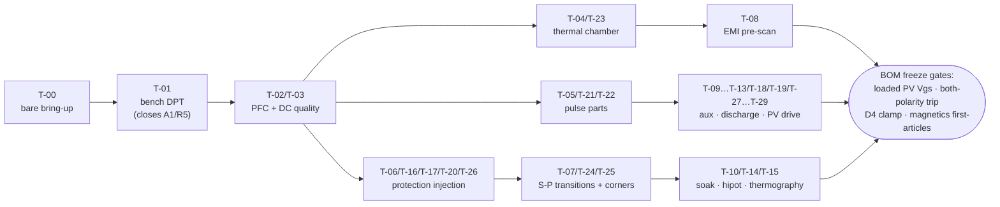

# EVT Test Plan (§49-25) — first-article board pairs, rev A

  

> **Purpose** — First-hardware test plan T-00…T-32 + EOL derivation; sim-vs-bench deltas >20 % reopen the owning calc.

Preconditions: boards assembled minus SiC (T-00 bare bring-up), lab aux input (§28), HV supply +
3-φ variac/source, chroma load, LISN, thermal chamber. Every test logs to the verification matrix;
sim-vs-bench deltas >20% reopen the owning calc/sim.

| ID | Test | Method / acceptance |
|---|---|---|
| T-00 | Bare bring-up | Aux rails from lab supply: V24/V15/V3P3 ±5%; MCU boot, link CRC soak 1 h 0 errors; HMI digits/buttons; all relays click-test via CAN service mode; gate pulses into dummy loads (PWM-disabled isolation check §45) |
| T-01 | Bench DPT | Fixture on AC-DC + DC-DC positions; compare Vds_pk/dv/dt/Eon/Eoff vs `dpt-*-metrics.csv`; recalibrate models (closes A1/R6); freeze final Rg from bench |
| T-02 | PFC quality | 30 kW pair @330/400/475 V: PF, THD-40 vs sim (≤5% spec; sim said ≤1.05%); midpoint dev <10 V; phase-loss foldback (F.09) |
| T-03 | DC output quality | Envelope sweep vs `llc-opmap.csv`: accuracy after cal (±0.5%/±1%), ripple ≤±0.5%, CV↔CC transitions, burst ripple at 5% load |
| T-04 | Thermal | Chamber 25→55→75 °C at full/derated power: Tj estimators vs thermocouples, choke/xfmr hotspots vs D1/D3 limits, fan curves; validates Rth 0.032 assumption + derating curve |
| T-05 | Pulse parts | Precharge ×20 cold-hot cycles (R temp <180 °C), discharge ×10 from 830 V (t<60 V ≤2.2 s, resistor survival), pre-insertion ×50 at ΔV 20 V |
| T-06 | Protection injection | Each row of protection-thresholds.md: forced trip, measured threshold/latency vs table; DESAT via drain short-pulse jig; OVP via bus pump; watchdog kill line |
| T-07 | S/P transition | 100 cycles LV↔HV under FSM at 0 A: contact currents (Rogowski) < 30 A; weld-detect provoked with forced stuck relay (jig) |
| T-08 | EMI pre-scan | LISN conducted 150 k–30 M, CISPR-32-class limits informal; compare interleave on/off (**50 kW — E60 restated from the retired 60 kW board**); gap analysis feeds filter rev |
| T-09 | Aux robustness | Brown-out/black-out of bus 650→300 V: UVLO chain holds gates low (F.26), no spurious pulses (scope on 6 gates); harness-pull test (R11): safe stop |
| T-10 | Soak + CAN | 48 h at 80% power cycling 25/100%; CAN 1 Hz telemetry integrity, HMI address persistence, fault-snapshot readout; energy counter vs meter ±2% |

EOL (production, §45) derives from T-00/T-03/T-06 subsets: 100% = aux, isolation (PWM-off), hipot
(AC-DC: 2.5 kV pri-PE 1 min; DC-DC: 3.5 kV pri-sec via transformer already covered at part level +
1.5 kV out-PE), cal (V/I two-point), limited-power functional (5 kW into load), relay/fan/HMI check.
Sampling = thermal spot (1/50), full envelope sweep (1/200), PD on transformer lot sample (5/lot).

---

## Rev C additions — review-mandated tests (T-11…T-18)

| ID | Test | Pass criterion |
|---|---|---|
| T-11 | Cold-start matrix 285–475 VAC × bus charged/discharged | boots everywhere incl. cold-start ≤8 s (R6-G budget); aux BO brown-in 310–335 V (NCP1252D) |
| T-12 | Programming-session thermal watch (SWD attached, bus at 830 V, MCU held in reset 10 min) | discharge chain stays OFF (E19 rev B); no component > 60 °C rise |
| T-13 | Filter-cap soak 475 VAC 48 h | CX ΔT ≤ 10 K, no capacitance loss > 5 % |
| T-14 | Hipot + touch-leakage **with all sense chains fitted** | 4 kV pri↔sec < 5 mA (Y-caps dominated), leakage < 3.5 mA |
| T-15 | KPRE thermography at rated line current 1 h | contact rise ≤ 30 K; mirror readback consistent |
| T-16 | Gate-enable glitch capture, 1000 power cycles | zero gate pulses while GATE_EN_x low (scope-latched) |
| T-17 | CT front-end linearity ±150 A line / ±100 A resonant + OC steps | ≤ 1 % to 120 A; F.02 **and F.11** trip points ±5 % — **E60 classes: F.01 120/155/195 A pk on 22/18/13 Ω, F.11 85/115/145 A pk on 1.2/0.91/0.75 Ω** (the R2 2.0 Ω burden set the 70/95 A class, below the simulated peaks); linear through F.xx + the 3 µs race; no ADC injection (AVMID bias, CB-15); AVMID spectrum clean (MR-11 buffer) |
| T-18 | Aux load-dump **at the per-SKU load table (R2 §J)**: all relays pull-in + fans 100 % at 65 °C ambient | V24 ≥ 22.8 V, V15 ≥ 13.5 V; aux switch ≤ 110 °C; D24 PIV scope ≤ 300 V at 850 V bus (CB-19) |

### Rev D additions (R2 re-audit closure)

| ID | Test | Pass criterion |
|---|---|---|
| T-19 | 3.3 V rails both boards, 55 °C, full driver load | 3.30 ± 0.15 V; buck Tj-est < 105 °C (CB-17/18) |
| T-20 | FLT injection (driver DESAT jig on one LLC channel) | F.12 latch on the card ≤ 10 ms; no flux-walk on adjacent sections (CB-21) |
| T-21 | Bank discharge: shutdown from series 1000 V and parallel 500 V | both banks < 60 V within 2× τ table; F.21/F.21b timing per SKU (HR-15/HR-14); resistor ΔT per pulse spec |
| T-22 | Precharge/discharge timing per SKU (extends T-05) | **E60 per-SKU deck:** t95 within ±25 % of **193 / 231 / 310 ms** (30/40/50 kW); discharge ≤ 3/4/5 s (deck 2.0/2.4/3.2 s); pulse parts < 180 °C at the 50 W parts on the 50 kW modules |
| T-23 | CM choke thermography at rated line current per SKU (extends T-04) | ΔT ≤ 45 K (D7 windings, HR-18) |
| T-24 | Dual-relay pair current share (Rogowski both paths) — **E60: on the 50 kW dual K_OUT at 167 A** (the 120 kW single-board row is retired) | worst split ≤ 60/40 at rated current, or pair re-binned (HR-19) |
| T-25 | Tolerance-corner gain capability (deliberate worst-bin trim + low-Lm transformer build) | bank_max ≥ 525 V at full load (CB-22 / §37 yield fix validated in hardware) |
| T-26 | PFC fast-trip timing, BOTH current polarities (E47/E48) | measured threshold-crossing → gate-off ≤ the registered budget on every phase; CT polarity ↔ comparator-trip polarity confirmed per phase; DESAT covers the forward direction, CMP the reverse |
| T-27 | Discharge hold-up waveform (E47/E49) | active phase reaches ≤~330 V before aux brown-out; passive continuation matches the per-SKU 370/222/296 s model ±tolerances; label wait verified with residual-V measurement |
| T-28 | PV bleeder loaded drive (R8) | loaded V_GS, drain current and FET temperature with the exact orderable QDIS part across the declared ≤70 °C bleed ambient; discharge time per bank model |
| T-29 | Aux cold-start waveform (R6-G) — **also at −30 °C after cold soak (A11 rev C)** | first switching ≤10 s from AC apply at 320–480 VLL; VCC never crosses VCC(off) during soft-start + takeover; V15 floor during commanded bleed recorded (feeds T-28) |

## E60 additions — coordination and AC copper on real hardware (T-30…T-31)

| Test | Procedure | Pass criterion |
|---|---|---|
| T-30 | **DESAT / short-circuit timing with the E60 blanks (22 pF LLC, 47 pF Vienna)** — SC type I (turn-on into short) and type II (fault under load) at 830 V (LLC) / 415 V half-bus (Vienna), Tj 25 °C and hot, both current polarities; Rogowski + Vds/Vgs capture | measured fault-to-gate-off ≤ **75 % of the vendor tSC** (and ≤ 1.5 µs LLC / ≤ 3.15 µs Vienna); no false DESAT over 10⁴ normal turn-ons at the hot corner; F.11/F.01 comparator trips land within ±5 % of 85/115/145 · 120/155/195 A pk |
| T-31 | **First-article AC resistance + class-current thermal** — every D2/D3 winding at 140 kHz (impedance analyser; D3 shorted-secondary method), then ΔT at the class current (46.4 / 61.9 / 77.3 A rms) | Rac within **+15 %** of the conductor-audit row (D3 Rac/Rdc ≤ 1.35 per winding; D2 ≤ 4.0 / 2.6 / 2.0 mΩ); ΔT ≤ 40 K (D2) / hotspot ≤ +55 K (D3). **D3 adds an open-secondary 140 kHz check and an S1 thermocouple at PAR-525** (gap fringing is invisible to shorted-secondary Rac); S1 within +10 K of the S2 reading. A miss is a construction error: re-check strand size, foil gauge, lay-up, gap split |
| T-32 | **Cold soak −30 °C, 4 h, then start and ramp (A11 rev C competitor parity)** — per SKU in the chamber, 330 and 475 VAC | aux starts per T-29; precharge inside the EOL window ×1.3; FW-R3 soft limit engages and releases; no F.xx trip; e-cap ESR/ripple, fan start and magnetics self-warming logged |
