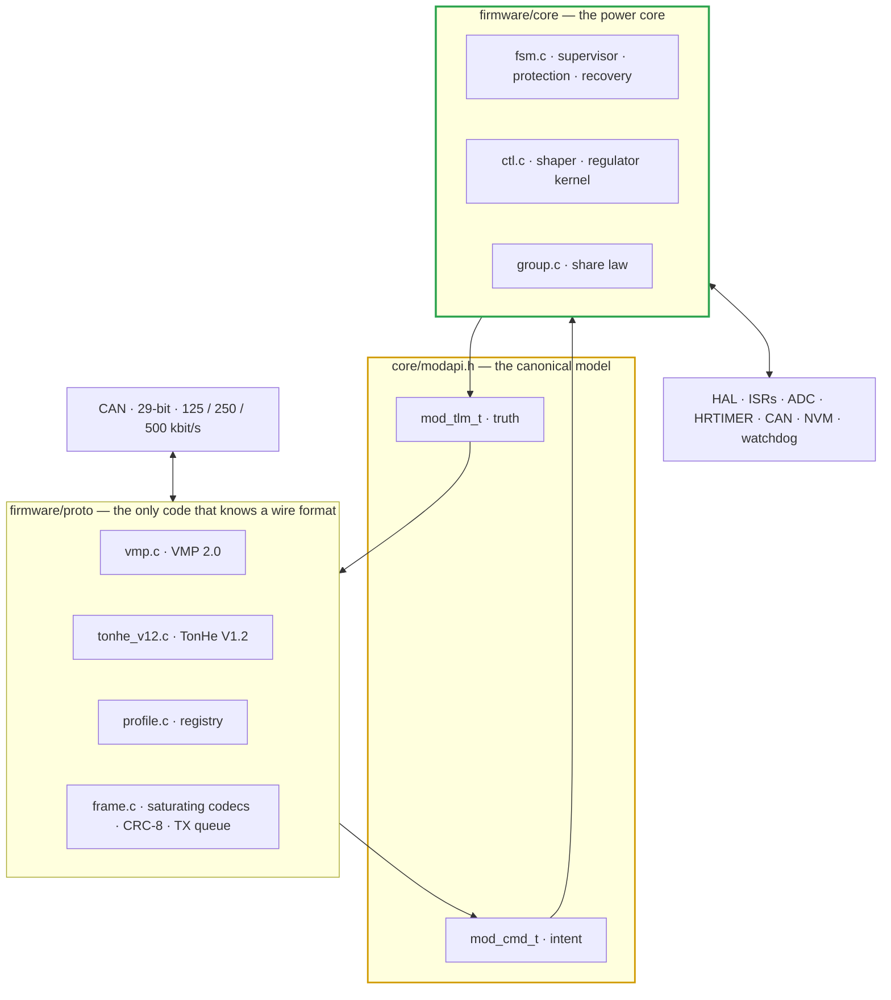
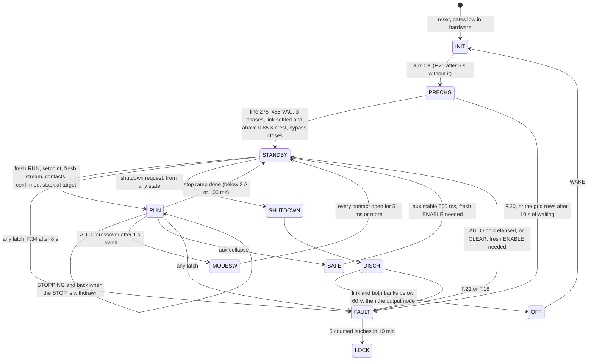
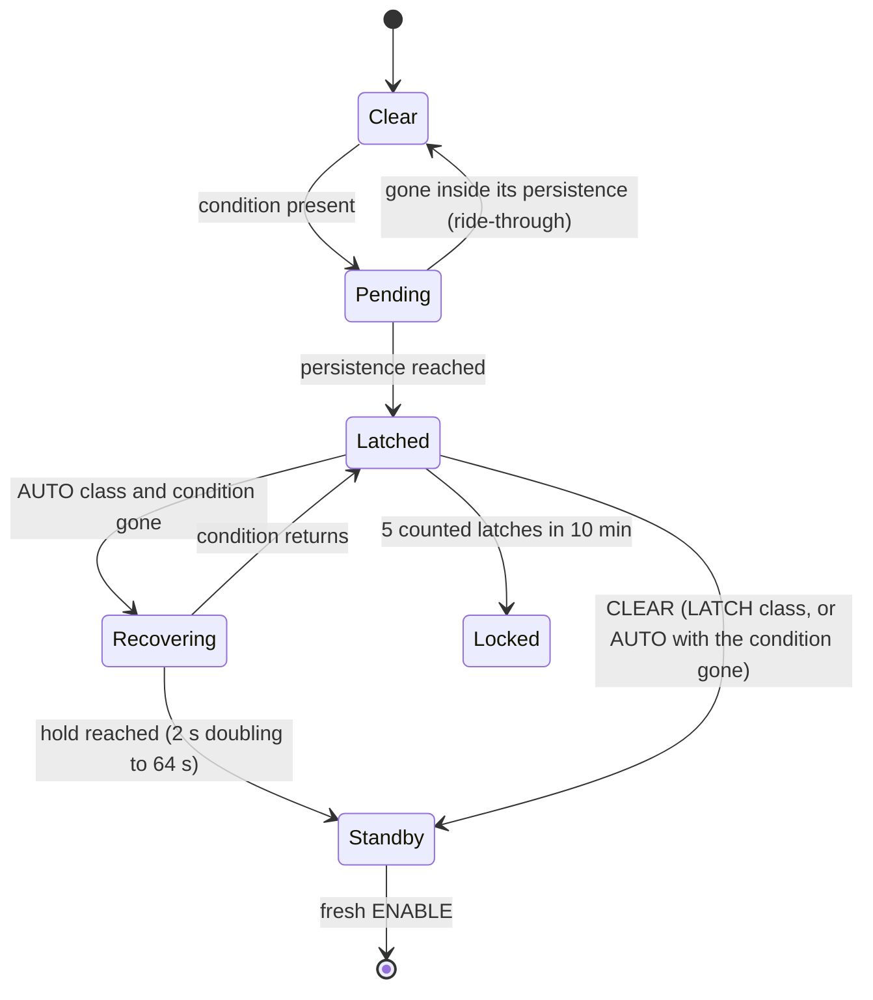
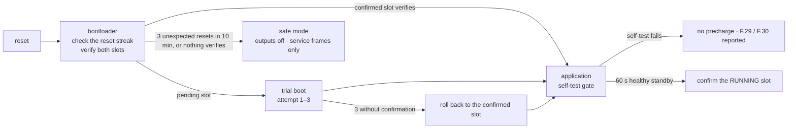
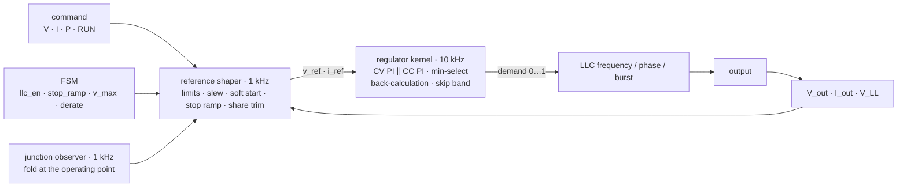

# 🧬 Firmware Architecture

Layers, timing, state machines, control and ramping, the protection hierarchy and exception handling

  
  
  
  

> [!NOTE]
> **Purpose** — the module firmware end to end: the layers and what each may know, the execution model and its timing budget,
> the state machines, the control and ramping strategy, the protection hierarchy, how every abnormal condition reaches a
> deterministic state, persistent data and firmware update, and the performance targets.
>
> **Gate coupling** — `firmware/run_tests.sh` (in `run-all`) runs the host suites `boot_test` · `host_sim` · `ctl_test` ·
> `proto_test` · `hal_test` · `app_test` · `rules_test` under AddressSanitizer + UndefinedBehaviorSanitizer (fatal) and
> `-Werror`. The protocols are specified in [VMP 2.0](can-protocol.md) and the
> [TonHe V1.2 profile](can-profile-tonhe-v12.md); the test matrix is the
> [firmware verification plan](firmware-verification.md).

## At a glance

| | |
|---|---|
| **Layers** | protocol profiles → one canonical model → power core (`fsm` · `ctl` · `group`) → HAL → MCU port |
| **Execution** | bare metal, time-triggered: three control interrupts + a 1 ms scheduler · no heap · no RTOS · no locks |
| **Protocols** | VMP 2.0 (native) and TonHe V1.2 — one profile per boot, chosen from the stored configuration; TonHe can be left out of an image at build time |
| **Protection** | six response levels; every F.xx row carries a recovery class — AUTO_EXT · AUTO_INT · LATCH · LOCK |
| **Smoothness** | bumpless soft start from the output node, slew-limited references, a 100 ms controlled stop, min-select CV/CC with back-calculation anti-windup, CV share trim |
| **MCU** | one GD32G553VET7 runs both stages. The 100 kHz Vienna interrupt is raised by the ADC end-of-sequence DMA transfer: it starts ≈ 2.8 µs after the trigger and has ≈ 7.2 µs to the roll-over that loads the compare shadows, against ≈ 5.8 µs of work counted from the disassembly (§3.5) |
| **Verified on the host** | the 26 fault scenarios, every-tick invariants, both protocols against their documents, fuzzed frames, the Vienna and LLC laws on cycle-by-cycle plants, the application end to end, the signed boot chain on a row-granular program-once flash model, the adaptive dead time and the weak-leg edge, the junction observer and the FSM rows |
| **Before hardware** | loop gains on HIL (§5.4) · T-44/T-47/T-48 on silicon · HW-REC-1/4/5 (§10) — the register port itself is built and gated (`firmware/port/gd32g553/`, no vendor library) |

## 1. Principles

Nine rules the whole tree obeys. Each exists because its opposite has a known failure mode, and each is enforced by a test.

1. **The core knows no wire format.** Timeouts, event-versus-level semantics, fault maps, scalings, addressing and cadence
   belong to the profile — the communication timeout included, because a monitor that sends setpoints only on change is
   silent for seconds by design and a fixed core timeout would make a drop-in profile impossible.
2. **Every protection row carries a recovery class.** Grid events are the grid's and never count toward the lockout; the
   module's own rows count. A profile with no clear command would otherwise park a module until a power cycle after one sag.
3. **Nothing energized is unsupervised.** Every commanded contact is checked against its mirror, and the soft start,
   precharge, discharge and control interrupts each have a bound — the unbounded version presents as a module that does
   nothing and says nothing.
4. **Values are sanitized at every boundary they cross, from both sides.** A non-finite value that reaches a comparison makes
   every row false and the converter runs blind; one that reaches an integer cast on the wire path is undefined behaviour.
5. **Stops are ramps.** The current goes out over ≤ 100 ms before the gates drop: cutting the LLC at full current is a step
   at the vehicle inlet, and into a resistive load it reads as a short.
6. **Delivery needs a fresh request** after any module-initiated stop, fault, reset or controller restart. A held ENABLE or a
   resumed frame stream must never restart a module by itself.
7. **Hardware is the fast path; firmware re-asserts it.** Firmware may tighten a hardware threshold, never loosen it, and it
   holds a tripped stage off until the supervisor has seen and latched the trip.
8. **One value has one owner.** Constants shared with `calculations/` are copied under a gate that fails the build when the
   copies drift; counters saturate; time is unsigned modular arithmetic.
9. **Nothing is documented as implemented that is not.** A row with a specified behaviour and no code is the failure mode
   this section exists to prevent.

## 2. Architecture

**The rules that keep a vendor out of the core**

1. **Knowledge flows one way.** A profile includes `core/modapi.h`; no file in `core/` includes anything from `proto/`. A
   profile never touches `pmp_in_t` or `pmp_fsm_t` — it writes `mod_cmd_t` and reads `mod_tlm_t`.
2. **A vendor is a file pair and a registry row.** `proto/<vendor>.{h,c}` plus one line in `profile.c`.
3. **One profile per boot.** The stored profile id is read once; a new id applies at the next boot; nothing changes profile while
   the converter is energized. `PMP_WITH_TONHE_V12=0` removes the TonHe profile from an image.
4. **Defence in depth on values.** A profile range-checks what it decodes and encodes through saturating conversions; the core
   sanitizes commands and measurements again — neither trusts the other.
5. **Pulses are consumed once.** CLEAR, SHUTDOWN and WAKE are one-tick pulses that `pmp_cmd_to_in()` copies and clears.

| File | Owns |
|---|---|
| `core/fsm.{h,c}` | supervisory state machine, protection rows, recovery classes, relay supervision, controlled stop, discharge |
| `core/ctl.{h,c}` | reference shaper (1 kHz) and regulator kernel (control ISR) |
| `core/group.{h,c}` | the share law — lower at once, raise after a hold, staggered joins, stale → zero |
| `core/modapi.{h,c}` | `mod_cmd_t`, `mod_tlm_t`, run-state mapping and the glue into the FSM and shaper |
| `proto/frame.{h,c}` | frame type, little-endian packing, `pmp_sat_*`, CRC-8/AUTOSAR, priority-aware bounded TX queue |
| `proto/profile.{h,c}` | profile table: name, bit rate, `rx`, `tick` |
| `proto/vmp.{h,c}` | VMP 2.0 — the identifier and object tables of record |
| `proto/tonhe_v12.{h,c}` | TonHe V1.2 — every rule and ambiguity of that document |
| `hal/pfc.{h,c}` | the Vienna law — current loops, modulation, the voltage loop in power, skip and burst, the amplitude limit |
| `hal/llc.{h,c}` | the LLC modulator — PFM, phase shift, burst, the ZVS floor, the per-leg dead time |
| `hal/dielim.{h,c}` | the junction observer and the operating-point fold |
| `hal/meas.{h,c}` | calibration, reference correction, the grid monitor, NTC, rating strap |
| `hal/nvm.{h,c}` · `hal/evlog.{h,c}` | the power-cut-safe record store · the event ring |
| `hal/app.{h,c}` | interrupt entries, the 1 ms sequence, supervision, relays, fans, panel, CAN recovery, NVM policy — sans-IO |
| `boot/` | the signed image, the boot decision record, the service-space update protocol, SHA-256 and ECDSA-P256 |
| `port/gd32g553/` | the register-level MCU port: clocks, HRTIMER, ADC and DMA, comparators and DAC, CAN, flash, watchdog |
| `test/` | the host evidence (`run_tests.sh`) |

**The 1 ms sequence the HAL runs** — supervise the interrupt heartbeats · measure and run the HAL's own rows · drain received
frames into `profile->rx` · `profile->tick` · `pmp_cmd_to_in` · `pmp_fsm_step` · `pmp_cmd_to_ctl` · the junction observer ·
`pmp_ctl_step` · commit references to the control interrupts · acknowledge the hardware trips this tick carried · outputs,
fans, panel · fill `mod_tlm_t` · events · NVM policy · CAN recovery · grant the watchdog its permission.

## 3. Execution model and timing

### 3.1 Contexts and budgets

| Context | Rate / trigger | Work | WCET budget | NVIC priority |
|---|---|---|---|---|
| HRTIMER fault ISR | fault edge | attribute the latched channels (the silicon has already stopped the PWM); F.11 against F.02 from the freshest completed I_RES conversion; hold both stages off until the tick acknowledges | ≤ 50 µs | 0 (highest) |
| PFC control ISR | 100 kHz, carrier peak and valley — raised by the **ADC end-of-sequence DMA transfer**, not by a timer compare, which is crossed twice per period and equal-spaced only at mid-count | three current loops on resistive emulation, midpoint balance, the voltage loop, the magnitude trip; every 10th update hands a sample set to the 10 kHz context; duty loaded at the next half-period | entry at ≈ 2.8 µs, **deadline ≈ 7.2 µs** to the roll-over | 1 |
| LLC control ISR | 10 kHz, HRTIMER master repetition | the grid monitor and the boot offset window on the handed-over samples, the bus fold-back, `pmp_reg_step`, `llc_step` | ≤ 30 µs | 2 |
| Tach edges | EXTI, two pulses per revolution | one counter increment | ≤ 2 µs | 13 |
| 1 ms scheduler | SysTick | the sequence of §2 · slow ADC and plausibility · 10 ms slice (fans, relay economizer, HMI) · 100 ms slice (NVM journal, statistics, CAN recovery) | ≤ 400 µs (40 %) | 14 (lowest) |

CAN has no interrupt: the tick drains the receive mailboxes into a ring and pushes up to eight frames per tick from the
transmit queue while mailboxes are free. Because the control interrupt is the ADC's own end-of-sequence, a dead ADC or DMA
channel means no interrupt at all rather than a loop on frozen samples, and the heartbeat check below surfaces it in a tick.

CPU load ≤ 60 % steady and ≤ 75 % worst case, measured with DWT at EVT T-44. Flash erase and program run from the 100 ms
slice; both control interrupts and the vector table live in RAM, so an append never stalls them or the exception entry that
reaches them.

### 3.2 Data exchange without locks

- **References to an ISR**: the scheduler writes a shadow structure and sets a commit flag; the ISR copies it at entry. One
  writer, one reader, no partial reads — with compiler barriers ordering the shadow stores against the flag, because C11
  orders volatile against volatile only.
- **Measurements from an ISR**: sequence-counter snapshots — the writer makes the counter odd while it writes and the reader
  retries until it copies an even, unchanged value. Where a faster writer feeds a slower reader, the writer decimates and
  publishes into a double buffer, so there is no read-divide-clear race.
- **Fault events**: one counter per kind, one writer each; a preemption can lose a count, never the inequality the tick tests.
- **No mutexes, no RTOS** — deadlock and priority inversion cannot occur. **No heap** — the linker heap is zero.
- **Stacks** are painted at reset and scanned at 1 Hz (the scan costs ≈ 43 µs for a byte that moves on a scale of minutes):
  warning at 70 %, F.36 at 90 %.
- **Unhandled faults** — HardFault, MemManage, BusFault, UsageFault, the low-voltage detector and any unexpected vector — force
  every HRTIMER output to idle-inactive, drive both stage enables low and then spin **without servicing the watchdog**, so the
  external supervisor resets the card through NRST. Gates are low by hardware through reset and boot.

### 3.3 Deadline supervision and the watchdog

| Check | Rule | Outcome |
|---|---|---|
| ISR heartbeats | at each 1 ms tick: PFC ISR count advanced 100 ± 2, LLC ISR 10 ± 1 | a miss is an overrun event |
| Execution time | DWT per ISR; an overrun is execution beyond its own period | counted, high-water in diagnostics (VMP object 0x0500) |
| Overrun verdict (`ctl_overrun`) | ≥ 10 overrun events inside a 100 ms window, **or** three ticks inside that window that each saw three or more LLC periods missing | **F.35** LATCH. A single late millisecond is not evidence — the hardware trips do not depend on this row, so it can afford to wait — but a stopped interrupt still latches inside 3 ms |
| Collapsed backlog | a tick that stands for several lost milliseconds is flagged `late`: the heartbeat re-baselines and judges nothing | the firmware's own flash writes cannot latch F.35 |
| Watchdog cadence | SysTick pulses WDI every 10 ms of **real** time, so a blocking flash erase cannot bunch two edges inside the supervisor's early window or stretch past its late one | the fixed window is 2.22–23.375 ms |
| Watchdog permission | each edge spends a token, and the tick tops the purse up only when both control interrupts advanced on each of the last ten ticks; a flash operation buys its own bounded allowance | a hung main loop is reset ≤ 30 ms plus one window later, even though SysTick is still running |
| Reset cause | the raw reset-flag byte is read at boot, classified by the HAL and published (VMP object 0x000A) | a watchdog reset raises F.32 once; there is no automatic restart |

The supervisor's WDO is wire-ORed onto NRST, so a missed window both drops the gates and resets the MCU: a hung brain restarts
with every enable low instead of re-arming milliseconds later with its enable pins still latched high.

### 3.4 Sampling, filtering and latency

| Signal | Sampling | Filtering | Latency to use | Plausibility |
|---|---|---|---|---|
| PFC phase currents | 100 kHz, synchronous with the carrier | none in the loop; a per-line-cycle DC estimate is subtracted before the loop acts | ≤ 15 µs sample to duty | comparator windows in hardware, plus a 100 kHz magnitude test on the raw current; Σ I beyond 10 % of rated for 20 ms → F.29 |
| AC line voltages | sampled with the currents; every 10th set (10 kHz) goes to the grid monitor | feed-forward with the divider's RC lag rotated out; RMS per line cycle | one line cycle for the RMS rows | 45–65 Hz on a live line (F.37); the lowest and highest line each feed their own rows |
| Output V and I, banks, resonant current | 100 kHz | ten samples decimated into each 100 µs control period · 1 ms mean for the FSM and shaper · the profile's period for telemetry | ≤ 100 µs loop · ≤ 60 ms telemetry age | V_out not far below a delivering stack (F.29) |
| Bus halves | 100 kHz | 1 ms mean | 1 ms | each half within its own ceiling (F.06, F.38) |
| Temperatures | every tick from the ADC ring | the zone map of §7 | 1 s | open NTC or cutout loop reads 150 °C instead of "very cold" |
| ADC health | every tick | — | — | the internal reference within ± 5 % for 100 ms, the AVMID bias 1.65 V ± 50 mV for 100 ms → F.29 |

A plausibility row only affects what it covers. F.29 latches when a signal a protection row depends on is invalid for its
persistence (3 ms).

### 3.5 One MCU for both stages

**Yes.** The GD32G553VET7 runs the Vienna PFC, the LLC and the supervisory stack from one Cortex-M33 core, on two conditions:
both control interrupts execute from TCM RAM, and EVT T-44 / T-64 confirm the budget below with the DWT counter. The port
enforces the first condition — `app.ld.in` places the whole 100 kHz path (`pfc_step`, the ISR glue, `grid_sample`, the DMA
readers) in TCM and the built ELF proves it.

| Resource | Needed | GD32G553VET7 |
|---|---|---|
| Core | single-precision float in the 100 kHz path | Cortex-M33 at 216 MHz, single-precision FPU, DSP extension |
| PWM | LLC legs A and B with hardware dead time, programmed **per leg every 10 kHz step** and clamped to 120–900 ns · three Vienna phases on one carrier · a hardware kill | HRTIMER at 145 ps; ST0 / ST1 for the legs and ST3–ST5 for the phases; fault channels for CMP0 · CMP1 · CMP2 · CMP3 · CMP4 and the FLT wire-OR |
| Analog | 5 channels per PFC update, 6 per LLC period, about 14 slow | four 12-bit ADCs at up to 5.3 Msps each — about 15 % used |
| Fast protection | 5 comparators with DAC references | 8 comparators, DAC internal outputs |
| Communication | one CAN at 125–500 kbit/s | 3 CAN-FD |
| Memory | the signed application image is ≈ 50 KB of its 207.5 KB slot (≈ 24 %) and the bootloader ≈ 12 KB of its 32 KB; `app_t` with both profile contexts is ≈ 6 KB of state | up to 512 KB flash · 128 KB SRAM including 32 KB TCM |

**The budget that decides it** is an instruction count from the disassembly of the shipped 100 kHz path — ≈ 1 250 cycles
≈ **5.8 µs** static — against the **≈ 7.2 µs** the trigger leaves before the roll-over, plus the measurement itself (T-64,
through `pfc_exec_us` / VMP object 0x0500). The bring-up STOP criterion is **≤ 5 µs worst case**.

If it is ever missed, the honest levers are a lower current-loop crossover (≈ 1.5 kHz, accepting the THD) or more damping on
the input filter. **One PFC update per carrier period is not a lever**: at the resulting 30 µs transport delay the current
loop's modulus margin against the drawn input filter falls to 0.26 (40 kW) and 0.39 (50 kW) against the project's own
≥ 0.50 criterion — 0.61 and 0.71 at 15 µs — and the switched model oscillates. CPU was bought back instead by moving the
line-cycle work out of the 100 kHz interrupt, decimating the means in the writer and enabling the flash prefetch buffer. The
card is pin-compatible with the STM32G474VET7 as a second source, but at 170 MHz that part would force the forbidden
fallback, so the production primary is chosen after T-64.

## 4. State machines

### 4.1 Module lifecycle (the core)

`RUN` includes `DERATE` (one delivering super-state) and the controlled-stop sub-phase. STANDBY is warm for 60 s after a STOP,
then cold — PFC off and matrix open at zero current, because a standby under 10 W cannot be held with the PFC switching. A
FAULT exit routes back through PRECHG whenever the bypass is open, since STANDBY with an open bypass never starts (the PFC
waits for the bypass feedback) and never says why.

### 4.2 A latched row

A LATCH-class row replaces a self-clearing one; equal or lower classes are dropped, so the first cause wins. Without that, a
grid sag followed by the DESAT it provoked would lose the DESAT, self-clear after its hold and restart into the faulted leg.

### 4.3 Protocol sessions

| Profile | States | Fresh request after a module-initiated stop |
|---|---|---|
| VMP 2.0 | boot hold → unaddressed (ANNOUNCE 1 Hz) → addressed → owned (fresh stream) → stale (ownership lapses, core ramps out) → owned | RUN must be seen 0, then 1 — after boot, after a timeout, after a fault, after a controller restart (new heartbeat session) |
| TonHe V1.2 | listening → commanded (start) → stopped (stop) or communication lost (20 s) | a new start command (0xAA) — the V1.2 start is an event |

"A restart after a reset needs a fresh request" lives in the profile, not the core, because what counts as fresh differs: a
level must be seen low, an event must arrive. A core-level hold would strand a TonHe module whose one start command arrived
during precharge.

### 4.4 A group member (`group.c`)

not a member → joining (hold 1.3 s + rank × 300 ms) → sharing (lower at once, raise after 1.3 s; a grown target restarts the
hold) → stale after the timeout (share 0) → joining again.

### 4.5 Boot and update

The changed record is stored **before** the jump, so a power cut can repeat a trial boot but never skip one. The application
confirms the slot it is actually running, not whatever the record calls pending — the two diverge when a store fails, and
confirming the wrong one would promote an image that never executed.

## 5. Control and ramping strategy

### 5.1 Structure

### 5.2 The shaper

| Rule | Value | Why |
|---|---|---|
| Soft start | the voltage reference starts at min(output node, target) | bumpless into a battery: no inrush, no reverse step |
| Voltage reference rise | 500 V/s (config 1–5 000) | 0 → 750 V in 1.5 s; the TH750 class publishes a 2–4 s soft start |
| Voltage reference fall | twice the rise | a lowered command is followed promptly; the output itself falls only through the load |
| Current reference rise | 1 000 A/s (config 1–10 000) | 10 → 90 % of 166.7 A in 0.13 s |
| Current reference fall and stop | rated → 0 in 80 ms | inside the FSM's 100 ms stop window |
| Current target | min(command, availability, rated power ÷ V, power command ÷ V, group share) | the lowest limit wins and is named in telemetry |
| Availability | rating × FSM derate × (1 − junction fold) × min(1, V_LL / 330) | constant input current below 330 VAC; the fold is §5.4 |
| Power → current | at max(V_out, ½ × knee) | the divide guard; below half the knee the rated current binds anyway |
| Share trim | 0.002 V per A·s of (peer average − own current), clamped to ± 1 % of the command; only in CV with ≥ 2 members above 5 % of rated; decays with τ = 5 s otherwise | the members' errors sum to zero, so the group voltage does not drift. The rate is deliberately slow: a module in CV is a near-ideal source, so its share moves by 1/R_series — 5–15 mΩ — per volt of trim, and a faster loop hunts against peer currents that arrive every 200 ms (VMP) or 500 ms (TonHe) |
| Droop | off by default (config 0–0.5 Ω) | accuracy first; for sites without CAN sharing only |

The final voltage target is clamped to the mode window *after* the trim and droop, or the trim's authority carries the command
past the ceiling.

### 5.3 The regulator kernel

Both regulators act on the same variable — the LLC's gain (frequency, then phase shift, then burst) — so they run side by side
and the lower demand is applied (min-select) rather than cascaded. Back-calculation (τ_t = 1 ms) pulls each integrator toward
the demand actually applied: for the selected loop the pull is zero unless the demand is clamped or skipped (no windup); the
idle loop settles τ_t · k_i · error above the applied demand, so it takes over exactly where its own limit is reached, without
a step. An output above v_ref · 1.03 + 5 V forces zero demand until it falls below v_ref · 1.01 — the firmware image of the
cycle-by-cycle clamp of HW-REC-1. `ctl_test` proves these properties: bounded under fuzz, one-step hand-over after 5 s of
saturation, takeover within 1 A of the limit with no demand step, skip hysteresis.

The modulator underneath is fixed: above the hand-over demand, PFM from f_max down to the frequency floor at full duty; below
it, phase shift at f_max. Its sensitivity dV/du spans 23× across the envelope, so `llc_step` publishes that sensitivity and
the caller divides the voltage loop's gain by it — a plant inversion in the loop, not in the modulator, which keeps one fixed
PI pair valid everywhere without moving an operating point the cycle-by-cycle plant already validated. The frequency floor is
the higher of the tank's lowest solved point and the zero-voltage-switching boundary for the load in force, so a demand for
more gain than the tank has settles on the boundary instead of in capacitive mode.

### 5.4 Tuned on HIL, not fixed here

- **The shipped gains** are the ones the cycle-by-cycle plants validated, and they stay that way: loop gain is held constant
  across the envelope by the modulator-sensitivity normalization of §5.3, not by re-tuning the PI pair per corner.
- **The junction observer** (`hal/dielim.c`) evaluates the thermal grid's own closed-form losses for the point in force every
  millisecond — bank and link volts, frequency, phase-shift duty, tank and line current — into a first-order junction estimate
  above the measured zone NTC, and folds availability proportionally across the last 8 K below the 150 °C ceiling. It must be
  an observer, not a static map: the corners that need folding (deep phase shift at low output voltage, the series corner, low
  line on a high link) run the die 80–170 K above a base that is still cool, so the NTC ladder never moves — and every start
  crosses deep phase shift for a few hundred milliseconds, which a ceiling read from the instantaneous point would decline. A
  junction the fold cannot cool declines the point, latched until the LLC stops, or the bridge idles into burst, cools,
  delivers and cycles for ever; the refusal is not inherited through the warm hold. Every coefficient is a copy of a number in
  `calculations/`, held by `fw-constants-sync`.
- **Acceptance on every envelope corner:** CC crossover ≥ 300 Hz, CV ≥ 100 Hz, phase margin ≥ 45°, gain margin ≥ 6 dB; burst
  below 3 % load.

### 5.5 Performance targets

| Quantity | Target | Condition |
|---|---|---|
| Start, warm standby → regulated | ≤ 1.0 s | 0 → rated voltage, no load |
| Start, cold standby → regulated | ≤ 3.0 s | PFC off, matrix open, make-permit bleed included |
| Voltage setpoint step ± 10 % | ramp-limited; overshoot ≤ 1 %; within ± 0.5 % ≤ 100 ms after the ramp | resistive 20–100 % |
| Current setpoint step 10 ↔ 90 % | t90 ≤ 150 ms up, ≤ 100 ms down; overshoot ≤ 2 % of rated | battery emulator |
| Load step 25 ↔ 100 % in CV | deviation ≤ 10 % at the module stud on the drawn film-only bank (9.9–61.6 µF — the deviation is set by capacitance, not by the gains: a gain or control-period change moves it under one point); back within ± 0.5 % in ≤ 50 ms; must not reach F.13 | resistive, DOUT + 5 m cable |
| Load dump from 100 % | peak ≤ V_set · 1.05 + 10 V; no F.13 latch | EV contactor opens; needs HW-REC-1 |
| CV ↔ CC transition | current overshoot ≤ 2 % of rated; voltage overshoot ≤ 1 %; no limit cycle above 0.5 % | battery reaching its CV setpoint |
| Accuracy | V ± 0.5 % (≥ 150 V) · I ± 1 % (20–100 %) · ± 0.5 A below 50 A | after EOL calibration |
| Control-induced ripple | ≤ 0.2 % rms (≤ 0.5 % total with the hardware, T-40) | outside burst |
| Burst ripple | ≤ 1 % peak-to-peak | below 3 % load |
| Power limit | ≤ +2 % steady · ≤ +5 % for ≤ 100 ms | CP region and power command |
| Derate | reduction ≤ 10 ms · recovery ≤ 20 %/s | thermal, fan, input, junction fold |
| Current sharing | within ± 5 % of the average at ≥ 10 % of rated, CV and CC · ± 10 % within 3 s of a membership change | 2–8 modules |
| Group sum | ≤ request + 1 % at every instant | `group.c` invariant |
| Hot join | at share ≤ 3 s after the first group frame | staggered by rank |
| Member loss | the others raise after the 1.3 s hold; dip ≤ one share for ≤ 1.5 s | EQUAL law |
| Command latency | frame received → reference in force ≤ 5 ms (99.9 %) | |
| Telemetry | TLM_FAST age ≤ 60 ms, period jitter ≤ ± 5 ms · FAULT_BITS ≤ 20 ms after a latch · ACK ≤ 20 ms | VMP 2.0 |
| Communication loss | detected at the timeout ± 2 ms; current out ≤ 100 ms later | both profiles |
| Fault reaction | hardware rows per [protection thresholds](protection-thresholds.md) (≤ 3 µs OC and DESAT, ≤ 25 µs OVP) · firmware immediate stop ≤ 2 ms after persistence · controlled stop ≤ 100 ms | |
| Boot | first frame ≤ 500 ms after aux up · READY ≤ 2 s after aux up at 400 VAC | |

## 6. The protection hierarchy

### 6.1 Levels and classes

| Level | What happens | Examples |
|---|---|---|
| **L0 Warn** | reported, nothing changes | line wait, ride-through, measurement glitch, relay feedback unwired, re-arm needed, communication lost |
| **L1 Derate** | availability reduced continuously | thermal slope, fan count, input voltage, the junction fold, installer power cap |
| **L2 Limit** | a loop regulates at a boundary | CC / CV / CP, the PFC amplitude clamp, the skip band, the bus-reference floor, the ZVS floor |
| **L3 Controlled stop** | current ramps out (≤ 100 ms), then the LLC stops | STOP, communication loss, setpoint lost |
| **L4 Immediate stop** | enables drop in the tick a row fires (after its persistence) | every firmware latch |
| **L5 Hardware trip** | silicon stops switching with no firmware in the loop | F.01 · F.02 · F.03 · F.11 · F.13 · driver UVLO · watchdog |

| Class | Clears when | Counts toward F.31 | Rows |
|---|---|---|---|
| **AUTO_EXT** | the line is back inside 275–485 VAC with 3 phases for the hold | no | F.07 · F.08 · F.09 · F.37 |
| **AUTO_INT** | the condition is gone for the hold (OT: below 100 °C · fan: one runs again · aux: the rail returns, never the line) | yes | F.05 · F.06 · F.22 · F.25 · F.26 |
| **LATCH** | CLEAR (VMP ACTION; the TonHe profile has none, so a latch holds until a power cycle, as that module class does) | yes | all other rows |
| **LOCK** | power cycle or service | — | F.31 |

The hold is 2 s, doubling per consecutive AUTO latch up to 64 s; the streak resets after 10 min without an AUTO latch. Every
exit from FAULT, SAFE or a communication loss needs a fresh request (§4.3).

### 6.2 What sits where

| Category | Members |
|---|---|
| Hardware-fast protection firmware must never replace | F.01 line OC · F.02 DESAT · F.03 bus OVP · F.11 tank OC window · F.13 output OVP (CMP0, + HW-REC-1) · driver UVLO (F.26) · watchdog WDO ≡ NRST · the relay exclusion gate |
| Firmware safety protection | F.05 · F.06 · F.07 · F.08 · F.09 · F.13 mirror and sourcing rows · F.15 · F.16 · F.17 · F.18 · F.19 · F.20 · F.21 · F.22 · F.25 · F.26 · F.29 · F.33 · F.34 · F.35 · F.36 · F.37 · F.38 |
| Derating and protective control | thermal slope and recovery slew · fan count · input voltage · the junction fold · the rated-power curve · power command · group share · skip band · the PFC amplitude clamp · the bus-reference floor |
| Warnings and diagnostics | the `PMP_W_*` bits · the HAL's `APP_W_*` bits · protocol warnings (stale, conflict, TX drop, RX reject, event suppression) · statistics and events |
| Recoverable faults | AUTO_EXT and AUTO_INT rows · SAFE · communication loss (graceful, F.28) |
| Latched faults needing a clear or a power cycle | LATCH rows · F.31 LOCK |

### 6.3 Row by row

Every row's threshold, detection time, layer, action and recovery class is tabulated once, in
[protection thresholds](protection-thresholds.md) — including the exceptions that only firmware can apply: an F.01 inside
500 ms of a disturbed line filed as F.08, an F.05 re-filed as the grid's row (and its lockout count taken back) when the
line is found outside its window within 200 ms, the command-relative arm on F.15, the bypass weld F.18 read during the
commanded discharge, and the stall test that ends a dump which is not falling. This page does not repeat them.

Two codes exist in the firmware's vocabulary without a row of their own. **F.27** (internal link) is reserved: one MCU runs
both stages, the HAL feeds a zero link age, and it can never fire — it stays defined so nobody re-introduces an inter-card
link and finds the code taken. **F.28** (communication loss) is graceful by design and writes no fault code at all, which is
why it also raises a warning bit: a module that stopped with `warn = 0, fault = 0` told a technician nothing.

The two link rows (F.06, F.38) run whenever the link is charged, not only while a stage is enabled: the balance string carries
a few milliamps against a hot leakage imbalance an order larger, so an idle charged link can drift one half toward its can
rating with nothing else watching. How each row reaches a monitor on the TonHe profile is in
[that page's fault-word tables](can-profile-tonhe-v12.md#32-fault-word-m_c_1-bytes-67).

### 6.4 Anti-chatter

| Mechanism | Value | Where |
|---|---|---|
| Input hysteresis | trip 260 / 500 VAC · start and recovery 275 / 485 VAC | `fsm.c` |
| Ride-through persistence | 3–500 ms per row | `fsm.c` |
| AUTO recovery hold | 2 → 64 s doubling; streak reset after 10 min | `fsm.c` |
| Lockout window | 5 counted latches in 10 min; grid rows excluded | `fsm.c` |
| Derate recovery | ≤ 20 %/s up, immediate down | `fsm.c` |
| Mode crossover | 20 V hysteresis + 1 s dwell | `fsm.c` |
| SAFE exit | 500 ms stable aux | `fsm.c` |
| Warm hold | 60 s after STOP | `fsm.c` |
| F.01 blanking | 60 ms while the precharge bypass closes, line-OC channels only; no PFC enable inside the window | `fsm.c` · `hal/app.c` |
| Stale stream | the profile's timeout; a frozen counter never refreshes it | `vmp.c` |
| Rejection reports | ≤ 1 per 100 ms | `vmp.c` |
| Event rate limit | one EVENT per {kind, code} per 200 ms, with the drops counted | `vmp.c` |
| On-change telemetry | ≥ 20 ms (VMP) · ≥ 200 ms (TonHe) spacing | profiles |
| TonHe output warnings | 1 s persistence | `tonhe_v12.c` |
| Address conflict | clears after 10 s without a colliding frame | both profiles |
| CAN bus-off recovery | 100 ms; ten bus-offs inside a minute hold off 5 s | `hal/app.c` |

### 6.5 Deliberately not added

- No firmware bus-OV row under the 860 V hardware trip: the trip and the bus-reference clamp already cover it.
- No short-circuit retry loop inside the module; the charger decides whether to try again.
- No second firmware over-current below the CC loop; F.15 is a backstop.
- No voting between channels that have one sensor; plausibility is checked against physics instead.
- No automatic restart after a communication loss — the controller owns the session.
- No CRC on telemetry frames: CAN CRC-15 plus counters suffice. CRC-8 protects only frames that can command power or change
  configuration.
- No derate inside the normal line window.
- No phase-sequence row: any rotation is accepted, and the sequence is carried as a sign on the feed-forward.
- No PLL: the Vienna law is resistive emulation on the sensed phase voltages, and the grid monitor takes frequency and phase
  sequence from hysteretic zero crossings — there is nothing to unlock.
- No flux-walk detector on the resonant current: that channel is a current transformer sampled asynchronously to the tank, so
  it has neither DC response nor an unaliased mean. F.11 and the 130 °C bond-loss cutouts are the detectors of a real walk,
  and that remains a registered gap in the FMEA.

## 7. Thermal, cooling and derating

| Zone | Sensor | Derate from | Trip | Recover below |
|---|---|---|---|---|
| Inlet air (air SKUs) / coolant (liquid) | inlet NTC | 55 °C | 75 °C | 50 °C |
| PFC heatsink / plate | T_PFC | 95 °C | 105 °C | 90 °C |
| LLC heatsink / plate | T_LLC | 100 °C | 110 °C | 95 °C |
| Transformer loop (with the 130 °C cutouts) | T_XFMR | 105 °C | 115 °C · open loop = 150 °C | 100 °C |

The core keeps one temperature input: the HAL maps each zone onto the core's 105 / 115 °C derate-and-trip scale and hands over
the worst, so the zone closest to its own limit drives both while each zone keeps its own thresholds. Derate recovery is
slew-limited (≤ 20 %/s) and every zone recovers 5 °C below its derate onset, so derated and non-derated states cannot alternate
at the thermal time constant. The junction observer of §5.4 sits above this ladder for the corners where the die runs far
hotter than the sink.

**Fans.** Three on the 30 and 40 kW modules, four on the 50 kW air module, none on the 50 kW liquid module. Duty = max(a
temperature curve from 25 % at 60 °C to full at 100 °C, a load feed-forward of 25 % + 75 % of load), 10 % hysteresis on the way
down, ≥ 10 s minimum on-time; quiet mode caps it at 60 % and lets the thermal derate absorb the rest, boost runs 100 %.
Nothing starts until the rails have been in spec for 500 ms, and the second PWM group trails the first by 300 ms, because the
aux stage is close to its budget and its controller's over-current protection is a latch only a power cycle clears. A tach is
judged only at or above 20 % duty (below that it is too slow to judge, and the running floor when cooling is needed is 25 %);
a fan below 35 % of the speed its duty commands for 3 s has failed, against a full-speed constant calibrated at EVT. The core
derates by the failed *count*: with four fans, one failed 0.6 and two 0.3; with two or three, one failed 0.5; fewer working
fans than that is 0, which is F.25.

**Liquid (50 kW).** No fans; the coolant inlet zone plus the plate NTCs; a dry plate crosses the OT ladder in seconds. Flow
assurance belongs to the cooling cart.

## 8. Exception handling — every abnormal condition reaches a deterministic state

| Condition | Detection | Deterministic response | Recovery | Evidence |
|---|---|---|---|---|
| Divide by zero | structural guards: ½-knee floor for power → current, n ≥ 2 for averages, positive scales | a finite result | — | `ctl_test` divide guard · fuzz |
| Overflow, underflow, signed/unsigned | saturating encoders; modular unsigned time arithmetic; persistence counters saturate | clamped value | — | `proto_test` saturation · UBSan fatal |
| NaN / Inf measurement | sanitization at the core boundary, 3 ms persistence | F.29 | CLEAR | `host_sim` |
| NaN / Inf / negative command | read as zero or clamped; no start without a setpoint | READY + NO_SETPOINT, or a controlled stop | a valid command | `host_sim` · `ctl_test` |
| Invalid ADC value | range, NTC open guard, reference and bias checks | F.29 or F.22 | CLEAR | `host_sim` · HIL F-05 |
| Corrupted CAN command | CAN CRC-15, CRC-8, range, must-understand bits | rejected, NAK, state unchanged | the next valid frame | `proto_test` |
| Out-of-range setpoint | clamp to the mode window and capability | applied clamped; applied values in TLM_LIMITS (VMP), range edge (TonHe) | — | `proto_test` |
| Stale command stream | the profile's timeout | controlled stop, REARM | fresh request | `proto_test` one core |
| Duplicate / out-of-order frame | 4-bit counter window | ignored / NAK SEQUENCE | — | `proto_test` |
| Frozen sender | duplicates never refresh freshness | stale → controlled stop | — | `proto_test` |
| CAN error-passive | controller state | warning | automatic | HIL N-06 |
| CAN bus-off | controller state | recover after 100 ms; after 10 bus-offs in 60 s hold off 5 s; the power side follows the timeout | automatic | `app_test` · HIL N-06 |
| RX mailbox overrun | the drain finds every mailbox occupied | counted and published (VMP object 0x0503) | — | the only evidence a frame was lost |
| Message flood / high load | acceptance filters, a receive ring, a 20 requests/s token bucket, priority eviction in the TX queue | commands and fault events survive; telemetry drops are counted | — | `proto_test` · HIL N-07 |
| Race condition | single writer, shadow commit, sequence snapshots, double-buffered decimation | — | — | code rule · static analysis |
| Deadlock, priority inversion | no locks, no RTOS | impossible by construction | — | — |
| Stack or heap exhaustion | no heap; painted stacks scanned at 1 Hz | 70 % warning, 90 % F.36 | reboot | HIL F-13 |
| Unhandled CPU fault | HardFault, MemManage, BusFault, UsageFault, LVD, an unexpected vector | every HRTIMER output idle-inactive, both enables low, no further watchdog service → reset | reboot | code path in `startup.c` |
| Flash ECC fault in a journal | an uncorrectable row raises an NMI | inside the journal window: cleared, counted (budget 16) and returned from, so the reader's CRC treats the entry as torn; anywhere else it resets | service | `boot_test` · the torn-entry rule |
| ISR overrun | DWT and heartbeat counts | warning; persistent → F.35 | CLEAR | `host_sim` · HIL F-04 |
| Watchdog reset | WDO ≡ NRST | gates low in hardware; reset cause logged; F.32 visible; no automatic restart | fresh request | `app_test` · HIL F-06 · T-16 |
| Boot loop | reset streak in no-init RAM | ≥ 3 unexpected resets of a confirmed image in 10 min → safe mode, outputs off | service / power cycle | `boot_test` · HIL F-08 |
| Brownout during operation | `aux_ok`; the low-voltage detector; NVM writes only with the rails healthy | SAFE, then F.26 if the rail does not return; or reset | aux stable 500 ms + fresh request | `host_sim` · HIL F-12 |
| NVM corruption or wear | A/B records, CRC-32, sequence number; writes only on change, ≤ 1 per 10 s per record | newest valid record; none → configuration defaults (warning) | service | HIL F-09 |
| Corrupted configuration | sanitization on load and on every write | the field's default | — | `proto_test` fuzz |
| Corrupted calibration | CRC and per-coefficient range; no record at all is treated the same | F.30, no output | EOL recalibration | `app_test` · HIL F-09 |
| Power cut during an NVM write | A/B with sequence and CRC; the commit marker alone in the entry's last flash row | the previous record stays valid | — | `hal_test` · HIL F-10 |
| Interrupted firmware update | A/B slots, CRC + signature before switching, confirmation after 60 s healthy | the old image runs; an unconfirmed new image rolls back after 3 boots | update again | `boot_test` · HIL F-11 |
| Partial subsystem start | the boot gate: rating strap, calibration record, reference and bias windows, the boot offset windows | no delivery; F.29 / F.30 | service | `app_test` · HIL F-15 |
| Sensor disagreement | V_out against the stack; each bus half against the total; Σ I against zero | F.29 where a protection depends on it, otherwise a warning | CLEAR | `host_sim` |
| Unexpected state transition | only listed transitions exist; the default case | F.36 | CLEAR | `host_sim` |
| Relay open or welded | F.19 mirror contacts · F.17 bank split · F.18 bypass weld | FAULT | CLEAR | `host_sim` · T-35 |
| Controller restarted quickly | VMP heartbeat session change | RUN held until RUN = 0 | fresh request | `proto_test` |
| Two controllers | VMP ownership | NAK OWNED | the owner's stream lapses | `proto_test` |
| Duplicate address | frames under this module's address from another node | VMP: incumbent keeps and flags, newcomer yields · TonHe: both stop, PFC bit 4 | 10 s quiet / reassignment | `proto_test` |
| Wrong bit rate or wrong profile | no valid frames; error frames | safe READY; the panel shows the address or its absence | service | HIL N-08 |

## 9. Persistent data, calibration and firmware update

**Flash map** *(GD32G553VET7, 512 KB, dual bank, 1 KB pages — `OB_USER` DBS = 1, and the page-erase primitive refuses to run
without it)*: bootloader 32 KB at 0x0800_0000, which no application image ever writes · 16 KB spare · image slot A 208 KB at 0x0800_C000 (bank 0) ·
image slot B 208 KB at 0x0804_0000 (bank 1) · the three journals in **bank 1** — boot control at 0x0807_4000, the application
record store at 0x0807_5000, the event ring at 0x0807_6000 — and 32 KB reserved above them. The journals are in bank 1 because
read-while-write is bank-granular: with the factory image in slot A, a configuration, calibration, counter or event append
that shared its bank would stall every instruction fetch from it for the length of the operation (up to 20 ms for a page
erase), including interrupt entry. For the same reason the vector table is copied to RAM at start-up and the flash primitives
are RAM-resident in both images.

**The record store** (`hal/nvm.c`) is one power-cut-safe journal on two flash pages carrying the configuration, calibration and
counter records: append + CRC-32, newest-of-kind wins, header-last compaction. Its 16-byte header and 8-aligned entries exist
because this flash refuses a second program of a 64-bit row; the CRC commit marker sits alone in the entry's last row and is
programmed after the payload. The application programs nothing while the LLC delivers and erases only with both stages stopped.

**The event ring** (`hal/evlog.c`) holds 16-byte CRC'd entries across consecutive pages — sequence, time (seconds since boot,
or UNIX seconds once the bus has supplied an epoch), boot number, kind, code, argument — readable over CAN by age (VMP objects
0x0400–0x0404). A torn slot is skipped and never programmed again; events wait in a RAM queue until the owner flushes them,
and an event already queued is not queued again, so a chattering fault cannot spend a page erase per repetition.

| Record | Contents | Written | Integrity |
|---|---|---|---|
| Configuration | address · group · slot · profile · bit rate · comm timeout · telemetry periods · ramps · droop · fan mode · power cap · TonHe address mode, CAN address and panel address | on change, rate-limited (≤ 1 per 10 s) | A/B, CRC-32, sequence |
| Calibration | per-channel gain and offset by rating, and the factory reference word | EOL only — there is deliberately no CAN write path | A/B, CRC-32, per-coefficient range |
| Counters | operating seconds · energy · starts · fault count | at a session end or hourly, at most one per 10 min | journal entry with CRC |
| Event log | the ring above | on event, flushed only while no power is delivered | CRC per entry |

A card with **no** calibration record inhibits delivery exactly like one with a bad record (F.30): with the corrected nominal
transfers a blank card still carries the sense chains' full part tolerances.

**Firmware update** (VMP service space, identifier bit 24 = 1): ACTION UNLOCK → ACTION ENTER_BOOT with both stages stopped (or
the two-button service entry on any profile) → a sealed handoff and a reset into the bootloader on the same bit rate → 1 KB
blocks with CRC-32 and re-request → whole-image CRC-32, then the signed header, key, ECDSA-P256 signature and body SHA-256 →
written to the inactive slot → marked pending → reboot → the application confirms after 60 s of healthy standby with no
LATCH or LOCK row since boot, else the slot rolls back after 3 trial boots. A minimum-version field in the header prevents
downgrade below the security baseline, which rises when an image is confirmed. `firmware/tools/fw-sign.mjs` signs release
images; a production build refuses a development key, and two signing keys ship from day one so rotation is "sign the next
release with key 2" and needs no bootloader change.

The bootloader joins the bus listen-only until it hears a frame at the handoff bit rate, and identifies itself by a CRC-32 of
the full 96-bit silicon UID — the first UID word alone is a wafer/lot value shared across a reel. It services the watchdog
between start-up steps and inside the long verification work: one P-256 verification is ≈ 90–105 ms at 216 MHz, four
supervisor windows, so the hashing is split into 4 KB pieces and the signature ladder polls as it goes.

## 10. Hardware recommendations raised by the firmware review

| ID | Recommendation | Why | Effort | Decision |
|---|---|---|---|---|
| HW-REC-1 | A non-latching, cycle-by-cycle output-overvoltage clamp: SNS_VOUT on a second comparator into an HRTIMER external event at v_ref · 1.05 + 10 V; keep CMP0 as the latching F.13 with its threshold scheduled by mode (LOW 560 V · HIGH 1 050 V) | a load dump in LOW mode has no hardware clamp below 1 050 V, and a lowered latch would trip on every dump. The firmware side is ready: the clamp reference is computed and armed on its own DAC channel | a pin re-allocation if a comparator input is free, else one external comparator | user decision; T-45 measures |
| HW-REC-2 | Confirm every matrix relay and the bypass pair land their mirror contacts on the card ways the HAL reads | F.19 needs them; today only the bypass pair is wired, and the matrix soft start waits out operate + bounce instead | HAL mapping check | confirm at bring-up |
| HW-REC-3 | A hard-wired module inhibit input | modules of the TH750 class carry a "module shutdown signal" pair on the output connector; some cabinets wire it | one opto-isolated digital input | per customer |
| HW-REC-4 | Fit the 8 MHz crystal on OSCIN/OSCOUT with its two 12 pF loads and 1 MΩ | the internal RC is ± 2.5 % over temperature; classic CAN needs about ± 0.5 %. The port runs HXTAL-PLL with the clock monitor when the crystal is fitted and falls back to the RC inside a 10 ms bounded wait when it is not, so a crystal-less prototype boots — with best-effort CAN | two pads + crystal + loads | **fit before EVT CAN interop (T-46)** |
| HW-REC-5 | Route DRV_RDY into the safety AND's spare third inputs | an asynchronous global gate-off when any driver bias fails, ahead of the 10 ms firmware supervision | rewire two AND inputs on the card | user decision |

## 11. Open before release

- Loop gains per rating on HIL (§5.4), with the §5.5 CC-arrival overshoot as the acceptance those gains must close.
- The timing budget measured on the target (T-44, T-64) and the boot/update chain exercised on silicon (T-52); the watchdog
  window on the fitted supervisor (T-53); the tach curve's full-speed constant for the selected fan (T-54).
- HW-REC-1 (the non-latching output clamp), HW-REC-4 (crystal) and HW-REC-5 (DRV_RDY into the AND) — hardware decisions.
- The board-revision strap: the card carries one identity strap (RATING), which encodes the rating and not the revision, so a
  signed image cannot tell rev A from rev B and the updater would push either image to either board. The port reports a
  build-time constant until the strap exists on a card way.
- The loss-ledger reconciliation O-17 and the fan-complement decision O-16.
- TonHe V1.2 interoperability on real equipment (T-46) — it is what confirms or re-registers TH-AMB-1 … TH-AMB-11.
- `calculations/system/fsm-sim.mjs`, the JS twin of the core, is not maintained against it; the C core is normative.

> [!TIP]
> **How this page is checked** — `sh firmware/run_tests.sh` (sanitizers fatal) and `npx tsx calculations/control/port-pin-audit.mjs`, which locks the GD32G553 port's pin table to the card generator.

---

<a href="firmware-guide.md">← Firmware Guide</a> &nbsp;·&nbsp; <a href="README.md">🧭 Documentation hub</a> &nbsp;·&nbsp; <a href="can-protocol.md">VMP 2.0 Native CAN Protocol →</a>

Vectivolt DC-Modules · documentation rev E83 · every number reproduces with <code>sh calculations/run-all.sh</code>

