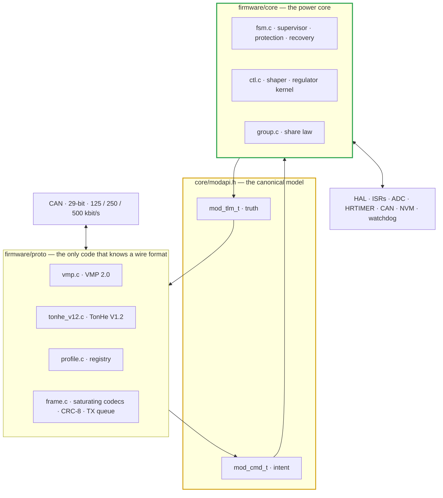
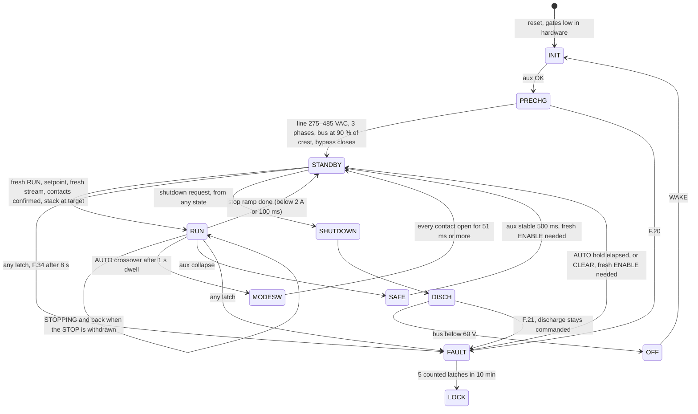
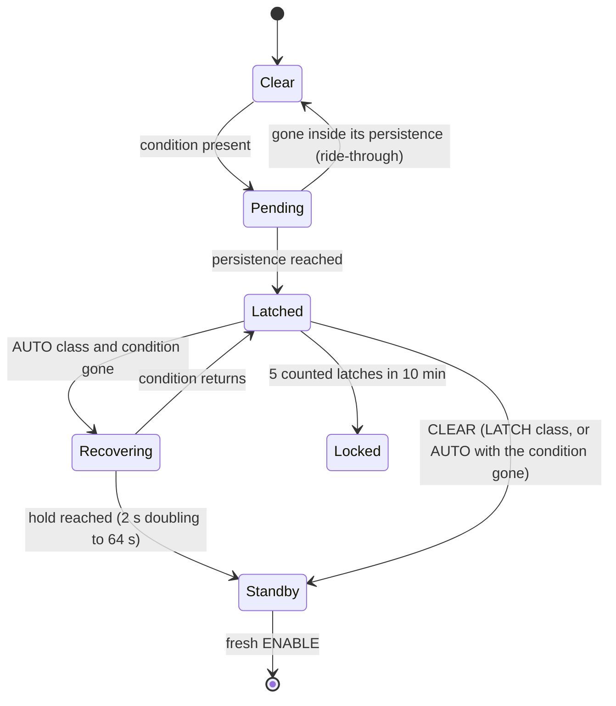
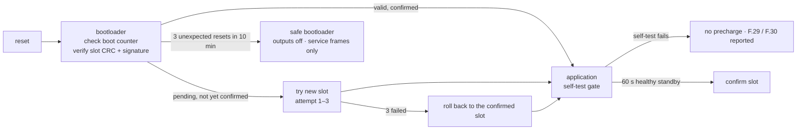
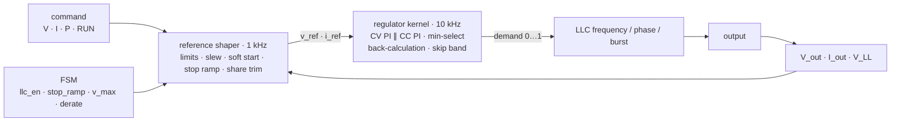

# 🧬 Firmware Architecture

Layers, timing, state machines, control and ramping, the protection hierarchy and exception handling — and the reviews that shaped them

  
  
  
  

> [!NOTE]
> **Purpose** — the module firmware end to end: the review that shaped it, the layers and what each may know, the execution
> model and its timing budget, the state machines, the control and ramping strategy, the protection hierarchy, how every
> abnormal condition reaches a deterministic state, persistent data and firmware update, and the performance targets.
>
> **Gate coupling** — `firmware/run_tests.sh` (in `run-all`) is the evidence for every row marked **FIXED**:
> `host_sim` 114 · `ctl_test` 18 · `proto_test` 40 · `hal_test` 34 · `app_test` 16, under AddressSanitizer +
> UndefinedBehaviorSanitizer (fatal) and `-Werror`. Rows marked **SPEC** are requirements not yet implemented — since E79 the
> portable HAL exists (`firmware/hal/`) and the GD32G553 register port does not; rows marked **HW** need a hardware decision.
> The protocols are specified in [VMP 2.0](can-protocol.md) and the [TonHe V1.2 profile](can-profile-tonhe-v12.md); the test
> matrix is the [firmware verification plan](firmware-verification.md).

## At a glance

| | |
|---|---|
| **Layers** | protocol profiles → one canonical model → power core (`fsm` · `ctl` · `group`) → HAL |
| **Execution** | bare metal, time-triggered: three control ISRs + a 1 ms scheduler · no heap · no RTOS · no locks |
| **Protocols** | VMP 2.0 (native) and TonHe V1.2 — one profile per boot, chosen from the stored configuration; TonHe can be left out of an image at build time |
| **Protection** | six response levels; every F.xx row carries a recovery class — AUTO_EXT · AUTO_INT · LATCH · LOCK |
| **Smoothness** | bumpless soft start from the output node, slew-limited references, a 100 ms controlled stop, min-select CV/CC with back-calculation anti-windup, CV share trim |
| **MCU** | one GD32G553 runs both stages. E79 estimated ≈ 35 % CPU; the E81 disassembly count (reviewer D) put the 100 kHz PFC ISR at 5.8–7.4 µs of its 10 µs period before the E81 trims (grid sampling out of the 100 kHz context, reciprocal, PFEN) — the binding item, measured at T-64 with a **STOP line of ≤ 5 µs worst case** (§3.5) |
| **Verified on the host** | **291 checks** across seven binaries: the 26 fault scenarios, E60–E81 regressions, every-tick invariants, both protocols against their documents, fuzzed frames, the Vienna and LLC laws on cycle-by-cycle plants, the application end to end, the signed boot chain, and the E81 adaptive dead time |
| **Before hardware** | loop gains on HIL (§5.4) · T-44/T-47/T-48 on silicon · HW-REC-1/4/5 (§10) — the register port itself is built and gated (E80: `firmware/port/gd32g553/`, no vendor library) |

## 1. What the review found

The firmware tree was reviewed as found on 2026-09-15 — the E76 core plus unregistered E77 working-tree changes (input
sanitization, row persistence, the F.31 window, warm hold, the public shutdown; 106 / 106 host checks) — against the brief:
smooth and fast, deterministic, safe without over-guarding, stable in parallel, and drop-in compatible with a vendor protocol
without contaminating the core. **FIXED** = code and a test in this pass (E78). **SPEC** = specified here for the HAL.
**HW** = needs a hardware decision.

| ID | Severity | Finding | Consequence | Disposition |
|---|---|---|---|---|
| FW-01 | **Critical** | The communication timeout was a fixed 1 s inside the core. TonHe V1.2 monitors send setpoints only on change and a heartbeat every 5 s; the TonHe module class stops after 20 s of silence | a TonHe-profile module would stop 1 s after every setpoint — no drop-in | **FIXED** — the timeout belongs to the active profile (`pmp_fsm_set_comm_timeout_ms`): VMP default 1 s (0.1–10 s), TonHe 20 s |
| FW-02 | **Critical** | Every fault latched until an explicit clear. V1.2 has no clear command, and grid events are not module faults | one 100 ms sag would park a TonHe-profile module until a power cycle; a native controller needed clear logic for the weather | **FIXED** — recovery classes (§6); grid rows recover on their own and never count toward the F.31 lockout |
| FW-03 | **High** | The precharge bypass contact was commanded but never supervised; the PFC could start with the precharge resistor still in series | the resistor burns open under line current (a smoke event) instead of a clean fault | **FIXED** — F.19 mirror-contact supervision (100 ms); the PFC starts only on a confirmed bypass; the soft start waits for the matrix contacts; unwired feedback is reported |
| FW-04 | **High** | STOP and communication loss cut the LLC at full current | a current step at the vehicle inlet; a stop into a resistive load read as a short (F.16) — found by the end-to-end rig | **FIXED** — 100 ms controlled stop; F.16 is not evaluated during the deliberate stop; a STOP withdrawn inside the ramp continues without a restart |
| FW-05 | **High** | No control law existed in firmware: soft start, slew, CV/CC/CP selection and anti-windup were left to an unspecified HAL loop | smoothness undefined; no power limit; no input derate | **FIXED** (structure) — `ctl.c` reference shaper and regulator kernel with tests · **SPEC** — gains per rating on HIL (§5.4) |
| FW-06 | **High** | No E1 input derate between 285 and 330 VAC while FW-R6 clamps the PFC current reference | the LLC demands full power the PFC cannot draw → bus sag → F.05 on weak grids at full load | **FIXED** — availability × min(1, V_LL / 330) (constant input current, E1) |
| FW-07 | **High** | Paralleled modules in CV shared only through calibration — no droop and no active sharing | at the end of charge the module with the highest voltage calibration carries the group; the TH750-class ±5 % sharing is unreachable; one module ages first | **FIXED** — CV share trim toward the peers' average (±1 % authority, decays without data), fed by both profiles |
| FW-08 | Medium | `PMP_MODE_DWELL_MS` was 30 ms, commented as "30 s in product, 30 ms in host sim" — a macro cannot be both | the shipped value is wrong for one of them; a real 30 s dwell holds a battery above the 500 V PAR ceiling at zero current for 30 s | **FIXED** — 1 000 ms product value, tested |
| FW-09 | Medium | Native protocol v1 (E73 draft) had no acknowledgement, counters, CRC, identity or capability discovery, 2-bit groups, and CLEAR as a level bit | silent rejections; stale, duplicated or frozen frames undetectable; a stuck clear bit auto-clears faults | **FIXED** — VMP 2.0 replaces it (v1 never shipped; `can_proto.c` retired) |
| FW-10 | Medium | Input trip and start thresholds were equal (260 / 500 VAC) | a grid at the edge cycles the module | **FIXED** — start and recovery window 275–485 VAC |
| FW-11 | Medium | The state `switch` had no default | a corrupted state value did nothing, silently | **FIXED** — F.36 latch with every enable off |
| FW-12 | Medium | No control-deadline supervision in the core contract | a starved control ISR runs the converter on stale references | **FIXED** — `ctl_overrun` → F.35 · E79: the HAL's verdict (`hal/app.c`, §3.3), tested by `app_test` |
| FW-13 | Medium | SAFE left on the first good aux sample, and the restart needed no fresh ENABLE | a rail hovering at UVLO cycles the converter; a restart the controller never asked for | **FIXED** — 500 ms stable aux, then a fresh ENABLE |
| FW-14 | Medium | OFF was terminal | a discharged module needed a power cycle | **FIXED** — WAKE returns through INIT and precharge |
| FW-15 | Medium | A voltage setpoint lost while delivering (no battery) drove the reference to 0 V under load | an uncontrolled collapse of the output | **FIXED** — controlled stop + `PMP_W_NO_SETPOINT` |
| FW-16 | Low | The lifetime fault counter wrapped at 256 and doubled as the lockout count | the lockout test silently disarmed after a wrap | **FIXED** — saturating counters; a separate count of lockout-relevant latches |
| FW-17 | Low | Wire encoders must cast floats to integers — NaN or out-of-range is undefined behaviour in C | a corrupted telemetry value is UB on the wire path | **FIXED** — every profile encodes through `pmp_sat_*`; UBSan is fatal in the tests |
| FW-18 | Low | A core-level "fresh ENABLE after boot" would lose a TonHe start command that arrives during precharge | a TonHe monitor's single start command ignored | **FIXED** by design — "a restart needs a fresh request" lives in the profile (VMP holds RUN until RUN = 0; a TonHe start is an event) |
| FW-19 | **High** | Output OV: the F.13 comparator (CMP0) latches at a fixed 1 050 V. In LOW mode (banks parallel, ≤ 500 V) an EV contactor opening at full current meets no hardware clamp below 1 050 V; the 10 kHz loop needs ~100 µs, and 167 A × 100 µs into ~34 µF is ≈ 490 V | bank and terminal-capacitor overvoltage on a load dump in LOW mode, or a nuisance latch if the threshold is simply lowered | **HW** — HW-REC-1 (§10); until decided, the HAL schedules the CMP0 threshold by mode (firmware may tighten) and T-45 measures the dump |
| FW-20 | Medium | One temperature input, one derate slope; the protection table lists per-zone limits | a cool inlet can hide a hot transformer loop, or the reverse | **FIXED** (E79) — each zone's derate and trip mapped onto the core's 105 / 115 °C scale (§7, `hal/app.c`) |
| FW-21 | Medium | Fan failure derates to a fixed 0.5 | the 50 kW air module with one fan out is sized for 0.6 (E59 air budget) | **FIXED** (E80) — the core derates by failed count (`pmp_fan_derate`: 4-fan 0.6 / 0.3, 2–3-fan 0.5, none left = F.25 AUTO_INT) and the HAL judges each tach against a duty-proportional curve (HR-25) |
| FW-22 | Medium | No design for NVM, calibration integrity, boot or firmware update | corruption, wear and interrupted updates had no defined outcome | **FIXED** — E79 records (`hal/nvm.c`, F.30) · **E80 boot chain built**: signed A/B images (SHA-256 + ECDSA-P256, node-vector-proven), trial/confirm/rollback record, service-space update protocol, event ring (§9, `firmware/boot/`, `hal/evlog.c`) |
| FW-23 | Low | Line frequency is not supervised (a PLL unlock must stop the PFC) | undefined behaviour on a drifting generator | **FIXED** (E79) — F.37: outside 45–65 Hz, or no zero crossing on a live line, for 200 ms; AUTO_EXT (`app_test`) |
| FW-24 | Low | F.27 (internal link) was retired at E40 but is still evaluated on `link_age_ms` | none if the HAL feeds 0 | documented: the HAL feeds 0; one MCU runs both stages |
| FW-25 | Low | Row 4 (bus OV firmware, 845 V) duplicates the 860 V hardware trip and the bus-reference clamp | over-guarding; it was never implemented | recommendation: retire row 4 |

### 1.1a What the E80 external recheck fixed (two independent reviews, docs/e80-recheck-response.md)

| # | Sev | What was wrong | Fixed as |
|---|---|---|---|
| FW-36 | **Critical** | The CAN choke's physical map crossed the ACT45B windings — no through-path on any exported variant (HR-01) | netlist map corrected; five KiCad sets regenerated at 100 % |
| FW-37 | **Critical** | The watchdog strap (CWD 1 nF, SET00) made every correct 10 ms kick an early-window violation (HR-02/R01) | fixed-window strap CWD-open/SET01; bootloader chunk-kicks through image verification; EVT T-48 |
| FW-38 | **Critical** | One worst-from-nominal line scalar hid a 280/505/505 V overvoltage from F.07 and precharge (R06/HR-24) | `vin_ll_min`/`vin_ll_max` split; every row reads its own side |
| FW-39 | **Critical** | 860 V total + 40 V midpoint permitted a 450 V half-link bank at 454–468 V (HR-06/R10) | F.38: either half > 440 V / 10 ms latches |
| FW-40 | High | The AMC1311/AMC1350 nominal transfers were off (1.39 vs 1.44 V VCM; 0.205 vs 0.200 + input loading) (HR-04/05) | corrected nominals; an UNCALIBRATED card now inhibits delivery (F.30, HR-29) |
| FW-41 | High | Discharge called itself done on the bus alone; a live source fed the dump past F.21 unbounded (HR-11/12) | OFF needs link + both banks < 60 V; F.21 ends the dump commands |
| FW-42 | High | The matrix make was trusted one tick after the coil bit; PAR ignored bank-to-bank mismatch (HR-08/09) | 40 ms make-settle wait; PAR permit adds \|ΔV\| ≤ 25 V |
| FW-43 | Medium | A stalled PFC ramp was energized and unsupervised in STANDBY (HR-28) | the ramp counts inside F.34's 8 s window |
| FW-44 | Medium | F.13 stayed at 1050 V in LOW mode; the share trim could push the final target past the ceiling (R09/R34) | mode-scheduled CMP0 (560/1050 V); final `v_tgt` clamp; HW-REC-1 reference armed on its own DAC |
| FW-45 | Medium | Fan health = "5 Hz at any duty"; one boolean hid the count (HR-25/R25) | duty-proportional tach curve + count-based derate + F.25 |

### 1.1 What implementing the HAL found (E79)

Each row was reproduced on a host plant before it was fixed. The plant runs stay in `firmware/test/hal_test.c` and
`app_test.c`, so a regression fails the gate.

| ID | Severity | Finding | Consequence | Disposition |
|---|---|---|---|---|
| FW-26 | **Critical** | The E78 regulator placeholders (CV 2 / 200, CC 0.5 / 500) were far too stiff for the LLC: a battery puts about 70 per-unit of current on one unit of demand | 564 A tank peaks in every soft start (F.11 is 220 A) and an 81 A peak-to-peak limit cycle into a 0.1 Ω battery | **FIXED** — defaults CV 0.5 / 150 and CC 0.01 / 40: a 155 A soft-start peak and 100.1 A with 14 A peak to peak into the battery; the §5.5 transient targets stay HIL work (§5.4) |
| FW-27 | **High** | A PFC voltage loop that commands the current amplitude keeps a sag's amplitude when the line returns | 269 A on a 50 % sag recovery at 50 kW — above F.01 (195 A) | **FIXED** — the loop commands power; the amplitude is that power over the measured crest |
| FW-28 | **High** | A line step lands ΔV / L on the phase current for the 15 µs transport delay before any sample can answer (+53 A for a 50 % recovery at 50 kW, more from a high line); from the plain FW-R6 clamp a 50 % recovery reached 184 A | a nuisance F.01 latch at the end of a deep sag, worst on a 480 VAC grid | **FIXED** — the amplitude limit is the lowest of the clamp, the rated power above 330 VAC and 1.1 × clamp − k_step × (recent crest − crest): 152 A (50 % sag), 144 A (75 %), 93 A (30 kW, 480 VAC) — each under F.01 / 1.2. A faster sense filter does not help (11.5 µs still gave 184 A) |
| FW-29 | **High** | An LLC floor fixed at the 0.55 fr design point ignores the capacitive boundary, which rises toward fr as the load's Q grows | a demand for more gain than the tank has drives it capacitive — hard commutation of the SiC body diodes | **FIXED** — floor = max(0.55 fr, 1.03 × the tolerance-worst ZVS boundary for the measured Q); no hard-switched edge on the switched tank, including a demand beyond its gain |
| FW-30 | Medium | Bursting the LLC into a discharged output, which is a near-short | 129 A tank peaks and ± 13 % ripple at 60 V | **FIXED** — continuous phase shift below 100 V: 22–44 A and ± 0.5 % |
| FW-31 | Medium | A Vienna stage has no way to stop a rising bus at light load unless every switch turns off | bus runaway at no load or after a load dump | **FIXED** — skip (every switch off 15 V above the reference) and a light-load burst: load-dump peak 833 V against the 860 V trip |
| FW-32 | Medium | A latch during precharge or discharge, then CLEAR or an AUTO recovery, left the module in STANDBY with the bypass open | it never starts, because the PFC waits for the bypass, and never says why | **FIXED** — the FAULT exit goes through PRECHG while the bypass is open |
| FW-33 | Medium | A start into a battery or charged terminal capacitors above the setpoint needed the stack to reach the node | F.34 on every restart at a lower setpoint with the output still charged | **FIXED** — RUN entry at min(node, command); the regulator follows min(terminal, stack) |
| FW-34 | Medium | The E60 engine `vienna-switched.mjs` zero-clamps a diode current without re-imposing Σ i = 0 | a phase left conducting alone keeps its current — an 800 V/s no-load runaway in the C port of the plant | **FIXED** in the C plant · the E60 full-power evidence is unaffected; light-load results from that engine need the same correction |
| FW-35 | Low | The 100 kHz update carried five FPU divisions, and the LLC path called `ceilf` | ≈ 3.4–4.6 µs of the 10 µs period | **FIXED** — the bus-half reciprocals every 10th update, constant divisions as multiplies, an integer ceil: one division and one square root per update (§3.5) |

## 2. Architecture

**The rules that keep a vendor out of the core**

1. **Knowledge flows one way.** A profile includes `core/modapi.h`; no file in `core/` includes anything from `proto/`. A
   profile never touches `pmp_in_t` or `pmp_fsm_t` — it writes `mod_cmd_t` and reads `mod_tlm_t`.
2. **A vendor is a file pair and a registry row.** `proto/<vendor>.{h,c}` plus one line in `profile.c`. Timeouts, event versus
   level semantics, fault-bit maps, scalings, addressing and telemetry cadence all live there.
3. **One profile per boot.** The stored profile id is read once; a new id applies at the next boot; nothing changes profile while
   the converter is energized. `PMP_WITH_TONHE_V12=0` removes the TonHe profile from an image.
4. **Defence in depth on values.** A profile range-checks what it decodes and encodes through saturating conversions; the core
   sanitizes commands and measurements again (E77) — neither trusts the other.
5. **Pulses are consumed once.** CLEAR, SHUTDOWN and WAKE are one-tick pulses that `pmp_cmd_to_in()` copies and clears.

| File | Owns |
|---|---|
| `core/fsm.{h,c}` | supervisory state machine, protection rows, recovery classes, relay supervision, controlled stop, discharge |
| `core/ctl.{h,c}` | reference shaper (1 kHz) and regulator kernel (control ISR) |
| `core/group.{h,c}` | the E66 share law — lower at once, raise after a hold, staggered joins, stale → zero |
| `core/modapi.{h,c}` | `mod_cmd_t`, `mod_tlm_t`, run-state mapping and the glue into the FSM and shaper |
| `proto/frame.{h,c}` | frame type, little-endian packing, `pmp_sat_*`, CRC-8/AUTOSAR, priority-aware bounded TX queue |
| `proto/profile.{h,c}` | profile table: name, bit rate, `rx`, `tick` |
| `proto/vmp.{h,c}` | VMP 2.0 — the identifier and object tables of record |
| `proto/tonhe_v12.{h,c}` | TonHe V1.2 — every rule and ambiguity of that document |
| `hal/pfc.{h,c}` | E79: the Vienna law — current loops, modulation, the voltage loop in power, skip and burst, the amplitude limit |
| `hal/llc.{h,c}` | E79: the LLC modulator — PFM, phase shift, burst, the ZVS floor |
| `hal/meas.{h,c}` | E79: calibration, reference correction, the grid monitor, NTC, rating strap |
| `hal/nvm.{h,c}` | E79: the power-cut-safe record store |
| `hal/app.{h,c}` | E79: interrupt entries, the 1 ms sequence, supervision, relays, fans, panel, CAN recovery, NVM policy — sans-IO |
| `test/host_sim.c` · `ctl_test.c` · `proto_test.c` · `hal_test.c` · `app_test.c` | the host evidence (`run_tests.sh`) |

**The 1 ms sequence the HAL runs** — drain received frames into `profile->rx` · `profile->tick` · `pmp_cmd_to_in` ·
`pmp_fsm_step` · `pmp_cmd_to_ctl` · `pmp_ctl_step` · commit references to the control ISR · fill `mod_tlm_t`
(`pmp_tlm_from_core` plus measurements) · drain the TX queue into the CAN controller · kick the watchdog if §3.3 allows.

## 3. Execution model and timing

### 3.1 Contexts and budgets

| Context | Rate / trigger | Work | WCET budget | Priority |
|---|---|---|---|---|
| HRTIMER fault ISR | fault edge | record source (FLT input, I_RES capture for F.11 vs F.02), timestamp — the silicon has already stopped PWM | ≤ 50 µs | highest |
| PFC control ISR | 100 kHz, carrier peak and valley (FW-EMI-1) | `app_pfc_isr` → `pfc_step`: three current loops on resistive emulation, midpoint balance, the voltage loop; the grid monitor every 10th update; duty loaded at the next half-period | ≤ 3 µs typical, ≤ 5 µs at a line-cycle close (E79 estimate 2.5 / 4.5 µs, §3.5) | 2 |
| LLC control ISR | 10 kHz, ADC end-of-sequence synchronized to HRTIMER | `app_llc_isr`: the bus fold-back, `pmp_reg_step`, `llc_step` | ≤ 30 µs (E79 estimate 2.4 µs) | 3 |
| CAN ISR | frame event | copy to or from ring buffers — nothing else | ≤ 20 µs | 4 |
| 1 ms scheduler | 1 kHz timer | the sequence of §2 · slow ADC and plausibility · 10 ms slice (fans, relay economizer, HMI) · 100 ms slice (NVM journal, statistics) | ≤ 400 µs (40 %) | lowest |

CPU load ≤ 60 % steady and ≤ 75 % worst case, measured with the DWT cycle counter at EVT T-44. Flash erase and program run from
the 100 ms slice with the control ISRs executing from RAM or from the bank not being written.

### 3.2 Data exchange without locks

- **References to an ISR**: the scheduler writes a shadow structure and sets a commit flag; the ISR copies it at entry. One
  writer, one reader, no partial reads.
- **Measurements from an ISR**: sequence-counter snapshots (the reader retries if the counter moved during the copy).
- **No mutexes, no RTOS** — deadlock and priority inversion cannot occur. **No heap** — the linker heap is zero.
- **Stacks** sized at twice the measured high-water mark, painted, checked at 1 Hz: warning at 70 %, F.36 at 90 %.
- **MPU**: stack guard regions, execute-only code, peripheral windows. HardFault / MemManage / BusFault write GATE_EN low
  directly, store PC / LR / xPSR in no-init RAM and stop kicking the watchdog.

### 3.3 Deadline supervision and the watchdog

| Check | Rule | Outcome |
|---|---|---|
| ISR heartbeats | at each 1 ms tick: PFC ISR count advanced 100 ± 2, LLC ISR 10 ± 1 | a miss is an overrun event |
| Execution time | DWT per ISR; an overrun is execution beyond the period or a re-entry | counted, max and mean in diagnostics |
| Overrun verdict (`ctl_overrun`) | ≥ 10 overrun events in 100 ms, or 3 consecutive missed LLC periods | **F.35** LATCH; single events are warnings only |
| Sequenced watchdog | the kick happens at the end of the tick only if every heartbeat advanced and the FSM step ran | a missed window resets through WDO ≡ NRST (R5-A); gates are low by hardware through reset and boot |
| Reset cause | read at boot into diagnostics; a watchdog reset raises F.32 | the controller sees it; no automatic restart (§4.3) |

### 3.4 Sampling, filtering and latency

| Signal | Sampling | Filtering | Latency to use | Plausibility |
|---|---|---|---|---|
| PFC phase currents | 100 kHz, synchronous | none in the loop | ≤ 15 µs sample to duty | CMP windows in hardware; Σ I ≈ 0 within 10 % of rated for 20 ms → F.29 |
| AC line voltages | 10 kHz, synchronous | feed-forward with the FW-EMI-2 rotation; RMS per line cycle | one cycle for RMS rows | three line-line values sum to ≈ 0; 45–65 Hz (F.37) |
| Output V and I | 4 samples per 100 µs control period, RC anti-alias ≈ 5 kHz | 4-sample boxcar (loop) · 1 ms mean (FSM, shaper) · 50 ms mean (telemetry) | ≤ 200 µs loop · ≤ 60 ms telemetry age | V_out not far below the delivering stack (F.29); I_out within 15 % of the primary estimate above 20 % load for 1 s (warning) |
| Bus halves, banks | 1 kHz | 1 ms mean | 1 ms | bus = sum of halves ± 2 %; each bank ≤ its gain ceiling |
| Temperatures | 10 Hz | median of 5 | 1 s | open / short rails (`pmp_ntc_guard_c`); rate ≤ 5 K/s |
| ADC health | every tick | — | — | sequence counters advance each ms; internal reference ± 2 % at 1 Hz → F.29 |

A plausibility row only affects what it covers. F.29 latches only when a signal a protection row depends on is invalid for
its persistence (3 ms, E77).

### 3.5 One MCU for both stages — the verdict (E79, re-examined at E81)

> [!IMPORTANT]
> **E81.** Reviewer D's disassembly count of the shipped 100 kHz PFC ISR was **5.8–7.4 µs**, not the 2.5–4.5 µs estimated below —
> a CPU margin near 1.35× instead of ≥ 2×. Two remedies were examined. The documented fallback (one PFC update per carrier,
> 30 µs transport delay) is **forbidden on 40 / 50 kW**: the input-filter modulus margin drops to 0.26 / 0.17 there (reviewer E's
> sweep on the drawn damper; the 0.50 line is GM ≥ 6 dB, PM ≥ 29°), and no damper value that fits the module recovers it. The
> ISR is therefore trimmed instead (grid sampling and the line-cycle work moved to the 10 kHz / 1 kHz contexts, reciprocal
> multiplies, PFEN), and the bring-up STOP line is **≤ 5 µs worst case** (T-64, `pfc_exec_us`). **MCU decision:** the GD32G553VET7
> stays the first-prototype primary (216 MHz, TCM, this register-level port with its host suite); the card is pin-compatible with
> the STM32G474VET7 from E81 (I_A0 ↔ T_LLC swap gives DAC-referenced comparators on both parts) as the second source / ecosystem
> path — at 170 MHz it would force the forbidden fallback unless the trims land first, so the production primary is chosen after
> T-64.

**Yes.** The GD32G553 runs the Vienna PFC, the LLC and the supervisory stack from one Cortex-M33 core with margin, on two
conditions: both control interrupts execute from TCM RAM, and EVT T-44 confirms the estimate below with the DWT counter.
E80: the register-level port exists and enforces the first condition — `firmware/port/gd32g553/app.ld.in` places the whole
100 kHz path (`pfc_step`, the ISR glue, `grid_sample`, the DMA readers) at 0x1000xxxx, and the built ELF proves it; the
DWT high-water marks surface as VMP object 0x0500 for T-44.

| Resource | Needed | GD32G553VET7 |
|---|---|---|
| Core | single-precision float in the 100 kHz path | Cortex-M33 at 216 MHz, single-precision FPU, DSP extension |
| PWM | LLC legs A and B with hardware dead time — **adaptive from E81**: t_dead = 1.25 · 2 · n_die · (Q_oss(V_bus) + C_s·V_bus) / I_comm per LEG per 10 kHz step, clamped 60–900 ns (DTGCKDIV 2) — leg A on I_m,pk (the weak leg in phase shift), leg B on the measured tank peak in PSM (the deck loses every ZVS edge when the strong leg waits 900 ns), both on the turn-off estimate in PFM, so the light-load PS150 corner keeps ZVS with the turn-off snubber fitted and the heavy-load corners do not pay the fixed-120 ns body-diode term · three Vienna phases on one carrier · a hardware kill | HRTIMER at 145 ps; ST0 / ST1 for the legs and ST3–ST5 for the phases in the pin map; fault channels for CMP0 · CMP1 · CMP2 · CMP3 (E81, was CMP7) · CMP4 and the FLT wire-OR |
| Analog | 5 channels per PFC update, 4 per LLC period, about 14 slow | four 12-bit ADCs at up to 5.3 Msps each — about 15 % used |
| Fast protection | 5 comparators with DAC references | 8 comparators, DAC internal outputs |
| Communication | one CAN at 125–500 kbit/s | 3 CAN-FD |
| Memory | ≈ 37 KB code (HAL, core, both profiles) · ≈ 6 KB application state (`app_t` with both profile contexts) | up to 512 KB flash · 128 KB SRAM including 32 KB TCM |

| Path | Compiled (gcc -O2, Cortex-M33 hard-float) | Estimate | Share of its period |
|---|---|---|---|
| PFC update, typical | `app_pfc_isr` + `pfc_step`: ≈ 450 instructions executed, 1 VDIV + 1 VSQRT | ≈ 2.5 µs | 25 % of 10 µs |
| PFC update, every 10th · at a line-cycle close | + the voltage-loop integrator and `grid_sample`: + 2 VDIV, then + 4 VSQRT | ≈ 3.5 · 4.5 µs | 35 · 45 % |
| LLC update | `app_llc_isr` + `pmp_reg_step` + `llc_step`: ≈ 350 instructions, 7 VDIV | ≈ 2.4 µs | 2.4 % of 100 µs |
| 1 ms tick | measurement, profile, FSM, shaper, telemetry, NVM, CAN | 25–50 µs | 2.5–5 % |
| **All contexts** | including interrupt entry with lazy FPU stacking | | **≈ 35 % average** |

Method: instruction counts from the disassembly of the compiled paths, 1.1 cycles per instruction from TCM (1.3–1.5 from flash
with wait states), 19 cycles per VDIV and 29 per VSQRT. It is an estimate, not a measurement. **E81:** the disassembly count of
the shipped ISR was ≈ 1 600 cycles (7.4 µs); after the E81 trims (grid sampling and the offset window moved to the 10 kHz context,
six divisions removed from the drain, DAC references precomputed, PFEN) it is ≈ 1 250 cycles (5.8 µs static) — T-64 measures it
against the ≤ 5 µs STOP line. The one-update-per-carrier fallback is **no longer an option on 40 / 50 kW** (input-filter margin
0.26 / 0.17 at a 30 µs delay); a miss is trimmed further in the ISR.

## 4. State machines

### 4.1 Module lifecycle (the core)

`RUN` includes `DERATE` (one delivering super-state since E76) and the controlled-stop sub-phase (`out.stop_ramp`). STANDBY
is warm for 60 s after a STOP (PFC and matrix ready), then cold (E77).

### 4.2 A latched row

### 4.3 Protocol sessions

| Profile | States | Fresh request after a module-initiated stop |
|---|---|---|
| VMP 2.0 | boot hold → unaddressed (ANNOUNCE 1 Hz) → addressed → owned (fresh stream) → stale (ownership lapses, core ramps out) → owned | RUN must be seen 0, then 1 — after boot, after a timeout, after a fault, after a controller restart (new heartbeat session) |
| TonHe V1.2 | listening → commanded (start) → stopped (stop) or communication lost (20 s) | a new start command (0xAA) — the V1.2 start is an event |

### 4.4 A group member (`group.c`)

not a member → joining (hold 1.3 s + rank × 300 ms) → sharing (lower at once, raise after 1.3 s; a grown target restarts the
hold) → stale after the timeout (share 0) → joining again.

### 4.5 Boot and update

## 5. Control and ramping strategy

### 5.1 Structure

### 5.2 The shaper

| Rule | Value | Why |
|---|---|---|
| Soft start | the voltage reference starts at min(output node, target) | bumpless into a battery: no inrush, no reverse step |
| Voltage reference rise | 500 V/s (config 1–5 000) | 0 → 750 V in 1.5 s; TonHe TH750 publishes a 2–4 s soft start |
| Voltage reference fall | twice the rise | a lowered command is followed promptly; the output itself falls only through the load |
| Current reference rise | 1 000 A/s (config 1–10 000) | 10 → 90 % of 166.7 A in 0.13 s |
| Current reference fall and stop | rated → 0 in 80 ms | inside the FSM's 100 ms stop window |
| Current target | min(command, availability, rated power ÷ V, power command ÷ V, group share) | the lowest limit wins and is named in telemetry |
| Availability | rating × FSM derate × min(1, V_LL / 330) | E1 constant input current below 330 VAC |
| Power → current | at max(V_out, ½ × knee) | the divide guard; below half the knee the rated current binds anyway |
| Share trim | +0.5 V per A·s of (peer average − own current), clamped to ±1 % of the command; only in CV with ≥ 2 members above 5 % of rated; decays with τ = 5 s otherwise | the members' errors sum to zero, so the group voltage does not drift |
| Droop | off by default (config 0–0.5 Ω) | accuracy first; for sites without CAN sharing only |

### 5.3 The regulator kernel

Both regulators act on the same variable — the LLC's gain (frequency, then phase shift, then burst) — so they run side by side
and the lower demand is applied (min-select) rather than cascaded. Back-calculation (τ_t = 1 ms) pulls each integrator toward
the demand actually applied: for the selected loop the pull is zero unless the demand is clamped or skipped (no windup); the
idle loop settles τ_t · k_i · error above the applied demand, so it takes over exactly where its own limit is reached, without
a step. An output above v_ref · 1.03 + 5 V forces zero demand until it falls below v_ref · 1.01 — the firmware image of the
cycle-by-cycle clamp of HW-REC-1. `ctl_test` proves these properties: bounded under fuzz, one-step hand-over after 5 s of
saturation, takeover within 1 A of the limit with no demand step, skip hysteresis.

### 5.4 Tuned on HIL, not fixed here

- **CC gain scheduling.** di/du differs roughly 70 : 1 between a battery (≈ 0.3 Ω incremental) and a resistive test load
  (≈ 20 Ω); the current-loop gain is normalized by an online estimate of the incremental load conductance, bounded to the
  battery case.
- **LLC small-signal gain** versus frequency per SKU, from the power-solved `llc-run` decks, as a gain table.
- **Targets on every envelope corner:** CC crossover ≥ 300 Hz, CV ≥ 100 Hz, phase margin ≥ 45°, gain margin ≥ 6 dB; burst below
  3 % load.

### 5.5 Performance targets

| Quantity | Target | Condition |
|---|---|---|
| Start, warm standby → regulated | ≤ 1.0 s | 0 → rated voltage, no load |
| Start, cold standby → regulated | ≤ 3.0 s | PFC off, matrix open, make-permit bleed included |
| Voltage setpoint step ± 10 % | ramp-limited; overshoot ≤ 1 %; within ± 0.5 % ≤ 100 ms after the ramp | resistive 20–100 % |
| Current setpoint step 10 ↔ 90 % | t90 ≤ 150 ms up, ≤ 100 ms down; overshoot ≤ 2 % of rated | battery emulator |
| Load step 25 ↔ 100 % in CV | deviation ≤ 10 % at the module stud (E81: the film-only bank of 9.9–61.6 µF overshoots +4.9 … +9.7 % on the shipped gains in the SIL — the earlier 3 % line was met only by a 200 µF test plant the product does not carry; a gain or control-period change moves it < 1 pp, only capacitance does); back within ± 0.5 % in ≤ 50 ms; must not reach F.14 (mode-max × 1.05 + 20 V / 2 ms) | resistive, DOUT + 5 m cable |
| Load dump from 100 % | peak ≤ V_set · 1.05 + 10 V; no F.13 latch | EV contactor opens; needs HW-REC-1 |
| CV ↔ CC transition | current overshoot ≤ 2 % of rated; voltage overshoot ≤ 1 %; no limit cycle above 0.5 % | battery reaching its CV setpoint |
| Accuracy | V ± 0.5 % (≥ 150 V) · I ± 1 % (20–100 %) · ± 0.5 A below 50 A | after EOL calibration |
| Control-induced ripple | ≤ 0.2 % rms (≤ 0.5 % total with the hardware, T-40) | outside burst |
| Burst ripple | ≤ 1 % peak-to-peak | below 3 % load |
| Power limit | ≤ +2 % steady · ≤ +5 % for ≤ 100 ms | CP region and power command |
| Derate | reduction ≤ 10 ms · recovery ≤ 20 %/s | thermal, fan, input |
| Current sharing | within ± 5 % of the average at ≥ 10 % of rated, CV and CC · ± 10 % within 3 s of a membership change | 2–8 modules |
| Group sum | ≤ request + 1 % at every instant | `group.c` invariant |
| Hot join | at share ≤ 3 s after the first group frame | staggered by rank |
| Member loss | the others raise after the 1.3 s hold; dip ≤ one share for ≤ 1.5 s | EQUAL law |
| Command latency | frame received → reference in force ≤ 5 ms (99.9 %) | |
| Telemetry | TLM_FAST age ≤ 60 ms, period jitter ≤ ± 5 ms · FAULT_BITS ≤ 20 ms after a latch · ACK ≤ 20 ms | VMP 2.0 |
| Communication loss | detected at the timeout ± 2 ms; current out ≤ 100 ms later | both profiles |
| Fault reaction | hardware rows per [protection thresholds](protection-thresholds.md) (≤ 3 µs OC and DESAT, ≤ 25 µs OVP) · firmware immediate stop ≤ 2 ms after persistence · controlled stop ≤ 100 ms | |
| Boot | first frame ≤ 500 ms after aux up · READY ≤ 2 s after aux up at 400 VAC | |

## 6. The protection hierarchy

### 6.1 Levels and classes

| Level | What happens | Examples |
|---|---|---|
| **L0 Warn** | reported, nothing changes | line wait, ride-through, measurement glitch, relay feedback unwired, re-arm needed |
| **L1 Derate** | availability reduced continuously | thermal slope, fan, E1 input voltage, installer power cap |
| **L2 Limit** | a loop regulates at a boundary | CC / CV / CP, FW-R6 PFC reference clamp, skip band, bus-reference floor |
| **L3 Controlled stop** | current ramps out (≤ 100 ms), then the LLC stops | STOP, communication loss, setpoint lost |
| **L4 Immediate stop** | enables drop in the tick a row fires (after its persistence) | every firmware latch |
| **L5 Hardware trip** | silicon stops switching with no firmware in the loop | F.01 · F.02 · F.03 · F.11 · F.12 · F.13 · driver UVLO · watchdog |

| Class | Clears when | Counts toward F.31 | Rows |
|---|---|---|---|
| **AUTO_EXT** | the line is back inside 275–485 VAC with 3 phases for the hold | no | F.07 · F.08 · F.09 · F.37 |
| **AUTO_INT** | the condition is gone for the hold (OT: below 100 °C; bus / midpoint: healthy line) | yes | F.05 · F.06 · F.22 |
| **LATCH** | CLEAR (VMP ACTION; the TonHe profile has none, so a latch holds until a power cycle, as the TH750 manual describes) | yes | all other rows |
| **LOCK** | power cycle or service | — | F.31 |

The hold is 2 s, doubling per consecutive AUTO latch up to 64 s; the streak resets after 10 min without an AUTO latch. Every
exit from FAULT, SAFE or a communication loss needs a fresh request (§4.3).

### 6.2 The separations the brief asked for

| Category | Members |
|---|---|
| Hardware-fast protection firmware must never replace | F.01 line OC · F.02 / F.12 DESAT · F.03 bus OVP · F.11 tank OC window · F.13 output OVP (CMP0, + HW-REC-1) · driver UVLO (F.26) · watchdog WDO ≡ NRST · the 74HC02 relay exclusion |
| Firmware safety protection | F.05 · F.06 · F.07 · F.08 · F.09 · F.13 mirror and sourcing rows · F.15 · F.16 · F.17 · F.19 · F.20 · F.21 · F.22 · F.29 · F.33 · F.34 · F.35 · F.36 · F.37 |
| Derating and protective control | thermal slope and recovery slew · fan · E1 input · rated-power curve · power command · group share · skip band · FW-R6 · FW-R7 |
| Warnings and diagnostics | the PMP_W bits · protocol warnings (stale, conflict, TX drop, RX reject) · plausibility warnings · statistics and events |
| Recoverable faults | AUTO_EXT and AUTO_INT rows · SAFE · communication loss (graceful, F.28) |
| Latched faults needing a clear or a power cycle | LATCH rows · F.31 LOCK |

### 6.3 Row by row

| Row | Condition | Detection | Level | Class | Recovery | TonHe V1.2 report |
|---|---|---|---|---|---|---|
| F.01 PFC line OC | 120 / 155 / 195 A pk | ≤ 3 µs, hardware | L5 | LATCH | CLEAR | PFC bit 0 · word 11 + 7 |
| F.02 PFC DESAT | VDS at turn-on | ≤ 2.21 µs, driver | L5 | LATCH | CLEAR | word 11 + 7 |
| F.03 Bus OVP | 860 V | 10–20 µs, CMP4 | L5 | LATCH | CLEAR | PFC bit 7 · word 11 + 7 |
| F.04 Bus OV (firmware) | 845 V, 1 ms | — | — | **retire** | duplicate of F.03 and the reference clamp | — |
| F.05 Bus UV | < 620 V delivering, 10 ms | firmware | L4 | AUTO_INT | healthy line + hold | word 8 + 11 + 7 |
| F.06 Midpoint | \|ΔV\| > 40 V, 10 ms | firmware | L4 | AUTO_INT | healthy line + hold | PFC bit 5 · word 11 + 7 |
| F.07 Input OV | > 500 VAC, 20 ms | firmware | L4 | AUTO_EXT | < 485 VAC + hold | word 2 |
| F.08 Input UV | < 260 VAC, 100 ms (E1 derate before) | firmware | L1 → L4 | AUTO_EXT | > 275 VAC + hold | word 0 |
| F.09 Phase loss | 40 ms | firmware | L4 | AUTO_EXT | 3 phases in the window + hold | word 1 |
| F.10 Phase sequence | at start | — | L0 | — | any rotation accepted | — |
| F.11 Tank OC | 140 / 180 / 220 A pk, both polarities | < 1 µs, window comparator | L5 | LATCH | CLEAR | word 7 |
| F.13 Output OV | CMP0 (mode-scheduled) · stack > v_max · 1.05 + 20 V for 2 ms · sourcing above command for 200 ms | hardware + firmware | L5 / L4 | LATCH | CLEAR | word 3 |
| F.15 Output OC | 130 % of rated for 2 ms, 102 % for 100 ms (the CC loop limits first) | firmware | L2 → L4 | LATCH | CLEAR | word 4 |
| F.16 Output short | V < 50 V and I > max(90 % of command, 10 % of rated) for 10 ms, not during a controlled stop | firmware | L4 | LATCH | CLEAR — a retry is the charger's decision | word 15 |
| F.17 Bank split / weld | \|VA − VB\| > 25 V in the SER soft start | firmware | L4 | LATCH | CLEAR | ext 4 · word 7 |
| F.19 Relay feedback | command ≠ mirror contact for 100 ms | firmware | L4 | LATCH | CLEAR | ext 4 · word 7 |
| F.20 Precharge | > 400 ms below 50 % of crest, or 5 s | firmware | L4 | LATCH | CLEAR | word 7 |
| F.21 Discharge | > 60 V after the window (discharge stays commanded) | firmware | L4 | LATCH | CLEAR | word 10 · ext 10 |
| F.22 Over-temperature | > 115 °C (derate from 105 °C), or an open NTC / cutout loop | firmware | L1 → L4 | AUTO_INT | < 100 °C + hold | word 5 · ext 6 |
| F.25 Fan | tach failure | firmware | L1 | warning + derate | — | word 6 |
| F.26 Aux UV | driver and aux UVLO | hardware + SAFE | L5 | SAFE | 500 ms stable aux | word 7 while SAFE |
| F.27 Internal link | retired at E40 | — | — | — | — | word 9 (never set) |
| F.28 Communication loss | the profile's timeout | firmware | L3 | graceful | fresh request | ext 2 |
| F.29 Sensor | non-finite or impossible for 3 ms · output reading far below a delivering stack | firmware | L4 | LATCH | CLEAR | word 7 |
| F.30 Configuration / calibration | at boot: a calibration record outside its windows, or no valid rating strap (E79) | firmware | no output | LATCH | service | word 7 |
| F.31 Lockout | 5 counted latches in 10 min | firmware | — | LOCK | power cycle / service | state 0x11 |
| F.32 Watchdog | WDO | hardware | L5 | LATCH | CLEAR | word 7 |
| F.33 Back-feed | reversed battery at start | firmware | L4 | LATCH | CLEAR | word 7 |
| F.34 Start stall | 8 s energized without reaching RUN | firmware | L4 | LATCH | CLEAR | word 7 |
| F.35 Control overrun | the HAL's verdict (§3.3) | firmware | L4 | LATCH | CLEAR | word 7 |
| F.36 Internal | undefined FSM state · stack at 90 % | firmware | L4 | LATCH | CLEAR | word 7 |
| F.37 Line frequency | outside 45–65 Hz, or no zero crossing on a live line, for 200 ms (E79) | firmware | L4 | AUTO_EXT | in range + hold | PFC bit 1 |

### 6.4 Anti-chatter

| Mechanism | Value | Where |
|---|---|---|
| Input hysteresis | trip 260 / 500 VAC · start and recovery 275 / 485 VAC | `fsm.c` |
| Ride-through persistence | 3–100 ms per row | `fsm.c` (E77) |
| AUTO recovery hold | 2 → 64 s doubling; streak reset after 10 min | `fsm.c` |
| Lockout window | 5 counted latches in 10 min; grid rows excluded | `fsm.c` |
| Derate recovery | ≤ 20 %/s up, immediate down | `fsm.c` (E77) |
| Mode crossover | 20 V hysteresis + 1 s dwell | `fsm.c` |
| SAFE exit | 500 ms stable aux | `fsm.c` |
| Warm hold | 60 s after STOP | `fsm.c` (E77) |
| Stale stream | the profile's timeout; a frozen counter never refreshes it | `vmp.c` |
| Rejection reports | ≤ 1 per 100 ms | `vmp.c` |
| On-change telemetry | ≥ 20 ms (VMP) · ≥ 50 ms (TonHe) spacing | profiles |
| TonHe output warnings | 1 s persistence | `tonhe_v12.c` |
| Address conflict | clears after 10 s without a colliding frame | both profiles |

### 6.5 Deliberately not added

- No firmware bus-OV row under the 860 V hardware trip (F.04 — retire).
- No short-circuit retry loop inside the module; the charger decides whether to try again.
- No second firmware over-current below the CC loop; F.15 is a backstop at 130 % of rated.
- No voting between channels that have one sensor; plausibility is checked against physics instead.
- No automatic restart after a communication loss — the controller owns the session.
- No CRC on telemetry frames: CAN CRC-15 plus counters suffice. CRC-8 protects only frames that can command power or change
  configuration.
- No derate inside the normal line window.
- No PLL (E79): the Vienna law is resistive emulation on the sensed phase voltages, and the grid monitor takes frequency and
  phase sequence from hysteretic zero crossings — there is nothing to unlock.
- ~~No relay-coil economizer (E79)~~ — reversed at E80: the aux budget review (R23) values the ~4 W of coil relief, and the pins were already timer-capable; the app emits per-coil duties (60 ms pull-in, 40 % hold — firmware-guide E26). KPRE/KPARB hold at full duty until their pins' PWM mapping is confirmed at bring-up (port note).

## 7. Thermal, cooling and derating

| Zone | Sensor | Derate from | Trip | Recover below |
|---|---|---|---|---|
| Inlet air (air SKUs) / coolant (liquid) | inlet NTC | 55 °C air · 55 °C coolant (A11) | 75 °C | 50 °C |
| PFC heatsink / plate | T_PFC | 95 °C | 105 °C | 90 °C |
| LLC heatsink / plate | T_LLC | 100 °C | 110 °C | 95 °C |
| Transformer loop (with the 130 °C cutouts) | T_XFMR | 105 °C | 115 °C · open loop = 150 °C | 100 °C |
| MCU | internal | — | 105 °C (warning at 95 °C) | — |

The core keeps one input: the HAL computes each zone's margin to its trip and hands the FSM
`temp_max_c = PMP_OT_TRIP_C − min(margin)`, so the zone closest to its own limit drives the continuous derate and the trip,
and each zone keeps its own threshold (FW-20). Derate recovery is slew-limited (≤ 20 %/s) and every zone recovers 5 °C below its
derate onset, so derated and non-derated states cannot alternate at the thermal time constant.

**Fans.** Duty = max(temperature curve, load feed-forward), 10 % hysteresis, ≥ 10 s minimum on-time. Quiet mode caps the duty
at 60 % and lets the thermal derate absorb the rest. Failed-fan derate by count (FW-21): 50 kW air (4 fans) — one failed 0.6,
two 0.3; 2–3-fan SKUs — one failed 0.5. Tach plausibility: a running command with 0 rpm for 3 s is a failure; rpm without a
command is a sensor warning.

**Liquid (50 kW).** No fans; the coolant inlet zone plus the plate NTCs; a dry plate crosses the OT ladder in seconds (E42).
Flow assurance belongs to the cooling cart.

## 8. Exception handling — every abnormal condition reaches a deterministic state

| Condition | Detection | Deterministic response | Recovery | Evidence |
|---|---|---|---|---|
| Divide by zero | structural guards: ½-knee floor for power → current, n ≥ 2 for averages, positive scales | a finite result | — | `ctl_test` divide guard · fuzz |
| Overflow, underflow, signed/unsigned | saturating encoders; modular unsigned time arithmetic; persistence counters saturate | clamped value | — | `proto_test` saturation · UBSan fatal |
| NaN / Inf measurement | E77 sanitization, 3 ms persistence | F.29 | CLEAR | `host_sim` E77 |
| NaN / Inf / negative command | read as zero or clamped; no start without a setpoint | READY + NO_SETPOINT, or a controlled stop | a valid command | `host_sim` E77 · `ctl_test` |
| Invalid ADC value | range, NTC open guard, freshness counter, reference check | F.29 or F.22 | CLEAR | `host_sim` · HIL F-05 |
| Corrupted CAN command | CAN CRC-15, CRC-8, range, must-understand bits | rejected, NAK, state unchanged | the next valid frame | `proto_test` |
| Out-of-range setpoint | clamp to the mode window and capability | applied clamped; applied values in TLM_LIMITS (VMP), range edge (TonHe) | — | `proto_test` |
| Stale command stream | the profile's timeout | controlled stop, REARM | fresh request | `proto_test` one core |
| Duplicate / out-of-order frame | 4-bit counter window | ignored / NAK SEQUENCE | — | `proto_test` |
| Frozen sender | duplicates never refresh freshness | stale → controlled stop | — | `proto_test` |
| CAN error-passive | controller state | warning | automatic | HIL N-06 |
| CAN bus-off | controller state | recover after 100 ms; after 10 bus-offs in 60 s hold off 5 s; the power side follows the timeout | automatic | HIL N-06 |
| Message flood / high load | acceptance filters, 32-frame RX ring with overflow counter, 20 requests/s token bucket, priority eviction in the TX queue | commands and fault events survive; telemetry drops are counted | — | `proto_test` · HIL N-07 |
| Race condition | single writer, shadow commit, sequence snapshots | — | — | code rule · static analysis |
| Deadlock, priority inversion | no locks, no RTOS | impossible by construction | — | — |
| Stack or heap exhaustion | no heap; painted stacks; MPU guard | 70 % warning, 90 % F.36; guard hit → HardFault → gates low → reset | reboot | HIL F-13 |
| Memory corruption | MPU; configuration shadow CRC at 1 Hz; undefined state value | F.36, or configuration reloaded | CLEAR / reboot | `host_sim` E78 |
| ISR overrun | DWT and heartbeat counts | warning; persistent → F.35 | CLEAR | `host_sim` E78 · HIL F-04 |
| Watchdog reset | WDO ≡ NRST | gates low in hardware; reset cause logged; F.32 visible; no automatic restart | fresh request | HIL F-06 · T-16 |
| Boot loop | reset counter in no-init RAM | ≥ 3 unexpected resets in 10 min → safe bootloader, outputs off | service / power cycle | HIL F-08 |
| Brownout during operation | aux_ok; MCU BOR; NVM writes only with V15 healthy | SAFE or reset | aux stable 500 ms + fresh request | `host_sim` E78 · HIL F-12 |
| NVM corruption or wear | A/B records, CRC-32, sequence number; writes only on change, ≤ 1 per 10 s per record | newest valid record; none → configuration defaults (warning) | service | HIL F-09 |
| Corrupted configuration | `cfg_sanitize` on load and on every write | the field's default | — | `proto_test` fuzz |
| Corrupted calibration | CRC and per-coefficient range | F.30, no output | EOL recalibration | HIL F-09 |
| Power cut during an NVM write | A/B with sequence and CRC | the previous record stays valid | — | HIL F-10 |
| Interrupted firmware update | A/B slots, CRC + signature before switching, confirmation after 60 s healthy | the old image runs; an unconfirmed new image rolls back after 3 boots | update again | HIL F-11 |
| Partial subsystem start | self-test gate before precharge: ADC alive, CMP / DAC readback, relay feedback at rest, NTC range, rating strap, NVM | no precharge; F.29 / F.30 | service | HIL F-15 |
| Sensor disagreement | V_out against the stack; bus against its halves; I_out against the primary estimate | F.29 where a protection depends on it, otherwise a warning | CLEAR | `host_sim` sensor |
| Internal PFC ↔ DC-DC link loss | cannot occur: one MCU runs both stages (E40) | — | — | F.27 reserved |
| Unexpected state transition | only listed transitions exist; the default case | F.36 | CLEAR | `host_sim` E78 |
| Relay open or welded | F.19 mirror contacts · F.17 bank split | FAULT | CLEAR | `host_sim` E78 · T-35 |
| Controller restarted quickly | VMP heartbeat session change | RUN held until RUN = 0 | fresh request | `proto_test` |
| Two controllers | VMP ownership | NAK OWNED | the owner's stream lapses | `proto_test` |
| Duplicate address | frames under this module's address from another node | VMP: incumbent keeps and flags, newcomer yields · TonHe: both stop, PFC bit 4 | 10 s quiet / reassignment | `proto_test` |
| Wrong bit rate or wrong profile | no valid frames; error frames | safe READY; the HMI shows profile and rate | service | HIL N-08 |

## 9. Persistent data, calibration and firmware update

**Flash map** *(GD32G553VET7, 512 KB — confirm sector sizes at bring-up)*: bootloader 32 KB · image slot A 200 KB · image slot B
200 KB · NVM 64 KB (configuration A/B, calibration A/B, counter journal, event log ring) · the rest reserved.

**As implemented (E79 records · E80 boot chain):** one power-cut-safe store on two flash pages carries the configuration,
calibration and counter records (append + CRC-32, newest-of-kind wins, header-last compaction; `hal_test` cuts power at every
byte). The application programs nothing while the LLC delivers and erases only with both stages stopped — and the control
ISRs execute from TCM, so an append under the PFC never stalls them (review HR-26; T-44 measures it). **E80 adds the rest of
this section as code:** the event ring (`hal/evlog.c` — 16-byte CRC'd entries, torn-slot skip, ring-move only with both
stages off, VMP objects 0x0400–0x0404), the signed image chain (`boot/sha256.c`, `boot/p256.c`, `boot/image.c` — vectors
generated by node's OpenSSL and an independent BigInt signer, checked by `boot_test`), the boot decision record
(`boot/bootctl.c` — trial boots counted and stored before every jump, 3-boot rollback, reset-streak safe mode, minimum-version
baseline raised on confirm) and the service-space update protocol (`boot/svc.c`/`boot/updater.c` — SELECT/INFO/BEGIN/BLOCK/
DATA/FINISH/RESET, 1 KB blocks, lost-acknowledgement resends, the confirmed slot never erased). `firmware/tools/fw-sign.mjs`
signs release images; the development key table lives in `boot/keys_dev.h`, production keys stay offline.

| Record | Contents | Written | Integrity |
|---|---|---|---|
| Configuration | address · group · slot · profile · bit rate · comm timeout · telemetry periods · ramps · droop · fan mode · power cap · TonHe address mode and CAN address | on change, rate-limited (≤ 1 per 10 s) | A/B, CRC-32, sequence |
| Calibration | per-channel gain and offset, CT burden constants by rating, date, station | EOL only | A/B, CRC-32, per-coefficient range |
| Counters | operating seconds · energy · starts · per-fault counts · relay operations · fan hours | hourly journal + on shutdown | page journal, CRC per entry |
| Event log | 256 entries × 16 bytes: time, kind, code, snapshot index | on event | ring with CRC per entry |

Endurance: the counter journal writes 24 entries a day; at 64 entries per page and wear-levelled across four pages that is one
erase per page every ≈ 10 days — well over 20 years at the flash's rated cycles (confirm the part's endurance figure at
bring-up). A write never runs from an ISR and never while V15 is below its monitor threshold.

**Firmware update** (VMP service space, bit 24 = 1): ACTION UNLOCK → ACTION ENTER_BOOT (not delivering) → bootloader on the same
bit rate → 1 KB blocks with CRC-32 and re-request → whole-image CRC-32 and an ECDSA-P256 signature → written to the inactive
slot → marked pending → reboot → the application confirms after its self-test and 60 s of healthy standby, else rolls back
after 3 attempts. A minimum-version field prevents downgrade below a security baseline. The HAL routes native-marker
service-space frames to the update handler in every profile, so a module running the TonHe profile is still field-updatable —
no J1939 PDU1 frame sets the native marker.

## 10. Hardware recommendations raised by the firmware review

| ID | Recommendation | Why | Effort | Decision |
|---|---|---|---|---|
| HW-REC-1 | A non-latching, cycle-by-cycle output-overvoltage clamp: SNS_VOUT on a second comparator into an HRTIMER external event at v_ref · 1.05 + 10 V; keep CMP0 as the latching F.13 with its threshold scheduled by mode (LOW 560 V · HIGH 1 050 V) | FW-19: a load dump in LOW mode has no hardware clamp below 1 050 V, and a lowered latch would trip on every dump | a pin re-allocation in `umod-pinmap` if a comparator input is free (the E75 pattern), else one external comparator | user decision; T-45 measures |
| HW-REC-2 | Confirm every matrix relay and the bypass pair land their mirror contacts on the card ways the HAL reads | F.19 needs them (the ways exist since E30) | HAL mapping check | confirm at bring-up |
| HW-REC-3 | A hard-wired module inhibit input | TonHe TH750 modules carry a "module shutdown signal" pair on the output connector; some cabinets wire it | one opto-isolated digital input | per customer |
| HW-REC-4 (E80) — **closed at E81** (8 MHz crystal + 2 × 12 pF + 1 MΩ on pins 12/13, `PORT_HXTAL_HZ` 8 MHz, 20 ms bounded start wait) | Fit an 8–24 MHz crystal on OSCIN/OSCOUT (pins 12/13, unallocated today) | IRC8M is ±2.5 % over temperature; classic CAN needs ~±0.5 % — the port runs HXTAL-PLL with the clock monitor when fitted (IRC8M fallback keeps the module regulating) and best-effort CAN otherwise | two pads + crystal + loads | **fit before EVT CAN interop (T-46)** |
| HW-REC-5 (E80, review HR-23) | Route DRV_RDY into the safety AND's spare third inputs | an asynchronous global gate-off when any driver bias fails, ahead of the 10 ms firmware supervision | rewire two AND inputs on the card | user decision |

## 11. Open before release

- Loop gains per rating on HIL (§5.4) — the §5.5 CC-arrival overshoot (~26 A on the FHA plant with the placeholder gains)
  is the acceptance those gains must close (review R34; the timing halves of §5.5 already hold on the plant).
- The timing budget measured on the target (T-44) and the boot/update chain exercised on silicon (T-52); the watchdog
  window on the fitted TPS3430 (T-53); the tach curve's full-speed constant for the selected fan (T-54).
- HW-REC-1 (the non-latching output clamp — its reference is already computed and armed on `APP_DAC_CLAMP`), HW-REC-4
  (crystal) and HW-REC-5 (DRV_RDY into the AND) — hardware decisions.
- The GC4D20120D rectifier identity (DO-NOT-ORDER hold, `lcsc-map`), and the loss-ledger reconciliation O-17 — both in
  [the E80 response register](e80-recheck-response.md).
- TonHe V1.2 interoperability on real equipment (T-46) — resolves TH-AMB-1 … TH-AMB-11.
- `fsm-sim.mjs` (the JS twin) lags the C core since E76; the C core is normative (E24).
- The fan-complement decision O-16 (2/3/4 fans as built vs a 3/4/5 basis one review asserts — a fifth tach needs a harness way).

> [!TIP]
> **How this page is checked** — `sh firmware/run_tests.sh` (291 checks, sanitizers fatal) and `npx tsx calculations/control/port-pin-audit.mjs`, which locks the GD32G553 port's pin table to the card generator (56 pins).

---

<a href="firmware-guide.md">← Firmware Guide</a> &nbsp;·&nbsp; <a href="README.md">🧭 Documentation hub</a> &nbsp;·&nbsp; <a href="can-protocol.md">VMP 2.0 Native CAN Protocol →</a>

Vectivolt DC-Modules · documentation rev E81 · every number reproduces with <code>sh calculations/run-all.sh</code>

