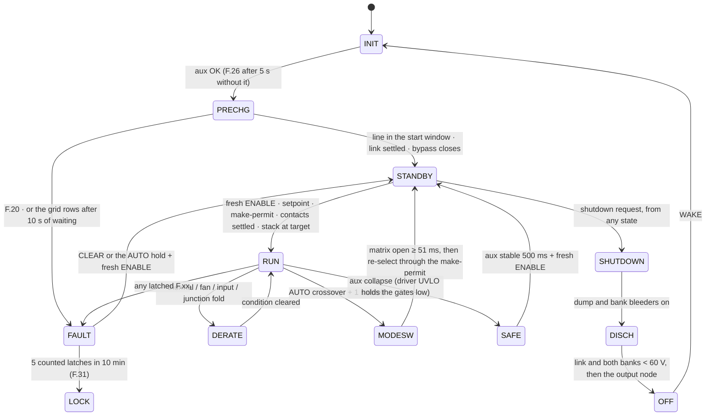

# 💾 Firmware Guide

<sub>The supervisory C99 core — state machine, fault ladder, HAL contract and the host-proven test suite</sub>

<p>
  
  
  
  
</p>

> [!NOTE]
> **Purpose** — the working guide to the firmware tree: what each file owns, the supervisory state machine, how one image
> serves four module identities, the contract a port must honour, the electrical contract the card and the firmware share,
> and the host suite that proves it. The layered design, the timing budget and the protection hierarchy are in the
> [firmware architecture](firmware-architecture.md); the row-by-row trip values are in
> [protection thresholds](protection-thresholds.md).
>
> **Gate coupling** — `review-checks` and `stress-audit` assert passages of this file word for word, so the electrical
> contract in §5 must keep saying what it says today.

## At a glance

| | |
|---|---|
| **Language / dependencies** | portable C99 in `core/`, `proto/`, `hal/` and `boot/` — no HAL, no RTOS, no heap; the MCU port is the only file set that touches a register |
| **Tick** | `pmp_fsm_step()` every 1 ms, watchdog-supervised |
| **Verification** | `sh firmware/run_tests.sh` — seven binaries under AddressSanitizer + UndefinedBehaviorSanitizer with `-Werror` |
| **What the suite covers** | the 26 fault scenarios · rating windows · the current-coordination classes · the group share law · the output-mode latch · codec conformance and a 1 M-frame fuzz · the per-tick relay-exclusion invariant · cycle-by-cycle Vienna and LLC plants · the signed boot chain and power-cut update storms · the adaptive dead time and the weak-leg edge · the junction observer and its decline · the positive-only F.01 with its 100 kHz magnitude trip · the comparator codes as the inverse of the corrected measurement · the ratiometric AVMID check · a discharge resumed from the pre-reset record · the link rows on the shutdown path |
| **Identities in one image** | 30 kW · 40 kW · 50 kW liquid · 50 kW air — selected by the RATING strap (the 3.32 k band is reserved) |
| **Fault vocabulary** | the `F.xx` codes of [protection thresholds](protection-thresholds.md), shown on the HMI and sent in CAN telemetry |

```bash
sh firmware/run_tests.sh
```

## 1. Files

| File | Contents |
|---|---|
| `core/fsm.{h,c}` | `pmp_fsm_step()` — the 1 ms supervisory tick: input sanitization → the hardware-fault mirror → supervisory rows → the state machine (precharge, enable chain, matrix make-permit, mode change, discharge, lockout). `fsm.h` also carries the threshold constants that mirror [protection-thresholds.md](protection-thresholds.md) |
| `core/ctl.{h,c}` | the reference shaper (1 kHz) and the regulator kernel (control ISR) |
| `core/group.{h,c}` | the group share law, run on every module card |
| `core/modapi.{h,c}` | the canonical command and telemetry model between a protocol profile and the core |
| `proto/` | `frame.c` codecs and TX queue · `profile.c` registry · `vmp.c` ([VMP 2.0](can-protocol.md)) · `tonhe_v12.c` ([TonHe V1.2](can-profile-tonhe-v12.md)) |
| `hal/` | `pfc.c` Vienna law · `llc.c` modulator · `dielim.c` junction observer · `meas.c` calibration and grid monitor · `nvm.c` record store · `evlog.c` event ring · `app.c` the interrupt entries and the 1 ms sequence, sans-IO |
| `boot/` | the signed image, the boot decision record, the service-space update protocol, SHA-256 and ECDSA-P256 |
| `port/gd32g553/` | the register-level port: clocks, HRTIMER, ADC and DMA, comparators and DAC, CAN, flash, watchdog, linker scripts, `build.sh` |
| `test/` | `host_sim.c` · `ctl_test.c` · `proto_test.c` · `hal_test.c` · `app_test.c` · `boot_test.c` · `rules_test.c` |
| `run_tests.sh` | one-command build and run with sanitizers and `-Werror` |

## 2. The FSM



Three rules exist because verification broke their predecessors, and they are the ones to preserve through any refactor:

1. **The stack must reach its target before RUN.** After a series ↔ parallel change the banks legitimately sit at the *old*
   mode's ceiling; entering RUN unconditionally guarantees an OVP trip, or hits a connected vehicle. RUN entry needs
   `|stack − target| < max(10 V, 5 %)`, target = the external node when a vehicle is present, else the command clamped to
   the mode ceiling.
2. **A short is low voltage *with* current.** "Current above 110 %" is unreachable while a healthy CC loop caps at 100 %.
   F.16 is V < 50 V **and** I > max(90 % of the command, 10 % of rated) for 10 ms — and it is not evaluated during a
   controlled stop, because a deliberate ramp into a resistive load looks exactly like it.
3. **The matrix closes only into a safe difference.** Zero measured current, and the new stack at least 10 V below the output
   node (the battery when connected, else the terminal capacitors, with a 60 V floor); in parallel the two banks must also be
   within 25 V of each other. The bank bleeders run until the permit is met. Without it, a parallel → series change
   forward-biases the output diode through a making contact with roughly a joule behind it — weld class.

The relay matrix never switches load current: the output blocking diode does the isolating, the output mode is latched in
standby, and a crossover in RUN ramps the current to zero, opens every contact, waits out the diode-suppressed release and
re-starts. A make-permit wait or a soft start that neither completes nor faults is bounded by F.34 at 8 s.

## 3. One image, four identities

The control card is one part number and one firmware image. At boot, before any enable, the HAL reads the **RATING** strap on
ROLE1's ADC input (the card's 10 k pull-up to V3P3 against the board's strap to DGND) and calls `pmp_fsm_set_rating_kw()`:

| Strap | Reading | Identity | Discharge window | `i_rated` | F.01 / F.11 class |
|---|---|---|---|---|---|
| 0 R | < 0.15 V | 30 kW | 3 000 ms | 100 A | 120 / 140 A pk |
| 1 k | 0.15–0.55 V | 40 kW | 4 000 ms | 133.3 A | 155 / 180 A pk |
| 3.32 k | 0.55–1.24 V | reserved — no host, F.30 | — | — | — |
| 10 k | 1.24–1.82 V | 50 kW liquid | 5 000 ms | 166.7 A | 195 / 220 A pk |
| 15 k | 1.82–2.30 V | 50 kW air | 5 000 ms | 166.7 A | 195 / 220 A pk |
| open | > 2.30 V | no host, F.30 | — | — | — |

An undecoded strap keeps the worst-case discharge window and the 30 kW current classes — the longest window can only delay an
F.21 report, never miss it, and the lowest thresholds can only trip earlier. It also latches F.30, so nothing is delivered.

Both 50 kW bands are the same converter: same link, same window, same classes. Only the fan personality differs, and that is
decided by the band: the liquid module is sealed with **zero** fans (the HAL ties `fan_ok` true and ignores the tach inputs,
which the board holds defined-low so an accidental read is "stopped", the fail-safe direction), while the air module has
**four** supervised tachs. The 30 and 40 kW modules have **three** fans each. The liquid module's plate NTCs land on the same
T_PFC / T_LLC channels, and that OT ladder *is* the loss-of-coolant protection: a dry plate at rated load crosses it in
seconds. Flow assurance (pump, flow meter) belongs to the cooling cart.

## 4. The HAL contract

`pmp_fsm_step()` is pure logic over `pmp_in_t` → `pmp_out_t`, and the portable HAL in `firmware/hal/` already implements the
whole contract sans-IO: `app_pfc_isr`, `app_llc_isr`, `app_fault_isr` and `app_tick` fill `pmp_in_t`, run the 1 ms sequence,
attribute the HRTIMER fault channels, program the comparator references, drive the relays and fans, and own the NVM policy.

What a port therefore has to provide is the peripheral layer only:

1. a 1 ms tick that calls `app_tick`, and the two control interrupts that call `app_pfc_isr` (100 kHz) and `app_llc_isr`
   (10 kHz) — both placed in TCM, with the vector table in RAM;
2. calibrated ADC groups and DMA rings behind `app_pfc_adc_t`, `app_llc_adc_t` and the slow channels;
3. the HRTIMER carrier, the per-leg dead times the modulator asks for, and the fault channels wired to the comparators and
   the external FLT input — firmware re-asserts, silicon acts first. An output is enabled in one place only, on its OFF → ON
   transition, inside a critical section that checks the supervisor's acknowledgement (`trip_n == trip_ack`) and the
   timer's own fault flags before the write and the flags again after it; everything the control interrupts execute or
   read lives in TCM and the build audits the linked image;
4. the comparator and DAC references from `app_tick_out_t.dac_v[]`, the digital outputs from `do_bits`, and the relay
   economizer duties from `relay_duty[]`;
5. the mirror-contact and driver-ready inputs in `di`, the tach edge counters (handed over in hertz), and the panel shift register;
6. CAN (receive into a ring, transmit from the queue, bus-off restart on request) and the flash primitives behind
   `nvm_port_*`;
7. the WDI pulse on the port's own 10 ms of real time, taken only when `app_tick` grants permission;
8. DWT execution timing, the reset-cause byte, the silicon UID, the factory reference word, the no-init handoff page and the
   application's own sealed record of a commanded discharge (`disch_intent` out, `disch_pending` back in at boot).

There is no inter-MCU link: one card runs both stages, so a starved external CAN stream is F.28 and nothing else. Enable
outputs must never be configured with reset retention — the whole safety argument relies on reset meaning pulled-down
defaults.

## 5. Board integration notes

The electrical contract between the card and the firmware. These are the passages the review gates assert.

- **ADC scaling.** The CT channels (three line, one resonant) are biased at AVMID ≈ 1.65 V and are *ratiometric* to VREF; the
  iso-amp and divider channels are absolute, so the internal-reference correction `k_ref` applies to them. Nominal transfers:
  line CTs 2500 : 1 into 22 / 18 / 13 Ω (30 / 40 / 50 kW) · resonant CT 100 : 1 into 0.47 / 0.36 / 0.30 Ω · DC channels
  (bus, midpoint, banks, output) through an AMC1311-class amplifier, 1.44 V output common mode · AC phase voltages through
  an AMC1350-class amplifier, differential gain 0.40, with the ~1.25 MΩ input loading the 11.5 k divider bottom · output
  shunt 0.500 / 0.376 / 0.299 mΩ at a differential gain of 8 (50 mV at the rated code). **Rail monitors** SNS_V24 (82 k /
  10 k) and SNS_V15 (47 k / 10 k), in-window at 20.4–27.6 V and 12.75–17.25 V. The EOL fixture writes the per-channel gain
  and offset; a record more than 10 % off a nominal gain, more than 150 counts off a nominal offset, or missing altogether,
  latches F.30 and inhibits delivery — there is deliberately no CAN write path for calibration.
- **Output-current sign.** VINP rides the shunt's KB (OUTN side) and VINN rides KA, so
  **positive (SNS_IOUT − SNS_IOUTN) = delivering current to the vehicle**. Verify it with a small known load before closing
  the current loop; every protection row and every telemetry sign follows this orientation.
- **AVMID is a measured channel, not an assumption.** Every bipolar sense is referenced to that buffer, so a drifting
  buffer or ladder moves all three phase currents and the F.01 / F.11 thresholds together. It is converted every tick and
  must read 1.65 V ± 50 mV; 100 ms outside that is F.29.
- **Fault path.** One wired-OR `FLT` line (active low, pulled up on the card) lands on PB10 / HRTIMER_FLT2 and carries both
  the gate drivers' DESAT outputs and the resonant window comparator. **F.11 attribution** happens in the fault ISR: it reads
  the freshest *completed* I_RES conversion at the edge, and a magnitude at or above 90 % of the tank class is the tank's
  (F.11), otherwise the drivers' (F.02). The tank slews tens of amps per microsecond, so the cached control-period value was
  not fresh enough to tell them apart.
- **PFC reverse-direction hardware trip.** The line-current comparators are allocated instance-aware — **I_A0 = PB0 /
  CMP3_IP, I_B0 = PA3 / CMP1_IP, I_C0 = PC1 / CMP2_IP** — with their outputs on HRTIMER fault channels 1, 0 and 4. Each DAC
  carries the **positive** reference only: the comparators are non-inverting into active-high fault inputs, so a reference
  below AVMID would assert the fault for the whole time the measured current reads negative — at idle, where the sign of
  ≈ 0 A is noise, that is F.01 within milliseconds of boot. The negative polarity is covered instead by a magnitude test on
  the raw current in the 100 kHz interrupt, which is sign-blind by construction, backed by Σ i = 0: in a three-wire stage a
  negative excursion beyond twice the trip always shows as a positive one at or above the trip somewhere else, and the
  comparator catches that in nanoseconds. The device-level DESAT covers the forward direction only; the ≈ 2–3 µs
  threshold-to-gate-off figure is a design target until EVT measures it in both polarities, because the CT's HF response is
  not vendor-specified.
- **Watchdog.** The external supervisor runs a fixed window: a falling WDI edge is valid 2.22–23.375 ms after the last one.
  Its open-drain WDO is both a hard input to the gate-enable AND and wire-ORed onto NRST, so a missed window drops the gates
  *and* resets the MCU — a hung brain restarts with every enable low instead of re-arming milliseconds later with its enable
  pins still latched high. Three port obligations follow: the reset pin stays in reset mode and must never be remapped to
  GPIO in the option bytes; the WDI cadence is owned by the tick interrupt (real time), not by the main loop, and a flash
  operation buys its own bounded allowance with a fresh edge at the operation; and the reset cause is read at boot and
  raised as F.32 even though the hardware has already made the card safe.
- **Relays.** Only the bypass pair has a mirror contact, on a series normally-open auxiliary chain: the input reads LOW when
  **both** bypass contacts are closed and HIGH when at least one is open, so the port inverts it. The matrix relays carry no
  mirror contacts, which is why the soft start waits out operate plus bounce (40 ms) after a close command instead of
  trusting the coil bit, and why `relay_fb_wired` names the bypass alone. **Relay economization:** after 60 ms of pull-in at
  100 % duty the coil is held at 40 % on a 20 kHz chop, which roughly halves the steady 24 V demand. KSER rides a timer
  channel and is chopped; KPARA is held DC on purpose (the exclusion interlock is a *level* gate — a 40 % chop would make it
  low for 60 % of every period, releasing the very interlock it exists for), and KPRE and KPARB hold DC because their pins
  carry no timer channel.
- **Discharge.** `CTL_QDIS` is active-high into an opto LED and `CTL_QDISBK` drives the bank bleeders; both default OFF in
  hardware at reset and tri-state. SHUTDOWN commands both, and DISCH supervises them: the dump ends when the link and both
  banks read below 60 V on plausible samples for 100 ms, and then the output node is waited out under its own 20 s bound
  (nothing in the module dumps the studs — only the passive bleeder does, and a connected pack never falls at all), which is
  why that bound expiring is not a fault.
- **F.21 semantics.** The discharge timeout's real coverage is the **AC-present** case: the bus is held up through the
  permanent precharge path, the timer expires, and F.21 means "isolate upstream, then verify" — never "keep burning", so the
  dump commands end with the row. A link that has stopped falling (under 2 V per 100 ms sample, three samples running) is
  reported the same way at 300 ms rather than at the end of the window, because it is being fed and the dump resistors are
  carrying several times their rating while it is. If the bypass mirror still reads closed 200 ms into the dump, the
  maintained source is named: F.18, reported when the dump ends so the report cannot abandon the discharge. With AC
  **removed** the aux browns out mid-discharge at a few hundred volts of link and the MCU dies un-faulted; the passive
  balance path and the enclosure label finish the job over the minutes that
  [protection thresholds](protection-thresholds.md) tabulates. Do not chase a latched F.21 after AC removal.
- **Enables.** Each stage's enable is a GPIO into its safety AND with the supervisor and the driver-ready signal; there is no
  separate kill net on the card, and `out.pwm_kill` is the FSM's own software gate on those two GPIOs.
- **Cold-start budget.** The aux controller is the NCP1252 **D** version (no mandatory pre-start delay, 5 V UVLO hysteresis)
  with a 220 µF VCC reservoir: expect ≈ 5–6 s from AC apply to rails-up at a 565 V precharged bus (nominal 400 V line), and
  ≈ 8 s at low line with the worst startup draw. Size any boot supervision at ≥ 10 s.
- **Boot and provisioning.** BOOT0 strapped low, SWD on the card's headers; the EOL flow of
  [dfm-production.md](dfm-production.md) writes the calibration record.

## 6. Control contracts in firmware

### 6.1 Current coordination

| Contract | What the code does | Why |
|---|---|---|
| PFC reference clamp | the current-loop reference amplitude is clamped at 1.05 × the rated crest at the 330 VAC full-power floor, and further reduced by the room a line step needs during the transport delay | the cycle-by-cycle Vienna model shows dips and phase jumps adding a few amps on top, which must not reach F.01 |
| Bus-reference floor | `vbus_ref = clamp(max(2 · bank / 0.95, 1.08 · √2 · V_LL), 650, 830)`, recomputed every tick | a Vienna rectifier cannot regulate below the line-line crest: 475 VAC on a 650 V bus is 75 % overmodulation and 15 % THD; with the floor it is 0.1 % |
| Bus reference follows the output | the reference leads the *measured output* by `PMP_BUS_LEAD_V` (25 V), not the command | vehicles send their maximum voltage as the setpoint and charge in constant current far below it; taking the reference from the command parked the link at 830 V over a 330 V pack, which puts the bridge at f_max and into phase shift across the mainstream range |
| Start mode from the battery | the start mode uses the external node when a vehicle is connected; the RUN crossover uses the measured output | choosing series from an EV's maximum-voltage command ran the banks under their floor |
| Over-current classes | `pmp_fsm_set_rating_kw()` sets `oc_line_a` / `oc_tank_a` from the strap (§3) and the HAL writes the comparator DACs from them — firmware may tighten, never loosen | 1.2 × the simulated worst peak, with observability through the fault-path rise time. One full-bridge tank CT, so the tank class is the whole-bridge peak |

### 6.2 The PFC current loop against the input filter

The input filter is part of the plant. Three properties keep the loop stable against it, and the margins were computed with
all three in place:

| Contract | What the code does | Why |
|---|---|---|
| Loop delay | phase currents are sampled at the carrier peak **and** valley (100 kHz) and the duty computed from a sample is loaded at the next half-period — sample → PWM ≤ 15 µs | with the damped filter the modulus margin is 0.53–0.65 at 15 µs across the grid-inductance and leakage corners; at a 30 µs single-update delay it collapses (see [architecture §3.5](firmware-architecture.md#35-one-mcu-for-both-stages)) |
| Voltage feed-forward | the feed-forward and the resistive-emulation reference use the sensed phase voltages with the divider's RC lag rotated out by mixing the other two phases: v′ₖ = vₖ + ωτ · (vₖ₋₁ − vₖ₊₁)/√3 | without it the same margins drop to 0.36–0.43 |
| Gain per rating | the current-loop proportional gain is 2π · 3 kHz · L_D1 at the clamp crest, from the strap | one gain placed on a bare inductor crosses over far too high on the real D1 roll-off and is unstable at any extra delay |

Not firmware, but the acceptance for all three: a grid-impedance step test at Lg ≈ 100 µH per phase, with several paralleled
modules on one transformer and the loop delay measured on the scope.

### 6.3 Output modes and the precharge window

| Contract | What the code does | Why |
|---|---|---|
| Output mode | `omode_req` ∈ {AUTO, LOW, HIGH} is latched in STANDBY only. LOW → banks parallel, ceiling 500 V · HIGH → banks series, ceiling 1 000 V, refused below 480 V · AUTO → series above 500 V, else parallel | a bank tops out at 500 V, which is the edge the tank was solved for |
| AUTO crossover | in AUTO only: parallel → series when the battery (or the command with no vehicle) exceeds 500 V, series → parallel below 480 V; ramp to zero, open every contact, re-select through the make-permit, soft start again | 20 V of hysteresis, and the battery voltage rather than the request decides |
| Series screen | on a series start, a bank difference above 25 V once either bank passes 50 V, held 10 ms, latches **F.17** | a welded parallel contact ties the bank tops and shows up as imbalance at the first series ramp |
| Precharge bypass | the bypass closes when the link has **settled** — two consecutive 20 ms samples moving less than 3 V — and sits above 0.85 × the rectified crest of the highest line | a settled link bounds the closing step at the resistor drop, whatever the wave shape. A fixed fraction of the *sinusoidal* crest is unreachable on flat-topped mains (real crest factor 1.36–1.40), and F.20 is a counted latch, so five attempts locked the module |
| F.01 blanking | 60 ms from the bypass close command, line-over-current channels only; no PFC enable inside the window; the HAL clears those HRTIMER latches at its end | the residual step drives an LC pulse through the input choke and the rectifier into the link, above F.01, with the PFC not yet switching. Only the three line channels are blanked — clearing the bus or output OVP latch sixty times running would undo a hardware latch the window has nothing to say about |

### 6.4 Magnetics and thermal protection

| Contract | What the code does | Why |
|---|---|---|
| NTC open-loop guard | `pmp_ntc_guard_c()` returns 150 °C when a zone's ADC fraction reaches 0.98, and every zone passes through it before the worst is taken | the transformer bond-loss cutouts sit in series with the T_XFMR NTC, so an open cutout or a broken lead must latch F.22 rather than read "very cold". A healthy sensor at −40 °C reads ≤ 0.96, so the guard cannot fire on cold |
| Zone mapping | each zone's own derate and trip are mapped onto the core's 105 / 115 °C scale and the worst is handed over | one derate slope over one sensor lets a cool inlet hide a hot transformer loop, or the reverse |
| Junction fold | `hal/dielim.c` estimates the worst die's junction temperature from the operating point every millisecond and folds availability across 142–150 °C | the corners that need folding run the die 80–170 K above a base that is still cool, so the NTC ladder never sees them |

### 6.5 Group share law

The charger controller is the group master and broadcasts one group frame; every module derives its own share from that one
frame, so no module infers its peers by hearing and there is no split brain. Call `pmp_group_frame()` for each decoded frame
and `pmp_group_step()` every 1 ms; the result feeds the current setpoint and the delivery permission.

| Rule | Value | Why |
|---|---|---|
| share | own bit set ? min(own available current, request ÷ members) : 0 | one observer, one arithmetic |
| lower / raise | lower at once; raise only after 1 300 ms, and a *grown* pending target restarts the hold | a peer still on an older, larger share has by then missed every frame for longer than the stale window and already ramped to zero, so the sum never exceeds the request |
| staggered delivery | own bit present for the hold + rank × 300 ms (rank = member bits below own) | a deterministic start order without an election |
| stale | no frame for 1 000 ms → share 0, no delivery | the FSM's graceful communication-loss ramp does the rest |

## 7. The host suite

`run_tests.sh` builds each binary with `-std=c99 -Wall -Wextra -Werror -O1` under AddressSanitizer and UndefinedBehaviorSanitizer
with `-fno-sanitize-recover=undefined`, and runs them in order:

| Suite | Scope |
|---|---|
| `boot_test` | SHA-256 and P-256 vectors, signed-image acceptance and every refusal code, the boot decision table, the update protocol end to end on a flash model that behaves like the real FMC (8-byte rows, a second program of a row refused) |
| `host_sim` | the 26 fault scenarios on a behavioural plant with relay mirror contacts, the protection and recovery regressions, three group-law nodes, and the every-tick invariants (relay exclusion, make-permit, aux) |
| `ctl_test` | the shaper's rules and the regulator's properties: bounds, no windup, bumpless transfer at the limit, NaN containment, slew and stop-ramp limits, the junction fold and the share trim |
| `proto_test` | frame helpers, TonHe V1.2 and VMP 2.0 conformance (the vendor document's example frames byte for byte), a 1 M-frame fuzz per profile, and one core driven through both profiles |
| `hal_test` | the Vienna law on a cycle-by-cycle plant (start, load step, dump, THD / PF / midpoint, deep sags, a phase jump, reversed sequence) · the LLC modulator on a switched tank (the ZVS table against the FHA corners, CV, CC into a battery, the floor, burst, the weak-leg dead time) · measurement and DC removal · the record store under a power cut at every byte and step |
| `app_test` | the application end to end on averaged plants: boot to delivery, the controlled stop, each fault channel, F.30 / F.32 / F.35 / F.37, the watchdog gate, sag ride-through, CAN bus-off, configuration storage, the F.01 reference through both half cycles, and the junction observer's fold and decline |
| `rules_test` | the review rows kept as regressions: the dead-time floor and the weak-leg edge, the FSM rows added with them, the per-rating fan count and fault channels, and the protocol fixes |

> [!TIP]
> **How this page is checked** — `sh firmware/run_tests.sh` under ASan/UBSan across seven binaries, with `-Werror`; several passages of §5 are asserted word for word by `calculations/review-checks.mjs` and `calculations/stress-audit.mjs`.

---

<div align="center">
<sub><a href="control-card-scope.md">← Control-Card Scope</a> &nbsp;·&nbsp; <a href="README.md">🧭 Documentation hub</a> &nbsp;·&nbsp; <a href="firmware-architecture.md">Firmware Architecture →</a></sub>

<sub>Vectivolt DC-Modules · documentation rev E84 · every number reproduces with <code>sh calculations/run-all.sh</code></sub>
</div>
