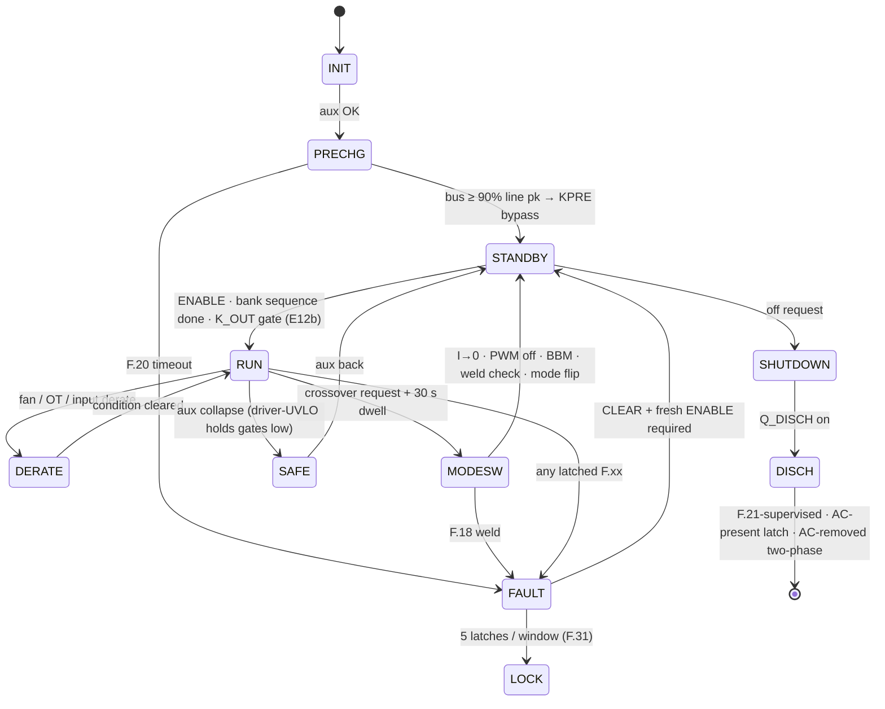
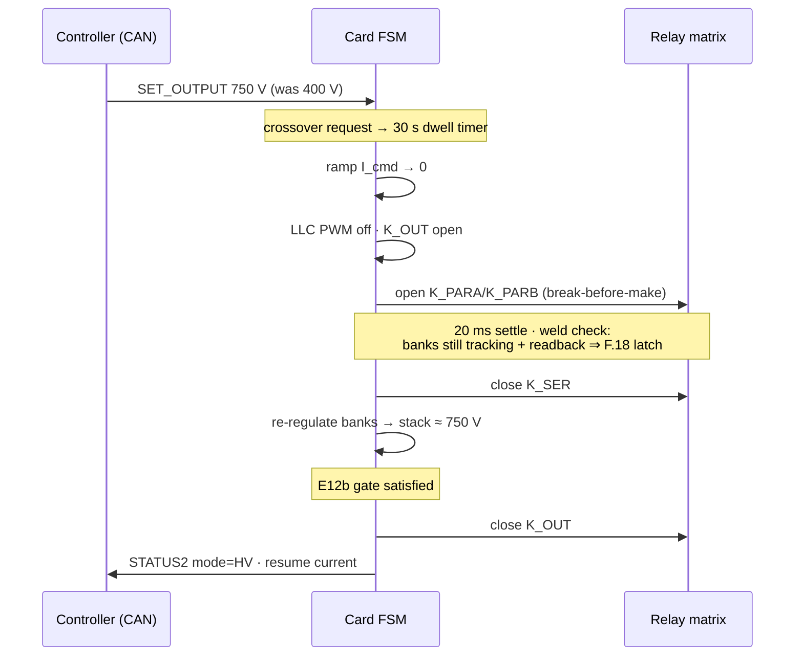

# 💾 Firmware Guide

<sub>The supervisory C99 core — state machine, fault ladder, HAL contract and the host-proven test suite</sub>

<p>
  
  
  
  
</p>

> [!NOTE]
> **Purpose** — the supervisory C99 core: its state machine, the HAL contract a port must honour, boot identity,
> F.21 semantics and the contracts added by the external review rounds R5–R7 and by E60.
>
> **Gate coupling** — `review-checks` (R6-B, R6-C, R6-E) and `stress-audit` assert passages of this file word for
> word, so edits here are **additive**: superseded values are marked, never deleted.

## At a glance

| | |
|---|---|
| **Language / dependencies** | portable C99 — no HAL, no RTOS assumptions |
| **Tick** | `pmp_fsm_step()` every 1 ms, watchdog-supervised |
| **Verification** | `firmware/test/host_sim.c` — **54 / 54** under AddressSanitizer + UndefinedBehaviorSanitizer, `-Werror` |
| **What the suite covers** | 26 fault scenarios · rating windows · E60 coordination rules · 10 CSU scenarios · codec guards · 100 000-frame fuzz · the per-tick relay-exclusion invariant |
| **Identities in one image** | 30 kW · 40 kW · 50 kW liquid · 50 kW air · cabinet CSU — selected by the RATING strap |
| **Fault vocabulary** | the `F.xx` codes of [protection thresholds](protection-thresholds.md), shown on the HMI and sent in CAN telemetry |

The `firmware/` tree holds the **normative** control-plane logic, verified against the same plant and the same
26 fault scenarios as the design-phase model. Run it yourself:

```bash
sh firmware/run_tests.sh
```

## Files

| File | Contents |
|---|---|
| `firmware/core/fsm.h` | states, fault codes (`F.xx` ↔ `FC_*`), threshold constants (mirror of [protection-thresholds.md](protection-thresholds.md)), I/O structs, API |
| `firmware/core/fsm.c` | `pmp_fsm_step()` — 1 ms supervisory tick: HW-fault mirror → supervisory checks → state machine (precharge, enable chain, pre-insertion S/P sequencing, K_OUT gate, dwell, weld check, lockout, discharge) |
| `firmware/core/can_proto.{h,c}` | CAN 2.0B codec per [can-protocol.md](can-protocol.md): 29-bit ID pack/parse, SET_OUTPUT / MODULE_CTL / STATUS1/2 / TEMPS / BUS frames — little-endian, DLC- and range-guarded, contradiction-rejecting |
| `firmware/test/host_sim.c` | the verification rig: behavioral plant + 26 scripted scenarios + CSU suite + codec round-trips + fuzz + the per-tick matrix-exclusion invariant |
| `firmware/run_tests.sh` | one-command build & run with sanitizers, `-Werror` |

## The FSM



Two rules that exist because verification **broke** their predecessors:

1. **E12b — the K_OUT gate.** After a series↔parallel transition the banks legitimately sit at
   the *old* mode's ceiling; closing K_OUT unconditionally guarantees an OVP trip (or hits a
   connected vehicle). The C port caught this — the JS model had masked it. K_OUT now closes only
   when `|stack − target| < max(10 V, 5 %)`, target = v_ext if a vehicle is present, else v_cmd.
2. **F.16 rev B.** The original short-circuit criterion (I > 110 %) is unreachable when a healthy
   CC loop caps current at 100 % — found by the scenario suite. Now: V < 50 V **and** I > 90 %·I_cmd
   sustained 10 ms.

## S/P transition, as the firmware actually runs it



## Porting to the GD32G553 (the HAL contract)

`pmp_fsm_step()` is pure logic over `pmp_in_t` → `pmp_out_t`. The MCU integration layer must:

1. call it from a 1 ms tick (watchdog-supervised; a missed WDI window drops the gates AND resets the MCU — WDO ≡ NRST, R5-A);
2. populate `pmp_in_t` from calibrated ADC/CT/NTC channels (pin maps in `boards.tsx`, EOL cal per [dfm-production.md](dfm-production.md));
3. mirror `out.pwm_kill` and driver `FLT` lines in **hardware** (HRTIM fault inputs + comparators) — firmware re-asserts, silicon acts first;
4. map `out.k_*` through the ULN drivers and read back contact states into `relay_fb[]`;
5. keep `PMP_MODE_DWELL_MS` at its product timebase (30 000 ms; the host suite compresses time 1000×);
6. (single-brain, E40) there is no inter-MCU link — external CAN starvation is F.28; the 40-way harness carries no protocol, only signals with board-side default-OFF.

The ONE card (E40) runs the whole vocabulary — precharge, enables, S/P matrix, discharge — and the
same `F.xx` codes appear on the HMI and in CAN telemetry (STATUS2/FAULT_EVT).


---

## Board rev C integration notes (2026-09-05)

> [!WARNING]
> **Dated notes — read with this table.** The passages below are kept word for word because review gates assert
> them. Where a later decision changed a constant, the current value is here:
>
> | Constant in the notes below | Current value | Decided at |
> |---|---|---|
> | line CT burden 27 Ω (50 kW: 21.5 Ω) | **22 / 18 / 13 Ω** (30 / 40 / 50 kW) | E60 |
> | resonant CT burden 2.0 Ω, F.11 70 A pk at DAC 3.05 V (50 kW: 1.6 Ω) | **1.2 / 0.91 / 0.75 Ω · F.11 85 / 115 / 145 A pk** | E60 |
> | `PMP_DISCH_TO_MS` 3000 / 5500 / 9000 ms | **3000 / 4000 / 5000 ms** from the strap | E41 / E42 |
> | ROLE0 slot strap, "each MCU drives its own EN" | **removed** — one brain, RATING is the only strap | E40 |
> | suite 49 / 49 or 50 / 50 | **54 / 54** | E60 |

The supervisory logic (`fsm.c`) is unchanged — these bind existing hooks to the rev C hardware:

- **ADC scaling (rev D — R2 CB-16):** CT channels are biased at AVMID (VREF/2 ≈ 1.65 V) with
  **per-family burdens**: line `i = (raw·3.3/4096 − 1.65) / 27 · 2500` (27 Ω — R3/audit: 33 Ω clipped 150 A pk observability at the 3.3 V rail); resonant
  `i = (raw·3.3/4096 − 1.65) / 2.0 · 100` (2.0 Ω burden — the 33 Ω constant here was the R2
  CB-16 defect; F.11 comparator DAC = 3.05 V for 70 A pk). AC phase-voltage channels come from
  ±5 V iso amps (gain 0.41, output centered mid-rail): bipolar conversion with the amp's datasheet
  offset. Bus/bank/output channels are unipolar 0–2 V iso-amp outputs. `SNS_IOUT`/`SNS_IOUTN`
  form a software differential (subtract before scaling — MR-6). **Rail monitors** SNS_V24/SNS_V15
  (pins 51/52): ÷7.8 and ÷5.7 dividers — alarm at ±15 %.
- **Fault path (E40 merge):** the ONE wired-OR `FLT` lands on card pin 47 (PB10 —
  HRTIMER_FLT2 hardware trip); latch F.02/F.12-class faults from it. It is also the F.32
  visibility path after a watchdog restart.
- **Bank discharge (rev D — E33):** on SHUTDOWN, after `q_disch`, assert `CTL_QDISBK` (pin 75) —
  both bank bleeders fire (τ ≈ 4–17 s per SKU); supervise as F.21b (2× τ timeout per SKU). The
  bus F.21 timeout is now implemented in `fsm.c` with `PMP_DISCH_TO_MS` (override per SKU at
  build: 3000/5500/9000 ms).
- **Watchdog (R5-A rev):** kick `WDI` inside the CWD-programmed window from the control loop
  tick. The external WD's open-drain `WDO` is BOTH a hard input to the GATE_EN AND (E27) AND
  wire-ORed onto `NRST_CARD` (R5-A): a missed window now drops the gates and RESETS the MCU —
  a hung brain restarts with every enable low instead of re-arming milliseconds later with its
  EN GPIOs still latched high. HAL contract: (1) EN/CTL_* GPIOs must NEVER be configured with
  reset retention — the whole mechanism relies on reset ⇒ pulled-down defaults; (2) boot must
  reach the first WDI kick inside the CWD startup window (§K sizes CWD against measured flash
  boot + init at EVT); (3) after restart, log the reset-cause register and raise F.32 — the
  event is visible even though hardware already made it safe; (4) **PG10-NRST stays in NRST
  mode — the option bytes must NEVER remap it to GPIO** (R6: the whole mechanism rides on
  pin 14 being reset). Repeated watchdog resets hold the module safe by construction: gates
  are low through every WDO-low and every boot.
- **PFC reverse-direction hardware trip (R6/E47 · R7-A allocation):** the comparator channels
  are now pinned INSTANCE-aware (the R6 "CMP-capable" rule missed that B and C shared CMP2's
  two inputs): **I_A0 = PC2/CMP7_IP, I_B0 = PA3/CMP1_IP, I_C0 = PC1/CMP2_IP**, DAC thresholds
  on the IM sides, outputs → HRTIMER fault. ADC map change that rides along: **I_B0 is now
  ADC0_IN3 (PA3) and SNS_VAC1 is ADC01_IN5 (PC0)** — update the channel table with the pin
  map, both regenerate from umod-pinmap. Each phase carries ONE threshold on the DESAT-blind
  polarity by design (the other polarity is DESAT's); the ~2–3 µs figure is a design target
  until EVT measures threshold-to-gate-off in both polarities (the ACX CT's HF response is
  not vendor-specified).
- **Output-current sign (R6-E):** VINP rides the shunt's KB (OUTN side), VINN rides KA — so
  **positive (SNS_IOUT − SNS_IOUTN) = delivering current to the vehicle**. Verify with a small
  known load before closing the current loop.
- **Cold-start budget (R6-G):** the aux controller is the NCP1252 **D** version (no 120 ms
  pre-start delay, 5 V UVLO hysteresis) with a 220 µF VCC reservoir; expect ≈5–6 s from AC
  apply to rails-up at a 565 V precharged bus (nominal 400 VLL; ≈8 s at low line with the
  100 µA worst startup draw — size any boot supervision to ≥10 s) (0.59 mA through the 940 k startup feed). The
  CSU's staggered-enable already tolerates this.
- **F.21 semantics (R6):** the discharge timeout's real coverage is the AC-PRESENT case
  (bus held up by the permanent RPRE rectifier path → timer expires → FC_DISCH = "isolate
  upstream"). In the AC-removed case the aux browns out at ~321 V bus mid-discharge, the MCU
  dies un-faulted, and the passive balance path + enclosure label finish the job (3.7–6.2 min
  to <60 V per SKU — R8-corrected balance-string model, per protection-thresholds). Do not chase a latched F.21 after AC removal.
- **Enable:** each MCU drives its own `EN_PFC`/`EN_LLC` high only in states where gating is legal;
  the AND with the peer + WD forms `GATE_EN_A/B`. There is no PWM_KILL net anymore.
- **Relay feedback:** `relay_fb[]` reads the card ways DI0–DI5 = KSER, KPARA, KPARB, KOUT,
  KPREA, KPREB mirror contacts (low = main open; a dual-relay function carries series mirrors
  on one net — low = BOTH mains open) and DI8 = the KPRE1+KPRE2 series chain (high = both
  open). Way→pin authority: `umod-map.gen.ts`. F.19 evaluates exactly as coded.
- **Discharge:** `CTL_QDIS` is active-high into an opto LED; default (reset/tri-state) = OFF.
  No inversion vs the FSM's `discharge_cmd`.
- **Relay economization (E26):** after 60 ms pull-in at 100 % duty, PWM coil hold at ~40 %
  (24 V coils, 20 kHz) — halves steady 24 V demand; implement in the HAL coil driver.
- **Boot/provisioning:** BOOT0 strapped low, SWD on the JSWD headers (CB-13); EOL flow per
  dfm-production.md step 4 is now physically possible.

## Card boot identity (E35/E37 — one image, straps decide)

The control card is ONE part number and ONE firmware image for both converter roles and both
ratings. At boot, before any enable, the HAL must:

1. Read **ROLE0** (GPIO, pin 90): low = AC-DC slot (board ties the way to DGND), high/floating
   (card 10k pull-up) = DC-DC slot. Configure the role personality (PWM semantics, AIN map,
   DO/DI meanings) accordingly.
2. Read **ROLE1/RATING** (ADC, pin 38) against the card's 10 k pull-up to V3P3 and the board's
   strap to DGND — decode per the **rev F band table below** (0R/1k/3.32k/10k/open). Call
   `pmp_fsm_set_rating_kw()` with the decoded rating — it narrows the F.21
   discharge-supervision window; an undecoded strap keeps the worst-case default, which can
   only delay the F.21 report, never miss it. (This step originally read ~1.65 V as "60 kW" —
   two-card era; rev F reassigns that band, see below.)

**E24 rev D (E40): RATING is the only strap — ROLE0 and the inter-card LINK are gone.** Bands: <0.41 V (0 R) → **module controller** (one brain, PFC+LLC) · 0.41–1.24 V (3.32 k) → **CSU** · >2.4 V (open) → no host, fault. Formerly rev C: Board strap 3.32 k against the card 10 k pullup
reads ≈0.82 V. Windows (**rev G, E44**): <0.15 V (0R) → 30 kW · 0.15–0.55 V (1k) → **40 kW** ·
0.55–1.24 V (3.32k) → **CSU** · 1.24–1.82 V (10k) → **50 kW LIQUID** · 1.82–2.30 V (15k) →
**50 kW AIR** · >2.4 V → no board / fault. (Rev F had retired the stale two-card-era 10 k =
"60 kW" reading; rev G splits its band for the air twin — ±1 % separations proven by the
verify-independent gate.) Both 50 kW bands call `pmp_fsm_set_rating_kw(50)` — same 16-can link,
same 5000 ms F.21 window; ONLY the fan personality differs and it is HAL band-decided. Windows:
3000/4000/**5000**/5500-legacy ms — suite 49/49. In the CSU band the boot path runs `pmp_csu_*`
(cabinet supervisor, `firmware/core/csu.h`) instead of the power FSM; ROLE0 is a don't-care.
Same image, five identities.

**50 kW AIR HAL notes (E44):** four fans — FAN_PWM1 drives fans 1–2's rail... fans 1/2 on
PWM1/PWM2 individually, fans 3+4 gang FAN_PWM2 (rear pair). ALL FOUR tachs supervised:
TACH1–3 on the E40/E41 pins, **TACH4 on pin 90 / way 88 / harness W39** (E44). Fan-fail derate
per the existing `fan_ok` path; the 4-fan set runs the family's ~395 W/fan density.

**50 kW liquid HAL notes (E42):** the module is sealed with ZERO fans — HAL ties `fan_ok = true`
permanently, leaves FAN_PWM0/1 outputs idle and ignores the tach inputs (the board holds all
three tach ways defined-LOW via RFDT terminators, so an accidental read reports "stopped", the
fail-safe direction). The plate NTCs land on the same T_PFC/T_LLC channels; the existing OT
ladder (derate at `PMP_OT_DERATE_C`, trip 115 °C) IS the loss-of-coolant protection — a dry
plate at rated load crosses the ladder in seconds, well inside the 10 ms FSM tick. Flow
assurance itself (pump, flow meter) is the cooling cart's job, charger-level per the E42 system
boundary. Sense calibration constants for the re-scaled CT burdens (21.5 Ω line / 1.6 Ω
resonant) are rating-keyed like every other cal row. **R4-7:** the V24 monitor divider is
82k/10k on every variant (24 V reads 2.609 V, full-scale 30.4 V) — update the cal constant;
the old 68k basis clipped at 25.7 V.

---

## E60 — current coordination in firmware (2026-09-13)

> [!IMPORTANT]
> Four normative changes land in `firmware/core/fsm.c` and are proven by `firmware/test/host_sim.c`
> (**54/54**, four new checks). Source of the numbers: [`docs/protection-thresholds.md`](protection-thresholds.md)
> § "E60 current-coordination classes" and the standing gate `calculations/system/current-coordination.mjs`.

| Req | What the code does | Why (simulated) |
|---|---|---|
| **FW-R6** PFC reference clamp | HAL current loop clamps the reference **amplitude** at 1.05 × the rated crest at 330 VAC | cycle-by-cycle Vienna: dips/phase jumps then add ≈3 A, not a trip |
| **FW-R7** bus floor | `vbus_ref = clamp(max(2·bank/0.95, 1.08·√2·VLL), 650, 830)` (`PMP_BUS_LINE_K`) | 475/500 VAC on a 650 V floor: 75–92 % overmodulation, 15–40 % THD → 0.1 % with the floor |
| **FW-R8** start mode | STANDBY selects SER only above `PMP_XOVER_DN_V` (525 V), the same threshold RUN uses | SER at 500–525 V = bank 250 V = 2× PAR tank current; the 40 kW LLC folds to 75–93 % there |
| **OC DAC classes** | `pmp_fsm_set_rating_kw()` sets `oc_line_a` / `oc_tank_a` = **120/85 · 155/115 · 195/145 A pk** (30/40/50); HAL writes the CMP DACs from these — firmware may tighten, never loosen | 1.2 × simulated worst peak; observability through the 3 µs race on the E60 burdens |

Host-sim checks added: *start at 510 V selects PAR* · *bus floor at 475 VAC ≥ 1.08·√2·VLL* ·
*50 kW OC classes 195/145* · *40 kW OC classes 155/115*. Default before the strap is read = the
30 kW classes (the lowest thresholds — an undecoded strap can only trip earlier, never later).

---

<div align="center">
<sub><a href="control-card-scope.md">← Control-Card Scope</a> &nbsp;·&nbsp; <a href="README.md">🧭 Documentation hub</a> &nbsp;·&nbsp; <a href="can-protocol.md">External CAN Protocol →</a></sub>

<sub>Vectivolt DC-Modules · documentation rev E61 · every number reproduces with <code>sh calculations/run-all.sh</code></sub>
</div>
