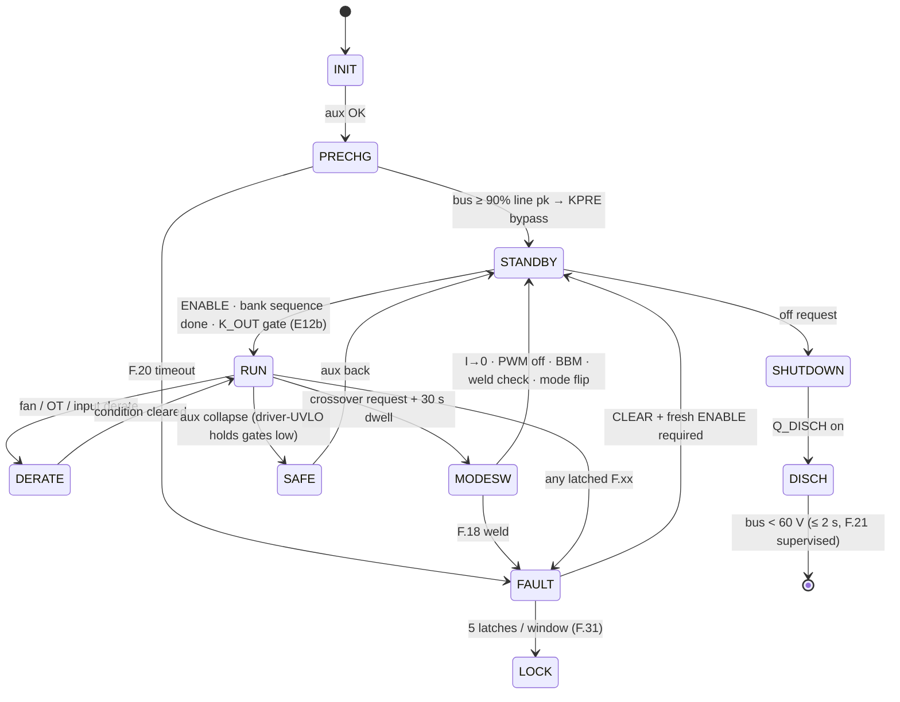

# Firmware Guide — supervisory logic that's already been through hell 🧠

The `firmware/` tree holds the **normative** control-plane logic in portable C99 — no HAL, no RTOS
assumptions — verified against the same plant and the same 26 fault scenarios as the design-phase
model, plus protocol-codec guards and a 100 000-frame fuzz, all under AddressSanitizer +
UndefinedBehaviorSanitizer. **33/33 checks pass**; run it yourself:

```bash
sh firmware/run_tests.sh
# cc -std=c99 -Wall -Wextra -Werror -fsanitize=address,undefined ... → RESULT: 33/33 checks passed
```

## Files

| File | Contents |
|---|---|
| `firmware/core/fsm.h` | states, fault codes (`F.xx` ↔ `FC_*`), threshold constants (mirror of [protection-thresholds.md](protection-thresholds.md) rev B), I/O structs, API |
| `firmware/core/fsm.c` | `pmp_fsm_step()` — 1 ms supervisory tick: HW-fault mirror → supervisory checks → state machine (precharge, enable chain, pre-insertion S/P sequencing, K_OUT gate, dwell, weld check, lockout, discharge) |
| `firmware/core/can_proto.{h,c}` | CAN 2.0B codec per [can-protocol.md](can-protocol.md): 29-bit ID pack/parse, SET_OUTPUT / MODULE_CTL / STATUS1/2 / TEMPS / BUS frames — little-endian, DLC- and range-guarded, contradiction-rejecting |
| `firmware/test/host_sim.c` | the verification rig: behavioral plant + 26 scripted scenarios + codec round-trips + fuzz |
| `firmware/run_tests.sh` | one-command build & run with sanitizers, `-Werror` |

## The FSM



Two rules that exist because verification **broke** their predecessors:

1. **E12b — the K_OUT gate.** After a series↔parallel transition the banks legitimately sit at
   the *old* mode's ceiling; closing K_OUT unconditionally guarantees an OVP trip (or hits a
   connected vehicle). The C port caught this — the JS model had masked it. K_OUT now closes only
   when `|stack − target| < max(10 V, 5 %)`, target = v_ext if a vehicle is present, else v_cmd.
2. **F.16 rev B.** The original short-circuit criterion (I > 110 %) is unreachable when a healthy
   CC loop caps current at 100 % — found by the scenario suite. Now: V < 50 V **and** I > 90 %·I_cmd
   sustained 10 ms.

## S/P transition, as the firmware actually runs it


## Porting to the GD32G553 (the HAL contract)

`pmp_fsm_step()` is pure logic over `pmp_in_t` → `pmp_out_t`. The MCU integration layer must:

1. call it from a 1 ms tick (watchdog-supervised; missing ticks trips the independent WDT → `PWM_KILL`);
2. populate `pmp_in_t` from calibrated ADC/CT/NTC channels (pin maps in `boards.tsx`, EOL cal per [dfm-production.md](dfm-production.md));
3. mirror `out.pwm_kill` and driver `FLT` lines in **hardware** (HRTIM fault inputs + comparators) — firmware re-asserts, silicon acts first;
4. map `out.k_*` through the ULN drivers and read back contact states into `relay_fb[]`;
5. keep `PMP_MODE_DWELL_MS` at its product timebase (30 000 ms; the host suite compresses time 1000×);
6. exchange `LINK` frames (CRC16 + sequence) across the board harness — 50 ms starvation latches F.27 on both boards independently.

MCU-PFC runs the subordinate slice of the same header (precharge, lane enables, `GATE_EN`,
`CTL_QDIS`) so both processors share one vocabulary of states and fault codes — which is also what
the HMI displays (`F.xx`) and CAN telemetry (STATUS2/FAULT_EVT) speak.
