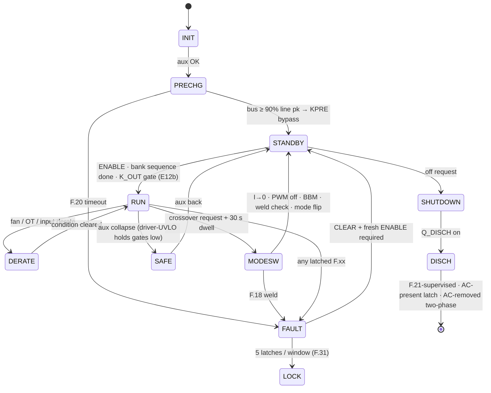
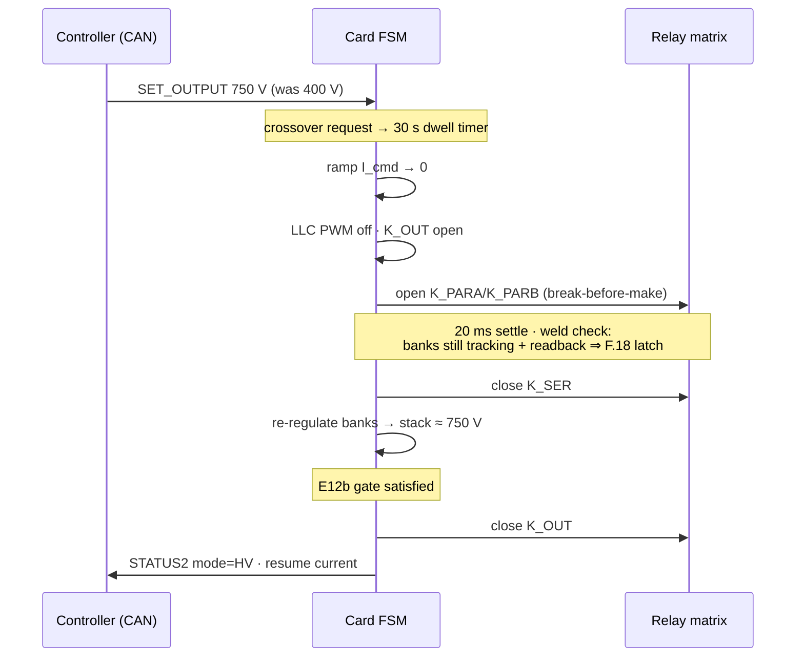
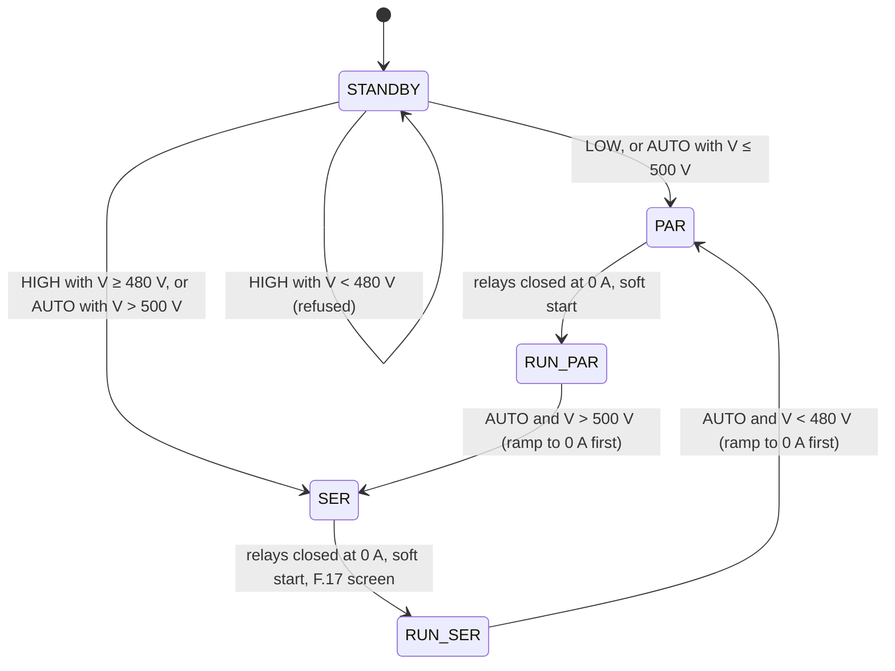

# 💾 Firmware Guide

<sub>The supervisory C99 core — state machine, fault ladder, HAL contract and the host-proven test suite</sub>

<p>
  
  
  
  
</p>

> [!NOTE]
> **Purpose** — the supervisory C99 core: its state machine, the HAL contract a port must honour, boot identity,
> F.21 semantics and the contracts added by the external review rounds R5–R7 and by E60.
>
> **Gate coupling** — `review-checks` (R6-B, R6-C, R6-E) and `stress-audit` assert passages of this file word for
> word, so edits here are **additive**: superseded values are marked, never deleted.

## At a glance

| | |
|---|---|
| **Language / dependencies** | portable C99 — no HAL, no RTOS assumptions |
| **Tick** | `pmp_fsm_step()` every 1 ms, watchdog-supervised |
| **Verification** | `firmware/test/host_sim.c` — **77 / 77** under AddressSanitizer + UndefinedBehaviorSanitizer, `-Werror` (54 / 54 at E60 · 63 / 63 at E73 · E76 adds 14 adversarial checks incl. three every-tick invariants) |
| **What the suite covers** | 26 fault scenarios · rating windows · E60 coordination rules · 7 group share-law checks · the E67 output-mode latch · codec guards · 100 000-frame fuzz · the per-tick relay-exclusion invariant |
| **Identities in one image** | 30 kW · 40 kW · 50 kW liquid · 50 kW air — selected by the RATING strap (the 3.32 k band is reserved) |
| **Fault vocabulary** | the `F.xx` codes of [protection thresholds](protection-thresholds.md), shown on the HMI and sent in CAN telemetry |

The `firmware/` tree holds the **normative** control-plane logic, verified against the same plant and the same
26 fault scenarios as the design-phase model. Run it yourself:

```bash
sh firmware/run_tests.sh
```

## Files

| File | Contents |
|---|---|
| `firmware/core/fsm.h` | states, fault codes (`F.xx` ↔ `FC_*`), threshold constants (mirror of [protection-thresholds.md](protection-thresholds.md)), I/O structs, API |
| `firmware/core/fsm.c` | `pmp_fsm_step()` — 1 ms supervisory tick: HW-fault mirror → supervisory checks → state machine (precharge, enable chain, pre-insertion S/P sequencing, K_OUT gate, dwell, weld check, lockout, discharge) |
| `firmware/core/can_proto.{h,c}` | CAN 2.0B codec per [can-protocol.md](can-protocol.md): 29-bit ID pack/parse, SET_OUTPUT / MODULE_CTL / STATUS1/2 / TEMPS / BUS frames — little-endian, DLC- and range-guarded, contradiction-rejecting |
| `firmware/test/host_sim.c` | the verification rig: behavioral plant + 26 scripted scenarios + CSU suite + codec round-trips + fuzz + the per-tick matrix-exclusion invariant |
| `firmware/run_tests.sh` | one-command build & run with sanitizers, `-Werror` |

## The FSM



> [!WARNING]
> **E67 supersedes the K_OUT rows of this section.** The output blocking diode replaced K_OUT and the pre-insertion relays:
> the output mode is latched in standby and the S/P relays close at zero current before the soft start — see
> [E67 — two output modes and a diode output](#e67--two-output-modes-and-a-diode-output-2026-09-13). The E12b text below
> stays as the record of why a blind close was dangerous.

Two rules that exist because verification **broke** their predecessors:

1. **E12b — the K_OUT gate.** After a series↔parallel transition the banks legitimately sit at
   the *old* mode's ceiling; closing K_OUT unconditionally guarantees an OVP trip (or hits a
   connected vehicle). The C port caught this — the JS model had masked it. K_OUT now closes only
   when `|stack − target| < max(10 V, 5 %)`, target = v_ext if a vehicle is present, else v_cmd.
2. **F.16 rev B.** The original short-circuit criterion (I > 110 %) is unreachable when a healthy
   CC loop caps current at 100 % — found by the scenario suite. Now: V < 50 V **and** I > 90 %·I_cmd
   sustained 10 ms.

## S/P transition, as the firmware actually runs it



## Porting to the GD32G553 (the HAL contract)

`pmp_fsm_step()` is pure logic over `pmp_in_t` → `pmp_out_t`. The MCU integration layer must:

1. call it from a 1 ms tick (watchdog-supervised; a missed WDI window drops the gates AND resets the MCU — WDO ≡ NRST, R5-A);
2. populate `pmp_in_t` from calibrated ADC/CT/NTC channels (pin maps in `boards.tsx`, EOL cal per [dfm-production.md](dfm-production.md));
3. mirror `out.pwm_kill` and driver `FLT` lines in **hardware** (HRTIM fault inputs + comparators) — firmware re-asserts, silicon acts first;
4. map `out.k_*` through the ULN drivers and read back contact states into `relay_fb[]`;
5. keep `PMP_MODE_DWELL_MS` at its product timebase (30 000 ms; the host suite compresses time 1000×);
6. (single-brain, E40) there is no inter-MCU link — external CAN starvation is F.28; the 40-way harness carries no protocol, only signals with board-side default-OFF.

> **E79 — the contract above is implemented by the portable HAL** (`firmware/hal/`, sans-IO). `app_pfc_isr`, `app_llc_isr`,
> `app_fault_isr` and `app_tick` fill `pmp_in_t`, run the §2 sequence of the [firmware architecture](firmware-architecture.md),
> attribute the HRTIMER fault channels, program the comparator references and read the bypass mirror contact
> (`relay_fb_wired` = the KPRE pair). Item 5 is superseded: the product dwell is 1 000 ms (E78). What a GD32G553 port still
> writes is the peripheral layer — clocks, HRTIMER, ADC groups and triggers, comparators and DAC, CAN-FD, the flash pages behind
> `nvm_port_*`, the WDI pulse, DWT, and TCM placement of both control interrupts. Evidence: `hal_test` 34 · `app_test` 16.

The ONE card (E40) runs the whole vocabulary — precharge, enables, S/P matrix, discharge — and the
same `F.xx` codes appear on the HMI and in CAN telemetry (STATUS2/FAULT_EVT).


---

## Board rev C integration notes (2026-09-05)

> [!WARNING]
> **Dated notes — read with this table.** The passages below are kept word for word because review gates assert
> them. Where a later decision changed a constant, the current value is here:
>
> | Constant in the notes below | Current value | Decided at |
> |---|---|---|
> | line CT burden 27 Ω (50 kW: 21.5 Ω) | **22 / 18 / 13 Ω** (30 / 40 / 50 kW) | E60 |
> | resonant CT burden 2.0 Ω, F.11 70 A pk at DAC 3.05 V (50 kW: 1.6 Ω) | **1.2 / 0.91 / 0.75 Ω · F.11 85 / 115 / 145 A pk** | E60 |
> | `PMP_DISCH_TO_MS` 3000 / 5500 / 9000 ms | **3000 / 4000 / 5000 ms** from the strap | E41 / E42 |
> | ROLE0 slot strap, "each MCU drives its own EN" | **removed** — one brain, RATING is the only strap | E40 |
> | suite 49 / 49 or 50 / 50 | **54 / 54** | E60 |

The supervisory logic (`fsm.c`) is unchanged — these bind existing hooks to the rev C hardware:

- **ADC scaling (rev D — R2 CB-16):** CT channels are biased at AVMID (VREF/2 ≈ 1.65 V) with
  **per-family burdens**: line `i = (raw·3.3/4096 − 1.65) / 27 · 2500` (27 Ω — R3/audit: 33 Ω clipped 150 A pk observability at the 3.3 V rail); resonant
  `i = (raw·3.3/4096 − 1.65) / 2.0 · 100` (2.0 Ω burden — the 33 Ω constant here was the R2
  CB-16 defect; F.11 comparator DAC = 3.05 V for 70 A pk). AC phase-voltage channels come from
  ±5 V iso amps (gain 0.41, output centered mid-rail): bipolar conversion with the amp's datasheet
  offset. Bus/bank/output channels are unipolar 0–2 V iso-amp outputs. `SNS_IOUT`/`SNS_IOUTN`
  form a software differential (subtract before scaling — MR-6). **Rail monitors** SNS_V24/SNS_V15
  (pins 51/52): ÷7.8 and ÷5.7 dividers — alarm at ±15 %.
- **Fault path (E40 merge):** the ONE wired-OR `FLT` lands on card pin 47 (PB10 —
  HRTIMER_FLT2 hardware trip); latch F.02/F.12-class faults from it. It is also the F.32
  visibility path after a watchdog restart.
- **Bank discharge (rev D — E33):** on SHUTDOWN, after `q_disch`, assert `CTL_QDISBK` (pin 75) —
  both bank bleeders fire (τ ≈ 4–17 s per SKU); supervise as F.21b (2× τ timeout per SKU). The
  bus F.21 timeout is now implemented in `fsm.c` with `PMP_DISCH_TO_MS` (override per SKU at
  build: 3000/5500/9000 ms).
- **Watchdog (R5-A rev):** kick `WDI` inside the CWD-programmed window from the control loop
  tick. The external WD's open-drain `WDO` is BOTH a hard input to the GATE_EN AND (E27) AND
  wire-ORed onto `NRST_CARD` (R5-A): a missed window now drops the gates and RESETS the MCU —
  a hung brain restarts with every enable low instead of re-arming milliseconds later with its
  EN GPIOs still latched high. HAL contract: (1) EN/CTL_* GPIOs must NEVER be configured with
  reset retention — the whole mechanism relies on reset ⇒ pulled-down defaults; (2) boot must
  reach the first WDI kick inside the CWD startup window (§K sizes CWD against measured flash
  boot + init at EVT); (3) after restart, log the reset-cause register and raise F.32 — the
  event is visible even though hardware already made it safe; (4) **PG10-NRST stays in NRST
  mode — the option bytes must NEVER remap it to GPIO** (R6: the whole mechanism rides on
  pin 14 being reset). Repeated watchdog resets hold the module safe by construction: gates
  are low through every WDO-low and every boot.
- **PFC reverse-direction hardware trip (R6/E47 · R7-A allocation):** the comparator channels
  are now pinned INSTANCE-aware (the R6 "CMP-capable" rule missed that B and C shared CMP2's
  two inputs): **I_A0 = PC2/CMP7_IP, I_B0 = PA3/CMP1_IP, I_C0 = PC1/CMP2_IP**, DAC thresholds
  on the IM sides, outputs → HRTIMER fault. ADC map change that rides along: **I_B0 is now
  ADC0_IN3 (PA3) and SNS_VAC1 is ADC01_IN5 (PC0)** — update the channel table with the pin
  map, both regenerate from umod-pinmap. Each phase carries ONE threshold on the DESAT-blind
  polarity by design (the other polarity is DESAT's); the ~2–3 µs figure is a design target
  until EVT measures threshold-to-gate-off in both polarities (the ACX CT's HF response is
  not vendor-specified).
- **Output-current sign (R6-E):** VINP rides the shunt's KB (OUTN side), VINN rides KA — so
  **positive (SNS_IOUT − SNS_IOUTN) = delivering current to the vehicle**. Verify with a small
  known load before closing the current loop.
- **Cold-start budget (R6-G):** the aux controller is the NCP1252 **D** version (no 120 ms
  pre-start delay, 5 V UVLO hysteresis) with a 220 µF VCC reservoir; expect ≈5–6 s from AC
  apply to rails-up at a 565 V precharged bus (nominal 400 VLL; ≈8 s at low line with the
  100 µA worst startup draw — size any boot supervision to ≥10 s) (0.59 mA through the 940 k startup feed). The
  CSU's staggered-enable already tolerates this.
- **F.21 semantics (R6):** the discharge timeout's real coverage is the AC-PRESENT case
  (bus held up by the permanent RPRE rectifier path → timer expires → FC_DISCH = "isolate
  upstream"). In the AC-removed case the aux browns out at ~321 V bus mid-discharge, the MCU
  dies un-faulted, and the passive balance path + enclosure label finish the job (3.7–6.2 min
  to <60 V per SKU — R8-corrected balance-string model, per protection-thresholds). Do not chase a latched F.21 after AC removal.
- **Enable:** each MCU drives its own `EN_PFC`/`EN_LLC` high only in states where gating is legal;
  the AND with the peer + WD forms `GATE_EN_A/B`. There is no PWM_KILL net anymore.
- **Relay feedback:** `relay_fb[]` reads the card ways DI0–DI5 = KSER, KPARA, KPARB, KOUT,
  KPREA, KPREB mirror contacts (low = main open; a dual-relay function carries series mirrors
  on one net — low = BOTH mains open) and DI8 = the KPRE1+KPRE2 series chain (high = both
  open). Way→pin authority: `umod-map.gen.ts`. F.19 evaluates exactly as coded.
- **Discharge:** `CTL_QDIS` is active-high into an opto LED; default (reset/tri-state) = OFF.
  No inversion vs the FSM's `discharge_cmd`.
- **Relay economization (E26):** after 60 ms pull-in at 100 % duty, PWM coil hold at ~40 %
  (24 V coils, 20 kHz) — halves steady 24 V demand; implement in the HAL coil driver.
- **Boot/provisioning:** BOOT0 strapped low, SWD on the JSWD headers (CB-13); EOL flow per
  dfm-production.md step 4 is now physically possible.

## Card boot identity (E35/E37 — one image, straps decide)

The control card is ONE part number and ONE firmware image for both converter roles and both
ratings. At boot, before any enable, the HAL must:

1. Read **ROLE0** (GPIO, pin 90): low = AC-DC slot (board ties the way to DGND), high/floating
   (card 10k pull-up) = DC-DC slot. Configure the role personality (PWM semantics, AIN map,
   DO/DI meanings) accordingly.
2. Read **ROLE1/RATING** (ADC, pin 38) against the card's 10 k pull-up to V3P3 and the board's
   strap to DGND — decode per the **rev F band table below** (0R/1k/3.32k/10k/open). Call
   `pmp_fsm_set_rating_kw()` with the decoded rating — it narrows the F.21
   discharge-supervision window; an undecoded strap keeps the worst-case default, which can
   only delay the F.21 report, never miss it. (This step originally read ~1.65 V as "60 kW" —
   two-card era; rev F reassigns that band, see below.)

**E24 rev D (E40): RATING is the only strap — ROLE0 and the inter-card LINK are gone.** Bands: <0.41 V (0 R) → **module controller** (one brain, PFC+LLC) · 0.41–1.24 V (3.32 k) → reserved · >2.4 V (open) → no host, fault. Formerly rev C: Board strap 3.32 k against the card 10 k pullup
reads ≈0.82 V. Windows (**rev G, E44**): <0.15 V (0R) → 30 kW · 0.15–0.55 V (1k) → **40 kW** ·
0.55–1.24 V (3.32k) → reserved (no host, fault) · 1.24–1.82 V (10k) → **50 kW LIQUID** · 1.82–2.30 V (15k) →
**50 kW AIR** · >2.4 V → no board / fault. (Rev F had retired the stale two-card-era 10 k =
"60 kW" reading; rev G splits its band for the air twin — ±1 % separations proven by the
verify-independent gate.) Both 50 kW bands call `pmp_fsm_set_rating_kw(50)` — same 16-can link,
same 5000 ms F.21 window; ONLY the fan personality differs and it is HAL band-decided. Windows:
3000/4000/**5000**/5500-legacy ms. ROLE0 is a don't-care. Same image, four identities.

**50 kW AIR HAL notes (E44):** four fans — FAN_PWM1 drives fans 1–2's rail... fans 1/2 on
PWM1/PWM2 individually, fans 3+4 gang FAN_PWM2 (rear pair). ALL FOUR tachs supervised:
TACH1–3 on the E40/E41 pins, **TACH4 on pin 90 / way 88 / harness W39** (E44). Fan-fail derate
per the existing `fan_ok` path; the 4-fan set runs the family's ~395 W/fan density.

**50 kW liquid HAL notes (E42):** the module is sealed with ZERO fans — HAL ties `fan_ok = true`
permanently, leaves FAN_PWM0/1 outputs idle and ignores the tach inputs (the board holds all
three tach ways defined-LOW via RFDT terminators, so an accidental read reports "stopped", the
fail-safe direction). The plate NTCs land on the same T_PFC/T_LLC channels; the existing OT
ladder (derate at `PMP_OT_DERATE_C`, trip 115 °C) IS the loss-of-coolant protection — a dry
plate at rated load crosses the ladder in seconds, well inside the 10 ms FSM tick. Flow
assurance itself (pump, flow meter) is the cooling cart's job, charger-level per the E42 system
boundary. Sense calibration constants for the re-scaled CT burdens (21.5 Ω line / 1.6 Ω
resonant) are rating-keyed like every other cal row. **R4-7:** the V24 monitor divider is
82k/10k on every variant (24 V reads 2.609 V, full-scale 30.4 V) — update the cal constant;
the old 68k basis clipped at 25.7 V.

---

## E60 — current coordination in firmware (2026-09-13)

> [!IMPORTANT]
> Four normative changes land in `firmware/core/fsm.c` and are proven by `firmware/test/host_sim.c`
> (**54/54**, four new checks). Source of the numbers: [`docs/protection-thresholds.md`](protection-thresholds.md)
> § "E60 current-coordination classes" and the standing gate `calculations/system/current-coordination.mjs`.

| Req | What the code does | Why (simulated) |
|---|---|---|
| **FW-R6** PFC reference clamp | HAL current loop clamps the reference **amplitude** at 1.05 × the rated crest at 330 VAC | cycle-by-cycle Vienna: dips/phase jumps then add ≈3 A, not a trip |
| **FW-R7** bus floor | `vbus_ref = clamp(max(2·bank/0.95, 1.08·√2·VLL), 650, 830)` (`PMP_BUS_LINE_K`) | 475/500 VAC on a 650 V floor: 75–92 % overmodulation, 15–40 % THD → 0.1 % with the floor |
| **FW-R8** start mode | STANDBY selects SER only above `PMP_XOVER_DN_V` (525 V), the same threshold RUN uses | SER at 500–525 V = bank 250 V = 2× PAR tank current; the 40 kW LLC folds to 75–93 % there |
| **OC DAC classes** | `pmp_fsm_set_rating_kw()` sets `oc_line_a` / `oc_tank_a` = **120/85 · 155/115 · 195/145 A pk** (30/40/50); HAL writes the CMP DACs from these — firmware may tighten, never loosen | 1.2 × simulated worst peak; observability through the 3 µs race on the E60 burdens |

Host-sim checks added: *start at 510 V selects PAR* · *bus floor at 475 VAC ≥ 1.08·√2·VLL* ·
*50 kW OC classes 195/145* · *40 kW OC classes 155/115*. Default before the strap is read = the
30 kW classes (the lowest thresholds — an undecoded strap can only trip earlier, never later).


## E65 — magnetics protection and bus-reference control (2026-09-13)

> [!IMPORTANT]
> Additive. Normative in `firmware/core/fsm.c` / `fsm.h`, proven by `firmware/test/host_sim.c` (**55 / 55** after E66).
> Thresholds and rows: [`docs/protection-thresholds.md`](protection-thresholds.md) § 5.

| Req | What the code does | Why |
|---|---|---|
| **FW-R9** bus reference every tick | `bus_ref_for(mode, max(vcmd, vout_meas), vin_ll)` runs in RUN/DERATE, not only in STANDBY | a session that starts low and climbs kept a 650 V bus under a 525 V bank (gain 1.6, outside the simulated envelope) |
| **FW-R10** S/P from the battery | start mode uses `vext` when a vehicle is connected; the RUN crossover uses `vout_meas` | an EV's vcmd is often its maximum voltage; SER chosen from it ran banks under the 250 V floor |
| **FW-R11** NTC open-loop guard | `pmp_ntc_guard_c(t_c, adc_frac)` returns `PMP_NTC_OPEN_C` (150 °C) when `adc_frac ≥ PMP_NTC_OPEN_FRAC` (0.98) — the HAL passes every zone through it before taking `temp_max_c` | the six D3/D2 bond-loss cutouts sit in series with the T_XFMR NTC; an open loop must latch F.22, not read "very cold" |
| **HAL — F.11 attribution** | on a FLT edge, capture I_RES1–3 (ADC); a capture beyond ±F.11 reports F.11, otherwise F.02 | the E65 window comparators share the FLT wire-OR with the gate-driver DESAT outputs |

Host-sim checks added: *vcmd 800 V / battery 450 V starts PAR* · *bus reference follows a climbing bank (300 → 520 V)* ·
*open NTC / cutout loop latches F.22* · *the guard passes a healthy −40 °C reading*.

## E66 — group share law on every module card (2026-09-13)

> [!IMPORTANT]
> `firmware/core/group.c` / `group.h` run on every module card. The RATING strap band 3.32 k (0.55–1.24 V) is
> **reserved** — the HAL treats it as no host, fault. Protocol:
> [`docs/can-protocol.md`](can-protocol.md) GROUP_SET 0x12.

When a charger runs modules in parallel, its controller is the group master and broadcasts GROUP_SET at 10 Hz. Call
`pmp_group_frame()` for every decoded frame and `pmp_group_step()` every 1 ms; the result feeds the module's current setpoint and
its delivery permission (together with ENABLE and a fresh frame — otherwise the FSM's F.28 ramp-off applies).

| Rule | Value | Why |
|---|---|---|
| share | own bit set ? min(own I_avail, I_req / members) : 0 | one frame from one observer — no module infers its peers by hearing, so no split brain |
| lower / raise | lower at once; raise only after `PMP_GRP_HOLD_MS` 1300 ms | a peer still on an older, larger share has missed every frame for > 1 s and already ramped to zero |
| staggered delivery | own bit present ≥ HOLD + rank × `PMP_GRP_STAGGER_MS` 300 ms (rank = member bits below own) | deterministic start order without an election |
| stale | no frame for > `PMP_GRP_STALE_MS` 1000 ms → share 0, no delivery | matches `PMP_CAN_TO_MS`; F.28 does the rest |

Host-sim checks (3 nodes on one frame stream): *sum of shares never exceeds I_req through join, drop, partition and re-join* ·
*staggered first delivery by rank* · *equal share 450 A / 3* · *a node missing frames > 1 s goes to zero* · *2-node share clamps
at the module cap* · *non-member never delivers* · *GROUP_SET codec round-trip + guards* (+ 100k-frame decoder fuzz).

---

## E65 — PFC current loop against the input filter (2026-09-13)

> [!IMPORTANT]
> The input EMI filter was never inside a control model: `pfc-control.mjs` closed the current loop on a bare
> 100 µH plant and `vienna-switched.mjs` on a stiff grid. With the drawn filter (CMC leakage · CX1 · D6 · CX2) and
> the A9 grid, the undamped loop is **unstable** — the switched model oscillates at the 1.5·Tsw basis (63–90 % of
> the fundamental between 2 and 45 kHz, Lg 100 µH) and the small-signal Nyquist check has no margin even at 15 µs.
> The schematic now carries a CX2-node Rd–Cd damper (CDMP1-3 2.2 µF + RDMP1-3 10 Ω, delta). The three
> requirements below are what the margins were computed with; the standing gate is `calculations/pfc/pfc-control.mjs`
> (`out/pfc-filter-stability.csv`) and its `[EMI]` row in `stress-audit.mjs`.

| Req | What the code does | Why (computed) |
|---|---|---|
| **FW-EMI-1** loop delay | Phase currents sampled at carrier peak **and** valley (100 kHz); the duty computed from a sample is loaded at the next half-period — total sample→PWM delay **≤ 15 µs** | damped filter: modulus margin min\|1+Y·Zo\| **0.53–0.65** at 15 µs (P and PI, Lg 0/30/100 µH, leakage 6–12 µH, D1/D6 at zero-crossing and crest); at the 1.5·Tsw = 30 µs single-update basis only 0.18–0.33 |
| **FW-EMI-2** voltage feed-forward | Feed-forward and the resistive-emulation reference use SNS_VAC1..3 as drawn (divider RC τ ≈ 115 µs), with the 50 Hz lag rotated out by mixing the other two phases: v′ₖ = vₖ + ωτ·(vₖ₋₁ − vₖ₊₁)/√3 | without the feed-forward the damped margins drop to 0.36–0.43 |
| **FW-EMI-3** gain per rating | Current-loop proportional gain = 2π·3 kHz·L_D1 at the simulated crest, lot −8 %: **1.27 / 1.04 / 0.78 V/A** (30/40/50 kW, from the strap); PI zero no higher than the 425 Hz of the loop design | the single PI (1.87 V/A, placed on a 100 µH plant) crosses at 5–7 kHz on the 40/50 kW D1 and is unstable at 30 µs even with the damper |

Not firmware: EVT line — a grid-impedance step test at Lg ≈ 100 µH per phase (and several paralleled modules on one
transformer) with the loop delay measured on the scope, before the margins above are called verified.


## E67 — two output modes and a diode output (2026-09-13)

> [!IMPORTANT]
> E67 follows the charging-module convention in the UUGreen, ENR, Tonhe, NIUERA and Maxwell CAN protocols: a LOW
> (< 500 V) and a HIGH (> 500 V) output range, chosen before the module starts. The output blocking diode (InfyPower
> practice) removes K_OUT and the pre-insertion relays, so the relay matrix never switches current. This supersedes the
> "S/P transition" diagram above: there is no RUN-time relay transition with a dwell or a weld check any more.

| Req | What the code does | Why |
|---|---|---|
| **FW-R12** output mode | `in->omode_req` ∈ {`OMODE_AUTO`, `OMODE_LOW`, `OMODE_HIGH`} is latched into `f->omode` in STANDBY only. LOW → banks parallel, `v_max` 500 V · HIGH → banks series, `v_max` 1000 V, refused below `PMP_XOVER_UP_V` (480 V) · AUTO → start SER above `PMP_XOVER_DN_V` (500 V), else PAR | a bank tops out at 500 V (gain M ≤ 1.205) — the tank was solved for that edge, not for the E60 525 V in-run hysteresis |
| **FW-R12b** AUTO crossover | only in AUTO: PAR → SER when the battery (or vcmd with no vehicle) exceeds 500 V, SER → PAR below 480 V; ramp to zero, swap relays at zero current, soft-start again | 20 V hysteresis; the battery voltage, not the EV's request, decides (FW-R10) |
| **FW-R13** diode output | relays close before the soft start; with a SER start, `fabsf(vbank_a − vbank_b) > PMP_BANK_IMB_V` once either bank passes 50 V latches **F.17** | a welded K_PARA/K_PARB ties the bank tops; it shows as imbalance at the first SER ramp. `PMP_WELD_DV_V` / `PMP_WELD_MS` stay defined but unused |
| **FW-R14** F.11 classes | `oc_tank_a` 140 / 180 / 220 A (default 140) from the rating strap | protection-thresholds § 6 |
| **HAL — CAN mapping** | MODULE_CTL b2 force-HV → `OMODE_HIGH`, b3 force-LV → `OMODE_LOW`, neither → `OMODE_AUTO` (both set is rejected by `can_proto.c`) | a request in RUN is held until the next STANDBY (host_sim `reqrun`) |



Host tests added (host_sim 60/60): `start490`, `start510`, `lowforced`, `highlow`, `reqrun`, `hyst` (510 → 490 V), and the
F.11 class checks 195 A / 220 A and 155 A / 180 A.


## E73 — precharge-bypass closure window (2026-09-14)

> [!IMPORTANT]
> Additive. The bypass closure at 90 % of line peak drives a 200 / 218 / 280 A pk pulse through D1 while the PFC is idle —
> above F.01 on every SKU at 475 VAC ([protection thresholds § 8](protection-thresholds.md#8-e73-startup-coordination-2026-09-14--f01-blanked-while-the-precharge-bypass-closes)).

| Item | Code | Why |
|---|---|---|
| Window | `PMP_PRE_BLANK_MS` = 60 ms, loaded when `k_pre` is commanded in `ST_PRECHG` | relay operate ≤ 25 ms + bounce ≤ 5 ms + the ≤ 2 ms pulse, with margin |
| F.01 mirror | `if (in->oc_pfc_flt && f->pre_blank_ms == 0) latch(f, FC_OC_PFC)` | the inrush flag is read-clear and ignored inside the window only |
| PFC enable | `ST_STANDBY` returns early while `pre_blank_ms` is non-zero | F.01 is never blanked while the PFC switches |
| HAL contract | clear the HRTIMER FLT2 event latch when the window ends, before the first PWM | the hardware break stays armed throughout |

Host tests added (host_sim **63 / 63**): *E73 bypass-closure inrush on F.01 is blanked* · *no PFC enable inside the blank
window* · *F.01 line OC while switching latches*. Negative test: with the blank removed, the inrush scenario latches F.01.

## E75 — OVP comparator allocation + mode-swap release margin (2026-09-14)

> [!IMPORTANT]
> Additive. An external review asked which comparator instances back the F.03/F.13 "HW comp" rows
> and whether the mode-swap gap covers the relay's diode-suppressed release; the audit confirmed
> both gaps ([protection thresholds §2 footnote](protection-thresholds.md)).

| Item | Contract | Why |
|---|---|---|
| F.03 bus OVP | HAL configures **CMP4**: IP = PB13/pin 52 (SNS_VBUSP, also ADC2_IN4 for metering), IM = **DAC3_OUT0** at the 860 V code; output → **HRTIMER fault channel 5** (`FLTyINSRC = 01`), latch armed before the first PWM | before E75 SNS_VBUSP sat on PE15 — no CMP function existed; the analog latch path of the footnote had no comparator behind it |
| F.13 output OVP | HAL configures **CMP0**: IP = PA1/pin 21 (SNS_VOUT, also ADC01_IN1), IM = **DAC0_OUT0 with MODE0 = 011** (buffer off, internal-only — PA4/SNS_VAC2 keeps its pin); output → **fault channel 3** | film-only output ≈ 24 µF at 167 A slews 2.6–5.6 V/µs — a firmware path is orders too slow; PA5 (the old pin) offered only CMP1_IM, and CMP1 is phase B's |
| ADC re-map | SNS_VBUSP = ADC2_IN4 · SNS_VOUT = ADC01_IN1 (were ADC3_IN1 / ADC1_IN12) | the two channel-table constants move with the pins |
| Mode swap | `ST_MODESW` flips at **step 70** (was 40): open command at step 20 → earliest re-close ≥ 51 ms later | the ULN COM clamp freewheels the coil — diode-suppressed release stretches 2–3×; the matrix-relay RFQ line is release + bounce ≤ 35 ms suppressed. An overlap would dump a charged film bank (~3 J at 500 V) through two making contacts |

Gates: `verify-independent` §J asserts pin 52 = ANA14 and pin 21 = AIN3 from the built card netlist; host_sim
stays **63 / 63** (the per-tick exclusion invariant runs through the widened swap).

## E76 — supervisory-logic hardening (2026-09-14)

> [!IMPORTANT]
> Additive. The fifth external review compiled the cores and reproduced nine defects with adversarial
> inputs; all are closed firmware-only. The defect table with mechanisms lives in
> [protection thresholds §9](protection-thresholds.md#9-e76-supervisory-logic-hardening-2026-09-14--the-fifth-external-reviews-firmware-counterexamples-closed).
> This section is the changed CONTRACT.

| Contract | Now |
|---|---|
| Start readiness | `vbus > 0.95 · vbus_ref` (was a fixed 700 V that blocked every sub-700 V reference — R02) |
| Matrix make | only at ≤ 2 A and new stack ≥ 10 V **below** the output node (battery, else terminal caps, 60 V floor); bank bleeders (`out.q_disch_bk`, **new output — HAL maps to CTL_QDISBK**) run from the MODESW open until the permit; LLC off through the wait; stall → **F.34** at 8 s |
| Output-mode change | latches only with every matrix contact open; otherwise routes through ST_MODESW (open + bleed + re-select in STANDBY — ST_MODESW no longer flips `out.mode` itself) |
| STOP / re-arm | `enable_req=false` in RUN/DERATE → STANDBY with LLC off; `need_enable` (fault clear, CAN timeout) clears **only** when enable is observed low — the host must drop and re-assert ENABLE |
| Safety scope | OT / input / midpoint / OVP / sensor / CAN checks run whenever PFC or LLC is enabled, not just in RUN; STANDBY enable requires `aux_ok`; latches always win over graceful transitions |
| Derate | recomputed every tick (5 °C recovery hysteresis); RUN/DERATE are one delivering super-state, AUTO crossover evaluated in both |
| Sensor plausibility | low-side only (`stack − vout > 20 %` with LLC on) — the high side belongs to F.13 |
| Group share | a **grown** pending raise target restarts the 1.3 s hold (`pend_da`); equal/smaller never does |
| Shutdown | `q_disch` **and** `q_disch_bk` both command through ST_DISCH (E33 contract) |

Host suite: **77/77** — 63 legacy + 14 new (R02 ×2, R03 scenario + every-tick make-permit invariant,
R04, R05 ×3 incl. every-tick aux invariant, R06 ×2, R07, R09, F.34, group R08). The plant now follows
`vbus_ref`, conducts DOUT on physics (any state), models the bank bleeders and terminal-capacitor
node, and the lock scenario re-arms through the public contract instead of poking `need_enable`.
`fsm-sim.mjs` (26 JS scenarios) still passes but lags the C core in the E76 areas — the C core is
normative (E24); syncing the JS model is an open E76 line.

## E78 — the protocol-neutral core (2026-09-15)

> [!IMPORTANT]
> Additive. The firmware now has three layers — protocol profiles, one canonical model, the power core — specified with the
> review findings FW-01…FW-25 in [firmware architecture](firmware-architecture.md). The native protocol is
> [VMP 2.0](can-protocol.md); the [TonHe V1.2 profile](can-profile-tonhe-v12.md) is the drop-in compatibility profile.
> Suites: `host_sim` **114**, `ctl_test` **18**, `proto_test` **40** — ASan + UBSan (fatal) + `-Werror`. The review started
> from the E77 working-tree core (input sanitization, row persistence, the F.31 window, warm hold, the public shutdown), which
> had no register row; E78 records it as its base.

| Contract | Now |
|---|---|
| Communication timeout | owned by the active profile: `pmp_fsm_set_comm_timeout_ms()` (VMP 1 s default, TonHe 20 s); `PMP_CAN_TO_MS` is only the boot default |
| Controlled stop | STOP, communication loss and a lost setpoint set `out.stop_ramp`; `core/ctl.c` takes the current to zero in 80 ms; the LLC stops below 2 A or at 100 ms; F.16 is not evaluated during it; a withdrawn STOP continues the session |
| Recovery classes | `pmp_fault_class()`: AUTO_EXT (F.07 · F.08 · F.09) and AUTO_INT (F.05 · F.06 · F.22) clear after a 2 → 64 s hold once their condition is gone; LATCH needs CLEAR; F.31 counts every latch except AUTO_EXT |
| Relay feedback | inputs `relay_fb` / `relay_fb_wired` (`PMP_RLY_*` bits, 1 = main contact closed); F.19 on a 100 ms mismatch; the PFC waits for a confirmed bypass and the soft start for confirmed contacts; `PMP_W_RELAY_FB_OFF` while nothing is wired — the production HAL wires all four |
| New rows | F.35 (`ctl_overrun`, the HAL's deadline verdict) · F.36 (undefined state value) |
| New inputs | `wake_req` (OFF → INIT) · `ctl_overrun` · `relay_fb` · `relay_fb_wired` |
| Start and recovery window | 275–485 VAC; the trip rows stay 260 / 500 VAC |
| Mode dwell | `PMP_MODE_DWELL_MS` = 1 000 ms — the build value is the product value (supersedes the "30 000 ms, compressed 1000× on the host" HAL line above) |
| SAFE | left after 500 ms of stable aux; the restart needs a fresh ENABLE |
| Fresh request after a reset | the profile's rule, not the core's: VMP holds RUN until RUN = 0; a TonHe start is an event |
| Reference shaping | `core/ctl.c`: soft start from the output node, 500 V/s and 1 000 A/s rises, E1 input derate, power limits, group share, CV share trim; regulator kernel with min-select and back-calculation anti-windup |
| Protocol layer | `core/modapi.h` canonical model · `proto/` profiles and registry · `can_proto.{h,c}` (v1, never shipped) retired |
| HAL 1 ms order | profile rx → profile tick → `pmp_cmd_to_in` → `pmp_fsm_step` → `pmp_cmd_to_ctl` → `pmp_ctl_step` → commit references → telemetry → TX |

## E80 addendum (additive)

- **Host suite is now six binaries / 260 checks**: `boot_test` (SHA-256 · ECDSA-P256 against OpenSSL + BigInt vectors ·
  signed images · boot decision · update protocol on RAM flash) joins the five E79 suites; `run_tests.sh` runs all six.
- **The GD32G553 register port is built** (`firmware/port/gd32g553/` — no vendor library; every register cited to UM
  Rev 1.3): 216 MHz clock recipe, HRTIMER center-aligned Vienna carrier + PFM/PSM legs with 120 ns dead time, the six
  fault channels of Table 25-21, four ADCs on one 100 kHz trigger with double-buffered DMA rings, CMP/DAC thresholds,
  CAN mailbox driver with manual bus-off recovery, FWDGT + the TPS3430 WDI contract, TCM placement of the whole 100 kHz
  path, and `build.sh` producing the bootloader plus signed slot-A/B images. `port-pin-audit` (run-all) locks its pin
  table to `umod-map.gen.ts` — 56 pins.
- **Watchdog contract update (review HR-02)**: the TPS3430 now runs the FIXED window (CWD open, SET0 low, SET1 high) —
  a falling WDI edge is valid 2.22–23.375 ms after the last one; the app kicks every 10 ms as before, and the BOOTLOADER
  kicks from power-up, chunking image verification (a 208 KB SHA-256 pass takes ~40 ms and must be split). EVT T-53.
- **Relay economization is live** (the E26 instruction above): the app emits per-coil duties — 100 % for 60 ms after a
  close command, then 40 % hold at 20 kHz (`app_tick_out_t.relay_duty[]`); KSER/KPARA ride TIMER3 PWM, KPRE/KPARB hold
  full until their pins' PWM capability is confirmed at bring-up.
- **Calibration policy (review HR-29)**: a card with NO calibration record latches F.30 at boot exactly like an
  implausible one — nominal-scaling delivery is gone; the EOL fixture is the only calibration writer.

---

<div align="center">
<sub><a href="control-card-scope.md">← Control-Card Scope</a> &nbsp;·&nbsp; <a href="README.md">🧭 Documentation hub</a> &nbsp;·&nbsp; <a href="firmware-architecture.md">Firmware Architecture →</a></sub>

<sub>Vectivolt DC-Modules · documentation rev E73 · every number reproduces with <code>sh calculations/run-all.sh</code></sub>
</div>
