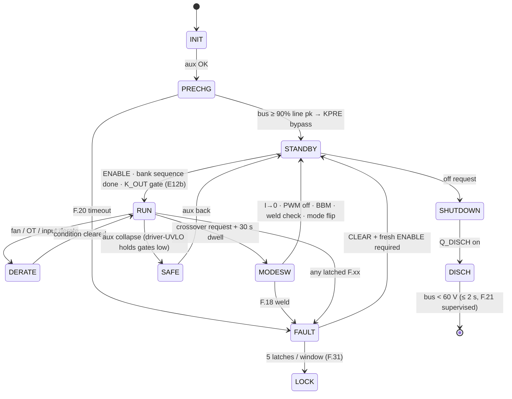

# Firmware Guide — supervisory logic that's already been through hell 🧠

The `firmware/` tree holds the **normative** control-plane logic in portable C99 — no HAL, no RTOS
assumptions — verified against the same plant and the same 26 fault scenarios as the design-phase
model, plus protocol-codec guards and a 100 000-frame fuzz, all under AddressSanitizer +
UndefinedBehaviorSanitizer. **33/33 checks pass**; run it yourself:

```bash
sh firmware/run_tests.sh
# cc -std=c99 -Wall -Wextra -Werror -fsanitize=address,undefined ... → RESULT: 33/33 checks passed
```

## Files

| File | Contents |
|---|---|
| `firmware/core/fsm.h` | states, fault codes (`F.xx` ↔ `FC_*`), threshold constants (mirror of [protection-thresholds.md](protection-thresholds.md) rev B), I/O structs, API |
| `firmware/core/fsm.c` | `pmp_fsm_step()` — 1 ms supervisory tick: HW-fault mirror → supervisory checks → state machine (precharge, enable chain, pre-insertion S/P sequencing, K_OUT gate, dwell, weld check, lockout, discharge) |
| `firmware/core/can_proto.{h,c}` | CAN 2.0B codec per [can-protocol.md](can-protocol.md): 29-bit ID pack/parse, SET_OUTPUT / MODULE_CTL / STATUS1/2 / TEMPS / BUS frames — little-endian, DLC- and range-guarded, contradiction-rejecting |
| `firmware/test/host_sim.c` | the verification rig: behavioral plant + 26 scripted scenarios + codec round-trips + fuzz |
| `firmware/run_tests.sh` | one-command build & run with sanitizers, `-Werror` |

## The FSM



Two rules that exist because verification **broke** their predecessors:

1. **E12b — the K_OUT gate.** After a series↔parallel transition the banks legitimately sit at
   the *old* mode's ceiling; closing K_OUT unconditionally guarantees an OVP trip (or hits a
   connected vehicle). The C port caught this — the JS model had masked it. K_OUT now closes only
   when `|stack − target| < max(10 V, 5 %)`, target = v_ext if a vehicle is present, else v_cmd.
2. **F.16 rev B.** The original short-circuit criterion (I > 110 %) is unreachable when a healthy
   CC loop caps current at 100 % — found by the scenario suite. Now: V < 50 V **and** I > 90 %·I_cmd
   sustained 10 ms.

## S/P transition, as the firmware actually runs it


## Porting to the GD32G553 (the HAL contract)

`pmp_fsm_step()` is pure logic over `pmp_in_t` → `pmp_out_t`. The MCU integration layer must:

1. call it from a 1 ms tick (watchdog-supervised; missing ticks trips the independent WDT → `PWM_KILL`);
2. populate `pmp_in_t` from calibrated ADC/CT/NTC channels (pin maps in `boards.tsx`, EOL cal per [dfm-production.md](dfm-production.md));
3. mirror `out.pwm_kill` and driver `FLT` lines in **hardware** (HRTIM fault inputs + comparators) — firmware re-asserts, silicon acts first;
4. map `out.k_*` through the ULN drivers and read back contact states into `relay_fb[]`;
5. keep `PMP_MODE_DWELL_MS` at its product timebase (30 000 ms; the host suite compresses time 1000×);
6. exchange `LINK` frames (CRC16 + sequence) across the board harness — 50 ms starvation latches F.27 on both boards independently.

MCU-PFC runs the subordinate slice of the same header (precharge, lane enables, `GATE_EN`,
`CTL_QDIS`) so both processors share one vocabulary of states and fault codes — which is also what
the HMI displays (`F.xx`) and CAN telemetry (STATUS2/FAULT_EVT) speak.


---

## Board rev C integration notes (2026-09-05)

The supervisory logic (`fsm.c`) is unchanged — these bind existing hooks to the rev C hardware:

- **ADC scaling (rev D — R2 CB-16):** CT channels are biased at AVMID (VREF/2 ≈ 1.65 V) with
  **per-family burdens**: line `i = (raw·3.3/4096 − 1.65) / 27 · 2500` (27 Ω — R3/audit: 33 Ω clipped 150 A pk observability at the 3.3 V rail); resonant
  `i = (raw·3.3/4096 − 1.65) / 2.0 · 100` (2.0 Ω burden — the 33 Ω constant here was the R2
  CB-16 defect; F.11 comparator DAC = 3.05 V for 70 A pk). AC phase-voltage channels come from
  ±5 V iso amps (gain 0.41, output centered mid-rail): bipolar conversion with the amp's datasheet
  offset. Bus/bank/output channels are unipolar 0–2 V iso-amp outputs. `SNS_IOUT`/`SNS_IOUTN`
  form a software differential (subtract before scaling — MR-6). **Rail monitors** SNS_V24/SNS_V15
  (pins 51/52): ÷7.8 and ÷5.7 dividers — alarm at ±15 %.
- **LLC fault path (rev D — R2 CB-21):** `FLT_LLC` lands on MCU-LLC pin 74 — latch F.02/F.12-class
  faults from it exactly as MCU-PFC does from pin 74; it is also the F.32 visibility path on this
  board.
- **Bank discharge (rev D — E33):** on SHUTDOWN, after `q_disch`, assert `CTL_QDISBK` (pin 75) —
  both bank bleeders fire (τ ≈ 4–17 s per SKU); supervise as F.21b (2× τ timeout per SKU). The
  bus F.21 timeout is now implemented in `fsm.c` with `PMP_DISCH_TO_MS` (override per SKU at
  build: 3000/5500/9000 ms).
- **Watchdog:** kick `WDI_PFC` (pin 70) / `WDI_LLC` (pin 46) inside the 10 ms window from the
  control loop tick — the external WD's WDO is a hard input to the GATE_EN AND (E27). A missed
  window disables gates without firmware involvement; firmware sees it as F.32 on the FLT path.
- **Enable:** each MCU drives its own `EN_PFC`/`EN_LLC` high only in states where gating is legal;
  the AND with the peer + WD forms `GATE_EN_A/B`. There is no PWM_KILL net anymore.
- **Relay feedback:** `relay_fb[]` now reads real pins — MCU-LLC 2–7 = KSER, KPARA, KPARB, KOUT,
  KPREA, KPREB mirror contacts (low = main open; **at 120 kW each HV function is a dual relay
  pair with series mirrors on the same net — low = BOTH mains open, R2 HR-19**); MCU-PFC 50 =
  KPRE1+KPRE2 series chain (high = both mains open). F.19 evaluates exactly as already coded.
- **Discharge:** `CTL_QDIS` is active-high into an opto LED; default (reset/tri-state) = OFF.
  No inversion vs the FSM's `discharge_cmd`.
- **Relay economization (E26):** after 60 ms pull-in at 100 % duty, PWM coil hold at ~40 %
  (24 V coils, 20 kHz) — halves steady 24 V demand; implement in the HAL coil driver.
- **Boot/provisioning:** BOOT0 strapped low, SWD on the JSWD headers (CB-13); EOL flow per
  dfm-production.md step 4 is now physically possible.

## Card boot identity (E35/E37 — one image, straps decide)

The control card is ONE part number and ONE firmware image for both converter roles and both
ratings. At boot, before any enable, the HAL must:

1. Read **ROLE0** (GPIO, pin 90): low = AC-DC slot (board ties the way to DGND), high/floating
   (card 10k pull-up) = DC-DC slot. Configure the role personality (PWM semantics, AIN map,
   DO/DI meanings) accordingly.
2. Read **ROLE1/RATING** (ADC, pin 38) against the card's 10 k pull-up to V3P3 and the board's
   strap to DGND — decode per the **rev F band table below** (0R/1k/3.32k/10k/open). Call
   `pmp_fsm_set_rating_kw()` with the decoded rating — it narrows the F.21
   discharge-supervision window; an undecoded strap keeps the worst-case default, which can
   only delay the F.21 report, never miss it. (This step originally read ~1.65 V as "60 kW" —
   two-card era; rev F reassigns that band, see below.)

**E24 rev D (E40): RATING is the only strap — ROLE0 and the inter-card LINK are gone.** Bands: <0.41 V (0 R) → **module controller** (one brain, PFC+LLC) · 0.41–1.24 V (3.32 k) → **CSU** · >2.4 V (open) → no host, fault. Formerly rev C: Board strap 3.32 k against the card 10 k pullup
reads ≈0.82 V. Windows (**rev G, E44**): <0.15 V (0R) → 30 kW · 0.15–0.55 V (1k) → **40 kW** ·
0.55–1.24 V (3.32k) → **CSU** · 1.24–1.82 V (10k) → **50 kW LIQUID** · 1.82–2.30 V (15k) →
**50 kW AIR** · >2.4 V → no board / fault. (Rev F had retired the stale two-card-era 10 k =
"60 kW" reading; rev G splits its band for the air twin — ±1 % separations proven by the
verify-independent gate.) Both 50 kW bands call `pmp_fsm_set_rating_kw(50)` — same 16-can link,
same 5000 ms F.21 window; ONLY the fan personality differs and it is HAL band-decided. Windows:
3000/4000/**5000**/5500-legacy ms — suite 49/49. In the CSU band the boot path runs `pmp_csu_*`
(cabinet supervisor, `firmware/core/csu.h`) instead of the power FSM; ROLE0 is a don't-care.
Same image, five identities.

**50 kW AIR HAL notes (E44):** four fans — FAN_PWM1 drives fans 1–2's rail... fans 1/2 on
PWM1/PWM2 individually, fans 3+4 gang FAN_PWM2 (rear pair). ALL FOUR tachs supervised:
TACH1–3 on the E40/E41 pins, **TACH4 on pin 90 / way 88 / harness W39** (E44). Fan-fail derate
per the existing `fan_ok` path; the 4-fan set runs the family's ~395 W/fan density.

**50 kW liquid HAL notes (E42):** the module is sealed with ZERO fans — HAL ties `fan_ok = true`
permanently, leaves FAN_PWM0/1 outputs idle and ignores the tach inputs (the board holds all
three tach ways defined-LOW via RFDT terminators, so an accidental read reports "stopped", the
fail-safe direction). The plate NTCs land on the same T_PFC/T_LLC channels; the existing OT
ladder (derate at `PMP_OT_DERATE_C`, trip 115 °C) IS the loss-of-coolant protection — a dry
plate at rated load crosses the ladder in seconds, well inside the 10 ms FSM tick. Flow
assurance itself (pump, flow meter) is the cooling cart's job, charger-level per the E42 system
boundary. Sense calibration constants for the re-scaled CT burdens (21.5 Ω line / 1.6 Ω
resonant) are rating-keyed like every other cal row. **R4-7:** the V24 monitor divider is
82k/10k on every variant (24 V reads 2.609 V, full-scale 30.4 V) — update the cal constant;
the old 68k basis clipped at 25.7 V.
