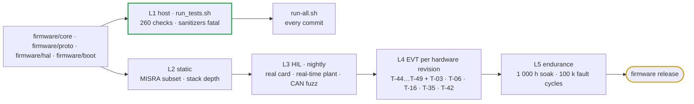

# 🧪 Firmware Verification Plan

Every firmware feature as behaviour, timing, failure, recovery, test and pass criterion — host, HIL, fuzzing, conformance and endurance

  
  
  
  

> [!NOTE]
> **Purpose** — every important firmware feature written as *required behaviour → timing → failure case → recovery → test →
> pass criterion*, and the rigs that execute them: host suites, static analysis, hardware-in-the-loop with CAN fuzzing,
> conformance per protocol profile, timing measurement on the target, EVT on power hardware, and endurance.
>
> **Gate coupling** — the host level runs in `run-all` through `firmware/run_tests.sh`: `host_sim` **114** · `ctl_test` **18** ·
> `proto_test` **40** · `hal_test` **35** · `app_test` **24** · `boot_test` **21** (E80), under AddressSanitizer + UndefinedBehaviorSanitizer (fatal) and `-Werror`. Rows marked **host** cite a
> named check; rows marked **HIL** or **EVT** are planned and carry their pass criteria now, so the rig is built to the
> requirement rather than the requirement to the rig. Architecture and targets:
> [firmware architecture](firmware-architecture.md).

## At a glance

| Level | Where | What it proves | Status |
|---|---|---|---|
| **L1 host** | `firmware/run_tests.sh` | logic, protection rows and recovery, protocol conformance to the documents, malformed-input robustness, one core behind both profiles, the Vienna and LLC laws on cycle-by-cycle plants, the application end to end, and (E80) the signed boot chain — SHA-256/ECDSA-P256 against OpenSSL-derived vectors, image acceptance, trial/rollback, the update protocol under drops and power cuts | **260 checks, green** |
| **L2 static** | cppcheck + clang-tidy (bugprone, cert, misc), a MISRA C:2012 subset, stack-depth analysis | no undefined-behaviour classes, bounded stacks, no implicit narrowing on the wire path | planned |
| **L3 HIL** | the production control card against a real-time plant, with two CAN interfaces and fault injection | timing, loops, sequencing, bus behaviour, NVM and update paths on the real MCU | planned |
| **L4 EVT** | power hardware: T-44…T-49 with the existing T-03, T-06, T-16, T-35, T-42 | control transients, protection and interoperability on real power | planned |
| **L5 endurance** | soak, start/stop, fault cycling, power cycling, 72 h fuzz | wear of logic paths, NVM and relays; no drift into undefined states | planned |

## 1. Feature matrix

### 1.1 Startup, standby and shutdown

| ID | Required behaviour | Timing | Failure case | Recovery | Test | Pass / fail |
|---|---|---|---|---|---|---|
| S-01 | power-up → precharge → READY on a line inside 275–485 VAC with three phases | READY ≤ 2 s after aux up at 400 VAC | line out of window · precharge never completes | waits with LINE_WAIT · F.20 after 5 s of in-window line | host `power-up->precharge->standby` · `app_test` boot to READY ≤ 1 s · HIL H-S01 · EVT T-22 | READY reached; no bypass close outside the window |
| S-02 | the bypass contact closes and is confirmed before the PFC starts | confirmation ≤ 100 ms · F.01 blanked 60 ms | contact never closes | F.19, PFC never enabled | host `E78 a precharge bypass that never closes…` · EVT T-42 | F.19 ≤ 150 ms; zero PFC gate pulses |
| S-03 | start from warm standby | regulated ≤ 1.0 s | start stalls | F.34 at 8 s | host `E76/F.34 stalled start…` · HIL H-S03 | ≤ 1.0 s; overshoot ≤ 1 % |
| S-04 | start from cold standby through the make-permit | regulated ≤ 3.0 s | bleeders dead · a contact would make above the output node | F.34 · the make-permit refuses the close | host `E77 restart from cold standby…` · every-tick make-permit invariant · EVT T-35 | ≤ 3.0 s; every make at ≤ 2 A |
| S-05 | no start without a voltage setpoint or a battery | — | NaN / zero command | READY + NO_SETPOINT | host `E77 voltage command NaN: no start` | no PFC enable |
| S-06 | STOP is a controlled stop | current < 2 A in ≤ 100 ms, then gates off | a stop into a resistive load read as a short | F.16 not evaluated during the ramp | host `E78 the controlled stop…` · `proto_test` one core · `app_test` TonHe stop ≤ 150 ms · HIL H-S06 | no latch; di/dt bounded |
| S-07 | a STOP withdrawn inside the ramp continues | no gate-off | — | — | host `E78 a STOP withdrawn…` | no restart, no re-arm |
| S-08 | warm hold then cold standby | cold 60 s after STOP | — | the next start goes through the make-permit | host `E77 STOP: warm for the hold…` · EVT T-00 | PFC off and matrix open at 0 A; standby ≤ 10 W |
| S-09 | shutdown and discharge | < 60 V in 3 / 4 / 5 s with AC present | discharge blocked | F.21, discharge stays commanded | host stuck-discharge windows · EVT T-21 · T-27 | per-SKU window holds |
| S-10 | WAKE leaves OFF | READY ≤ 2 s | — | — | host `E78 WAKE…` | back through INIT and precharge |
| S-11 | LOW ↔ HIGH mode change in AUTO | 1 s dwell · contacts open ≥ 51 ms | welded contact | F.17 | host `S/P transition w/ dwell` · `E78 … 1 s product dwell` · exclusion invariant · EVT T-35 | no overlap tick; no make above the node |
| S-12 | no blind restart after a module reset | zero delivery until a fresh request | RUN held across a watchdog reset | VMP boot hold · TonHe start is an event | `proto_test` boot re-arm · HIL H-S12 | no current until RUN 0 → 1 (VMP) or 0xAA (TonHe) |

### 1.2 Control, ramping and transitions

| ID | Required behaviour | Timing | Failure case | Recovery | Test | Pass / fail |
|---|---|---|---|---|---|---|
| C-01 | soft start into no load | 500 V/s | overshoot | skip band | `ctl_test` soft start · HIL H-C01 · EVT T-48 | overshoot ≤ 1 % |
| C-02 | soft start into a battery | reference starts at the battery; current rise ≤ 1 000 A/s | inrush | bumpless reference | `ctl_test` start into a battery · HIL H-C02 | current overshoot ≤ 2 % of rated |
| C-03 | voltage setpoint step ± 10 % | ramp-limited; within ± 0.5 % ≤ 100 ms after the ramp | overshoot, ringing | — | HIL H-C03 · EVT T-48 | overshoot ≤ 1 % |
| C-04 | current setpoint step 10 ↔ 90 % | t90 ≤ 150 ms up · ≤ 100 ms down | overshoot | — | `ctl_test` current slew · HIL H-C04 | overshoot ≤ 2 % of rated |
| C-05 | load step 25 ↔ 100 % in CV | back within ± 0.5 % ≤ 50 ms | undershoot | — | HIL H-C05 · EVT T-03 | deviation ≤ 3 % |
| C-06 | CV ↔ CC transfer | bumpless | windup, limit cycle | back-calculation | `ctl_test` no windup · takeover at the limit · HIL H-C06 | I overshoot ≤ 2 %, V overshoot ≤ 1 %, no cycle > 0.5 % |
| C-07 | power limit and the rated-power curve | reduction ≤ 10 ms | overshoot | — | `ctl_test` power limits · HIL H-C07 | ≤ +2 % steady, ≤ +5 % for ≤ 100 ms |
| C-08 | load dump from 100 % | peak ≤ V_set · 1.05 + 10 V | F.13 latch, bank overvoltage | skip band + HW-REC-1 | `hal_test` PFC load dump (peak 833 V) · HIL H-C08 · EVT T-45 | no latch; parts inside ratings |
| C-09 | derate down and recovery | down ≤ 10 ms · up ≤ 20 %/s | hunting | slew-limited recovery | host `E77 thermal derate is continuous` · `E77 fan recovery ramps…` | no step > 3 % per ms |
| C-10 | input sag 330 → 285 VAC at full load | follows E1 without F.05 | bus collapse | E1 availability | `ctl_test` E1 · `app_test` 60 ms at 230 VAC and 50 kW · HIL H-C10 · EVT T-02 | no F.05; power ∝ V_LL below 330 VAC |
| C-11 | accuracy and ripple | steady state | — | EOL calibration | EVT T-03 · T-40 | V ± 0.5 %, I ± 1 %, control ripple ≤ 0.2 % rms |
| C-12 | loop stability | — | oscillation at a corner | gain schedule | HIL H-C12 frequency-response injection · EVT T-48 | PM ≥ 45°, GM ≥ 6 dB at every envelope corner |
| C-13 | non-finite values in control | — | NaN / Inf into the shaper or kernel | outputs finite, demand 0 | `ctl_test` NaN containment · 200 k fuzz | no NaN reaches a PWM command |
| C-14 | Vienna steady state and start (E79) | settles within 1 % · no start overshoot | distortion, midpoint drift | — | `hal_test` 50 kW at 400 VAC · start from the crest · 3 A on one bus half · sequence A-C-B · EVT T-02 | THD < 5 %, PF > 0.99, midpoint < 10 V (host plant: 0.7 %, 0.9999, 2.8 V) |
| C-15 | the LLC never runs capacitive (E79) | every switching period | a demand beyond the tank's gain · a high-Q load | the ZVS floor | `hal_test` ZVS table against the FHA corners · CV, CC and beyond-gain on the switched tank · EVT T-48 | zero hard-switched edges; frequency never below the floor |
| C-16 | the phase current through a line step (E79) | the 15 µs transport delay | a deep sag recovery · a phase jump · a high line | the amplitude limit leaves room for the step back | `hal_test` 50 % and 75 % sags at 50 kW · 50 % of 480 VAC at 30 kW · 30° jump · EVT T-02 | peak < F.01 / 1.2 |

### 1.3 Parallel operation

| ID | Required behaviour | Timing | Failure case | Recovery | Test | Pass / fail |
|---|---|---|---|---|---|---|
| G-01 | equal share in CC | steady | calibration spread | the share law | `proto_test` GROUP_CTRL EQUAL · HIL H-G01 · EVT T-47 | ± 5 % of the average at ≥ 10 % load |
| G-02 | sharing in CV (end of charge) | within 3 s | ± 0.3 % voltage calibration spread | CV share trim | HIL H-G02 · EVT T-47 | ± 5 %; trim ≤ ± 1 % |
| G-03 | unequal capability | steady | one module derated | LEVEL law (controller water-fill) | `proto_test` LEVEL · EVT T-47 | the group delivers the request |
| G-04 | the group sum never exceeds the request | every tick | join, drop, partition, re-join | hold and stale rules | host `group: sum of shares never exceeds I_req…` · `proto_test` EQUAL invariant | Σ ≤ request + 1 % |
| G-05 | hot join | at share ≤ 3 s | simultaneous joins | rank stagger | host `group: staggered first delivery by rank…` · HIL H-G05 | stagger ≥ 300 ms per rank |
| G-06 | member loss | others raise after 1.3 s | a grown target during the hold | the hold restarts | host `group: grown raise target restarts the hold…` · HIL H-G06 | dip ≤ one share for ≤ 1.5 s |
| G-07 | peer data loss | trim decays with τ 5 s | a silent peer | decay, no drift | `ctl_test` share trim · HIL H-G07 | group voltage within ± 0.5 % |
| G-08 | mixed rack with a TonHe module | steady | different sharing methods | bounded trim | EVT T-46 | ± 10 % of the average |

### 1.4 Thermal and cooling

| ID | Required behaviour | Timing | Failure case | Recovery | Test | Pass / fail |
|---|---|---|---|---|---|---|
| TH-01 | continuous thermal derate | 4 %/°C from 105 °C | a step at the threshold | continuous slope | host `E77 thermal derate is continuous` | no step > 3 % per ms |
| TH-02 | over-temperature trip and automatic recovery | trip at 115 °C; recover < 100 °C after the hold | — | AUTO_INT + fresh request | host `E78 over-temperature (AUTO_INT)…` | recovers; waits for a fresh request |
| TH-03 | repeated over-temperature locks | 5 trips in 10 min | cooling failure | F.31 LOCK | host `E78 … five trips inside ten minutes lock…` | LOCK |
| TH-04 | fan failure | derate 0.5 (0.6 for one of four on 50 kW air) | one fan out | derate + report | host `fan fail derate 50%` · HIL H-TH04 · EVT T-04 | power within the air budget |
| TH-05 | open NTC or cutout loop | ≤ 1 s | open sensor | F.22 | host `E65 open NTC/cutout loop F.22` | F.22, never "very cold" |
| TH-06 | blocked air / dry plate | derate, then trip, before Tj limits | cooling lost | OT ladder | EVT T-04 · T-32 | Tj ≤ limits throughout |
| TH-07 | no derated / non-derated oscillation | steady at the threshold | ± 1 °C sensor noise | slope + recovery slew + zone hysteresis | host `E77` sine-temperature check · HIL H-TH07 | ≤ 1 derate crossing per 30 s |

### 1.5 Grid and power-stage faults

| ID | Required behaviour | Timing | Failure case | Recovery | Test | Pass / fail |
|---|---|---|---|---|---|---|
| X-01 | phase loss | 40 ms | a phase drops | F.09 AUTO_EXT | host `phase loss F.09` · `E77 1 ms phase dropout rides through` · EVT T-02 | rides 1 ms dropouts; trips at 40 ms |
| X-02 | sag below 260 VAC | 100 ms ride-through | sustained sag | F.08; recovery above 275 VAC after the hold | host `E78 an input sag (F.08 AUTO_EXT)…` · `E77 99 ms sag rides through` · `app_test` ride-through with the bus fold-back | recovers into READY with REARM |
| X-03 | swell above 500 VAC | 20 ms | sustained swell | F.07; recovery below 485 VAC | host `swell F.07` | — |
| X-04 | repeated grid events | — | 8 sags in 10 min | never locks; hold doubles to 64 s | host `E78 eight grid sags…` | no LOCK |
| X-05 | aux brownout | SAFE at once; 500 ms stable to leave | aux hovering at UVLO | re-arm | host `E78 after an aux collapse…` · EVT T-09 | no restart without a fresh request |
| X-06 | output short | CC limit; F.16 in 10 ms | bolted short at the studs | LATCH | host `output short F.16` · EVT T-30 | clears inside the device withstand |
| X-07 | output over-current backstop | 130 % / 2 ms · 102 % / 100 ms | CC loop failure | LATCH | host `E77 F.15 …` rows | no trip on a normal ramp-down |
| X-08 | output overvoltage | CMP0 hardware · mirror 2 ms · sourcing 200 ms | CV failure · load dump | LATCH · skip band | host `E77 F.13 …` rows · EVT T-45 | no trip on a battery above the command |
| X-09 | reversed battery at start | at readiness | reverse polarity | F.33 | host `reverse backfeed F.33` | no enable |
| X-10 | bus OVP, DESAT, tank OC | µs, hardware | device failure | LATCH, attribution F.11 vs F.02 | host DESAT / F.01 / bus OVP rows · `app_test` channel attribution · EVT T-06 · T-30 · T-37 | per protection-thresholds |
| X-11 | relay weld or open | 100 ms (open) · soft start (weld) | contact failure | F.19 · F.17 | host `E78 a matrix contact that drops out…` · `E67 welded K_PARA…` · EVT T-35 | latch; no make above the node |
| X-12 | line frequency (E79) | 200 ms | outside 45–65 Hz, or no zero crossing on a live line | F.37 AUTO_EXT | `app_test` 40 Hz → F.37, clears at 50 Hz · `hal_test` grid monitor at 45 / 50 / 60 / 65 Hz with noise · EVT T-02 | latches at 200 ms; recovers after the hold |

### 1.6 Communication and protocols

| ID | Required behaviour | Timing | Failure case | Recovery | Test | Pass / fail |
|---|---|---|---|---|---|---|
| N-01 | VMP stream loss | timeout 1 s ± 2 ms; current out ≤ 100 ms | controller dead | REARM; RUN 0 → 1 | `proto_test` one core · VMP · host `CAN timeout -> standby+re-enable` | a resumed RUN = 1 stream does not restart |
| N-02 | TonHe loss | 20 s | monitor dead | a new start command | `proto_test` one core · TonHe · 20 s rule | 19.999 s alive, 20.001 s stopped |
| N-03 | frozen sender | stale at the timeout | the same frame repeated | — | `proto_test` frozen counter | stale despite frames arriving |
| N-04 | duplicate and late frames | — | reordered by a gateway | ignored / NAK SEQUENCE | `proto_test` counter check | state unchanged |
| N-05 | corrupted command | — | bit errors past CAN CRC, misrouting | NAK CRC | `proto_test` CRC NAK · must-understand | state unchanged |
| N-06 | bus-off and error-passive | recover ≤ 200 ms; after 10 in 60 s hold off 5 s | babbling node, wiring fault | automatic; power side via the timeout | `app_test` 100 ms restart, a 5 s hold after ten · HIL H-N06 (error-frame injection) | never stuck off-bus; never delivering without a fresh stream |
| N-07 | floods and high utilization | — | 1 kHz CTRL, 2 kHz foreign traffic, request storm | acceptance filters, RX ring, token bucket, TX eviction | `proto_test` TX queue eviction · HIL H-N07 | commands and fault events delivered; drops counted; CPU ≤ 75 % |
| N-08 | wrong bit rate or profile | — | misconfigured cabinet | safe READY; HMI shows profile and rate | HIL H-N08 | no delivery; recoverable by service |
| N-09 | ownership and controller restart | — | two controllers · a fast restart | NAK OWNED · RUN held | `proto_test` ownership · restart | no dual control; no blind restart |
| N-10 | discovery and address conflicts | announce ≤ window | duplicate addresses | incumbent keeps, newcomer yields (VMP) · both stop (TonHe) | `proto_test` discovery · conflicts | deterministic outcome |
| N-11 | telemetry cadence and latency | TLM_FAST 20 Hz ± 5 ms · FAULT_BITS ≤ 20 ms · ACK ≤ 20 ms | CPU starvation | priority queue | `proto_test` cadence (logic) · EVT T-44 (time) | inside budget for 24 h |
| N-12 | malformed traffic | — | random frames | ignored or NAKed | `proto_test` 1 M frames per profile · HIL H-N12 72 h fuzz | no sanitizer trap (host) · no reset, no stuck state (HIL) |
| N-13 | VMP conformance | — | — | — | `proto_test` VMP rows · HIL conformance script covering every function, status code and object | every row passes |
| N-14 | TonHe V1.2 conformance | — | — | — | `proto_test` TonHe rows (document examples byte-exact) · EVT T-46 | every row passes; TH-AMB readings confirmed |

### 1.7 Robustness and exceptions

| ID | Required behaviour | Timing | Failure case | Recovery | Test | Pass / fail |
|---|---|---|---|---|---|---|
| F-01 | impossible or non-finite measurements | F.29 after 3 ms | sensor or ADC failure | CLEAR | host `E77 …NaN…` rows | never blind; 2 ms glitches ride through |
| F-02 | stuck-low output sensor | — | sensor failure | F.29 | host `stuck Vout sensor F.29` | latch |
| F-03 | corrupted state value | next tick | memory corruption | F.36 | host `E78 a state value the enum does not define…` | every enable off |
| F-04 | control overrun | verdict per architecture §3.3 | starved ISR | F.35 | host `E78 … control-overrun verdict…` · `app_test` a stalled LLC interrupt · HIL H-F04 (injected ISR load) · EVT T-44 | latch on persistent overrun only |
| F-05 | ADC stall or reference drift | 1 ms · 1 s | DMA stopped · Vref off | F.29 | HIL H-F05 | latch within budget |
| F-06 | watchdog reset under load | gates low ≤ the watchdog window | hung MCU | F.32 logged; no automatic restart | `app_test` F.32 on a watchdog boot · HIL H-F06 · EVT T-16 | zero gate pulses while GATE_EN low |
| F-07 | HardFault or stack overflow | immediate | wild pointer, overflow | gates low, cause stored, reset | HIL H-F07 (fault injection build) | cause readable after the reset |
| F-08 | boot loop | 3 resets in 10 min | bad image or hardware | safe bootloader | HIL H-F08 | outputs off; service frames answered |
| F-09 | NVM corruption | at load | bit flips in A, in A and B | newest valid · defaults · F.30 for calibration | `app_test` F.30 on an out-of-window record · HIL H-F09 | never runs on an invalid calibration |
| F-10 | power cut during a write | — | cut at a random instant | the previous record stays valid | `hal_test` a cut at every byte and compaction step · HIL H-F10, 1 000 random cuts | zero invalid records accepted |
| F-11 | interrupted firmware update | — | cut at 100 random points | the old image runs; rollback after 3 boots | HIL H-F11 | always boots a confirmed image |
| F-12 | corrupted configuration values | at load and on write | out-of-range fields | per-field defaults | `proto_test` fuzz (cfg_sanitize) | no zero period, no divide |
| F-13 | stack headroom | after the full HIL suite | deep call path | — | HIL H-F13 (painted stacks) | high-water ≤ 70 % |
| F-14 | saturating counters | — | long life | — | host `E78 … saturates at 255…` | no wrap |

### 1.8 Endurance

| ID | Procedure | Pass / fail |
|---|---|---|
| D-01 | 1 000 h soak at 25–100 % power cycling, full telemetry, VMP | zero unexplained events; counters monotonic; no NVM error |
| D-02 | 10 000 start / stop cycles per SKU | zero latches; relay operations counted exactly |
| D-03 | 100 000 fault-inject / recover cycles on HIL across F-01…F-12, X-01…X-11 | every cycle ends in its documented state |
| D-04 | 10 000 LOW ↔ HIGH mode changes (extends T-35) | zero surge-invariant violations; zero F.19 |
| D-05 | 1 000 power cycles including brownouts | zero NVM corruption; zero spurious gate pulses (T-16) |
| D-06 | 72 h CAN fuzz on HIL per profile | no reset, no stuck state, CPU ≤ 75 % |

## 2. Rigs and methods

### 2.1 Host (L1)

`firmware/run_tests.sh` compiles the core and the protocol layer with `-std=c99 -Wall -Wextra -Werror` under ASan and UBSan with
`-fno-sanitize-recover=undefined`, and runs:

| Suite | Scope |
|---|---|
| `host_sim` 114 | the 26 fault scenarios on a behavioural plant with relay mirror contacts, E60–E78 regressions, three group-law nodes, every-tick invariants (relay exclusion, make-permit, aux) |
| `ctl_test` 18 | shaper rules and regulator properties (§1.2) |
| `proto_test` 40 | frame helpers, TonHe V1.2 and VMP 2.0 conformance and fuzz, one core behind both profiles |
| `hal_test` 34 | E79: the Vienna law on a cycle-by-cycle plant — start, load step and dump, steady THD / PF / midpoint, 50 % and 75 % sags, a 480 VAC sag, a 30° jump, sequence A-C-B · the LLC modulator on a switched tank — the ZVS table against the FHA corners, CV, CC into a battery, the floor, burst · measurement · the NVM store under a power cut at every byte and step |
| `app_test` 16 | E79: the application end to end through TonHe V1.2 on averaged plants — boot to delivery, the stop, each fault channel, F.30 · F.32 · F.35 · F.37, the watchdog gate, sag ride-through, a start above the setpoint, CAN bus-off, configuration storage |

To add: line and branch coverage with llvm-cov (target ≥ 90 % of `core/` and `proto/`), and a layer check that fails if any
`core/` file includes a `proto/` header.

### 2.2 Static (L2)

cppcheck and clang-tidy (bugprone-\*, cert-\*, misc-\*) on every commit · a MISRA C:2012 subset: no dynamic memory (21.3), no
recursion (17.2), a default in every switch (16.4), no implicit narrowing on wire paths (10.3) · a worst-case stack depth from
the call graph plus ISR nesting.

### 2.3 Hardware-in-the-loop (L3)

| Element | Specification |
|---|---|
| Unit under test | the production control card and firmware image, with the real CAN transceiver |
| Plant | real-time target at ≥ 100 kHz step: Vienna averaged per switching period, LLC from a gain-versus-frequency table per SKU (from the `llc-run` decks), output network with the terminal capacitors, battery emulator (E, R_int, contactor), relays with coil delays and mirror contacts, NTC zones, fans |
| CAN | two independent interfaces — a controller emulator, and an analyzer / fuzzer able to inject error frames and bit errors |
| Injection | aux-rail dips on the card, forced ADC stalls, ISR load injection, NVM bit flips, power cuts during writes and updates |
| Observation | logic analyzer on GATE_EN and HRTIMER outputs · GPIO markers from debug builds · CAN timestamps · plant logs |
| Automation | Python and pytest; every run archives traces with the firmware hash |

### 2.4 Timing measurement

| Quantity | Method |
|---|---|
| ISR execution time | DWT cycle counter per ISR, maximum over 24 h, cross-checked with GPIO toggles on a scope |
| CPU load | idle-counter method in the 1 ms scheduler |
| Command latency | analyzer timestamp of the control frame → GPIO marker at the reference commit |
| Telemetry age | debug builds embed the sample timestamp; compared with the analyzer timestamp |
| Fault detection | injected condition edge in the plant → GATE_EN low on the logic analyzer |
| Controlled stop | plant current log from the STOP frame to < 2 A |

### 2.5 Conformance per profile

- **VMP 2.0** — `proto_test` on the host; on HIL a conformance script walks every function, action, object and status code and
  the controller rules of [VMP 2.0 §9](can-protocol.md#9-rules-a-controller-follows), including timing.
- **TonHe V1.2** — `proto_test` against the document's own example frames; EVT T-46 runs our module on a TonHe-class monitor and
  in a mixed rack, and replays captures of a real TonHe module against the same expectations, confirming or re-registering
  TH-AMB-1…11.

### 2.6 Regression and release

`run-all.sh` runs L1 on every commit · HIL nightly on main · EVT on every hardware revision · a firmware release needs L1–L4
green and D-01…D-06 complete on the release candidate.

## 3. Pass / fail rules for every level

A run fails on any sanitizer report, any invariant violation, any latch without a matching injected cause, any timing budget
exceeded, any state not listed in the architecture's state machines, any delivery without a fresh request, or any
non-deterministic outcome across repeated runs of the same injected sequence.

## 4. Hardware rows added to the EVT plan

T-44 firmware timing on the target · T-45 load dump at full current · T-46 TonHe V1.2 interoperability · T-47 parallel sharing ·
T-48 control transients · T-49 fault and recovery cycling — procedures and criteria in the [EVT plan](evt-plan.md).

## E80 additions

| ID | Behaviour under test | Where | Status |
|---|---|---|---|
| C-17 | The external-recheck protection rows: line min/max split (F.07/F.08), F.38 half-link, F.34 over the PFC ramp, the matrix make-settle and mismatch permits, discharge completion on link + banks, F.21 ending the dumps, fan derate by count | `host_sim` E80 block (8 checks) | **host, green** |
| C-18 | Uncalibrated inhibit (F.30 on a blank card), the fan tach curve, the mode-scheduled F.13 and the HW-REC-1 clamp reference, the event ring + VMP 0x0400 reads, ENTER_BOOT handoff, the 60 s boot confirmation edge | `app_test` E80 checks | **host, green** |
| C-19 | CC setpoint step 10 ↔ 90 % through the documented shaper slews: t90 ≤ 150 ms up / ≤ 100 ms down, overshoot bounded inside F.15's fast row (the §5.5 ≤ 2 % figure is the HIL gain-acceptance, review R34) | `hal_test` | **host, green — 2 % at T-48/HIL** |
| B-01…B-05 | SHA-256 and P-256 vectors (43 accept / 29 refuse), signed-image acceptance and every refusal code, the boot decision table incl. rollback/streak/baseline, the update protocol end to end on RAM flash, the chunked-verification watchdog poll | `boot_test` | **host, green** |
| X-13 | The target port's pin table equals the card generator's, 56 pins | `port-pin-audit` (run-all) | **gate, green** |
| X-14 | The target cross-build links boot + slot A/B and signs both images | `firmware/port/gd32g553/build.sh` (run-all when the ARM GCC exists) | **gate, green** |
| T-52…T-56 | Boot/update on silicon · the TPS3430 window · the fan curve constant · the aux fault matrix · PV bleeder hot/humid | [EVT plan](evt-plan.md) | planned |

---

<a href="evt-plan.md">← EVT Test Plan</a> &nbsp;·&nbsp; <a href="README.md">🧭 Documentation hub</a> &nbsp;·&nbsp; <a href="reliability-budget.md">Reliability Budget →</a>

Vectivolt DC-Modules · documentation rev E81 · every number reproduces with <code>sh calculations/run-all.sh</code>

