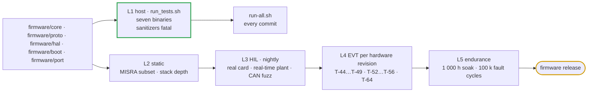

# 🧪 Firmware Verification Plan

Every firmware feature as behaviour, timing, failure, recovery, test and pass criterion — host, HIL, fuzzing, conformance and endurance

  
  
  
  

> [!NOTE]
> **Purpose** — every important firmware feature written as *required behaviour → timing → failure case → recovery → test →
> pass criterion*, and the rigs that execute them: host suites, static analysis, hardware-in-the-loop with CAN fuzzing,
> conformance per protocol profile, timing measurement on the target, EVT on power hardware, and endurance.
>
> **Gate coupling** — the host level runs in `run-all` through `firmware/run_tests.sh`: `boot_test` · `host_sim` ·
> `ctl_test` · `proto_test` · `hal_test` · `app_test` · `rules_test`, under AddressSanitizer + UndefinedBehaviorSanitizer
> (fatal) and `-Werror`. Rows marked **host** name the suite that runs them; rows marked **HIL** or **EVT** are planned and
> carry their pass criteria now, so the rig is built to the requirement rather than the requirement to the rig.
> Architecture and targets: [firmware architecture](firmware-architecture.md).

## At a glance

| Level | Where | What it proves | Status |
|---|---|---|---|
| **L1 host** | `firmware/run_tests.sh` | logic, protection rows and recovery, protocol conformance to the documents, malformed-input robustness, one core behind both profiles, the Vienna and LLC laws on cycle-by-cycle plants, the application end to end, and the signed boot chain and update protocol under drops and power cuts | **green** |
| **L2 static** | cppcheck + clang-tidy (bugprone, cert, misc), a MISRA C:2012 subset, stack-depth analysis | no undefined-behaviour classes, bounded stacks, no implicit narrowing on the wire path | planned |
| **L3 HIL** | the production control card against a real-time plant, with two CAN interfaces and fault injection | timing, loops, sequencing, bus behaviour, NVM and update paths on the real MCU | planned |
| **L4 EVT** | power hardware: T-44…T-49 and T-52…T-56, T-64, with the existing T-03, T-06, T-16, T-35, T-42 | control transients, protection and interoperability on real power | planned |
| **L5 endurance** | soak, start/stop, fault cycling, power cycling, 72 h fuzz | wear of logic paths, NVM and relays; no drift into undefined states | planned |

## 1. Feature matrix

### 1.1 Startup, standby and shutdown

| ID | Required behaviour | Timing | Failure case | Recovery | Test | Pass / fail |
|---|---|---|---|---|---|---|
| S-01 | power-up → precharge → READY on a line inside 275–485 VAC with three phases | READY ≤ 2 s after aux up at 400 VAC | line out of window · precharge never completes | waits with LINE_WAIT, then the grid row after 10 s · F.20 after 5 s of in-window line | `host_sim` power-up sequence · `app_test` boot to READY · HIL H-S01 · EVT T-22 | READY reached; no bypass close outside the window |
| S-02 | the bypass contact closes on a settled link and is confirmed before the PFC starts | confirmation ≤ 100 ms · F.01 blanked 60 ms | contact never closes | F.19, PFC never enabled | `host_sim` bypass-never-closes scenario · EVT T-42 | F.19 ≤ 150 ms; zero PFC gate pulses |
| S-03 | start from warm standby | regulated ≤ 1.0 s | start stalls | F.34 at 8 s | `host_sim` stalled start · HIL H-S03 | ≤ 1.0 s; overshoot ≤ 1 % |
| S-04 | start from cold standby through the make-permit | regulated ≤ 3.0 s | bleeders dead · a contact would make above the output node | F.34 · the make-permit refuses the close | `host_sim` cold restart and the every-tick make-permit invariant · EVT T-35 | ≤ 3.0 s; every make at ≤ 2 A |
| S-05 | no start without a voltage setpoint or a battery | — | NaN / zero command | READY + NO_SETPOINT | `host_sim` NaN voltage command | no PFC enable |
| S-06 | STOP is a controlled stop | current < 2 A in ≤ 100 ms, then gates off | a stop into a resistive load read as a short | F.16 not evaluated during the ramp | `host_sim` controlled stop · `proto_test` one core · `app_test` TonHe stop ≤ 150 ms · HIL H-S06 | no latch; di/dt bounded |
| S-07 | a STOP withdrawn inside the ramp continues | no gate-off | — | — | `host_sim` withdrawn STOP | no restart, no re-arm |
| S-08 | warm hold then cold standby | cold 60 s after STOP | — | the next start goes through the make-permit | `host_sim` warm-hold expiry · EVT T-00 | PFC off and matrix open at 0 A; standby ≤ 10 W |
| S-09 | shutdown and discharge | < 60 V in 3 / 4 / 5 s with AC present, then the output node under its own bound | discharge blocked, or the link stops falling | F.21, dump commands end with the row · F.18 when a welded bypass is the source | `host_sim` stuck-discharge and AC-pinned-link scenarios · EVT T-21 · T-27 | per-SKU window holds; a pinned link is reported at ≤ 500 ms |
| S-10 | WAKE leaves OFF | READY ≤ 2 s | a stale latched code survives the shutdown | the wake clears it; a LOCK survives | `host_sim` WAKE scenarios | back through INIT and precharge, with no stale code |
| S-11 | LOW ↔ HIGH mode change in AUTO | 1 s dwell · contacts open ≥ 51 ms | welded contact | F.17 | `host_sim` mode change, product dwell and the exclusion invariant · EVT T-35 | no overlap tick; no make above the node |
| S-12 | no blind restart after a module reset | zero delivery until a fresh request | RUN held across a watchdog reset | VMP boot hold · a TonHe start is an event | `proto_test` boot re-arm · HIL H-S12 | no current until RUN 0 → 1 (VMP) or 0xAA (TonHe) |

### 1.2 Control, ramping and transitions

| ID | Required behaviour | Timing | Failure case | Recovery | Test | Pass / fail |
|---|---|---|---|---|---|---|
| C-01 | soft start into no load | 500 V/s | overshoot | skip band | `ctl_test` soft start · HIL H-C01 · EVT T-48 | overshoot ≤ 1 % |
| C-02 | soft start into a battery | reference starts at the battery; current rise ≤ 1 000 A/s | inrush | bumpless reference | `ctl_test` start into a battery · HIL H-C02 | current overshoot ≤ 2 % of rated |
| C-03 | voltage setpoint step ± 10 % | ramp-limited; within ± 0.5 % ≤ 100 ms after the ramp | overshoot, ringing | — | HIL H-C03 · EVT T-48 · T-60 | overshoot ≤ 1 % |
| C-04 | current setpoint step 10 ↔ 90 % | t90 ≤ 150 ms up · ≤ 100 ms down | overshoot | — | `ctl_test` current slew · HIL H-C04 | overshoot ≤ 2 % of rated |
| C-05 | load step 25 ↔ 100 % in CV | back within ± 0.5 % ≤ 50 ms | undershoot | — | HIL H-C05 · EVT T-03 | deviation ≤ 10 % on the drawn film-only bank |
| C-06 | CV ↔ CC transfer | bumpless | windup, limit cycle | back-calculation | `ctl_test` no windup, takeover at the limit · HIL H-C06 | I overshoot ≤ 2 %, V overshoot ≤ 1 %, no cycle > 0.5 % |
| C-07 | power limit and the rated-power curve | reduction ≤ 10 ms | overshoot | — | `ctl_test` power limits · HIL H-C07 | ≤ +2 % steady, ≤ +5 % for ≤ 100 ms |
| C-08 | load dump from 100 % | peak ≤ V_set · 1.05 + 10 V | F.13 latch, bank overvoltage | skip band, the integrator ceiling above the reference, HW-REC-1 | `hal_test` PFC load dump · HIL H-C08 · EVT T-45 | no latch; parts inside ratings |
| C-09 | derate down and recovery | down ≤ 10 ms · up ≤ 20 %/s | hunting | slew-limited recovery | `host_sim` continuous thermal derate and fan recovery | no step > 3 % per ms |
| C-10 | input sag 330 → 285 VAC at full load | follows the input derate without F.05 | bus collapse | availability ∝ line | `ctl_test` input derate · `app_test` 60 ms at 230 VAC and 50 kW · HIL H-C10 · EVT T-02 | no F.05; power ∝ V_LL below 330 VAC |
| C-11 | accuracy and ripple | steady state | — | EOL calibration | EVT T-03 · T-40 | V ± 0.5 %, I ± 1 %, control ripple ≤ 0.2 % rms |
| C-12 | loop stability | — | oscillation at a corner | the modulator-sensitivity gain normalization | `hal_test` CV gain ceiling · HIL H-C12 frequency-response injection · EVT T-48 | PM ≥ 45°, GM ≥ 6 dB at every envelope corner |
| C-13 | non-finite values in control | — | NaN / Inf into the shaper or kernel | outputs finite, demand 0 | `ctl_test` NaN containment and fuzz | no NaN reaches a PWM command |
| C-14 | Vienna steady state and start | settles within 1 % · no start overshoot | distortion, midpoint drift | — | `hal_test` 50 kW at 400 VAC, start from the crest, 3 A on one bus half, sequence A-C-B · EVT T-02 | THD < 5 %, PF > 0.99, midpoint < 10 V (host plant: 0.7 %, 0.9999, 2.8 V) |
| C-15 | the LLC never runs capacitive | every switching period | a demand beyond the tank's gain · a high-Q load | the ZVS floor | `hal_test` ZVS table against the FHA corners; CV, CC and beyond-gain on the switched tank · EVT T-48 · T-58 | zero hard-switched edges; frequency never below the floor |
| C-16 | the phase current through a line step | the 15 µs transport delay | a deep sag recovery · a phase jump · a high line | the amplitude limit leaves room for the step back | `hal_test` 50 % and 75 % sags at 50 kW, 50 % of 480 VAC at 30 kW, a 30° jump · EVT T-02 | peak < F.01 / 1.2 |
| C-17 | the junction fold at the operating point | 1 ms observer, τ 0.5 s | deep phase shift at low output, the series corner, low line on a high link | availability folds with `PMP_DR_THERMAL`; a point the fold cannot cool is declined, and the refusal is not inherited by the next start | `ctl_test` fold and decline · `app_test` end to end · EVT T-04 | the grid's folds appear as reduced availability, never as a fault |
| C-18 | DC line current from measurement offsets | per-cycle estimate, τ ≈ 80 ms (voltages) and ≈ 0.7 s (currents) | a CT has no DC response, so the loop cannot see the DC it produces | the estimate is subtracted before the loop acts, frozen on any cycle that is not clean | `hal_test` DC removal on a high-pass-sensor plant | DC line current under the clamp, which is itself proven not to be a hiding place |
| C-19 | the burst floor and packet bounds | below 3 % load | burst ripple on the drawn film bank | the packet starts and ends on the node's reference, not on the demand | `hal_test` burst rows · EVT T-48 | burst ripple ≤ 1 % peak to peak |

### 1.3 Parallel operation

| ID | Required behaviour | Timing | Failure case | Recovery | Test | Pass / fail |
|---|---|---|---|---|---|---|
| G-01 | equal share in CC | steady | calibration spread | the share law | `proto_test` GROUP_CTRL EQUAL · HIL H-G01 · EVT T-47 | ± 5 % of the average at ≥ 10 % load |
| G-02 | sharing in CV (end of charge) | within 3 s | ± 0.3 % voltage calibration spread | CV share trim | HIL H-G02 · EVT T-47 | ± 5 %; trim ≤ ± 1 % |
| G-03 | unequal capability | steady | one module derated | LEVEL law (controller water-fill) | `proto_test` LEVEL · EVT T-47 | the group delivers the request |
| G-04 | the group sum never exceeds the request | every tick | join, drop, partition, re-join | hold and stale rules | `host_sim` three-node sum invariant · `proto_test` EQUAL invariant | Σ ≤ request + 1 % |
| G-05 | hot join | at share ≤ 3 s | simultaneous joins | rank stagger | `host_sim` staggered first delivery · HIL H-G05 | stagger ≥ 300 ms per rank |
| G-06 | member loss | others raise after 1.3 s | a grown target during the hold | the hold restarts | `host_sim` grown-raise-target scenario · HIL H-G06 | dip ≤ one share for ≤ 1.5 s |
| G-07 | peer data loss | trim decays with τ 5 s | a silent peer | decay, no drift | `ctl_test` share trim · HIL H-G07 | group voltage within ± 0.5 % |
| G-08 | mixed rack with a TonHe module | steady | different sharing methods | bounded trim | EVT T-46 | ± 10 % of the average |

### 1.4 Thermal and cooling

| ID | Required behaviour | Timing | Failure case | Recovery | Test | Pass / fail |
|---|---|---|---|---|---|---|
| TH-01 | continuous thermal derate | 4 %/°C from 105 °C on the mapped scale | a step at the threshold | continuous slope | `host_sim` continuous derate | no step > 3 % per ms |
| TH-02 | over-temperature trip and automatic recovery | trip at 115 °C; recover < 100 °C after the hold | — | AUTO_INT + fresh request | `host_sim` over-temperature recovery | recovers; waits for a fresh request |
| TH-03 | repeated over-temperature locks | 5 trips in 10 min | cooling failure | F.31 LOCK | `host_sim` five trips inside ten minutes | LOCK |
| TH-04 | fan failure | derate by failed count: 0.6 / 0.3 with four fans, 0.5 with two or three | one fan out | derate + report; no working fan left is F.25 | `host_sim` fan-derate rows · `rules_test` per-rating fan count · HIL H-TH04 · EVT T-04 | power within the air budget |
| TH-05 | open NTC or cutout loop | ≤ 1 s | open sensor | F.22 | `host_sim` open NTC / cutout loop | F.22, never "very cold" |
| TH-06 | blocked air / dry plate | derate, then trip, before junction limits | cooling lost | the OT ladder | EVT T-04 · T-32 | junction temperature inside its limits throughout |
| TH-07 | no derated / non-derated oscillation | steady at the threshold | ± 1 °C sensor noise | slope + recovery slew + zone hysteresis | `host_sim` sine-temperature scenario · HIL H-TH07 | ≤ 1 derate crossing per 30 s |

### 1.5 Grid and power-stage faults

| ID | Required behaviour | Timing | Failure case | Recovery | Test | Pass / fail |
|---|---|---|---|---|---|---|
| X-01 | phase loss | 40 ms | a phase drops | F.09 AUTO_EXT | `host_sim` phase loss and a 1 ms dropout · EVT T-02 | rides 1 ms dropouts; trips at 40 ms |
| X-02 | sag below 260 VAC | 100 ms ride-through | sustained sag | F.08; recovery above 275 VAC after the hold | `host_sim` sag rows · `app_test` ride-through with the bus fold-back | recovers into READY with REARM |
| X-03 | swell above 500 VAC | 20 ms | sustained swell | F.07; recovery below 485 VAC | `host_sim` swell row | — |
| X-04 | repeated grid events | — | 8 sags in 10 min | never locks; the hold doubles to 64 s | `host_sim` eight grid sags | no LOCK |
| X-05 | aux brownout | SAFE at once; 500 ms stable to leave; F.26 after 5 s without the rail | aux hovering at UVLO, or never returning | re-arm, or an AUTO_INT row that clears when the rail returns | `host_sim` aux-collapse rows · `rules_test` F.26 · EVT T-09 | no restart without a fresh request; never an unbounded silent park |
| X-06 | output short | CC limit; F.16 in 10 ms | bolted short at the studs | LATCH | `host_sim` output short · EVT T-30 | clears inside the device withstand |
| X-07 | output over-current backstop | 130 % / 2 ms · 102 % / 100 ms · command + margin / 500 ms | CC loop failure, wound-up integrator, stuck reference | LATCH | `host_sim` F.15 rows · `rules_test` command-relative arm | no trip on a normal ramp-down; a delivery far above the command is caught |
| X-08 | output overvoltage | CMP0 by mode · mirror 2 ms · sourcing 200 ms | CV failure · load dump | LATCH · skip band | `host_sim` F.13 rows · EVT T-45 | no trip on a battery above the command |
| X-09 | reversed external node at start | at readiness | reverse polarity | F.33 | `host_sim` back-feed row | no enable |
| X-10 | bus OVP, DESAT, tank OC | µs, hardware | device failure | LATCH, F.11 against F.02 attributed at the edge | `host_sim` hardware-mirror rows · `app_test` channel attribution · EVT T-06 · T-30 · T-37 | per protection-thresholds |
| X-11 | relay weld or open | 100 ms (open) · soft start (bank split) · the commanded discharge (bypass weld) | contact failure | F.19 · F.17 · F.18 | `host_sim` relay rows · EVT T-35 | latch; no make above the node |
| X-12 | line frequency | 200 ms | outside 45–65 Hz, or no zero crossing on a live line | F.37 AUTO_EXT | `app_test` 40 Hz → F.37, clears at 50 Hz · `hal_test` grid monitor at 45 / 50 / 60 / 65 Hz with noise · EVT T-02 | latches at 200 ms; recovers after the hold |
| X-13 | half-link overvoltage | 10 ms, either half, whenever the link is charged | one half drifts toward its can rating with the converter idle | F.38 | `host_sim` half-link rows | latches before the can rating |
| X-14 | a hardware trip is not re-armed before it is latched | the tick after the trip | the control interrupts write their outputs every 10 µs / 100 µs | both stages are held off until the tick has carried the trip through the FSM | `app_test` trip-hold rows | zero gate pulses between the trip and the latch |

### 1.6 Communication and protocols

| ID | Required behaviour | Timing | Failure case | Recovery | Test | Pass / fail |
|---|---|---|---|---|---|---|
| N-01 | VMP stream loss | timeout 1 s ± 2 ms; current out ≤ 100 ms | controller dead | REARM; RUN 0 → 1; the loss is reported as a warning bit | `proto_test` one core · VMP · `host_sim` CAN timeout | a resumed RUN = 1 stream does not restart |
| N-02 | TonHe loss | 20 s | monitor dead | a new start command | `proto_test` one core · TonHe · the 20 s rule | 19.999 s alive, 20.001 s stopped |
| N-03 | frozen sender | stale at the timeout | the same frame repeated | — | `proto_test` frozen counter | stale despite frames arriving |
| N-04 | duplicate and late frames | — | reordered by a gateway | ignored / NAK SEQUENCE | `proto_test` counter check | state unchanged |
| N-05 | corrupted command | — | bit errors past CAN CRC, misrouting | NAK CRC | `proto_test` CRC NAK and must-understand | state unchanged |
| N-06 | bus-off and error-passive | recover ≤ 200 ms; after 10 in 60 s hold off 5 s | babbling node, wiring fault | automatic; power side via the timeout | `app_test` 100 ms restart and the 5 s hold · HIL H-N06 (error-frame injection) | never stuck off-bus; never delivering without a fresh stream |
| N-07 | floods and high utilization | — | 1 kHz CTRL, 2 kHz foreign traffic, request storm | acceptance filters, the RX ring and its overrun count, the token bucket, TX eviction, the event rate limit | `proto_test` TX queue eviction and event suppression · HIL H-N07 | commands and fault events delivered; drops counted; CPU ≤ 75 % |
| N-08 | wrong bit rate or profile | — | misconfigured cabinet | safe READY; the panel shows the address or its absence | HIL H-N08 | no delivery; recoverable by service |
| N-09 | ownership and controller restart | — | two controllers · a fast restart | NAK OWNED · RUN held | `proto_test` ownership and restart | no dual control; no blind restart |
| N-10 | discovery and address conflicts | announce ≤ window | duplicate addresses | incumbent keeps, newcomer yields (VMP) · both stop (TonHe), with different transmit phases | `proto_test` discovery, conflicts and phase | deterministic outcome |
| N-11 | telemetry cadence and latency | TLM_FAST 20 Hz ± 5 ms · FAULT_BITS ≤ 20 ms · ACK ≤ 20 ms | CPU starvation | priority queue | `proto_test` cadence (logic) · EVT T-44 (time) | inside budget for 24 h |
| N-12 | malformed traffic | — | random frames | ignored or NAKed | `proto_test` 1 M frames per profile · HIL H-N12 72 h fuzz | no sanitizer trap (host) · no reset, no stuck state (HIL) |
| N-13 | VMP conformance | — | — | — | `proto_test` VMP rows · a HIL conformance script covering every function, status code and object | every row passes |
| N-14 | TonHe V1.2 conformance | — | — | — | `proto_test` TonHe rows (document examples byte-exact) · EVT T-46 | every row passes; TH-AMB readings confirmed |

### 1.7 Robustness and exceptions

| ID | Required behaviour | Timing | Failure case | Recovery | Test | Pass / fail |
|---|---|---|---|---|---|---|
| F-01 | impossible or non-finite measurements | F.29 after 3 ms | sensor or ADC failure | CLEAR | `host_sim` NaN rows | never blind; 2 ms glitches ride through |
| F-02 | stuck-low output sensor | — | sensor failure | F.29 | `host_sim` stuck-Vout row | latch |
| F-03 | corrupted state value | next tick | memory corruption | F.36 | `host_sim` undefined-state row | every enable off |
| F-04 | control overrun | the verdict of [architecture §3.3](firmware-architecture.md#33-deadline-supervision-and-the-watchdog) | starved ISR | F.35 | `host_sim` overrun verdict · `app_test` a stalled LLC interrupt and a collapsed backlog · HIL H-F04 (injected ISR load) · EVT T-44 | latch on persistent overrun only; never on the firmware's own flash writes |
| F-05 | ADC stall or reference drift | 100 ms (reference, bias) · 1 ms (samples) | DMA stopped · reference off · the AVMID buffer drifts | F.29 | `app_test` reference and bias rows · HIL H-F05 | latch within budget |
| F-06 | watchdog reset under load | gates low ≤ the watchdog window | hung MCU, or a hung main loop with the interrupts alive | F.32 logged; no automatic restart | `app_test` F.32 on a watchdog boot · HIL H-F06 · EVT T-16 · T-53 | zero gate pulses while the gate enable is low; a dead loop resets within 30 ms plus one window |
| F-07 | HardFault or stack overflow | immediate | wild pointer, overflow | outputs idle-inactive, enables low, no further watchdog service → reset | HIL H-F07 (fault injection build) | the card resets; no gate pulses |
| F-08 | boot loop | 3 unexpected resets of a confirmed image in 10 min | bad image or hardware | safe mode | `boot_test` streak rows · HIL H-F08 | outputs off; service frames answered |
| F-09 | NVM corruption | at load | bit flips in A, in A and B | newest valid · defaults · F.30 for calibration | `app_test` F.30 on an out-of-window record · HIL H-F09 | never runs on an invalid or absent calibration |
| F-10 | power cut during a write | — | cut at a random instant | the previous record stays valid; a torn entry fails its CRC | `hal_test` a cut at every byte and compaction step · HIL H-F10, 1 000 random cuts | zero invalid records accepted; no row programmed twice |
| F-11 | interrupted firmware update | — | cut at 100 random points | the old image runs; rollback after 3 trial boots | `boot_test` update rows · HIL H-F11 | always boots a confirmed image |
| F-12 | corrupted configuration values | at load and on write | out-of-range fields | per-field defaults | `proto_test` configuration fuzz | no zero period, no divide |
| F-13 | stack headroom | after the full HIL suite | deep call path | — | HIL H-F13 (painted stacks) | high-water ≤ 70 % |
| F-14 | saturating counters | — | long life | — | `host_sim` counter-saturation row | no wrap |
| F-15 | partial subsystem start | at boot, before any enable | a dead rail, a blank calibration record, an undecoded strap, a reference or bias out of window | no precharge; F.29 / F.30 | `app_test` boot-gate rows · HIL H-F15 | nothing is delivered on an unproven measurement chain |
| F-16 | flash ECC fault in a journal | at the read | a power cut inside a double-word program | the NMI is cleared, counted and returned from inside the journal window; the reader's CRC treats the entry as torn | `boot_test` and `hal_test` torn-entry rows · HIL H-F16 | no NMI loop, no brick; outside the window the card still resets |

### 1.8 Endurance

| ID | Procedure | Pass / fail |
|---|---|---|
| D-01 | 1 000 h soak at 25–100 % power cycling, full telemetry, VMP | zero unexplained events; counters monotonic; no NVM error |
| D-02 | 10 000 start / stop cycles per SKU | zero latches; relay operations counted exactly |
| D-03 | 100 000 fault-inject / recover cycles on HIL across F-01…F-16, X-01…X-14 | every cycle ends in its documented state |
| D-04 | 10 000 LOW ↔ HIGH mode changes (extends T-35) | zero surge-invariant violations; zero F.19 |
| D-05 | 1 000 power cycles including brownouts | zero NVM corruption; zero spurious gate pulses (T-16) |
| D-06 | 72 h CAN fuzz on HIL per profile | no reset, no stuck state, CPU ≤ 75 % |

## 2. Rigs and methods

### 2.1 Host (L1)

`firmware/run_tests.sh` compiles the core, the protocol layer, the HAL, the bootloader and the application with
`-std=c99 -Wall -Wextra -Werror` under ASan and UBSan with `-fno-sanitize-recover=undefined`, and runs:

| Suite | Scope |
|---|---|
| `boot_test` | SHA-256 and P-256 vectors, signed-image acceptance and every refusal code, the boot decision table, the update protocol end to end — on a flash model that behaves like the real FMC (8-byte rows, a second program of a row refused, power budget counted in rows and erases) |
| `host_sim` | the 26 fault scenarios on a behavioural plant with relay mirror contacts, the protection and recovery regressions, three group-law nodes, and the every-tick invariants (relay exclusion, make-permit, aux) |
| `ctl_test` | the shaper's rules and the regulator's properties (§1.2), the junction fold and its decline, and the share trim |
| `proto_test` | frame helpers, both profiles' conformance and fuzz, one core behind both, and the protocol state gates |
| `hal_test` | the Vienna law on a cycle-by-cycle plant and the LLC modulator on a switched tank (§1.2), measurement including DC removal, and the record store under a power cut at every byte and step |
| `app_test` | the application end to end through both profiles on averaged plants: boot to delivery, the stop, each fault channel, the watchdog gate, CAN bus-off, configuration storage, the F.01 reference and the junction observer |
| `rules_test` | the review rows kept as regressions: the dead-time floor and the weak-leg edge, the FSM rows added with them, the per-rating fan count and fault channels, the fold, and the protocol fixes |

To add: line and branch coverage with llvm-cov (target ≥ 90 % of `core/` and `proto/`), and a layer check that fails if any
`core/` file includes a `proto/` header.

### 2.2 Static (L2)

cppcheck and clang-tidy (bugprone-\*, cert-\*, misc-\*) on every commit · a MISRA C:2012 subset: no dynamic memory (21.3), no
recursion (17.2), a default in every switch (16.4), no implicit narrowing on wire paths (10.3) · a worst-case stack depth from
the call graph plus ISR nesting.

### 2.3 Hardware-in-the-loop (L3)

| Element | Specification |
|---|---|
| Unit under test | the production control card and firmware image, with the real CAN transceiver |
| Plant | real-time target at ≥ 100 kHz step: Vienna averaged per switching period, LLC from a gain-versus-frequency table per SKU, output network with the terminal capacitors, battery emulator (E, R_int, contactor), relays with coil delays and mirror contacts, NTC zones, fans |
| CAN | two independent interfaces — a controller emulator, and an analyzer / fuzzer able to inject error frames and bit errors |
| Injection | aux-rail dips on the card, forced ADC stalls, ISR load injection, NVM bit flips, power cuts during writes and updates |
| Observation | logic analyzer on the gate enables and the HRTIMER outputs · GPIO markers from debug builds · CAN timestamps · plant logs |
| Automation | Python and pytest; every run archives traces with the firmware hash |

### 2.4 Timing measurement

| Quantity | Method |
|---|---|
| ISR execution time | DWT cycle counter per ISR, high-water over 24 h (VMP object 0x0500), cross-checked with GPIO toggles on a scope |
| CPU load | idle-counter method in the 1 ms scheduler |
| Command latency | analyzer timestamp of the control frame → GPIO marker at the reference commit |
| Telemetry age | debug builds embed the sample timestamp; compared with the analyzer timestamp |
| Fault detection | injected condition edge in the plant → gate enable low on the logic analyzer |
| Controlled stop | plant current log from the STOP frame to < 2 A |

### 2.5 Conformance per profile

- **VMP 2.0** — `proto_test` on the host; on HIL a conformance script walks every function, action, object and status code and
  the controller rules of [VMP 2.0 §9](can-protocol.md#9-rules-a-controller-follows), including timing.
- **TonHe V1.2** — `proto_test` against the document's own example frames; EVT T-46 runs our module on a TonHe-class monitor and
  in a mixed rack, and replays captures of a real TonHe module against the same expectations, confirming or re-registering
  TH-AMB-1…11.

### 2.6 Regression and release

`run-all.sh` runs L1 on every commit · HIL nightly on main · EVT on every hardware revision · a firmware release needs L1–L4
green and D-01…D-06 complete on the release candidate.

## 3. Pass / fail rules for every level

A run fails on any sanitizer report, any invariant violation, any latch without a matching injected cause, any timing budget
exceeded, any state not listed in the architecture's state machines, any delivery without a fresh request, or any
non-deterministic outcome across repeated runs of the same injected sequence.

## 4. Rows outside the host suite

| ID | Behaviour under test | Where | Status |
|---|---|---|---|
| B-01…B-05 | SHA-256 and P-256 vectors (accept and refuse), signed-image acceptance and every refusal code, the boot decision table including rollback, streak and baseline, the update protocol end to end on a RAM flash model, and the chunked-verification watchdog poll | `boot_test` | **host, green** |
| P-01 | the target port's pin table equals the card generator's | `port-pin-audit` (in `run-all`) | **gate, green** |
| P-02 | the target cross-build links the bootloader and both slots and signs both images | `firmware/port/gd32g553/build.sh` (in `run-all` when the ARM GCC exists) | **gate, green** |
| P-03 | every firmware constant that also lives in `calculations/` matches its source, including the weak-leg residual map against the phase-shift rows of the SPICE deck | `fw-constants-sync` (in `run-all`) | **gate, green** |

The hardware rows these tables cite are in the [EVT plan](evt-plan.md), with their procedures and criteria: T-44 firmware
timing on the target · T-45 load dump at full current · T-46 TonHe V1.2 interoperability · T-47 parallel sharing ·
T-48 and T-60 control transients and the CV step · T-49 fault and recovery cycling · T-52…T-56 boot and update on silicon,
the watchdog window, the fan-curve constant, the aux fault matrix and the PV bleeder · T-58 the leg-node probe that trims
the weak-leg dead time · T-64 the PFC interrupt budget measured with DWT.

## 5. Reference-firmware cross-check

The public reference firmwares were read at source level and each protection or edge-case behaviour was matched to a
row here. Read: Microchip's 11 kW three-phase SiC PFC ([`11kw-three-phase-pfc-demonstration-application`](https://github.com/microchip-pic-avr-examples/11kw-three-phase-pfc-demonstration-application)),
Microchip's interleaved LLC ([`llc50w-power-voltage-mode-control-with-active-current-sharing`](https://github.com/microchip-pic-avr-examples/llc50w-power-voltage-mode-control-with-active-current-sharing)),
NXP's half-bridge LLC ([`an-hbllc_mc56f8xxxx`](https://github.com/nxp-appcodehub/an-hbllc_mc56f8xxxx)), the STM32 three-phase
[`PFController`](https://github.com/StanKarpikov/PFController), [`VMCharger`](https://github.com/valerun/VMCharger), and TI's
[TIDM-1000 design guide](https://www.ti.com/lit/ug/tiducj0c/tiducj0c.pdf) (its source ships inside the C2000Ware SDK behind a login).
No production charger-module firmware is public.

| Reference behaviour | Source | Here |
|---|---|---|
| per-phase AC monitor: UV 60 V + 2 V hysteresis · OV 350 V · 40–65 Hz · 2 ms zero-cross timeout · an AC drop rides through 25 ms, then standby · 20 stable half-cycles before the line is accepted | Microchip PFC `vac_monitor.c` | F.07 / F.08 / F.09 (100 / 20 / 40 ms), 45–65 Hz, positive-sequence lock, the slow-up line reference; a dip inside 100 ms rides through, a longer one is AUTO_EXT and re-precharges; the bus row F.05 covers heavy load (the reference has no bus-UV row) |
| relay pre-delay 1 s after the line is accepted, 100 ms post-delay, a 2 s offset-calibration window | Microchip PFC `main_tasks.c` | precharge to the crest, bypass close on feedback, 40 ms operate + bounce, 60 ms F.01 blank, the boot-offset window (F.29 / F.30) |
| line OC (30 A) and bus OV (950 V) tested in the ADC interrupt → PWM override; setpoint clamped at 890 V | Microchip PFC `drv_adc.c` | hardware comparators F.01 / F.03 / F.13 into the timer fault inputs, plus the 100 kHz software \|i\| trip; 830 V setpoint under the 860 V trip |
| PWM enabled per phase at the next voltage zero crossing | Microchip PFC `drv_pwrctrl_app_TPBLPFC.c` | not applicable — the Vienna switch is bidirectional and the current reference starts at zero |
| DC on the AC terminals accepted as a boost source | Microchip PFC `vac_monitor.c` | refused by design (`proto_test` DC-input refusal) |
| fault → stop, restart as soon as the line is back, no retry limit | Microchip PFC `main_tasks.c` | AUTO rows hold 2 s doubling to 64 s; LATCH rows wait for a clear; F.31 locks after five counted latches in 10 min |
| generic fault object (threshold + hysteresis, 30 samples to set, 10 000 to clear, auto-restart); comparator OC → PWM override | Microchip LLC `fault_common.c`, `drv_adc.c` | per-row persistence in `fsm.h`; F.11 and DESAT are hardware and LATCH; F.15 graded 130 % / 2 ms · 102 % / 100 ms · command-relative |
| Vin UV / OV, Vout OV, aux rail range, per-phase Iout OC; soft start as a frequency sweep from f_max; SR gated on Vout / Iout | Microchip LLC `drv_pwrctrl_ILLC_*.c` | F.05 / F.03, F.13 hardware, F.26, F.15; start at f_n 1.45 and PFM down; no SR (diode rectifiers) |
| Vout OV immediate · Vout UV with the load on 5 ms → load off + fault · Iout OC immediate · overload 150 % / 5 ms and 120 % / 20 ms · primary OC software and HARDWARE (never auto-restarts) · software faults restart after 5 s clean · burst by duty hysteresis · 12 ms message watchdog to the front-end MCU | NXP LLC `LLC_statemachine.c` | F.13, F.16 (V_out < 50 V with current, 10 ms), F.15 graded, F.11 hardware LATCH, the recovery classes, burst on the 100 V bank floor; one MCU, the CAN timeout is the profile's |
| CMPSS windowed comparator trips into the PWM trip zone from DAC references; manual `clearTrip`; four build levels; proportional midpoint balance | TI TIDM-1000 guide | the same comparator-into-timer-fault structure with locked inputs; F.06; T-44 pre-energisation checks and the EVT ladder |
| INIT → STOP → SYNC (phase lock < 0.03 rad) → PRECHARGE → WORK → FAULTBLOCK; 1 ms checks with 4-tick persistence (raw ADC at the rails, cap voltage, temperature, U / F / I windows, bad sync); fault block cleared by command only; no PWM break input | `PFController` | the same shape with hardware trips; F.29 judges converted values against physical ranges — a CT channel stuck at a rail lands on the software \|i\| trip (F.01) instead, the stage off either way (T-05) |
| ADC exactly 0 at power-on → sensor error; 110 / 220 V detection → power limit; CV and session time-outs | `VMCharger` | boot offsets → F.29 / F.30; input derate (C-10); end-of-charge timing belongs to the charger controller |

No reference handles a case this firmware does not; the per-phase zero-crossing start and DC-input acceptance are the two
deliberate differences. The certification test lists (NB/T 33001-2018 / NB/T 33008.1-2018, IEC 61851-23, the IEC 61000-4-11 /
-4-34 dip profiles in T-49) remain the edge-case checklist the module is judged against.

> [!TIP]
> **How this page is checked** — `sh firmware/run_tests.sh` is L1 and runs in `run-all` (sanitizers fatal); L2–L4 are the HIL, fuzzing and endurance campaigns this page specifies.

---

<a href="evt-plan.md">← EVT Test Plan</a> &nbsp;·&nbsp; <a href="README.md">🧭 Documentation hub</a> &nbsp;·&nbsp; <a href="reliability-budget.md">Reliability Budget →</a>

Vectivolt DC-Modules · documentation rev E85 · every number reproduces with <code>sh calculations/run-all.sh</code>

