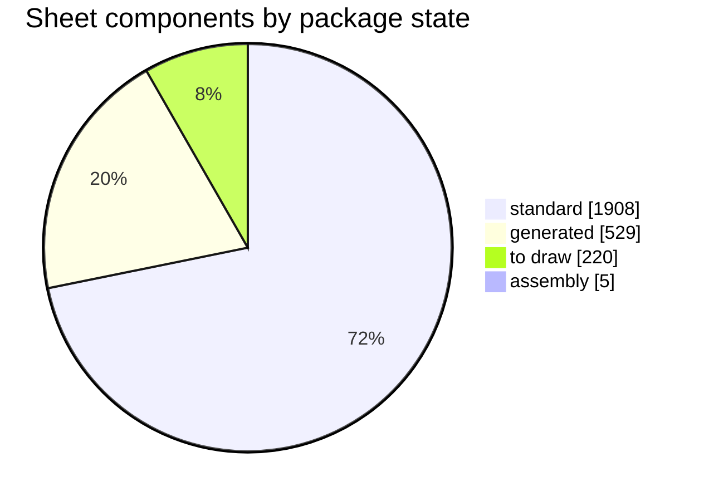
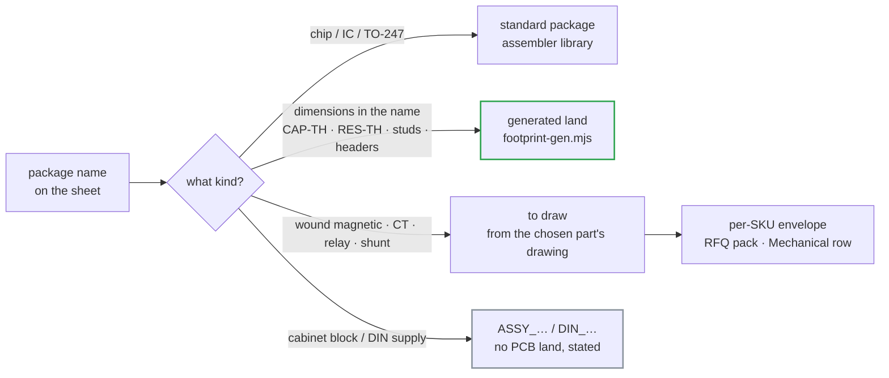

# ✏️ Footprints to Draw

The land-pattern queue for the layout phase — what has a land, what must be drawn, what blocks entry

  
  
  
  

> [!NOTE]
> **Purpose** — the land-pattern queue for the layout phase. PCB layout has been out of scope since E36, so the
> release sheets name each part's **intended package**, not a placed library footprint. At **E64 the naming queue
> closed**: every one of the 2,662 sheet components states its package, and every part number matches its own
> drawn land. `node calculations/footprint-audit.mjs` holds both counts at **zero** — a part added without a
> package, or a value row that loses its land, fails the battery.

## At a glance

<table>
<tr><td valign="top" width="54%">

| Package state | Instances | Where the land comes from |
|---|---:|---|
| standard package | **1,908** | the assembler's library — chip passives, SOIC / SOT / SMx, TO-247, LQFP |
| generated land | 529 | `footprint-gen.mjs`, from the dimensions encoded in the name |
| to draw | 220 | the maker's or winder's drawing — 23 names, listed below |
| assembly (no PCB land) | 5 | cabinet blocks and the DIN-rail supply — stated, not blank |
| **no package named** | **0** | queue closed at E64 · audit ratchet at zero |
| **MPN package ≠ land** | **0** | land-aware value resolution (E64) · ratchet at zero |

</td><td valign="top" width="46%">

</td></tr>
</table>

> [!IMPORTANT]
> **What closed the queue (E64).**
> 1. Every class added at E55–E60 received its package in `footprint-map.mjs` — chip classes carry the size their
>    code names, wound parts and relays point at their family placeholder, cabinet blocks say `ASSY_…`.
> 2. **The value map became land-aware**: `lcscForPart(family, value, pkg)` consults a `family|value|package` row
>    first, so the part number always matches the drawn land. The 344 old conflicts resolved by picking the
>    same-series part in the drawn size; their C-numbers are **to be read back, never invented** — see the
>    [read-back queue](lcsc-status.md#read-back-queue--named-candidates-without-a-c-number).
> 3. Three lands joined the generated set: the X1 4.7 µF box (`CAP-TH_L31.5-W17.0-P27.50`, class-typical body —
>    confirm at part choice), the 40-way Micro-Fit, and the 88-way dual-row card header.
> 4. The per-SKU envelope folders (`kicad5/footprints/<sku>/`) still date from the 30 / 60 / 120 kW era —
>    regenerate from the RFQ pack at layout entry (unchanged, tracked).

## How a land gets its geometry

A land is generated only where its geometry is fully determined — `CAP-TH_L26.5-W11.0-P22.50` carries body
length, width and lead pitch, so two pads on the pitch follow. Wound magnetics, current transformers, relays and
the shunt have no standard land; guessing one would be fabricated manufacturing data.

## To draw — 23 package names, 220 instances

| Package name | Instances | Parts | Draw from |
|---|---:|---|---|
| `PWRM-TH_QA01C` | 40 | `QA01C` · `QA01C-18` | Mornsun catalogue land (C2757491 family) |
| `SIP-4_iso-module` | 24 | `ISO5V-RFC-6K` | chosen reinforced module's datasheet (part is `REVIEW`) |
| `RELAY_HFE82V_PCB` | 18 | `HFE82V-<rating>W/1000-24-HA-C5-1` | Hongfa drawing per rating |
| `L_Toroid_sendust_per-SKU` | 12 | `DM-CHOKE-30 / 40 / 50` | D6 rev C pack sheets |
| `L_Toroid_3xT79_26u_custom` | 12 | `IND-PFC-165u` · `-116u-40` · `-107u-50` | D1 pack sheets (40 / 50 kW are 5 × T79) |
| `XFMR_3xPQ50-50_custom` | 12 | `XFMR-LLC-10K` · `-2E70-40` · `-2E70-50` | D3 pack sheets (40 / 50 kW are 2 × E70) |
| `CT_window_res_1-100` | 12 | `AS-404` · `CT-RES-1:100-80A / -100A` | Talema drawings |
| `L_Toroid_trim_bin_custom` | 12 | `IND-TRIM-BIN4` · `-E70-40` · `-E70-50` | D2 pack sheets (40 / 50 kW are E70, not toroids) |
| `FUSE_holder_22x58` | 9 | `FUSE-gG-690V-80A` · `-160A` | holder maker drawing — **160 A is NH00**, confirm split |
| `CT_window_150A_1-2500` | 9 | `CT-LINE-2500-150A` | Talema ACX-1150 drawing (38.1 mm body) |
| `L_CMC_3ph_nanocryst_per-SKU` | 8 | `CMC-3PH-2mH-SKU` | Schaffner RT8131 / custom D7 drawing |
| `RELAY_HFE82V-20_PCB` | 8 | `HFE82V-20W/1000…` (pre-insertion) | Hongfa drawing, frame to confirm |
| `KEY-SMD_4P-L6.0-W6.0` | 8 | `TACT-6x6` | chosen switch series (4-pad land varies by series) |
| `IND-SMD_L6.0-W6.0` | 5 | `CYA0630-10UH` | maker drawing |
| `XFMR_ETD39_custom` | 4 | `XFMR-AUX-FLY-D` | D4 rev D sheet, bobbin pin pattern |
| `RELAY_HF167F_PCB` | 4 | `HF167F/024-HATF(764)` | Hongfa mirror-contact variant (catalogue land lacks pins 5/6/8) |
| `IND-SMD_L4.5-W3.2_CMC` | 4 | `ACT45B-510-2P-TL003` | TDK drawing |
| `LED-SEG-TH_2DIG-0.56` | 4 | `LED-2DIG-0.56CC` | chosen display (pin map unvalidated — `REVIEW`) |
| `SHUNT_4-terminal_manganin` | 4 | `SHUNT-50MV-100A / 133A / 167A` | shunt maker drawing, Kelvin taps |
| `RELAY_contactor_250A_stud` | 4 | `HF167F-250A-M` | chosen contactor family (part is `REVIEW`) |
| `FUSE_holder_NH00` | 3 | `FUSE-gG-690V-125A` | NH00 base drawing |
| `SKT-TH_88P-2R-P2.54-V` | 1 | `CONN-CARD-88-R` | chosen receptacle series (mates the generated header) |
| `CT_window_100A_1-2500` | 3 | `ACX-1100` | Talema drawing (30 kW line CT) |

## Generated lands — 21 in use, 529 instances

<b>Show the generated lands</b>

| Land | Instances | Parts |
|---|---:|---|
| `CAP-TH_L30.0-W30.0-P10.00` | 106 | `ELH-470u450` |
| `CAP-TH_L31.5-W13.0-P27.50` | 98 | `PP-1u-1100` · `PP-27n-1200V` · `PP-33n-1200V` · `PP-46n-1200` |
| `TERM_Stud_M8` | 54 | `STUD-M8` |
| `RES-TH_L48.0-W8.0-P54.00` | 44 | `CER-2k2-10W-AX` · `WW-470R-10W` |
| `CAP-TH_L26.5-W11.0-P22.50` | 36 | `PP-1u-600` · `X1-2u2-530` |
| `CAP-TH_L11.0-W5.0-P10.00` | 24 | `VY1472M63Y5UQ63V0` |
| `DISC-20mm_RM10` | 24 | `B72220S0551K101` |
| `CONN-TH_2P-P2.00_PH` | 20 | `B2B-PH-K-S` |
| `RES-TH_L60.0-W9.0-P66.00` | 20 | `CER-25W-160R-AX` · `CER-25W-33R-AX` · `SQP-10R-25W` |
| `CONN-TH_4P-P2.00_PH` | 13 | `B4B-PH-K-S` |
| `CAP-TH_L31.5-W17.0-P27.50` | 12 | `X1-4u7-530` — **new at E64**, class-typical body |
| `CAP-TH_L8.0-W8.0-P3.50` | 12 | `GR227M035F12RR0VL4FP0` |
| `GDT-8mm_RM6` | 12 | `GDT-3k5-20kA` |
| `CAP-TH_L7.2-W3.5-P5.00` | 12 | `FILM-100n-250` |
| `RES-TH_L75.0-W12.0-P82.00` | 12 | `CER-50W-160R-AX` · `CER-50W-33R-AX` |
| `CONN-TH_40P-P3.00_MicroFit` | 8 | `MICROFIT3-40` — **new at E64** |
| `CAP-TH_L41.5-W20.0-P37.50` | 8 | `PP-4u7-1200` |
| `HDR-TH_88P-2R-P2.54-V-M` | 5 | `CONN-CARD-88-H` — **new at E64**, dual-row keyed |
| `CAP-TH_L18.0-W5.0-P15.00` | 4 | `PP-10n-1200` |
| `TERM_Tab_M4` | 4 | `TAB-M4` |
| `HDR-TH_5P-P2.54-V-M` | 1 | `PZ254V-11-05P` |

The one assumed number in each generated land is the lead diameter (0.6 / 0.8 mm film, 1.0 mm axial power
resistors), stated per family in `footprint-gen.mjs` — correct it there if a datasheet disagrees.

## Assembly items — stated, not blank

| Marker | Instances | What it is |
|---|---:|---|
| `ASSY_MODULE_INTERFACE` | 3 | the 50 kW modules on the cabinet sheet — a module, not a PCB part |
| `ASSY_CARD_SLOT` | 1 | the control card in the CSU strap role |
| `DIN_RAIL_MOUNT_ASSY` | 1 | Mean Well WDR-60-15 cabinet supply |

<b>Record — why lands are never borrowed to pass a check</b>

The pre-E56 EasyEDA import raised a fatal DRC error for every component without a footprint. Its stock library
held names that would have cleared the error — `RES-TH_12R_2W`, `CAP-TH_BD25.4-P10.00-D2.3-FD` — but they would
have put a 2 W axial land under a 25 W wirewound and a 25.4 mm can under a 30 mm snap-in. Each part was listed with
its real package instead. The same rule closed this queue: a package is *named* everywhere, and *drawn* only where
its geometry is real — placeholders stay placeholders until the chosen part's drawing exists.

---

<a href="benchmark-infypower-teardown.md">← InfyPower Teardown Benchmark</a> &nbsp;·&nbsp; <a href="README.md">🧭 Documentation hub</a> &nbsp;·&nbsp; <a href="pcb-floorplan.md">PCB Floorplan Basis →</a>

Vectivolt DC-Modules · documentation rev E61 · every number reproduces with <code>sh calculations/run-all.sh</code>

