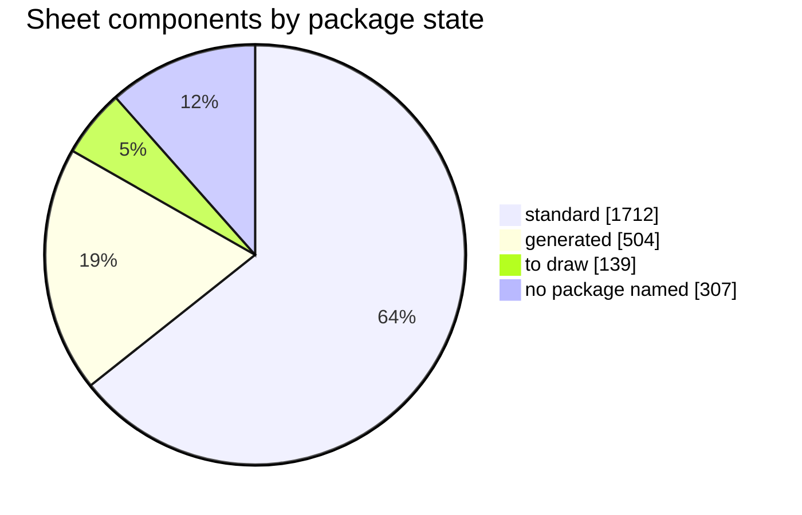
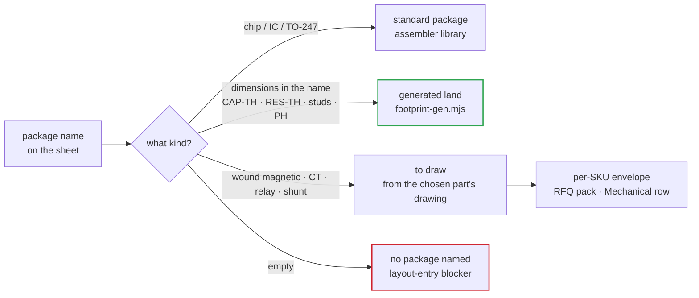

# ✏️ Footprints to Draw

The land-pattern queue for the layout phase — what has a land, what must be drawn, what blocks entry

  
  
  
  

> [!NOTE]
> **Purpose** — the land-pattern queue for the layout phase. PCB layout has been out of scope since E36, so the
> release sheets name each part's **intended package**, not a placed library footprint. This page says which of
> those packages already have a land, which must be drawn, and what has to be settled before layout starts.
> Every count comes from `node calculations/footprint-audit.mjs`, which reads the shipped sheets and fails if
> the queue grows.

## At a glance

<table>
<tr><td valign="top" width="54%">

| Package state | Instances | Where the land comes from |
|---|---:|---|
| standard package | **1,712** | the assembler's library — chip passives, SOIC / SOT / SMx, TO-247, LQFP |
| generated land | 504 | `footprint-gen.mjs`, from the dimensions encoded in the name |
| to draw | 139 | the maker's or winder's drawing — 17 names |
| **no package named** | **307** | nothing yet — 33 MPNs added after the map was last extended |
| **All sheet components** | **2,662** | |

</td><td valign="top" width="46%">

</td></tr>
</table>

> [!IMPORTANT]
> **Three things block layout entry, found by the E61 audit:**
> 1. **307 components name no package** — the classes added at E55–E60 were never given a footprint entry.
> 2. **344 components carry an MPN whose package differs from the land drawn for them** — the value rows pick a
>    part by family and value, not by land.
> 3. **The approximate envelopes in `kicad5/footprints/<sku>/` were generated for the retired 30 / 60 / 120 kW
>    set** (D6 rev B, D4 rev C ETD34, 200–400 A HFE82V frames) and do not describe today's magnetics.

## How a land gets its geometry

A land is generated only where its geometry is fully determined — `CAP-TH_L26.5-W11.0-P22.50` carries body
length, width and lead pitch, so two pads on the pitch follow. Wound magnetics, current transformers, relays and
the shunt have no standard land; guessing one would be fabricated manufacturing data.

## 1. To draw — 17 package names, 139 instances

| Package name | Instances | Parts | Draw from | Note |
|---|---:|---|---|---|
| `SIP-4_iso-module` | 24 | `ISO5V-RFC-6K` | module datasheet | part itself is `REVIEW` (reinforced ≥ 6 kV) |
| `RELAY_HFE82V_PCB` | 18 | `HFE82V-<rating>W/1000-24-HA-C5-1` | Hongfa drawing per rating | frame can change with the rating |
| `L_Toroid_3xT79_26u_custom` | 12 | `IND-PFC-165u` · `IND-PFC-116u-40` · `IND-PFC-107u-50` | [D1 pack sheets](magnetics-manufacturing-pack.md) | the name says 3 × T79; the 40 and 50 kW stacks are 5 × T79 |
| `XFMR_3xPQ50-50_custom` | 12 | `XFMR-LLC-10K` · `XFMR-LLC-2E70-40` · `XFMR-LLC-2E70-50` | D3 pack sheets | the name says 3 × PQ50; the 40 and 50 kW parts are 2 × E70 |
| `L_Toroid_trim_bin_custom` | 12 | `IND-TRIM-BIN4` · `IND-TRIM-E70-40` · `IND-TRIM-E70-50` | D2 pack sheets | 30 kW is PQ50 ferrite, 40 and 50 kW are E70 — not toroids |
| `FUSE_holder_22x58` | 9 | `FUSE-gG-690V-80A` · `FUSE-gG-690V-160A` | holder maker drawing | **160 A is an NH00 part** — 22 × 58 ends at 125 A |
| `L_CMC_3ph_nanocryst_per-SKU` | 8 | `CMC-3PH-2mH-SKU` | Schaffner RT8131 / custom D7 drawing | per-SKU current class |
| `KEY-SMD_4P-L6.0-W6.0` | 8 | `TACT-6x6` | chosen switch series | a 4-pad tactile land varies by series |
| `IND-SMD_L6.0-W6.0` | 5 | `CYA0630-10UH` | maker drawing | |
| `XFMR_ETD39_custom` | 4 | `XFMR-AUX-FLY-D` | [D4 rev D sheet](aux-transformer-D4.md) | bobbin pin pattern |
| `PWRM-TH_QA01C` | 4 | `QA01C` | Mornsun drawing | the same land serves `QA01C-18` once named |
| `RELAY_HF167F_PCB` | 4 | `HF167F/024-HATF(764)` | Hongfa mirror-contact variant | the catalogue SPST-NO land lacks pins 5, 6 and 8 |
| `IND-SMD_L4.5-W3.2_CMC` | 4 | `ACT45B-510-2P-TL003` | TDK drawing | CAN common-mode choke |
| `LED-SEG-TH_2DIG-0.56` | 4 | `LED-2DIG-0.56CC` | chosen display | pin map not yet validated |
| `SHUNT_4-terminal_manganin` | 4 | `SHUNT-50MV-100A / 133A / 167A` | shunt maker drawing | Kelvin taps, per-SKU current |
| `RELAY_contactor_250A_stud` | 4 | `HF167F-250A-M` | chosen contactor | part is `REVIEW` — family not yet picked |
| `FUSE_holder_NH00` | 3 | `FUSE-gG-690V-125A` | NH00 base drawing | the map's own note puts 125 A in 22 × 58 — confirm the 40 kW holder |

## 2. No package named — 307 instances, 33 MPNs

Each class below was added after the footprint map was last extended. Most packages follow directly from the
class name; the rest need the chosen part.

| Group | Parts (instances) | Package the class already implies |
|---|---|---|
| Chip resistors | `R0603-10k` (64) · `R0805-2R2` (48) · `R2512-0R75-2W-1%` (6) · `R2512-1R2-1W-1%` (3) · `R2512-0R91-1W-1%` (3) · `RC1206FR-0713RL` (6) · `RC1206FR-0722RL` (3) · `RC1206FR-0718RL` (3) · `R2010-1k-0.75W-1%` (8) · `R0603-120R-1%` (2) · `R0603-3k32-1%` (1) · `R0603-0R` (1) | the size in the code — 0603 · 0805 · 1206 · 2010 · 2512 |
| Capacitors | `CC0603JRNPO9BN220` (24) · `CC0603JRNPO9BN470` (12) · `X1-4u7-530` (12) | 0603 for the blanks · the X1 box needs the chosen part's body and pitch |
| Modules and logic | `QA01C-18` (36) · `74HC02D` (8) · `BZT52C15` (4) | `PWRM-TH_QA01C` · SOIC-14 · SOD-123 |
| Current transformers | `CT-LINE-2500-150A` (9) · `CT-RES-1:100-100A` (6) · `CT-RES-1:100-80A` (3) · `ACX-1100` (3) · `AS-404` (3) | Talema drawings — the ACX-1150 body (38.1 mm) needs its own land |
| DM chokes | `DM-CHOKE-30` (3) · `DM-CHOKE-40` (3) · `DM-CHOKE-50` (6) | D6 rev C pack sheets — 2 × T48 · 2 × T57 · 3 × T57 |
| Relays | `HFE82V-20W/1000-24-HA-C5-1` (8) | Hongfa drawing once the frame is confirmed |
| Connectors | `MICROFIT3-40` (8) · `CONN-CARD-88-H` (5) · `CONN-CARD-88-R` (1) | Molex 43045-40xx dual row · 2 × 44 at 2.54 mm, keyed |
| Cabinet blocks | `PMP-50KW-MODULE` (3) · `CONTROL-CARD-CSU` (1) · `WDR-60-15` (1) | assemblies and a DIN-rail supply — no PCB land |

## 3. MPN package ≠ land — 344 instances, 10 pairs

| MPN (package) | Land on the sheet | Instances |
|---|---|---:|
| `CC0603KRX7R9BB104` (0603) | `C0805` | 168 |
| `CL21B105KBFNNNE` (0805) | `C0402` | 72 |
| `CC0603KRX7R9BB102` (0603) | `C0805` | 36 |
| `RC0603FR-07220RL` (0603) | `R0805` | 32 |
| `CC0603KRX7R9BB103` (0603) | `C0805` | 12 |
| `CC0603JRNPO9BN221` (0603) | `C0805` | 12 |
| `RC0805FR-071ML` (0805) | `R1206` | 8 |
| `CL21A106KAYNNNE` (0805) | `C0603` | 2 |
| `CL21B105KBFNNNE` (0805) | `C0603` | 1 |
| `CC0805KRX7R9BB222` (0805) | `C0603` | 1 |

> [!WARNING]
> The land comes from the built boards (the class map where no board is built), and the MPN from `LCSC_BY_VALUE`,
> which is keyed on family and value only. An 0805 part cannot be placed on an 0402 land, and an 0603 part on an 0805 land solders poorly. For each
> pair decide whether the land or the part changes — the voltage rating usually decides it — and read the new
> part's C-number back from the catalogue; a number is never recalled from memory.

## 4. Generated lands — 18 in use, 504 instances

<b>Show the generated lands</b>

| Land | Instances | Parts |
|---|---:|---|
| `CAP-TH_L30.0-W30.0-P10.00` | 106 | `ELH-470u450` |
| `CAP-TH_L31.5-W13.0-P27.50` | 98 | `PP-1u-1100` · `PP-27n-1200V` · `PP-33n-1200V` · `PP-46n-1200` |
| `TERM_Stud_M8` | 54 | `STUD-M8` |
| `RES-TH_L48.0-W8.0-P54.00` | 44 | `CER-2k2-10W-AX` · `WW-470R-10W` |
| `CAP-TH_L26.5-W11.0-P22.50` | 36 | `PP-1u-600` · `X1-2u2-530` |
| `CAP-TH_L11.0-W5.0-P10.00` | 24 | `VY1472M63Y5UQ63V0` |
| `DISC-20mm_RM10` | 24 | `B72220S0551K101` |
| `CONN-TH_2P-P2.00_PH` | 20 | `B2B-PH-K-S` |
| `RES-TH_L60.0-W9.0-P66.00` | 20 | `CER-25W-160R-AX` · `CER-25W-33R-AX` · `SQP-10R-25W` |
| `CONN-TH_4P-P2.00_PH` | 13 | `B4B-PH-K-S` |
| `CAP-TH_L8.0-W8.0-P3.50` | 12 | `GR227M035F12RR0VL4FP0` |
| `GDT-8mm_RM6` | 12 | `GDT-3k5-20kA` |
| `CAP-TH_L7.2-W3.5-P5.00` | 12 | `FILM-100n-250` |
| `RES-TH_L75.0-W12.0-P82.00` | 12 | `CER-50W-160R-AX` · `CER-50W-33R-AX` |
| `CAP-TH_L41.5-W20.0-P37.50` | 8 | `PP-4u7-1200` |
| `CAP-TH_L18.0-W5.0-P15.00` | 4 | `PP-10n-1200` |
| `TERM_Tab_M4` | 4 | `TAB-M4` |
| `HDR-TH_5P-P2.54-V-M` | 1 | `PZ254V-11-05P` |

The one assumed number in each generated land is the lead diameter (0.6 / 0.8 mm film, 1.0 mm axial power
resistors), stated per family in `footprint-gen.mjs` — correct it there if a datasheet disagrees.

<b>Record — why lands are never borrowed to pass a check</b>

The pre-E56 EasyEDA import raised a fatal DRC error for every component without a footprint. Its stock library
held names that would have cleared the error — `RES-TH_12R_2W`, `CAP-TH_BD25.4-P10.00-D2.3-FD` — but they would
have put a 2 W axial land under a 25 W wirewound and a 25.4 mm can under a 30 mm snap-in. Each part was listed with
its real package instead. The same rule governs this queue: an unnamed package stays visibly unnamed until the
part that defines it is chosen.

---

<a href="competitive-benchmark-e51.md">← Competitive Benchmark</a> &nbsp;·&nbsp; <a href="README.md">🧭 Documentation hub</a> &nbsp;·&nbsp; <a href="pcb-floorplan.md">PCB Floorplan Basis →</a>

Vectivolt DC-Modules · documentation rev E61 · every number reproduces with <code>sh calculations/run-all.sh</code>

