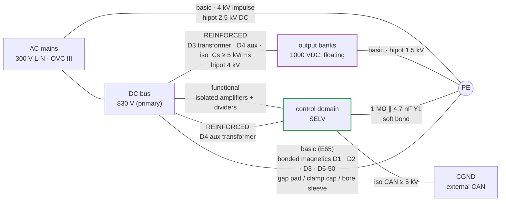

# 🧱 Insulation Coordination

The barrier map, creepage and clearance values, the standards matrix and the hipot plan

  
  
  

> [!NOTE]
> **Purpose** — the barrier map, creepage and clearance design values, the SELV architecture and the hipot plan.

## At a glance

| Rating | Value |
|---|---|
| Overvoltage category | **OVC III** at AC mains — 300 V line-to-neutral system (415 V line-to-line) |
| Pollution degree | **PD2** inside the enclosure (filtered forced air) |
| Altitude | **≤ 2000 m** (derate note above 2000 m in the manual) |
| Material group | **IIIa** (CTI ≥ 175), FR-4 baseline |
| Environment | A11 rev C: −30…+75 °C operating, 5–95 % RH non-condensing; insulation materials quoted to −40 °C |
| Basis standards | IEC 60664-1 (coordination) · IEC 62477-1 (PECS safety — decides most clearances) · IEC/IS 61851-23 (DC EVSE system) · IEC 61000-4-x (immunity) · CISPR 32 / EN 55032-class conducted (pre-compliance) |

> [!CAUTION]
> **No compliance is claimed.** This is the design-to table; every value is to be verified against the purchased
> editions of the standards at design qualification, and the checklist at the end tracks what is still open.

## 1. The barrier map

## 2. System insulation classes

| Barrier | Class | Working V | Impulse / test |
|---|---|---|---|
| AC line ↔ PE | basic | 300 Vrms | 4 kV imp; hipot 2.5 kV DC 1 min (EOL) |
| AC/primary ↔ secondary (output) | **REINFORCED** | 1000 VDC working (output) vs primary 830 VDC | 8 kV-class imp path via transformer: D3 TIW + margins, hipot 4 kV; iso components ≥5 kVrms parts (NSI66xx/NSI1042-DSWR/NSI1200, MORNSUN modules → **E60: Mornsun carries a US OFAC flag — qualify MEAN WELL / RECOM / CUI-class reinforced modules**) |
| Output ↔ PE | basic (IT-side per 61851-23 system: IMD at charger level, excluded scope §1) | 1000 VDC | hipot 1.5 kV; creepage per 62477-1 D2 table |
| Bus (830 V) ↔ control (primary-referenced) | functional | 830 V | spacing per functional table; HV dividers = 8× series 1206 (per-resistor ≤104 V working, 200 V rated) |
| Board-to-board studs | same domain (bus) | 830 V | stud-stud spacing ≥14 mm |
| **E65** D1 PFC choke winding ↔ PE-bonded web / plate / M6 bolt (gap pad, insulating clamp cap, bore sleeve) | basic (in series with AC line/bus ↔ PE) | D1 Û_rp ≤ 540 V recurring peak (switch end vs neutral, 50 kHz ripple) | 4 kV impulse type test on the bonded assembly · 100 % part hipot 2.5 kV DC 1 min winding ↔ bond-face + bore electrodes · no PD test (Û_rp ≤ 700 V) |
| ~~**E65** D6-50 DM choke winding ↔ web / plate (gap pad)~~ — **retired E68** (no AC-side DM choke) | basic (AC line ↔ PE) | D6-50 Û_rp ≤ 410 V (line peak at the 500 VAC edge) | as D1 |
| **E65** D2 trim and D3 primary winding ↔ gap-padded ferrite core (core treated as PE) | basic (bus ↔ PE) | D2/D3 Û_rp 1140 / 1240 / 1350 / 1350 V at 77–190 kHz (30 / 40 / 50 / 50a) | 100 % winding ↔ core hipot at the drawing level (≥ 2.5 kV DC 1 min class) · PD sample test 5/lot: PD extinction ≥ 1.8 / 1.9 / 2.1 / 2.1 kV, ≤ 10 pC |
| **E67** D2 external Lr and D3 cell primary winding ↔ gap-padded ferrite core (core treated as PE) — supersedes the E65 row | basic (bus ↔ PE) | D2/D3 Û_rp 1270 / 1260 / 1280 / 1280 V at 83–203 kHz (30 / 40 / 50 / 50a; full-bridge tank node = bus/2 + Cr peak + Vienna midpoint) | 100 % winding ↔ bonded-face foil 2.5 kV DC · PD sample test 5/lot: PD extinction ≥ 2.0 / 1.9 / 2.0 / 2.0 kV, ≤ 10 pC |
| **E67** D3 cell secondary and D8 bank inductor winding ↔ PE-bonded web / plate (gap pad) | basic (output ↔ PE) | ≤ 1000 V DC (top of the HIGH-mode stack), ripple < 10 V | 100 % part hipot 2.5 kV DC (D8, D6 construction) / 1.5 kV DC (D3 secondary) · module output ↔ PE 1.5 kV · DC stress: no recurring-peak PD row |

## 3. Creepage and clearance design values (PD2, mat IIIa — from 62477-1-class tables, VERIFY at DQ)

| V working | Clearance | Creepage used |
|---|---|---|
| 300 Vrms AC (line-line/PE, basic) | 3.0 mm | 4.0 mm |
| 830 VDC bus (functional) | 4.0 mm | 5.5 mm (slot under TO-247 rows where <5.5) |
| 1000 VDC output (basic to PE) | 4.5 mm | 6.3 mm |
| Reinforced pri↔sec (board area under transformer/iso parts) | 8.0 mm | 12.6 mm + routed slots under iso ICs |
| **E65** D1 winding ↔ bolt, washer, web edge (switch end rides the bus node) | 4.0 mm | 5.5 mm — clamp cap and sleeve set it, not the layout |
| **E65** D6-50 winding ↔ web / plate hardware | 3.0 mm | 4.0 mm |
| **E65 / E67** D2 / D3 winding ↔ core over the former flanges (B66372B2000 and the E67 3-set cell former) | 4.0 mm | 8.0 mm, or VPI-cemented joints qualified as solid insulation by the PD sample test — VERIFY at DQ (> 30 kHz: IEC 60664-4) |

Layout rules bank (for the later PCB phase): slots under every iso component; guard the S/P relay
area (banks float — both banks treated at 1000 V class to PE); Y-caps only across defined barriers
(3 line-PE + 2 output-PE — **Y1 440 VAC class since rev C/MR-4**; "Y2" in older text is historic);
no SELV track inside HV zones; CAN connector domain (CGND) floats — 4 mm to everything, with the
rev-D 1 MΩ ∥ 4.7 nF static bleed to DGND.

## 4. §47 design-for-compliance checklist (excerpt, full tracking in the [verification matrix](verification-matrix.md))

- [x] Insulation coordination table (this doc) — VERIFY table values against purchased standard editions
- [x] Protective separation of external CAN (iso 5 kV part + floating CGND + TVS)
- [x] Touch-discharge (restated honestly, R2 HR-15): **bus** <60 V in ≈2.0/3.6/7.2 s per SKU → **E60 per-SKU deck: 2.0 / 2.4 / 3.2 s at 30 / 40 / 50 kW** (640 Ω active, F.21 per-SKU supervision now implemented); **banks** <60 V in ≈8–34 s → **9 / 13.5 / 18 s** via the E33 commanded bleeders (F.21b) — previously the banks had no active discharge at all and held ≤525 V for 3–14 min; passive balance chains remain the backup. Tool-access marking per 62477 still applies for the passive-only failure case
- [x] Single-fault: aux collapse → gates held low (T-09); relay weld detected (F.18); fan fail derate
- [ ] Leakage current budget through Y network (calc pending with final Y values, EMI rev)
- [ ] 61851-23 system items delegated to charger integrator documented in manual (IMD, output contactors, gun lock)
- [ ] EMC immunity plan (surge 61000-4-5 on MOV/fuse network — §27 energy calc at EMI rev)
- [ ] **E65** bonded magnetics: gap-pad dielectric type test at compressed thickness · D2/D3 PD sample test · per-core common-mode capacitance counted in the LISN budget
- [ ] **E67** D3 cells: 100 % pri ↔ sec 4.25 kV DC per cell (two per module) · PD type test per cell former (2-set and 3-set) · D8 bonded at output potential

---

## Record — rev C deltas (2026-09-05, E25)

- The three output-domain resistive divider chains (review CB-3) are **gone** — bank/output
  voltages are sensed inside their own domains by isolated amplifiers. The pri↔sec barrier is
  again purely magnetic/opto/iso-amp: hipot no longer sees a 3.8 MΩ resistive path.
- The **aux transformer (D4 rev B) barrier is now safety-load-bearing** for the SELV control
  domain (primary at bus potential): reinforced, 100 % hipot 4 kV in production (not sampled).
- Iso voltage-sense amps and their 5 V bias modules must be reinforced-rated for their domain's
  working voltage (1000 V output domain / 830 V bus / AC mains star) — **rev D (R2 HR-16): the
  BOM now specifies reinforced-class modules (ISO5V-RFC-6K, ≥5 kVrms test) at every Bias5/PSCAN/
  PSSH position; the previously-priced B1505S (1.5 kVDC functional, no cert) could never have
  passed this row.** Certificate class per part = §K gate; same audit applies to the QA01C
  gate-bias and PSQD positions (their barriers parallel the NSI6611's reinforced one).
- Mirror contacts (E30) are separated from main contacts per the relay's internal construction —
  basic isolation minimum at 1000 VDC; VERIFY in the relay datasheet at RFQ (§K).
- Control domain to PE: 1 MΩ ∥ 4.7 nF Y1 soft bond (no hard earth loop; leakage < 1 mA budget).

---

## Record — E65 bonded magnetics (2026-09-13)

A magnetic that is gap-padded or clamped to PE-bonded metal is part of the **basic** barrier to PE. The E60 drawings classed
D1 as functional (500 VAC winding–core, "core floats on mount", no hipot) and D2 winding–core as functional, while E42/E65 bond
D1-50, every D2/D3 and D6-50 to the PE-bonded webs and coldplates. The module EOL hipot (2.5 kV DC line ↔ PE) stressed
those paths at 3.5× the part level, and no solid insulation on them was specified.

- **Recurring peaks are computed, not assumed** — `stress-audit.mjs` [INS] reads `vienna-switched.csv` (D1 switch end vs grid
  neutral, recurring cases) and every `llc-stress.csv` corner (D2/D3: bus/2 + resonant-cap peak + the Vienna midpoint-to-neutral
  peak, ideal switches, CM filter not credited), and fails if the rows above stop matching.
- **D1 build-up** (the pad touches the winding, not the core): fiberglass-reinforced silicone gap pad 1.0 mm, ≥ 3 W/mK, ≥ 5 kVAC
  (ASTM D149), qualified at its 0.8 mm compressed thickness for 2.5 kV DC 1 min and 4 kV impulse, RTI ≥ 150 °C, UL 94 V-0; a
  GF-PPS clamp cap (≥ 4.0 mm clearance / 5.5 mm creepage winding ↔ bolt head and washer) and a bore sleeve (≥ 1.0 mm wall) on
  the M6 bolt. The 0.13 mm wrap and enamel stay functional. The D1 winding does not reach 700 V recurring, so no PD test.
- **D2/D3**: the core is conductive and touches the pad, so the winding ↔ core insulation (former, tapes, VPI) is the basic
  barrier; the pads are specified for heat and low dissipation factor, not credited as insulation. Û_rp > 700 V at 77–190 kHz
  puts a PD sample test on every lot.
- **D6-50**: foil winding on the pad at AC-line potential — the D1 pad spec, no PD.
- **Open** (not insulation-coordination's to close): the pad's common-mode capacitance on the D2/D3 tank node (~50–70 pF per
  core) in the LISN budget, and the D1/D6 keep-outs to earthed metal in the layout.

## Record — E67 full-bridge magnetics (2026-09-13)

- The single full-bridge LLC puts the Cr/Lr node at bus/2 ± the resonant-cap peak about the bus midpoint, the same basis as the
  E65 sections, so the recurring-peak method stands. The recomputed peaks are **1270 / 1260 / 1280 / 1280 V** (E68: the 30 kW single-die
  bridge adds 10 V), so the PD sample row moves to extinction ≥ **2.0 / 1.9 / 2.0 / 2.0 kV**. The gate is `stress-audit.mjs` [INS].
- The reinforced pri ↔ sec barrier is built as in the E65 transformer (TIW primary + ≥ 3 barrier-tape layers each side of the
  shields), now in two cells per module. The 3-set former used by the 40 and 50 kW cells is new tooling, so its flange creepage
  is a first-article check.
- D8 is the D6 part at output potential. Its winding ↔ web gap pad joins the output ↔ PE basic barrier (1000 V DC), tested
  with the D6 part hipot (2.5 kV DC), which exceeds the 1.5 kV module test.

---

<a href="thermal-report.md">← Thermal Report</a> &nbsp;·&nbsp; <a href="README.md">🧭 Documentation hub</a> &nbsp;·&nbsp; <a href="busbar-drawings.md">Busbar Drawings & Joint Spec →</a>

Vectivolt DC-Modules · documentation rev E61 · every number reproduces with <code>sh calculations/run-all.sh</code>

