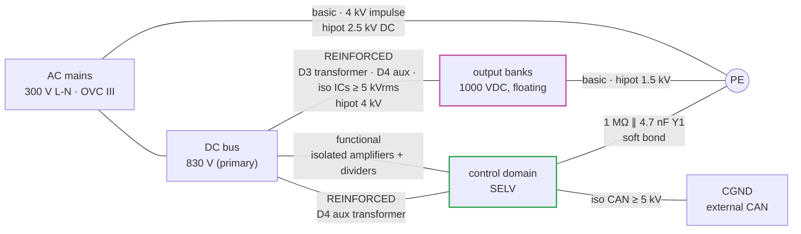

# 🧱 Insulation Coordination

The barrier map, creepage and clearance values, the standards matrix and the hipot plan

  
  
  

> [!NOTE]
> **Purpose** — the barrier map, creepage and clearance design values, the SELV architecture and the hipot plan.

## At a glance

| Rating | Value |
|---|---|
| Overvoltage category | **OVC III** at AC mains — 300 V line-to-neutral system (415 V line-to-line) |
| Pollution degree | **PD2** inside the enclosure (filtered forced air) |
| Altitude | **≤ 2000 m** (derate note above 2000 m in the manual) |
| Material group | **IIIa** (CTI ≥ 175), FR-4 baseline |
| Environment | A11 rev C: −30…+75 °C operating, 5–95 % RH non-condensing; insulation materials quoted to −40 °C |
| Basis standards | IEC 60664-1 (coordination) · IEC 62477-1 (PECS safety — decides most clearances) · IEC/IS 61851-23 (DC EVSE system) · IEC 61000-4-x (immunity) · CISPR 32 / EN 55032-class conducted (pre-compliance) |

> [!CAUTION]
> **No compliance is claimed.** This is the design-to table; every value is to be verified against the purchased
> editions of the standards at design qualification, and the checklist at the end tracks what is still open.

## 1. The barrier map

## 2. System insulation classes

| Barrier | Class | Working V | Impulse / test |
|---|---|---|---|
| AC line ↔ PE | basic | 300 Vrms | 4 kV imp; hipot 2.5 kV DC 1 min (EOL) |
| AC/primary ↔ secondary (output) | **REINFORCED** | 1000 VDC working (output) vs primary 830 VDC | 8 kV-class imp path via transformer: D3 TIW + margins, hipot 4 kV; iso components ≥5 kVrms parts (NSI66xx/NSI1042-DSWR/NSI1200, MORNSUN modules → **E60: Mornsun carries a US OFAC flag — qualify MEAN WELL / RECOM / CUI-class reinforced modules**) |
| Output ↔ PE | basic (IT-side per 61851-23 system: IMD at charger level, excluded scope §1) | 1000 VDC | hipot 1.5 kV; creepage per 62477-1 D2 table |
| Bus (830 V) ↔ control (primary-referenced) | functional | 830 V | spacing per functional table; HV dividers = 8× series 1206 (per-resistor ≤104 V working, 200 V rated) |
| Board-to-board studs | same domain (bus) | 830 V | stud-stud spacing ≥14 mm |

## 3. Creepage and clearance design values (PD2, mat IIIa — from 62477-1-class tables, VERIFY at DQ)

| V working | Clearance | Creepage used |
|---|---|---|
| 300 Vrms AC (line-line/PE, basic) | 3.0 mm | 4.0 mm |
| 830 VDC bus (functional) | 4.0 mm | 5.5 mm (slot under TO-247 rows where <5.5) |
| 1000 VDC output (basic to PE) | 4.5 mm | 6.3 mm |
| Reinforced pri↔sec (board area under transformer/iso parts) | 8.0 mm | 12.6 mm + routed slots under iso ICs |

Layout rules bank (for the later PCB phase): slots under every iso component; guard the S/P relay
area (banks float — both banks treated at 1000 V class to PE); Y-caps only across defined barriers
(3 line-PE + 2 output-PE — **Y1 440 VAC class since rev C/MR-4**; "Y2" in older text is historic);
no SELV track inside HV zones; CAN connector domain (CGND) floats — 4 mm to everything, with the
rev-D 1 MΩ ∥ 4.7 nF static bleed to DGND.

## 4. §47 design-for-compliance checklist (excerpt, full tracking in the [verification matrix](verification-matrix.md))

- [x] Insulation coordination table (this doc) — VERIFY table values against purchased standard editions
- [x] Protective separation of external CAN (iso 5 kV part + floating CGND + TVS)
- [x] Touch-discharge (restated honestly, R2 HR-15): **bus** <60 V in ≈2.0/3.6/7.2 s per SKU → **E60 per-SKU deck: 2.0 / 2.4 / 3.2 s at 30 / 40 / 50 kW** (640 Ω active, F.21 per-SKU supervision now implemented); **banks** <60 V in ≈8–34 s → **9 / 13.5 / 18 s** via the E33 commanded bleeders (F.21b) — previously the banks had no active discharge at all and held ≤525 V for 3–14 min; passive balance chains remain the backup. Tool-access marking per 62477 still applies for the passive-only failure case
- [x] Single-fault: aux collapse → gates held low (T-09); relay weld detected (F.18); fan fail derate
- [ ] Leakage current budget through Y network (calc pending with final Y values, EMI rev)
- [ ] 61851-23 system items delegated to charger integrator documented in manual (IMD, output contactors, gun lock)
- [ ] EMC immunity plan (surge 61000-4-5 on MOV/fuse network — §27 energy calc at EMI rev)

---

## Record — rev C deltas (2026-09-05, E25)

- The three output-domain resistive divider chains (review CB-3) are **gone** — bank/output
  voltages are sensed inside their own domains by isolated amplifiers. The pri↔sec barrier is
  again purely magnetic/opto/iso-amp: hipot no longer sees a 3.8 MΩ resistive path.
- The **aux transformer (D4 rev B) barrier is now safety-load-bearing** for the SELV control
  domain (primary at bus potential): reinforced, 100 % hipot 4 kV in production (not sampled).
- Iso voltage-sense amps and their 5 V bias modules must be reinforced-rated for their domain's
  working voltage (1000 V output domain / 830 V bus / AC mains star) — **rev D (R2 HR-16): the
  BOM now specifies reinforced-class modules (ISO5V-RFC-6K, ≥5 kVrms test) at every Bias5/PSCAN/
  PSSH position; the previously-priced B1505S (1.5 kVDC functional, no cert) could never have
  passed this row.** Certificate class per part = §K gate; same audit applies to the QA01C
  gate-bias and PSQD positions (their barriers parallel the NSI6611's reinforced one).
- Mirror contacts (E30) are separated from main contacts per the relay's internal construction —
  basic isolation minimum at 1000 VDC; VERIFY in the relay datasheet at RFQ (§K).
- Control domain to PE: 1 MΩ ∥ 4.7 nF Y1 soft bond (no hard earth loop; leakage < 1 mA budget).

---

<a href="thermal-report.md">← Thermal Report</a> &nbsp;·&nbsp; <a href="README.md">🧭 Documentation hub</a> &nbsp;·&nbsp; <a href="busbar-drawings.md">Busbar Drawings & Joint Spec →</a>

Vectivolt DC-Modules · documentation rev E61 · every number reproduces with <code>sh calculations/run-all.sh</code>

