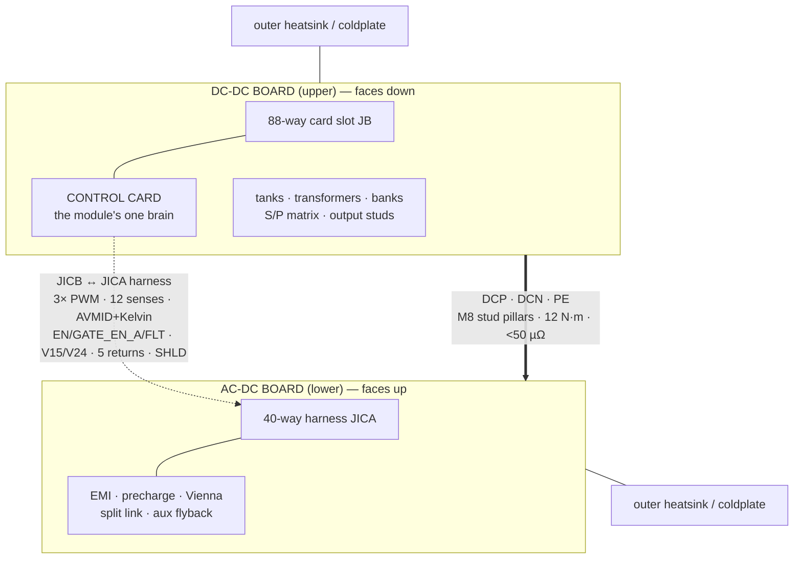

# Two-Board Sandwich & Interconnect — rev E49 (E17 directive · E40 single brain)

  

> **Purpose** — The physical module contract: two-board sandwich, stud pillars, the 40-way harness, grounding, HMI.
>
> **Gate coupling** — module-interconnect-audit walks every boundary of this contract each battery run.

Each module = **AC-DC board (lower)** + **DC-DC board (upper)**, component faces toward each
other, heatsink surfaces outward (power semiconductors clamp to the outer extrusions or the E42
coldplates; magnetics stand in the inter-board volume). One **control card** seats in the DC-DC
board's 88-way slot and runs the whole module.

## Board contents

| | AC-DC (lower) | DC-DC (upper) |
|---|---|---|
| Power | AC studs, per-SKU gG fuses, MOV Δ + GDT, 2-stage CM/DM EMI, precharge (2× 33 Ω + 2-pole bypass, E14 rev B), Vienna phases, split DC link + balance, bus discharge (640 Ω + QDISF) | film commutation caps, LLC legs (paralleled on the air-50), tanks + transformer sections, dual JBS banks, bank caps + bleeders, S/P matrix (+10 Ω pre-insertion, K_OUT — dual at 50 kW), two-stage 74HC02 exclusion, output filter/shunt/studs |
| Control-side | line CTs, AC/bus HV iso-senses, NTC ×2, fans (2/3/0/4 per SKU), aux flyback (bus-fed DCP→MID), local 3.3 V buck (R4-5), coil driver (KPRE, QDIS), 40-way harness header **JICA** | **88-way card slot (JB)**, resonant CTs, bank/output iso-senses, output shunt amp, NTC ×2, coil driver (6 relays) + exclusion gates, PV bleeder drive (QPVD, R8), isolated CAN (NSI1042-DSWR), local 3.3 V buck, HMI (2 buttons + 2-digit 7-seg), harness header **JICB** |

## Power interconnect (bolted, no connector)

3× M8 stud pairs, board-to-board pillars: **DCP, DCN, PE** (midpoint stays on the AC-DC board).
Belleville washers, torque 12 N·m, joint R < 50 µΩ each (EOL milliohm check). Creepage
stud-to-stud ≥ 14 mm ([`insulation-coordination.md`](insulation-coordination.md)).

## Signal harness — 40-way straight-through (JICA ↔ JICB, E40)

One brain in the DC-DC slot, so the harness carries the whole PFC bundle: 3× logic-level 50 kHz
PWM, 12 senses (CTs, VAC, bus, rails, temps), **AVMID with its Kelvin AGND adjacent**, fans
(third tach on W38 at 40 kW, fourth on W39 at the air-50), precharge/discharge drives +
feedback, `EN_PFC`, the `GATE_EN_A` chain, the merged `FLT` wired-OR, `DRV_RDY`, V15/V24,
**five dedicated returns**, and the shield (PE-bonded at the AC-DC end only — the JICA-pin-40
vs JICB-NC asymmetry is deliberate, R5-J).

The **50 kW liquid module uses the same harness p/n** with its fan ways unloaded: no fan
headers fitted, tach ways held defined-LOW by board-side 10 k terminators (RFDT1–3 — an
accidental read reports "stopped", the fail-safe direction), PWM ways MCU-driven-idle.
Commonality beats a shorter variant harness: one cable drawing, one tested p/n, every way
audited on all four SKUs.

Single source: `HARNESS40` in `packages/common-components/umod-map.gen.ts` (generated by
`calculations/control/umod-pinmap.mts`); every way is verified end-to-end by the
module-interconnect audit. Connector: Micro-Fit 3.0-class 2×20, 5 A/contact (`MICROFIT3-40`).
Default-OFF is board-side: pull-downs on both GATE_EN chains, EN lines, relay drives and the
three PWM lines at their receiving end. Loss of the harness (GATE_EN_A low, V15/V24 missing)
puts the AC-DC side gates off in hardware; the card's watchdog covers the brain itself
(WDO ≡ NRST, R5-A).

*(The pre-E40 two-card 16-way harness and its UART link are retired; the migration record is
[`single-card-migration-plan.md`](history/single-card-migration-plan.md), decision E40.)*

## Grounding (E25)

AGND–DGND single-point 0 Ω tie on the **card** (RAGTC — deleted from both power boards, a
second tie is the loop it prevents); DGND→PE 1 MΩ ∥ 4.7 nF on the AC-DC board. The control
domain is SELV; every HV measurement crosses on an isolated amplifier, so HMI, SWD, fans and
CAN are touch-safe by architecture. CAN is additionally isolated (CGND domain with static
bleed) for cabinet bus runs.

## Discharge control (E19 rev B / E47 semantics)

`CTL_QDIS` drives the opto LED active-high (330 Ω); the output stage rides a DCN-referenced
isolated module and the QDISF gate has a 10 k pulldown to DCN — MCU dead/reset/unprogrammed =
discharge OFF. Bank bleeders are PV-driven (VOM1271 via QPVD at the guaranteed 10 mA point,
R8). The discharge timeline is **two-phase** (active to the 321 V aux floor, then passive);
F.21's real coverage is the AC-present case — see
[`protection-thresholds.md`](protection-thresholds.md).

## HMI behavior (config spec)

2-digit display + SET/▲(SW1) & ▼/ENTER(SW2): short-press pages {module CAN address 00–63,
group id, fault code ring, fw version}; long-press SET = edit (blink), ▲/▼ change, ENTER save
to EEPROM (CRC'd). Display timeout 60 s. During faults the display shows the `F.xx` code.
Driven by the card: 74HC595 (segments, decoupled per R6-D) + 2 NPN digit mux + 2 GPIO buttons.

## Module interconnect audit (permanent gate)

`calculations/module-interconnect-audit.mts` (in run-all) walks the BUILT netlists of
acdc + dcdc + card per SKU across every physical boundary: DCP/DCN/PE studs, all 40 harness
ways pin-for-pin, every 88-way card way wired on the board AND landing on real electronics on
the card, and the RATING strap encoding the SKU (E24 rev G bands). Negative-tested (a board
swap produces 78 FAILs). The cabinet section walks the 120 kW sheet: CAN chain with exactly
two 120 Ω terminations, CSU strap band, PSU feed, per-module AC/DC landings, single-point
shield bond (E39).
