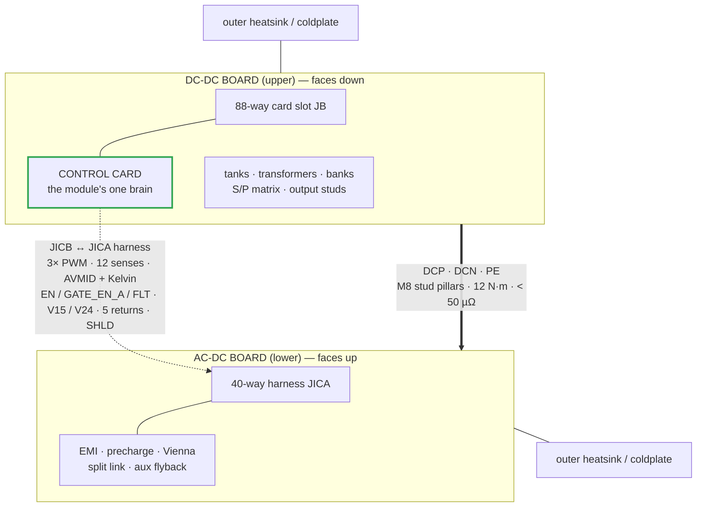
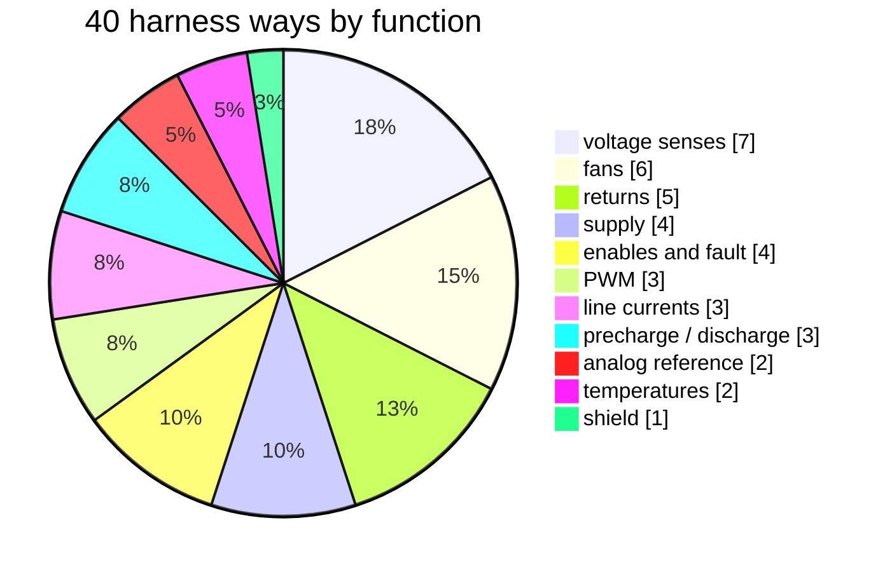
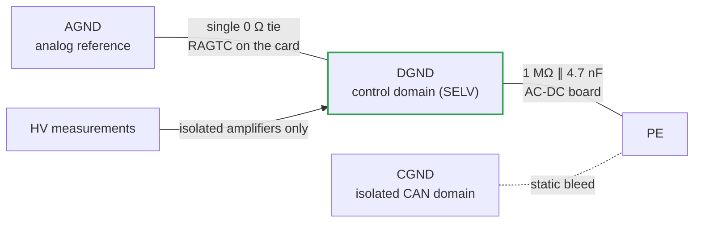
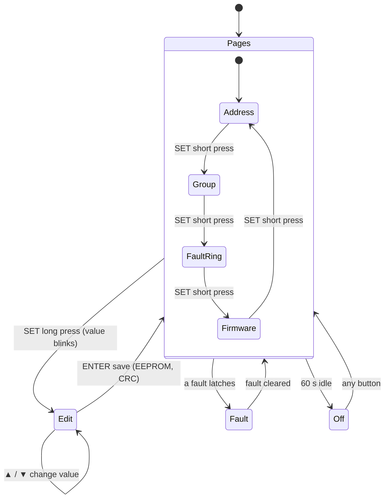

# 🔌 Two-Board Sandwich & Interconnect

Stud pillars, the 40-way harness, grounding, discharge control and the HMI contract

  
  
  
  

> [!NOTE]
> **Purpose** — the physical module contract: how the two boards stack, how power and control cross between
> them, how the domains are grounded, how discharge is commanded, and how the HMI behaves.
>
> **Gate coupling** — `module-interconnect-audit` walks every boundary of this contract in the built netlists on
> every battery run (negative-tested: a board swap produces 78 failures).

## At a glance

| Boundary | Contract | Verified by |
|---|---|---|
| **Power** | 3 × M8 stud pillars — DCP · DCN · PE — 12 N·m, < 50 µΩ per joint, ≥ 14 mm stud-to-stud creepage | EOL milliohm check · interconnect audit |
| **Control** | 40-way straight-through harness (Micro-Fit 3.0 class, 5 A per contact) | every way, pin for pin, on all four SKUs |
| **Brain** | one control card in the DC-DC board's 88-way slot | every card way wired and landing on real electronics |
| **Grounding** | AGND–DGND single-point tie on the card; DGND → PE 1 MΩ ∥ 4.7 nF on the AC-DC board | structural netlist walk |
| **Identity** | RATING strap encodes the SKU (E24 rev G bands) | strap vs SKU per build |

Each module is an **AC-DC board (lower)** and a **DC-DC board (upper)** with their component faces toward each other
and their heatsink surfaces outward. Power semiconductors clamp to the outer extrusions or, on the 50 kW liquid SKU,
the coldplates; the magnetics stand in the volume between the boards.

## 1. What each board carries

| | AC-DC (lower) | DC-DC (upper) |
|---|---|---|
| **Power** | AC studs, per-SKU gG fuses, MOV Δ + GDT, two CM chokes with star-X2 EMI stages (E68b), precharge (2 × 33 Ω + 2-pole bypass, E14 rev B), Vienna phases, split DC link + balance, bus discharge (640 Ω + QDISF) | film commutation caps, LLC legs (paralleled on the 50 kW air), tanks + transformer sections, dual JBS banks, bank caps + bleeders, S/P matrix (+10 Ω pre-insertion, K_OUT — dual at 50 kW), two-stage 74HC02 exclusion, output filter / shunt / studs |
| **Control side** | line CTs, AC and bus isolated senses, NTC × 2, fans (2 / 3 / 0 / 4 per SKU), aux flyback (bus-fed DCP → MID), local 3.3 V buck (R4-5), coil driver (KPRE, QDIS), 40-way harness header **JICA** | **88-way card slot (JB)**, resonant CTs, bank / output isolated senses, output shunt amplifier, NTC × 2, coil driver (6 relays) + exclusion gates, PV bleeder drive (QPVD, R8), isolated CAN (NSI1042-DSWR), local 3.3 V buck, HMI (2 buttons + 2-digit 7-segment), harness header **JICB** |

## 2. The 40-way harness (JICA ↔ JICB, E40)

With one brain in the DC-DC slot, the harness carries the whole PFC bundle.

<table>
<tr><td valign="top" width="55%">

| Ways | Group | Signals |
|---|---|---|
| 1–4 | supply | V15 × 2 · V24 × 2 |
| 5–9 | returns | DGND × 5 |
| 10–12 | PWM (logic, 50 kHz) | PWM_A0 · PWM_B0 · PWM_C0 |
| 13–15 | line currents | I_A0 · I_B0 · I_C0 |
| 16–22 | voltage senses | SNS_VAC1–3 · SNS_VBUSP · SNS_VMID · SNS_V24 · SNS_V15 |
| 23–24 | temperatures | T_PFC · T_INLET |
| 25–26 | analog reference | **AVMID with its Kelvin AGND adjacent** |
| 27–30 · 38–39 | fans | FAN_PWM1–2 · FAN_TACH1–4 |
| 31–33 | precharge / discharge | CTL_KPRE · CTL_QDIS · RELAY_FB_KPRE |
| 34–37 | enables and fault | EN_PFC · GATE_EN_A · FLT (wired-OR) · DRV_RDY |
| 40 | shield | SHLD — PE-bonded at the AC-DC end only (R5-J) |

</td><td valign="top" width="45%">

</td></tr>
</table>

- **One harness part number for every SKU.** The 50 kW liquid module uses the same harness with its fan ways
  unloaded. Tach ways are held defined-LOW by board-side 10 k terminators (RFDT1–3), so an accidental read reports
  "stopped", the fail-safe direction. PWM ways are driven idle by the MCU.
- **Single source.** `HARNESS40` in `packages/common-components/umod-map.gen.ts` is generated by
  `calculations/control/umod-pinmap.mts`, and the interconnect audit verifies every way end to end.
- **Default-OFF is board-side.** Pull-downs sit on both GATE_EN chains, the EN lines, the relay drives and the three
  PWM lines at their receiving end.

> [!IMPORTANT]
> **Loss of the harness is a safe state.** With GATE_EN_A low or V15 / V24 missing, the AC-DC gates are off in
> hardware. The card's watchdog covers the brain itself (WDO ≡ NRST, R5-A).

*The pre-E40 two-card 16-way harness and its UART link are retired (decision E40).*

## 3. Grounding (E25)

The AGND–DGND tie exists **only on the card** — a second tie on a power board would be the ground loop it
prevents. The control domain is SELV, and every high-voltage measurement crosses on an isolated amplifier, so the
HMI, SWD, fans and CAN are touch-safe by architecture. CAN is additionally isolated (CGND domain with static bleed)
for cabinet bus runs.

## 4. Discharge control (E19 rev B, E47 semantics)

> [!CAUTION]
> **High voltage.** The DC link and output banks hold lethal energy. Service label: **isolate, wait 10 min, AND
> verify < 60 V** — never "or".

`CTL_QDIS` drives the opto LED active-high (330 Ω). The output stage rides a DCN-referenced isolated module, and the
QDISF gate has a 10 k pull-down to DCN, so a dead, reset or unprogrammed MCU leaves discharge **off**. Bank bleeders
are PV-driven (VOM1271 via QPVD at the guaranteed 10 mA point, R8). The discharge timeline has **two phases**:
active down to the 321 V aux floor, then passive. F.21's real coverage is the AC-present case — see
[protection thresholds](protection-thresholds.md).

## 5. HMI behaviour

The 2-digit display with SET/▲ (SW1) and ▼/ENTER (SW2) pages through the module CAN address (00–63), the group id,
the fault-code ring and the firmware version. During a fault the display shows its `F.xx` code. The card drives it
through a 74HC595 (segments, decoupled per R6-D), two NPN digit multiplexers and two GPIO buttons.

## 6. The module interconnect audit (permanent gate)

`calculations/module-interconnect-audit.mts` (in run-all) walks the **built** netlists of AC-DC + DC-DC + card per
SKU across every physical boundary:

| Boundary | What is proven |
|---|---|
| DCP / DCN / PE studs | both boards land the same nets |
| 40 harness ways | pin for pin, including crossovers |
| 88 card ways | wired on the board **and** landing on real electronics on the card |
| RATING strap | encodes the SKU in its E24 rev G band |
| 150 kW cabinet (E55) | CAN chain with exactly two 120 Ω terminations, CSU strap band, PSU feed, per-module AC / DC landings, single-point shield bond |

---

<a href="assumptions.md">← Decision Register</a> &nbsp;·&nbsp; <a href="README.md">🧭 Documentation hub</a> &nbsp;·&nbsp; <a href="control-card-scope.md">Control-Card Scope →</a>

Vectivolt DC-Modules · documentation rev E71 · every number reproduces with <code>sh calculations/run-all.sh</code>

