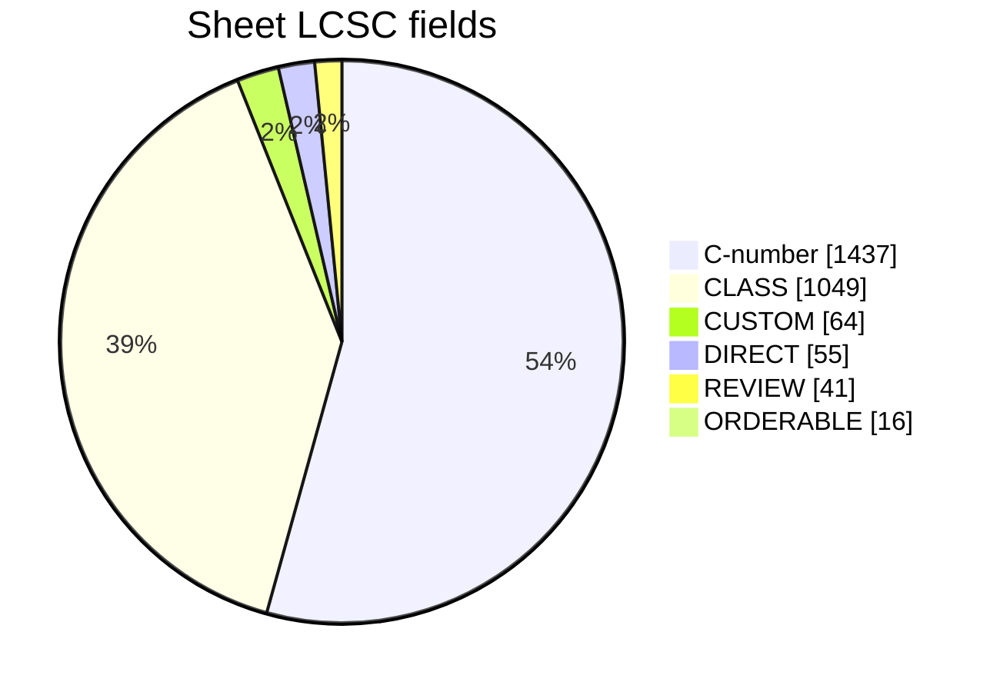
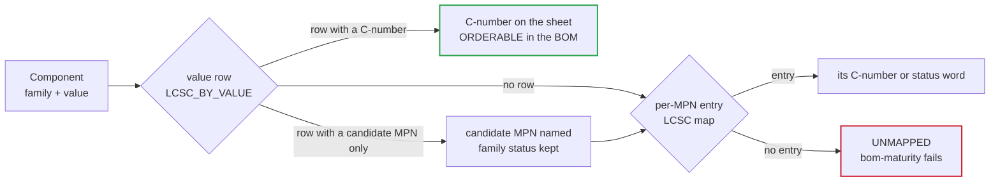

# 🔎 LCSC Assignment Status

<sub>Which parts carry an orderable LCSC number, which deliberately do not, and the lines still open before release</sub>

<p>
  
  
  
  
  
</p>

> [!NOTE]
> **Purpose** — every component on every release sheet carries an `LCSC` field, and every BOM line carries
> `lcsc` and `lcsc_status`. This page states what each value means, how many parts sit in each state, and the
> short list of lines that still need an action before release.

Reproduce the sheet counts below from the shipped sheets:

```sh
grep -ho 'F [0-9]* "[^"]*" .*"LCSC"' kicad5/dc-modules-*/*-*.sch \
  | sed -E 's/^F [0-9]+ "([^"]*)".*/\1/; s/^C[0-9]+$/C-number/' | sort | uniq -c | sort -rn
node calculations/cost/bom-gen.mjs && node calculations/cost/bom-maturity.mjs   # BOM lines + the maturity gate
```

## At a glance

<table>
<tr><td valign="top" width="54%">

| Field on the sheet | Instances | Share | MPNs |
|---|---:|---:|---:|
| real LCSC C-number | **1,437** | 54 % | 70 |
| `CLASS` | 1,049 | 39 % | 57 |
| `CUSTOM` | 64 | 2 % | 16 |
| `DIRECT` | 55 | 2 % | 9 |
| `REVIEW` | 41 | 2 % | 3 |
| `ORDERABLE` (no LCSC line) | 16 | 1 % | 3 |
| **All six release targets** | **2,662** | | |

</td><td valign="top" width="46%">



</td></tr>
</table>

> [!TIP]
> A C-number on the sheet does not mean release-ready. Five parts carry a real C-number and are still `REVIEW` in
> the BOM, because the catalogue part has an open rating or stock question — see
> [the actionable list](#review--the-actionable-list).

## The status taxonomy

| Status | On the sheet | Meaning | Who acts |
|---|---|---|---|
|  | the C-number, or `ORDERABLE` for a wide-distribution part with no LCSC line | a specific part, verified against the rating | purchasing orders it |
|  | the equivalent's C-number | the primary is off-catalogue; a verified equivalent is named — requalify before switching | purchasing and qualification |
|  | `DIRECT` | a vendor-direct order code (Talema, Hongfa, Mean Well) | purchasing, on a direct account |
|  | `CLASS` | the rating **is** the specification; purchasing selects to the spec line | purchasing, to the spec line |
|  | `CUSTOM` | built to our drawing — magnetics pack sheet or cabinet block | winder or assembler, to the drawing |
|  | the C-number or `REVIEW` | a tracked open decision; the map entry must carry its action note | engineering, before release |
|  | never shipped | no map entry — `bom-maturity` fails the battery | — |

### How a field is resolved

`lcscForPart(family, value)` in `calculations/cost/lcsc-map.mjs` is the one resolver; the sheet generator and
`bom-gen` both call it, so a sheet and its BOM can never disagree.



## Coverage by release target

| Target | Instances | C-number | CLASS | CUSTOM | DIRECT | REVIEW | ORDERABLE | C-number share |
|---|---:|---:|---:|---:|---:|---:|---:|---:|
| 30 kW module | 610 | 338 | 230 | 15 | 14 | 9 | 4 | 55 % |
| 40 kW module | 646 | 350 | 254 | 15 | 14 | 9 | 4 | 54 % |
| 50 kW module · liquid | 659 | 348 | 268 | 15 | 13 | 11 | 4 | 53 % |
| 50 kW module · air | 681 | 358 | 280 | 15 | 13 | 11 | 4 | 53 % |
| Control card | 49 | 42 | 6 | — | — | 1 | — | 86 % |
| 150 kW cabinet | 17 | 1 | 11 | 4 | 1 | — | — | 6 % |
| **All sheets** | **2,662** | **1,437** | **1,049** | **64** | **55** | **41** | **16** | **54 %** |

The cabinet sheet is mostly blocks and bulk copper — three module interfaces, the controller CAN port and six M8 studs — so
a low C-number share there is expected, not a gap.

### The same picture in the BOM

BOM lines per SKU from `calculations/out/bom-*.csv` (mechanical lines and the bias-transformer set included):

| SKU | Lines | ORDERABLE | SECOND-SOURCE | DIRECT | CLASS | CUSTOM | REVIEW | MECH |
|---|---:|---:|---:|---:|---:|---:|---:|---:|
| 30 kW | 145 | 74 | 2 | 9 | 33 | 10 | 7 | 10 |
| 40 kW | 177 | 74 | 2 | 13 | 55 | 16 | 7 | 10 |
| 50 kW · liquid | 188 | 73 | 2 | 12 | 65 | 16 | 9 | 11 |
| 50 kW · air | 188 | 74 | 2 | 12 | 65 | 16 | 9 | 10 |

`SECOND-SOURCE` is the two SiC MOSFETs — `SG2M023120LJ` (C5713523) and `B3M010C075Z` (C5713521): the LCSC number
resolves to a different die, so the equivalent must be requalified before a switch.

## REVIEW — the actionable list

Eight parts reach a BOM as `REVIEW`. Each is a named decision, not a lookup.

| Part | LCSC | Open question | Closes at |
|---|---|---|---|
| `QA01C-18` · every gate channel | — | the catalogue module is **+18 / −3 V**; the sheets are drawn **+18 / −4 V**, so the −4 V rail needs a zener split or a true dual-rail part (**O-11**) · Mornsun also needs a second source (OFAC flag, E60) | §K · RFQ |
| `HF167F-250A-M` · 50 kW precharge bypass | — | HF167F tops out near 100 A main; the 250 A class needs a contactor family with an auxiliary contact (Hongfa HFE18V / TE EV200 class) and its own land | RFQ |
| `GD32G553VET7` · control card | — | the real order code (R5-I); the LCSC listing must be re-verified — the old row was keyed to VET6 | first card order |
| `ISO5V-RFC-6K` | C20613048 | the catalogue part (B1505S-1WR2) is 3 kVDC basic; rev D asks for a **reinforced ≥ 6 kV** module | before release |
| `QA01C` · bus-discharge driver bias | C2757491 | ≥ 6 kVDC isolation required (CB-11); the insulation certificate class is confirmed at §K | §K |
| `PS122WF4702T4E` · 47 kΩ anti-surge HV | C2793932 | the spec is met; every true anti-surge 47 kΩ 2512 2 W part read **zero stock / pre-sale** — re-check stock | before release |
| `LED-2DIG-0.56CC` | C9900021773 | the segment pin map was never validated against a chosen part — only A, G and DIG1 agree with the 5621AS pinout | HMI part choice |
| `TACT-6x6` | C318884 | the design wants a 6.0 × 6.0 mm body; two candidate series were rejected on size (3.9 × 3.0 and 5.2 × 5.2 mm) — Schurter's 6 × 6 family is the lead | HMI part choice |

The map also tracks `SHUNT-MANG`; no BOM emits it any more — the per-SKU `SHUNT-50MV-100A / 133A / 167A` class
lines replaced it.

## Read-back queue — named candidates without a C-number

Two sources feed this queue, and a number is never invented for either: the **E60 coordination rows** (new burden
and blank values) and the **E64 land-matching pass** — the value map became land-aware (`family|value|package`),
so 380 positions whose old part number contradicted their own drawn land now name the same-series part in the
drawn size, pending catalogue read-back. This is why C-number coverage moved 67 % → 54 %: those fields were
*wrong-package* numbers, and a wrong number is worse than a pending one.

| Candidate MPN | Spec | Role | Sheet instances |
|---|---|---|---:|
| `CC0805KRX7R9BB104` | 100 nF 0805 X7R 50 V | driver-bias and sense filters (drawn 0805) | 168 |
| `CL05A105KO5NNNC` | 1 µF 0402 X5R ≥ 16 V | driver 5 V logic-side decoupling | 72 |
| `CC0805KRX7R9BB102` | 1 nF 0805 X7R 50 V | sense filters | 36 |
| `RC0805FR-07220RL` | 220 Ω 0805 1 % | 7-seg segment feeds | 32 |
| `CC0805JRNPO9BN220` | 22 pF 0805 C0G 50 V | DESAT blank · LLC (E60 value unchanged) | 24 |
| `CC0805KRX7R9BB103` | 10 nF 0805 X7R 50 V | sense filters | 12 |
| `CC0805JRNPO9BN470` | 47 pF 0805 C0G 50 V | DESAT blank · Vienna (E60 value unchanged) | 12 |
| `CC0805JRNPO9BN221` | 220 pF 0805 C0G 50 V | CT filters | 12 |
| `RC1206FR-071ML` | 1 MΩ 1206 1 % | CGND bleed / PE-tie class (drawn 1206) | 8 |
| `RC1206FR-0713RL` | 13 Ω 1206 1 % | line-CT burden · 50 kW (E60) | 6 |
| `RC1206FR-0722RL` | 22 Ω 1206 1 % | line-CT burden · 30 kW (F.01 120 A pk) | 3 |
| `RC1206FR-0718RL` | 18 Ω 1206 1 % | line-CT burden · 40 kW | 3 |
| `CL10A106KP8NNNC` | 10 µF 0603 X5R 10 V | card analog nodes ≤ 3.3 V only | 2 |
| `CL10A105KB8NNNC` | 1 µF 0603 | card rail | 1 |
| `CC0603KRX7R9BB222` | 2.2 nF 0603 X7R 50 V | card AVMID filter | 1 |
| **Total** | | **15 MPNs — one distributor read-back session closes all of them** | **392** |

## Why CLASS is not "unfinished" — 1,049 instances, 57 MPNs

Substituting a generic catalogue part silently drops a rating the design depends on. Two attempts proved it and
were both reverted:

- gate resistor `R1206-RG-0.5W` → `RC1206FR-074R7L` (C137258) is **250 mW** — half the specified rating, on the
  resistor that takes the gate-drive pulse;
- relay `HF167F-80A-M` → C2757422 is a plain SPST-NO; E30 needs the mirror-contact variant.

| Group | Parts (sheet instances) | What the class fixes |
|---|---|---|
| DC-link electrolytics | `ELH-470u450` (106) | ripple current, endurance and the −40 °C category — not just capacitance |
| Resonant and voltage-class film | `PP-27n-1200V` (48) · `PP-1u-600` (24) · `PP-1u-1100` (20) · `PP-33n-1200V` (18) · `FILM-100n-250` (12) · `PP-46n-1200` (12) · `PP-4u7-1200` (8) · `PP-10n-1200` (4) | V rms against frequency at 140 kHz, dielectric and voltage class |
| Safety-certified and surge | `B72220S0551K101` (S20K550 MOV, 24) · `X1-2u2-530` (12) · `X1-4u7-530` (12) · `GDT-3k5-20kA` (12) | the certification and the surge rating, not the value |
| Pulse and power resistors | `CER-2k2-10W-AX` (32) · `R2512-HV` (24) · `WW-470R-10W` (12) · `CER-25W-160R-AX` (8) · `CER-50W-160R-AX` (8) · `SQP-10R-25W` (8) · `R2010-1k-0.75W-1%` (8) · `CER-25W-33R-AX` (4) · `CER-50W-33R-AX` (4) | pulse energy, power and working voltage — precharge, discharge, anti-surge |
| CT burdens and shunts | `R2512-0R75-2W-1%` (6) · `R2512-1R2-1W-1%` (3) · `R2512-0R91-1W-1%` (3) · the three line-CT burdens above (12) · `SHUNT-50MV-100A / 133A / 167A` (4) | tolerance and power at the E60 trip current — the rating is in the code |
| Gate and logic passives | `R0603-10k` (64) · `R0805-2R2` (48) · `R-small` (21) · the two DESAT blanks above (36) · `R0603-120R-1%` (2) · `R0603-3k32-1%` (1) · `R0603-0R` (1) | value, package, tolerance and dielectric |
| Fuses | `FUSE-gG-690V-160A` (6) · `-125A` (3) · `-80A` (3) | gG 690 VAC class and body — NH00 at 160 A, 22 × 58 up to 125 A |
| Connectors and terminals | `STUD-M8` (54) · `MICROFIT3-40` (8) · `CONN-CARD-88-H` (5) · `CONN-CARD-88-R` (1) · `TAB-M4` (4) | current per contact, keying and mating half |

## CUSTOM — 64 instances, 16 MPNs

Made to the drawings in [Magnetics D1–D7](magnetics.md) and the [RFQ pack](magnetics-manufacturing-pack.md);
there is no catalogue equivalent to look up.

| Drawing | 30 kW | 40 kW | 50 kW (liquid and air) |
|---|---|---|---|
| D1 · PFC choke | `IND-PFC-165u` | `IND-PFC-116u-40` | `IND-PFC-107u-50` |
| D2 · resonant trim | `IND-TRIM-BIN4` | `IND-TRIM-E70-40` | `IND-TRIM-E70-50` |
| D3 · LLC transformer | `XFMR-LLC-10K` | `XFMR-LLC-2E70-40` | `XFMR-LLC-2E70-50` |
| D4 · aux flyback | `XFMR-AUX-FLY-D` | `XFMR-AUX-FLY-D` | `XFMR-AUX-FLY-D` |
| D6 · DM choke | `DM-CHOKE-30` | `DM-CHOKE-40` | `DM-CHOKE-50` |
| CM choke | `CMC-3PH-2mH-SKU` | `CMC-3PH-2mH-SKU` | `CMC-3PH-2mH-SKU` |

The cabinet sheet adds two blocks: `PMP-50KW-MODULE` (3) — costed as the module roll-up — and `CHARGER-CONTROLLER-CAN-PORT`
(1), the integrator's controller interface (E66 — the CSU card is deleted).

## DIRECT — 55 instances, 9 order codes

| Vendor | Order code | Role | Sheet instances |
|---|---|---|---:|
| Hongfa | `HFE82V-<rating>W/1000-24-HA-C5-1` | HV power relay with mirror contact — bank and output switching | 18 |
| Hongfa | `HFE82V-20W/1000-24-HA-C5-1` | 20 A 1000 VDC pre-insertion relay with auxiliary contact (frame to confirm) | 8 |
| Hongfa | `HF167F/024-HATF(764)` | precharge bypass, 30 and 40 kW — auxiliary 1 Form A (E30 mirror) | 4 |
| Talema | `CT-LINE-2500-150A` (ACX-1150) | line CT 2500 : 1, 150 A class, 40 and 50 kW (E60) | 9 |
| Talema | `CT-RES-1:100-100A` | resonant CT 1 : 100, 100 A class, 50 kW | 6 |
| Talema | `ACX-1100` | line CT 2500 : 1 / 100 A, 30 kW | 3 |
| Talema | `AS-404` | resonant CT 1 : 100 / 50 A, 30 kW | 3 |
| Talema | `CT-RES-1:100-80A` | resonant CT 1 : 100, 80 A class, 40 kW | 3 |
| Mean Well | `WDR-60-15` | cabinet 15 V DIN supply, 180–550 VAC input, fed line-to-line | 1 |

The three `ORDERABLE` parts without an LCSC line are wide-distribution logic: `74HC02D` (8), `NCP1252DDR2G` (4)
and `BZT52C15` (4).

## What E64 changed

> [!IMPORTANT]
> - **The value map is land-aware.** `lcscForPart(family, value, package)` consults a `family|value|package` row
>   first, so the sheet can never again name a part whose package contradicts its own drawn land — the 344
>   conflicts the E61 audit counted are **0**, and `footprint-audit` holds both queue counts at zero.
> - **Coverage is honest now, not padded:** 380 wrong-package C-numbers left the sheets (67 % → 54 % real-number
>   coverage) in favour of land-correct candidates in the read-back queue above. One distributor session restores
>   the coverage with numbers that are actually orderable against the drawn lands.
> - The 30 kW D1 / D2 magnetics and every named-candidate row keep their E61 semantics unchanged.

## What E61 corrected

> [!IMPORTANT]
> - **48 sheet fields printed `undefined`.** The E60 value rows name a candidate MPN but carry no status of
>   their own; `lcscForPart` now keeps the family's status for them. All six release targets were regenerated
>   and re-verified at 100 % of pins.
> - **12 card and cabinet fields still read `UNMAPPED`** from sheets last generated before E57 — cleared by the
>   same regeneration.
> - **Five value lines per SKU reached the BOM CSVs with a blank status.** `bom-maturity` resolves each family
>   with an empty value, so it never saw them; `bom-gen` now refuses to write a line without a status.
> - **The 30 kW D1 and D2 were `CLASS`** while their 40 and 50 kW siblings, wound to the same kind of drawing,
>   were `CUSTOM` — now `CUSTOM`.
> - **The counts on this page dated from 2026-09-06** (2,819 instances), before the E55 product ladder and the
>   E56 KiCad-native sheets. Every number above is a recount of the shipped sheets.

<details>
<summary><b>Record — earlier fixes that still stand</b></summary>

#### ORDERABLE names the part, not the class

`ORDERABLE` means a specific part was chosen. Nineteen entries showed the *class* as their MPN while their
C-number resolved to a different, real part named only in a source note — the sheet read `SICJBS-1200-40` /
`C7435099` where the part actually bought is a **GC4D20120D**. All nineteen now name the real part on the sheet
and in the BOM: `US3M` · `STTH112U` · `GC4D10120H` · `C4D20120D` · `GC4D20120D` · `C2M1000170D` ·
`IMW120R350M1H` · `B2B-PH-K-S` · `B4B-PH-K-S` · `PZ254V-11-05P` · `ACT45B-510-2P-TL003` · `GZ2012D601TF` ·
`TPS54202DDCR` · `TPS3430WDRCR` · `TLV9061IDBVR` · `AMC1311DWVR` · `AMC1350QDWVRQ1` · `TLP152`. Gated as
`LCSC-CLASS-MPN` in `review-checks.mjs`, negative-tested both ways.

#### Two ORDERABLE entries were really open decisions

`TACT-6x6` and `LED-2DIG-0.56CC` each carried `ORDERABLE` over a note describing an unresolved problem; both are
`REVIEW` (see the actionable list).

#### The ordinary-value tail was closed by read-back, not memory

`R-small` covers 10 k, 1 k, 100 Ω, 100 k and more, so `LCSC_BY_VALUE` is keyed on `family|value` and `bom-gen`
splits a generic family into one line per orderable value. The C-numbers in that map were read back from the LCSC
catalogue through EasyEDA's `component_search` before the E56 switch to KiCad-native sheets; rows added since
carry a candidate MPN and stay `CLASS` until their number is read back.

#### Two silent map failures are gated

`review-checks.mjs` fails on duplicate object keys in the map (four `note:` entries were once being overwritten)
and on a first-match-wins rule whose pattern shadows a more specific one further down.

</details>

---

<div align="center">
<sub><a href="bom-cost.md">← BOM & Cost Roll-up</a> &nbsp;·&nbsp; <a href="README.md">🧭 Documentation hub</a> &nbsp;·&nbsp; <a href="symbol-pin-map.md">Symbol → Package Pin Map →</a></sub>

<sub>Vectivolt DC-Modules · documentation rev E61 · every number reproduces with <code>sh calculations/run-all.sh</code></sub>
</div>
