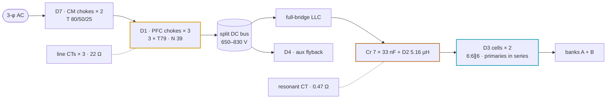

# 🧲 30 kW Module Magnetics

Every magnetic on the 30 kW module — drawing, gate proof, build, tests, prototype route and cost

  
  
  
  

> [!NOTE]
> **Purpose** — every magnetic on the **30 kW module**: what it does, the drawing to quote, the proof the gates computed at
> the simulated corners, how a winder builds and accepts it, how to prototype it, and what it costs. **Generated by
> `calculations/magnetics/mag-docs.mjs` from the last battery run's gate evidence — do not hand-edit.** Method, materials,
> insulation system and the common parts (D4, test methods, failure modes): [magnetics hub](magnetics.md).

## At a glance

| Part | Function | Qty | Construction | ₹ / unit @10k | ₹ @10k | Status |
|---|---|---:|---|---:|---:|---|
| **D1** | PFC boost choke · `IND-PFC-165u` | 3 | 3 × 0077908A7 Kool Mµ 26µ, N = 39 ± 1, 9 × 1.6 mm bundle | 828 | 2,484 | CUSTOM |
| **D2** | external resonant inductor · `IND-LR-E70-30` | 1 | 2 × E70/33/32 PC95-class, N 5, litz 8000×0.05 mm, 5.16 µH ± 3 % | 772 | 772 | CUSTOM |
| **D3** | full-bridge transformer cell · `XFMR-LLC-CELL-2E70-30` | 2 | 2 × E70/33/32 per cell, 6:6∥6, primaries of the two cells in series (n = 2) | 935 | 1,870 | CUSTOM |
| **D7** | 3-phase CM choke · `CMC-3PH-2mH-SKU` | 2 | nanocrystalline T 80/50/25 (A_Fe ≥ 281 mm²), 3 × 8 T, 20 mm² — Schaffner RT8131-63-2M8 catalog primary | 1,062 | 2,123 | CUSTOM |
| **D4** | 110 W aux flyback · `XFMR-AUX-FLY-E` | 1 | ETD44 PC95, Np 38 / 6 / 4 / 4, reinforced barrier (common to every SKU) | 184 | 184 | CUSTOM |
| **CT** | line current transformer · `ACX-1100` | 3 | Talema ACX-1100 (2500:1, 100 A), burden 22 Ω | 52 | 156 | DIRECT |
| **CT** | resonant current transformer · `CT-RES-1:100-100A` | 1 | 1:100, 100 A rms class (tank class 78 A = 78 %), burden 0.47 Ω | 60 | 60 | DIRECT |
| **—** | 3.3 V buck inductor (catalog) · `CYA0630-10UH` | 2 | 10 µH 3 A shielded | 5 | 10 | ORDERABLE |
| **—** | CAN common-mode choke (catalog) · `ACT45B-510-2P-TL003` | 1 | 51 µH, 2-line | 6 | 6 | ORDERABLE |
| **Total** | | | | | **7,666** | |

## How to read the proof tables

Every proof row below is copied from a gate's own output on the last battery run; a ✅ row passed its line, ℹ️ is information the
gate reports, and a failing gate stops the battery before this page is written.

| Gate | What it computes | The line it holds |
|---|---|---|
| `magnetics-envelope` | D2 and D3 flux, iGSE core loss and Dowell/Sullivan copper at all 32 power-solved corners, through a two-node (core, winding) thermal network of the real geometry | hot-spot ≤ 125 °C at 55 °C inlet · ≤ 135 °C at 75 °C inlet derated · ≤ 155 °C with every Rth +25 % · runaway margin ≥ 25 K · B̂ ≤ 50 % of hot Bsat |
| `conductor-audit` | AC resistance of every winding at the simulated switching frequency, and the production Rdc rows that catch a short strand count | Rac/Rdc inside the drawing's row |
| `stress-audit` | D1 biased inductance, current density, bonded thermal, clamp preload and bond loss; D7 DM-leakage flux and hot copper; CT classes | the acceptance line printed in each row |
| `temp-critique` | saturation at the 130 °C cutout, cold equilibria and the fault chain on measured 3C95 surfaces | B̂ ≤ 50 % Bsat(130 °C) · fault flux ≤ 60 % |
| `current-coordination` | D2 flux at the F.11 kill peak and CT observability through each trip's race | ≤ 217 mT · the kill lands inside the ADC rail |
| `mag-sync` | the identity of every part against every carrier, and the computed mass | tokens present · mass within ± 20 % |

## D1 — PFC boost choke · qty 3 · `IND-PFC-165u`

Vienna phase inductor at 50 kHz: DC bias from the line current plus switching ripple, a swing design on sendust that softens
without collapsing. The winding sits at line / switch-node potential and its bonded face is part of the basic barrier to PE.

| Row | Specification — PMP-MAG-D1-30 rev C |
|---|---|
| Core | **3 × Magnetics 0077908A7** Kool Mµ 26µ toroid (OD 78.94 / ID 48.21 / HT 17.02 mm max; AL 37 nH/T² ± 8 % per core); faces epoxy-bonded, distributed gap — no grinding |
| Winding | **N = 39 nominal, winder trims ± 1 turn per core lot** · **9 × 1.6 mm** grade-2 dual-coat enamelled round (Class 200), taped into one bundle every 150 mm, laid flat · bore layers 21 / 15 / 3 · spread ≥ 300° |
| Electrical acceptance (100 %) | L₀ @ 0.1 V / 100 kHz **150–185 µH (165 nom)** · **L @ 78 A pk ≥ 75 µH** (pulse method) · Rdc **≤ 6.9 mΩ @ 25 °C (build 6.08) and within ±5 % of the lot median** — one open strand fails the lot window |
| Operating point | 54.7 A fundamental + 6.3 A rms 50 kHz ripple at 330 VAC, bus 830 V, AL − 8 % — loss and hot-spot in the proof table |
| Insulation | basic insulation to PE: bonded face through the module gap pad, bore through sleeve + clamp cap; recurring peak ≤ 540 V (no PD test) · winding ↔ core functional · Class F (155 °C) UL 1446 system |
| Thermal | one end face gap-pad bonded to the extrusion web · hot-spot limit 120 °C at 55 °C inlet · bonded type test: 74 A DC → hot-spot ≤ 19 K above the plate |
| Over-temperature cutout | not required — one lost pad computes 131 °C, inside Class F (stress-audit) |
| Mechanical · mounting | finished ⌀ 92 × H 88 mm, mass **1.9 kg** (computed) · M6 A4-70 through the bore at 4.5 N·m on a Belleville via a GF-PPS insulating cap · 2-point glass banding |
| Terminations | 2 × tinned flying leads, 60 mm, strain-relief loop ≥ 10 mm before the board |
| Production test | 100 %: L₀ · L @ Ipk pulse · Rdc (row + lot window) · hipot **2.5 kV DC 1 min** winding ↔ bond-face plate + bore mandrel · first article: 4 kV 1.2/50 impulse × 5 each polarity, Rac @ 50 kHz recorded |
| Marking · qty | label p/n, rev, lot, date, N · qty 3 per module · operating ambient −40 … +55 °C full power, derated to +75 °C |

<b>Proof at the simulated corners</b>

| Gate | Check | Result | |
|---|---|---|:---:|
| `stress-audit` | 30kw biased-L floor [catalog AL] | L0 169 µH → 76.9 µH @78 A ≥ 75 (D1 rev B: N=39±1 lot-trim, 18 mm² (drawing of record)) | ✅ |
| `stress-audit` | 30kw swing floor | L@Ibias/L0 = 0.46 (30 kW swing-choke basis exempt: drawing governs via its own biased-L line) | ✅ |
| `stress-audit` | 30kw current density | 3.05 A/mm² ≤ 5.5 | ✅ |
| `stress-audit` | 30kw 3×T79 N 39 9×1.6 mm · web1 | hot-spot at the 330 VAC continuous corner [computed] — Cu 22.4 W @50 Hz + 14.5 W ripple (6.3 A rms, Fr 48.9 = Ferreira 71.3 × 2-D 0.686) + Fe 4.7 W → hot-spot 87 °C @55 °C (winding 85 °C, air 65 °C, web/plate 80 °C, 28 W into it) · 92 °C @75 °C derated · +25 % Rth 89 °C · limits 120/130/145 °C [d1-fd N39·nw9·d1.6·x3·L21/15/3] | ✅ |
| `stress-audit` | 30kw one lost bond survivable or cut out | pad lost → convection only: 131 °C vs Class F 155 °C — survives | ✅ |
| `stress-audit` | D1-COOLING · 30kw | air-cooled as registered 131 °C (+25 % 148 °C; at half the assumed 2 m/s 152 °C — the tunnel is not settled, D1-F2) · Type-2 litz 576×0.2 mm air-cooled 112 °C (ripple Cu 1.7 W, +₹857 of wire per choke) · web gap-pad bond 87 °C (the pad of the ₹105 mount kit — its insulating cap and sleeve are needed for D1-F3 either way) → bond | ℹ️ |
| `stress-audit` | 30kw clamp holds the stack at 2 g × Q 10 [computed] | 1.9 kg, CG 44 mm → overturning 16.5 N·m → preload needed 1.44 kN vs 3.75 kN at 4.5 N·m (K 0.2) · pad 0.58 MPa ≤ 0.7 · bolt 42 % of proof | ✅ |
| `stress-audit` | D1-BUILD · 30kw | MLT 161 mm (layer model 163) · bore layers 21/15/3 of ⌀6.2 mm bundles → finished ⌀92 × H 88 mm (layout open item — tunnel/keep-out rows) · bundle cut ≥ 7.1 m · bonded type test: 74 A DC (= 42.9 W) → hot-spot ≤ 19 K above the plate (calc 9.4 K + 10) | ℹ️ |
| `conductor-audit` | 30kw bundle 9× 1.6 mm, 39 T on 3×T79 | MLT 161 mm (Magnetics table, K 44 %) · 50 Hz 54.7 A → 23.4 W · 50 kHz ripple 6.3 A rms at Fr 47.5 (Ferreira 69.2 × 2-D 0.686; a flat untwisted bundle computes 7.7 W) → 14.8 W · Cu 38.2 W hot — the E60 m = 2 model read 3.6 W ripple copper [d1-fd N39·nw9·d1.6·x3·L21/15/3] | ✅ |
| `conductor-audit` | 30kw production Rdc row @25 °C catches open strands | build 6.08 mΩ · row ≤6.9 mΩ (13 % above; worst good part 6.57; 2 strands open 7.82) · lot window ±5 % vs one open strand +12.5 % — the E60 lines ≤11 / 7.0 / 6.5 mΩ passed a third of the strands open | ✅ |
| `temp-critique` | 30kw OC→ceiling time / 3 µs adder | L(120 A)=45.4 µH (AL−8%) · Δi(3 µs)=46 A ≤ ceiling−threshold 64 A · ceiling reached in 4 µs — CT stays observing until the HRTIMER kill lands (R6-C budget 2–3 µs) | ✅ |

**Build and hold points.** (1) Stack the 3 cores on the arbor, epoxy-bond the faces, cure clamped, band with 2 turns of glass tape.
(2) One layer 0.13 mm polyester over the stack. (3) Cut the 9-wire bundle ≥ 7.1 m and tape it every 150 mm. (4) Wind N from the
lot-trim card (the incoming AL sets 39 ± 1), bore layers 21 / 15 / 3, spread ≥ 300°, exits 25–35 mm apart. (5) Twist, sleeve and tin the
leads. **H1** L₀ inside the window, Rdc, turns photo. (6) Varnish per the hub's impregnation rule. **H2** L @ Ipk pulse. **H3** hipot, label.

## D2 — external resonant inductor · qty 1 · `IND-LR-E70-30`

The one gapped inductor of the full-bridge tank (InfyPower practice): it carries Lr 5.60 µH minus the two D3 cells'
leakage and the 0.1 µH loop stray, at full AC swing and tank potential, 83–203 kHz. No bins — the ± 3 % gap tolerance plus the ± 30 %
cell-leakage band stays inside the ± 5 % Lr the tank decks were solved at.

| Row | Specification — PMP-MAG-D2-30 rev F |
|---|---|
| Inductance | **5.16 µH ± 3 %** @ 140 kHz, 0.1 V (100 %) |
| Core · former | **2 × E70/33/32** PC95 / N95 / 3C95-class MnZn on TDK **B66372B2000** — powder cores prohibited in this slot |
| Winding | **N = 5**, compacted litz **8000×0.05** mm (15.7 mm²), one layer across the 41 mm breadth over a ≥ 3 mm radial spacer |
| Gap | distributed centre-leg gap **Σ ≈ 8.3 mm**, every segment ≤ 1.0 mm, outer legs mated |
| Rdc · Rac | Rdc **≤ 1.35 mΩ** @ 25 °C (100 %) · Rac **≤ 3.35 mΩ** @ 203 kHz, 100 °C (sample 5 / lot) |
| Insulation · hipot · PD | basic insulation to PE through former + spacer + VPI class H · 100 % winding → bonded-face foil 2.5 kV DC · PD 5 / lot, extinction **≥ 2.0 kV**, ≤ 10 pC |
| Thermal | both yoke faces gap-padded to the upper and lower extrusion webs, end turns potted to the web · hot-spot ≤ 125 °C at 55 °C inlet (type test, thermocouples beside a gap and on the winding) |
| Over-temperature cutout | one NC 130 ± 5 °C thermostat beside a gap, in the magnetics cutout loop |
| Mechanical · terminations | ≤ 70.5 × 65.9 × 59 mm · **1.3 kg** · 2 litz flying leads out of one end-turn face, tinned 12 mm |
| Marking · qty | label p/n, rev, lot, serial, measured L · qty 1 per module · operating ambient −40 … +55 °C full power |

<b>Proof at the simulated corners</b>

| Gate | Check | Result | |
|---|---|---|:---:|
| `magnetics-envelope` | 30kw D2 + D3 leakage stack inside the simulated Lr tolerance | D3 cell S1–P–S2 leakage 0.172 µH × 2 + 0.1 µH loop → D2 5.16 µH of Lr 5.6 µH · worst-case stack ±4.6 % (D2 ±3 % + leakage ±30 %) vs ±5 % simulated | ✅ |
| `magnetics-envelope` | 30kw 2×E70 N 5 · 5.31 µH max · web2 · R core→wall 0.77 · winding→core 0.75 K/W | core corner SER250-full-bus764 202.9 kHz B̂ 88 mT Fe 30.5 W · copper corner SER250-full-bus764 202.9 kHz Cu 15.1 W · hot-spot 95 °C @55 °C (SER250-full-bus764; core 95 °C / winding 94 °C) / 101 °C @75 °C derated (SER250-full-bus764) · +25 % Rth 105 °C · runaway margin 159 K · B̂ 21 % of hot Bsat | ✅ |
| `magnetics-envelope` | D2-BOND-LOST · 30kw | one face lost (web1) → 106 °C @55 / 112 °C @75 · +25 % 122 °C → survives | ℹ️ |
| `stress-audit` | 30kw external Lr Bpk | 86 mT at Lmax 5.31 µH × 78 A rms class vs 110 mT line (N=5 on 2× E70/33/32 — E67 D2 rev F) | ✅ |
| `stress-audit` | 30kw external Lr litz J | 8000×0.05 mm litz (15.7 mm²): J 5 A/mm² ≤ 5.6 at the 78 A class | ✅ |
| `conductor-audit` | 30kw 2×E70 N 5, litz 8000×0.05 @203 kHz | MLT 216 mm · Rdc 1.21 mΩ @25 °C (row ≤1.35) · Sullivan Fr 1.96 → Rac 3.04 mΩ hot (row ≤3.35) → Cu 15.1 W at 70.4 A rms (SER250-full-bus764) — thermal proof: magnetics-envelope | ✅ |
| `current-coordination` | 30kw external Lr flux: operating + fault | Lmax 5.31 µH (2×E70 N 5): 88 mT at the worst simulated peak (≤110) · 163 mT at the F.11 kill peak ≤ 60 % Bsat(130 °C) 217 mT | ✅ |

**Build and hold points.** (1) Grind or space the centre-leg gap in segments of ≤ 1.0 mm toward the AL that gives 5.16 µH at N 5; glue,
cure clamped, re-measure (cure shifts AL about 1 %). (2) Wrap a ≥ 3 mm radial spacer over the former so the litz stays out of the gap
field. (3) Wind 5 turns of 8000×0.05 mm litz in one layer. (4) Tin the served ends at 400 ± 20 °C. **H1** L inside ± 3 %, Rdc.
(5) VPI class H with the yoke faces masked. **H2** L re-check, Rac sample. (6) Fit the cutout beside a gap. **H3** 2.5 kV DC winding →
bonded-face foil, label with the measured L.

## D3 — full-bridge transformer cell · qty 2 · `XFMR-LLC-CELL-2E70-30`

One of two identical cells whose primaries are wired in series (overall n = 2); each cell's secondary feeds one bank through S1 ∥ S2.
Flux follows bank voltage, not load, so a power derate does not relieve the core corner. **Safety-critical:** this part carries the
reinforced barrier between the DC bus and the output — its barrier steps and hipot are witnessed on every unit.

| Row | Specification — PMP-MAG-D3-30 rev D |
|---|---|
| Ratio · magnetizing | **6:6∥6 exactly** (P : S1 ∥ S2, S1 and S2 paralleled at the header) · Lm **28 µH ± 7 %** per cell @ 10 kHz, 0.1 V |
| Core · former | **2 × E70/33/32** PC95 / N95 / 3C95-class · TDK B66372B2000 (2-set, lN 230.5 mm) |
| Gap | centre legs only, equal on every set, no position > 0.5 mm, ground to AL **0.778 µH/T² (Σ gap ≈ 2.2 mm)** on the assembled cell |
| Primary | **TIW-served litz 3850×0.063 mm (12 mm²)**, one layer |
| Secondary halves | Cu foil 0.10 × 28 mm, one per turn · MLT S1 / P / S2 189 / 211 / 232 mm |
| Leakage | per cell, both halves shorted, 140 kHz, after VPI: **0.172 µH ± 30 %** — measured and labelled |
| Rdc @ 25 °C (100 %) | P ≤ 2.1 · S1 half ≤ 8.0 · S2 half ≤ 9.8 mΩ · Rac/Rdc ≤ 1.35 per winding at 203 kHz (sample 5 / lot) |
| Insulation system | Class H — VPI class H · TIW grade Class F minimum · pri ↔ sec **reinforced**, one barrier system: TIW wall + ≥ 3 barrier-tape layers between each shield and its secondary · shields to SH → DCN on the board |
| Hipot · PD | **100 %: pri ↔ sec ≥ 4.25 kV DC 1 s, witnessed and logged** · P → bonded-face foil 2.5 kV DC · S → foil 1.5 kV DC · PD type test + 5 / lot: extinction **≥ 2.0 kV**, ≤ 10 pC after 1.2 × pre-stress |
| Thermal | both yoke faces gap-padded to the upper and lower extrusion webs, end turns potted to the web · type test at the named corners: ≤ 125 °C at 55 °C inlet, ≤ 135 °C at 75 °C derated (thermocouples at the winding outer surface and the centre leg) |
| Over-temperature cutout | one NC 130 ± 5 °C thermostat per cell at the winding hot-spot witness point — a lost bond is screened at EOL by the bonded thermal soak |
| Terminations | primary header P1 · P2 · SH on one end-turn face · secondary header SA · SB on the opposite face, ≥ 8 mm plus a slot between groups |
| Mechanical · marking | ≤ 70.5 × 65.9 × 91 mm plus headers · the 65.9 mm yoke-face height is controlled · **1.3 kg** per cell · label p/n, rev, lot, serial, measured leakage, polarity dots |
| Production test | 100 %: ratio, Lm, leakage + label, Rdc × 3, pri ↔ sec and bonded-face hipots · sample: Rac 5 / lot, PD 5 / lot · first article: dimensions, cross-section, impulse, PD and thermal type tests |

**Winding table (each cell)** — radial order from the centre leg; breadth 41 mm; conductors confined to the 28 mm centre band.

| # | Element | Construction | Laid over it |
|---:|---|---|---|
| 0 | former + base wrap | 1.2 mm wall | ≥ 2 layers barrier tape |
| 1 | **S1** (half of the secondary) | 6 T, Cu foil 0.10 × 28 mm, one per turn | ≥ 3 layers barrier tape |
| 2 | shield 1 | 1 T foil, ends insulated from each other | 1 layer tape |
| 3 | **P** | 6 T TIW-served litz 3850×0.063 mm (12 mm²), one layer | 1 layer tape |
| 4 | shield 2 | as shield 1 | ≥ 3 layers barrier tape |
| 5 | **S2** (the other half) | as S1 | ≥ 2 layers outer wrap |

<b>Proof at the simulated corners</b>

| Gate | Check | Result | |
|---|---|---|:---:|
| `magnetics-envelope` | 30kw 2×E70 2 cells 6:6∥6 · web2 · R core→wall 0.77 · winding→core 0.88 K/W | core corner ENV500-55 87.5 kHz B̂ 159 mT Fe 31.9 W · copper corner SER250-full-bus764 202.9 kHz Cu 45.8 W · hot-spot 106 °C @55 °C (SER250-full-bus764; core 90 °C / winding 106 °C) / 102 °C @75 °C derated (ENV500-55) · +25 % Rth 114 °C · runaway margin 116 K · B̂ 39 % of hot Bsat | ✅ |
| `magnetics-envelope` | D3-BOND-LOST · 30kw | one face lost (web1) → 110 °C @55 / 115 °C @75 · +25 % 126 °C → not survivable — screened by the EOL bonded thermal soak | ℹ️ |
| `magnetics-envelope` | BOND · 30kw | D3 cannot survive a lost bond → EOL bonded thermal soak is mandatory (docs/dfm-production.md) | ℹ️ |
| `stress-audit` | 30kw cell Bpk at the worst simulated corner | 159 mT at ENV500-55 (87.5 kHz) on 2× E70 6:6∥6 ≤ 205 mT (50 % of N95 Bsat 100 °C; loss is the binding limit — magnetics-envelope) | ✅ |
| `conductor-audit` | 30kw cell foil halves 1× 0.1 mm × 28 mm, 6 turns @203 kHz | h/δ 0.59 (η 0.68) → Dowell Fr 1.23 (m 6) ≤ 1.35 → both halves 30.2 W at 34.6 A rms each (SER250-full-bus764; optimum 0.1 mm = 30.2 W) | ✅ |
| `conductor-audit` | 30kw cell profiled-litz primary 3850×0.063 mm | Sullivan (interleaved k 0.25) Fr 1.32 → 15.6 W at 70.4 A rms | ✅ |
| `conductor-audit` | 30kw production Rdc rows @25 °C match the 2×E70 cell build | MLT S1/P/S2 189/211/232 mm → P 1.85 (≤2.1) · S1 7.14 (≤8) · S2 8.74 (≤9.8) mΩ — rows ≤15 % above the build so a short strand count or thin foil is caught | ✅ |
| `temp-critique` | D3 simulated worst flux at 130 °C core | worst B̂ 159 mT (50kw ENV500-55, E67 cell envelope) ≤ 50% of Bsat(130 °C)=362 mT (44%) — loss-limited, never sat-limited | ✅ |

**Build and hold points.** (1) Grind the centre legs to the AL target, equally on every set, ≤ 0.5 mm per position; glue-stack into the
former, cure, re-measure. (2) Base wrap. (3) S1 foil with fold-back tails to the bank side, then ≥ 3 barrier layers. (4) Shield 1, ends
insulated (no shorted turn), tail to SH. (5) Primary TIW-served litz in one even layer — strip the triple wall only to the drawing's window
with a thermal stripper, never a blade. (6) Shield 2 and ≥ 3 barrier layers. (7) S2 and the outer wrap. **H1** ratio, Lm, leakage written
on the traveler, Rdc × 3, polarity. (8) VPI class H with bond faces and headers masked. (9) Terminate the headers on opposite faces; fit
the cutout. **H2** full acceptance row, leakage re-measured after VPI. **H3** pri ↔ sec hipot — always the last electrical test — PD sample,
label with the post-VPI leakage and serial.

## D7 — 3-phase common-mode choke · qty 2 · `CMC-3PH-2mH-SKU`

Two CM stages with Y1 trios on the node between them and on the converter side (E65); the X2 star stages of the E68b filter carry the
differential mode, so no DM choke exists. The choke's own leakage (6–12 µH) rides every line crest, so its DM-bias flux is an acceptance
line, not a typical. **At 30 kW the catalog Schaffner RT8131-63-2M8 is the primary part** (63 A / 2.8 mH, 89.1 A pk above the 82.6 A crest); this drawing is its second source.

| Row | Specification — PMP-MAG-D7-30 rev B |
|---|---|
| Core | nanocrystalline tape-wound toroid, µi(10 kHz) 25–40 k class (VITROPERM 500F / Nanoperm 30000 / AT&M CMC grade), Bsat ≥ 1.2 T · **T 80/50/25** (AT&M CC050 class) · the quote must state **A_Fe ≥ 281 mm²** (iron, excluding case) · never impregnated |
| Windings | 3 sectors × **8 T**, same sense, start and finish on one side · Cu **20 mm²**, ≤ 2 layers · sector spacing ≥ 3 mm plus a UL 1446 barrier · J 2.79 A/mm² |
| Electrical acceptance | **L_cm ≥ 2.0 mH @ 10 kHz** (design 2.27 mH at µ − 30 %) · **L_cm ≥ 1.0 mH @ 150 kHz** · DM-bias row: L_cm @ 10 kHz ≥ 2.0 mH and ≥ 80 % of unbiased with **83 A** DM injected · leakage **6–12 µH**, measured and reported · quote check L_lk × I_pk / (8 × A_Fe) ≤ 0.6 T · Rdc per winding ≤ 0.85 mΩ @ 20 °C (calc 0.77), matched ± 5 % |
| Hipot | winding ↔ winding 2.5 kV AC 1 min · winding ↔ core 2.5 kV |
| Thermal | ΔT ≤ 45 K at **55.9 A rms** (calc 20 K at 100 °C copper, 9.9 W) · thermocouple between sectors |
| Mechanical | finished ⌀ ≤ 95 mm, H ≤ 40 mm (calc 93 × 38) · bonded base plus band · 6 leads into plated holes · ≈ 0.89 kg |
| Production test · marking · qty | 100 %: L_cm @ 10 kHz, Rdc × 3 matched, hipot · sample 5 / lot: L_cm @ 150 kHz, leakage · first article: DM-bias row and ΔT · label p/n, lot · qty 2 per module |

<b>Proof at the simulated crest</b>

| Gate | Check | Result | |
|---|---|---|:---:|
| `stress-audit` | 30kw winding J [engine] | D7 20 mm² → 2.79 A/mm² ≤ 5.6 (E68: no AC-side D6) | ✅ |
| `stress-audit` | 30kw DM-leakage flux at the simulated crest | 12 µH × 82.6 A / (8 T × 281 mm²) = 0.44 T ≤ 0.6 (hot Bsat 1.155 T) · L_cm 2.27 mH ≥ 2 at µ −30 % (T 80/50/25) | ✅ |
| `stress-audit` | 30kw hot-copper ΔT | 9.9 W/choke at 100 °C Cu → ΔT 20 K ≤ 45 (registered 11.5/15.3/19.2 W were 20 °C copper on a turn the OD62 core could not hold) | ✅ |
| `stress-audit` | 30kw parts-db carries the engine core | T 80/50/25 · A_Fe ≥ 281 mm² in the CMC override note | ✅ |
| `stress-audit` | 30kw catalog Schaffner RT8131-63-2M8 vs the crest | 82.6 A pk ≤ 63 A × √2 = 89.1 A (vendor rating covers its own leakage flux) | ✅ |

**Build.** Never remove the core case — nanocrystalline tape is strain-sensitive. Wind three sectors at 120° with ≥ 3 mm taped walls,
8 T each. **H1** L_cm, three matched Rdc, measured leakage recorded (the LISN model consumes it). No vacuum impregnation — surface
seal only. **H2/H3** hipots, label.

## D4 — aux flyback transformer · qty 1 · `XFMR-AUX-FLY-E`

The same part on every SKU (ETD44, reinforced barrier, 100 % hipot), qty 1 per module — core, windings, outline, terminations and acceptance rows on the [magnetics hub](magnetics.md#d4--aux-flyback-transformer-rev-e).

<b>Proof</b>

| Gate | Check | Result | |
|---|---|---|:---:|
| `stress-audit` | flux at the computed cycle-by-cycle limit | 860 V · Lp +5 % · VILIM 1.08 V · CS 1 k/100 pF · tILIM 150 ns → 4.67 A → 257 mT = 71.1 % of Bsat(130 °C) ≤ 75 % on ETD44 (control E52: 5.1 A → 113 % on ETD39 — rejected) | ✅ |
| `stress-audit` | full load stays under the FCS fault timer at the lowest running bus | 50kwa 89.8 W in · Lp −5 % · osc −8 % · Rcs +1 % · ramp max at 306 V: CS 0.828 V vs FCS min 0.90 V (8 % ≥ 5 %) · deliverable 93 W ≥ 1.1 × 79 W (a nuisance latch here would drop the module until AC is cycled) | ✅ |
| `stress-audit` | DCM and duty at brown-out min, Lp max | t_on + t_reset = 68 % of the period ≤ 90 % · duty 22.1 % ≤ DCmax(min) 44.2 % | ✅ |
| `stress-audit` | RCD clamp resistor + capacitor duty | 3× 11 k: 0.94 W/part at full load and 5 µH (≤ 50 % of 2 W) · 2.13 W/part for ≤ 20 ms at the limit (≤ 2.5×) · 153 V/part · CCLA 459 V of 1200 V · idle bleed 0.75 W (control E52 diode at 173 % of 1200 V — rejected) | ✅ |
| `stress-audit` | brown-in with the IBO hysteresis source starts at 285 VAC | brown-out 306/321/336 V (the R6 321 V floor) · brown-in 327/345/363 V ≤ 95 % of the 403 V bus at 285 VAC · hysteresis ≥ 20.9 V (control E52 2.4M set: brown-in 369 V typ, 390 V worst — the "342 V cold start" could never start; T-11 row carries the band) | ✅ |
| `stress-audit` | cold start inside the EVT acceptance (VCC(on) max, CVCC +20 %, ICC1 max) | 12.4 s at 285 VAC (≤ 13) · 10.7 s at 320 VLL (≤ 11) · 8.1 s at 400 VLL (≤ 8.5) — the R6 "≈8 s at low line" held only at typical VCC(on) and nominal CVCC | ✅ |
| `stress-audit` | V24/V15 hard short at 860 V before the 10–20 ms fault latch | ton_min ratchet (LEB + tILIM 150 ns, osc+jitter max, loop ≥ 50 mΩ + RAUX24 50 mΩ): V24 5.23 A · V15 4.98 A ≤ 80 % of the 10 A QAUX pulse class · 288 mT ≤ 85 % of Bsat(130 °C) (control E52: 10.5 A → 835 mT, deep saturation — rejected) | ✅ |
| `stress-audit` | D4 · residual | a failure AT the V24 reservoir (CAUX24/DAUX24 short, no RAUX24 in the loop) ratchets to 8.63 A / 476 mT at the 860 V worst stack — a component-failure event ended by the latch (T-09 short matrix, search coil); harness and load faults all sit behind RAUX24 | ℹ️ |
| `stress-audit` | leakage acceptance is buildable | P/2–S–P/2 sandwich 1-D estimate 1.7 µH ×1.5 ≤ 4 µH acceptance (+1 µH rectifier-loop allowance in every clamp row) | ✅ |
| `stress-audit` | reinforced pin allocation: bus-side row / SELV row | pins 1–4 AXA,AXB,P1,P2 · pins 5–8 S15A,S15B,S24A,S24B (E52 mixed P1/S24A and AXA/S15A at 1.98 mm vs 8.0/12.6 mm reinforced — land regeneration is a layout open item) | ✅ |
| `stress-audit` | aux SPICE deck: fingerprint, verdicts, anchors [aux-flyback.csv] | 17 rows, 16 PASS · FB-open limit 4.11 A vs closed form 4.1 A at the deck's typ corner (±10 %) · V24 short 5.81 A / 286 mT in the deck (≤ 8 A · ≤ 85 % Bsat 130 °C) before the fault latch; closed-form worst stack 5.23 A | ✅ |
| `temp-critique` | D4 (ETD44 DCM amp) | hot equilibria 76 °C (55 amb/full) · 79 °C (75 amb/derated); worst g(T_eq) = 0.01 ≤ 0.6; runaway threshold T_crit(g=1) ≥200 (search cap) °C — margin 121 K ≥ 25 (measured pv(T); Fe is volt-second-pinned so it does NOT derate with load — this is why the ΔT acceptance line caps the winder's Rth) | ✅ |
| `temp-critique` | D4 (ETD44 DCM amp) | measured-basis Fe @100 °C = 0.1 W vs A4 design 0.6 W (design fit must not understate by >10%) | ✅ |
| `temp-critique` | D4 (ETD44 DCM amp) | Fe(−30 °C) = 0.2 W = 2.05× the 100 °C basis; cold equilibrium core -16 °C at full load (stable — loss slope negative below the ~80 °C minimum, so cold start SELF-WARMS toward the minimum) | ✅ |
| `temp-critique` | D4 at the computed cycle-by-cycle limit, 130 °C (ETD44) | 4.67 A (860 V, Lp +5 %, VILIM max, CS lag + tILIM max) → 257 mT vs 75% of Bsat(130)=271 mT (71% absolute) — E65: the E52 "256 mT at a 3.2 A clamp" row read 407 mT (113%) once the drawn sense chain was computed | ✅ |

## Current transformers · 3 line + 1 resonant

| Row | Line CT × 3 · `ACX-1100` | Resonant CT × 1 · `CT-RES-1:100-100A` |
|---|---|---|
| Part | Talema ACX-1100 (2500:1, 100 A), ± 1 %, 4 kV hipot, PCB pins | 1:100, 100 A rms class (tank class 78 A = 78 %), 20–250 kHz, pass-through — the tank conductor is the primary |
| Burden (on the PCB) | **22 Ω** → F.01 **120 A pk** | **0.47 Ω** → F.11 **140 A pk**, both polarities |
| Acceptance | ratio ± 0.5 % (100 %) · no saturation below **150 A pk** (1.25 × F.01) at 25 °C on the fitted burden · linear to the F.01 + race point **166 A** · phase ≤ 1° @ 50/60 Hz · ΔT ≤ 30 K | ratio ± 0.5 % **at 140 kHz** · linear to **335 A pk (1.05 × the 318.6 A monitor peak)** at 25 °C on the fitted burden · ΔT ≤ 30 K at the tank class current — a line-frequency core does not serve this slot |
| Outline · qty | catalogue outline (ACX-1100: ⌀ 42 mm body, ⌀ 14.6 mm window) · qty 3 per module | catalogue case with the pass-through window · qty 1 per module |
| Quote | bare — the burden lives on the PCB; secondary Rdc recorded per unit (EOL calibration) | bare |

<b>Proof — trips observable through their race</b>

| Gate | Check | Result | |
|---|---|---|:---:|
| `current-coordination` | 30kw threshold ≥ 1.2× simulated worst line peak | 120 A pk vs 97 A (330-full-dip50-5ms-recovery: ripple on the soft-saturated D1 at lot AL−8 %, bus 830, incl. 30 %/50 % dips + 20° jump with the FW-R6 1.05× reference clamp) → 1.24× | ✅ |
| `current-coordination` | 30kw observability through the 3 µs kill race | Δi(3 µs, 560 V, L(i) at AL−8 %) = 45.3 A → 165.3 A ≤ ceiling 184.1 A on 22 Ω · threshold at 2.71 V ≤ 3 V | ✅ |
| `current-coordination` | 30kw threshold ≥ 1.2× simulated worst tank peak | 140 A pk vs 112.7 A (SER250-full-bus764) → 1.24× | ✅ |
| `current-coordination` | 30kw window-comparator kill + observability | \|Ip\| crosses F.11 1.45 µs after the short → kill peak 209.1 A (+1 µs, ×1.2 ≤ 344.7 A on 0.47 Ω) · monitor peak +3 µs 318.6 A ×1.05 in rail · window 0.99/2.31 V | ✅ |
| `current-coordination` | 30kw LLC FET pulse class at the kill peak | 209.1 A per die (1× SG2M023120LJ per position) vs 80 % of IDM 265 A (RFQ acceptance IDM ≥ 265 A (the C3M0021120K class lists 250 A)) — non-repetitive µs pulse at low VDS | ✅ |
| `stress-audit` | line CT class @40 kW | E60: the 40 kW joins the 150 A class (ACX-1150) — F.01 155 A + 50 A race needs linearity past the ACX-1100's ~179 A at 18 R; 30 kW keeps ACX-1100 (55 A, F.01 120 A on 22 R) | ✅ |
| `stress-audit` | resonant CT class per variant | E67 one tank CT: 30 kW 78 A class on 100 A (78 %); 40/50 kW 100/120 A class on 150 A (67/80 %) — RFQ lines, sensor path not power path | ✅ |
| `stress-audit` | line CT class @50 kW | 91.6 A worst vs 150 A class (ACX upsize at RFQ; ACX-1100 would run 92%) | ✅ |

## Prototype route — before the winder

| Part | Fastest honest route for the first 30 kW build |
|---|---|
| D1 | wind in-house on stocked 0077908A7 cores with 1.6 mm grade-2 wire to this sheet; measure L₀, L @ Ipk and Rdc against the rows |
| D2 · D3 | stocked TDK E70/33/32 N95 sets and B66372B2000 formers; litz to order; wind to this sheet and measure Lm, leakage and Rac at 140 kHz (EVT T-31 / T-34) before trusting any tank result |
| D7 | Schaffner RT8131-63-2M8 from stock |
| CTs | Talema catalogue parts (ACX line CTs, AS-series resonant CT) |
| D4 | bring the control up on a catalogue 24 V supply (Mean Well RSDH-150-24 class plus a 24 → 15 V converter) until the ETD44 part arrives |

## EVT hooks

| Test | What it closes for these magnetics |
|---|---|
| T-31 | first-article Rac at 140 kHz and ΔT at the class current for every D2 / D3 winding |
| T-33 | D1 as-mounted resonance search and endurance |
| T-34 | the assembled tank: D2 ± 3 %, cell leakage ± 30 %, fr within ± 5 % |
| T-37 | D2 flux at the F.11 kill with a search coil |
| T-09 · T-18 · T-29 | D4 clamp, thermal and cold start |

---

<a href="magnetics.md">← Magnetics Hub</a> &nbsp;·&nbsp; <a href="README.md">🧭 Documentation hub</a> &nbsp;·&nbsp; <a href="magnetics-40kw.md">40 kW Module Magnetics →</a>

Vectivolt DC-Modules · documentation rev E70 · every number reproduces with <code>sh calculations/run-all.sh</code>

