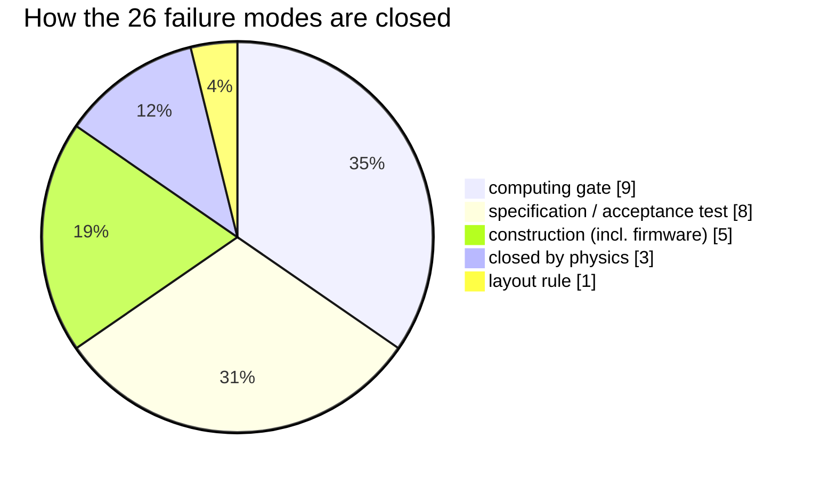

# 🔥 Magnetics FMEA & Temperature Critique

Runaway, cold start, saturation and every failure mode, computed on measured ferrite data

  
  
  
  

> [!NOTE]
> **Purpose** — the adversarial answer to "will the magnetics work across the whole temperature
> range, and what are ALL the ways they can fail — alone and with the switches around them."
> Every quantitative row is COMPUTED each battery run by
> [`calculations/magnetics/temp-critique.mjs`](../calculations/magnetics/temp-critique.mjs)
> against the **measured Ferroxcube 3C95 surfaces** (digitized datasheet set from
> `upb-lea/materialdatabase`, frozen with provenance in
> [`tempdata-3c95.json`](../calculations/magnetics/tempdata-3c95.json); PC95/DMR95 = same class).
> The temperature-blind A3/A4 design fits remain the conservative sizing basis — this gate is the
> independent second opinion they lacked. PyOpenMagnetics is installed as an optional
> geometry-level cross-check; the battery depends only on the frozen dataset.
>
> **Gate coupling** — `temp-critique.mjs` (run-all) · `verify-independent.mjs` §J flux-walk row ·
> stress-audit D1–D6 computed families · the pack's E58 hardening rules.

## At a glance

| Question | Verdict today (E60 copper, A11 rev C) |
|---|---|
| Thermal runaway at the hot corners? | **No** — D3 equilibria 102–107 °C, loop gain ≤ 0.48, runaway threshold ≥ 200 °C (≥ 93 K away) |
| Cold start at −30 °C? | **Stable** — Fe 2.05 × the 100 °C basis, but every core self-warms toward its loss minimum |
| Saturation at a 130 °C hotspot? | **No** — D3 at 30 % of hot Bsat; D2 fault flux 211 / 181 / 153 mT ≤ 217 mT; D4 clamp at 71 % |
| AC copper? | **Inside every Rac row** after the E60 construction (Rac/Rdc ≤ 1.35) — see [conductor selection](conductor-selection.md) |
| Failure modes | **26 identified, 26 closed** — by computing gate, construction, specification, layout rule or EVT hook |

## The temperature verdict (computed, not asserted)

| Question | Answer (worst part) | Evidence |
|---|---|---|
| **Thermal runaway at hot corners?** | **NO — loop gain g ≤ 0.31 at every hot equilibrium; runaway threshold ≥ 200 °C, ≥ 99 K above equilibrium.** Core flux is volt-second-pinned (does NOT derate with load), so the honest corners are 55 °C amb/full load and 75 °C amb/40 % load — equilibria land at **77–101 °C core**, right at the 3C95 loss minimum (~80 °C). The ΔT acceptance line is what caps the winder's Rth and *guarantees* this. | RUNAWAY rows, all 7 ferrite parts |
| Cold (−25 °C)? | Fe(−25 °C) = **1.98×** the 100 °C basis — but the loss slope below the ~80 °C minimum is NEGATIVE, so a cold start **self-warms toward the minimum**; cold equilibria −7…+18 °C core, all stable. Impact is a starting-η dip, not a limit. | COLD rows |
| Saturation at temperature? | Bsat falls **499 → 401 mT (25→100 °C, measured)** → 362 mT at a 130 °C hotspot. D3 volt-second flux = 30 % of hot Bsat (loss-limited, never sat-limited) · D2 OC-transient 157 mT ≤ 60 % line · **D4 clamp at Lp+10 % = 71 % of Bsat(130) — the E52 ETD39 re-core is what makes this true (the ETD34 would sit at 91 %)** | BSAT rows |
| Design-fit honesty? | The A4 fit **over-states** measured 3C95 loss by ~1.7× at 100 °C on every part (conservative direction) and the Steinmetz (f,B) scaling reproduces all three independent digitized series within the stated band. | A4-CONSERVATIVE + MODEL rows |
| Lm stability vs temperature? | Amplitude-µ swings 3948→4380 (25→100 °C at 108 mT) but the ground gap dominates: **Lm moves 0.3 %** — invisible inside the ±7 % window. | LM row |

## Failure-mode matrix

Severity · detection · protection path · margin — every row either **CLOSED-BY-GATE** (a battery
check computes it), **CLOSED-BY-CONSTRUCTION** (topology/netlist-proven), **CLOSED-BY-SPEC**
(acceptance/traveler line the winder must meet), or **EVT** (needs hardware, listed at the end).

| # | Mechanism | Effect if it happened | Closure |
|---|---|---|---|
| 1 | Ferrite thermal runaway (loss tempco positive above ~80 °C) | core melts insulation → barrier failure | **GATE** — equilibrium + g(T) + T_crit computed per part per corner (table above) |
| 2 | Core saturation from volt-seconds (D3) | primary current spike → LLC FET OC | **GATE** — 30 % of hot Bsat; and trip covers: resonant CT → F.11 comparator |
| 3 | D2 saturation during tank OC transient | L collapse → faster ring | **GATE** — 157 mT vs 217 mT line at 130 °C; event is trip-limited (µs–ms) |
| 4 | D4 flyback saturation at clamp + Lp tolerance + hot core | aux switch current spike → CS clamp cycle | **GATE** — 71 % of Bsat(130); CS resistor clamps every cycle by design (DCM) |
| 5 | D1 soft-saturation during a line fault | di/dt rises as L falls → protection race | **GATE** — computed on catalog AL−8 %: Δi(3 µs) = 33–37 A, inside threshold→ceiling headroom on every SKU; CT still observing when the HRTIMER kill lands (R6-C/R8 window now has numbers) |
| 6 | LLC flux-walking (DC volt-second asymmetry walks the core) | progressive sat over cycles | **CONSTRUCTION** — series Cr blocks DC by topology; netlist-proven per section per SKU (verify-independent §J, 4 checks) |
| 7 | CMC (D7) DM-flux saturation at line current | CM filtering lost → EMI failure | **CONSTRUCTION** — 3-wire entry (L1/L2/L3/PE only, no neutral): Σi ≡ 0, the CM core never sees DM ampere-turns; sectored-winding leakage is the DM element by design |
| 8 | Sendust µ drift over temperature (D1/D6 floors) | ripple/EMI floors missed hot or cold | **SPEC** — ±3 % catalog band noted in the gate; D6 floors carry ≥ +9 % margin, D1 lot-trim ±1 turn absorbs it; pack first-article now measures L(I) at **−25/+25/+100 °C** |
| 9 | Surge (8/20 µs) magnetizing/saturating chokes | insulation stress across choke | **CONSTRUCTION** — MOV Δ + GDT clamp sits BEFORE the EMI chokes in the entry chain (architecture power path); sendust saturates soft with no dielectric event |
| 10 | Fringing-field eddy heating of clamp hardware (gapped D2/D3) | hot bolts → tape damage → PD | **SPEC (new, E58)** — clamp bars non-magnetic stainless, slotted over the gap plane, no closed loop, ≥ 8 mm from any gap face (pack rows) |
| 11 | Gap-grind drift → Lm out of window | gain-map error → capability loss | **CLOSED** — grind-to-AL 100 % test + MC §37 absorbed ±7 %; temperature adds only 0.3 % (LM gate row) |
| 12 | Litz/TIW insulation failure at temperature | pri↔sec barrier loss (SAFETY) | **SPEC** — Class F/H system vs ≤ 130 °C hotspot; 100 % 4 kV hipot + PD sampling; hotspots are equilibrium-computed 77–101 °C (gate), not the old worst-stack guess |
| 13 | Thermal-cycling fatigue (−40↔+125: litz bonds, gap glue, banding) | intermittents, mechanical loosening | **SPEC (new, E58)** — IEC 60068-2-14 Na 5-cycle shock + electrical re-test added to every first article |
| 14 | Vibration: stack de-bonding / lead fatigue | open winding, chafed insulation | **SPEC** — 2 g survival + epoxy banding (pack §C); leads strain-relieved into plated holes |
| 15 | CT core saturation hot (protection blind at ceiling) | OC observability lost exactly when needed | **SPEC (new, E58)** — sat acceptance ×1.25 at 25 °C or demonstrated at 85 °C (pack CT rows) |
| 16 | Audible noise (magnetostriction) | field complaint | **CLOSED** — sendust λs ≈ 0 (D1/D6); LLC parts run 140 kHz / burst at 1.45·fr, all ultrasonic |
| 17 | Curie approach | abrupt µ loss | **CLOSED** — margins ≥ 85 K everywhere (3C95 Tc ≈ 215 °C vs ≤ 130 °C; sendust Tc ≈ 500 °C) |
| 18 | Leakage-field coupling into CT/shunt/AVMID metering | metering/protection offset | **E36 layout rule** — keep-outs per pack §0.1; harness-injection test already queued (E40 risk); registered for the layout reopen |
| 19 | D2-bin / transformer mispairing in service | fr off → capability loss (not damage: MC shows ±3 % bins bound it) | **SPEC** — kitting flow labels both parts; service policy: transformer+trim replaced as a MATCHED PAIR (dfm/pack kitting rows) |
| 20 | Winder substitutes material/core (the drop-in that isn't) | any of the above, latent | **SPEC** — equivalence tests are acceptance (AL band + roll-off anchors + now the three-temperature L(I)); the pack forbids un-verified substitution |

## The module heat question, answered with the budget (E59)

Yes — the module dissipates real heat: **827 / 1,211 / 1,627 / 1,588 W** worst-corner at
30/40/50L/50A (loss-budget rev E51, EMI copper included). The E59 `fault-energy` gate asserts
it actually leaves the box:

| SKU | Worst heat | Air needed (ΔT 20 K) | Installed (fans × 160 m³/h @ ~60 % op point) | Margin | One-fan-out |
|---|---|---|---|---|---|
| 30 kW | 827 W | 128 m³/h | 2 × → 192 | **1.5×** | 96 ≥ derated need 70 ✓ |
| 40 kW | 1,211 W | 187 m³/h | 3 × → 288 | **1.54×** | 192 ≥ 103 ✓ |
| 50 kW L | 1,627 W | — (liquid) | 6 L/min → coolant ΔT **4.6 K** | ✓ | plate-NTC dry-run ladder |
| 50 kW A | 1,588 W | 245 m³/h | 4 × → 384 | **1.57×** | 288 ≥ 135 ✓ |

What the temperature does downstream is the gated part: exhaust ≈ inlet + 20 K, so the
magnetics tunnel sees ≤ 75 °C air at the rated corner and the module **derates to 40 % above
55 °C inlet** — which is exactly the corner pair the E58 equilibria were solved at (cores
settle 77–101 °C, at the material's loss minimum). Sensing: heatsink/plate NTCs feed the OT
ladder (derate 0.6 → trip), every fan tach is monitored (E44), and a magnetics-proximity NTC
pad is registered for the layout reopen (E59) so the transformer tunnel gets its own eye.
**Nothing in the heat path is an assumption anymore: need, margin, n−1, coolant ΔT, core
equilibria and runaway distance are all standing computed gates.**

## E60 addendum — corrected copper, five new failure modes (2026-09-13)

> [!WARNING]
> **Correction to the verdict table above.** E58/E59 solved the equilibria with DC-basis copper (×1.15). With the
> AC copper computed by [`conductor-audit`](../calculations/magnetics/conductor-audit.mjs) at the simulated
> currents, **and** the E60 construction that makes it acceptable, the hot equilibria move up. They stay far from
> runaway:

| Part (E60 construction) | Cu used (was) | Hot equilibrium 55 °C / 75 °C inlet | g(T_eq) | Runaway margin |
|---|---|---|---|---|
| D3-30 · 0.10 mm foil + 0.071 mm litz | 10.2 W (8.4) | **102 / 99 °C** | 0.39 | ≥98 K |
| D3-40 · 0.127 mm foil + 0.071 mm litz | 22.4 W (19.9) | **107 / 93 °C** | 0.43 | ≥93 K |
| D3-50 · 0.127 mm foil + 0.071 mm litz | 25.3 W (20.7) | **106 / 97 °C** | 0.48 | ≥94 K |
| D2-30 · bin-max at the SER-250 peak (109 mT) | 2.9 W | 83 / 96 °C | 0.17 | ≥104 K |
| D2-40 · 1× E70 N 5 | 6.1 W | 85 / 91 °C | 0.09 | ≥109 K |
| D2-50 · 2× E70 N 3 | 6.6 W | 79 / 90 °C | 0.07 | ≥110 K |

*As drawn, the E51 foils would have put D3 copper at 2.3–2.9× these values, and the D2-50 PQ50 route at 45 W. Those
constructions are superseded; the drawings above are the ones to build.*

> [!NOTE]
> **Module heat restated (E60).** The loss budget now takes the LLC current from the power-solved nominal corner
> (29.0 / 38.0 / 47.0 A rms; the withdrawn deck's 23.3 A basis read ~20 % low): **866 / 1,273 / 1,717 / 1,642 W**.
> `fault-energy` reads that CSV directly (the E59 hand copy is gone): air margins **1.44× / 1.47× / 1.51×**, one-fan-out
> covered on every air SKU, liquid coolant ΔT **4.8 K** ≤ 5 K.

> [!NOTE]
> **Cold floor moved to −30 °C (A11 rev C, competitor parity).** The COLD rows now solve at −30 °C: Fe is 2.05× the
> 100 °C basis (was 1.98× at −25 °C), and every core self-warms to a stable equilibrium (D3 14–16 °C, D2 0–7 °C at
> full load). The digitized 3C95 surface starts at ≈1 °C and is extrapolated linearly below that; T-32 measures it.
>
> **D3 gap split (fringing).** The S1 foil is innermost, so the Lm gap is now ground equally on every set. This is
> **failure mode 26** (fringing eddies across a wide foil that 1-D Dowell cannot see). Closure: **CONSTRUCTION**
> (gap split, ≤0.5 mm per position) · **EVT** T-31 open-secondary check + S1 thermocouple · optional FEMMT run.

| # | Mechanism | Effect if it happened | Closure |
|---|---|---|---|
| 21 | **Proximity-effect copper loss understated** (DC ×1.15 sizing at 140 kHz) | windings 2–9× hotter than budget → insulation aging, first-article Rac rejects | **GATE** — conductor-audit (Dowell foil / Sullivan litz at the simulated currents); **SPEC** — Rac @140 kHz first-article row on every D2/D3 winding |
| 22 | **Tank / line OC trip below the real operating peak** | nuisance F.11/F.01 trips at full power (40/50 kW in the 150–300 V and 500 V bands) | **GATE** — current-coordination: F.xx ≥ 1.2 × the simulated worst peak |
| 23 | **CT/ADC clipping before the gate kill lands** | fault snapshot under-reads; comparator input clamped | **GATE** — observability through the simulated 3 µs race (burdens 22/18/13 Ω · 1.2/0.91/0.75 Ω); per-SKU CT decks ≤3.17 V |
| 24 | **DESAT response slower than the SiC short-circuit withstand** | device destruction on a shoot-through | **GATE** — NSI66x1A worst timing vs SCWT class (22/47 pF blanks); **EVT** — both-polarity SC test vs vendor tSC |
| 25 | **Vienna overmodulation at high line** (bus floor below the line-line crest) | 15–40 % THD, midpoint stress, D1 ripple excursions | **CONSTRUCTION (firmware)** — FW-R7 line-tracking bus floor; host_sim check; cycle-by-cycle proof in current-coordination |

## What only hardware can close (EVT hooks — unchanged list, now with sharper targets)

Powered tank validation at temperature extremes (bins + leakage curve) · both-polarity SC timing
against the now-computed Δi(3 µs) numbers · D4 clamp waveform at 860 V/Lp+10 % (T-09) · magnetics
first-articles per the E58-hardened pack (three-temperature L(I), thermal shock, PD) · the
harness-injection metering test.

**Bottom line:** with the measured-surface gate in the battery, the magnetics' temperature story
is no longer an assumption anywhere — hot equilibria, runaway distance, cold behaviour, hot
saturation margins and the fault-race numbers are recomputed on every run, and the two failure
classes that analysis alone cannot close (workmanship at temperature, powered validation) are
now explicit acceptance tests in the manufacturing pack.

---

<a href="magnetics-build-instructions.md">← Magnetics Build Instructions</a> &nbsp;·&nbsp; <a href="README.md">🧭 Documentation hub</a> &nbsp;·&nbsp; <a href="aux-transformer-D4.md">D4 Aux Flyback Transformer →</a>

Vectivolt DC-Modules · documentation rev E61 · every number reproduces with <code>sh calculations/run-all.sh</code>

