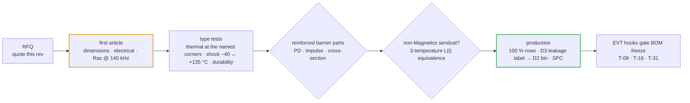

# 📦 Magnetics RFQ Pack

One quote-ready sheet per magnetic, with the sourcing directory and the first-article method

  
  
  
  

> [!NOTE]
> **Purpose** — One controlled spec sheet per magnetic — quote-ready: electricals, construction, insulation, parasitics, thermal, production tests, sourcing.
>
> **Gate coupling** — magnetics-rfq-audit: 0 missing fields · mag-sync (E59) pins every identity + computed mass · **conductor-audit (E60) computes every Rac row at the simulated currents** · **magnetics-envelope (E65) proves every D2 / D3 construction at every power-solved corner — flux, core and copper loss, two-node thermal, runaway margin, one lost gap pad**. Build process: [`magnetics-build-instructions.md`](magnetics-build-instructions.md).

> [!IMPORTANT]
> **E65 construction revision — quote THIS rev for D2 and D3.** D3-30 moves to **2 × E70/33/32, 7:7:7** and D3-50 to
> **3 × E70/33/32, 5:5:5** (new p/n `XFMR-LLC-3E70-50`); D3-40 keeps 2 × E70, 6:6:6. D2 now carries ~all of Lr:
> **1 × E70, N 8, 6112 × 0.05 mm** (30 kW) and **2 × E70, N 5, 8149 × 0.05 mm** (40 / 50 kW). Every D2 and D3 is
> VPI class H, bonded on both yoke faces and fitted with a 130 °C cutout; the E60 foil gauges and 0.071 mm primary strands stand.
> Why: flux had been checked at resonance, but the power-solved decks run 77–88 kHz at bank 500–525 V, where the registered
> D3 parts ran 153–237 mT; stacked PQ50/50 sets cannot be wound; and the "engineered 3 µH" leakage computes 0.14–0.20 µH.
> History: [decision register](assumptions.md) (E65) · copper reasoning: [`conductor-selection.md`](conductor-selection.md).

**Scope:** every magnetic on the 30 / 40 / 50 kW modules, one controlled sheet each, written so a
winding house can quote and build without asking questions. Electricals trace to
[`magnetics.md`](magnetics.md) (the design record) and the E51 and E65 recomputations; this pack adds the
drawing-control block, parasitic limits, construction/lay-up detail, and per-part production-test
tables that §0 of magnetics.md listed as open. Where the two disagree, **this pack is the newer
rev** and magnetics.md carries the history.

Drawing numbers: `PMP-MAG-<part>-<sku>` rev letter per row. Common requirements (§C below) apply
to every sheet. Insulation values follow [`insulation-coordination.md`](insulation-coordination.md)
(PD2 / material IIIa; reinforced pri↔sec on the board = 12.6 mm creepage / 8.0 mm clearance). The
winding-surface creepage, routine hipot and PD / impulse levels of each barrier part are set on its
own sheet (D3: E65).

## Sheet index

| Sheet | Part | Rev | Order code | Qty / module | Quote note |
|---|---|---|---|---:|---|
| [PMP-MAG-D1-30](#pmp-mag-d1-30-rev-c-e65--pfc-swing-choke-165-µh-class-ind-pfc-165u--qty-3) | PFC swing choke 165 µH class | B | `IND-PFC-165u` | 3 | 3 × 0077908A7, lot-trim ± 1 turn |
| [PMP-MAG-D1-40](#pmp-mag-d1-40-rev-c-e65--pfc-swing-choke-40-kw-ind-pfc-116u-40--qty-3) | PFC swing choke 40 kW | B (E51) | `IND-PFC-116u-40` | 3 | 5-stack, N = 26 ± 1 |
| [PMP-MAG-D1-50](#pmp-mag-d1-50-rev-c-e65--pfc-swing-choke-50-kw-ind-pfc-107u-50--qty-3) | PFC swing choke 50 kW | B (E51) | `IND-PFC-107u-50` | 3 | 5-stack, N = 24 ± 1 |
| [PMP-MAG-D3-30/40/50 rev D](#pmp-mag-d3-304050-rev-d-e67--full-bridge-transformer-cells-xfmr-llc-cell--qty-2) | full-bridge transformer cells | **D (E67)** | `XFMR-LLC-CELL-2E70-30 / -3E70-40 / -3E70-50` | 2 | primaries in series → n 2 — reinforced barrier, safety-critical hipot |
| [PMP-MAG-D2-30/40/50 rev F](#pmp-mag-d2-304050-rev-f-e67--external-resonant-inductor-ind-lr-e70--qty-1) | external resonant inductor | **F (E67)** | `IND-LR-E70-30 / -40 / -50` | 1 | gapped E70 pair, ±3 %, no bins |
| [PMP-MAG-D8-30/40/50](#pmp-mag-d8-304050-e67--bank-filter-inductors-ind-bank--qty-2) | bank filter inductors | ~~A (E67)~~ retired (E68c) | `IND-BANK-30 / -40 / -50` | 2 | the D6 construction at DC duty |
| [PMP-MAG-D2-30](#pmp-mag-d2-30-rev-e-e65--resonant-trim-inductor-bin-set-ind-trim-bin4--qty-3) | resonant trim bin set 30 kW | ~~E (E65)~~ superseded (E67) | `IND-TRIM-BIN4` | 3 | 1 × E70, N 8, 6112 × 0.05 litz — 4 bins |
| [PMP-MAG-D2-40](#pmp-mag-d2-40-rev-e-e65--trim-bin-set-40-kw-ind-trim-e70-40--qty-3) | resonant trim bin set 40 kW | ~~E (E65)~~ superseded (E67) | `IND-TRIM-E70-40` | 3 | 2 × E70, N 5, 8149 × 0.05 litz — 4 bins |
| [PMP-MAG-D2-50](#pmp-mag-d2-50-rev-e-e65--trim-bin-set-50-kw-ind-trim-e70-50--qty-3) | resonant trim bin set 50 kW | ~~E (E65)~~ superseded (E67) | `IND-TRIM-E70-50` | 3 | the D2-40 build with its own bins — liquid and air |
| [PMP-MAG-D3-30](#pmp-mag-d3-30-rev-c-e65--llc-transformer-10-kw-xfmr-llc-10k--qty-3) | LLC transformer 10 kW | ~~C (E65)~~ superseded (E67) | `XFMR-LLC-10K` | 3 | 2 × E70, 7:7:7 — reinforced barrier, safety-critical traveler |
| [PMP-MAG-D3-40](#pmp-mag-d3-40-rev-c-e65--llc-transformer-136-kw-xfmr-llc-2e70-40--qty-3) | LLC transformer 13.6 kW | ~~C (E65)~~ superseded (E67) | `XFMR-LLC-2E70-40` | 3 | 2 × E70, 6:6:6 — E60 winding, now VPI + two-face bond |
| [PMP-MAG-D3-50](#pmp-mag-d3-50-rev-c-e65--llc-transformer-17-kw-xfmr-llc-3e70-50--qty-3) | LLC transformer 17 kW | ~~C (E65)~~ superseded (E67) | `XFMR-LLC-3E70-50` | 3 | 3 × E70, 5:5:5 — custom 3-set former (tooling) |
| [PMP-MAG-D4](#pmp-mag-d4-rev-e-e65--aux-flyback-transformer-xfmr-aux-fly-e--qty-1) | aux flyback transformer | D (E52) | `XFMR-AUX-FLY-E` | 1 | reinforced — 100 % hipot |
| [PMP-MAG-D6](#pmp-mag-d6-304050-rev-c--dm-line-chokes-dm-choke-30-40-50--qty-3-each) | DM line chokes | ~~C~~ retired (E68b) | `DM-CHOKE-30/-40/-50` | 3 | engine-designed, crest-biased floors |
| [PMP-MAG-D7](#pmp-mag-d7-30-40-50-rev-b--3-phase-cm-chokes-cmc-3ph-2mh-sku--qty-2-each) | 3-phase CM chokes 40 / 50 kW | A | `CMC-3PH-2mH-SKU` | 2 | 30 kW buys the Schaffner catalog part |
| [CT buy specs](#ct-buy-specs-catalog--quote-bare-burden-lives-on-the-pcb) | line and resonant CTs | — | Talema ACX / AS | 3 + 3 | quote bare — the burden lives on the PCB |

## From quote to production

## C — Common requirements (all parts)

| Item | Requirement |
|---|---|
| Insulation system | **UL 1446-recognised SYSTEM, Class F (155 °C) minimum; Class H (180 °C) for D2 and D3 (E65 — VPI class H).** Every material inside a barrier (tapes, former, strand enamel, TIW / FIW, resin) is qualified within that system. Organic materials UL 94 V-0. |
| TIW / FIW grade (E65) | **Class F (155 °C) minimum** wherever the wire forms part of a barrier; a Class B grade (e.g. Furukawa TEX-E) is for non-barrier use only. |
| Thermal basis | Full power to +55 °C ambient, derate to +75 °C (A11). D1 / D4 / D6 / D7: ΔT limits and thermocouple positions per sheet. **D2 / D3 (E65): hot-spot type test, bonded as in service, at the simulated corners named on each sheet** — accept ≤ 125 °C in the 55 °C-inlet full-power state and ≤ 135 °C in the 75 °C-inlet derated state (40 % power: copper scales, core flux does not). Boundary as the `magnetics-envelope` gate models it: air SKUs — web = inlet + 5 K + 20 K × load, air = inlet + 10 K × load at 2.0 / 2.5 / 3.2 m/s (30 / 40 / 50 kW air); 50 kW liquid — plates 65 °C, still internal air 65 °C + 45 K × load (sealed module). Record the gate value beside each reading; a simulation-vs-bench delta above 20 % reopens the gate ([EVT reopen rule](evt-plan.md)). |
| VPI (E65 — D2, D3) | **Vacuum-pressure impregnation with a solventless Class H resin**; impregnated-winding through-build conductivity **≥ 0.6 W/m·K** (the envelope gate basis — the thermal type test demonstrates it); full penetration of litz and foil stacks, shown on the first-article cross-section; bond faces and termination tips masked. |
| Two-face bond (E65 — D2, D3) | **Both yoke faces are bond faces:** flat ≤ 0.5 mm, clean ferrite, no varnish, tape, banding or hardware on them. In the module each face is gap-padded (3 W/m·K class) to the upper and lower extrusion webs (air SKUs) or to the two coldplates (50 kW liquid). D3-40 / D3-50 end turns, and D2-50 on the liquid SKU, are potted to the web or plate (≥ 0.8 W/m·K silicone, ≥ 5 mm bridge) — deliver end-turn surfaces free of release agents. |
| Bonded-face insulation (E65) | Applies to every part bonded to a PE-bonded web or plate. Core and clamps **float**; each bond face carries **basic insulation to PE** through a glass-reinforced insulating gap pad ≥ 0.5 mm with a cut-through rating above the clamp pressure (module bond kit). **100 % hipot at the winder, winding → foil wrapped over the bond faces: 2.5 kV DC for primary / mains windings, ≥ 1.5 kV DC for D3 secondaries.** D2 / D3 windings see ≈ 1.1 kV recurring peak at 77–190 kHz, so both carry a PD sample row. **E67/E68: 1260–1280 V at 83–203 kHz → PD extinction ≥ 2.0 kV on every SKU (E69a).** |
| Over-temperature cutout (E65 — every D2 and D3) | **NC hermetic snap-action thermostat, 130 ±5 °C**, gold dry-circuit contacts, **reinforced-insulated case and leads** (it sits on an HV winding and closes a low-voltage loop). One per D2 and D3 — 6 per module on every SKU (**E67: one per D3 cell and one on D2 — 3 per module**) — mounted on the part at the hot-spot witness point and series-wired into the T_XFMR NTC loop. An open cutout or a broken lead drives the channel to the rail; firmware reads 150 °C and latches F.22. It covers a lost gap pad: the envelope gate requires it on D3-40 and on D3-50 + D2-50 of the liquid SKU, and it is fitted on all. The thermostat is a module mech line (₹48 each); the winder quotes fitting it. |
| Low-temp / environment | **A11 rev C (E60, competitor parity):** operating −30…+55 °C full power (derate to +75), cold start ≥ −30 °C, storage/transport −40…+85 °C — quote adhesives/potting/litz bonding to −40 °C. Humidity 5–95 % RH non-condensing; boards are acrylic conformal-coated (E52 baseline) — parts must accept coated boards adjacent. |
| Vibration | 2 g 10–500 Hz sine sweep survival (bonded/banded construction; IEC 60068-2-6 class) — toroid stacks epoxy-banded, not tape-only. |
| Thermal shock and durability (E65) | Workmanship screen on every p/n at first article: IEC 60068-2-14 Na, 5 cycles **−40 ↔ +135 °C**, then re-test the electrical row. **Durability type test** (first article; D1-50 and D3-50 on a PCB coupon as the worst cases): ≥ 500 air-to-air cycles −40 ↔ +135 °C, or ≥ 3,000 on/off power cycles at class current — accept lead-joint resistance change ≤ 10 %, AL / Lm within ±3 %, no crack on cross-section, hipot pass. |
| Traceability | Lot + date code on every part, traceable to core lot and wire lot. First article: dimensional vs the mechanical row, full electrical vs the acceptance rows, cross-section/teardown for D3 and D4 (reinforced-barrier parts). **D3 carries its measured leakage and D2 its bin on the label — kitting consumes both.** **E67: no bins — D2 is gapped to ±3 %, each D3 cell carries its measured leakage for the record; EOL checks fr.** |
| 100 % tests | Every acceptance-row electrical + every stated hipot, 100 % end-of-line at the winder. Sampled tests marked (S). |
| Packaging | Individually celled — computed masses (E59 / E65): D1 ≈ 2.2–3.0 kg · D3 ≈ 1.32–1.97 kg · D2 ≈ 0.70–1.27 kg (E67: D3 cell 1.3 / 1.85 kg · D2 1.3–1.35 kg · D8 as D6); parts damage each other in bulk packing. |
| Price basis [est] (E65 — D2, D3) | E65 roll-up @1k, **REVIEW at winder RFQ:** E70/33/32 PC95-class set ₹160 · litz 0.05 mm ₹2,600/kg · TIW-served 0.071 mm litz ₹2,210/kg · Cu foil ₹1,050/kg · +10 % leads · former ₹40–105 · insulation ₹30–90 · gap work ₹40–110 · labour + test ₹110–240 · varnish ₹30–40. D1 / D6 / D7 stay on their registered basis until re-based at RFQ. |
| RoHS/REACH | Required; declare materials on first article. |

**Core / material / wire sourcing directory** (design intent — purchasing selects within class):

| Class | Primary | Alternates (qualified equivalents) |
|---|---|---|
| Sendust (Kool Mµ-class) toroids 26µ/60µ | Magnetics Inc 0077908A7 (T79 26µ), 0077439A7 (T48 60µ) | Chang Sung (KR) CS series · POCO (CN) KS series · DMEGC sendust — **AL and roll-off curve must match the Magnetics part within ±8 % / anchors in A3** |
| T57 60µ toroid (OD57/ID26/H20) | **Chang Sung CH571060** (High Flux µ60; cross: Magnetics 58192-A2) — the core Microchip's 30 kW Vienna reference runs at 46 A rms/140 kHz (deep-research verified 2026-09-12) | POCO KS-571060-class sendust — High Flux rides HIGHER than the sendust design anchors (better bias, Bsat 1.5 T), so the D6 floors only gain margin; sample-measure L(I) before PO either way |
| PC95-class MnZn ferrite (E70/33/32 — D2, D3 · ETD39 — D4) | TDK PC95 / N95 (E70/33/32, B66371 family) · Ferroxcube 3C95 (E71/33/32) | DMEGC DMR95/DMR96A · TDG · Acme — incoming loss ≤ A4 fit (396 mW/cm³ @100 kHz/±200 mT/100 °C; the `magnetics-envelope` N95 basis sits just above that point, so an accepted lot is inside the thermal proof). **An equivalent E70 set must hold the 65.9 mm yoke-face-to-yoke-face height and fit the TDK formers** — both yoke faces are bond faces. The gap is ground to AL, so Ae differences are absorbed; re-check B̂ against the sheet if the proposed Ae is below 683 mm². Cosmo Ferrites (India) = N87-class only; PC95-class stays import (recorded) |
| E70 formers | TDK **B66372B1000T001** (1-set, lN 166 mm — D2-30) · **B66372B2000T001** (2-set, AN 389 mm², lN 230.5 mm — D3-30, D3-40, D2-40, D2-50) · **3-set former, lN 293 mm — CUSTOM for D3-50** (TDK lists 1- and 2-set only; tooling amortised in the part price) | mechanically-equivalent CN former tooling dimensioned per the TDK drawing (each added set lengthens lN by 63.2 mm) — material qualified within the Class H system |
| Litz (served, compacted/profile) | Elektrisola (incl. Elektrisola India for bare litz) | Pack Litz · New England Wire — **0.05 mm strands, compacted (D2, E65)** and **0.071 mm / AWG 41 strands, TIW-served profile (D3 primaries, E60 / E65)**; grade 1–2 solderable polyurethane (Class 155/180) qualified within the Class H system |
| Copper foil (D3 secondaries) | Cu-ETP/Cu-OF annealed foil **0.10 mm (30 kW) · 0.127 mm (40/50 kW)** × 28 mm, deburred slit edges | any EN 13599/ASTM B152 mill — thickness tolerance ±8 %; the foil gauge is an electrical parameter (Dowell), not a mechanical choice |
| TIW / FIW barrier | **Class F (155 °C) minimum TIW grade**, recognised within the winder's UL 1446 system · FIW per IEC 60317-56 | Rubadue Tri-Ins. — TIW on litz = served litz inside extruded triple wall · **Furukawa TEX-E is Class B: non-barrier use only (E65)** |
| Nanocrystalline CMC cores | VAC VITROPERM 500F (T60006 class) | King Magnetics · Qingdao Yunlu · AT&M — Schaffner RT8131-63-2M8 is the 30 kW catalog part |
| CTs | Talema ACX-1100 (line) / AS-404 (resonant), Salem India | ZEMCT/HCT class (line) · Coilcraft CST2010-100L (resonant) |
| Winding houses (10k modules/yr ⇒ ~30k D1+D3 pcs/yr each) | Talema Salem (toroids/CTs, India) · EV-magnetics houses CN (Sumida-class, POCO winding service) | second source mandatory before MP; the D3/D4 reinforced barrier makes the winder a SAFETY-CRITICAL supplier (traveler flag) |

---

## PMP-MAG-D3-30/40/50 rev D (E67) — full-bridge transformer cells (`XFMR-LLC-CELL`) — qty 2

| Row | D3-30 cell `XFMR-LLC-CELL-2E70-30` | D3-40 cell `XFMR-LLC-CELL-3E70-40` | D3-50 cell `XFMR-LLC-CELL-3E70-50` |
|---|---|---|---|
| Function | one of TWO cells in a full-bridge LLC; the two primaries are wired in SERIES (overall n = 2), each secondary feeds one bank · 83–203 kHz across the power-solved corners · flux follows bank voltage, not load | same, 40 kW | same, 50 kW |
| Ratio / magnetizing | **6:6∥6 exactly** (P : S1 ∥ S2, S1 and S2 paralleled at the header) · Lm **28 µH ±7 %** per cell @10 kHz, 0.1 V, secondary open | **4:4∥4** · Lm **21.75 µH ±7 %** | **4:4∥4** · Lm **17.8 µH ±7 %** |
| Core | 2 × E70/33/32 PC95 / N95 / 3C95-class MnZn | 3 × E70/33/32 | 3 × E70/33/32 |
| Former | TDK **B66372B2000** (2-set, lN 230.5 mm) | 3-set former, lN 293 mm (custom, tooling in price) | as D3-40 |
| Gap | centre legs only, ground to AL **0.778 µH/T²** assembled (Σ ≈ 2.2 mm, every set the same gap, no single gap > 0.5 mm) | AL **1.359 µH/T²** (Σ ≈ 1.9 mm) | AL **1.113 µH/T²** (Σ ≈ 2.3 mm) |
| Windings | S1 inner: 6 T Cu foil 0.10 × 28 mm · P: 6 T TIW-served litz **3850×0.063 mm** (12 mm²), one layer · S2 outer: 6 T foil 0.10 × 28 mm · MLT S1 / P / S2 189 / 211 / 232 mm | S1: 4 T, **2 × foil 0.08 × 28 mm per turn** · P: 4 T litz **3536×0.071 mm** (14 mm²) · S2: as S1 · MLT 253 / 272 / 290 mm | as D3-40 |
| Leakage | per cell, both halves shorted, 140 kHz, fixture-compensated, after VPI: **0.172 µH ±30 %** — labelled | **0.090 µH ±30 %** | **0.090 µH ±30 %** |
| Rdc @25 °C (100 %) | P ≤ 2.1 · S1 half ≤ 8.0 · S2 half ≤ 9.8 mΩ | P ≤ 1.55 · S1 ≤ 4.5 · S2 ≤ 5.1 mΩ | as D3-40 |
| Rac (S) | Rac/Rdc ≤ 1.35 per winding at 203 kHz (computed S 1.23 · P 1.32) | computed S 1.17 · P 1.25 | as D3-40 |
| Insulation system | Class H — **VPI class H** · TIW grade Class F minimum · pri↔sec REINFORCED, one barrier system (TIW wall + ≥ 3 barrier-tape layers between each shield and its secondary) · shields to the SH pin → **DCN** on the board | same | same |
| Hipot · PD | **100 %: pri↔sec ≥ 4.25 kV DC 1 s** (safety-critical, witnessed, logged) · P → bonded-face foil 2.5 kV DC · S → foil 1.5 kV DC · PD type test + 5 / lot: extinction **≥ 2.0 kV pk** (E68), ≤ 10 pC after 1.2× pre-stress | same, ≥ 2.0 kV (E69a) | same, **≥ 2.0 kV** |
| Flux / loss (magnetics-envelope) | B̂ 159 mT at ENV500-55 (87.7 kHz) · Fe 31.9 W · Cu 45.8 W at SER250-full-bus764 (203 kHz) · runaway margin 116 K | B̂ 159 mT · Fe 47.6 W · Cu 46.1 W · margin 115 K | B̂ 159 mT · Fe 47.5 W · Cu 71.3 W · margin 111 K |
| Thermal type test | bonded, §C boundary: ≤ 125 °C at 55 °C inlet at SER250-full-bus764 (gate **106 °C**) · ≤ 135 °C at 75 °C inlet derated at ENV500-55 (gate 102 °C) · thermocouples at the winding outer surface and centre leg | gate 102 °C / 103 °C | gate 103 °C liquid · **116 °C air** / 84 · 103 °C |
| Mounting | two-face gap-pad bond to the upper and lower webs (plates on the liquid 50) + clamp bars, end turns potted to the web · a lost bond is screened by the EOL bonded thermal soak | same | same |
| Over-temperature cutout | one §C thermostat (130 ±5 °C NC) per cell at the winding hot-spot witness point — required: a lost face is not survivable on D3-30/40/50 liquid (magnetics-envelope `D3-BOND-LOST`) | same | same |
| Terminations | primary header P1 · P2 · SH on one end-turn face · secondary header SA · SB on the opposite face, ≥ 8 mm plus a slot between groups | same | same |
| Mechanical (envelope · mass) | ≤ 70.5 × 65.9 × 91 mm plus headers · 65.9 mm yoke-face height controlled · **1.3 kg** (computed — mag-sync) | ≤ 70.5 × 65.9 × 120 mm · **1.85 kg** | as D3-40 |
| Marking | p/n · rev · lot / date · serial · measured leakage (µH to 0.01) · polarity dots (dot = start, all windings the same sense) | same | same |
| Production test | 100 %: ratio, Lm, leakage + label, Rdc × 3, pri↔sec and bonded-face hipots · (S): Rac 5 / lot, PD 5 / lot · first article: dimensional, cross-section, impulse, PD type test, thermal type test | same | same |
| Qty · price | 2 per module · **₹1,169 @1k [est]** per cell (E67 roll-up, §C basis) | 2 per module · **₹1,434 @1k [est]** | 2 per module · **₹1,434 @1k [est]** |

**Winding table (each cell)** — radial order from the centre leg; breadth 41 mm; conductors confined to the 28 mm centre band
(6.5 mm margins); built with the same barrier discipline as the E65 section transformer, so the insulation qualification carries.

| # | Element | D3-30 | D3-40 / D3-50 | Laid over it |
|---:|---|---|---|---|
| 0 | former + base wrap | 1.2 mm wall | 1.2 mm wall | ≥ 2 layers barrier tape |
| 1 | **S1** (half of the secondary) | 6 T foil 0.10 × 28 mm | 4 T, 2 × foil 0.08 × 28 mm per turn | ≥ 3 layers barrier tape |
| 2 | shield 1 | 1 T foil, ends insulated | same | 1 layer tape |
| 3 | **P** | 6 T TIW litz 3850×0.063 mm, one layer | 4 T TIW litz 3536×0.071 mm, one layer | 1 layer tape |
| 4 | shield 2 | as shield 1 | same | ≥ 3 layers barrier tape |
| 5 | **S2** (the other half) | 6 T foil 0.10 × 28 mm | as S1 | ≥ 2 layers outer wrap |

## PMP-MAG-D2-30/40/50 rev F (E67) — external resonant inductor (`IND-LR-E70`) — qty 1

| Row | D2-30 `IND-LR-E70-30` | D2-40 `IND-LR-E70-40` | D2-50 `IND-LR-E70-50` |
|---|---|---|---|
| Function | the ONE external resonant inductor of the full-bridge tank — Lr 5.6 µH total = this part + 2 × D3 cell leakage + 0.1 µH loop · full AC swing at tank potential, 83–203 kHz | Lr 4.35 µH total | Lr 3.56 µH total |
| Inductance | **5.16 µH ±3 %** @140 kHz, 0.1 V — no bins | **4.07 µH ±3 %** | **3.28 µH ±3 %** |
| Core | 2 × E70/33/32 PC95 / N95 / 3C95-class — powder cores PROHIBITED in this slot | same | same |
| Former | TDK **B66372B2000** | same | same |
| Winding | N = 5, compacted litz **8000×0.05** mm (15.7 mm²), one layer over a ≥ 3 mm radial spacer | N = 5, litz **10000×0.05** mm (19.6 mm²) | N = 5, litz **12000×0.05** mm (23.6 mm²) |
| Gap | distributed centre-leg gap Σ ≈ 8.3 mm, every segment ≤ 1.0 mm, outer legs mated | Σ ≈ 10.5 mm | Σ ≈ 13.1 mm |
| Rdc · Rac | Rdc ≤ 1.35 mΩ @25 °C (100 %) · Rac ≤ 3.35 mΩ @203 kHz, 100 °C (S, 5 / lot) | ≤ 1.1 · ≤ 3.45 mΩ | ≤ 0.92 · ≤ 3.7 mΩ |
| Flux / loss (magnetics-envelope) | B̂ 88 mT · Fe 30.6 W + Cu 15.1 W at SER250-full-bus764 · fault flux at the F.11 kill ≤ 60 % Bsat(130 °C) | B̂ 91 mT · 33.1 + 27.3 W | B̂ 90 mT · 32.8 + 45 W |
| Thermal type test | bonded: ≤ 125 °C at 55 °C inlet (gate **95 °C**) · thermocouples beside a gap and on the winding | gate 100 °C | gate 98 °C liquid · 110 °C air |
| Insulation · hipot | basic insulation to PE through former + spacer + VPI class H · 100 % winding → bonded-face foil 2.5 kV DC · PD 5 / lot ≥ 2.0 kV extinction (E68) | ≥ 2.0 kV (E69a) | ≥ 2.0 kV |
| Over-temperature cutout | one §C thermostat (130 ±5 °C NC) beside a gap — fitted on every SKU; required on D2-50 liquid (lost face runs away) | same | same |
| Mounting · terminations | two-face bond, end turns potted · 2 litz flying leads out of one end-turn face, tinned 12 mm | same | same |
| Mechanical · marking | ≤ 70.5 × 65.9 × 59 mm · 1.3 kg · label p/n, rev, lot, serial, measured L | 1.3 kg | 1.35 kg |
| Qty · price | 1 per module · **₹965 @1k [est]** | **₹1,077 @1k [est]** | **₹1,191 @1k [est]** |

**Lr at kitting (no bins).** D2 is gapped to ±3 %; each D3 cell is labelled with its measured leakage (accept ±30 % of the
computed value). The stack is inside the ±5 % Lr the tank decks were solved at; EOL confirms fr = 140 kHz ± 5 % on the
assembled module (resonant CT phase sweep).

## PMP-MAG-D8-30/40/50 (E67) — bank filter inductors (`IND-BANK`) — qty 2

> [!WARNING]
> **RETIRED at E68c — do not quote.** The output banks are film-only (9 / 12 / 14 × 2.2 µF 630 V per bank, 0.5 % RMS ripple
> gated at −10 % C in `current-coordination`), so no bank inductor exists in the BOM. Kept as the E67 record.

| Row | D8-30 `IND-BANK-30` | D8-40 `IND-BANK-40` | D8-50 `IND-BANK-50` |
|---|---|---|---|
| Function | one per bank, between the rectifier film and the 330 µF 550 V electrolytic — DC at 60 A (HIGH-mode floor) with a small 2·fsw ripple | DC 80 A | DC 100 A |
| Construction | **the PMP-MAG-D6-30 part as drawn** (2 × T48 60µ sendust, N = 7, foil 20 mm²) | the D6-40 part (2 × T57 60µ, N = 8, 26.4 mm²) | the D6-50 part (3 × T57 60µ, N = 8, 26.4 mm²) |
| Acceptance | L ≥ 7.4 µH at 82 A (the D6 line) · Rdc per D6 · ΔT ≤ 45 K at the DC duty (computed 14 K) | L ≥ 10.5 µH at 109 A · ΔT 17 K | L ≥ 12.9 µH at 136 A · ΔT 22 K |
| Everything else | per the D6 sheet (insulation, hipot, mounting, marking, production test) | same | same |
| Qty · price | 2 per module · **₹300 @1k [est]** | **₹465 @1k [est]** | **₹630 @1k [est]** |

## PMP-MAG-D1-30 rev C (E65) — PFC swing choke, 165 µH class (`IND-PFC-165u`) — qty 3

| Row | Spec |
|---|---|
| Function / circuit | Vienna PFC phase inductor, 50 kHz boost duty, DC bias + ripple (swing design). Winding at line / switch-node potential; bonded to PE-bonded metal, so part of the basic barrier to PE |
| Core | **3× Magnetics 0077908A7** Kool Mµ 26µ toroid (coated OD 78.94 max / ID 48.21 min / HT 17.02 max; AL 37 nH/T² ±8 % per core; Ae 221 mm², le 196 mm, Ve 43.4 cm³, 240 g). Faces epoxy-bonded (≤ 0.1 mm line), stack 51.3 mm. Distributed gap — no grinding |
| Winding | **N = 39 nominal, winder trims ±1 turn per core lot.** Conductor **9 × 1.6 mm grade-2 dual-coat enamelled round (IEC 60317-13, Class 200), 18 mm² class**, taped into one bundle every 150 mm and **laid flat, no deliberate twist** (the loss rows assume the twisted case; flat lay only adds margin). Spread ≥ 300°; bore layers 21 / 15 / 3; one OD layer. **The 3 × (6 × 1 mm) flat-on-edge alternate is withdrawn** — its 6 mm dimension lies across the 50 kHz bore field |
| Electrical acceptance (100 %) | L₀ @ 0.1 V / 100 kHz: **150–185 µH** · **L @ 78 A pk (pulse method) ≥ 75 µH** · **Rdc ≤ 6.9 mΩ @ 25 °C** (4-wire, temperature-corrected; build 6.08 mΩ) **and within ±5 % of the lot median** (median of the lot's first five parts at the lot's N) — one open strand reads +12.5 % |
| Operating point (info, computed — `conductor-audit` / `stress-audit`) | 330 VAC, bus 830 V, AL −8 %: 54.7 A fundamental rms + 6.30 A rms 50 kHz ripple (ΔB 90 mT pp) → Cu 23.4 W (50 Hz) + 14.8 W (ripple, Fr 47.5) + Fe 4.7 W (iGSE, datasheet max) = **42.9 W** at 100 °C · 400 VAC rated 28.0 W · J 3.05 A/mm² |
| Parasitics | SRF ≥ 500 kHz (≥ 10 × fsw) · winding ↔ bond-face capacitance recorded at first article (EMI budget) |
| Insulation | **Basic insulation to PE (E65):** winding ↔ bond face = the module's gap pad; winding ↔ M6 bolt = bore sleeve + clamp cap; recurring peak **≤ 540 V** (switch end vs neutral) → no PD test. Winding ↔ core (0.13 mm polyester wrap + enamel) stays functional. Class F (155 °C) UL 1446 system |
| Thermal | **One end face gap-pad bonded to the PE-bonded AC-DC extrusion web** (bonded face flat ≤ 0.5 mm, varnish-free). Computed hot-spot **87 °C** at 55 °C inlet · 92 °C at 75 °C inlet derated · 89 °C with every thermal resistance +25 % · bond lost 131 °C (≤ Class F). Limits 120 / 130 / 145 °C. **Bonded type test** (first article + 1 / lot): bonded face on a plate held at 80 °C, still air, **74 A DC** → inner-bore hot-spot **≤ 19 K above the plate** (calc 9.4 K) |
| Mechanical | Finished ⌀ 91–92 mm × H 68–88 mm (compacted … round-bundle layers) — **exceeds the E60 ⌀ ≤ 87 × H ≤ 62 mm row: layout open item, not a part change**; mass **1.9 kg** (computed — `mag-sync`) |
| Mounting (module mount kit, E65) | fiberglass-reinforced silicone gap pad 1.0 mm (Shore 00 ≤ 70, ≥ 3 W/mK, ≥ 5 kVAC ASTM D149, qualified at its 0.8 mm compressed thickness for 2.5 kV DC 1 min and 4 kV impulse, RTI ≥ 150 °C, UL 94 V-0) · GF-PPS clamp cap on the top face (≥ 4.0 mm clearance / ≥ 5.5 mm creepage winding ↔ bolt head and washer) · bore sleeve ≥ 1.0 mm wall · **M6 A4-70 through the bore at 4.5 N·m (dry, K 0.2 → 3.75 kN)** on a Belleville washer · pad 0.58 MPa · **2-point glass banding to the web** (now on every D1) |
| Terminations | 2 × tinned flying leads, 60 mm, **Ω strain-relief loop ≥ 10 mm before the board, lead bundle tied to the clamp cap**. Per-strand continuity check before tinning |
| Production test | 100 %: L₀ · L @ 78 A pulse · Rdc (row + lot window) · **hipot 2.5 kV DC 1 min winding ↔ bond-face plate electrode + bore mandrel electrode** (replaces 500 VAC winding–core). (S) 1 / lot: L(I) 0–100 A, bonded thermal type test. First article: 4 kV 1.2/50 impulse × 5 each polarity on the bonded assembly, Rac @ 50 kHz recorded (information) |

## PMP-MAG-D1-40 rev C (E65) — PFC swing choke 40 kW (`IND-PFC-116u-40`) — qty 3

As D1-30 except:

| Row | Spec |
|---|---|
| Core | **5 × 0077908A7** stacked (same p/n; stack H 85.5 mm, epoxy-bonded) |
| Winding | **N = 26 ± 1 lot-trim**, **13 × 1.6 mm** grade-2 enamelled bundle (26 mm² class), laid flat; bore layers 17 / 9; spread ≥ 300°. **The 8 × 2.0 mm alternate is withdrawn** (not evaluated by the D1 gate — re-admit only through `d1-fd` + `stress-audit`) |
| Electrical acceptance | L₀ **106–135 µH** (116 nominal) · **L @ 104 A pk ≥ 61 µH** · **Rdc ≤ 4.55 mΩ @ 25 °C** (build 3.97) + **±5 % lot window** (one open strand +8.3 %) |
| Operating point | 72.9 A fundamental + 7.83 A rms ripple (ΔB 82 mT pp) → Cu 27.2 + 13.6 W (Fr 43.2) + Fe 6.35 W = **47.2 W** at 100 °C · rated 31.5 W · J 2.84 |
| Thermal | web-bonded: hot-spot **88 °C** · 92 °C derated · 91 °C at +25 % · bond lost 116 °C · type test **95.9 A DC → ≤ 22 K** above the plate (calc 11.6 K) |
| Mechanical | ⌀ 93–94 × H 100–115 mm (layout open item); mass **2.8 kg** (computed); clamp preload needed 2.72 kN vs 3.75 kN fitted |
| Note | Rev B was re-issued on the catalog core (E51); rev C changes cooling, insulation, mount, Rdc rows and withdraws the unmodelled alternate — electrical design (N, L rows) unchanged |

## PMP-MAG-D1-50 rev C (E65) — PFC swing choke 50 kW (`IND-PFC-107u-50`) — qty 3

As D1-40 except:

| Row | Spec |
|---|---|
| Winding | **N = 24 ± 1 lot-trim**, 13 × 1.6 mm bundle; bore layers 17 / 7 |
| Electrical acceptance | L₀ **98–124 µH** (107 nominal) · **L @ 129.5 A pk ≥ 45 µH** · **Rdc ≤ 4.15 mΩ @ 25 °C** (build 3.63) + ±5 % lot window |
| Operating point | 91.2 A fundamental + 10.16 A rms ripple (ΔB 87 mT pp) → Cu 38.9 + 17.9 W (Fr 37.1) + Fe 7.5 W = **64.4 W** at 100 °C · rated 42.4 W · J 3.55 · dIpp basis 36.2 A pp (E51) unchanged |
| Cooling interface | liquid module: one end face gap-pad bonded to the coldplate → hot-spot **81 °C** (73 °C derated, 85 °C at +25 %); **a lost pad has no air fallback in the sealed module → D1 over-temperature cutout: NC thermostat 130 ± 5 °C on each D1 clamp cap, in the magnetics cutout loop** · air twin: web-bonded → **92 °C** (94 / 96 °C), bond lost 129 °C · type test **117.3 A DC → ≤ 26 K** (calc 16.3 K) |
| Mass / mount | **2.7 kg** (computed); clamp preload needed 2.60 kN vs 3.75 kN fitted |
| Note | 6-stack variant still declined (tunnel height — layout open item) |

Common-requirements table (§C) edits: **Vibration** row → "2 g 10–500 Hz sine: bonded + clamped + 2-point banded
construction on every D1; as-mounted resonance search EVT T-33". **Packaging** masses → "D1 ≈ 1.9–2.8 kg".

## PMP-MAG-D2-30 rev E (E65) — resonant trim inductor bin set (`IND-TRIM-BIN4`) — qty 3

| Row | Spec |
|---|---|
| Function | LLC external resonant inductor carrying **~all of Lr** (7.0 µH per section), full AC swing at tank potential — class 46.4 A rms (simulated 47 A rms), 82.3–188.8 kHz across the simulated corners |
| Core | **1 × E70/33/32 set, PC95 / N95 / 3C95-class MnZn** — powder cores PROHIBITED in this slot (E35) |
| Former | TDK **B66372B1000T001** (1-set, lN 166 mm) |
| Winding | **N = 8**, litz **6112 × 0.05 mm (12.0 mm² Cu)**, compacted, **one layer** across the 41 mm winding breadth, wound on a **≥ 3 mm radial spacer** over the former so the litz stays clear of the gap field · MLT 155 mm · start marked |
| Gap and bins | **Distributed centre-leg gap, every gap ≤ 1.0 mm**, outer legs mated. Ground per bin to the assembled-part AL **99.2 / 101.6 / 103.9 / 106.3 nH/T²** → **6.35/6.5/6.65/6.8 µH ±1.5 %** @140 kHz, 0.1 V (nominal 6.65). Closed-form total gap (µ0·N²·Ae / L, before fringing) 8.1–8.7 mm → at least 9 gaps; the count is frozen at first article so every gap stays ≤ 1.0 mm. Tooling: segmented centre leg (ferrite blocks + non-magnetic spacers) — quote it |
| Flux / loss (gate) | B̂ **82 mT** at the worst nominal peak on the bin-max unit (line ≤ 110 mT) · fault flux **130 mT** at the window-comparator kill peak (104.3 A) ≤ 217 mT = 60 % Bsat(130 °C) · Fe 11.5 W + Cu 10.6 W at SER250-full-tolLo (188.6 kHz) · runaway margin 163 K |
| Electrical acceptance (100 %) | L inside the ordered bin ±1.5 % @140 kHz, 0.1 V · **Rdc ≤ 1.95 mΩ @25 °C** (the build computes 1.81 — the row sits ≤ 15 % above it, so a short strand count fails) |
| AC resistance (S) | **Rac ≤ 4.5 mΩ @140 kHz, referred to 100 °C** (computed 3.93, Sullivan Fr 1.68) — 5 / lot |
| Parasitics | SRF ≥ 700 kHz (≥ 5× fr) · winding–core C ≤ 100 pF |
| Insulation system | Class H (VPI class H, §C). The core is bonded, so winding → core → bond face is **basic insulation to PE** at a recurring peak of 0.84 kV (≈ 1.1 kV on the family), 77–190 kHz: former wall + ≥ 3 mm spacer + VPI. Lead-exit creepage and clearance to core and web: the primary↔PE basic values of [insulation coordination](insulation-coordination.md) — a tank-node row is a DQ item (D2-04) |
| Hipot · PD | **100 %: winding → foil over both yoke faces, 2.5 kV DC 1 s.** (S) PD, 5 / lot + type test, D3 method: extinction **≥ 1.3 kV pk**, ≤ 10 pC after the 1.2× pre-stress |
| Thermal type test | Bonded, §C boundary · corner **SER250-full-tolLo** — 188.6 kHz, 65.3 A pk / 45.1 A rms: ≤ 125 °C at 55 °C inlet (gate 99 °C, winding; core 93 °C) and ≤ 135 °C derated (gate 97 °C). Thermocouples: centre leg beside a gap (placed at assembly) and the winding outer surface at mid-breadth |
| Mounting | Two-face bond (§C) to the upper and lower extrusion webs; no potting at 30 kW · one lost pad computes 109 °C — survives; the cutout is fitted regardless |
| Cutout | 130 °C thermostat per §C at the hot-spot witness point |
| Terminations | 2 litz flying leads out of one end-turn face, served ends tinned 12 mm (U3) · lead length and land are layout-queue items ([footprints to draw](footprints-to-draw.md)) |
| Mechanical (envelope · mass) | ≤ 70.5 × 65.9 × 59 mm (E70 set; depth = 31.6 mm core + former and end turns over the 13.55 mm window each side) · the 65.9 mm yoke-face-to-yoke-face height is controlled — it sets the pad compression · mass **0.70 kg (computed — mag-sync)** |
| Marking | p/n · rev · lot / date · serial · **bin value + measured L** |
| Production test | 100 %: L in bin, Rdc, bonded-face hipot, label. (S): Rac 5 / lot, PD 5 / lot. First article: dimensional, thermal type test, shock and durability (§C) |
| Qty · price | 3 per 30 kW module · **₹886 @1k [est]** (E65 roll-up, basis §C) |
| History | rev C (E35 / E52): 2 × PQ50/50, N 4, 1350 × 0.1 mm, bins 3.3–4.35 µH — sized for an "engineered 3 µH" transformer leakage that no buildable interleave produces; the 2 × PQ50 wind also fitted only with zero gap clearance |

**Bin selection at kitting** (all three SKUs). Bin = Lr − (measured D3 leakage + 0.1 µH tank-loop stray); the four bins
cover leakage + stray from 0.125 to 0.725 µH at Lr(total) ±3 %. A D3 whose label falls outside 0.025–0.625 µH has
no bin and is rejected. The stray is measured once on the power PCB at EVT — a different stray moves these windows,
not the parts.

| Measured D3 leakage (µH) | D2-30 bin (µH) | D2-40 bin (µH) | D2-50 bin (µH) |
|---|---:|---:|---:|
| 0.025 to < 0.175 | 6.8 | 6.3 | 5.8 |
| 0.175 to < 0.325 | 6.65 | 6.15 | 5.65 |
| 0.325 to < 0.475 | 6.5 | 6.0 | 5.5 |
| 0.475 to 0.625 | 6.35 | 5.85 | 5.35 |

## PMP-MAG-D2-40 rev E (E65) — trim bin set 40 kW (`IND-TRIM-E70-40`) — qty 3

As D2-30 rev E except:

| Row | Spec |
|---|---|
| Function | carries ~all of Lr (6.5 µH per section) — class 61.9 A rms (simulated 61.5 A rms), 79.7–181.1 kHz |
| Core / former | **2 × E70/33/32 sets** on TDK **B66372B2000T001** (2-set, lN 230.5 mm — the D3 former) |
| Winding | **N = 5**, litz **8149 × 0.05 mm (16.0 mm² Cu)**, compacted, one layer on the ≥ 3 mm spacer · MLT 216 mm |
| Gap and bins | distributed centre-leg gap in **each** set — the sets are magnetically parallel, so every set carries the same gap — every gap ≤ 1.0 mm · assembled-part AL **234 / 240 / 246 / 252 nH/T²** → **5.85/6.0/6.15/6.3 µH ±1.5 %** (nominal 6.15) · closed-form gap 6.8–7.3 mm per set → at least 8 gaps per centre leg |
| Flux / loss (gate) | B̂ **80 mT** (bin-max, worst nominal peak) · fault flux **121 mT** at the 131.6 A kill peak · Fe 19.7 W + Cu 9.8 W at SER250-full-tolLo (181.1 kHz) · runaway margin 163 K |
| Electrical acceptance (100 %) | as D2-30, with **Rdc ≤ 1.3 mΩ @25 °C** (build 1.18) |
| AC resistance (S) | **Rac ≤ 2.6 mΩ @140 kHz, referred to 100 °C** (computed 2.25, Sullivan Fr 1.47) — 5 / lot |
| Insulation system | as D2-30, at a 0.98 kV recurring peak (D2-04) |
| Hipot · PD | as D2-30, with PD extinction **≥ 1.5 kV pk**, ≤ 10 pC |
| Thermal type test | Bonded, §C boundary · SER250-full-tolLo — 181.1 kHz, 86.4 A pk / 59.9 A rms: ≤ 125 °C at 55 °C inlet (gate 93 °C, winding; core 91 °C) and ≤ 135 °C derated (gate 97 °C) · thermocouples as D2-30 · one lost pad computes 103 °C — survives |
| Mechanical (envelope · mass) | ≤ 70.5 × 65.9 × 91 mm · mass **1.27 kg (computed)** |
| Qty · price | 3 per 40 kW module · **₹1,124 @1k [est]** |
| History | rev D (E60): 1 × E70, N 5, 4150 × 0.071 mm, bins 3.2 / 3.5 / 3.8 µH — same leakage premise as D2-30 rev C |

## PMP-MAG-D2-50 rev E (E65) — trim bin set 50 kW (`IND-TRIM-E70-50`) — qty 3

As D2-40 rev E except — **one drawing serves the liquid and the air SKU**:

| Row | Spec |
|---|---|
| Function | carries ~all of Lr (6.0 µH per section) — class 77.3 A rms (simulated 76.3 A rms), 76.8–176.7 kHz |
| Gap and bins | assembled-part AL **214 / 220 / 226 / 232 nH/T²** → **5.35/5.5/5.65/5.8 µH ±1.5 %** (nominal 5.65) · closed-form gap 7.4–8.0 mm per set → at least 9 gaps per centre leg |
| Flux / loss (gate) | B̂ **92 mT** liquid / **93 mT** air (bin-max, worst nominal peak) · fault flux **134 / 135 mT** at the 157.7 / 158.4 A kill peaks · Fe 26.3 W + Cu 14.9 W at SER250-full-tolLo (176.2 / 176.7 kHz) |
| Insulation system | as D2-30, at a 1.08 kV recurring peak (D2-04) |
| Hipot · PD | as D2-30, with PD extinction **≥ 1.65 kV pk**, ≤ 10 pC |
| Mounting | **liquid:** both yoke faces to the two coldplates **+ end turns potted to the plate** · **air:** two-face web bond as D2-40, no potting |
| Thermal type test | Bonded, §C boundary · SER250-full-tolLo — 176.2 / 176.7 kHz, 107.6 A pk / 74.7 A rms: ≤ 125 °C at 55 °C inlet and ≤ 135 °C derated · **liquid** (plates 65 °C, sealed internal air): gate 84 °C (core 84 / winding 81 °C) / 81 °C derated — **one lost pad is not survivable (110 °C at 55 °C inlet — gate verdict): the cutout is mandatory** · **air:** gate 101 °C (core 96 / winding 101 °C) / 100 °C derated; one lost pad computes 115 °C — survives |
| Qty · price | 3 per 50 kW module, liquid or air — 6 per 100 kW, 9 per 150 kW · **₹1,124 @1k [est]** |
| History | rev D (E60): 2 × E70, N 3, 2500 × 0.1 mm, bins 2.8 / 3.0 / 3.2 µH — same leakage premise |

## PMP-MAG-D3-30 rev C (E65) — LLC transformer 10 kW (`XFMR-LLC-10K`) — qty 3

| Row | Spec |
|---|---|
| Function | LLC section transformer, 10.2 kW, bidirectional flux, 82.3–188.8 kHz across the simulated corners. **Flux follows bank voltage, not load:** worst B̂ **142 mT at ENV525-55** (bank 525 V, 55 % load, 83.6 kHz) — a power derate does not relieve it |
| Ratio / magnetizing | **7 : 7 : 7 exactly** (Np : Ns1 : Ns2) · **Lm = 63 µH ±7 %** @10 kHz, 0.1 V, secondaries open · leakage **measured, not engineered** — computed 0.19 µH (build spread 0.1–0.49 µH) |
| Core | **2 × E70/33/32 sets, PC95 / N95 / 3C95-class MnZn** (TDK B66371 family) |
| Former | TDK **B66372B2000T001** (2-set, AN 389 mm², lN 230.5 mm) |
| Gap | **Lm gap on the centre legs only, ground to AL 1.286 µH/T² on the assembled part (0.643 µH/T² per set).** The sets are magnetically parallel, so every set carries the same gap — never the whole gap in one set. S1 is the innermost winding, so no single gap may exceed 0.5 mm: the closed-form gap is ≈ 1.33 mm per set before fringing → **3 positions per centre leg** (segmented leg — quote the tooling). The T-31 open-secondary check and the S1 thermocouple verify it |
| Windings | winding table below — S1 inner, P, S2 outer · primary TIW-served litz **2475 × 0.071 mm (9.8 mm² Cu)**, 7 turns · secondaries Cu foil **0.10 × 28 mm**, 7 turns each · MLT S1 / P / S2 **190 / 207 / 223 mm** |
| Shields | 1-turn Cu foil between P and each S, ≤ 28 mm wide and centred on the S foil, ends insulated from each other (no shorted turn) · both tails to the SH pin — **SH connects to DCN on the board (E65; it was the primary star)** |
| Insulation system | Class H (VPI class H) · TIW grade Class F minimum (§C) · **pri↔sec REINFORCED, one barrier system:** the TIW wall carries P↔S through the winding; each shield is at primary potential, so **≥ 3 layers of barrier tape separate every shield from its secondary foil** (any two pass the reinforced test) with margins giving **≥ 8.3 mm shield-to-S creepage**, and **≥ 14.5 mm P-to-S creepage** wherever a primary conductor is bare (TIW strip windows, exits, header) · S-to-core: former wall + ≥ 2 tape layers under S1 · values from IEC 60664-1 Table F.4 (reinforced, PD2, group III) at the computed working peaks, 0.78–0.91 kV shield-to-S and 1.28–1.41 kV P-to-S across the family · whether the P → core → S path qualifies as double insulation is a DQ item (INS-1) |
| Terminations | **Primary face:** P1 · P2 · SH on one end-turn face. **Secondary face:** S1A · S1B · S2B · S2A on the opposite face — only same-letter pins adjacent. ≥ 8 mm clearance plus a slot between the groups; S1↔S2 functional ≥ 1000 V. Foil tails are crimped or soldered foil-to-pin tabs on a moulded header; litz tails tinned (U3). The land pattern is a layout-queue item |
| Electrical acceptance (100 %) | turns 1:1:1 exact · Lm 63 µH ±7 % · **leakage @140 kHz, both secondaries shorted, fixture-compensated at the header, after VPI — LABELLED per unit** (kitting input; accept 0.025–0.625 µH, the range the D2 bins cancel) · **Rdc @25 °C: P ≤ 2.8 · S1 ≤ 9.0 · S2 ≤ 10.6 mΩ** (build computes 2.59 / 8.35 / 9.81) · **C(P–S) ≤ 150 pF with the shields guarded** · **C(shield–S) measured and recorded** |
| AC resistance (S) | **Rac/Rdc ≤ 1.35 @140 kHz per winding** (computed S 1.15 / P 1.18 — Dowell / Sullivan) — 5 / lot |
| Parasitics | C(P self) ≤ 60 pF |
| Hipot · PD · impulse | **100 %: pri↔sec ≥ 4.25 kV DC 1 s** (P1 · P2 · SH together vs all secondary pins — SAFETY-CRITICAL, witnessed, logged) · **P → foil over both yoke faces 2.5 kV DC** · **S1, S2 → the same foil ≥ 1.5 kV DC**. PD: type test + 5 / lot, pri↔sec extinction **≥ 2.7 kV pk, ≤ 10 pC after the 1.2× pre-stress**, plus one HF PD / ageing sample at operating frequency at first article · **impulse 1.2/50 µs ≥ 8 kV, 5 per polarity** (first-article type test) |
| Flux / loss (gate) | core corner ENV525-55 (83.6 kHz): Fe 22.3 W · copper corner SER250-full-tolLo (188.6 kHz): Cu 23.9 W · +25 % Rth 113 °C · runaway margin 161 K · B̂ 34 % of hot Bsat |
| Thermal type test | Bonded, §C boundary. (a) **SER250-full-tolLo** — 188.6 kHz, 45.1 A rms primary, 22.4 A rms per secondary: ≤ 125 °C at 55 °C inlet (gate 104 °C, winding; core 89 °C). (b) **ENV525-55** at 75 °C inlet, 40 % power — 83.6 kHz, B̂ 142 mT: ≤ 135 °C (gate 99 °C). Thermocouples: S1 at mid-breadth (placed at wind), outer end turn, core outer leg |
| Mounting | Two-face bond (§C) to the upper and lower extrusion webs; no potting at 30 kW · one lost pad computes 115 °C — survives; the cutout is fitted regardless |
| Cutout | 130 °C thermostat per §C at the hot-spot witness point |
| Mechanical (envelope · mass) | ≤ 70.5 × 65.9 × 91 mm plus the two headers · 65.9 mm yoke-face height controlled · mass **1.32 kg (computed — mag-sync)** |
| Marking | p/n · rev · lot / date · serial · **measured leakage (µH, to 0.01)** · polarity dots (all windings wound in the same sense, dot = start) |
| Production test | 100 %: ratio, Lm, leakage + label, Rdc × 3, C(P–S), C(shield–S), the three hipots. (S): Rac 5 / lot per winding, PD 5 / lot. First article: dimensional, cross-section (barrier and VPI penetration photos), impulse, PD type test + HF sample, thermal type test, shock and durability (§C), **open-secondary primary R @140 kHz + S1 thermocouple at the PAR525 corner** (T-31 — shorted-secondary Rac cannot see gap fringing) |
| Qty · price | 3 per 30 kW module · **₹1,200 @1k [est]** (E65 roll-up, basis §C) |
| History | E51 / E60 issue, also lettered C: bobbinless 3 × PQ50/50 with the same turns and copper — not windable (5–6 mm radial build at the stacked leg tips against the 8.1 mm lay-up; real MLT 191–229 mm, not 115) and rejected by the envelope gate (153 °C at 55 °C inlet, runaway at 75 °C, B̂ 197 mT) |

**Winding table** — radial order from the centre leg; winding breadth 41 mm; foils and shields centred with 6.5 mm
margins each side; total build ≈ 7.5 mm of the 13.55 mm window.

| # | Element | Turns | Conductor | Build | Laid over it |
|---:|---|---:|---|---|---|
| 0 | former + base wrap | — | B66372B2000T001 | 1.2 mm wall | ≥ 2 layers barrier tape (S-to-core) |
| 1 | **S1** | 7 | Cu foil 0.10 × 28 mm, deburred edges | 7 layers, 0.05 mm film between turns (≥ 2 mm overhang) | **≥ 3 layers barrier tape**, full breadth |
| 2 | shield 1 | 1 | Cu foil ≤ 28 mm, ends insulated | 1 layer | 1 layer tape |
| 3 | **P** | 7 | TIW-served compacted litz 2475 × 0.071 mm | one layer, full breadth | 1 layer tape |
| 4 | shield 2 | 1 | as shield 1 | 1 layer | **≥ 3 layers barrier tape**, full breadth |
| 5 | **S2** | 7 | Cu foil 0.10 × 28 mm | 7 layers, 0.05 mm film between turns | ≥ 2 layers outer wrap |

## PMP-MAG-D3-40 rev C (E65) — LLC transformer 13.6 kW (`XFMR-LLC-2E70-40`) — qty 3

As D3-30 rev C except — **the E60 winding is kept; E65 adds VPI, the two-face bond, end-turn potting and the cutout**:

| Row | Spec |
|---|---|
| Function | 13.6 kW, 79.7–181.1 kHz · worst B̂ **176 mT at PAR525-full-gainWorst** (79.7 kHz) |
| Ratio / magnetizing | **6 : 6 : 6** · Lm 63 µH ±7 % · leakage computed 0.16 µH (build spread 0.08–0.39 µH) |
| Gap | AL **1.75 µH/T²** assembled (0.875 µH/T² per set) · closed-form gap ≈ 0.98 mm per set → at least 2 positions per centre leg (0.49 mm each before fringing — plan 3) |
| Windings | winding table as D3-30 with 6 turns per winding · primary TIW-served litz **3486 × 0.071 mm (13.8 mm²)** · secondaries Cu foil **0.127 × 28 mm** · MLT S1 / P / S2 **190 / 209 / 227 mm** · build ≈ 8.2 mm |
| Electrical acceptance (100 %) | as D3-30, with **Rdc @25 °C: P ≤ 1.75 · S1 ≤ 6.1 · S2 ≤ 7.3 mΩ** (build 1.59 / 5.63 / 6.74) |
| AC resistance (S) | Rac/Rdc ≤ 1.35 @140 kHz per winding (computed S 1.29 / P 1.26) — 5 / lot |
| Flux / loss (gate) | Fe 37.3 W at PAR525-full-gainWorst · Cu 31.5 W at SER250-full-tolLo (181.1 kHz) · +25 % Rth 108 °C · runaway margin 98 K · B̂ 44 % of hot Bsat |
| Thermal type test | Bonded, §C boundary. (a) SER250-full-tolLo — 181.1 kHz, 59.9 A rms primary, 29.8 A rms per secondary: ≤ 125 °C (gate 97 °C, winding; core 86 °C). (b) PAR525-full-gainWorst at 75 °C inlet, 40 % power — 79.7 kHz, B̂ 176 mT: ≤ 135 °C (gate 104 °C). Thermocouples as D3-30 |
| Mounting | two-face web bond **+ end turns potted to the web** (≥ 0.8 W/m·K silicone, ≥ 5 mm bridge) · **one lost pad is not survivable** (108 °C at 55 °C inlet, 133 °C at +25 % Rth — gate verdict): **the cutout is mandatory** |
| Mechanical (envelope · mass) | ≤ 70.5 × 65.9 × 91 mm plus headers · mass **1.36 kg (computed)** |
| Qty · price | 3 per 40 kW module · **₹1,279 @1k [est]** |
| History | rev B (E51 / E60): the same winding, registered without VPI or the two-face bond — rejected by the envelope gate as registered (131 °C at 55 °C inlet, runaway at 75 °C; Fe 37.3 W at 176 mT) |

## PMP-MAG-D3-50 rev C (E65) — LLC transformer 17 kW (`XFMR-LLC-3E70-50`) — qty 3

As D3-30 rev C except — **new p/n; one drawing serves the liquid and the air SKU**:

| Row | Spec |
|---|---|
| Function | 17 kW, 76.8–176.7 kHz · worst B̂ **158 mT** liquid / **157 mT** air at PAR525-full-gainWorst (76.8 / 77 kHz) |
| Ratio / magnetizing | **5 : 5 : 5** · Lm 63 µH ±7 % · leakage computed 0.14 µH (build spread 0.07–0.35 µH) |
| Core | **3 × E70/33/32 sets** |
| Former | **3-set coil former, lN 293 mm — CUSTOM** (TDK lists 1- and 2-set only): the B66372B2000 drawing extended by one set, material qualified in the Class H system · **tooling amortised in the part price — quote it as its own line** |
| Gap | AL **2.52 µH/T²** assembled (0.84 µH/T² per set) · closed-form gap ≈ 1.02 mm per set → 3 positions per centre leg |
| Windings | winding table as D3-30 with 5 turns per winding · primary TIW-served litz **4370 × 0.071 mm (17.3 mm²)** · secondaries Cu foil **0.127 × 28 mm** · MLT S1 / P / S2 **253 / 271 / 290 mm** · build ≈ 8.0 mm |
| Electrical acceptance (100 %) | as D3-30, with **Rdc @25 °C: P ≤ 1.5 · S1 ≤ 6.75 · S2 ≤ 7.75 mΩ** (build 1.38 / 6.24 / 7.16) |
| AC resistance (S) | Rac/Rdc ≤ 1.35 @140 kHz per winding (computed S 1.2 / P 1.28) — 5 / lot |
| Flux / loss (gate) | Fe 38 W liquid / 37.9 W air at PAR525-full-gainWorst · Cu 45.7 W at SER250-full-tolLo · +25 % Rth 95 / 107 °C · runaway margin 139 / 154 K · B̂ 36 / 38 % of hot Bsat |
| Thermal type test | Bonded, §C boundary (liquid: plates 65 °C, sealed internal air). (a) SER250-full-tolLo — 176.2 / 176.7 kHz, 74.7 A rms primary, 37.2 A rms per secondary: ≤ 125 °C (gate liquid 89 °C, core 78 °C · air 101 °C, core 87 °C). (b) PAR525-full-gainWorst at 75 °C inlet, 40 % power — 76.8 / 77 kHz, B̂ 158 / 157 mT: ≤ 135 °C (gate liquid 80 °C · air 99 °C). Thermocouples as D3-30 |
| Mounting | **liquid:** both yoke faces to the two coldplates + end turns potted to the plate — **one lost pad is not survivable** (118 °C at 55 °C inlet, runaway at +25 % Rth): **the cutout is mandatory** · **air:** two-face web bond + end turns potted to the web; one lost pad computes 104 °C — survives |
| Mechanical (envelope · mass) | ≤ 70.5 × 65.9 × 122 mm plus headers · mass **1.97 kg (computed)** |
| Qty · price | 3 per 50 kW module, liquid or air — 6 per 100 kW, 9 per 150 kW · **₹1,649 @1k [est]**, former tooling included |
| History | `XFMR-LLC-2E70-50` rev B (E51 / E60): 2 × E70, 5:5:5 — B̂ 236–237 mT, Fe 78.6–78.8 W, runaway on the plate and in air (envelope gate control); p/n retired |

## PMP-MAG-D4 rev E (E65) — aux flyback transformer (`XFMR-AUX-FLY-E`) — qty 1

| Row | Spec |
|---|---|
| Function | 110 W-class DCM flyback, 306–860 VDC running range, 65 kHz, Vor ≈ 157 V, NCP1252D cycle-by-cycle limit |
| Core | **ETD44 PC95-class** (TDK ETD 44/22/15 class, Ae 173 mm²), gapped to **AL 239 nH/T²** — rev E re-core: at the computed cycle-by-cycle limit (860 V · Lp +5 % · VILIM max · CS 1 k/100 pF · tILIM 150 ns → 4.67 A) the flux is **257 mT = 71 % of Bsat 130 °C** (ETD39 reached 113 %) |
| Windings | Np 38 / N24 = 6 / N15 = 4 / Naux = 4 (turns unchanged), **P/2–S–P/2 sandwich**; secondaries TIW Class F min; Lp **345 µH ±5 %** (100 % test) |
| Leakage | **≤ 4 µH** primary-referred, all secondaries shorted @10 kHz (1-D estimate 1.7 µH) — sets the RCD clamp: 1700 V SiC Schottky DCLA, 3 × 11 k 2 W clamp resistors, CCLA 1200 V |
| Terminations | **pins 1–4 = AXA, AXB, P1, P2 (bus side) · pins 5–8 = S15A, S15B, S24A, S24B (SELV)** on opposite rows — reinforced 8.0 mm clearance / 12.6 mm creepage, core treated as floating conductor (land pattern = layout open item) |
| Insulation | pri ↔ all secondaries **REINFORCED**; 100 % hipot ≥ 4.25 kV DC; PD sample 5/lot, extinction ≥ 1.875 × recurring peak; 1.2/50 µs impulse type test ≥ 8 kV |
| Acceptance | Lp 345 µH ±5 % · turns exact · Rdc pri ≤ 900 mΩ / 24 V ≤ 60 mΩ / 15 V ≤ 45 mΩ / aux ≤ 45 mΩ · leakage ≤ 4 µH · C(pri↔sec) ≤ 50 pF · SRF ≥ 650 kHz |
| Thermal | ΔT ≤ 45 K at 110 W throughput (thermocouple on the primary margin) |
| Production test | 100 %: Lp, turns, Rdc × 4, leakage, hipot. (S): PD 5/lot, impulse + thermal at first article |
| Proof | `calculations/magnetics/d4-flyback.mjs` via `stress-audit` [D4] rows + the drawn-circuit ngspice deck `spice/aux/aux-flyback.mjs` (17 rows; V24/V15 hard short bounded at ≤ 85 % Bsat before the fault latch) |

## PMP-MAG-D6-30/40/50 rev C — DM line chokes (`DM-CHOKE-30/-40/-50`) — qty 3 each

> [!WARNING]
> **RETIRED at E68b — do not quote.** The InfyPower-style filter (CMC1 · 4.7 µF★ X2 · CMC2 · 4.7 µF★ X2 · 2 × 4.7 µF★ X2)
> needs no DM choke: on the per-phase ladder it holds 28.7–32.9 dB DM margin against 18.4–19.6 dB for the filter with D6
> (`lisn-precompliance`). The sheet stays as the E43–E67 record.

Engine-designed (`emi/dm-choke-design.mjs`); acceptance = **crest-biased inductance**, which is
what attenuates at the worst emission moment:

| p/n | Core | Winding | L₀ | **L @ crest (acceptance)** | Loss | ΔT |
|---|---|---|---|---|---|---|
| DM-CHOKE-30 | 2× T48 60µ (0077439A7) | N=7, foil 0.5×40 (20 mm²) — through-bore strip wind, or 6× AWG12 bundle alt | 13.7 µH | **≥ 7.0 µH @ 82 A pk** | 2.4 W | ≤ 45 K (calc 12) |
| DM-CHOKE-40 | 2× T57 60µ (RFQ p/n) | N=8, 26.4 mm² foil/bundle | 22.9 µH | **≥ 9.2 µH @ 109 A pk** | 4.4 W | calc 14 K |
| DM-CHOKE-50 | 3× T57 60µ | N=8, 26.4 mm² | 34.4 µH | **≥ 11.8 µH @ 136 A pk** (E51 restated floor; built part delivers 12.9) | 8.1 W | calc 19 K, web-bonded on the 50s |

Common: J ≤ 5.6 · bare-Cu fill ≤ 40 % · hipot winding–core 2.5 kV · bonded mount · flying leads
into plated holes (drill per magnetics.md §0.1). Production test 100 %: L₀, L@crest (pulse), Rdc,
hipot. **T57 core p/n must be sample-verified for AL + roll-off before PO (E51 sourcing gap).**

## PMP-MAG-D7-30/-40/-50 rev B — 3-phase CM chokes (`CMC-3PH-2mH-SKU`) — qty 2 each

| Row | Spec |
|---|---|
| Function | 3-line common-mode choke, 2 stages/module, 475 VAC system; Y1 trio on the node between the two chokes (E65) |
| Core | Nanocrystalline tape-wound toroid, µi(10 kHz) 25–40 k class (Nanoperm 30000 / VITROPERM 500F W-grade / AT&M 1K107 CMC grade), Bsat ≥ 1.2 T at 25 °C. 30/40 kW: **T 80/50/25**. 50 kW: **T 90/50/30**. **The quote must state A_Fe (iron, excluding case): ≥ 281 / 281 / 450 mm².** Epoxy-coated or PA66/PBT UL94 V-0 trough. The core is never impregnated. |
| Windings | 3 sectors × **8 T**, each sector the same sense (CM-aiding), start/finish on the same side. Cu **20 / 20 / 25 mm²** (Ø5.05 / 5.05 / 5.64 mm bare solid enamelled, or equal-CSA flat/bundle). ≤ 2 layers. Sector spacing ≥ 3 mm plus a UL1446 barrier. J 2.79 / 3.67 / 3.66 A/mm². |
| Insulation | Winding–core over the trough plus 2 × class-F polyimide tape. Line–line functional via sector spacing. |
| Electrical acceptance | **L_cm ≥ 2.0 mH @ 10 kHz** each choke. **L_cm ≥ 1.0 mH @ 150 kHz** (\|Z_cm\| ≥ 940 Ω — the pre-compliance basis). **DM-bias row:** L_cm @ 10 kHz ≥ 2.0 mH **and** ≥ 80 % of the unbiased reading, with DC or ≥ 20 ms pulse DM current **83 / 110 / 138 A** injected line-to-line (L1 in, L2 out). Leakage (DM) **6–12 µH**, measured and reported. **Quote check:** L_lk,measured × I_pk / (8 × A_Fe,quoted) ≤ 0.6 T. Rdc per winding ≤ 0.85 mΩ at 20 °C (calc 0.77), matched ±5 %. |
| Hipot | Winding–winding 2.5 kV AC 1 min · winding–core 2.5 kV |
| Thermal | ΔT ≤ 45 K at 55.9 / 73.3 / 91.6 A rms (calc 20 / 32 / 38 K at 100 °C copper; 9.9 / 17.0 / 26.7 W). Thermocouple between sectors. |
| Mechanical | Finished ⌀ ≤ 95 / 95 / 106 mm, H ≤ 40 / 40 / 46 mm (calc 93×38 / 93×38 / 104×44). Bonded base plus band. 6 leads into plated holes. Mass ≈ 0.9 / 0.9 / 1.5 kg. |
| Production test | 100 %: L_cm @ 10 kHz, Rdc × 3 matched ±5 %, hipot. Sample 5/lot: L_cm @ 150 kHz, leakage. First article: DM-bias row and ΔT. |
| 30 kW note | Catalog Schaffner **RT8131-63-2M8** is primary (63 A / 2.8 mH); qualification adds the 150 kHz and DM-bias rows. This drawing is its second source. |
| Cost basis | [est, REVIEW at RFQ] cased nanocrystalline ₹1,500/kg · Cu ₹1,050/kg (E65 basis) · ₹200 wind + test → **₹1,327 / 1,327 / 2,065**. The rev A ₹240–340 did not cover the core. |

## CT buy specs (catalog — quote bare, burden lives on the PCB)

| Part | Spec to quote | Acceptance |
|---|---|---|
| Line CT — **Talema ACX-1100** (30 kW, burden **22 Ω**) · **Talema ACX-1150** 150 A class (40 kW on **18 Ω**, 50 kW on **13 Ω** — E60) | 2500:1, ±1 %, Ø14.6 window, 4 kV hipot, PCB pins (ACX-1150: 38.1×38.1 mm body, 33.0 mm pin row — its own land) | ratio ±0.5 % 100 % · **no saturation below 1.25 × F.01 at 25 °C on the fitted burden: 150 / 194 / 244 A pk** (or F.01 demonstrated at 85 °C core — E58 hot rule) · report the linear limit vs the observability target F.01 + race = 166 / 205 / 266 A · phase ≤1° @50/60 Hz · sec Rdc per unit (EOL cal) · ΔT ≤ 30 K |
| Resonant CT — Talema AS-404 (30 kW, **1.2 Ω**) · 80 A-class (40 kW, **0.91 Ω**; catalog AS-407 1:500 on 4.55 Ω) · 100 A-class (50 kW, **0.75 Ω**) | 1:100, 20–200 kHz, Ø8 pass-through (tank wire = primary) — **Coilcraft CST2010-100L is NOT an equivalent (47 A, built-in primary, 1.5 kVrms)** | ratio ±0.5 % **at 140 kHz** · **no saturation below 1.25 × (F.11 + race) = 161 / 204 / 246 A pk at 25 °C on the fitted burden** (or shown at 85 °C) · ΔT ≤ 30 K at the tank class current — a line-frequency core does NOT serve this slot |

## Build & validation method (applies to quotes)

0. **E60 — AC resistance is an acceptance measurement, not a calculation input:** every D2/D3 winding's Rac is
   measured at 140 kHz on the first article (impedance analyser, winding shorted-secondary method for D3) and
   compared with the conductor-audit row. A miss is a construction error (strand size, foil gauge, lay-up), not a tolerance.
1. **First article (every p/n):** dimensional vs mechanical row → full electrical vs acceptance →
   L(I) curve where stated → thermal type test at the operating row (D2 / D3: at the named simulated
   corners, §C) → **thermal shock IEC 60068-2-14 Na, 5 cycles −40 ↔ +135 °C, then re-test the electrical
   row (E58 — litz bonds, gap glue, banding; E65 raised the upper temperature from +125 °C, which sat below
   the declared 130 °C D3 hot-spot)** → durability type test (§C) → cross-section for D3/D4 (barrier and VPI-penetration
   photos in the FA report).
2. **D3 leakage is measured, not engineered (E65):** the S1–P–S2 interleave computes 0.14–0.19 µH, so
   there is no spacer to tune. Every unit's post-VPI leakage goes on its label and picks the D2 bin at
   kitting ([table on the D2-30 sheet](#pmp-mag-d2-30-rev-e-e65--resonant-trim-inductor-bin-set-ind-trim-bin4--qty-3)).
   EVT measures the 0.1 µH tank-loop stray once on the power PCB; a different stray moves the kitting
   windows, not the parts.
3. **Sendust equivalence (any non-Magnetics core):** measure L(I) 0→1.3×Ipk on 5 cores/lot vs the
   A3 anchors — **at −30 °C, +25 °C and +100 °C (E58 at −25 °C, E61 aligned to the A11 rev C −30 °C floor: the design carries a ±3 % µ temperature band;
   a material outside it fails equivalence even if the 25 °C curve matches)**; a lot outside ±8 % AL or softer roll-off is rejected — the drawings lot-trim ±1
   turn, they do not absorb material substitution.
4. **Production:** 100 %-test rows above; SPC on Lm/leakage (D3), bin L (D2) and L₀ (D1) — drift beyond ±1σ
   band from FA triggers core-lot review.
5. **EVT hooks that gate BOM freeze:** T-09/T-18 (D4 clamp + thermal) · powered tank validation
   (D2 bins + D3 leakage on real hardware) · harness-injection metering test (E40 risk) ·
   both-polarity SC timing (R5-K/R6-C) · loaded PV-gate Vgs (R8-C).

---

<a href="conductor-selection.md">← Conductor Selection</a> &nbsp;·&nbsp; <a href="README.md">🧭 Documentation hub</a> &nbsp;·&nbsp; <a href="magnetics-build-instructions.md">Magnetics Build Instructions →</a>

Vectivolt DC-Modules · documentation rev E61 · every number reproduces with <code>sh calculations/run-all.sh</code>

