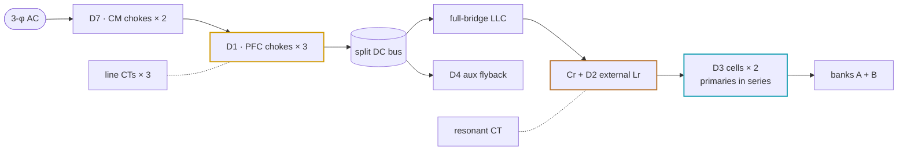
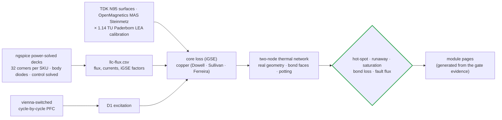
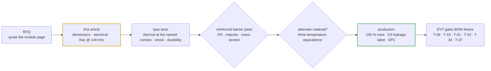

# 🧲 Magnetics Hub

<sub>How every magnetic is designed, proven, built and accepted — methods, materials, the common parts and the four module pages</sub>

<p>
  
  
  
  
</p>

> [!NOTE]
> **Purpose** — the one place that explains *how* the magnetics are designed, proven, built and accepted. Each module has
> its own generated page with that SKU's drawings, gate proof, build steps, prototype route and cost; this hub carries what
> is common to all of them — the tools and how to read their results, the copper physics, the failure modes and the gate
> that closes each, the common requirements every winder quotes against, the D4 aux transformer, and the sourcing directory.

## The four module pages

| Module | D1 PFC choke × 3 | D2 resonant inductor × 1 | D3 transformer cell × 2 | D7 CM choke × 2 | Page |
|---|---|---|---|---|---|
| **30 kW** | 3 × T79, N = 39 | 5.16 µH · litz 8000×0.05 | 2 × E70 · 6:6∥6 | T 80/50/25 (Schaffner catalog primary) | [magnetics-30kw.md](magnetics-30kw.md) |
| **40 kW** | 5 × T79, N = 26 | 4.07 µH · litz 10000×0.05 | 3 × E70 · 4:4∥4 | T 80/50/25 | [magnetics-40kw.md](magnetics-40kw.md) |
| **50 kW liquid** | 5 × T79, N = 24 · cutout | 3.28 µH · litz 12000×0.05 · plate-bonded | 3 × E70 · 4:4∥4 · plate-bonded | T 90/50/30 | [magnetics-50kw.md](magnetics-50kw.md) |
| **50 kW air** | 5 × T79, N = 24 | 3.28 µH · web-bonded | 3 × E70 · 4:4∥4 · web-bonded | T 90/50/30 | [magnetics-50kwa.md](magnetics-50kwa.md) |

Every module also carries one **D4** aux flyback transformer (below), three line CTs, one resonant CT, two catalog buck
inductors and one catalog CAN choke. There are no DM line chokes (retired at E68b — the star-X2 filter carries the
differential mode) and no bank inductors (retired at E68c — the banks are film-only).



## How a magnetic is proven

A magnetic is not accepted on a design calculation. It is excited with the currents and voltages the switches and the
control actually produce, scored at every simulated corner, and held to lines that a failing part would cross.



### The tools and what each result means

| Tool or data | What it gives | Where it runs | How to read its result |
|---|---|---|---|
| **ngspice-46** power-solved LLC decks | tank, magnetizing and secondary currents, capacitor voltage and switch-node waveforms at every corner, with the control loop solved to target power | `spice/llc/llc-run.mjs` → `llc-envelope.mjs` → `llc-flux-post.mjs` | every row carries the tank fingerprint; a tank change without a re-run fails `current-coordination`. ZVS 64/64 and "legs in rails" must read on every corner |
| **vienna-switched** (JS, cycle-by-cycle) | D1 current with the soft-saturating catalog L(i) at lot AL − 8 %, dips and phase jumps included | `calculations/pfc/vienna-switched.mjs` | the peak column sets F.01; the ripple column sets D1 copper and core loss |
| **upb-lea materialdatabase** (frozen) | TDK N95 loss over f, B and T; LEA-measured N95 permeability; 3C95 surfaces for Bsat(T) | `magnetics-data.json` · `tempdata-3c95.json` | the envelope applies × 1.14 (LEA-measured over datasheet) in the high-flux window; `temp-critique` reads Bsat(130 °C) = 362 mT from the 3C95 set |
| **OpenMagnetics MAS** (data) | core shapes and a second Steinmetz surface with temperature terms | `geometry.mjs` · `magnetics-envelope.mjs` | the loss used is the larger of the datasheet surface and MAS — the conservative side |
| **PyOpenMagnetics / MKF** | geometry-level Rac and leakage cross-check | evaluated at E65 | no macOS wheel on the build host — the frozen data above carries the battery; see [simulation toolchain](simulation-toolchain.md) |
| **FEMMT · FEMM 4.2** | 2-D fringing and leakage at the D3 S1 foil and the D2 distributed gap | first article | a 1-D model under-reads fringing loss; the construction rules (split and distributed gaps, litz clearance) and T-31 close it |
| **winding-physics.mjs** | Dowell (foil), Sullivan (litz), Ferreira + 2-D field factor (round bundles) | `conductor-audit.mjs` | Rac / Rdc per winding at the simulated switching frequency against the drawing's row |
| **magnetics-envelope.mjs** | flux, core and copper loss and the two-node thermal network for D2 and D3 | run-all | read the hot-spot at 55 °C inlet, the 75 °C-inlet derated value, the +25 % Rth value, the runaway margin and B̂ as % of hot Bsat — all five must pass |
| **stress-audit / temp-critique** | D1 biased-L floor, bonded thermal, clamp and bond loss; D7 DM-bias flux; saturation at 130 °C; cold equilibria | run-all | each row prints its own acceptance line; `temp-critique` shows the loop gain g(T) — below 1 means a disturbance decays |

### Reading one gate row

```text
  ok    [D3] 40kw 3×E70 2 cells 4:4∥4 (2 foils) · web2 · R core→wall 0.52 · winding→core 0.58 K/W
        — core corner ENV500-55 87.3 kHz B̂ 159 mT Fe 47.6 W · copper corner SER250-full-bus764 203 kHz Cu 46.1 W
        · hot-spot 102 °C @55 °C (core 89 °C / winding 102 °C) / 103 °C @75 °C derated · +25 % Rth 108 °C
        · runaway margin 115 K · B̂ 39 % of hot Bsat
```

- **Two corners, not one.** Core loss peaks where the bank voltage is highest (flux is volt-second pinned, so a power derate
  does not relieve it); copper peaks where the tank current is highest. The gate finds each by scanning every corner.
- **Hot-spot 102 °C** against 125 °C at 55 °C inlet, **103 °C** against 135 °C derated, **108 °C** against 155 °C with every
  thermal resistance 25 % worse — three margins, three different failure stories.
- **Runaway margin 115 K** is the distance to the temperature where the core's loss slope times its thermal resistance reaches
  one; below that point a hotter core cannot run away.
- **B̂ 39 % of hot Bsat** — the part is loss-limited, never saturation-limited.

## Copper — which conductor, and why

Above about 50 kHz the right conductor is set by **proximity effect**, not current density. Four E43–E52 constructions sized
by DC resistance computed 5–12× their DC resistance at 140 kHz; the conductors on the module pages are chosen from these laws:

```math
F_r^{\,\mathrm{Dowell}} = \Delta\left[\zeta_1 + \tfrac{2}{3}\left(m^2-1\right)\zeta_2\right],\qquad \Delta = \frac{h}{\delta}\sqrt{\eta}
```

```math
F_r^{\,\mathrm{Sullivan}} = 1 + \frac{\pi^2\,\omega^2\,\mu_0^2\,N^2\,n^2\,d^6\,k}{768\,\rho^2\,b^2},\qquad
\delta = \sqrt{\frac{2\rho}{\omega\,\mu_0}},\qquad P_{\mathrm{Cu}} = I_{\mathrm{rms}}^2\,R_{\mathrm{dc}}(T)\,F_r
```

| Quantity (annealed Cu, IEC 60028) | 20 °C | 100 °C |
|---|---|---|
| Resistivity ρ | 1.724 µΩ·cm | **2.266 µΩ·cm** |
| Skin depth δ @ 50 kHz (Vienna ripple) | 0.295 mm | **0.339 mm** |
| Skin depth δ @ 140 kHz (LLC at resonance) | 0.177 mm | **0.202 mm** |
| Skin depth δ @ 203 kHz (top of the PSM band) | 0.146 mm | **0.168 mm** |

- **Foil gauge is an electrical parameter.** The D3 secondary halves run 0.10 mm (30 kW) and 2 × 0.08 mm per turn (40 / 50 kW),
  Dowell Fr 1.23 / 1.17 at 203 kHz; a thicker foil at the same copper area runs hotter, not cooler.
- **Litz strand count has an optimum.** The proximity term grows as (N·n)² d⁶ / b², so adding strands past the Sullivan optimum
  raises AC loss. D2 uses 0.05 mm strands on the wide E70 window; the D3 primary uses 0.071 mm TIW-served profile litz.
- **D1 stays on round wire.** At 50 kHz the ripple is about 11 % of the line current, so a 9 or 13 × 1.6 mm bundle is the right
  conductor; litz would buy under 5 %.
- **D7 sees 50 Hz** (δ 10.7 mm) — solid copper is correct.

## Failure modes and what closes each

| # | Mechanism | Effect if it happened | Closure |
|---|---|---|---|
| 1 | Ferrite thermal runaway (loss tempco positive above ~80 °C) | the core cooks its insulation | **gate** — `magnetics-envelope` runaway margin ≥ 25 K at +25 % Rth, every corner |
| 2 | D3 saturation from volt-seconds | primary current spike → LLC FET over-current | **gate** — B̂ ≤ 50 % hot Bsat; F.11 window comparator as the backstop |
| 3 | D2 saturation during a tank fault | inductance collapses → faster current rise | **gate** — `current-coordination` flux at the F.11 kill peak ≤ 217 mT (60 % Bsat 130 °C) |
| 4 | D4 saturation at the current limit, hot, Lp + 5 % | aux switch current spike | **gate** — 257 mT = 71 % Bsat(130 °C) at the computed cycle-by-cycle limit |
| 5 | D1 soft-saturation during a line fault | di/dt rises as L falls → protection race | **gate** — Δi(3 µs) inside threshold-to-ceiling headroom on every SKU (`temp-critique` D1-FAULT) |
| 6 | LLC flux walking (DC volt-second asymmetry) | progressive saturation | **construction** — series Cr blocks DC; netlist-proven (`verify-independent` §J) |
| 7 | D7 DM leakage flux at the line crest | CM attenuation lost | **gate** — L_lk × I_pk / (N × A_Fe) ≤ 0.6 T and the DM-bias acceptance row |
| 8 | Sendust permeability drift with temperature | D1 floor missed hot or cold | **spec** — ± 3 % catalog band; lot-trim ± 1 turn; first-article L(I) at −30 / +25 / +100 °C |
| 9 | Surge magnetizing the chokes | insulation stress | **construction** — MOV Δ + GDT clamp before the chokes |
| 10 | Fringing-field eddy heating of clamp hardware | hot bolts → tape damage → PD | **spec** — non-magnetic slotted clamp bars ≥ 8 mm from any gap face |
| 11 | Gap drift → Lm or Lr out of window | gain error, fr shift | **spec** — 100 % L / Lm test after cure; the Lr stack (D2 ± 3 % + cell leakage ± 30 %) is gated inside ± 5 % |
| 12 | Litz / TIW insulation failure at temperature | loss of the reinforced barrier (safety) | **spec** — Class F / H system against hot-spots ≤ 116 °C; 100 % hipot; PD sampling |
| 13 | Thermal-cycling fatigue of bonds, gap glue, banding | intermittents, loosening | **spec** — IEC 60068-2-14 Na shock screen and the durability type test |
| 14 | Vibration: stack de-bonding, lead fatigue | open winding | **gate + spec** — D1 clamp preload computed; banding; EVT T-33 |
| 15 | CT saturation before the trip lands | protection blind at the ceiling | **spec** — saturation and linearity acceptance on the fitted burden (module pages) |
| 16 | Audible noise | field complaint | **closed** — sendust λs ≈ 0; LLC parts ultrasonic |
| 17 | Curie approach | abrupt µ loss | **closed** — ≥ 85 K margin (3C95 Tc ≈ 215 °C) |
| 18 | Leakage-field coupling into sensing | metering offset | **rule** — keep-outs and the harness-injection test |
| 19 | D3 cell leakage outside its band | fr shift beyond the simulated tolerance | **spec** — measured and labelled per cell; EOL confirms fr ± 5 % |
| 20 | Winder substitutes material or core | any of the above, latent | **spec** — equivalence tests are acceptance; unverified substitution is forbidden |
| 21 | Proximity-effect copper loss understated | windings far hotter than budget | **gate** — `conductor-audit` at the simulated currents; first-article Rac (T-31) |
| 22 | A trip set below a real operating peak | nuisance trips at full power | **gate** — every F.xx ≥ 1.2 × the simulated worst peak |
| 23 | CT / ADC clipping before the kill | fault snapshot under-reads | **gate** — observability through the race; CT front-end deck re-run at the E67 burdens |
| 24 | A lost gap-pad bond on D2 / D3 | runaway on the sealed plate or on a single web | **gate + construction** — `magnetics-envelope` bond-lost rows; EOL bonded thermal soak; 130 °C cutout loop → F.22 |
| 25 | Fringing eddies across the innermost D3 foil | foil hot-spot a 1-D model misses | **construction** — gap split equally per set, ≤ 0.5 mm per position; T-31 open-secondary check |
| 26 | Cold start at −30 °C | loss doubles, slow warm-up | **gate** — `temp-critique` COLD rows: every core self-warms toward its loss minimum |

## Common requirements — every magnetic

| Item | Requirement |
|---|---|
| Insulation system | UL 1446-recognised **system**, Class F (155 °C) minimum; **Class H (180 °C) for D2 and D3** (VPI). Every material inside a barrier qualified within that system; organic materials UL 94 V-0 |
| TIW / FIW grade | Class F minimum wherever the wire forms part of a barrier; a Class B grade is for non-barrier use only |
| Thermal basis | full power to +55 °C ambient, derate to +75 °C. D1 / D4 / D7: ΔT limits and thermocouple positions per sheet. D2 / D3: hot-spot type test, bonded as in service, at the simulated corners named on each module page — ≤ 125 °C at 55 °C inlet, ≤ 135 °C at 75 °C inlet derated. A simulation-vs-bench delta above 20 % reopens the gate |
| VPI (D2, D3) | vacuum-pressure impregnation with a solventless Class H resin; through-build conductivity ≥ 0.6 W/m·K; full penetration shown on the first-article cross-section; bond faces and terminations masked |
| Two-face bond (D2, D3) | both yoke faces are bond faces: flat ≤ 0.5 mm, clean ferrite, nothing on them. Gap-padded (3 W/m·K class) to the extrusion webs (air SKUs) or the two coldplates (50 kW liquid); end turns potted ≥ 0.8 W/m·K, ≥ 5 mm bridge |
| Bonded-face insulation | every part bonded to a PE-bonded web or plate carries basic insulation to PE through a glass-reinforced gap pad ≥ 0.5 mm; 100 % hipot winding → foil over the bond faces: 2.5 kV DC (primary and mains windings), ≥ 1.5 kV DC (D3 secondaries). D2 / D3 see 1.26–1.28 kV recurring peaks at 83–203 kHz, so both carry PD sampling |
| Over-temperature cutout | NC hermetic snap-action thermostat, 130 ± 5 °C, gold dry-circuit contacts, reinforced-insulated case and leads — one on each D3 cell and on D2 (three per module), on each D1 of the liquid SKU — series-wired into the T_XFMR loop; an open loop reads 150 °C and latches F.22 |
| Environment | operating −30 … +55 °C full power (derate to +75 °C), cold start ≥ −30 °C, storage −40 … +85 °C; humidity 5–95 % RH non-condensing; adhesives, potting and litz bonding quoted to −40 °C |
| Vibration | 2 g 10–500 Hz sine survival; toroid stacks epoxy-banded, D1 clamped and 2-point banded |
| Thermal shock and durability | first article: IEC 60068-2-14 Na, 5 cycles −40 ↔ +135 °C, electrical re-test; durability type test ≥ 500 cycles −40 ↔ +135 °C or ≥ 3,000 power cycles — joint resistance change ≤ 10 %, AL / Lm ± 3 %, hipot pass |
| Traceability | lot and date code on every part, traceable to core lot and wire lot; D3 cells carry their measured leakage, D2 its measured inductance |
| Tests | every acceptance row and stated hipot 100 % at the winder; sampled tests are marked on the module pages |
| Packaging · compliance | individually celled (parts weigh 0.9–2.8 kg); RoHS / REACH declared at first article |

### Universal process rules

1. **Incoming** — cores to the equivalence tests (AL band; sendust L(I) at −30 / +25 / +100 °C; ferrite lot loss certificate); litz
   continuity and strand count by resistance per metre; TIW spark-test certificate per reel.
2. **Litz** — bend radius ≥ 5 × bundle OD; never over a sharp edge; serve ends with heat-shrink before cutting. Termination: strip
   the serving 12 mm, solder-pot tin at **400 ± 20 °C** (Class 155 PU; Class 180 PU needs 420–440 °C), 0.071 mm strands 2–3 s,
   inspect the cut face. TIW: strip the triple wall only to the drawing's window with a thermal stripper — never a blade.
3. **Foil** — deburr slit edges; fold-back terminations, no soldered joint inside the winding body; interlayer insulation overhangs
   the foil edge ≥ 2 mm; the gauge on the traveler is checked with a micrometer at goods-in.
4. **Gapping** — grind or space the centre leg only; D3 splits its gap equally on every set, D2 uses segments ≤ 1.0 mm; glue, cure
   clamped, **re-measure after cure** (cure shifts AL about 1 %).
5. **Impregnation** — D2 / D3 VPI class H; D1 varnish dip-vacuum; **never impregnate nanocrystalline D7 cores** — surface seal only.
6. **Hold points** — **H1** after winding (reworkable) · **H2** after impregnation (full acceptance row) · **H3** hipot and PD
   **last**, then the label. A hipot before impregnation stresses unsupported insulation.
7. **Handling** — ferrite halves are brittle; a dropped core is never used.

## D4 — aux flyback transformer (rev E)

The same part on every SKU: a 110 W-class DCM flyback from the full DC bus that powers the module. Its primary sits at bus
potential and the SELV control domain depends on its **reinforced barrier** — a safety-critical winding operation, 100 % hipot.

| Row | Specification — PMP-MAG-D4 rev E · `XFMR-AUX-FLY-E` · qty 1 |
|---|---|
| Function | 110 W-class DCM flyback, 306–860 VDC running range, 65 kHz, Vor ≈ 157 V, NCP1252D cycle-by-cycle limit |
| Core | **ETD44 PC95-class** (Ae 173 mm²), gapped to **AL 239 nH/T²** — rev E re-core: at the computed limit (860 V · Lp + 5 % · VILIM max · CS filter lag → 4.67 A) the flux is 257 mT = 71 % of Bsat(130 °C); the ETD39 rev D reached 113 % |
| Windings | **Np 38** / N24 = 6 / N15 = 4 / Naux = 4, P/2–S–P/2 sandwich; secondaries TIW Class F minimum; Lp **345 µH ± 5 %** (100 %) |
| Leakage | **≤ 4 µH** primary-referred, all secondaries shorted @ 10 kHz (1-D estimate 1.7 µH) — sets the RCD clamp |
| Terminations | pins 1–4 AXA, AXB, P1, P2 (bus side) · pins 5–8 S15A, S15B, S24A, S24B (SELV) on opposite rows — reinforced 8.0 mm clearance / 12.6 mm creepage |
| Insulation · hipot | pri ↔ all secondaries **reinforced**; 100 % hipot ≥ 4.25 kV DC; PD sample 5 / lot; 1.2/50 µs impulse type test ≥ 8 kV |
| Acceptance | Lp 345 µH ± 5 % · turns exact · Rdc pri ≤ 900 mΩ / 24 V ≤ 60 mΩ / 15 V ≤ 45 mΩ / aux ≤ 45 mΩ · leakage ≤ 4 µH · C(pri ↔ sec) ≤ 50 pF · SRF ≥ 650 kHz |
| Thermal · environment | ΔT ≤ 45 K at 110 W throughput (thermocouple on the primary margin) · Class F system · operating ambient −40 … +55 °C |
| Mechanical · mounting · marking | outline per the ETD44 core and 8-pin former drawing (dimensional first-article report against it) · bobbin pins into the PCB, secured by the bobbin clip · label p/n, rev, lot, date |
| Production test | 100 %: Lp, turns, Rdc × 4, leakage, hipot · sample: PD 5 / lot · first article: impulse and thermal |
| Proof | `d4-flyback.mjs` through `stress-audit` [D4] rows and the drawn-circuit ngspice deck `spice/aux/aux-flyback.mjs` (V24 / V15 hard short bounded at ≤ 85 % Bsat before the fault latch) |

## Sourcing directory

| Class | Primary | Qualified alternates |
|---|---|---|
| Sendust toroids (D1) | Magnetics Inc 0077908A7 (T79 26µ) | Chang Sung CS · POCO KS · DMEGC sendust — AL and roll-off within ± 8 % of the Magnetics part, three-temperature L(I) |
| PC95-class ferrite (D2, D3, D4) | TDK PC95 / N95 E70/33/32 · ETD44 | Ferroxcube 3C95 · DMEGC DMR95 / DMR96A · TDG · Acme — lot loss ≤ the A4 line; an equivalent E70 set must hold the 65.9 mm yoke height |
| E70 formers | TDK B66372B2000 (2-set, D3-30 / D2) · 3-set former lN 293 mm (D3-40 / D3-50, custom) | CN tooling dimensioned per the TDK drawing (each set adds 63.2 mm to lN) |
| Litz | Elektrisola (incl. India for bare litz) | Pack Litz · New England Wire — 0.05 mm compacted (D2), 0.063 / 0.071 mm TIW-served profile (D3) |
| Copper foil | Cu-ETP annealed 0.10 / 0.08 × 28 mm | any EN 13599 / ASTM B152 mill, thickness ± 8 % |
| TIW / FIW | Class F minimum TIW within the winder's UL 1446 system | Rubadue Tri-Ins — Furukawa TEX-E is Class B: non-barrier use only |
| Nanocrystalline CMC cores (D7) | VAC VITROPERM 500F | King Magnetics · Qingdao Yunlu · AT&M — Schaffner RT8131-63-2M8 is the 30 kW catalog part |
| Current transformers | Talema ACX-1100 / ACX-1150 (line) and AS-series (resonant), Salem India | ZEMCT / HCT class (line) |
| Winding houses | Talema Salem (toroids, CTs) · EV-magnetics houses in CN | second source before mass production; D3 and D4 make the winder a safety-critical supplier |

## From quote to production



## How the magnetics got here

| Revision | What changed | Why |
|---|---|---|
| E51 | windings recomputed on real catalog formers; D1-40 / D1-50 re-issued on the catalog core | drawings demanded 142–294 % of their windows |
| E58 | temperature critique on measured 3C95 surfaces; FMEA; three-temperature sendust equivalence | the design fits were temperature-blind |
| E60 | foil gauges and strand sizes from Dowell / Sullivan at the simulated currents | DC-sized windings computed 5–12× their DC resistance |
| E65 | every D2 / D3 scored at the power-solved corners through a two-node thermal network; VPI, two-face bond, cutout loop | flux had been checked at resonance, where it is lowest |
| E67 | one full-bridge LLC: two D3 cells in series and one external D2 Lr, no bins | the InfyPower REG1K0135A2 architecture |
| E68 | D6 DM chokes and D8 bank inductors retired | star-X2 EMI filter and film-only output banks |
| E70 | one generated magnetics page per module; the RFQ pack, build instructions, FMEA, D4 sheet and conductor page merged here | each SKU's parts differ — one page per module, proof quoted from the gates |

---

<div align="center">
<sub>Vectivolt DC-Modules · documentation rev E61 · every number reproduces with <code>sh calculations/run-all.sh</code></sub>
</div>

---

<div align="center">
<sub><a href="busbar-drawings.md">← Busbar Drawings & Joint Spec</a> &nbsp;·&nbsp; <a href="README.md">🧭 Documentation hub</a> &nbsp;·&nbsp; <a href="magnetics-30kw.md">30 kW Module Magnetics →</a></sub>

<sub>Vectivolt DC-Modules · documentation rev E70 · every number reproduces with <code>sh calculations/run-all.sh</code></sub>
</div>
