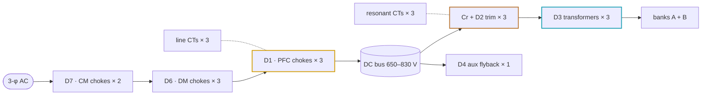

# 🧲 Magnetics Drawings D1–D7

Every custom magnetic — identity, construction, acceptance lines and the per-SKU variants

  
  
  
  

> [!NOTE]
> **Purpose** — Manufacturing drawings D1–D7 with acceptance lines + per-variant tables. RFQ sheets: magnetics-manufacturing-pack.md.
>
> **Gate coupling** — magnetics-rfq-audit (field completeness) · stress-audit D1/D2/D3/D6 families (computed) ·
> **E60:** [`conductor-audit`](../calculations/magnetics/conductor-audit.mjs) (Dowell/Sullivan AC copper at the simulated
> currents) · [`current-coordination`](../calculations/system/current-coordination.mjs) (CT burdens, trip classes, D2 fault flux) ·
> **E65:** [`magnetics-envelope`](../calculations/magnetics/magnetics-envelope.mjs) (D2 / D3 flux, core and copper loss,
> two-node thermal and runaway at every power-solved corner).

> [!IMPORTANT]
> **E65 revision — end-to-end magnetics review.** Every D2 and D3 check had been taken at the resonant point, against
> single-set winding windows, with a lumped thermal model. Each finding below was reproduced by an independent verifier.
>
> | Finding | What the review showed | E65 change |
> |---|---|---|
> | **Flux checked at the wrong corner** | D3 flux was checked at 415 V / 140 kHz (108 / 90 / 109 mT). The power-solved decks run 77–88 kHz at bank 500–525 V (gain up to 1.265 with the bus capped at 830 V), where flux is volt-second pinned at 153–237 mT and ferrite loss is 2–3×. It follows bank voltage, not load, so a derate cannot relieve it. D2 loss was also taken at 140 kHz; its current corners run 170–190 kHz | [`magnetics-envelope`](../calculations/magnetics/magnetics-envelope.mjs) scores D2 and D3 at all 34 simulated corners. Its control rows reject the E60 D3s: 153 °C (30 kW) and 131 °C (40 kW) at 55 °C inlet, both running away at 75 °C; the 50 kW runs away at both. D3-50 → 3 × E70 5:5:5 (237 → 158 mT) |
> | **Stacked PQ50/50 cannot be wound** | Side-by-side sets leave 5–6 mm radial build at the leg tips against the 8.1 mm D3-30 lay-up. The real mean turn is 191–229 mm, not the registered 115 mm, so every correctly built unit failed its Rdc rows. D2-30 fitted only with zero gap clearance | D3-30 → 2 × E70 7:7:7 · D2-30 → 1 × E70 N 8 |
> | **The "engineered 3 µH" leakage is unreachable** | A concentric S1–P–S2 interleave on these windows computes 0.14–0.19 µH. The E60 bins (3.3–4.35 / 3.2–3.8 / 2.8–3.2 µH) would have left Lr about 2.7 µH short, putting fr near 170 kHz | D2 carries ~all of Lr on new bins; D2-40/50 → 2 × E70 N 5. Lr, Cr, Lm and Coss are unchanged, so the tank fingerprint and every LLC simulation stay valid |
> | **Lumped thermal hid two bottlenecks** | MnZn ferrite conducts ~4 W/m·K through the 66 mm set height, so a one-face bond is 4× worse than two faces. The winding reaches the core only through its former and its own build | Two-node (core, winding) network from real geometry. VPI class H, both yoke faces bonded, end turns potted where the gate needs it, 130 °C cutout loop |
>
> Also at E65: one written reinforced barrier on D3, the D3 shield lead moved to DCN, basic insulation to PE on every
> bonded face, and D2 fault flux taken at the F.11 window-comparator kill. Material basis: TDK N95 datasheet surfaces and
> OpenMagnetics MAS Steinmetz, calibrated ×1.14 to TU Paderborn LEA measurements
> ([`magnetics-data.json`](../calculations/magnetics/magnetics-data.json)). The E60 copper revision (foil gauges,
> 0.071 mm strands) carries into these drawings — [`conductor-selection.md`](conductor-selection.md).

## At a glance — the magnetics set

| Part | Function | 30 kW | 40 kW | 50 kW (liquid and air) | Kept honest by |
|---|---|---|---|---|---|
| [**D1**](#d1-rev-c-e65--pfc-boost-chokes--qty-3-per-module) · × 3 | PFC boost choke | 3 × 0077908A7, N = 39 ± 1 | 5 × 0077908A7, N = 26 ± 1 | 5 × 0077908A7, N = 24 ± 1 | `mag-sync` · `stress-audit` · `temp-critique` |
| [**D2**](#d2-rev-e-e65--resonant-trim-inductor-bin-sets--qty-3-per-module) · × 3 | resonant trim — carries ~all of Lr, binned to the transformer's measured leakage | 1 × E70, N 8 · 6.35 / 6.5 / 6.65 / 6.8 µH | 2 × E70, N 5 · 5.85 / 6.0 / 6.15 / 6.3 µH | 2 × E70, N 5 · 5.35 / 5.5 / 5.65 / 5.8 µH | `magnetics-envelope` · `conductor-audit` · `current-coordination` |
| [**D3**](#d3-rev-c-e65--llc-section-transformers--qty-3-per-module) · × 3 | LLC section transformer | 2 × E70, 7:7:7 · foil 0.10 mm | 2 × E70, 6:6:6 · foil 0.127 mm | 3 × E70, 5:5:5 · foil 0.127 mm | `magnetics-envelope` · `conductor-audit` · `mag-sync` |
| [**D4**](aux-transformer-D4.md) · × 1 | 110 W aux flyback | ETD44 rev E (E65) | = | = | `stress-audit` D4 Bpk |
| [**D6**](#d6--dm-line-chokes-dm-22u-sku--qty-3-per-module-one-per-phase-hr-9-new-drawing) · × 3 | differential-mode line choke | 2 × T48 60µ, N 7 | 2 × T57 60µ, N 8 | 3 × T57 60µ, N 8 | `dm-choke-design` · `lisn-precompliance` |
| [**D7**](#d7--cm-chokes-cmc-3ph-2mh-sku--qty-2-rev-b-e65-engine-designed-dm-bias-acceptance) · × 2 | 3-phase common-mode choke | Schaffner RT8131-63-2M8 class | custom 75 A | custom 95 A | ΔT acceptance |
| [**CT**](#ct--current-transformers--qty-3-each-per-module--catalog-parts-audit-2026-09-08) · × 3 + 3 | line and resonant current sensing | ACX-1100 · 22 Ω / AS-404 · 1.2 Ω | ACX-1150 · 18 Ω / 80 A class · 0.91 Ω | ACX-1150 · 13 Ω / 100 A class · 0.75 Ω | `current-coordination` |

## Drawings

All values trace to `calculations/pfc/pfc-design.mjs` and `calculations/llc/llc-design.mjs`; since E65 the D2 and D3
rows trace to `calculations/magnetics/magnetics-envelope.mjs`, `conductor-audit.mjs` and `calculations/llc/tanks.mjs`.
Acceptance limits are the production test spec (EOL §45). Material fits are catalog-class,
marked VERIFY (A3/A4) — first-article measurement closes them.

## D1 rev C (E65) — PFC boost chokes — qty 3 per module

**D1 section rows** (the "Item / Spec" table under the D1 heading), replace:

| Item | Spec (rev C, E65) |
|---|---|
| Winding | **N = 39 nominal; winder trims ±1 turn per core lot.** 9 × 1.6 mm grade-2 enamelled bundle (18 mm² class), taped every 150 mm, laid flat; bore layers 21/15/3, spread ≥ 300°. The flat-on-edge 3 × (6 × 1 mm) alternate is withdrawn (6 mm across the bore field at 50 kHz) |
| Rdc | ≤ **6.9 mΩ @ 25 °C** (build 6.08 mΩ, Magnetics-table MLT 160.5 mm) + ±5 % per-lot window (one open strand = +12.5 %) |
| Core loss @ rated ripple | **4.7 W** at the 330 VAC corner (iGSE on the simulated flux, ΔB 90 mT pp, Kool Mµ 26 published equation × the datasheet max 900 mW/cm³) — the A3 fit read 2.4 W |
| Loss @ rated | **42.9 W** at the 330 VAC corner (Cu 23.4 + ripple 14.8 + Fe 4.7), 28.0 W at 400 VAC — hot-spot **87 °C** bonded, limit 120 °C at 55 °C inlet (`stress-audit` [D1], computed) |
| Isolation | **basic insulation to PE** — gap pad (bond face), bore sleeve and clamp cap; Û_rp ≤ 540 V; 100 % hipot 2.5 kV DC 1 min winding ↔ bond-face + bore electrodes |
| Mount | one end face gap-pad bonded to the PE-bonded web; M6 A4-70 through the bore at 4.5 N·m on a Belleville via a GF-PPS insulating cap; 2-point glass banding; mass **1.9 kg** (computed) |
| Hi-pot | 2.5 kV DC 1 min, 100 % (winding ↔ bond face + bore); 4 kV impulse type test |

**§0.1 land-pattern table, D1 row** — leave the land pattern (layout) but add a footnote: "E65: finished ⌀ 91–94 mm × H
68–115 mm computed from the winding build; the 87 mm keep-out, the 62 mm tunnel and the 6.0 mm lead holes do not hold
(9 × 1.6 mm bundle ⌀ 6.2 mm enamelled, 13 × 1.6 mm ⌀ 7.2 mm) — layout open item."

**§0.2 thermal-class table, D1 row** → `| D1 | hot-spot ≤ 120 °C at 55 °C inlet, ≤ 130 °C at 75 °C derated (computed, bonded) | 87–92 °C | 73–94 °C | **F (155 °C)** |`
(D6 / D7 keep ΔT ≤ 45 K on their own row).

**E41 variant row, D1-40** acceptance cell → "L0 **116 µH** nom, accept **106–135** · **L@104 A pk ≥61 µH** · dIpp ≤ 28 A nom ·
Rdc ≤ 4.55 mΩ + ±5 % lot window · hot-spot 88 °C bonded (limit 120 °C) · fill 42 % (insulated-wire winding factor)".
Construction cell: replace "wire 25.8 mm² class" with "13 × 1.6 mm bundle (26 mm² class), web-bonded".

**E42 variant row, D1-50** acceptance cell → "L0 **107 µH** nom, accept **98–124** · **L@129.5 A pk ≥ 45 µH** · dIpp basis 36.2 A pp
nom · swing 0.405 ≥ 0.40 · Rdc ≤ 4.15 mΩ + ±5 % lot window · hot-spot 81 °C plate-bonded / 92 °C web-bonded (limit 120 °C) ·
D1 cutout thermostat on the liquid SKU".

**E44 air note** — replace "D1-50's 37 K ... convective figures" with "D1-50 is web-bonded on the air twin (92 °C hot-spot;
bond lost 129 °C, survivable on air)".

mag-sync tokens preserved by the text above: `N = 39`, `150–185 µH`, `≥ 75 µH`, `N=26` / `N = 26`, `116`, `≥61`, `61 µH`,

## D2 rev E (E65) — Resonant trim inductor bin sets — qty 3 per module

**Rev E carries ~all of Lr.** The E60 bins were sized around a 3 µH transformer leakage that an S1–P–S2 interleave on
these windows cannot produce (it computes 0.14–0.19 µH), so each SKU's trim is now Lr less the measured D3 leakage and a
0.1 µH tank-loop stray. The rows are proven at
the simulated corners by [`magnetics-envelope`](../calculations/magnetics/magnetics-envelope.mjs) (flux, iGSE core loss,
Sullivan copper, two-node thermal, runaway), [`conductor-audit`](../calculations/magnetics/conductor-audit.mjs)
(production rows) and [`current-coordination`](../calculations/system/current-coordination.mjs) (fault flux). Bins and
turns live in [`tanks.mjs`](../calculations/llc/tanks.mjs). Drawing control: PMP-MAG-D2-30 / -40 / -50, rev E, 2026-09-13.

| Item | 30 kW | 40 kW | 50 kW (liquid and air) |
|---|---|---|---|
| Order code · drawing | `IND-TRIM-BIN4` · PMP-MAG-D2-30 | `IND-TRIM-E70-40` · PMP-MAG-D2-40 | `IND-TRIM-E70-50` · PMP-MAG-D2-50 — one drawing, both coolings |
| Core · former | 1 × E70/33/32 · TDK B66372B1000 (1-set) | 2 × E70/33/32 · TDK B66372B2000 (2-set) | as 40 kW |
| Turns · litz | N = 8 · **6112×0.05 mm** (12.0 mm²) | N = 5 · **8149×0.05 mm** (16.0 mm²) | as 40 kW |
| Tank Lr · bins (±1.5 % grind) | 7.0 µH · **6.35 / 6.5 / 6.65 / 6.8 µH** | 6.5 µH · **5.85 / 6.0 / 6.15 / 6.3 µH** | 6.0 µH · **5.35 / 5.5 / 5.65 / 5.8 µH** |
| AL target per bin | 99.2 / 101.6 / 103.9 / 106.3 nH/T² | 234 / 240 / 246 / 252 nH/T² | 214 / 220 / 226 / 232 nH/T² |
| Ideal total gap per set (µ0N²·nAe/L) | 8.1–8.7 mm → ≥ 9 segments | 6.8–7.3 mm → ≥ 8 segments | 7.4–8.0 mm → ≥ 9 segments |
| Operating flux, bin-max, worst simulated peak | 82 mT | 80 mT | 92 mT liquid · 93 mT air |
| Fault flux, bin-max at the F.11 window-comparator kill peak | 130 mT (104 A) | 121 mT (132 A) | 134 mT liquid · 135 mT air (158 A) |
| Loss at the worst corner (SER250-full-tolLo, 100 °C) | Fe 11.5 W · Cu 10.6 W at 188.6 kHz | Fe 19.7 W · Cu 9.8 W at 181.1 kHz | Fe 26.3 W · Cu 14.9 W at 176.2 kHz (air 176.7 kHz) |
| Loss at the rated point (PAR400-full, ≈ 150 kHz, 90 °C) | Fe 2.6 + Cu 3.4 = 6.0 W | Fe 4.7 + Cu 3.3 = 8.0 W | Fe 6.3 + Cu 5.0 = 11.3 W (air 11.4 W) |
| Rdc @ 25 °C, 100 % | ≤ 1.95 mΩ (build 1.81, MLT 155 mm) | ≤ 1.3 mΩ (build 1.18, MLT 216 mm) | as 40 kW |
| Rac @ 140 kHz, 100 °C, sample | ≤ 4.5 mΩ (Sullivan Fr 1.68 → 3.93) | ≤ 2.6 mΩ (Fr 1.47 → 2.25) | as 40 kW |
| Hot-spot, 55 °C inlet, full power | 99 °C | 93 °C | 84 °C liquid · 101 °C air |
| 75 °C inlet derated · +25 % Rth · runaway margin | 97 °C · 106 °C · 163 K | 97 °C · 99 °C · 163 K | liquid 81 °C · 89 °C · 176 K · air 100 °C · 108 °C · 160 K |
| One gap pad lost, 55 °C inlet | 109 °C — survives | 103 °C — survives | liquid 110 °C — **needs the cutout** · air 115 °C — survives |
| Cooling interface | both yoke faces → upper and lower extrusion webs | as 30 kW | liquid: both yoke faces → the two coldplates, end turns potted to the plate · air: as 30 kW |
| PD sample, extinction (recurring peak at 77–190 kHz) | ≥ 1.3 kV pk (839 V) | ≥ 1.5 kV pk (976 V) | ≥ 1.65 kV pk (1081 V) |
| Leads, drill / pad ([§0.1](#01-mechanical-envelope-and-terminations--the-board-is-already-laid-out-to-these) rule) | 5.1 / 6.0 mm | 5.7 / 6.6 mm | 5.7 / 6.6 mm |
| Mass (computed, `mag-sync`) · qty | 0.70 kg · 3 per module | 1.27 kg · 3 per module | 1.27 kg · 3 per module |

| Item | Spec — all SKUs |
|---|---|
| Function | LLC external resonant inductor at tank potential — full AC flux swing, one per section |
| Material | PC95 / N95 / 3C95-class MnZn ferrite. **Powder cores are prohibited in this slot** — on full AC swing at 140 kHz the rev B sendust part computed ≈ 43 W core loss and L swinging 7.4 → 3 µH every cycle (finding F1) |
| Winding | one layer of compacted (profile) litz across the 41 mm window, **≥ 3 mm radial clear of the gap**. Sullivan and Dowell are 1-D; the measured Rac includes the fringing |
| Gap | **distributed centre-leg gap, ≤ 1.0 mm per segment**, outer legs butted, equal on every set; ground per bin to its AL target. Count segments from the ground gap — fringing makes it larger than the ideal value above |
| Bin rule | kit the bin nearest **Lr − (measured D3 leakage + 0.1 µH tank-loop stray)** — table below; Lr(total) within ±3 % |
| Impregnation | **VPI**, class H resin, k ≥ 0.6 W/m·K — no dry build (the thermal network assumes it) |
| Bond and mount | both yoke faces gap-padded (3 W/m·K) through the board cut-outs — the 65.9 mm stack spans the 62 mm tunnel; bonded-face flatness ≤ 0.5 mm; non-magnetic slotted stainless clamp bars ≥ 8 mm from any gap face (E58); no rigid epoxy to aluminium |
| Insulation to PE | the bonded core makes winding → web or plate **basic insulation to PE**: glass-reinforced insulating gap pad ≥ 0.5 mm with a cut-through rating above clamp pressure · **100 % hipot, winding → foil over the bonded faces, 2.5 kV DC** · PD sample 5/lot at the per-SKU level above · Class H system |
| Over-temperature cutout | **130 °C** ±5 K NC hermetic snap-action thermostat, gold dry-circuit contacts, reinforced-insulated case and leads, one per part on the winding end turn (the hot-spot node on every D2 except 50 kW liquid, where the core leads by 3 K). Series-wired in the T_XFMR NTC loop: an open loop reads 150 °C and latches F.22 (`pmp_ntc_guard_c()`, [`fsm.h`](../firmware/core/fsm.h)) |
| Terminations · envelope | 2 tinned litz flying leads into plated holes · core stack 70.5 × 65.9 × 31.6 mm per set (A × 2B × C); the finished envelope with end turns is a first-article dimension; the land pattern and board cut-out are layout items |
| Marking · traceability | p/n · rev · lot/date · serial · **measured L @ 140 kHz and the bin value on the label** · traceable to core lot and litz lot |
| Production test | 100 %: L @ 140 kHz 0.1 V (bin), Rdc, hipot to the bonded-face foil · sample 5/lot: Rac @ 140 kHz, PD · first article: thermocouples on the centre leg beside the gap and on the winding at the SER250 corner, thermal-shock screen to ≥ 135 °C, durability type test ≥ 500 cycles −40 ↔ +135 °C or ≥ 3,000 power cycles (joint resistance change ≤ 10 %, AL ±3 %, hipot pass) |

**Bin selection at kitting** (DFM step 3). The four bins cover leakage + stray of 0.125–0.725 µH on every SKU:

| Measured D3 leakage, post-varnish | + 0.1 µH loop | 30 kW bin | 40 kW bin | 50 kW bin |
|---|---|---|---|---|
| 0.025 – 0.175 µH | 0.125 – 0.275 µH | 6.8 µH | 6.3 µH | 5.8 µH |
| 0.175 – 0.325 µH | 0.275 – 0.425 µH | 6.65 µH | 6.15 µH | 5.65 µH |
| 0.325 – 0.475 µH | 0.425 – 0.575 µH | 6.5 µH | 6.0 µH | 5.5 µH |
| 0.475 – 0.625 µH | 0.575 – 0.725 µH | 6.35 µH | 5.85 µH | 5.35 µH |

A D3 outside 0.025–0.625 µH has no bin that centres Lr and is rejected at kitting. The computed leakage — 0.19 / 0.16 /
0.14 µH, build spread ×0.5 to ×2.5 — sits inside the window on every SKU; the flux, loss and thermal rows are taken at
bin-max.

History: rev A was a single 4.3 µH ±5 % part; rev B a sendust bin set (powder core on full-swing duty, F1); rev C
(30 kW, 2 × PQ50 N 4) and rev D (E60: 40 kW 1 × E70 N 5, 50 kW 2 × E70 N 3) were sized for the unreachable 3 µH leakage.

## D3 rev C (E65) — LLC section transformers — qty 3 per module

**Rev C is proven where the transformer actually runs.** With the bus capped at 830 V the gain-critical corners run the
banks at 500–525 V and 77–88 kHz, and the flux follows bank voltage, not load. [`magnetics-envelope`](../calculations/magnetics/magnetics-envelope.mjs)
scores each part at all 34 power-solved corners, [`conductor-audit`](../calculations/magnetics/conductor-audit.mjs) sets
the production rows and [`mag-sync`](../calculations/magnetics/mag-sync.mjs) holds every carrier to these identities.
The 1:1:1 ratio and Lm 63 µH are unchanged from E60, so the tank fingerprint and every LLC simulation stay valid.
Drawing control: PMP-MAG-D3-30 / -40 / -50, rev C, 2026-09-13.

| Item | 30 kW | 40 kW | 50 kW (liquid and air) |
|---|---|---|---|
| Order code · drawing | `XFMR-LLC-10K` · PMP-MAG-D3-30 | `XFMR-LLC-2E70-40` · PMP-MAG-D3-40 | **`XFMR-LLC-3E70-50`** · PMP-MAG-D3-50 — one drawing, both coolings |
| Cores · former | 2 × E70/33/32 PC95-class · TDK **B66372B2000** (2-set, lN 230.5 mm) — was 3 × PQ50 | 2 × E70/33/32 · B66372B2000 — construction unchanged | **3 × E70/33/32** · 3-set coil former, lN 293 mm (custom — TDK lists 1- and 2-set only; tooling amortised) — was 2 × E70 |
| Turns Np : Ns1 : Ns2 | **7:7:7** | **6:6:6** | **5:5:5** |
| Primary | TIW-served compacted litz 2475×0.071 mm (9.8 mm²) | 3486×0.071 mm (13.8 mm²) | 4370×0.071 mm (17.3 mm²) |
| Secondaries, each | Cu foil **0.10 × 28 mm**, 7 turns | Cu foil **0.127 × 28 mm**, 6 turns | Cu foil 0.127 × 28 mm, 5 turns |
| Mean turn S1 / P / S2 | 190 / 207 / 223 mm | 190 / 209 / 227 mm | 253 / 271 / 290 mm |
| Lm gap: AL target · ideal gap per set (µ0N²·nAe/Lm) | 1.286 µH/T² · 1.33 mm → ≥ 3 positions | 1.75 µH/T² · 0.98 mm → ≥ 2 positions | 2.52 µH/T² · 1.02 mm → ≥ 3 positions |
| Leakage, computed (build spread) | 0.19 µH (0.10–0.49) | 0.16 µH (0.08–0.39) | 0.14 µH (0.07–0.35) |
| Worst simulated flux | **142 mT** · ENV525-55, 83.6 kHz | **176 mT** · PAR525-full-gainWorst, 79.7 kHz | **158 mT** · PAR525-full-gainWorst, 76.8 kHz (air 157 mT, 77 kHz) |
| Flux at the rated point (PAR400-full) | 70 mT | 82 mT | 67 mT (air 66 mT) |
| Loss at the worst corners (100 °C) | Fe 22.3 W (core corner) · Cu 23.9 W (SER250-full-tolLo, 188.6 kHz) | Fe 37.3 W · Cu 31.5 W (181.1 kHz) | Fe 38.0 W (air 37.9 W) · Cu 45.7 W (176.2 kHz) |
| Loss at the rated point (≈ 150 kHz, 90 °C) | Fe 9.5 + Cu 8.4 = 17.8 W | Fe 13.5 + Cu 10.7 = 24.2 W | Fe 12.6 + Cu 15.8 = 28.4 W (air 28.0 W) |
| Rdc @ 25 °C P / S1 / S2, 100 % | ≤ 2.8 / ≤ 9.0 / ≤ 10.6 mΩ (build 2.59 / 8.35 / 9.81) | ≤ 1.75 / ≤ 6.1 / ≤ 7.3 mΩ (1.59 / 5.63 / 6.74) | ≤ 1.5 / ≤ 6.75 / ≤ 7.75 mΩ (1.38 / 6.24 / 7.16) |
| Rac/Rdc @ 140 kHz ≤ 1.35 · computed S / P | 1.15 / 1.18 | 1.29 / 1.26 | 1.20 / 1.28 |
| Hot-spot, 55 °C inlet (winding node) | 104 °C | 97 °C | 89 °C liquid · 101 °C air |
| 75 °C inlet derated · +25 % Rth · runaway margin · B̂ / hot Bsat | 99 °C · 113 °C · 161 K · 34 % | 104 °C · 108 °C · 98 K · 44 % | liquid 80 °C · 95 °C · 139 K · 36 % · air 99 °C · 107 °C · 154 K · 38 % |
| One gap pad lost, 55 °C inlet | 115 °C — survives | 108 °C (118 °C at 75 °C) — **needs the cutout** | liquid 118 °C, runaway at +25 % — **needs the cutout** · air 104 °C — survives |
| Cooling interface | both yoke faces → the extrusion webs | both yoke faces → the webs, end turns potted to the web | liquid: both yoke faces → the two coldplates, end turns potted · air: as 40 kW |
| Mass (computed, `mag-sync`) · qty | 1.32 kg · 3 per module | 1.36 kg · 3 per module | 1.97 kg · 3 per module |

| Item | Spec — all SKUs |
|---|---|
| Function | LLC section transformer, one per section, ratio 1:1:1 exact; the flux is set by bank voltage (volt-seconds), so Fe does not derate with load |
| Lay-up | S1 (inner) – ≥ 3 barrier tapes – shield – P – shield – ≥ 3 barrier tapes – S2 (outer). Leakage is not engineered: no spacer |
| Magnetizing | **Lm 63 µH ±7 %** @ 10 kHz, 0.1 V. The sets are magnetically in parallel, so each carries the full centre-leg gap: grind it equally on every set and split it into positions of **≤ 0.5 mm** each — the S1 foil is innermost and must never face one large gap. Count positions from the ground gap, not the ideal value |
| Leakage | measured @ 140 kHz after varnish and **labelled per unit** — the D2 bin input; accept 0.025–0.625 µH, the window the D2 bins can centre |
| Reinforced pri ↔ sec barrier — one construction | primary TIW-served: solid insulation, TIW/FIW grade Class F (155 °C) minimum in the winder's UL 1446 system (Furukawa TEX-E, Class B, is not a barrier material) · ≥ 3 barrier-tape layers between every shield and its secondary foil, any two passing the reinforced test · shield and secondary foils ≤ 28 mm wide, centred on the 41 mm former with 6.5 mm margin tapes per side · creepage **shield-to-S ≥ 8.3 mm** and **P-to-S ≥ 14.5 mm** wherever the triple wall is stripped. The shields are primary-referenced, so the TIW alone would leave them unbarriered |
| Shield | 1-turn Cu foil between P and each S; lead to **DCN** (the HF-stiff primary rail), not the star — [`cells.tsx`](../packages/power-primitives/cells.tsx) `shield = "net.DCN"` |
| Capacitance | C(P–S) ≤ 150 pF with the shield guarded · C(shield–S) measured and recorded per unit |
| Barrier tests | routine hipot pri ↔ sec **≥ 4.25 kV DC**, 100 %, witnessed and logged (safety-critical) · PD type test + 5/lot sample: extinction **≥ 2.7 kV pk, ≤ 10 pC** after a 1.2 × pre-stress · one HF PD / ageing sample at operating frequency at first article · **1.2/50 µs impulse type test ≥ 8 kV**, 5 per polarity |
| Insulation to PE | bonded faces carry basic insulation to the PE-bonded web or plate: glass-reinforced insulating gap pad ≥ 0.5 mm, cut-through rated above clamp pressure · 100 % hipot to a foil over the bonded faces: **P 2.5 kV DC**, **S1 and S2 ≥ 1.5 kV DC** (S1 lies on the former wall over the conductive core) |
| Terminations | all primary pins (P1, P2, SH) on one face, S1 and S2 on the opposite face, ≥ 8 mm clearance plus a slot between the groups; S1–S2 functional ≥ 1000 V; foil terminations are crimped or soldered foil-to-pin tabs on a moulded header — the land pattern is a layout item |
| Impregnation · bond · potting | **VPI**, class H resin, k ≥ 0.6 W/m·K · both yoke faces gap-padded (3 W/m·K) through the board cut-outs (65.9 mm stack, 62 mm tunnel), bonded-face flatness ≤ 0.5 mm · non-magnetic slotted stainless clamp bars ≥ 8 mm from any gap face · potting where the table says: ≥ 0.8 W/m·K silicone, ≥ 5 mm bridge to the web or plate |
| Over-temperature cutout | **130 °C** ±5 K thermostat per part, as D2 — the one-pad-lost result requires it on D3-40 and D3-50 liquid; it is fitted on every SKU |
| Marking · traceability | p/n · rev · lot/date · serial · post-varnish leakage label · C(shield–S) record · traceable to core, litz, foil and TIW lots (reel spark-test certificate) |
| First article | open-secondary primary R @ 140 kHz (the magnetizing path — a shorted-secondary Rac cannot see gap fringing) and a thermocouple on S1 at the PAR525 corner · cross-section or teardown of the barrier · thermal-shock screen to ≥ 135 °C · durability type test as D2 |
| Liquid SKU interface | coolant inlet ≥ enclosure-air dew point + 3 K whenever energised — a system-interface requirement with its EVT row; the bonded parts sit at coolant temperature at idle |

Radial order from the centre leg outward — the reinforced layers sit between each DCN-tied shield and its secondary foil:

History: the E51 constructions (3 × PQ50 at 30 kW, 2 × E70 at 40 / 50 kW, engineered 3 ±0.7 µH leakage), re-coppered at
E60, are withdrawn at E65 for the findings in the revision note. The E51 barrier rule stands — TIW or margins on one
barrier path, never both — and E65 pays for the custom 3-set former that E51 declined.

## D4 — Aux flyback transformer (XFMR-AUX-FLY) — qty 1

**SUPERSEDED — see D4 rev C below.** Kept for history: rev A was EF20/half-bus, rev B ETD29/60 W.
Do not quote from this section.

EE19/EF20 class, PC40, primary 425 V-max input (fed DCP→MID, E20), 3 outputs: 24 V/0.8 A, 15 V/0.6 A, aux 15 V bias; pri↔sec reinforced TIW, hipot 3 kV; fsw ~65 kHz flyback DCM. Detailed turns sheet issued with aux SPICE validation (open item V-21).

## D7 — CM chokes (CMC-3PH-2mH-SKU) — qty 2, **rev B (E65): engine-designed, DM-bias acceptance**

The rev A rows (OD62, 3× 8 T, 10/13.3/16.7 mm², "≈ 11/15/19 W") used 20 °C copper on a one-layer turn that the
core cannot hold. On the platform model at 100 °C copper they compute 19.6/27.0/34.9 W and ΔT 52/66/80 K, and the
50 kW winding does not fit. Rev A also had no line for the DM leakage flux the choke carries at every line crest.

Rev B is designed by `emi/dm-choke-design.mjs` (D7 block):
- **Design lines:** L_cm(10 kHz) ≥ 2 mH at catalog-minimum µ (−30 %) · B_DM = L_lk,max·I1pk/(N·A_Fe) ≤ 0.6 T at the
  simulated crest · J ≤ 5.6 · ΔT ≤ 40 K (5 K under the 45 K acceptance) · ≤ 2 layers.
- **Fixed inputs:** N = 8 and the 6–12 µH leakage band stay as registered. Leakage is measured at first article;
  the A_Fe floor is set against the band maximum.

| SKU | I_rms / crest | Core (nanocrystalline toroid) | A_Fe floor | Winding | L_cm ≥ (µ −30 %) | B_DM @ 12 µH | Cu loss/choke (100 °C) | ΔT (calc) | Rdc/winding 20 °C | Finished ⌀ × H | Mass |
|---|---|---|---|---|---|---|---|---|---|---|---|
| 30 kW (2nd source) | 55.9 / 82.6 A | T 80/50/25 (AT&M CC050 class) | **281 mm²** | 3 × 8 T, 20 mm² Cu, 2 layers (23 + 1 turns) | 2.27 mH | 0.44 T | 9.9 W | 20 K | 0.77 mΩ | 93 × 38 mm | 0.89 kg |
| 40 kW | 73.3 / 109.9 A | T 80/50/25 (AT&M CC050 class) | **281 mm²** | 3 × 8 T, 20 mm² Cu, 2 layers | 2.27 mH | 0.59 T | 17.0 W | 32 K | 0.77 mΩ | 93 × 38 mm | 0.89 kg |
| 50 kW (both twins) | 91.6 / 137.1 A | T 90/50/30 (AT&M CC243 class) | **450 mm²** | 3 × 8 T, 25 mm² Cu, 2 layers | 3.38 mH | 0.46 T | 26.7 W | 38 K | 0.77 mΩ | 104 × 44 mm | 1.47 kg |

Surrounding filter (E65 schematic):
- There are two CM stages: CMC1, then Y1 3 × 4.7 nF L-PE on AC1M..3M (**CY4-6, new**), then CMC2, then Y1
  3 × 4.7 nF on AC1..3 (CY1-3).
- Leakage (DM) 6–12 µH stays in the DM budget.
- The pre-compliance model uses the 2 mH floor with the Nanoperm-30000 µ(f) roll-off (0.50 at 150 kHz). Hence the
  150 kHz acceptance row below.

**Catalog adoption at 30 kW (unchanged):** Schaffner **RT8131-63-2M8** is the primary. Its 63 A rating gives
89.1 A pk, above the 82.6 A simulated crest (stress-audit row). Qualification adds the 150 kHz |Z| row and the
DM-bias row below. The rev B drawing is the second source.

## CT — current transformers — qty 3 each per module — **CATALOG PARTS (audit 2026-09-08)**

- Line CT: **Talema ACX-1100** (2500:1, 100 A, ±1%, Ø14.6 mm window, 4 kV hipot, PCB pins — made
  at Talema Salem, India; closes the CT-100A REVIEW line). Burden on PCB **27 Ω → 0.59 V/55 A rms** (→ **E60: 22 / 18 / 13 Ω for F.01 120 / 155 / 195 A pk; ACX-1150 at 40 / 50 kW**);
  150 A pk OC observability = 1.62 V above AVMID, inside the 3.3 V ADC rail** (R3 fix landed —
  the drawn 33 Ω put 150 A pk at 3.63 V, clipping the top of the protection range). Linearity
  ≤1% to 150 A pk. qty 3/6/12.
- Resonant CT: **Talema AS-404** (1:100, 50 A, 1500 V·µs, 20–200 kHz, Ø8 mm pass-through — the tank conductor
  is the primary, so tank-potential insulation rides the tank wire). **E60: Coilcraft CST2010-100L is NOT an
  equivalent** (47 A at ~40 K rise, built-in SMT primary, 1.5 kVrms). **E60 burden 1.2 Ω → 12 mV/A: F.11 85 A pk
  = 2.67 V at the comparator, observable to 135 A through the 3 µs internal-short race** (the CB-16 2.0 Ω/70 A pk
  class sat AT the 30 kW operating peak); 40 kW 80 A class on 0.91 Ω (F.11 115 A pk; catalog option AS-407 1:500
  with a 4.55 Ω burden), 50 kW 100 A class on 0.75 Ω (F.11 145 A pk); calibrated at EOL; qty 3/6/12.

**Acceptance (both CTs).** Turns ratio ±0.5 %, 100 %. Secondary Rdc recorded per unit (it feeds the
EOL gain calibration). Phase shift ≤ 1° **at the operating frequency — 50/60 Hz for the line CT but
140 kHz for CT-RES**: the resonant CT is a switching-frequency part and a line-frequency core will
not serve it. Isolation busbar↔secondary 2.5 kV AC 1 min for the line CT (it sits on a line-potential
busbar); the resonant CT is tank-referenced, functional insulation only. Saturation: the line CT must not
saturate below 150 A peak, CT-RES below 100 A peak — that is the overcurrent observability limit,
so it is an acceptance test and not a typical. **ΔT ≤ 30 K** at rated primary current. The burden
resistor is on the PCB, not in the part (33 Ω line, 2.0 Ω resonant → **E60: 22 / 18 / 13 Ω line, 1.2 / 0.91 / 0.75 Ω
resonant**; saturation acceptance → no saturation below 1.25 × (F.xx + race)) — quote the CT bare.

---

## D4 rev C — aux flyback transformer (E26 rev C) — **superseded by rev D (E52): core ETD34 → ETD39**

> **Rev D (E52, 2026-09-12):** same electricals (Lp 345 µH, Np 38/6/4/4, AL 239, clamp 3.2 A,
> NCP1252D), core one size up — the ETD34 ran Bpk 0.30 T ≈ 85 % of hot Bsat at Lp +10 % + clamp;
> ETD39 (Ae 125 mm²) lands 0.233 T / 66 % at tolerance. Order code **XFMR-AUX-FLY-D**; turns
> sheet: [`aux-transformer-D4.md`](aux-transformer-D4.md). The rev-C text below stands as the
> electrical record.

Superseded rev A (EF20, half-bus) and rev B (ETD29, 60 W — R2 CB-20: lost to the per-SKU load).
Now **ETD34 PC95, 342–860 V input, 110 W class, one p/n family-wide**: see the generated
[`aux-transformer-D4.md`](aux-transformer-D4.md) turns sheet (Np 38 / N24 6 / N15 4 / Naux 4,
Bpk 0.30 T). The primary sits at **bus potential**; the pri→sec barrier is reinforced (TIW + 3 mm
margin, hipot 4 kV) and is the load-bearing barrier for the E25 SELV control domain — flag it as a
**safety-critical winding operation** in the winder's traveler (100 % hipot, not sampled).

Qty **1 per module**, all ratings (one aux supply per module; 110 W class covers the 120 kW worst
load at ≥20 % corner margin). Thermal acceptance: **ΔT ≤ 45 K** at the per-SKU load, thermocouple
on the outside of the primary margin tape — same method as D1/D3. Rdc: primary ≤ 900 mΩ,
24 V ≤ 60 mΩ, 15 V ≤ 45 mΩ, aux ≤ 45 mΩ (bench T-18 confirms against the loss budget).

## D6 — DM line chokes (DM-22u-SKU) — qty 3 per module, one per phase (HR-9, new drawing)

The 3rd-stage DM chokes (`LDM1–3`, E22) carry the full line current and now get a real drawing:

**Rev C (E43 full-family verification, 2026-09-08): ENGINE-designed —
`calculations/emi/dm-choke-design.mjs`.** The rev-B electricals were inherited from E22
("22 µH") and were never bias-checked: on the platform's own conservative roll-off anchors the
drawn 14 T on ONE OD47 core computes **~12 µH at ZERO bias (not 22) and 7–8 µH at the 82 A
crest** — under the 15 µH LISN floor on *either* material reading, at every SKU (the engine
prints this as its control row). A DM choke rides the line-frequency crest: its BIASED
inductance is what attenuates the 50 kHz ripple at the worst emission moment. Rev C fixes the
stage two-sided: **CX2 trio 2.2 → 4.7 µF X1** (attenuation is L·C — the cap is the cheap half;
X-bleed τ 0.66 s ≤ 1 s) and per-variant engine chokes against **equal-margin floors**
L_floor = 15 µH × (ΔI_variant/21.4) × (2.2/4.7):

| SKU | I_rms | I_pk (crest) | Floor | Core (engine) | Winding (engine) | L0 → L @ I_pk | Cu loss | ΔT |
|---|---|---|---|---|---|---|---|---|
| 30 kW | 55.9 A | 82 A | 7.0 µH | **2× T48 60µ** (77439-class stack) | **7 T × foil 0.5×40 (20 mm²)**, J 2.8 | 13.7 → **7.4 µH** | 2.4 W | 12 K |
| 40 kW | 73.3 A | 109 A | 9.2 µH | **2× T57 60µ** (OD57/26/20) | **8 T × foil 26.4 mm²**, J 2.8 | 22.9 → **10.5 µH** | 4.4 W | 14 K |
| 50 kW | 91.6 A | 136 A | 11.4 µH | **3× T57 60µ** | **8 T × foil 26.4 mm²**, J 3.5 | 34.4 → **12.9 µH** | 8.1 W | 19 K (plate-bonded in the sealed module) |

Verified end-to-end: `lisn-precompliance.mjs` now runs each variant's own ripple source through
its own crest-biased L and the 4.7 µF stage — **worst DM margins +4.9 / +5.7 / +5.6 dB**
(the old model's "+4 dB" was computed on the impossible flat 22 µH). Acceptance: L(I_pk) ≥ the
variant floor on the conservative anchors (real cores ride higher), ΔT ≤ 45 K at I_rms, J ≤ 5.6,
fill ≤ 40 %, hipot winding–core 2.5 kV. Same vendor/traveler flow as D1. (The rev-B 60/120 kW
rows are retired with their reference boards.)

---

# §0 — Ordering pack: what every drawing above still needs

All seven magnetics are custom-by-drawing, so **the drawing is the part**. The sections above are
complete *electrically*; a winder also needs the mechanical envelope, the terminations, the
insulation system, the acceptance regime and the traceability that decides whether a delivered unit
is good. Where those are absent the winder substitutes their own assumptions and you find out at
first article. `calculations/magnetics-rfq-audit.mjs` checks these fields are present.

## 0.1 Mechanical envelope and terminations — the board is already laid out to these

These come from `calculations/footprint-gen.mjs` (`MAGNETICS`), which is what the PCB land patterns
were generated from. **Every toroid is PCB through-hole**: the winding leads are soldered directly
into plated holes sized for the conductor. Drill is `√(4·CSA/π) + 1.2 mm`, pad = drill + 0.9 mm.

> [!WARNING]
> **This envelope table predates the E51, E52 and E60 revisions** (its D2 and D3 rows were restated at E65). Its D6 and
> D7 rows are sized for the retired 60 / 120 kW boards, its D4 row is the rev C ETD34 part (rev D is ETD39), and D1
> shows only the 30 kW construction — the 40 and 50 kW parts are 5 × T79. The current envelope of each
> part is the **Mechanical** row of its sheet in the [RFQ pack](magnetics-manufacturing-pack.md); the land-pattern
> queue is [footprints to draw](footprints-to-draw.md).

**Audit 2026-09-08: rows marked (†) changed conductor or construction — their drills/keep-outs
differ from the land patterns already generated; re-run `footprint-gen.mjs` before layout freeze.**

| drawing | core OD/ID/H (mm) | leads | conductor | drill / pad (mm) | max footprint ⌀ | mounting |
|---|---|---|---|---|---|---|
| D1 PFC choke † | 79 / 48 / 17 ×3 stacked (H 51) | 2 | 18 mm² (3×6×1 flat) | 6.0 / 6.9 | 87 | **M6 centre bolt** + silicone pad |
| D2 trim inductor † (E65) | 1 × E70/33/32 (30 kW) · 2 × E70/33/32 (40 / 50 kW) — 70.5 × 65.9 × 31.6 per set | 2 | 12.0 / 16.0 mm² litz | 5.1 / 6.0 · 5.7 / 6.6 | layout item — [D2 rev E](#d2-rev-e-e65--resonant-trim-inductor-bin-sets--qty-3-per-module) | **two-face web / plate bond** + clamp bars |
| D6 DM choke 30 kW † | 47 / 24 / 18 | 2 | 9.9 mm² | 4.75 / 5.65 | 55 | bonded |
| D6 DM choke 60 kW † | 57 / 26 / 20 | 2 | 20 mm² foil | 6.25 / 7.15 | 65 | bonded |
| D6 DM choke 120 kW † | 79 / 40 / 17 ×2 (H 34) | 2 | 40 mm² foil | 8.34 / 9.24 | 87 | bonded |
| D7 CM choke 30 kW | 62 / 32 / 25 | **6** (3 windings) | 10 mm² foil | 3.97 / 4.87 | 70 | bonded |
| D7 CM choke 60 kW | 80 / 45 / 30 | **6** | 25 mm² foil | 6.04 / 6.94 | 88 | bonded |
| D7 CM choke 120 kW | 102 / 60 / 35 | **6** | 50 mm² foil | 8.38 / 9.28 | 110 | bonded |
| D3 LLC transformer † (E65) | 2 × E70/33/32 (30 / 40 kW) · 3 × E70/33/32 (50 kW) | 7 on a moulded header — primary face / secondary face | litz 9.8–17.3 mm² · foil 0.10–0.127 × 28 mm | foil-to-pin tabs | layout item — [D3 rev C](#d3-rev-c-e65--llc-section-transformers--qty-3-per-module) | **two-face web / plate bond** + clamp bars |
| D4 rev C aux flyback | ETD34 | 8 pins @ 5.08 mm | 0.8 mm² | bobbin pins | 35 × 26 × 25 | bobbin pins only |
| Line CT (Talema ACX-1100) | 42 dia / Ø14.6 window | 4 PCB pins | catalog part | per Talema drawing | 44 | PCB pins; busbar through window |
| Resonant CT (Talema AS-404) | case w/ Ø8 pass-through | 2 PCB pins | catalog part | per Talema drawing | 26 | PCB pins; tank wire is the primary |

The "max footprint ⌀" is core OD + 8 mm, the winding-build allowance the land patterns reserve.
**A finished part wider than this does not fit its keep-out** — it is an acceptance dimension, not
a guide.

> **RESOLVED (D1 rev B, audit 2026-09-08).** Rev A said *"ring-lug flying leads M5"* while the
> board gives two plated holes — a ring lug cannot land in a hole. Decided for the board:
> **tinned flying leads, 60 mm, soldered into the plated holes**; the D1 rev B table above now
> says exactly that, and the holes grow to 6.0 mm for the 18 mm² conductor (†).

## 0.2 Thermal class — derived, and it rules out Class B

Ambient envelope is **full power to +55 °C, derating to +75 °C** (A11, spec §2). Applying each
drawing's own rise limit at the *derated* ambient:

| drawing | rise limit | hotspot at +55 °C | at +75 °C derated | minimum class |
|---|---|---|---|---|
| D1, D6, D7 | ΔT ≤ 45 K | 100 °C | 120 °C | **F (155 °C)** |
| D2 (E65) | envelope gate: hot-spot ≤ 125 °C, ≤ 135 °C derated | 84–101 °C | 81–100 °C | **H (180 °C)** — VPI |
| D3 (E65) | envelope gate, as D2 | 89–104 °C | 80–104 °C | **H** — VPI |

**Class B (130 °C) has no margin anywhere** — the D2 / D3 over-temperature cutout itself trips at 130 ±5 °C. Specify
a **Class F (155 °C) insulation system minimum**, UL 1446 recognised as a system (not as individual
materials), **H (180 °C) for D2 and D3** (VPI, E65).

## 0.3 Still open — the winder will ask, and these are not ours to assume

- ~~**Low-temperature limit.**~~ **Closed:** A11 rev B (E52) registered −25 °C, and **A11 rev C (E60)** raised it to
  competitor parity: operating and cold start ≥ −30 °C, storage −40 °C. Litz bonding, tape adhesion and
  varnish are quoted to −40 °C.
- **Humidity / condensation and any conformal or vacuum-impregnation requirement.** D2 and D3 are closed at E65 (VPI,
  class H); on the liquid SKU the coolant inlet stays ≥ enclosure-air dew point + 3 K whenever energised — a
  system-interface requirement.
- **Vibration and shock class**, which decides whether the toroids need bonding or banding beyond
  the silicone pad.

## 0.4 Acceptance, traceability and compliance — applies to every drawing

- **100 % electrical test** of the acceptance line in each section. Sampled tests are called out
  individually (D2 and D3 partial discharge, 5/lot).
- **100 % hipot** where a drawing states one. D3 and D4 rev C carry the reinforced primary↔secondary
  barrier that the SELV control domain depends on: flag both in the winder's traveler as a
  **safety-critical winding operation — 100 %, never sampled**.
- **Per-unit measured-value labelling where a downstream step consumes it.** D3's measured leakage
  selects the D2 trim bin at kitting (DFM step 3). A D3 delivered without its leakage label is
  unusable even if electrically perfect.
- **Lot code and date code** on every part, traceable to core lot and wire lot.
- **First article**: dimensional report against §0.1, full electrical against the acceptance line,
  and a cross-section or teardown for the two reinforced-barrier parts.
- **RoHS / REACH**; all organic materials UL 94 V-0.
- **Packaging**: individually separated — the parts are heavy enough (computed, `mag-sync`: D1 ≈ 2.2–3.0 kg,
  D3 ≈ 1.3–2.0 kg, D2 ≈ 0.7–1.3 kg) to damage neighbours in bulk packing.
- **Drawing control**: every section above needs a drawing number, revision and date before it is
  sent out. D2 (rev E) and D3 (rev C) state theirs since E65; D4's revisions are still recorded in
  prose rather than in a controlled block.

## E41 variant drawings (40 kW module — deltas only, everything else per the rev B/C set)

| Drawing | 40 kW variant | Acceptance |
|---|---|---|
| **D1-40 rev B (E51)** PFC choke | **5×** 0077908A7 stack (same core p/n), **N = 26 ±1 lot-trim**, wire 25.8 mm² class (J 2.84) — **re-issued on the CATALOG core (AL 37 ±8%, Ae 2.27 cm²)**: the E41 N=23 was the engine's geometric-Ae output and computes L0 98 µH / 55 µH @104 A on the real part, missing its own floor and inflating the D6/LISN ripple basis to 32 A pp | L0 **116 µH** nom, accept **106–135** (lot-trim window) · **L@104 A pk ≥ 61 µH** · dIpp ≤ 28 A nom · Rdc ≤ 7.0 mΩ · ΔT ≤ 45 K (calc 30) · fill 36 % |
| **D2-40 rev E (E65)** resonant trim `IND-TRIM-E70-40` | **2 × E70/33/32 on B66372B2000, N = 5**, litz **8149×0.05 mm (16.0 mm²)**, bins **5.85 / 6.0 / 6.15 / 6.3 µH** ±1.5 %, distributed gap — full drawing: [D2 rev E](#d2-rev-e-e65--resonant-trim-inductor-bin-sets--qty-3-per-module). Rev D (1 × E70, N 5, 3.2–3.8 µH) was sized for the unreachable 3 µH leakage | bin-max 80 mT · fault flux 121 mT · Rdc ≤ 1.3 / Rac ≤ 2.6 mΩ · hot-spot 93 °C at 55 °C inlet · two-face web bond · 1.27 kg |
| **D3-40 rev C (E65)** transformer `XFMR-LLC-2E70-40` | 2 × E70/33/32 on **B66372B2000T001**, **6:6:6**, TIW-served litz 3486×0.071 mm + foil 0.127 × 28 mm — construction unchanged from rev B (E51, re-coppered at E60); E65 adds VPI, the two-face web bond, potted end turns and the 130 °C cutout — full drawing: [D3 rev C](#d3-rev-c-e65--llc-section-transformers--qty-3-per-module) | B̂ 176 mT at PAR525-full-gainWorst (rev B's 90 mT was the resonant-point basis) · Fe 37.3 W · hot-spot 97 °C at 55 °C inlet · Rdc P / S1 / S2 ≤ 1.75 / 6.1 / 7.3 mΩ · 1.36 kg |
| **D6-40** | **rev C engine row (see D6 section): 2× T57 60µ, N=8, foil 26.4 mm²** — constant-J alone was NOT enough, the core bias was the binder | L(109 A pk) = 10.5 µH ≥ 9.2 floor · 4.4 W · ΔT 14 K |
| **D7-40** | same construction, CSA × 4/3 at constant J ≤ 5.6 A/mm² | ΔT acceptance carried; custom wind (63 A catalog part out of range) |
| CTs | line: **E60 → 150 A class (Talema ACX-1150) on 18 Ω** — F.01 155 A pk + 50 A race needs linearity past the ACX-1100's ~179 A · resonant: **80 A-class 1:100 on 0.91 Ω** (F.11 115 A pk) | no saturation below 1.25 × (F.xx + race) at 25 °C, or demonstrated at 85 °C |

## E42 variant drawings (50 kW LIQUID module — deltas only; sealed, magnetics plate-bonded)

Every magnetic below is **gap-pad-bonded to the coldplate webs** (the sealed module has no
airflow); the convective ΔT figures stay as the conservative acceptance gates, the plate bond is
the mechanism that beats them — plate thermal RFQ verifies. **D2 and D3 since E65:** their thermal proof is the
`magnetics-envelope` two-node network with the sealed box's internal air modelled at 110 °C at full load, not a
convective ΔT row.

| Drawing | 50 kW variant | Acceptance |
|---|---|---|
| **D1-50 rev B (E51)** PFC choke | **5× T79 26µ** (same core p/n as D1-40), **N = 24 ±1 lot-trim**, wire 25.8 mm² (J 3.55) — **re-issued on the CATALOG core**: the E42 N=22 was geometric-Ae output (90 µH real, 44 µH @129.5 A); on catalog AL **no N on the 5-stack** holds both the 34.8 A pp basis and the 0.40 swing floor, so the basis is restated honestly | L0 **107 µH** nom, accept **98–124** · **L@129.5 A pk ≥ 45 µH** · **dIpp basis restated 36.2 A pp nom** (D6-50 equal-margin floor restates to 11.8 µH — the built D6-50 delivers 12.9; LISN DM margin stays ≥ +5.2 dB) · swing 0.405 ≥ 0.40 · ΔT ≤ 45 K (calc 41; plate/web-bonded per E42/E44) |
| **D2-50 rev E (E65)** resonant trim `IND-TRIM-E70-50` | **2 × E70/33/32 on B66372B2000, N = 5**, litz **8149×0.05 mm (16.0 mm²)**, bins **5.35 / 5.5 / 5.65 / 5.8 µH** ±1.5 %, distributed gap — full drawing: [D2 rev E](#d2-rev-e-e65--resonant-trim-inductor-bin-sets--qty-3-per-module). Rev D (N 3, 2.8–3.2 µH) was sized for the unreachable 3 µH leakage | bin-max 92 mT · fault flux 134 mT · Rdc ≤ 1.3 / Rac ≤ 2.6 mΩ · hot-spot 84 °C (both coldplates, end turns potted) · ONE drawing serves liquid AND air · 1.27 kg |
| **D3-50 rev C (E65)** transformer `XFMR-LLC-3E70-50` | **3 × E70/33/32** on a 3-set coil former (lN 293 mm, custom), **5:5:5**, TIW-served litz 4370×0.071 mm + foil 0.127 × 28 mm — full drawing: [D3 rev C](#d3-rev-c-e65--llc-section-transformers--qty-3-per-module). The rev B 2-set part ran 237 mT at the 525 V-bank corner and had no equilibrium even plate-bonded | B̂ 158 mT at PAR525-full-gainWorst · Fe 38 W · hot-spot 89 °C · both coldplates + potted end turns **MANDATORY** · Rdc P / S1 / S2 ≤ 1.5 / 6.75 / 7.75 mΩ · 1.97 kg |
| **D6-50** | **rev C engine row (see D6 section): 3× T57 60µ, N=8, foil 26.4 mm²** | L(136 A pk) = 12.9 µH ≥ 11.4 floor · 8.1 W · ΔT 19 K plate-bonded |
| **D7-50** | same construction, CSA × 5/3 at constant J ≤ 5.6 A/mm² | ΔT acceptance carried; custom wind 95 A |
| CTs | line: **150 A-class 2500:1 — Talema ACX-1150** (linear to 200 A at 33 Ω; own 38.1 mm land), **E60 burden 13 Ω** (F.01 195 A pk, observable to 311 A) · resonant: **100 A-class 1:100 on 0.75 Ω** (2 W part; F.11 145 A pk, observable to 216 A) | the E42 21.5 Ω / 1.6 Ω burdens saw only to 187 A / 104 A — current-coordination gate carries the per-SKU race proof |

## E44 variant note (50 kW AIR module — same magnetics set as E42)

The air twin (`50kwa`) uses the **identical D1-50 / D2-50 / D3-50 / D6-50 / D7-50 set** — the
classes were set by current, not coolant, and `skuOverrides["50kwa"] = {...skuOverrides["50kw"]}`
enforces it. Air-specific notes: D1-50's 37 K and D6-50's 19 K convective figures now sit in
real fan airflow (conservative); **D2-50 rev E and D3-50 rev C bond both yoke faces to the extrusion webs instead of
the coldplates** (hot-spot 101 °C each at 55 °C inlet — `magnetics-envelope`), so one drawing of each serves both
coolings. The only new POWER part on the air twin is silicon, not
magnetic: 6× paralleled LLC FETs (E44 register row).

---

<a href="busbar-drawings.md">← Busbar Drawings & Joint Spec</a> &nbsp;·&nbsp; <a href="README.md">🧭 Documentation hub</a> &nbsp;·&nbsp; <a href="conductor-selection.md">Conductor Selection →</a>

Vectivolt DC-Modules · documentation rev E61 · every number reproduces with <code>sh calculations/run-all.sh</code>

