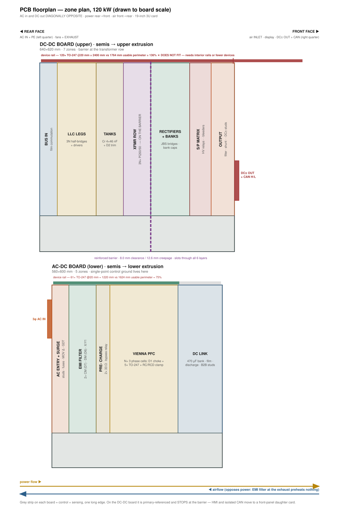

# 🗺️ PCB Floorplan Basis

<sub>Zones, barriers and airflow — the layout-phase basis, parked since E36</sub>

<p>
  
  
  
</p>

> [!NOTE]
> **Purpose** — fix the *zones* before any component is placed: where each schematic section lives on each board,
> which way power flows, where the isolation barriers run, and which edges belong to the heatsinks. Placement
> follows the zones; the zones do not follow the placement.

> [!WARNING]
> **Parked since E36, and written for the retired 30 / 60 / 120 kW single-board set.** The zone logic still holds;
> many of the numbers do not. Read the page with the corrections below, and reopen it — with the 40 kW and both
> 50 kW boards added — when layout resumes.

## Read this page with these corrections

| Section | Status at E61 | What to use |
|---|---|---|
| §0 19-inch 3U envelope · faces · U-fold power path | ✅ applies | — |
| §1 rules · §5 standing-device ridges · §7 component rules · §9 stackup | ✅ applies | copper weights: [conductor selection](conductor-selection.md) |
| §13 horizontal DC-DC barrier · barrier-bounded planes · 440 × 500 outline | ✅ applies — measured on the 30 kW pair | — |
| §0 airflow table · §2 feasibility · §5 rail percentages | ⚠️ the 60 / 120 kW columns are retired (E55) | products above 50 kW are multi-module — [product structure](../boards/README-product-structure.md) |
| §2 recommendation "stop building 120 kW as one module" | ✅ executed | E35 card split, then the E55 ladder |
| §6 magnetics placement | ⚠️ envelopes changed at E51 / E60 | D1-40/50 are 5 × T79 and D3-40/50 are 2 × E70 — the Mechanical rows of the [RFQ pack](magnetics-manufacturing-pack.md) |
| §8 · §13 "one control card, both roles, 30 and 60 kW" | ⚠️ superseded at E40 | one card per module up to 50 kW — [control-card scope](control-card-scope.md) |
| §11 open items 1b, 3b and 9 | ⚠️ refer to 120 kW boards or a removed tool | re-baseline at the layout reopen |
| `floorplan-budget.mjs` · `routing-audit.mjs` | ⚠️ removed from `main` at E54 | preserved on the `archive/pre-focus-E49` branch |
| Layout-entry queue | ➡️ | [footprints to draw](footprints-to-draw.md) — unnamed packages and MPN / land conflicts |

**Related pages** — [interconnect](interconnect.md) (the E17 sandwich) · [insulation coordination](insulation-coordination.md)
(creepage table) · [thermal report](thermal-report.md) (loss per block) · [magnetics](magnetics.md) (D1–D7) ·
[drawing set, card era](history/schematic-drawing-set.md) (the 217 sections this page maps).

## 0. Envelope and axis convention

### The module is a 19-inch rack card

The product has to drop into the same cabinets as everything else in this class, so **width and
height are fixed by the rack and depth is the only free dimension**. That inverts the usual instinct
to draw a wide, shallow board: a board wider than the rack does not become a product no matter how
well it is laid out.

| | target | source |
|---|---|---|
| Face width | 482.6 mm nominal, **≤440 mm usable** between the rails | 19-inch rack |
| Height | **133.35 mm (3U)** | 3U is the dominant module height in this class |
| Depth | 400–560 mm, free to use | class-typical |

### Faces

**Front — fans, display, switch. Rear — AC in, DC out + CAN, at diagonally opposite corners.**
All power and comms leave at the back; the front is the service face and the air intake.

```
        FRONT FACE (service + intake)                     REAR FACE (all connectors + exhaust)
   ┌───────────────────────────────┐                 ┌───────────────────────────────┐
   │  ▣ FAN   ▣ FAN     ░display░  │                 │  ▓▓ DC± OUT + CAN H/L ▓▓  ░░░ │  ← upper board
   │  120 mm  120 mm    ░switch ░  │                 │  (upper-RIGHT)            ░░░ │    (DC-DC)
   │                               │                 │ ░░░                           │
   │  2× 120 + 80 mm HMI = 320 mm  │                 │ ░░░   ▓▓ 3φ AC IN + PE ▓▓     │  ← lower board
   │  of 440 mm usable             │                 │       (lower-LEFT)            │    (AC-DC)
   └───────────────────────────────┘                 └───────────────────────────────┘
                                                       ░░░ = exhaust vent area
```

- **The two HV cables are diagonally opposite on the rear face** — AC at one corner, DC + CAN at the
  far one. That is the maximum separation the face allows, so the input and output harnesses leave in
  different directions and never run parallel in the cabinet. That parallel run is the
  input-to-output conducted-coupling path no amount of on-board filtering fixes once the cables are
  bundled together.

  **Half of that diagonal is free.** The sandwich already puts the AC-DC board low and the DC-DC
  board high, so the AC entry is at the bottom of the rear face and the DC output at the top **by
  construction** — the two are separated in Z whatever else happens. Only the lateral half is a
  placement choice: put the AC studs at one Y end and the DC plug at the other, and the two cables
  are separated on both axes at once.
- **CAN H/L rides on the DC output connector plug**, on its side — one plug carries power and comms,
  so the cabinet harness is one assembly.
- **Fans at the front, pushing.** They run in the coldest, densest air (best mass flow, best fan
  life), the enclosure is positively pressurised so dust enters only through the front filter, and
  the fan noise and the filter are both at the face a technician stands at. Exhaust leaves through
  the rear vent area around the two corner connectors.
- **Front face budget:** 2× 120 mm fans + 80 mm of display/switch = **320 mm of 440 mm usable**. At
  120 kW, 4 fans + HMI = **560 mm and does not fit** — an independent confirmation of §2. (120 mm is
  the largest fan that clears a 133.35 mm opening.)
- **Rear face budget — the connectors must not choke the exhaust.** They occupy two corners of the
  face the air has to leave through, so the vent area is a computed quantity, not a leftover:

  | | loss | air at ΔT 20 K | through the grille | |
  |---|---|---|---|---|
  | 30 kW | 844 W | 74 CFM | 2.4 m/s | comfortable |
  | 60 kW | 1684 W | 148 CFM | 4.7 m/s | acceptable |
  | 120 kW | 3347 W | 294 CFM | **9.4 m/s** | **too restrictive** |

  Two 180×60 mm connector zones leave **63 % of the rear face free**, which at a 40 % open-area
  grille is 14 830 mm² of actual opening. That carries 30 and 60 kW with margin. 120 kW does not
  pass it — the fifth independent measurement in this document saying 120 kW is not one 3U module.

### The power path is a U-fold

With AC in and DC out both at the rear, power cannot run straight through. It folds at the front:

```
   UPPER BOARD (DC-DC)   out ◄── S/P ◄── banks ◄── JBS ║ XFMR ◄── tanks ◄── legs ◄── bus in
   ═══════════════════════════════════════════════════════════════════════════════════╗
   inter-board TUNNEL    magnetics stand here — and set the module height             ║ B2B
   ═══════════════════════════════════════════════════════════════════════════════════╝ studs
   LOWER BOARD (AC-DC)   AC in ──► EMI ──► precharge ──► Vienna PFC ──► DC link ──► studs

   REAR ◄─────────────────────────────────────────────────────────────────────────► FRONT
   AC in (lower-left)                                                    fans · display · switch
   DC out + CAN (upper-right)                                            air INLET
```

- **AC-DC board flows rear → front.** **DC-DC board flows front → rear.** The B2B pillars are the
  fold, at the front of both boards — which also makes them **vertically aligned**, resolving the
  offset-pillar problem §8 previously had to work around. That is a real gain from this arrangement.
- **X** runs rear→front; **Y** is board width across the rack (≤440 mm) and carries the diagonal
  offset of the two rear connectors; **Z** is the sandwich stack.

### What the airflow direction buys, and what it costs

Air runs **front → rear**. Because the power path folds, that means it **opposes** the AC-DC board
and **follows** the DC-DC board. The two boards therefore have to be judged separately.

**AC-DC board — the arrangement is ideal, and it is worth stating why.**

1. *The largest airstream load is last.* The EMI filter dissipates 49 / 132 / 248 W
   ([thermal-report.md](thermal-report.md)) — more than any other tunnel item on this board. It sits
   at the AC entry, which is the rear, which is the exhaust. Heat added at the exhaust preheats
   nothing. Had the AC entry been at the intake, that 248 W would raise the inlet temperature of
   every magnetic and every electrolytic behind it.
2. *The life-limiting parts are first.* The 470 µF/450 V DC-link electrolytics set the module's
   service life (roughly 2× life per 10 K cooler) and they sit at the front, next to the B2B studs —
   the coldest air in the box.

**DC-DC board — one conflict, and it needs a deliberate answer.** Flow follows air here, so the
sequence ends at the exhaust with **the bank electrolytics, S/P matrix and output** in the hottest
air. The bank caps are life-limiting exactly like the DC-link caps, so leaving them there trades
service life for connector convenience.

> **Rule: the connector face is fixed by the enclosure; the section order is fixed by power flow;
> where the two collide over a thermally critical part, move the part and run copper — never move
> the air.**
>
> Concretely: pull the **bank capacitors forward** to sit immediately behind the rectifiers at the
> front edge of the secondary zone, and let the **output filter, shunt and studs** occupy the rear.
> The banks are then in the cooler half of the secondary zone while the connector stays at the rear
> corner. The cost is a short busbar run, which this design already has a joint schedule for
> ([busbar-drawings.md](busbar-drawings.md)) — a far cheaper price than capacitor life.

This is the one place where the enclosure directive and the thermal optimum disagree, and it is
recorded here so the placement does not silently resolve it the easy way.

## 1. What the floorplan may not violate

These are frozen; the zones are built around them, not negotiated with them.

| Constraint | Value | Source |
|---|---|---|
| Board outlines | 420×300 + 460×320 / 460×420 + 520×420 / 560×600 + 640×620 mm | architecture.md §Scaling |
| Layers | 6, both boards | bom-guide.md |
| Semis to heatsinks | AC-DC semis → **lower** extrusion, DC-DC semis → **upper** extrusion, component faces inward | interconnect.md E17 |
| Magnetics | stand in the **inter-board tunnel**, in the primary airstream | interconnect.md E17 |
| B2B power | 3× M8 stud pairs DCP / DCN / PE, stud-stud creepage **≥14 mm**, ≤50 µΩ per joint | interconnect.md, busbar-drawings.md |
| B2B signal | 40-way (HARNESS40), 300 mm **shielded** harness, shield to PE at the AC-DC end only | interconnect.md |
| Clearance / creepage | 300 Vrms 3.0/4.0 · 830 VDC bus 4.0/5.5 · 1000 VDC out 4.5/6.3 · **reinforced pri↔sec 8.0/12.6 + routed slots** | insulation-coordination.md |
| Y-caps | 3 line-PE + 2 output-PE, Y1 440 VAC class, only across defined barriers | insulation-coordination.md |
| CAN domain | CGND **floats**, 4 mm to everything, 1 MΩ ∥ 4.7 nF bleed to DGND | insulation-coordination.md |
| Bus busbar | DC+/DC− laminated pair ≤2 mm apart, ≤40 nH per 300 mm | busbar-drawings.md |
| Fans | 2 / 2 / 4 × 120×38 mm, ~110 Pa class | thermal-report.md |

---

## 2. Feasibility of the frozen outlines — run before trusting them

`calculations/floorplan-budget.mjs` asks three questions the outline alone cannot answer.

**EDGE.** Every power semiconductor is a TO-247 that must reach an outer extrusion, so it needs a
clamp-bar rail. Perimeter is a consumable resource — and on the DC-DC board it is **two** resources,
because primary FETs and secondary JBS sit on opposite sides of the reinforced barrier and cannot
share a rail. Pooling them across the barrier compares unlike with unlike and flatters the answer;
the first version of this analysis did exactly that and reported the 30 kW DC-DC board as a
comfortable 55 % when its secondary rail alone is at 96 %.

| board | outline | TO-247 | rail needed | usable perimeter | use |
|---|---|---|---|---|---|
| 30kw-acdc | 420×300 | 16 | 320 mm | 1008 mm | 32 % |
| 30kw-dcdc | 460×320 | 30 | 600 mm | 1092 mm | 55 % |
| └ primary (SiC FET) | | 6 | 120 mm | 591 mm | 20 % |
| └ **secondary (JBS)** | | **24** | **480 mm** | **501 mm** | **96 %** |
| 60kw-acdc | 460×420 | 31 | 620 mm | 1232 mm | 50 % |
| 60kw-dcdc | 520×420 | 60 | 1200 mm | 1316 mm | 91 % |
| └ primary | | 12 | 240 mm | 709 mm | 34 % |
| └ **secondary** | | **48** | **960 mm** | **607 mm** | **158 %** |
| 120kw-acdc | 560×600 | 61 | 1220 mm | 1624 mm | 75 % |
| 120kw-dcdc | 640×620 | 120 | 2400 mm | 1764 mm | 136 % |
| └ primary | | 24 | 480 mm | 945 mm | 51 % |
| └ **secondary** | | **96** | **1920 mm** | **819 mm** | **234 %** |

**The binding constraint is the secondary rectifier rail, and it binds on every SKU — 96 % at
30 kW, 158 % at 60 kW, 234 % at 120 kW.** Nothing else on either board is close. The AC-DC board,
which has no reinforced barrier and therefore one pooled perimeter, is comfortable everywhere.

<p align="center"></p>

**FILL.** Dominant parts only — magnetics, electrolytics, TO-247 rails, relays, shunt — before any
creepage, busbar, control or sensing copper: 48 / 47 % at 30 kW, 59 / 63 % at 60 kW, 68 / 70 % at
120 kW. The 55 % planning gate is exceeded on four of six boards.

**ENVELOPE.** Does the module fit a 19-inch 3U rack card at all? Two dimensions decide it.

*Height.* The sandwich stacks outer face to outer face:

| | mm |
|---|---|
| | flat-mounted | **ridge-mounted (§5)** |
|---|---|---|
| heatsink fins + extrusion base (lower) | 26 | 26 |
| device + clamp gap | 8 | **2** |
| AC-DC board | 2.4 | 2.4 |
| **tunnel — set by the D1 choke** (3 stacked H17 toroids = 51 mm core + winding build) | **62** | **62** |
| DC-DC board | 2.4 | 2.4 |
| device + clamp gap | 8 | **2** |
| extrusion base + heatsink fins (upper) | 26 | 26 |
| **total vs 3U = 133.35** | **134.8 — over by 1.5** | **122.8 — 10.5 mm spare** |

**Flat-mounted devices do not fit 3U.** Lying a TO-247 on the extrusion under the board costs an
8 mm gap on each side, and the stack lands 1.5 mm over before any insertion clearance.

**Standing the devices on front-to-back ridges fixes it** — the device body rises into the tunnel,
which already has 62 mm for the chokes, so the board can sit ~2 mm off the extrusion. That is 12 mm
recovered and 10.5 mm of margin, without touching fin height or board thickness. The architecture is
in §5; this is one of two problems it closes.

The tunnel is then 50 % of the module height, so **the PFC choke stack is what decides whether this
is a 3U product** — it is the part to attack if the envelope ever needs to shrink further.

*Width and depth.* Re-proportioned to the rack, with width fixed at ≤440 mm and depth free:

| board | as drawn | area | at ≤440 mm wide | verdict |
|---|---|---|---|---|
| 30kw-acdc | 420×300 | 1260 cm² | 440×287 | width ok · **fits** |
| 30kw-dcdc | 460×320 | 1472 cm² | 440×335 | too wide as drawn · **fits re-proportioned** |
| 60kw-acdc | 460×420 | 1932 cm² | 440×440 | too wide as drawn · **fits re-proportioned** |
| 60kw-dcdc | 520×420 | 2184 cm² | 440×497 | too wide as drawn · **fits re-proportioned** |
| 120kw-acdc | 560×600 | 3360 cm² | 440×**764** | **does not fit — 764 mm deep** |
| 120kw-dcdc | 640×620 | 3968 cm² | 440×**902** | **does not fit — 902 mm deep** |

**Four of the six boards are wider than a 19-inch rack as drawn.** Four of them fix by
re-proportioning — narrower and deeper, same area, no electrical change. **The two 120 kW boards
cannot be made to fit at any proportion**: they need 764 and 902 mm of depth against a class maximum
around 560.

### What this means

**The 20 A secondary JBS count is the problem, at every rating.** 24 / 48 / 96 diodes are
simultaneously the rail that does not fit, the largest single loss in the module (360 / 721 /
1441 W — [thermal-report.md](thermal-report.md)), and a large share of the 120 kW semiconductor
cost. One change addresses all three. Three ways out, in order of preference:

1. **Cut the secondary device count.** A 1200 V **40 A**-class JBS halves it to 12 / 24 / 48, which
   takes the rail to 48 % / 79 % / 117 % — 30 and 60 kW fit outright. The **SR variant** already
   costed in [thermal-report.md](thermal-report.md) (−214 / −427 / −854 W) does better on loss and
   better still on count. This is the change to make first because it is electrical, not mechanical.
2. **Interior clamp rails.** Cut windows in the PCB over raised bosses on the extrusion; devices lie
   flat on the boss with leads bent up into the board at the window edge. This turns "perimeter" into
   "any straight run on the correct side of the barrier". **120 kW needs this even after (1)** — the
   secondary budget is 819 mm, i.e. 41 devices, and 48 is still over. Costs a machined rather than a
   plain extruded heatsink face.
3. **Stop building 120 kW as one module.** Three independent measurements now say the same thing:
   the secondary rail is at 234 %, the boards need 764 and 902 mm of depth in a 560 mm class, and
   640×620 mm exceeds the usable area of a standard 457×610 mm (18″×24″) production panel. This is
   not a layout problem to solve; it is the wrong unit of product.

   The platform is already built for the alternative — the repo's own architecture is *"one
   repeatable ~10 kW cell pair instantiated 3/6/12×"* — so **120 kW becomes 4× 30 kW or 2× 60 kW
   rack modules in one cabinet**, which is how this class is actually shipped. Every number in this
   section then closes: one board set, one extrusion, one fan count, one fab panel, and a 60 kW
   module that fits a 3U card at 440×497 mm.

   It also collapses the family. Instead of three board pairs, three extrusion lengths, three fan
   counts and three busbar sets, there is **one 30 kW module (or one 30 and one 60)** and the SKU
   becomes how many go in the rack. That is a large reduction in NRE, qualification and inventory,
   and it removes the 120 kW front-panel clash (four 120 mm fans in a 440 mm face) outright.

> **Recommendation, in order.** Take **(3)** first — make the rack module the product and 120 kW a
> multi-module cabinet. It is the only change that resolves the rail budget, the envelope and the
> fab panel together, and it is what the market form factor already assumes. Then take **(1)**, the
> secondary rectifier trade, which is still worth making on its own: it is the module's largest loss
> and it moves the 30 kW secondary rail from 96 % to 48 %. **(2)** interior rails then becomes an
> option for density rather than a necessity.
>
> If the three-SKU family must be kept as single modules, the order reverses and 120 kW needs (1)
> *and* (2) *and* an envelope larger than 3U — that path should be costed before it is chosen.

---

## 3. AC-DC board (lower) — zone plan

33 sections at 30 kW. Bands run across the board along X; the control/sense strip runs along one
long edge in Y.

```
 REAR ═══════════════════════════════ AC-DC BOARD ══════════════════════════════ FRONT
 (AC in, exhaust)                                                        (to B2B pillars)

 ┌──────────┬──────────────┬─────────┬──────────────────────────┬─────────────┐
 │ Z1       │ Z2           │ Z3      │ Z4  VIENNA PFC POWER     │ Z5 DC LINK  │
 │ AC ENTRY │ EMI FILTER   │ PRE-    │  ×N lanes of 3 phases    │             │
 │ + SURGE  │              │ CHARGE  │                          │             │
 ├──────────┴──────────────┴─────────┴──────────────────────────┴─────────────┤
 │ Z6 AC-SENSING pods (local to each measured node)                            │
 ├─────────────────────────────────────────────────────────────────────────────┤
 │ Z7 CONTROL STRIP  ·  Z8 AUX POWER            (one long edge, full length)   │
 └─────────────────────────────────────────────────────────────────────────────┘
   ▲ device rail (lower extrusion) along the opposite long edge + interior rails
```

| Zone | Sections | Contents | Placement rule |
|---|---|---|---|
| **Z1 AC ENTRY** | `INPUT-EMI / AC-ENTRY`, `INPUT-EMI / SURGE` | AC studs, fuses, MOV Δ, GDT | Hard against the rear face. Studs on the face; fuses and MOV in the first 40 mm. |
| **Z2 EMI FILTER** | `INPUT-EMI / EMI-FILTER` | 2× 3-φ CM choke (D7), DM choke (D6), X caps, 3× Y1 to PE | **Full-width band. No switching copper on any layer behind, beside or beneath it.** Its own PE reference island, bonded to chassis at one point on the rear face. Input side and output side of the filter must not face each other. |
| **Z3 PRECHARGE** | `INPUT-EMI / PRECHARGE` | 2× 33 Ω, HF167F bypass relay, mirror contact | Between filter and PFC. Resistors need their own thermal space — they are pulse-rated, not continuous. |
| **Z4 VIENNA PFC** | `VIENNA-PFC / PHASE-A/B/C` ×N | per phase: D1 choke, common-source SiC pair, 2× JBS to rails, RC + RCD clamp | **One phase = one contiguous cell**: choke in the tunnel, its 5 TO-247 on the adjacent rail segment, clamp and snubber inside the cell. Cells repeat along Y for the 3 phases, along X for the N lanes. Hot loop (device pair + clamp + local film cap) closed inside the cell, target < 5 mm² loop area. |
| **Z5 DC LINK** | `DC-LINK / LINK-BANK-n`, `DISCHARGE`, `BUS-STUDS` | 2×(5…18)× 470 µF, film, 640 Ω discharge FET, DCP/DCN/PE M8 pillars | Front band. Electrolytics in the coolest available air on this board. Split-bus midpoint stays on this board. Pillars on the front edge, ≥14 mm stud-stud. |
| **Z6 AC-SENSING** | `LINE-CTS`, `SENSE-VAC1/2/3`, `SENSE-VBUS`, `SENSE-VMID`, `ANALOG-MID`, `ISO-BIAS`, `NTC`, `STAR` | line CTs, 8× series 1206 HV dividers, iso amps | **Sense pod at the measured node, not at the MCU.** Divider + iso-amp sit at the HV node; only the isolated output travels to the control strip. Line CTs at Z1, bus/mid dividers at Z5. `STAR` = the analog star point, one location, on the control strip. NTC ×2: one at the *inlet* (front, per interconnect.md T_INLET), one on the heatsink. |
| **Z7 CONTROL** | `CONTROL / MCU`, `SAFETY`, `SWD`, `COIL-DRIVER`, `GROUNDING`, `RAIL-MON` | GD32G553, 74HC11 interlock, SWD header, ULN2803A, single-point control-ground bond | Continuous strip along one long edge, full board length. **`GROUNDING` defines the single-point control-ground bond for the whole module** (interconnect.md) — fix its location first; everything else references it. SWD header reachable with the sandwich closed, or at least with only the top extrusion off. |
| **Z8 AUX POWER** | `AUX-POWER / FLYBACK`, `RAILS`, `BUCK-3V3`, `FANS`, `INTERCONNECT` | bus-fed flyback (D4 ETD34, 1700 V SiC), ±15/24/5 V rails, 3V3 buck, fan headers, JICA | At the control-strip end nearest the B2B pillars — the flyback is bus-fed from DCP→MID, so it wants to be near Z5, and `INTERCONNECT` wants to be near the harness exit. Fan headers at the rear (fans are at the exhaust). |

### AC-DC rules that outrank tidiness

- The **EMI filter band is sacred**. If a zone has to shrink, it is not this one. Any switching-node
  copper that passes behind the filter defeats it, and no amount of component quality recovers it.
- **Each Vienna phase is a self-contained cell.** A phase's choke, switch pair, rail diodes and
  clamp belong together; interleaved lanes repeat the cell, they do not interleave its parts.
- The **midpoint** is a sensed node with a balancing loop — it must be a low-impedance plane region,
  not a trace, and its sense tap must be Kelvin.
- **Line CTs must see only line current** — keep them out of the fringing field of the DM/CM chokes
  they sit next to (§6).

---

## 4. DC-DC board (upper) — zone plan

28 sections at 30 kW. **This board is cut in two by a reinforced isolation barrier** (8.0 mm
clearance / 12.6 mm creepage + routed slots). Everything else is secondary to that line.

**Flow on this board runs FRONT → REAR** (§0 U-fold): bus in at the front from the B2B pillars,
DC output at the rear corner. The zone order below is written in power order; on the module it
runs from the front face towards the rear face, which is also the airflow direction.

```
 REAR ═══════════════════════════════ DC-DC BOARD ══════════════════════════════ FRONT
 (from B2B pillars)                                                   (DC out, CAN, HMI, inlet)

 ┌────────┬──────────────┬─────────┬═══════════╦─────────────┬──────────┬────────────┐
 │ Y1     │ Y2 LLC LEGS  │ Y3      │ Y4 XFMR   ║ Y5 SECONDARY│ Y6 S/P   │ Y7 OUTPUT  │
 │ BUS IN │  ×3N legs    │ TANKS   │ ROW       ║ RECTIFIERS  │ MATRIX   │            │
 │        │              │         │ (barrier) ║ + BANKS     │          │            │
 ├────────┴──────────────┴─────────┴═══════════╬─────────────┴──────────┴────────────┤
 │ Y8 CONTROL STRIP (primary-referenced)       ║  Y9 secondary sense pods (isolated)  │
 └─────────────────────────────────────────────╩──────────────────────────────────────┘
   PRIMARY  ◄────────────── reinforced barrier ──────────────►  SECONDARY
   ▲ primary device rail (upper extrusion)      ▲ secondary device rail — ≥8 mm apart in air
                                                              Y10 HMI/CAN = front daughter card
```

| Zone | Sections | Contents | Placement rule |
|---|---|---|---|
| **Y1 BUS IN** | `LLC-LEGS / BUS-IN` | film commutation caps, B2B stud landing | **Front edge**, directly at the pillars. Film caps between the pillars and the first leg — the bus loop starts here. |
| **Y2 LLC LEGS** | `LLC-LEGS / LEG-n` (3 per channel) | SiC half-bridge pairs + NSI6611 drivers + DESAT | **One leg = one cell**: 2 TO-247 on the rail, driver within 15 mm of the gate pins, bootstrap/iso bias local. Legs repeat along Y for the 3 phases, along X for the N channels. Gate loop and power loop both closed inside the cell. |
| **Y3 TANKS** | `LLC-TANKS / TANK-n` | 4× 46 nF 1200 V PP + D2 trim inductor | Immediately after its leg. The tank carries the full resonant current — it is a *power* zone, not a passive one. Trim inductor is a gapped toroid: see §6. |
| **Y4 TRANSFORMER ROW** | (D3 ×3 per channel) | 3× PQ50/50 stacked, TIW secondaries, 1-turn Cu shield to primary star | **This row *is* the barrier.** Cores straddle the routed slot; primary pins on the primary side, secondary pins on the secondary side, nothing crossing. Shield lead returns to the primary star only. |
| **Y5 SECONDARY RECTIFIERS + BANKS** | `BANKS-SP / BANK-A`, `BANK-B` | 2× JBS bridge per section, bank electrolytics + film | Secondary side. Bridges on the secondary device rail, as far forward as the barrier allows; **bank caps immediately behind them, at the front edge of the secondary zone** (§0 — they are life-limiting and must not sit at the exhaust). Banks A and B float — treat **both** at 1000 V class to PE and to each other. |
| **Y6 S/P MATRIX** | `BANKS-SP / SP-MATRIX`, `BLEEDERS` | K_PAR_A/B + 10 Ω pre-insertion, K_SER, K_OUT, commanded bleeders | Guarded island — insulation-coordination.md calls this out explicitly. Relay lugs are M6 busbar joints, not PCB pads. Mirror contacts routed as a separate readback group. |
| **Y7 OUTPUT** | `OUTPUT-SENSING / OUTPUT` | output filter, 4-terminal manganin shunt, DC± studs, **CAN contacts on the same plug** | **Rear face, far corner from the AC entry** (§0 diagonal). Reached by a short busbar from the banks, which stay forward. **Kelvin taps on the shunt are untouchable** — no other copper in their loop. OUT± keeps 6.3 mm to chassis everywhere. |
| **Y8 CONTROL** | `CONTROL / MCU`, `SAFETY`, `SWD`, `COIL-DRIVER`, `GROUNDING`, `BUCK-3V3`, `INTERCONNECT` | the 88-way card slot, interlock gates, relay coil driver, 15→3.3 V buck, JICB | Strip along one long edge, **primary side only, stopping at the barrier**. Primary-referenced because its rails arrive over the harness from the AC-DC board's single-point ground. Relay *coils* are driven from here; relay *contacts* are secondary — the relay body is itself a barrier component. |
| **Y9 SECONDARY SENSE** | `OUTPUT-SENSING / SENSE-VBKA/VBKB/VOUT`, `ANALOG-MID`, `ISO-BIAS`, `NTC` | bank/output dividers, iso-shunt amp, isolated bias | Pods on the **secondary** side at their measured nodes, each with its own isolated bias, each crossing the barrier once through its isolator. No secondary-referenced signal reaches the MCU un-isolated. |
| **Y10 HMI + CAN** | `COMMS-HMI / HMI`, `COMMS-HMI / CAN` | 2-digit display, 74HC595 + digit mux, 2 buttons, isolated CAN + floating CGND | **Split — see below.** CAN isolator stays on the control strip and only the isolated pair flies to the DC output plug; display and buttons go on a front-panel daughter card. |

### The HMI and CAN problem, and the fix

The control strip is primary-referenced and stops at the barrier. The display and buttons are on the
**front** face, and **CAN H/L now leaves on the DC output connector plug** — which sits at the
front-**right**, on the *secondary* side of the barrier and at the far diagonal corner from the AC
entry. Running primary-referenced logic that distance, over or beside the floating banks and the
1000 V output, is the worst wire in the module. Two different fixes, because they are two different
problems:

**CAN — isolate early, then fly the isolated pair.** The CAN transceiver and its isolator stay on
the **main board at the control strip**, on the primary side where the MCU is. Only the already-
isolated `CANH / CANL / CGND` group leaves, as a short **shielded twisted lead routed through the
tunnel** to the CAN contacts on the DC output plug. Nothing crosses the secondary zone on copper.

- The floating CGND domain and its 4 mm keep-out then exist in exactly two places — a small island
  at the control strip, and the connector contacts — instead of along a board-length trace.
- Where the lead passes over secondary copper it is in air, in the tunnel, not on a layer, so the
  clearance question is a harness-routing one with a defined path rather than a creepage question on
  every layer it would otherwise cross.
- The 1 MΩ ∥ 4.7 nF bleed to DGND ([insulation-coordination.md](insulation-coordination.md)) stays
  with the isolator on the main board.
- Putting the isolator at the connector instead would mean running primary-referenced SELV logic the
  full diagonal — the exact thing being avoided.

**HMI — a front-panel daughter card.** Display, digit mux, 74HC595 and the two buttons go on a small
card behind the front panel, joined to the control strip by a shielded ribbon routed along the board
edge in the tunnel. The enclosure already has to align a display window and button actuators
([dfm-production.md](dfm-production.md) step 7), so the card is the part that carries that alignment.

Together these mean **no SELV logic exists anywhere past the barrier on the main board**, and both
crossings are defined, short and testable. Cost: one small PCB, one connector pair and one shielded
lead — the cheapest items in this document, removing the hardest routing problem on the board.

### The shared extrusion is an isolation path

Primary FETs and secondary JBS bolt to **the same upper extrusion**. That extrusion must be
**PE-bonded**, so the structure is primary→pad→PE and secondary→pad→PE — two basic barriers in
series, not one reinforced gap. Consequences:

- each device's insulating pad must be qualified against its own barrier to PE, and the hipot plan
  must test both, not just one;
- the **primary and secondary device rails must be separated in air on the extrusion**. 8 mm is the
  reinforced clearance minimum; align the rail gap with the PCB barrier slot and take ≥20 mm so the
  mechanical and electrical barriers are the same line;
- the extrusion's PE bond is a safety conductor — spec it (bond strap, ≥25 A per the EOL earth-bond
  test), do not rely on the mounting screws.

---

## 5. MOSFET and heatsink strategy — double-sided ridges, front to back

The instinct to make one heatsink serve devices on **both** of its faces is right, and it is the
single change that unblocks this floorplan. Running the rails **front to back** is also right — that
is the airflow direction, so a rail parallel to it is streamlined while a rail across it is a
blockage standing in the duct. The one part worth changing is *where* the rails go.

### Why not on the side borders

Side rails give plenty of rail length — two rails × two flanks × the board depth is 1148–1988 mm
against 320–1200 mm needed. The problem is the fins, not the rails:

| | top + bottom faces | left + right faces | |
|---|---|---|---|
| 30 kW | 2948 cm² | 893 cm² | sides are **30 %** |
| 60 kW | 4374 cm² | 1325 cm² | sides are **30 %** |

A 3U card is wide and shallow, so its **largest surfaces are the top and bottom**. Moving the
heatsinks to the borders trades away 70 % of the fin base area to gain rail length that can be had
another way. And it gets worse than the table says: with no top or bottom extrusion the module
becomes ~71 mm tall, which shrinks the side faces further — down to roughly **16 %** of the
top/bottom area, landing on the 0.063 K/W per-face requirement at 30 kW and missing it above that.

### The plan: ridges on the extrusions you already have

Keep the two outer extrusions — they own the area — and put the **double-sided front-to-back rails
on them, as raised ridges reached through slots in the PCB**.

```
        ─────────────── PCB ───────────────┬─ slot ─┬─────────── PCB ──────────────
                                     TO-247 │  ▐█▌   │ TO-247
                                    standing│  ▐█▌   │standing        ← devices on BOTH flanks
        ════════════════════════════════════╧═ridge══╧══════════════════════════════
                              extrusion base
        ║║║║║║║║║║║║║║║║║║║║║║  fins, full width, in the duct  ║║║║║║║║║║║║║║║║║║║║
```

Devices stand on both flanks of each ridge, tabs against the ridge, leads bent outward into pads on
either side of the slot. What this buys:

1. **Rail length, solved.** One ridge = 2 flanks × the zone's depth:

   | | need | one ridge | ridges | provided | board cost |
   |---|---|---|---|---|---|
   | 30 kW AC-DC | 320 mm | 574 mm | 1 | 574 mm | 10 % of the zone |
   | 30 kW DC-DC primary | 120 mm | 382 mm | 1 | 382 mm | 10 % |
   | 30 kW DC-DC **secondary** | 480 mm | 288 mm | **2** | 576 mm | 20 % |
   | 60 kW AC-DC | 620 mm | 880 mm | 1 | 880 mm | 10 % |
   | 60 kW DC-DC primary | 240 mm | 567 mm | 1 | 567 mm | 10 % |
   | 60 kW DC-DC **secondary** | 960 mm | 427 mm | **3** | 1282 mm | 31 % |

   The secondary rail that was at 96 % and 158 % of the perimeter (§2) is comfortably covered by two
   and three ridges. Cost is board area — 10 % of a zone per ridge, 31 % where three are needed.

2. **The 3U height, solved as a side effect.** Flat-mounted devices need an 8 mm gap under each
   board and the stack comes to **134.8 mm — 1.5 mm over 3U**. Standing devices on ridges puts the
   device body up in the tunnel, which already has 62 mm for the chokes, so the board can sit ~2 mm
   off the extrusion. The stack becomes **122.8 mm, 10.5 mm inside 3U** — enough for insertion
   clearance. §2's height problem closes here, not in the mechanical budget.

3. **Fin area kept in full** — the fins stay on the outer faces, in their own ducts, running
   front to back.

4. **Air not blocked.** Ridges and device rows run along the flow. A cross-board rail of standing
   TO-247s would be a wall across the duct.

### Rules for the ridges

1. **One ridge, one isolation domain.** The ridge metal is shared by the devices on both its flanks,
   so a ridge must never carry a primary device on one side and a secondary device on the other.
   Assign each ridge a domain in the mechanical drawing and keep primary and secondary ridges ≥20 mm
   apart, aligned to the PCB barrier slot (§4).

   **The ridge does not have to be machined into the extrusion.** Two vendors ship the same idea as
   a cut length of standard extrusion per cell — Microchip a 50 × 50 × 150 mm fan-integrated
   Fischer LAM5 K 150 12 per PFC phase, ST a plain 130 × 50 × 18 mm bar per phase (§12.1). A bolted
   per-cell bar is cheaper than a custom machined face and makes the one-domain rule physical rather
   than administrative. Use integral ridges where the outer extrusion is there anyway, bolted bars
   where it is not.
2. **A ridge belongs to one cell family.** A Vienna phase's 5 devices, an LLC leg's 2, a secondary
   bridge's 8 — a ridge carries whole cells, never a cell split across two ridges.
3. **Extrusion is PE-bonded**, each device pad qualified as a basic barrier to PE (§4).
4. **The insulator under the device is an EMI part, not just a thermal one.** Specify **aluminium
   nitride** (or an equivalently low-capacitance insulator) with phase-change TIM on both faces.
   Microchip chooses AlN explicitly to cut parasitic capacitance from the device tab to the earthed
   heatsink and therefore common-mode noise (§12.2) — that capacitance injects straight into the
   CISPR conducted limit. A cheaper high-permittivity pad is a thermally equivalent, electrically
   worse part, and the difference does not show up until pre-compliance.
5. **The gate driver sits on the board directly beside its ridge**, within **10 mm** of the gate pins
   (§7), with its own local bias. Gate and Kelvin-source returns run as a pair, never split.
6. **Slot width is a budget line.** 45 mm per double-sided ridge is the working number above; it is
   the price of the rail and it comes out of the FILL figure in §2.
7. **Clamp access.** A clamp bar runs the length of each ridge, so the assembly sequence is insert →
   stand → clamp, with the bar torqued from above before the second board is mated. Check this
   against `dfm-production.md` step 5, which currently describes flat clamping.

### What would change if the boards move to single-sided ridges

Halving the flanks doubles the ridge count and roughly halves the slot cost per unit of rail — worth
having as the fallback for a zone where 45 mm of slot is too much board to give up. The secondary
zone is the one to watch, since it needs the most rail in the least depth.

## 6. Magnetics placement

All magnetics stand in the **inter-board tunnel** in the primary airstream (E17). They are the
tallest parts and they set the sandwich height.

| Part | Qty | Envelope | Loss | ΔT limit |
|---|---|---|---|---|
| D1 PFC choke | 3/6/12 | ⌀89 mm finished, M6 centre bolt, ~0.9 kg | 33.5 W each | 45 K |
| D3 LLC transformer | 3/6/12 | 3× PQ50/50 + 4× M4 clamp | 20.5 W each | 55 K hotspot |
| D2 trim inductor | 3/6/12 | ⌀45 mm | in tank budget | 40 K |
| D6 DM choke | 1 (2 @120 kW) | ⌀57 / 67 / 89 mm | in filter budget | 45 K |
| D7 CM choke | 2 stages | ⌀72 / 90 / 112 mm | in filter budget | 45 K |

**Rules**

1. **Gapped cores are field sources; distributed-gap toroids are not.** D3 is centre-leg ground for
   Lm = 63 µH and D2 is a gapped sendust toroid — both radiate. D1, D6 and D7 are distributed-gap
   sendust/nanocrystalline and are comparatively quiet. So the keep-out budget goes to the
   transformers and trim inductors, not the chokes.
2. **No small-signal copper within one core height of a gapped core**, and orient the gap axis so
   its fringing field is perpendicular to any nearby sense loop. This is a hard constraint against
   the resonant CTs, which sit close to the tank by necessity.
3. **Mechanical mount, not solder mount.** D1 is 0.9 kg on an M6 centre bolt into a standoff, with a
   silicone pad; the winding leads are M5 ring lugs, torque 5 N·m. The PCB carries no D1 mass.
4. **Airstream, not wake.** Arrange chokes and transformers so no magnetic sits directly downstream
   of another wherever the board allows; where it cannot be avoided, the downstream part must be the
   one with the larger ΔT margin (transformer 55 K > choke 45 K).
5. **The transformer row is on the isolation barrier** and its position is therefore fixed by §4,
   not by thermal preference. The chokes have the freedom; the transformers do not.
6. **Height check.** D1 finished height plus clearance sets the tunnel, and the tunnel sets module
   height. This is the number to compare against commercial modules — pending research, treat the
   tunnel as the module's defining dimension and design the extrusion fin depth around what is left.

---

## 7. Component rules carried into placement

The zones say where a section goes. These say what placement inside a zone must satisfy. They are
the rules that a section-level plan cannot express but a placement will be judged against, so they
are written down now rather than discovered during routing.

### Switching cells

| Rule | Value | Applies to |
|---|---|---|
| Hot loop area | **≤ 5 mm²** — device pair + local film cap + return | every Vienna phase, every LLC leg |
| Gate driver to gate pin | **≤ 10 mm** | all 46 / 91 / 181 devices |
| Gate + Kelvin-source return | routed as a **pair**, never split, never sharing power return | all driven devices |
| Switch-node copper | **minimum area that carries the current** — it is an antenna, not a pour | SW nodes, Vienna mid-nodes, LLC half-bridge outputs |
| Under a switch node | **no traces on any layer**, and no sense or gate routing on the layer below | all switching zones |
| Snubber | RC / RCD placed across the device pads, not a detour | already specified per node in the schematic |
| Isolated bias | the QA01C-class module sits with its driver, not on the control strip | all isolated gate supplies |

Bootstrap rules do not apply — every driver here takes an isolated bias module, so there is no
bootstrap loop to keep short. That is a deliberate architecture choice worth not undoing.

### High-current copper

| Rule | Value |
|---|---|
| Above 10 A | **copper polygons, not traces** |
| Layer transitions | **≥1 via per 1 A**, 0.3 mm drill class, and the via field spread over the pour, not clustered at one corner |
| Power pads | **no thermal relief** — full connection; the pad is a conductor, not a soldering convenience |
| Copper weight | 2 oz signal/sense layers; **the bus and output pours want 3–4 oz** or an inlay. 2 oz everywhere is under-specified for a board carrying 39–156 A — settle this with the fab quote |
| Connectors | rated **≥2× operating current** |
| Fuse coordination | fuse I²t below the trace's failure point, not merely below its rating |
| Kelvin taps | shunt, midpoint, and every source-sense — unbroken, unshared, and not carrying load current |

### Isolation, as a component property

The barrier is not only a gap in copper; each part sitting on it is part of the barrier.

- **Solder mask is not insulation.** Every creepage figure is a **bare-board** distance. Do not let
  a mask-over-gap count.
- **Every layer respects the barrier**, and the routed slot goes through all six.
- **Mounting holes, test pads, fiducials and tooling holes stay outside the barrier.** A test pad
  dropped inside it is the classic way a compliant layout becomes non-compliant late.
- **A component's own pin-to-pin spacing must meet the barrier it straddles** — the D3 transformer,
  every isolator, every Y1 cap, and the HV relays. A 12.6 mm PCB barrier bridged by an 8 mm-pitch
  part is an 8 mm barrier.
- **Altitude** > 2000 m derates clearance; the manual note already exists, the layout should carry
  the margin rather than sit exactly on the limit.

> **DQ item — reconcile the reinforced figure before the barrier width is frozen.**
> [insulation-coordination.md](insulation-coordination.md) uses **8.0 mm clearance / 12.6 mm
> creepage** for the reinforced primary↔secondary barrier at 1000 VDC working, which is the standard
> doubling of its own 4.5 / 6.3 mm basic row (PD2, material group IIIa, CTI ≥175) and is internally
> consistent. A common conservative figure for reinforced insulation around 800 VDC is **11 mm
> clearance / 25 mm creepage** — roughly double the creepage. The difference is not academic: it
> sets the width of the barrier band on the DC-DC board, which is already the most area-constrained
> board in the family (§2). Resolve it against the purchased edition of IEC 62477-1 / 60664-1 at DQ,
> with the pollution degree and material group stated, **before** the DC-DC outline is committed.

### EMI, at component level

- **Filter at every external port** — AC in, DC out, CAN, and the fan/HMI harnesses. The AC port is
  already a two-stage CM + DM design; the others need at least a CM bead and a defined return.
- **Stitching vias along board edges and around every connector**, spaced ≤ λ/20 at the highest
  frequency of concern.
- **No signal crosses a plane split.** This is the converse of the barrier rule and is violated more
  often: the barrier makes splits legitimate, so every net that approaches one must be checked.
- **Edge rate is a design variable.** SiC turn-on speed trades switching loss against radiated
  emissions; the gate resistors are already differentiated by topology (Vienna 4.7/4.7 Ω, LLC
  2.2 Ω off / 4.7 Ω on). Treat them as the EMI adjustment of last resort at pre-compliance, and
  record the loss cost when they change.
- Loop area is the term that squares in the radiated-field estimate ($E \propto f^2 A I / d$), so
  the hot-loop rule above is an EMI rule, not only an efficiency one.

### Thermal, at component level

- **Heat sources separated from sensitive parts**: no sense front end, reference, or electrolytic in
  the immediate wake of a magnetic or a device rail.
- **Thermal vias under every dissipating pad**, and copper spreading area that has somewhere to go —
  a pour that dead-ends spreads nothing.
- **Junction-temperature headroom, and a number the documentation should stop leaving ambiguous.**
  The worst case is **Tj 138–139 °C against a "ceiling 150"** ([thermal-report.md](thermal-report.md)),
  and 150 °C is used throughout the repo as a *design* limit — E3 rejected 70 and 100 kHz on
  "Tj > 150 °C". The common reliability guideline is Tj ≤ 80 % of the **device maximum**, and the
  two readings are far apart: against a 150 °C maximum this design sits at 92 % and misses the
  guideline; against the 175 °C maximum typical of SiC parts in this class it sits at **79 % and
  meets it**. Nothing in the repo states the device figure. **Record the datasheet Tj(max) per part
  in the thermal report** so the ratio is unambiguous — it is a documentation fix, not a redesign,
  and the §K datasheet gate already has to open the same pages.
- IR-camera validation at the high-current production test is already in the EVT plan (T-04/T-23);
  the placement should leave the rails and magnetics visible to a camera with the sandwich open.

## 8. Board-to-board interface

- **Power:** DCP / DCN / PE M8 stud pairs on pillars, at the **front of both boards** — the U-fold
  puts the handoff at the same end of each board, so **the pillars are vertical by construction**.
  That removes the offset-pillar problem an earlier straight-through arrangement had: a vertical M8
  pillar is a bolted joint the EOL milliohm test can verify, an angled or stepped one is not. This
  is a direct benefit of putting both connectors on the rear face.
- **Loop area:** DCP and DCN pillars adjacent and as close as ≥14 mm stud-stud creepage allows, so
  the board-to-board bus is a laminated pair, not a loop. Target ≤40 nH per 300 mm carries over from
  [busbar-drawings.md](busbar-drawings.md).
- **PE pillar** is the module's structural earth between the two extrusions — it also carries the
  extrusion PE bond of §4.
- **Signal:** 40-way shielded harness (HARNESS40), shield to PE at the AC-DC end only. Route it along the
  control-strip edge of both boards, physically separated from the DCP/DCN pillars — the harness
  carries the hardware kill line and the internal link, and a bus transient coupled into either is a
  module-level fault.

---

## 9. Stackup and copper plan (6 layers, both boards)

| Layer | Function | Notes |
|---|---|---|
| L1 | power components + power copper + control components | 2 oz min; heavy-current shapes, not traces |
| L2 | reference: control GND under the control strip, **PE island under the EMI filter**, secondary GND under the secondary zone | segmented by domain, never a single global plane |
| L3 | DCP plane in the bus region; signal elsewhere | |
| L4 | DCN plane in the bus region; signal elsewhere | L3/L4 as a close-coupled pair gives the bus its low inductance |
| L5 | signal routing, gate/Kelvin pairs | |
| L6 | power return copper, thermal spreading | 2 oz min |

**Non-negotiable:** **every layer carries the isolation barrier.** A plane that crosses the barrier
on an inner layer defeats a barrier that looks correct on the top. The routed slots called for in
[insulation-coordination.md](insulation-coordination.md) go through all six layers, and the DRC must
have a rule that proves it rather than a designer who remembers it.

**Domain rule:** reference copper is partitioned by *component placement*, not by cutting slots in a
plane you then route across. Four references exist and must never be bridged except at their defined
single points: PE (chassis), primary control GND (bonded once, on the AC-DC board), secondary/output
GND, and the floating CGND.

---

## 10. Verify from each side

The check that finds the defect is the one performed from the viewpoint where the defect is visible.
Six viewpoints, each with its own question.

| View | The question | What it catches |
|---|---|---|
| **Top of each board** | does the power flow read left-to-right without doubling back? Is each cell contiguous? | cells split across zones, tangled bus |
| **Bottom of each board** | is there switching copper behind the EMI filter, the sense pods or the control strip? Does any plane cross the barrier? | the classic invisible EMI-filter defeat |
| **Rear face** | AC studs, PE, fan cutouts, exhaust area — is the AC entry clear of everything else, and is the exhaust unobstructed by magnetics? | connector collision, blocked exhaust |
| **Front face** | DC studs, CAN, display window, button actuators, filter grille — do they all fit the face, with the fan decision from §0 resolved? | front-panel overcommit (the 120 kW fan-vs-connector clash) |
| **Both long sides** | are the device rails continuous and clamp-accessible with the sandwich assembled? Can a clamp bar actually be torqued? | rails that cannot be assembled |
| **Sandwich closed (Z)** | tallest part vs tunnel height; harness and pillar routing; SWD and test-point access; airflow path unobstructed end to end | the assembly-order failure that only appears at mate |

**Per-board gate list, to be automated the way the schematic gates were:**

1. no switching-node copper within the EMI filter's footprint on any layer — geometric check
2. barrier slot continuous through all 6 layers, ≥8.0 mm clearance / ≥12.6 mm creepage — DRC rule
3. every creepage class from [insulation-coordination.md](insulation-coordination.md) as its own net-class rule
4. every TO-247 on a rail; every rail segment single-cell; every driver ≤10 mm from its gate pins
5. every gapped-core keep-out honoured against small-signal nets
6. Kelvin pairs (shunt, midpoint, source-sense) unbroken and un-shared
7. dominant-part fill and edge use inside the §2 gates — `floorplan-budget.mjs`
8. thermal: every rail's device count × per-device loss vs that face's Rth budget

---

## 11. Open items

| # | Item | Why it blocks | Owner |
|---|---|---|---|
| 1 | ~~3U height~~ — **closed by ridge-mounting** (§5): 122.8 mm with 10.5 mm spare, against 134.8 mm flat-mounted | — | closed |
| 1b | Re-proportion four boards to ≤440 mm wide (§2) | four of six are wider than a 19-inch rack as drawn | electrical + mechanical |
| 2 | **Secondary rectifier count — 40 A JBS or SR variant?** (§2) | still worth it on loss and cost even though §5 solves the rail: 1441 W at 120 kW is the module's largest single loss | electrical |
| 2b | Rear connector zones: 180×60 mm each is the assumption behind the 63 % vent figure (§0) | if the plugs are larger the exhaust tightens fast — 60 kW is already at 4.7 m/s | mechanical |
| 3 | **Double-sided front-to-back ridges** — machined/extruded feature + PCB slots (§5) | closes the rail budget on every SKU and the 3U height at once; costs 10–31 % of a zone in slot area | mechanical + electrical |
| 3b | 640×620 mm vs fab panel limit (§2) | the 120 kW pair may not be a standard fab item | fab RFQ |
| 4 | ~~B2B pillar alignment~~ — **closed by the U-fold**: the handoff is at the front of both boards, so the pillars are vertical (§8) | — | closed |
| 5 | HMI daughter card + isolated-CAN flying lead (§4) | removes the only long SELV run now that CAN exits on the DC output plug | electrical |
| 6 | Reinforced creepage — **direction closed** (§12.4): certified parts use 8.1 mm at 1.3 kVDC, so our 12.6 mm is conservative, not optimistic. Remaining work is confirming edition + material group | lower | DQ |
| 7 | Record datasheet Tj(max) per device (§7) | 138 °C is 92 % of 150 but 79 % of 175 — the guideline verdict flips | thermal / §K gate |
| 8 | Copper weight: 2 oz throughout, or 3–4 oz on the bus and output pours? (§7) | 39–156 A on 2 oz is under-specified | fab RFQ |
| 9 | D3 transformer finished envelope (VERIFY in `floorplan-budget.mjs`) | the fill numbers move with it | magnetics vendor |
| 10 | ~~Commercial reference dimensions~~ — **closed**, see §12. The 3U target, the narrow-and-deep re-proportioning and the standing-device rail are all confirmed against shipping hardware | — | closed |
| 11 | **D3 transformer hotspot vs its LOCAL inlet temperature** (§12.3) | magnetics, not semis, are the thermal ceiling in a forced-air LLC — 18.7 K of margin vs 63.8 K | thermal |
| 12 | **AlN (low-capacitance) insulator under the devices** (§12.2) | device-to-PE capacitance feeds the CISPR conducted limit; currently only a TIM class is specified | electrical + mechanical |

---

## 12. Measured against commercial practice

Sourced from manufacturer reference designs and user guides (Wolfspeed CRD-30DD12N-K / CRD-60DD12N-K,
Microchip 30 kW Vienna PFC DS50002952, ST STDES-30KWVRECT UM3011, TI TIDA-010257 TIDUFB1, Infypower
REG1K0100G2). Each row says what it confirms or changes in this plan.

### What it confirms

| Finding | Source | Effect here |
|---|---|---|
| **60 kW LLC PCBA is 490 × 390 mm, and 490 mm exceeds the ~448 mm usable 19-inch interior — so above 30 kW the long axis must run front-to-back**, needing ≥490 mm chassis depth | Wolfspeed PRD-07229 | **Independently confirms §2.** This plan re-proportioned the 60 kW DC-DC board to 440 × **497 mm** on exactly that reasoning, before this source was read. Two different routes to within 7 mm. |
| A real 3U 30 kW module is ~483 × 430 × 133 mm = 27.6 L ≈ **1.1 kW/L**; vendor "6.5 kW/L" is a bare-PCBA figure excluding enclosure, EMI filter, PFC front end and protection — about **6× optimistic** for chassis sizing | Wolfspeed PRD-05777 + verifier | Confirms the 3U target and warns against sizing from PCBA density. Our 30 kW depth (287 / 335 mm) sits inside the 430 mm class depth. |
| Devices are **vertical TO-247 at the sink, not SMD on a cold plate** — ST counts 18 vertical through-hole devices on three bars | ST UM3011 + BOM | Confirms §5's standing-device ridge. This is the shipped practice, not a novelty. |
| Straight-line power flow, AC and DC terminals on **opposite edges**, EMI filter and connectors kept away from high-dv/dt nodes | Wolfspeed SiC layout rules; TI TIDA-010257 | Confirms §3/§4 banding. **One deviation to note:** the vendor pattern is opposite *edges*; this module puts both connectors on the rear face at diagonally opposite *corners* (§0, per directive). The diagonal preserves the separation distance but both harnesses exit one face — worth watching at EMC pre-compliance. |
| Control as a **side column off the power path**, on the low-voltage "cold" side, with every sense chain crossing through isolated parts | TI TIDUFB1 | Confirms the control strip and the sense-pod rule in §3/§4. |
| Control and gate-drive signals **routed along the board edge specifically to escape the magnetics** — away from the PFC choke and away from the transformers, chokes and resonant caps | Wolfspeed OBC layouts | Confirms §6 rule 2 and §7. Direct precedent. |

### What it changes

**1. The ridges can be separate standard bars, not a machined feature.** Two independent vendors
partition the Vienna PFC **thermally per phase**: Microchip bolts each phase's 4 SiC MOSFETs +
2 SiC diodes to its own **Fischer LAM5 K 150 12** fan-integrated extrusion (50 × 50 × 150 mm, internal
fin channel, **one fan per phase**); ST uses three plain **130 × 50 × 18 mm TO-247 bars** with two
fans. Neither uses a common cold plate.

That is §5's "one ridge, one cell family" rule already — but it says the rail does not have to be
machined into a large extrusion. **A cut length of standard extrusion per cell is cheaper and is what
ships.** Revise §5 to allow either: integral ridges where the outer extrusion is already there, or
bolted per-cell bars where it is not. The per-cell bar also makes the "one ridge, one isolation
domain" rule physical rather than administrative.

**2. The insulator under the device is an EMI decision, not only a thermal one.** Microchip specifies
an **aluminium nitride sheet with phase-change TIM on both faces**, chosen explicitly to cut parasitic
capacitance to the earthed heatsink and therefore common-mode noise (diodes get graphite sheet plus
insulating grommets). Case temperature held ~80 °C at 400 VAC / 27 kW. Our §7 and
[dfm-production.md](dfm-production.md) specify a phase-change TIM class but say nothing about the
insulator's capacitance. **Add AlN (or an equivalently low-capacitance insulator) as a requirement,
with the CM-current reason recorded** — this is a device-to-PE capacitance that feeds straight into
the CISPR conducted limit.

**3. The magnetics, not the semiconductors, are the thermal ceiling.** In Wolfspeed's forced-air
30 kW LLC, transformer coils reached **136–141 °C against a 160 °C derating limit — 18.7 K of margin**
— while the hottest MOSFET junction was **111 °C of 175 °C, 63.8 K of margin**. The magnetics carry no
heatsink at all.

This reorders the thermal priorities in §0. Our airflow argument ranked the DC-link electrolytics
(life) and the EMI filter (largest load) first; **the LLC transformer deserves at least equal
standing**, and on the DC-DC board it currently sits mid-stream at ~57 % of the flow path, behind the
legs and tanks. Two actions:

- **Check D3's hotspot against the inlet temperature it actually sees**, not against ambient. Our
  acceptance is ΔT ≤ 55 K at the hotspot; if it sits behind the legs and tanks in a 55 °C-ambient
  module, its local inlet is already above ambient and the margin is smaller than the drawing implies.
- **Treat the transformer row's position as a thermal decision as well as an isolation one.** Moving
  the barrier forward compresses the primary zone and gives the transformers cooler air; that trade
  is now on the table where before it looked purely geometric.

**4. Reinforced creepage — the conservative 25 mm figure is not what certified parts use.** TI's
TMCS1123 provides **1.3 kVDC reinforced working voltage with a minimum 8.1 mm creepage and clearance**
(5 kVrms insulation). That is a *higher* working voltage than our output rail at a *smaller* spacing
than our table's 12.6 mm. It does not by itself certify our number, but it closes the direction of
the question: **our 8.0 / 12.6 mm is conservative relative to shipping certified hardware, not
optimistic**, and the 25 mm rule-of-thumb is the outlier. Open item 6 downgrades from "resolve before
committing the outline" to "confirm the edition and material group at DQ".

Note the terminology, which TI is careful about and we should be too: a Vienna PFC is **not
isolated**, so on the AC-DC board there is no primary/secondary — it is a functional/reinforced
barrier between the **mains-referenced power domain and the controller domain** (hot side / cold
side). Only the DC-DC board has a true primary↔secondary barrier.

**5. Competitive envelope — two of our claims are ahead of the shipping part, and should be treated
as claims until bench data exists.** Infypower's REG1K0100G2 delivers 30 kW only **above 300 VDC**
(150–1000 VDC / 0–100 A, current-limited below 300 V, derating to ~15 kW at 150 V), at **≥95.5 %
full-load / ≥96 % peak efficiency**, and its 100 A envelope is bounded to **≤45 °C ambient**. This
design claims **97.26–97.29 %** and **full power to +55 °C**. Both are better than the shipping
competitor on paper; both are calculated, not measured
([README honesty boundary](../README.md)). Worth flagging to whoever writes the datasheet.

---

## 13. What the layout phase changed

The zone plan above was written before any board was placed. Placing them changed four things,
each because a measurement said so rather than because the plan looked wrong on paper.

### The DC-DC barrier runs horizontally, not vertically

A vertical barrier splits a 440 mm rack card into a wide primary and a **138 mm** secondary. Every
output part — banks, relay matrix, shunt, studs — ends up crammed into that strip while half the
board sits empty at 25 % fill. Turned horizontal, with the transformer row as the barrier band,
both domains get the full board width:

```
  y 250..215   LLC half-bridge legs
  y 197.. 60   primary chain: resonant films -> CT -> trim inductor
  y  56.. 21   TRANSFORMERS — the barrier band, no copper on any layer
  y -29..-250  secondary: rectifiers, banks, S/P matrix, output
```

`LlcSection` became a vertical chain to suit it and went from 274 × 65 to **83 × 225**, so three
tile across in 249 mm instead of not fitting at all.

**A safety defect this caught.** Before the check existed, a tidy-up pass moved the eight 1000 V
output capacitors into the "empty" bottom-left — which was the **primary** side — and the S/P relays
straddled the barrier. Nothing complained, because nothing knew the barrier was there.
`routing-audit.mjs` now derives the barrier *and its orientation* from the transformers and reports
any part on the wrong side. It found 28. It is 0.

### Planes are bounded by the barrier on the isolated board

A full-layer pour crossing the transformer band defeats the barrier it crosses, so each pour on the
DC-DC board is clipped to its own domain — primary above y 60, secondary below y 17:

| layer | primary | secondary |
|---|---|---|
| inner1 | DCP | OUTP |
| inner2 | DCN | OUTN |
| inner3 | DGND (control return) | — |
| inner4 | — | BKAN (bank return) |
| bottom | PE perimeter pour, **not** an inner plane | |

PE stays off the inner stack on both boards for the same reason: a full PE plane under the DC link
couples every rail to earth, and that common-mode current lands directly in the CISPR scan.

### One control card, both roles, 30 and 60 kW

The MCU, SWD port, safety chain, 3V3 rail and analogue mid-rail live on a plug-in card behind an
88-way connector; `cardMap()` generates both sides from one source so the pinout cannot drift.
It is **not** for board area — those cells measure 9 cm² and 18 cm², 1–3 % of component area. It is
for getting the control electronics out of the power/EMI environment, and for one part number
instead of six.

**120 kW is excluded, and that is the same conclusion §2 already reached.** A first cut tried to
cover it; four independent adversarial reviews rejected it — the connector came out exactly 100/100
ways with no spare, both roles consumed every analogue channel, one thermistor would serve 12 Vienna
legs, and PWM0..11 would have to be 12 *independent* timer channels in one role and the H half of 12
*complementary pairs* in the other, on an already-saturated LQFP-100. At 30/60 kW the same card fits
in 76 of 88 ways with 12 spare.

Three obligations fall on the power board and are not optional:

- **Pull-downs hold GATE_EN, both enables and all seven relay lines OFF**, so a card that is absent,
  unpowered, or seated but not yet booted cannot enable anything.
- **`RAGTA` and `RAGTB` are deleted, not depopulated.** The AGND-to-DGND single-point tie moved onto
  the card; leaving either one puts a second tie in parallel and creates the ground loop the rule
  exists to prevent.
- **The FLT pull-up and filter stay together** at the MCU end. Splitting a safety-critical wired-OR's
  pull-up across a connector changes its idle state.

### Both boards are 440 × 500

They stack, so they share an outline. 500 mm is set by the DC-DC secondary domain and is 60 mm
inside the class limit. Current state:

| board | parts | fill | placement | EMI/thermal | routing |
|---|---|---|---|---|---|
| 30kw-acdc | 271 | 34.6 % | clean | pass | justified |
| 30kw-dcdc | 282 | 25.0 % | clean | pass | justified |
| control card | 43 | — | clean | — | — |

---

<div align="center">
<sub><a href="footprints-to-draw.md">← Footprints to Draw</a> &nbsp;·&nbsp; <a href="README.md">🧭 Documentation hub</a> &nbsp;·&nbsp; <a href="history/README.md">Historical Records →</a></sub>

<sub>Vectivolt DC-Modules · documentation rev E61 · every number reproduces with <code>sh calculations/run-all.sh</code></sub>
</div>
