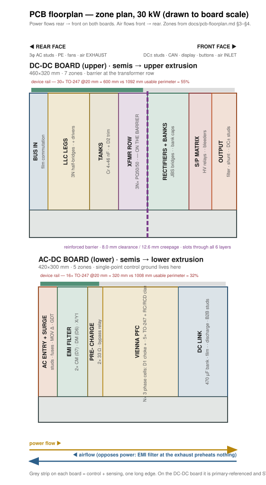

# PCB Floorplan Plan — sections first, then components (§30 rev B, two-board sandwich)

Status: **planning**. No PCB exists yet. This document fixes the *zones* — where each schematic
section lives on each board, which way power flows, where the isolation barriers run, and which
edges belong to the heatsinks — before any component is placed. Placement follows the zones; the
zones do not follow the placement.

Feasibility numbers are generated: `node calculations/floorplan-budget.mjs`.

Related: [interconnect.md](interconnect.md) (E17 sandwich), [insulation-coordination.md](insulation-coordination.md)
(creepage table), [thermal-report.md](thermal-report.md) (loss per block),
[magnetics.md](magnetics.md) (D1–D7 envelopes), [schematic-drawing-set.md](schematic-drawing-set.md)
(the 217 sections this maps).

---

## 0. Envelope and axis convention

### The module is a 19-inch rack card

The product has to drop into the same cabinets as everything else in this class, so **width and
height are fixed by the rack and depth is the only free dimension**. That inverts the usual instinct
to draw a wide, shallow board: a board wider than the rack does not become a product no matter how
well it is laid out.

| | target | source |
|---|---|---|
| Face width | 482.6 mm nominal, **≤440 mm usable** between the rails | 19-inch rack |
| Height | **133.35 mm (3U)** | 3U is the dominant module height in this class |
| Depth | 400–560 mm, free to use | class-typical |

### Connector faces — diagonally opposite

**AC input and DC output sit at diagonally opposite corners**, which is the maximum separation the
box allows. That keeps the two HV harnesses from ever running parallel inside the cabinet — the
input-to-output conducted-coupling path that no amount of filtering fixes once the cables are
bundled together — and it keeps the AC entry away from the output sensing.

```
        REAR FACE                                            FRONT FACE (service)
   ┌─────────────────────────┐                        ┌─────────────────────────┐
   │ ▓▓ 3φ AC + PE ▓▓        │                        │        air INLET + filter│
   │ (LEFT quarter)          │                        │        display · buttons │
   │        fans / EXHAUST   │                        │        ▓▓ DC± OUT ▓▓     │
   │        (centre + right) │                        │        + CAN H/L on the  │
   │                         │                        │          plug side       │
   └─────────────────────────┘                        │          (RIGHT quarter) │
                                                      └─────────────────────────┘

   power:  rear-LEFT ──────────────────────────────────────────► front-RIGHT
   air:    rear-RIGHT ◄─────────────────────────────────────────  front-LEFT
```

- **CAN H/L is carried on the DC output connector plug, on its side** — not a separate front-panel
  connector. One plug leaves the module with power and comms together, so the cabinet harness is one
  assembly. Consequences for the layout are in §4: the CAN isolator and its floating CGND domain
  must reach the DC output connector, which sits on the **secondary** side of the barrier.
- Neither connector blocks the air path, because each face is split — the connector takes one
  quarter and the air takes the rest, on opposite sides.
- Power and air therefore cross diagonally rather than running down one lane, which sweeps the whole
  board instead of a single channel.

> The alternative worth knowing: most cabinet modules blind-mate **all** power at the rear and keep
> the front for air, handle and display only. That is easier to service and safer to hot-swap. This
> plan follows the directive to put the DC output (with CAN on its plug) on the front-right; if the
> module is ever cabinet-mounted rather than standalone, moving the DC output to the rear-right
> keeps the diagonal and gains blind-mating.

### Axes

- **X** runs rear→front: the dominant power-flow axis on both boards.
- **Y** is board width across the rack (≤440 mm), carrying the diagonal offset: the AC entry sits at
  low Y, the DC output at high Y.
- **Z** is the sandwich stack: lower extrusion / AC-DC board / tunnel / DC-DC board / upper extrusion.

```
   UPPER BOARD (DC-DC)   bus in → LLC legs → tanks → XFMR ║ JBS → banks → S/P → out (front-right)
   ═══════════════════════════════════════════════════════════════════════════════
   inter-board TUNNEL    magnetics stand here, in the airstream — and set the module height
   ═══════════════════════════════════════════════════════════════════════════════
   LOWER BOARD (AC-DC)   AC entry (rear-left) → EMI → precharge → Vienna PFC → DC link → B2B studs
```

The board-to-board handoff (DCP/DCN/PE M8 pillars) is at the **front** of the AC-DC board and the
**rear** of the DC-DC board. See §8.

### Why airflow opposes power flow

Air enters at the front (service face) and exhausts at the rear. Two reasons, both measurable:

1. **Nothing downstream of the exhaust gets preheated.** The EMI filter dissipates 49 / 132 / 248 W
   ([thermal-report.md](thermal-report.md)) — the largest single airstream load on the AC-DC board.
   Placed at the exhaust it heats only the air leaving the box. Placed at the inlet it raises the
   inlet temperature of *every* magnetic and every electrolytic behind it.
2. **The life-limiting parts get the coldest air.** The 470 µF/450 V electrolytics set the module's
   service life (Arrhenius: ~2× life per 10 K cooler). The bank capacitors sit near the front on the
   DC-DC board; the DC-link bank sits mid-board on the AC-DC board. Both are ahead of the EMI filter
   and the PFC chokes in the airstream.

Front inlet also puts the **filter at the service face** and runs the enclosure at positive pressure
so dust enters only through the filter. Fans stay at the rear, in the exhaust, off the service face —
at 120 kW four 120 mm fans would otherwise consume 480 mm of a 440 mm-wide front panel, which is by
itself a reason the 120 kW single-module form does not close (§2).

<p align="center"></p>

Drawn to board scale by `node calculations/floorplan-svg.mjs <sku>` from the same zone table as §3–§4.
The bar above each board is its device-rail budget against usable perimeter — green inside the
track, red overrunning it. `floorplan-120kw.svg` shows the 136 % overrun that §2 quantifies;
`floorplan-60kw.svg` shows the 91 % case.

---

## 1. What the floorplan may not violate

These are frozen; the zones are built around them, not negotiated with them.

| Constraint | Value | Source |
|---|---|---|
| Board outlines | 420×300 + 460×320 / 460×420 + 520×420 / 560×600 + 640×620 mm | architecture.md §Scaling |
| Layers | 6, both boards | bom-guide.md |
| Semis to heatsinks | AC-DC semis → **lower** extrusion, DC-DC semis → **upper** extrusion, component faces inward | interconnect.md E17 |
| Magnetics | stand in the **inter-board tunnel**, in the primary airstream | interconnect.md E17 |
| B2B power | 3× M8 stud pairs DCP / DCN / PE, stud-stud creepage **≥14 mm**, ≤50 µΩ per joint | interconnect.md, busbar-drawings.md |
| B2B signal | 16-way, 300 mm **shielded** harness, shield to PE at the AC-DC end only | interconnect.md |
| Clearance / creepage | 300 Vrms 3.0/4.0 · 830 VDC bus 4.0/5.5 · 1000 VDC out 4.5/6.3 · **reinforced pri↔sec 8.0/12.6 + routed slots** | insulation-coordination.md |
| Y-caps | 3 line-PE + 2 output-PE, Y1 440 VAC class, only across defined barriers | insulation-coordination.md |
| CAN domain | CGND **floats**, 4 mm to everything, 1 MΩ ∥ 4.7 nF bleed to DGND | insulation-coordination.md |
| Bus busbar | DC+/DC− laminated pair ≤2 mm apart, ≤40 nH per 300 mm | busbar-drawings.md |
| Fans | 2 / 2 / 4 × 120×38 mm, ~110 Pa class | thermal-report.md |

---

## 2. Feasibility of the frozen outlines — run before trusting them

`calculations/floorplan-budget.mjs` asks three questions the outline alone cannot answer.

**EDGE.** Every power semiconductor is a TO-247 that must reach an outer extrusion, so it needs a
clamp-bar rail. Perimeter is a consumable resource — and on the DC-DC board it is **two** resources,
because primary FETs and secondary JBS sit on opposite sides of the reinforced barrier and cannot
share a rail. Pooling them across the barrier compares unlike with unlike and flatters the answer;
the first version of this analysis did exactly that and reported the 30 kW DC-DC board as a
comfortable 55 % when its secondary rail alone is at 96 %.

| board | outline | TO-247 | rail needed | usable perimeter | use |
|---|---|---|---|---|---|
| 30kw-acdc | 420×300 | 16 | 320 mm | 1008 mm | 32 % |
| 30kw-dcdc | 460×320 | 30 | 600 mm | 1092 mm | 55 % |
| └ primary (SiC FET) | | 6 | 120 mm | 591 mm | 20 % |
| └ **secondary (JBS)** | | **24** | **480 mm** | **501 mm** | **96 %** |
| 60kw-acdc | 460×420 | 31 | 620 mm | 1232 mm | 50 % |
| 60kw-dcdc | 520×420 | 60 | 1200 mm | 1316 mm | 91 % |
| └ primary | | 12 | 240 mm | 709 mm | 34 % |
| └ **secondary** | | **48** | **960 mm** | **607 mm** | **158 %** |
| 120kw-acdc | 560×600 | 61 | 1220 mm | 1624 mm | 75 % |
| 120kw-dcdc | 640×620 | 120 | 2400 mm | 1764 mm | 136 % |
| └ primary | | 24 | 480 mm | 945 mm | 51 % |
| └ **secondary** | | **96** | **1920 mm** | **819 mm** | **234 %** |

**The binding constraint is the secondary rectifier rail, and it binds on every SKU — 96 % at
30 kW, 158 % at 60 kW, 234 % at 120 kW.** Nothing else on either board is close. The AC-DC board,
which has no reinforced barrier and therefore one pooled perimeter, is comfortable everywhere.

<p align="center"></p>

**FILL.** Dominant parts only — magnetics, electrolytics, TO-247 rails, relays, shunt — before any
creepage, busbar, control or sensing copper: 48 / 47 % at 30 kW, 59 / 63 % at 60 kW, 68 / 70 % at
120 kW. The 55 % planning gate is exceeded on four of six boards.

**ENVELOPE.** Does the module fit a 19-inch 3U rack card at all? Two dimensions decide it.

*Height.* The sandwich stacks outer face to outer face:

| | mm |
|---|---|
| heatsink fins + extrusion base (lower) | 26 |
| device + clamp gap | 8 |
| AC-DC board | 2.4 |
| **tunnel — set by the D1 choke** (3 stacked H17 toroids = 51 mm core + winding build) | **62** |
| DC-DC board | 2.4 |
| device + clamp gap | 8 |
| extrusion base + heatsink fins (upper) | 26 |
| **total** | **134.8** vs 3U = 133.35 |

**Over by 1.5 mm, before any insertion clearance.** The tunnel is 46 % of the module height, so
**the PFC choke stack is the part that decides whether this is a 3U product.** Recovering ~5 mm is
mechanical, not electrical: 18 mm fins instead of 20 (−4 mm) plus 1.6 mm boards instead of 2.4
(−1.6 mm) closes it at 129.2 mm with insertion clearance. Both cost something — fin area is
heatsink performance, board thickness is stiffness on a board carrying 0.9 kg chokes — so this is a
real trade to settle with the mechanical design, not a rounding error to wave through.

*Width and depth.* Re-proportioned to the rack, with width fixed at ≤440 mm and depth free:

| board | as drawn | area | at ≤440 mm wide | verdict |
|---|---|---|---|---|
| 30kw-acdc | 420×300 | 1260 cm² | 440×287 | width ok · **fits** |
| 30kw-dcdc | 460×320 | 1472 cm² | 440×335 | too wide as drawn · **fits re-proportioned** |
| 60kw-acdc | 460×420 | 1932 cm² | 440×440 | too wide as drawn · **fits re-proportioned** |
| 60kw-dcdc | 520×420 | 2184 cm² | 440×497 | too wide as drawn · **fits re-proportioned** |
| 120kw-acdc | 560×600 | 3360 cm² | 440×**764** | **does not fit — 764 mm deep** |
| 120kw-dcdc | 640×620 | 3968 cm² | 440×**902** | **does not fit — 902 mm deep** |

**Four of the six boards are wider than a 19-inch rack as drawn.** Four of them fix by
re-proportioning — narrower and deeper, same area, no electrical change. **The two 120 kW boards
cannot be made to fit at any proportion**: they need 764 and 902 mm of depth against a class maximum
around 560.

### What this means

**The 20 A secondary JBS count is the problem, at every rating.** 24 / 48 / 96 diodes are
simultaneously the rail that does not fit, the largest single loss in the module (360 / 721 /
1441 W — [thermal-report.md](thermal-report.md)), and a large share of the 120 kW semiconductor
cost. One change addresses all three. Three ways out, in order of preference:

1. **Cut the secondary device count.** A 1200 V **40 A**-class JBS halves it to 12 / 24 / 48, which
   takes the rail to 48 % / 79 % / 117 % — 30 and 60 kW fit outright. The **SR variant** already
   costed in [thermal-report.md](thermal-report.md) (−214 / −427 / −854 W) does better on loss and
   better still on count. This is the change to make first because it is electrical, not mechanical.
2. **Interior clamp rails.** Cut windows in the PCB over raised bosses on the extrusion; devices lie
   flat on the boss with leads bent up into the board at the window edge. This turns "perimeter" into
   "any straight run on the correct side of the barrier". **120 kW needs this even after (1)** — the
   secondary budget is 819 mm, i.e. 41 devices, and 48 is still over. Costs a machined rather than a
   plain extruded heatsink face.
3. **Stop building 120 kW as one module.** Three independent measurements now say the same thing:
   the secondary rail is at 234 %, the boards need 764 and 902 mm of depth in a 560 mm class, and
   640×620 mm exceeds the usable area of a standard 457×610 mm (18″×24″) production panel. This is
   not a layout problem to solve; it is the wrong unit of product.

   The platform is already built for the alternative — the repo's own architecture is *"one
   repeatable ~10 kW cell pair instantiated 3/6/12×"* — so **120 kW becomes 4× 30 kW or 2× 60 kW
   rack modules in one cabinet**, which is how this class is actually shipped. Every number in this
   section then closes: one board set, one extrusion, one fan count, one fab panel, and a 60 kW
   module that fits a 3U card at 440×497 mm.

   It also collapses the family. Instead of three board pairs, three extrusion lengths, three fan
   counts and three busbar sets, there is **one 30 kW module (or one 30 and one 60)** and the SKU
   becomes how many go in the rack. That is a large reduction in NRE, qualification and inventory,
   and it removes the 120 kW front-panel clash (four 120 mm fans in a 440 mm face) outright.

> **Recommendation, in order.** Take **(3)** first — make the rack module the product and 120 kW a
> multi-module cabinet. It is the only change that resolves the rail budget, the envelope and the
> fab panel together, and it is what the market form factor already assumes. Then take **(1)**, the
> secondary rectifier trade, which is still worth making on its own: it is the module's largest loss
> and it moves the 30 kW secondary rail from 96 % to 48 %. **(2)** interior rails then becomes an
> option for density rather than a necessity.
>
> If the three-SKU family must be kept as single modules, the order reverses and 120 kW needs (1)
> *and* (2) *and* an envelope larger than 3U — that path should be costed before it is chosen.

---

## 3. AC-DC board (lower) — zone plan

33 sections at 30 kW. Bands run across the board along X; the control/sense strip runs along one
long edge in Y.

```
 REAR ═══════════════════════════════ AC-DC BOARD ══════════════════════════════ FRONT
 (AC in, exhaust)                                                        (to B2B pillars)

 ┌──────────┬──────────────┬─────────┬──────────────────────────┬─────────────┐
 │ Z1       │ Z2           │ Z3      │ Z4  VIENNA PFC POWER     │ Z5 DC LINK  │
 │ AC ENTRY │ EMI FILTER   │ PRE-    │  ×N lanes of 3 phases    │             │
 │ + SURGE  │              │ CHARGE  │                          │             │
 ├──────────┴──────────────┴─────────┴──────────────────────────┴─────────────┤
 │ Z6 AC-SENSING pods (local to each measured node)                            │
 ├─────────────────────────────────────────────────────────────────────────────┤
 │ Z7 CONTROL STRIP  ·  Z8 AUX POWER            (one long edge, full length)   │
 └─────────────────────────────────────────────────────────────────────────────┘
   ▲ device rail (lower extrusion) along the opposite long edge + interior rails
```

| Zone | Sections | Contents | Placement rule |
|---|---|---|---|
| **Z1 AC ENTRY** | `INPUT-EMI / AC-ENTRY`, `INPUT-EMI / SURGE` | AC studs, fuses, MOV Δ, GDT | Hard against the rear face. Studs on the face; fuses and MOV in the first 40 mm. |
| **Z2 EMI FILTER** | `INPUT-EMI / EMI-FILTER` | 2× 3-φ CM choke (D7), DM choke (D6), X caps, 3× Y1 to PE | **Full-width band. No switching copper on any layer behind, beside or beneath it.** Its own PE reference island, bonded to chassis at one point on the rear face. Input side and output side of the filter must not face each other. |
| **Z3 PRECHARGE** | `INPUT-EMI / PRECHARGE` | 2× 33 Ω, HF167F bypass relay, mirror contact | Between filter and PFC. Resistors need their own thermal space — they are pulse-rated, not continuous. |
| **Z4 VIENNA PFC** | `VIENNA-PFC / PHASE-A/B/C` ×N | per phase: D1 choke, common-source SiC pair, 2× JBS to rails, RC + RCD clamp | **One phase = one contiguous cell**: choke in the tunnel, its 5 TO-247 on the adjacent rail segment, clamp and snubber inside the cell. Cells repeat along Y for the 3 phases, along X for the N lanes. Hot loop (device pair + clamp + local film cap) closed inside the cell, target < 5 mm² loop area. |
| **Z5 DC LINK** | `DC-LINK / LINK-BANK-n`, `DISCHARGE`, `BUS-STUDS` | 2×(5…18)× 470 µF, film, 640 Ω discharge FET, DCP/DCN/PE M8 pillars | Front band. Electrolytics in the coolest available air on this board. Split-bus midpoint stays on this board. Pillars on the front edge, ≥14 mm stud-stud. |
| **Z6 AC-SENSING** | `LINE-CTS`, `SENSE-VAC1/2/3`, `SENSE-VBUS`, `SENSE-VMID`, `ANALOG-MID`, `ISO-BIAS`, `NTC`, `STAR` | line CTs, 8× series 1206 HV dividers, iso amps | **Sense pod at the measured node, not at the MCU.** Divider + iso-amp sit at the HV node; only the isolated output travels to the control strip. Line CTs at Z1, bus/mid dividers at Z5. `STAR` = the analog star point, one location, on the control strip. NTC ×2: one at the *inlet* (front, per interconnect.md T_INLET), one on the heatsink. |
| **Z7 CONTROL** | `CONTROL / MCU`, `SAFETY`, `SWD`, `COIL-DRIVER`, `GROUNDING`, `RAIL-MON` | GD32G553, 74HC11 interlock, SWD header, ULN2803A, single-point control-ground bond | Continuous strip along one long edge, full board length. **`GROUNDING` defines the single-point control-ground bond for the whole module** (interconnect.md) — fix its location first; everything else references it. SWD header reachable with the sandwich closed, or at least with only the top extrusion off. |
| **Z8 AUX POWER** | `AUX-POWER / FLYBACK`, `RAILS`, `BUCK-3V3`, `FANS`, `INTERCONNECT` | bus-fed flyback (D4 ETD34, 1700 V SiC), ±15/24/5 V rails, 3V3 buck, fan headers, JICA | At the control-strip end nearest the B2B pillars — the flyback is bus-fed from DCP→MID, so it wants to be near Z5, and `INTERCONNECT` wants to be near the harness exit. Fan headers at the rear (fans are at the exhaust). |

### AC-DC rules that outrank tidiness

- The **EMI filter band is sacred**. If a zone has to shrink, it is not this one. Any switching-node
  copper that passes behind the filter defeats it, and no amount of component quality recovers it.
- **Each Vienna phase is a self-contained cell.** A phase's choke, switch pair, rail diodes and
  clamp belong together; interleaved lanes repeat the cell, they do not interleave its parts.
- The **midpoint** is a sensed node with a balancing loop — it must be a low-impedance plane region,
  not a trace, and its sense tap must be Kelvin.
- **Line CTs must see only line current** — keep them out of the fringing field of the DM/CM chokes
  they sit next to (§6).

---

## 4. DC-DC board (upper) — zone plan

28 sections at 30 kW. **This board is cut in two by a reinforced isolation barrier** (8.0 mm
clearance / 12.6 mm creepage + routed slots). Everything else is secondary to that line.

```
 REAR ═══════════════════════════════ DC-DC BOARD ══════════════════════════════ FRONT
 (from B2B pillars)                                                   (DC out, CAN, HMI, inlet)

 ┌────────┬──────────────┬─────────┬═══════════╦─────────────┬──────────┬────────────┐
 │ Y1     │ Y2 LLC LEGS  │ Y3      │ Y4 XFMR   ║ Y5 SECONDARY│ Y6 S/P   │ Y7 OUTPUT  │
 │ BUS IN │  ×3N legs    │ TANKS   │ ROW       ║ RECTIFIERS  │ MATRIX   │            │
 │        │              │         │ (barrier) ║ + BANKS     │          │            │
 ├────────┴──────────────┴─────────┴═══════════╬─────────────┴──────────┴────────────┤
 │ Y8 CONTROL STRIP (primary-referenced)       ║  Y9 secondary sense pods (isolated)  │
 └─────────────────────────────────────────────╩──────────────────────────────────────┘
   PRIMARY  ◄────────────── reinforced barrier ──────────────►  SECONDARY
   ▲ primary device rail (upper extrusion)      ▲ secondary device rail — ≥8 mm apart in air
                                                              Y10 HMI/CAN = front daughter card
```

| Zone | Sections | Contents | Placement rule |
|---|---|---|---|
| **Y1 BUS IN** | `LLC-LEGS / BUS-IN` | film commutation caps, B2B stud landing | Rear edge, directly at the pillars. Film caps between the pillars and the first leg — the bus loop starts here. |
| **Y2 LLC LEGS** | `LLC-LEGS / LEG-n` (3 per channel) | SiC half-bridge pairs + NSI6611 drivers + DESAT | **One leg = one cell**: 2 TO-247 on the rail, driver within 15 mm of the gate pins, bootstrap/iso bias local. Legs repeat along Y for the 3 phases, along X for the N channels. Gate loop and power loop both closed inside the cell. |
| **Y3 TANKS** | `LLC-TANKS / TANK-n` | 4× 46 nF 1200 V PP + D2 trim inductor | Immediately after its leg. The tank carries the full resonant current — it is a *power* zone, not a passive one. Trim inductor is a gapped toroid: see §6. |
| **Y4 TRANSFORMER ROW** | (D3 ×3 per channel) | 3× PQ50/50 stacked, TIW secondaries, 1-turn Cu shield to primary star | **This row *is* the barrier.** Cores straddle the routed slot; primary pins on the primary side, secondary pins on the secondary side, nothing crossing. Shield lead returns to the primary star only. |
| **Y5 SECONDARY RECTIFIERS + BANKS** | `BANKS-SP / BANK-A`, `BANK-B` | 2× JBS bridge per section, bank electrolytics + film | Secondary side. Bridges on the secondary device rail; bank caps in the coolest air (front-ward). Banks A and B float — treat **both** at 1000 V class to PE and to each other. |
| **Y6 S/P MATRIX** | `BANKS-SP / SP-MATRIX`, `BLEEDERS` | K_PAR_A/B + 10 Ω pre-insertion, K_SER, K_OUT, commanded bleeders | Guarded island — insulation-coordination.md calls this out explicitly. Relay lugs are M6 busbar joints, not PCB pads. Mirror contacts routed as a separate readback group. |
| **Y7 OUTPUT** | `OUTPUT-SENSING / OUTPUT` | output filter, 4-terminal manganin shunt, DC± studs, **CAN contacts on the same plug** | Front face, **right quarter** (§0 diagonal). **Kelvin taps on the shunt are untouchable** — no other copper in their loop. OUT± keeps 6.3 mm to chassis everywhere. |
| **Y8 CONTROL** | `CONTROL / MCU`, `SAFETY`, `SWD`, `COIL-DRIVER`, `GROUNDING`, `BUCK-3V3`, `INTERCONNECT` | MCU-LLC, interlock, relay coil driver, 15→3.3 V buck, JICB | Strip along one long edge, **primary side only, stopping at the barrier**. Primary-referenced because its rails arrive over the harness from the AC-DC board's single-point ground. Relay *coils* are driven from here; relay *contacts* are secondary — the relay body is itself a barrier component. |
| **Y9 SECONDARY SENSE** | `OUTPUT-SENSING / SENSE-VBKA/VBKB/VOUT`, `ANALOG-MID`, `ISO-BIAS`, `NTC` | bank/output dividers, iso-shunt amp, isolated bias | Pods on the **secondary** side at their measured nodes, each with its own isolated bias, each crossing the barrier once through its isolator. No secondary-referenced signal reaches the MCU un-isolated. |
| **Y10 HMI + CAN** | `COMMS-HMI / HMI`, `COMMS-HMI / CAN` | 2-digit display, 74HC595 + digit mux, 2 buttons, isolated CAN + floating CGND | **Split — see below.** CAN isolator stays on the control strip and only the isolated pair flies to the DC output plug; display and buttons go on a front-panel daughter card. |

### The HMI and CAN problem, and the fix

The control strip is primary-referenced and stops at the barrier. The display and buttons are on the
**front** face, and **CAN H/L now leaves on the DC output connector plug** — which sits at the
front-**right**, on the *secondary* side of the barrier and at the far diagonal corner from the AC
entry. Running primary-referenced logic that distance, over or beside the floating banks and the
1000 V output, is the worst wire in the module. Two different fixes, because they are two different
problems:

**CAN — isolate early, then fly the isolated pair.** The CAN transceiver and its isolator stay on
the **main board at the control strip**, on the primary side where the MCU is. Only the already-
isolated `CANH / CANL / CGND` group leaves, as a short **shielded twisted lead routed through the
tunnel** to the CAN contacts on the DC output plug. Nothing crosses the secondary zone on copper.

- The floating CGND domain and its 4 mm keep-out then exist in exactly two places — a small island
  at the control strip, and the connector contacts — instead of along a board-length trace.
- Where the lead passes over secondary copper it is in air, in the tunnel, not on a layer, so the
  clearance question is a harness-routing one with a defined path rather than a creepage question on
  every layer it would otherwise cross.
- The 1 MΩ ∥ 4.7 nF bleed to DGND ([insulation-coordination.md](insulation-coordination.md)) stays
  with the isolator on the main board.
- Putting the isolator at the connector instead would mean running primary-referenced SELV logic the
  full diagonal — the exact thing being avoided.

**HMI — a front-panel daughter card.** Display, digit mux, 74HC595 and the two buttons go on a small
card behind the front panel, joined to the control strip by a shielded ribbon routed along the board
edge in the tunnel. The enclosure already has to align a display window and button actuators
([dfm-production.md](dfm-production.md) step 7), so the card is the part that carries that alignment.

Together these mean **no SELV logic exists anywhere past the barrier on the main board**, and both
crossings are defined, short and testable. Cost: one small PCB, one connector pair and one shielded
lead — the cheapest items in this document, removing the hardest routing problem on the board.

### The shared extrusion is an isolation path

Primary FETs and secondary JBS bolt to **the same upper extrusion**. That extrusion must be
**PE-bonded**, so the structure is primary→pad→PE and secondary→pad→PE — two basic barriers in
series, not one reinforced gap. Consequences:

- each device's insulating pad must be qualified against its own barrier to PE, and the hipot plan
  must test both, not just one;
- the **primary and secondary device rails must be separated in air on the extrusion**. 8 mm is the
  reinforced clearance minimum; align the rail gap with the PCB barrier slot and take ≥20 mm so the
  mechanical and electrical barriers are the same line;
- the extrusion's PE bond is a safety conductor — spec it (bond strap, ≥25 A per the EOL earth-bond
  test), do not rely on the mounting screws.

---

## 5. MOSFET and heatsink strategy

The sketch's note — *"better to place the mosfets in the boundary so that we can attach proper
heatsink"* — is right, with one qualification the numbers force.

**Rail rules (all SKUs)**

1. **Devices sit on rails, never in the field.** A rail is a straight run of TO-247 at 20 mm pitch
   with a continuous clamp bar over the tabs, M4 at 1.2 N·m, phase-change TIM 0.5 K·cm²/W class,
   torque pattern centre-out ([dfm-production.md](dfm-production.md) step 5).
2. **A rail segment belongs to one cell.** Vienna phase = 5 devices = 100 mm. LLC leg = 2 devices =
   40 mm. Secondary bridge = 8 devices = 160 mm. Do not mix cells on a segment; the hot loop must
   close inside the cell.
3. **The gate driver is on the board directly behind its rail segment**, within **10 mm** of the gate
   pins (§7), with its own local bias. Gate and Kelvin-source returns run as a pair, never split.
4. **Primary and secondary rails on the DC-DC extrusion are ≥20 mm apart**, aligned to the PCB
   barrier slot (§4).
5. **Perimeter first, interior rails when perimeter runs out** — 60 and 120 kW need interior rails
   (windows over machined bosses). Interior rails are *better* electrically: they shorten the path
   from the device to its DC-link capacitor. They cost a machined heatsink face.

**Mounting orientation.** Two options; pick one and hold it family-wide:

| | tab down on the extrusion, leads bent up | device standing, tab clamped to a vertical wall |
|---|---|---|
| board area | window in the PCB per rail | narrow strip at the board edge only |
| thermal | direct, short path, whole tab on the sink | direct, but the wall must be part of the extrusion |
| assembly | insert → bend → clamp; loose-fit then clamp per DFM step 2 | insert vertical, clamp bar horizontal |
| interior rails | **possible** | not possible |
| verdict | **recommended** — it is the only option that scales to 120 kW | fine at 30 kW only |

---

## 6. Magnetics placement

All magnetics stand in the **inter-board tunnel** in the primary airstream (E17). They are the
tallest parts and they set the sandwich height.

| Part | Qty | Envelope | Loss | ΔT limit |
|---|---|---|---|---|
| D1 PFC choke | 3/6/12 | ⌀89 mm finished, M6 centre bolt, ~0.9 kg | 33.5 W each | 45 K |
| D3 LLC transformer | 3/6/12 | 3× PQ50/50 + 4× M4 clamp | 20.5 W each | 55 K hotspot |
| D2 trim inductor | 3/6/12 | ⌀45 mm | in tank budget | 40 K |
| D6 DM choke | 1 (2 @120 kW) | ⌀57 / 67 / 89 mm | in filter budget | 45 K |
| D7 CM choke | 2 stages | ⌀72 / 90 / 112 mm | in filter budget | 45 K |

**Rules**

1. **Gapped cores are field sources; distributed-gap toroids are not.** D3 is centre-leg ground for
   Lm = 63 µH and D2 is a gapped sendust toroid — both radiate. D1, D6 and D7 are distributed-gap
   sendust/nanocrystalline and are comparatively quiet. So the keep-out budget goes to the
   transformers and trim inductors, not the chokes.
2. **No small-signal copper within one core height of a gapped core**, and orient the gap axis so
   its fringing field is perpendicular to any nearby sense loop. This is a hard constraint against
   the resonant CTs, which sit close to the tank by necessity.
3. **Mechanical mount, not solder mount.** D1 is 0.9 kg on an M6 centre bolt into a standoff, with a
   silicone pad; the winding leads are M5 ring lugs, torque 5 N·m. The PCB carries no D1 mass.
4. **Airstream, not wake.** Arrange chokes and transformers so no magnetic sits directly downstream
   of another wherever the board allows; where it cannot be avoided, the downstream part must be the
   one with the larger ΔT margin (transformer 55 K > choke 45 K).
5. **The transformer row is on the isolation barrier** and its position is therefore fixed by §4,
   not by thermal preference. The chokes have the freedom; the transformers do not.
6. **Height check.** D1 finished height plus clearance sets the tunnel, and the tunnel sets module
   height. This is the number to compare against commercial modules — pending research, treat the
   tunnel as the module's defining dimension and design the extrusion fin depth around what is left.

---

## 7. Component rules carried into placement

The zones say where a section goes. These say what placement inside a zone must satisfy. They are
the rules that a section-level plan cannot express but a placement will be judged against, so they
are written down now rather than discovered during routing.

### Switching cells

| Rule | Value | Applies to |
|---|---|---|
| Hot loop area | **≤ 5 mm²** — device pair + local film cap + return | every Vienna phase, every LLC leg |
| Gate driver to gate pin | **≤ 10 mm** | all 46 / 91 / 181 devices |
| Gate + Kelvin-source return | routed as a **pair**, never split, never sharing power return | all driven devices |
| Switch-node copper | **minimum area that carries the current** — it is an antenna, not a pour | SW nodes, Vienna mid-nodes, LLC half-bridge outputs |
| Under a switch node | **no traces on any layer**, and no sense or gate routing on the layer below | all switching zones |
| Snubber | RC / RCD placed across the device pads, not a detour | already specified per node in the schematic |
| Isolated bias | the QA01C-class module sits with its driver, not on the control strip | all isolated gate supplies |

Bootstrap rules do not apply — every driver here takes an isolated bias module, so there is no
bootstrap loop to keep short. That is a deliberate architecture choice worth not undoing.

### High-current copper

| Rule | Value |
|---|---|
| Above 10 A | **copper polygons, not traces** |
| Layer transitions | **≥1 via per 1 A**, 0.3 mm drill class, and the via field spread over the pour, not clustered at one corner |
| Power pads | **no thermal relief** — full connection; the pad is a conductor, not a soldering convenience |
| Copper weight | 2 oz signal/sense layers; **the bus and output pours want 3–4 oz** or an inlay. 2 oz everywhere is under-specified for a board carrying 39–156 A — settle this with the fab quote |
| Connectors | rated **≥2× operating current** |
| Fuse coordination | fuse I²t below the trace's failure point, not merely below its rating |
| Kelvin taps | shunt, midpoint, and every source-sense — unbroken, unshared, and not carrying load current |

### Isolation, as a component property

The barrier is not only a gap in copper; each part sitting on it is part of the barrier.

- **Solder mask is not insulation.** Every creepage figure is a **bare-board** distance. Do not let
  a mask-over-gap count.
- **Every layer respects the barrier**, and the routed slot goes through all six.
- **Mounting holes, test pads, fiducials and tooling holes stay outside the barrier.** A test pad
  dropped inside it is the classic way a compliant layout becomes non-compliant late.
- **A component's own pin-to-pin spacing must meet the barrier it straddles** — the D3 transformer,
  every isolator, every Y1 cap, and the HV relays. A 12.6 mm PCB barrier bridged by an 8 mm-pitch
  part is an 8 mm barrier.
- **Altitude** > 2000 m derates clearance; the manual note already exists, the layout should carry
  the margin rather than sit exactly on the limit.

> **DQ item — reconcile the reinforced figure before the barrier width is frozen.**
> [insulation-coordination.md](insulation-coordination.md) uses **8.0 mm clearance / 12.6 mm
> creepage** for the reinforced primary↔secondary barrier at 1000 VDC working, which is the standard
> doubling of its own 4.5 / 6.3 mm basic row (PD2, material group IIIa, CTI ≥175) and is internally
> consistent. A common conservative figure for reinforced insulation around 800 VDC is **11 mm
> clearance / 25 mm creepage** — roughly double the creepage. The difference is not academic: it
> sets the width of the barrier band on the DC-DC board, which is already the most area-constrained
> board in the family (§2). Resolve it against the purchased edition of IEC 62477-1 / 60664-1 at DQ,
> with the pollution degree and material group stated, **before** the DC-DC outline is committed.

### EMI, at component level

- **Filter at every external port** — AC in, DC out, CAN, and the fan/HMI harnesses. The AC port is
  already a two-stage CM + DM design; the others need at least a CM bead and a defined return.
- **Stitching vias along board edges and around every connector**, spaced ≤ λ/20 at the highest
  frequency of concern.
- **No signal crosses a plane split.** This is the converse of the barrier rule and is violated more
  often: the barrier makes splits legitimate, so every net that approaches one must be checked.
- **Edge rate is a design variable.** SiC turn-on speed trades switching loss against radiated
  emissions; the gate resistors are already differentiated by topology (Vienna 4.7/4.7 Ω, LLC
  2.2 Ω off / 4.7 Ω on). Treat them as the EMI adjustment of last resort at pre-compliance, and
  record the loss cost when they change.
- Loop area is the term that squares in the radiated-field estimate ($E \propto f^2 A I / d$), so
  the hot-loop rule above is an EMI rule, not only an efficiency one.

### Thermal, at component level

- **Heat sources separated from sensitive parts**: no sense front end, reference, or electrolytic in
  the immediate wake of a magnetic or a device rail.
- **Thermal vias under every dissipating pad**, and copper spreading area that has somewhere to go —
  a pour that dead-ends spreads nothing.
- **Junction-temperature headroom, and a number the documentation should stop leaving ambiguous.**
  The worst case is **Tj 138–139 °C against a "ceiling 150"** ([thermal-report.md](thermal-report.md)),
  and 150 °C is used throughout the repo as a *design* limit — E3 rejected 70 and 100 kHz on
  "Tj > 150 °C". The common reliability guideline is Tj ≤ 80 % of the **device maximum**, and the
  two readings are far apart: against a 150 °C maximum this design sits at 92 % and misses the
  guideline; against the 175 °C maximum typical of SiC parts in this class it sits at **79 % and
  meets it**. Nothing in the repo states the device figure. **Record the datasheet Tj(max) per part
  in the thermal report** so the ratio is unambiguous — it is a documentation fix, not a redesign,
  and the §K datasheet gate already has to open the same pages.
- IR-camera validation at the high-current production test is already in the EVT plan (T-04/T-23);
  the placement should leave the rails and magnetics visible to a camera with the sandwich open.

## 8. Board-to-board interface

- **Power:** DCP / DCN / PE M8 stud pairs on pillars. They are at the **front of the AC-DC board**
  and the **rear of the DC-DC board**, so the pillars are not vertical — the pair is offset in X by
  the difference in board length. Either accept an angled/stepped pillar, or set the boards' X
  origins so the two stud sets align vertically. **Aligning them is worth the outline change**:
  vertical M8 pillars are a bolted joint the EOL milliohm test can verify, an angled one is not.
- **Loop area:** DCP and DCN pillars adjacent and as close as ≥14 mm stud-stud creepage allows, so
  the board-to-board bus is a laminated pair, not a loop. Target ≤40 nH per 300 mm carries over from
  [busbar-drawings.md](busbar-drawings.md).
- **PE pillar** is the module's structural earth between the two extrusions — it also carries the
  extrusion PE bond of §4.
- **Signal:** 16-way shielded harness, shield to PE at the AC-DC end only. Route it along the
  control-strip edge of both boards, physically separated from the DCP/DCN pillars — the harness
  carries the hardware kill line and the internal link, and a bus transient coupled into either is a
  module-level fault.

---

## 9. Stackup and copper plan (6 layers, both boards)

| Layer | Function | Notes |
|---|---|---|
| L1 | power components + power copper + control components | 2 oz min; heavy-current shapes, not traces |
| L2 | reference: control GND under the control strip, **PE island under the EMI filter**, secondary GND under the secondary zone | segmented by domain, never a single global plane |
| L3 | DCP plane in the bus region; signal elsewhere | |
| L4 | DCN plane in the bus region; signal elsewhere | L3/L4 as a close-coupled pair gives the bus its low inductance |
| L5 | signal routing, gate/Kelvin pairs | |
| L6 | power return copper, thermal spreading | 2 oz min |

**Non-negotiable:** **every layer carries the isolation barrier.** A plane that crosses the barrier
on an inner layer defeats a barrier that looks correct on the top. The routed slots called for in
[insulation-coordination.md](insulation-coordination.md) go through all six layers, and the DRC must
have a rule that proves it rather than a designer who remembers it.

**Domain rule:** reference copper is partitioned by *component placement*, not by cutting slots in a
plane you then route across. Four references exist and must never be bridged except at their defined
single points: PE (chassis), primary control GND (bonded once, on the AC-DC board), secondary/output
GND, and the floating CGND.

---

## 10. Verify from each side

The check that finds the defect is the one performed from the viewpoint where the defect is visible.
Six viewpoints, each with its own question.

| View | The question | What it catches |
|---|---|---|
| **Top of each board** | does the power flow read left-to-right without doubling back? Is each cell contiguous? | cells split across zones, tangled bus |
| **Bottom of each board** | is there switching copper behind the EMI filter, the sense pods or the control strip? Does any plane cross the barrier? | the classic invisible EMI-filter defeat |
| **Rear face** | AC studs, PE, fan cutouts, exhaust area — is the AC entry clear of everything else, and is the exhaust unobstructed by magnetics? | connector collision, blocked exhaust |
| **Front face** | DC studs, CAN, display window, button actuators, filter grille — do they all fit the face, with the fan decision from §0 resolved? | front-panel overcommit (the 120 kW fan-vs-connector clash) |
| **Both long sides** | are the device rails continuous and clamp-accessible with the sandwich assembled? Can a clamp bar actually be torqued? | rails that cannot be assembled |
| **Sandwich closed (Z)** | tallest part vs tunnel height; harness and pillar routing; SWD and test-point access; airflow path unobstructed end to end | the assembly-order failure that only appears at mate |

**Per-board gate list, to be automated the way the schematic gates were:**

1. no switching-node copper within the EMI filter's footprint on any layer — geometric check
2. barrier slot continuous through all 6 layers, ≥8.0 mm clearance / ≥12.6 mm creepage — DRC rule
3. every creepage class from [insulation-coordination.md](insulation-coordination.md) as its own net-class rule
4. every TO-247 on a rail; every rail segment single-cell; every driver ≤10 mm from its gate pins
5. every gapped-core keep-out honoured against small-signal nets
6. Kelvin pairs (shunt, midpoint, source-sense) unbroken and un-shared
7. dominant-part fill and edge use inside the §2 gates — `floorplan-budget.mjs`
8. thermal: every rail's device count × per-device loss vs that face's Rth budget

---

## 11. Open items

| # | Item | Why it blocks | Owner |
|---|---|---|---|
| 1 | **3U height: recover ~5 mm** (fins 20→18 mm, boards 2.4→1.6 mm) (§2) | the stack is 134.8 mm against 133.35 mm before insertion clearance | mechanical |
| 1b | Re-proportion four boards to ≤440 mm wide (§2) | four of six are wider than a 19-inch rack as drawn | electrical + mechanical |
| 2 | **Secondary rectifier count — 40 A JBS or SR variant?** (§2) | the JBS rail is over budget on EVERY SKU (96/158/234 %); it is also the module's largest loss | electrical |
| 3 | Interior clamp rails for 120 kW (§2) | 120 kW is still over budget after the device-count fix | mechanical |
| 3b | 640×620 mm vs fab panel limit (§2) | the 120 kW pair may not be a standard fab item | fab RFQ |
| 4 | B2B pillar alignment — change an outline to make the pillars vertical? (§8) | bolted-joint verifiability | mechanical |
| 5 | HMI daughter card + isolated-CAN flying lead (§4) | removes the only long SELV run now that CAN exits on the DC output plug | electrical |
| 6 | **Reinforced creepage: 12.6 mm or 25 mm?** (§7) | sets the barrier band width on the most area-constrained board | insulation / DQ |
| 7 | Record datasheet Tj(max) per device (§7) | 138 °C is 92 % of 150 but 79 % of 175 — the guideline verdict flips | thermal / §K gate |
| 8 | Copper weight: 2 oz throughout, or 3–4 oz on the bus and output pours? (§7) | 39–156 A on 2 oz is under-specified | fab RFQ |
| 9 | D3 transformer finished envelope (VERIFY in `floorplan-budget.mjs`) | the fill numbers move with it | magnetics vendor |
| 10 | Commercial reference dimensions — module envelope, power density, airflow | tells us whether these outlines are competitive or oversized | research (in progress) |
