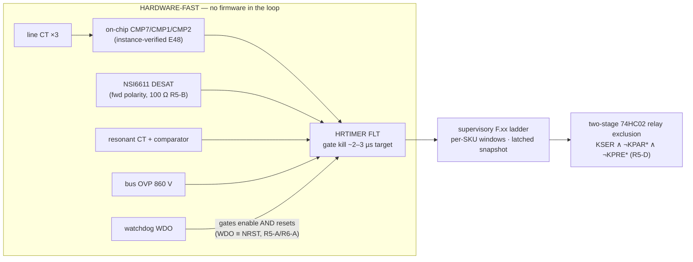

# 🛡️ Protection Thresholds

The F.xx fault ladder — hardware-fast and supervisory rows, per-SKU windows and current classes

  
  
  
  

> [!NOTE]
> **Purpose** — the F.xx fault ladder: every protection row with its threshold, response time, layer and action;
> the hardware-fast paths that act with no firmware in the loop; and the per-SKU classes and windows.
>
> **Gate coupling** — `review-checks` (R5-K, R6-B, R6-C, R7-A, R7-E, R8-A), `stress-audit` and `current-coordination`
> assert passages of this file word for word. Edits are **additive**: superseded values keep an arrow-note.

## At a glance

| Path | 30 kW | 40 kW | 50 kW (liquid · air) | Response |
|---|---|---|---|---|
| **F.01** line over-current (CT → comparator → HRTIMER) | 120 A pk | 155 A pk | 195 A pk | ~2–3 µs design target |
| **F.11** LLC tank over-current | 85 A pk | 115 A pk | 145 A pk | < 2 µs |
| **F.02 / F.12** DESAT | Vienna 47 pF blank · LLC 22 pF blank | = | = | worst 2.21 µs · 1.44 µs |
| **F.03** bus OVP | 860 V | = | = | 10–20 µs |
| **F.21** discharge window | 3 s | 4 s | 5 s | per SKU |
| **F.21b** bank-bleed window | 10.3 s | 15.5 s | 20.7 s | per SKU |
| Supervisory rows | 30 rows, 1 ms tick, latched pre-fault snapshot | | | 1 ms – 3 s |

## 1. The fault paths

## 2. The ladder

HW = comparator/driver hardware, independent of firmware; FW = supervisory firmware.
Tolerances include sense-chain error (divider 1% + 0.1% bottom, CT 1%+burden 1%, shunt 0.5% + amp).
Every latched fault stores a pre-fault snapshot (2 kSa ring: Vbus±, Iphase×3, Vout, Iout, fsw, state).
Display code `F.xx` per docs/interconnect.md HMI.

| # | Fault | Threshold | Act | Layer | Action | Code |
|---|---|---|---|---|---|---|
| 1 | PFC phase OC | 105 A pk (CT, per lane-phase; **27 Ω burden → 1.13 V above AVMID = 2.78 V at comparator; 150 A observability ceiling = 3.27 V, inside the rail — R3/audit**) → **E60: 120 / 155 / 195 A pk on 22 / 18 / 13 Ω** (§4) | <2 µs | HW comp→HRTIM kill | PFC PWM off, latch | F.01 |
| 2 | PFC DESAT | VDS>9 V @on, 2.5 µs blank → **E60: 47 pF blank, worst response 2.21 µs** (§4) | <3 µs | HW driver | soft-off, FLT latch | F.02 |
| 3 | Bus OVP | **860 V** total (E2) | <25 µs¹ | HW comp | all PWM kill | F.03 |
| 4 | Bus OV (fw) | 845 V, 1 ms | 1 ms | FW | controlled stop | F.04 |
| 5 | Bus UV | <620 V in run | 10 ms | FW | stop, retry ×3 | F.05 |
| 6 | Midpoint imbalance | |ΔV|>40 V, 10 ms | 10 ms | FW | derate→stop | F.06 |
| 7 | Input OV | >500 VAC any line-line, 20 ms | 20 ms | FW | stop | F.07 |
| 8 | Input UV / sag | <260 VAC, 100 ms (ride-through below) | 100 ms | FW | derate/stop | F.08 |
| 9 | Phase loss | line current <10% expected 40 ms (validated `400-phloss` sim) | 40 ms | FW | fold back → stop | F.09 |
| 10 | Phase sequence | PLL sign at start | start | FW | inhibit start (any rotation accepted, mapped) | F.10 |
| 11 | LLC resonant OC | 70 A pk per section CT (**2.0 Ω burden → 1.40 V above AVMID = 3.05 V at comparator — R2 CB-16**; full-load 46 A rms = 0.92 V rms) → **E60: 85 / 115 / 145 A pk on 1.2 / 0.91 / 0.75 Ω** (§4) | <2 µs | HW comp | LLC PWM off | F.11 |
| 12 | LLC DESAT | as #2 → **E60: 22 pF blank, worst response 1.44 µs** (§4) | <3 µs | HW | soft-off latch | F.12 |
| 13 | Output OVP | 1050 V (or mode-max +6%) | <25 µs¹ | HW comp on OV iso-sense | LLC off, K_OUT opens after I≈0 | F.13 |
| 14 | Output OV (fw) | cmd +4%, 2 ms | 2 ms | FW | CV clamp/stop | F.14 |
| 15 | Output OC | 102% Imax 100 ms / 130% 2 ms | — | FW (CC loop is primary) | CC fold, then stop | F.15 |
| 16 | Output short | **rev B: V<50 V & I>90%·I_cmd sustained 10 ms** (a healthy CC loop never exceeds 110% — found by fsm-sim) | 10 ms | FW | burst-retry ×3 → latch | F.16 |
| 17 | Bank imbalance (series) | |VA−VB|>25 V 10 ms | 10 ms | FW | stop, re-match | F.17 |
| 18 | Relay weld | ΔV<1.5 V @200 ms, ≥10 A ref (E13) | 200 ms | FW | latch, inhibit mode change | F.18 |
| 19 | Relay open-fail | mirror-contact readback mismatch 100 ms (hardware path per E30: RELAY_FB_* nets, KPRE series pair) | 100 ms | FW | latch | F.19 |
| 20 | Precharge fail | **as implemented (fsm.c): abort iff t > 400 ms AND bus < 50% line pk** — tolerant of the per-SKU charge time (t95 ≈ 160/288/576 ms at 30/60/120 kW → **E60 per-SKU deck: 193 / 231 / 310 ms at 30 / 40 / 50 kW**); the earlier "<90% in 400 ms" wording described the completion check, not the abort (R2 HR-14 doc fix) | — | FW | abort, open KPRE | F.20 |
| 21 | Discharge fail | bus >60 V after per-SKU timeout: **3 / 4 / 5 s** (`PMP_DISCH_TO_MS` rev G; powered-path physics 830→60 V ≈ 2.0/2.4/3.2 s at 640 Ω) — **R6: this timer's REAL coverage is the AC-PRESENT case** (bus held up by the permanent RPRE rectifier path → FC_DISCH = "isolate upstream first"); with AC removed the aux browns out at ~321 V mid-count and the passive path + enclosure label finish the job (R6 note below) | per SKU | FW | latch, discharge stays commanded | F.21 |
| 21b | Bank discharge fail | either bank >60 V @ **2.5×** bank-bleed τ after `CTL_QDISBK` (E33; τ = 8.8 kΩ·C_bank ≈ 4.1/8.3/16.5 s → timeout 10.3/20.6/41.2 s per SKU → **E60: 10.3 / 15.5 / 20.7 s at 30 / 40 / 50 kW**; 2.0τ would false-fail a healthy bleed at 525·e⁻² = 71 V — caught by the per-SKU deck) | per SKU | FW | latch, inhibit touch-service bit | F.21 |
| 22 | OT PFC/LLC/XFMR | 95/100/115 °C NTC | 1 s | FW | derate −2%/°C → stop @+10 °C | F.22–24 |
| 23 | Fan fail | tach < 50% cmd 3 s | 3 s | FW | derate 50%, F-code | F.25 |
| 24 | Aux UV | V15<12.5 V | <100 µs | HW driver-UVLO chain | gates hold-low (§28) | F.26 |
| 25 | Internal link loss | 50 ms no valid CRC frame → **retired at E40** (one brain, no inter-MCU link; code reserved) | 50 ms | FW both ends | controlled stop, needs re-ENABLE (§22) | F.27 |
| 26 | External CAN timeout | 1 s no valid ctrl frame (config) | 1 s | FW | ramp to 0, standby (§23) | F.28 |
| 27 | Sensor implausible | cross-checks (ΣI≈0, Vout vs bank sum ±5%, T range) | 100 ms | FW | stop, latch | F.29 |
| 28 | EEPROM CRC | at boot | boot | FW | safe defaults, F-code, no output | F.30 |
| 29 | Repeated fault lockout | 5 latches / 10 min | — | FW | lockout until CAN clear + ENABLE | F.31 |
| 30 | Watchdog | CWD-programmed window | HW | card supervisor: open-drain WDO gates the GATE_EN AND **and rides NRST_CARD** (R5-A/R6-A) — a hung MCU restarts with enables low | gates default-disabled through WDO-low and boot | F.32 |

Hardware comparator DACs: thresholds from MCU DAC but **latch path is analog** — firmware can
tighten, never loosen beyond table max (resistor-set ceilings on comparator references).

¹ R2/MR-18: OVP latency restated honestly — the iso-sense channels that feed OVP comparators now
carry a 1 nF filter (pole ≈ 23 kHz) + AMC1311 group delay → total trip path ≈ 10–20 µs. The old
"<10 µs" figure predated the isolated front-ends. Consequence at trip dV/dt (≈18 V/ms load-dump):
overshoot ≤ 0.5 V — no margin impact; the number in the table is now the number the hardware has.

## 3. Reverse-polarity coverage and response-time honesty (R4–R7)

**R4 note — Vienna DESAT direction coverage (E45):** each common-source pair's DESAT chain
senses the PHASE-side drain only; a fault of the opposite current polarity develops V_DS on the
MID-side device and is NOT seen by DESAT. That direction is covered by the **line-CT OC trip**
(F.11-class fast path, observable to 150/187 A pk inside the ADC rail) plus the gG fuse
coordination — two independent detectors per direction overall. Registered as the design basis;
EVT T-xx short-circuit characterization exercises BOTH polarities.

**R6 rev / R7-A rev — the reverse direction gets a DESIGNATED µs-class path (E47/E48):** the
line-CT signals route to on-chip comparators with DAC thresholds, muxed into an HRTIMER fault
input — a **hardware PWM kill with no firmware in the loop**. **R7-A: "CMP-capable pin" was
NOT a sufficient constraint** — the external reviewer traced the LQFP100 table and found
phases B and C on OPPOSITE INPUTS of the SAME comparator (pin 15/PC0 = CMP2_IM, pin 16/PC1 =
CMP2_IP; the DAC reference can only drive the IM side, so a signal there gets no independent
comparison). Allocation is now INSTANCE- and POLARITY-aware, executed by swapping AIN9↔AIN11
in the one pin-map generator (verified against GD32G553 Rev 2.0 Figure 2-3 + pin table):
**I_A0 → PC2/CMP7_IP · I_B0 → PA3/CMP1_IP (ADC0_IN3 keeps metering) · I_C0 → PC1/CMP2_IP**;
SNS_VAC1 → PC0/ADC01_IN5 (50 Hz metering, needs no CMP). Each phase gets ONE single-sided
threshold **on the DESAT-blind polarity BY DESIGN** — the opposite polarity is DESAT's own
µs-class coverage; this is the complement, not a window detector, and the register says so.
Timing: burden → 1 k/1 n (τ = 1 µs) → CMP (≈50 ns) → HRTIMER FLT (sub-cycle) ≈ 2–3 µs is a
**DESIGN TARGET until measured** — the ACX line CT is catalogued for 50/60 Hz metering and
its HF response is NOT vendor-specified; EVT T-xx measures the true threshold-crossing-to-
gate-off time in BOTH polarities against the device short-circuit withstand. Until that
demonstration, the honest floor below still stands:

**R5-K note — response-time honesty for the reverse direction (E46):** the two detectors are
NOT the same speed class, and the register must not read as if they were. Forward (PHASE-side)
faults clear at DESAT speed — µs-class blank + soft-shutdown at the device. Reverse-polarity
faults are seen by the line-CT OC path, which is **system-level, not device-level**: ~10–20 µs
analog front end, then the firmware latch at the 1 ms tick, then contactor/gate response —
with the gG fuse as the backstop for bolted faults. The MID-side device must therefore survive
the reverse-fault i²t until that trip lands. EVT T-xx runs the short-circuit characterization
in BOTH polarities and must demonstrate the MEASURED clearing time against the device
short-circuit-withstand rating before any protection claim ships on the datasheet.

## 3b. The discharge timeline (R6 · R8)

> [!CAUTION]
> Stored energy in the DC link and banks is lethal. The label and the procedure below are safety requirements, not
> guidance.

**R6 discharge-timeline honesty (E47):** the active discharge chain (QDISF + 4×160 Ω) is
powered by V15, which the bus-fed aux flyback stops producing at the **321 V brown-out**
(1 V × (1 + 4.8 M/15 k)); V15 then collapses in milliseconds (~0.2 A of bias load on 220 µF)
and the MCU (V3P3 ← V15 buck) browns out with it. The real AC-removed timeline is therefore
**two-phase**: active 830→~321 V in ≤1.2 s (τ = 640 Ω · C_link), then PASSIVE through the
balance pairs — **R8 correction (external retrace, confirmed in the netlists):** the 40/50 kW
links carry TWO bank blocks whose 2×47 k pairs PARALLEL to 47 k per half (94 k full-link);
only the single-bank 30 kW is 188 k. 321→60 V ≈ **370 / 222 / 296 s** at 30/40/50 kW —
totals ≈ 6.2 / 3.7 / 5.0 min; **the 30 kW is the slowest**, and the R7 report's dismissal of
the reviewer's 222 s figure was OUR error, retracted at E49. Consequences, registered: (1) the enclosure carries the
IEC 62477-1 stored-energy **warning label with the stated discharge time** ("isolate upstream, wait 10 min, AND
verify <60 V at the link and both banks before access") — tool-access only; the wait alone
is never the permission, the measurement is; (2) **F.21's real coverage is the AC-PRESENT case**: with
mains still feeding the link through the permanent RPRE paths the bus cannot fall (rectifier
holds ≥~530 V), the aux stays alive, the timer expires and FC_DISCH latches — correctly
signalling "discharge impossible, isolate upstream first". In the AC-removed case the MCU
dies mid-count and no fault is latched; safety is the passive path plus the label. (3) The
same hold-up limit applies to the bank bleeders (PV-driven QDISA/B lose their MCU command):
bank passive balance pairs give the same few-minute class. Do NOT "fix" this by lowering the
BO divider — 321 V is the flyback's full-load DCM floor (duty 22% of the D-version's 44%
ceiling at that bus; at 150 V it would need 58%).

---

## 4. E60 current-coordination classes (2026-09-13) — every trip above every real peak, every trip observable

> [!IMPORTANT]
> **What changed and why.** The E60 simulation campaign measured the currents the hardware trips
> must coordinate with. Earlier evidence had never measured them for 40/50 kW, and the 30 kW LLC deck
> was non-physical (no body diodes, legs ±6 kV). Measured with the power-solved ngspice LLC decks and
> the cycle-by-cycle Vienna model, the as-drawn **F.11 70 A pk sat exactly AT the 30 kW
> operating peak and BELOW the 40 kW (94 A) and 50 kW (118 A) ones**. **F.01 was undefined for 40/50 kW.**
> The **100 pF DESAT blank** computed a 3.39 µs worst response against a 2 µs discrete-SiC
> short-circuit withstand. The standing gate
> [`current-coordination.mjs`](../calculations/system/current-coordination.mjs) now owns all
> of it; `fsm.c` `pmp_fsm_set_rating_kw()` carries the classes the HAL programs into the CMP DACs.

**Rule (both hardware OC paths):** threshold ≥ **1.2 ×** the simulated worst peak (tolerance +
mismatch corners, grid dips/phase jumps) **and** the CT/burden/ADC chain stays inside the 3.27 V rail
through the simulated **3 µs fault rise** (threshold + Δi), so the latched snapshot shows the real
fault peak.

| SKU | F.01 line OC | line burden | F.01 V · ceiling | worst line peak (sim) | F.11 tank OC | res. burden | F.11 V · ceiling | worst tank peak (sim) |
|---|---|---|---|---|---|---|---|---|
| 30 kW | **120 A pk** | 22 Ω (1206) | 2.71 V · 184 A | 97 A (1.24×) | **85 A pk** | 1.2 Ω (2512 1 W) | 2.67 V · 135 A | 70.2 A (1.21×) |
| 40 kW | **155 A pk** | 18 Ω · ACX-1150 | 2.77 V · 225 A | 127 A (1.22×) | **115 A pk** | 0.91 Ω (2512 1 W) | 2.70 V · 178 A | 94.0 A (1.22×) |
| 50 kW L/A | **195 A pk** | 13 Ω · ACX-1150 | 2.66 V · 311 A | 159 A (1.22×) | **145 A pk** | 0.75 Ω (2512 2 W) | 2.74 V · 216 A | 117.9 A (1.23×) |

Fault races (simulated): line Δi(3 µs) = 46 / 50 / 72 A on the soft-saturating D1 at lot AL −8 %;
tank Δi(3 µs) = 44 / 48 / 52 A after an internal rectifier short. Per-SKU CT front-end decks
(`spice/protection/ct-frontend.mjs`) land every threshold within 20 mV of the computed DAC point and
keep F.xx + race ≤ 3.17 V.

**DESAT (F.02/F.12) — timing vs short-circuit withstand (NSI66x1A Rev 1.1 worst-case numbers).**

| Stage | Blank cap | Worst response (blank + 200 ns LEB + 300 ns delay + soft-off) | SCWT class | Share |
|---|---|---|---|---|
| LLC 1200 V (ZVS turn-on) | **22 pF** (was 100 pF) | **1.44 µs** (100 pF: 3.39 µs) | 2.0 µs — discrete 1200 V SiC at ≤800 V | 72 % |
| Vienna 750 V (hard turn-on) | **47 pF** (was 100 pF) | **2.21 µs** (100 pF: 3.53 µs) | 4.2 µs — 1200 V SiC at 50 % rated V (Wolfspeed PRD-08296 Fig. 12, 175 °C) | 53 % |

Minimum blank stays ≥ 0.48 µs (LLC) / ≥ 0.80 µs (Vienna) so the turn-on transient cannot
false-trip. EVT T-xx both-polarity SC test measures the real response against the vendor tSC
(RFQ acceptance: tSC ≥ 2 µs at 800 V / 18 V for the 1200 V part).

**Firmware requirements introduced (E60, `fsm.c`/`host_sim.c` 54/54):**
- **FW-R6 — PFC current-reference amplitude clamp** at 1.05 × the rated crest at 330 VAC: dips can
  never command more current; with it, 30 %/50 % dip recovery and a 20° phase jump add only ~3 A.
- **FW-R7 — line-tracking bus floor** `vbus_ref ≥ 1.08·√2·VLL`: a Vienna cannot regulate below the
  line-line crest. At 475/500 VAC on the old 650 V floor the cycle-by-cycle model showed
  **75–92 % overmodulation and 15–40 % current THD**; with the floor it shows 0.1 %.
- **FW-R8 — start-mode threshold = run entry (525 V):** a session starting at 501–525 V now selects
  PAR. Starting in SER put the bank at 250 V with twice the PAR tank current, a corner the 40 kW
  single LLC FETs can hold only derated.
- **Bank-bleed F.21b windows restated for the product SKUs:** 2.5·τ = **10.3 / 15.5 / 20.7 s**
  (30/40/50 kW; the 60/120 kW rows above are retired). Per-SKU deck:
  `spice/protection/prechg-disch.mjs`, all 9 cases PASS.

## 5. E65 fault-coordination update (2026-09-13) — F.11 sees both polarities, bond loss is a trip

> [!IMPORTANT]
> Additive update to § 2 row 11, § 4 and row 22. Two findings from the E65 end-to-end review, both reproduced from the
> committed ngspice internal-short waveforms: **(1)** the § 4 race was sampled at fixed times after the short, and **(2)** the
> F.11 comparator was single-polarity — the worst section's tank current swings **negative first**, so a positive threshold
> was crossed 4.5–6.4 µs late and the kill would have landed at **204 / 261 / 302 A** (30 / 40 / 50 kW), past the CT
> observability ceilings and the FET pulse class. Gate: `calculations/system/current-coordination.mjs` (reads
> `simulation-results/<sku>/llc-short.csv`, the committed |Ip| envelope after the short).

**F.11 hardware path (E65):** one dual 40 ns comparator per LLC section (`U1W`–`U3W`, TLV3202-class) — A trips above
`F11_VH`, B below `F11_VL`; push-pull outputs diode-OR through `D1W`–`D3W` (BAT54A, common anode) onto the FLT wire-OR =
**HRTIMER_FLT2 on PB10**, a hardware kill of every output in < 1 µs with no MCU comparator pin required (the on-chip CMP path
stays as a secondary). One ratiometric ladder per DC-DC board (`RF11H` / `RF11M` / `RF11L`, `CF11H` / `CF11L` 100 nF) sets the
window around AVMID.

| SKU | F.11 | Resonant burden | Ladder (H / M / L) | Window (V) | Threshold from the drawn ladder | Kill peak (+1 µs after the crossing) | Monitor peak (+3 µs) | Ceiling |
|---|---|---|---|---|---|---|---|---|
| 30 kW | **85 A pk** | **1.0 Ω** (was 1.2) | 2.43k / 5.11k / 2.43k | 0.80 / 2.50 | 84.6 A | **104 A** | 151 A | 162 A |
| 40 kW | **115 A pk** | **0.82 Ω** (was 0.91) | 2.15k / 5.76k / 2.15k | 0.71 / 2.59 | 115.2 A | **132 A** | 181 A | 198 A |
| 50 kW L/A | **145 A pk** | **0.68 Ω** (was 0.75) | 2k / 5.9k / 2k | 0.66 / 2.64 | 144.6 A | **158 A** | 216 A | 238 A |

D2 fault flux at the kill peak with the E65 trims: **130 / 121 / 134 mT** (≤ 217 mT = 60 % Bsat 130 °C). The E60 statement
"tank Δi(3 µs) = 44 / 48 / 52 A" in § 4 is superseded by this table.

**Row 22b (E65) — magnetics bond-loss cutout loop.** Six NC hermetic snap-action thermostats, **130 ±5 °C**, one per D3 and D2,
series-wired in the T_XFMR NTC loop. An open cutout (a lost gap pad or potting) or a broken NTC lead drives the channel to
the rail; the HAL guard `pmp_ntc_guard_c()` (ADC ≥ 0.98 Vref) reports **150 °C** → **F.22 latch**. A healthy 10 k B3435 NTC
reads ≤ 0.96 Vref at −40 °C, so the guard never trips on a cold sensor.

| Row | Fault | Threshold | Time | Detector | Action | Code |
|---|---|---|---|---|---|---|
| 11 (E65) | LLC resonant OC, both polarities | 85 / 115 / 145 A pk, window comparator per section | < 1 µs | HW comparator → HRTIMER_FLT2 | all PWM off, latch; HAL attributes F.11 vs F.02 from the I_RES capture at the FLT edge | F.11 |
| 22b (E65) | Magnetics bond loss / T_XFMR loop open | any cutout ≥ 130 ±5 °C, or loop open | 1 s | NTC channel at the rail → 150 °C | stop, latch | F.22 |

**Firmware requirements introduced (E65, `fsm.c` / `fsm.h`, host_sim 55/55):**
- **FW-R9 — bus reference every tick:** `vbus_ref` is recomputed in RUN/DERATE from max(vcmd, vout_meas). Set only in STANDBY,
  a session starting at 300 V (bus 650 V) that climbed to a 525 V bank ran gain 1.6, outside every simulated corner.
- **FW-R10 — S/P from the battery:** with a vehicle connected, the start mode uses `vext` and the RUN crossover uses
  `vout_meas`. EVs often send their maximum voltage as the command while the pack is far below it; choosing SER from vcmd ran
  banks under the 250 V SER floor.
- **FW-R11 — NTC open-loop guard** (row 22b).

## 6. E67 full-bridge fault coordination (2026-09-13) — one tank, one window comparator, diode output

> [!IMPORTANT]
> Additive update to § 2 rows 11 · 17 · 18 · 22b, § 4 and § 5. E67 replaces the three interleaved LLC half-bridge sections
> with ONE full-bridge LLC (the InfyPower REG1K0135A2 architecture): one Cr bank → one external Lr (D2 rev F) → two
> transformer cells with primaries in series (D3 rev D), one secondary per bank, and an output blocking diode instead of
> K_OUT. The protection logic stands; counts, classes and one relay row change. Gate:
> `calculations/system/current-coordination.mjs` (reads `simulation-results/<sku>/llc-short.csv` and `llc-stress.csv`).

**F.11 hardware path (E67):** one resonant CT (`CT1`, 1:100) in the Cr → Lr leg, burden `R1CT`, one dual 40 ns comparator
`U1W` (A above F11_VH, B below F11_VL) → `D1W` → FLT wire-OR = **HRTIMER_FLT2 on PB10**, a hardware kill of all four bridge
positions in < 1 µs. Ladder `RF11H` / `RF11M` / `RF11L` = 2k / 2.67k / 2k (30 and 50 kW) · 2k / 2.61k / 2k (40 kW).

### E67 full-bridge F.11 classes

| SKU | F.01 line OC (unchanged) | F.11 tank OC | Resonant burden | Window (V) | Worst simulated tank peak | Kill peak (+1 µs) · per FET | Monitor peak (+3 µs) | Ceiling | D2 fault flux |
|---|---|---|---|---|---|---|---|---|---|
| 30 kW | **120 A pk** | **140 A pk** | 0.47 Ω (2512 1 W) | 0.99 / 2.31 | 113 A (SER250-full-bus764) → 1.24× | 210 A · 105 A (2 FETs) | 328 A | 345 A | 163 mT |
| 40 kW | **155 A pk** | **180 A pk** | 0.36 Ω (2512 1 W) | 1.00 / 2.30 | 148 A → 1.22× | 267 A · 134 A (2 FETs) | 417 A | 450 A | 164 mT |
| 50 kW liquid | **195 A pk** | **220 A pk** | 0.30 Ω (2512 2 W) | 0.99 / 2.31 | 183 A → 1.20× | 330 A · 165 A (2 FETs) | 503 A | 540 A | 163 mT |
| 50 kW air | **195 A pk** | **220 A pk** | 0.30 Ω (2512 2 W) | 0.99 / 2.31 | 183 A → 1.20× | 331 A · 110 A (3 FETs) | 504 A | 540 A | 163 mT |

The § 5 table (85 / 115 / 145 A pk per section) is superseded. D2 fault flux is at the kill peak on Lmax (≤ 217 mT = 60 %
Bsat 130 °C). Per-FET kill peaks equal the E65 single-FET section values (104 / 132 / 158 A) — no new pulse stress. **RFQ
acceptance line (not yet on a datasheet):** SG2M023120LJ single-pulse drain current ≥ per-FET kill peak / 0.6 at tp ≤ 10 µs,
Tj 150 °C — ≥ 175 / 225 / 275 / 185 A (30 / 40 / 50 / 50a), the same 60 % rule the PFC FET row uses.

**DESAT timing note (E67):** unchanged — one NSI6611-class driver per bridge position (four), 22 pF blank, worst response
**1.44 µs** vs the 2.0 µs SCWT class (§ 4). Paralleled FETs in a position share the driver and the DESAT diode on the common
drain, so a shoot-through through either device trips the position. A leg shoot-through is a single-leg event in the full
bridge as it was in the half bridge; a secondary or transformer short is F.11's, not DESAT's (the ZVS current rises through the
tank, never through a desaturated device).

| Row | Fault | Threshold | Time | Detector | Action | Code |
|---|---|---|---|---|---|---|
| 11 (E67) | LLC tank OC, both polarities | 140 / 180 / 220 A pk, one window comparator on the tank CT | < 1 µs | HW comparator → HRTIMER_FLT2 | all four positions off, latch | F.11 |
| 17 (E67) | Bank imbalance during the SER soft start — also a welded K_PARA / K_PARB | \|VA − VB\| > 25 V once either bank passes 50 V | 10 ms | FW | stop, latch (a welded parallel relay ties the bank tops together, so the banks cannot split in SER) | F.17 |
| 18 (E67) | K_OUT weld | **retired** — K_OUT and the pre-insertion relays are removed; DOUT blocks the battery, so KSER / KPARA / KPARB switch at zero current in STANDBY only | — | — | — | — |
| 22b (E67) | Magnetics bond loss / T_XFMR loop open | three cutouts (two D3 cells + D2), any ≥ 130 ±5 °C, or the loop open | 1 s | NTC channel at the rail → 150 °C | stop, latch | F.22 |

**Firmware requirements introduced (E67, `fsm.c` / `fsm.h`, host_sim 60/60, fsm-sim 26/26):**
- **FW-R12 — two output modes, set only in STANDBY:** LOW ≤ 500 V (banks parallel), HIGH 500–1000 V (banks series), AUTO.
  HIGH with a start voltage below 480 V is refused. AUTO RUN crossover PAR → SER above 500 V, SER → PAR below 480 V.
- **FW-R13 — diode output:** no K_OUT, no pre-insertion. The relays close at zero current before the soft start; F.17 during
  the SER ramp is the weld screen.

## 7. E68–E69 update (2026-09-14) — single dies, the fault-pulse rule, a filter without DM chokes

> [!IMPORTANT]
> Additive update to § 4, § 6 and row 1b. Nothing in the trip classes changes: F.01 stays **120 / 155 / 195 A pk** and
> F.11 **140 / 180 / 220 A pk**. What changes is how many dies share each fault peak and the rule that judges them.
> Gate: `calculations/system/current-coordination.mjs` ([F.01] and [F.11] pulse rows).

**Dies per position (E68a clip mount, E69a right-sizing).** PFC: one die per position on every SKU — 750 V 20 mΩ class
(30 kW), 750 V 15 mΩ class (40 kW), B3M010C075Z (50 kW); the E41 paralleled pair is retired. LLC: one SG2M023120LJ per
position at 30 kW, two at 40 / 50 kW liquid and air (the § 6 "3 FETs" row for the 50 kW air is superseded).

**The fault-pulse rule (E69a-2) replaces the § 6 60 % line.** A trip-limited, non-repetitive µs pulse at low VDS may reach
**80 % of the die's 25 °C pulsed rating IDM**; the 20 % covers a hot start. It is checked per die at the F.01 fault peak
(PFC) and at the F.11 kill peak (LLC):

| SKU | PFC die at the F.01 fault peak | limit (0.8 × IDM) | LLC per die at the F.11 kill peak | limit (0.8 × IDM) |
|---|---|---|---|---|
| 30 kW | 165.3 A · one 20 mΩ class die | 168 A at **IDM ≥ 210 A** | 209.1 A · one die | 212 A at **IDM ≥ 265 A** |
| 40 kW | 204.9 A · one 15 mΩ class die | 208 A at **IDM ≥ 260 A** | 133.6 A · two dies | 212 A |
| 50 kW liquid | 266.4 A · B3M010C075Z | 384 A (IDM 480 A listing) | 164.8 A · two dies | 212 A |
| 50 kW air | = 50 kW liquid | = | 164.8 A · two dies | 212 A |

**RFQ acceptance lines (bold above) are part of the protection design.** Three margins are under 2 % by construction, so
a die listed at the common 250 A class fails its SKU. A lot or part that misses its line reverts that SKU to two LLC dies
or to B3M010C075Z, and EVT T-41 samples the pulse class on incoming dies. The rule rejected a single 16 mΩ LLC die at
40 kW (267 A per die would need IDM ≥ 334 A).

**DESAT (E68a):** unchanged — one NSI6611-class driver per position, 22 pF (LLC) / 47 pF (PFC) blanks, 1.44 / 2.21 µs worst
response. A single-die position has one DESAT diode on one drain; a two-die position shares it as in § 6.

**EMI filter (E68b) and output banks (E68c):** no protection row changes. The star-X2 filter has no DM choke to saturate,
and the damper resistor's power is gated in `pfc-control` (≤ 50 % of rating). The film-only banks hold 2–4 J at 500 V,
so the bank-bleeder pulse rows of § 3b keep their margin.

**CT front end (re-run 2026-09-14 at the E67 burdens):** ADC peak at F.11 + the +3 µs race 3.120 / 3.124 / 3.131 V
(≤ 3.27 V); comparator node at F.11 2.296 / 2.286 / 2.298 V against the computed 2.308 / 2.298 / 2.310 V (± 0.08 V).
The deck had been simulating the E65 burdens; it now reads its operating peaks from the committed stress summary.

---

<a href="../boards/30kw/README.md">← 30 kW Module Walkthrough</a> &nbsp;·&nbsp; <a href="README.md">🧭 Documentation hub</a> &nbsp;·&nbsp; <a href="current-coordination.md">Current & Protection Coordination →</a>

Vectivolt DC-Modules · documentation rev E61 · every number reproduces with <code>sh calculations/run-all.sh</code>

