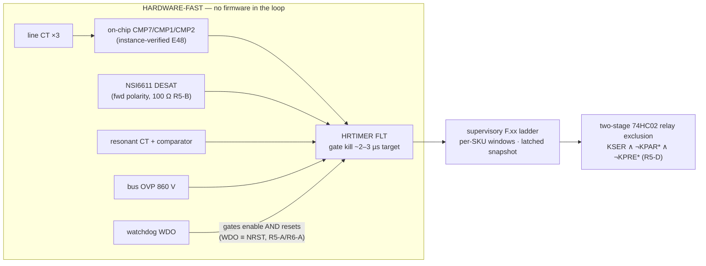

# Protection Thresholds (§24/§49-19) — rev E49 (R4–R8 external-review closures, 2026-09-09)

  

> **Purpose** — The F.xx fault ladder: hardware-fast paths, supervisory windows, per-SKU timings, R4–R8 protection notes.
>
> **Gate coupling** — review-checks R5-K/R6-B/R6-C greps pin passages of this file — edit additively.

HW = comparator/driver hardware, independent of firmware; FW = supervisory firmware.
Tolerances include sense-chain error (divider 1% + 0.1% bottom, CT 1%+burden 1%, shunt 0.5% + amp).
Every latched fault stores a pre-fault snapshot (2 kSa ring: Vbus±, Iphase×3, Vout, Iout, fsw, state).
Display code `F.xx` per docs/interconnect.md HMI.

| # | Fault | Threshold | Act | Layer | Action | Code |
|---|---|---|---|---|---|---|
| 1 | PFC phase OC | 105 A pk (CT, per lane-phase; **27 Ω burden → 1.13 V above AVMID = 2.78 V at comparator; 150 A observability ceiling = 3.27 V, inside the rail — R3/audit**) | <2 µs | HW comp→HRTIM kill | PFC PWM off, latch | F.01 |
| 2 | PFC DESAT | VDS>9 V @on, 2.5 µs blank | <3 µs | HW driver | soft-off, FLT latch | F.02 |
| 3 | Bus OVP | **860 V** total (E2) | <25 µs¹ | HW comp | all PWM kill | F.03 |
| 4 | Bus OV (fw) | 845 V, 1 ms | 1 ms | FW | controlled stop | F.04 |
| 5 | Bus UV | <620 V in run | 10 ms | FW | stop, retry ×3 | F.05 |
| 6 | Midpoint imbalance | |ΔV|>40 V, 10 ms | 10 ms | FW | derate→stop | F.06 |
| 7 | Input OV | >500 VAC any line-line, 20 ms | 20 ms | FW | stop | F.07 |
| 8 | Input UV / sag | <260 VAC, 100 ms (ride-through below) | 100 ms | FW | derate/stop | F.08 |
| 9 | Phase loss | line current <10% expected 40 ms (validated `400-phloss` sim) | 40 ms | FW | fold back → stop | F.09 |
| 10 | Phase sequence | PLL sign at start | start | FW | inhibit start (any rotation accepted, mapped) | F.10 |
| 11 | LLC resonant OC | 70 A pk per section CT (**2.0 Ω burden → 1.40 V above AVMID = 3.05 V at comparator — R2 CB-16**; full-load 46 A rms = 0.92 V rms) | <2 µs | HW comp | LLC PWM off | F.11 |
| 12 | LLC DESAT | as #2 | <3 µs | HW | soft-off latch | F.12 |
| 13 | Output OVP | 1050 V (or mode-max +6%) | <25 µs¹ | HW comp on OV iso-sense | LLC off, K_OUT opens after I≈0 | F.13 |
| 14 | Output OV (fw) | cmd +4%, 2 ms | 2 ms | FW | CV clamp/stop | F.14 |
| 15 | Output OC | 102% Imax 100 ms / 130% 2 ms | — | FW (CC loop is primary) | CC fold, then stop | F.15 |
| 16 | Output short | **rev B: V<50 V & I>90%·I_cmd sustained 10 ms** (a healthy CC loop never exceeds 110% — found by fsm-sim) | 10 ms | FW | burst-retry ×3 → latch | F.16 |
| 17 | Bank imbalance (series) | |VA−VB|>25 V 10 ms | 10 ms | FW | stop, re-match | F.17 |
| 18 | Relay weld | ΔV<1.5 V @200 ms, ≥10 A ref (E13) | 200 ms | FW | latch, inhibit mode change | F.18 |
| 19 | Relay open-fail | mirror-contact readback mismatch 100 ms (hardware path per E30: RELAY_FB_* nets, KPRE series pair) | 100 ms | FW | latch | F.19 |
| 20 | Precharge fail | **as implemented (fsm.c): abort iff t > 400 ms AND bus < 50% line pk** — tolerant of the per-SKU charge time (t95 ≈ 160/288/576 ms at 30/60/120 kW); the earlier "<90% in 400 ms" wording described the completion check, not the abort (R2 HR-14 doc fix) | — | FW | abort, open KPRE | F.20 |
| 21 | Discharge fail | bus >60 V after per-SKU timeout: **3 / 4 / 5 s** (`PMP_DISCH_TO_MS` rev G; powered-path physics 830→60 V ≈ 2.0/2.4/3.2 s at 640 Ω) — **R6: this timer's REAL coverage is the AC-PRESENT case** (bus held up by the permanent RPRE rectifier path → FC_DISCH = "isolate upstream first"); with AC removed the aux browns out at ~321 V mid-count and the passive path + enclosure label finish the job (R6 note below) | per SKU | FW | latch, discharge stays commanded | F.21 |
| 21b | Bank discharge fail | either bank >60 V @ **2.5×** bank-bleed τ after `CTL_QDISBK` (E33; τ = 8.8 kΩ·C_bank ≈ 4.1/8.3/16.5 s → timeout 10.3/20.6/41.2 s per SKU; 2.0τ would false-fail a healthy bleed at 525·e⁻² = 71 V — caught by the per-SKU deck) | per SKU | FW | latch, inhibit touch-service bit | F.21 |
| 22 | OT PFC/LLC/XFMR | 95/100/115 °C NTC | 1 s | FW | derate −2%/°C → stop @+10 °C | F.22–24 |
| 23 | Fan fail | tach < 50% cmd 3 s | 3 s | FW | derate 50%, F-code | F.25 |
| 24 | Aux UV | V15<12.5 V | <100 µs | HW driver-UVLO chain | gates hold-low (§28) | F.26 |
| 25 | Internal link loss | 50 ms no valid CRC frame | 50 ms | FW both ends | controlled stop, needs re-ENABLE (§22) | F.27 |
| 26 | External CAN timeout | 1 s no valid ctrl frame (config) | 1 s | FW | ramp to 0, standby (§23) | F.28 |
| 27 | Sensor implausible | cross-checks (ΣI≈0, Vout vs bank sum ±5%, T range) | 100 ms | FW | stop, latch | F.29 |
| 28 | EEPROM CRC | at boot | boot | FW | safe defaults, F-code, no output | F.30 |
| 29 | Repeated fault lockout | 5 latches / 10 min | — | FW | lockout until CAN clear + ENABLE | F.31 |
| 30 | Watchdog | CWD-programmed window | HW | card supervisor: open-drain WDO gates the GATE_EN AND **and rides NRST_CARD** (R5-A/R6-A) — a hung MCU restarts with enables low | gates default-disabled through WDO-low and boot | F.32 |

Hardware comparator DACs: thresholds from MCU DAC but **latch path is analog** — firmware can
tighten, never loosen beyond table max (resistor-set ceilings on comparator references).

¹ R2/MR-18: OVP latency restated honestly — the iso-sense channels that feed OVP comparators now
carry a 1 nF filter (pole ≈ 23 kHz) + AMC1311 group delay → total trip path ≈ 10–20 µs. The old
"<10 µs" figure predated the isolated front-ends. Consequence at trip dV/dt (≈18 V/ms load-dump):
overshoot ≤ 0.5 V — no margin impact; the number in the table is now the number the hardware has.

**R4 note — Vienna DESAT direction coverage (E45):** each common-source pair's DESAT chain
senses the PHASE-side drain only; a fault of the opposite current polarity develops V_DS on the
MID-side device and is NOT seen by DESAT. That direction is covered by the **line-CT OC trip**
(F.11-class fast path, observable to 150/187 A pk inside the ADC rail) plus the gG fuse
coordination — two independent detectors per direction overall. Registered as the design basis;
EVT T-xx short-circuit characterization exercises BOTH polarities.

**R6 rev / R7-A rev — the reverse direction gets a DESIGNATED µs-class path (E47/E48):** the
line-CT signals route to on-chip comparators with DAC thresholds, muxed into an HRTIMER fault
input — a **hardware PWM kill with no firmware in the loop**. **R7-A: "CMP-capable pin" was
NOT a sufficient constraint** — the external reviewer traced the LQFP100 table and found
phases B and C on OPPOSITE INPUTS of the SAME comparator (pin 15/PC0 = CMP2_IM, pin 16/PC1 =
CMP2_IP; the DAC reference can only drive the IM side, so a signal there gets no independent
comparison). Allocation is now INSTANCE- and POLARITY-aware, executed by swapping AIN9↔AIN11
in the one pin-map generator (verified against GD32G553 Rev 2.0 Figure 2-3 + pin table):
**I_A0 → PC2/CMP7_IP · I_B0 → PA3/CMP1_IP (ADC0_IN3 keeps metering) · I_C0 → PC1/CMP2_IP**;
SNS_VAC1 → PC0/ADC01_IN5 (50 Hz metering, needs no CMP). Each phase gets ONE single-sided
threshold **on the DESAT-blind polarity BY DESIGN** — the opposite polarity is DESAT's own
µs-class coverage; this is the complement, not a window detector, and the register says so.
Timing: burden → 1 k/1 n (τ = 1 µs) → CMP (≈50 ns) → HRTIMER FLT (sub-cycle) ≈ 2–3 µs is a
**DESIGN TARGET until measured** — the ACX line CT is catalogued for 50/60 Hz metering and
its HF response is NOT vendor-specified; EVT T-xx measures the true threshold-crossing-to-
gate-off time in BOTH polarities against the device short-circuit withstand. Until that
demonstration, the honest floor below still stands:

**R5-K note — response-time honesty for the reverse direction (E46):** the two detectors are
NOT the same speed class, and the register must not read as if they were. Forward (PHASE-side)
faults clear at DESAT speed — µs-class blank + soft-shutdown at the device. Reverse-polarity
faults are seen by the line-CT OC path, which is **system-level, not device-level**: ~10–20 µs
analog front end, then the firmware latch at the 1 ms tick, then contactor/gate response —
with the gG fuse as the backstop for bolted faults. The MID-side device must therefore survive
the reverse-fault i²t until that trip lands. EVT T-xx runs the short-circuit characterization
in BOTH polarities and must demonstrate the MEASURED clearing time against the device
short-circuit-withstand rating before any protection claim ships on the datasheet.

**R6 discharge-timeline honesty (E47):** the active discharge chain (QDISF + 4×160 Ω) is
powered by V15, which the bus-fed aux flyback stops producing at the **321 V brown-out**
(1 V × (1 + 4.8 M/15 k)); V15 then collapses in milliseconds (~0.2 A of bias load on 220 µF)
and the MCU (V3P3 ← V15 buck) browns out with it. The real AC-removed timeline is therefore
**two-phase**: active 830→~321 V in ≤1.2 s (τ = 640 Ω · C_link), then PASSIVE through the
balance pairs — **R8 correction (external retrace, confirmed in the netlists):** the 40/50 kW
links carry TWO bank blocks whose 2×47 k pairs PARALLEL to 47 k per half (94 k full-link);
only the single-bank 30 kW is 188 k. 321→60 V ≈ **370 / 222 / 296 s** at 30/40/50 kW —
totals ≈ 6.2 / 3.7 / 5.0 min; **the 30 kW is the slowest**, and the R7 report's dismissal of
the reviewer's 222 s figure was OUR error, retracted at E49. Consequences, registered: (1) the enclosure carries the
IEC 62477-1 stored-energy **warning label with the stated discharge time** ("isolate upstream, wait 10 min, AND
verify <60 V at the link and both banks before access") — tool-access only; the wait alone
is never the permission, the measurement is; (2) **F.21's real coverage is the AC-PRESENT case**: with
mains still feeding the link through the permanent RPRE paths the bus cannot fall (rectifier
holds ≥~530 V), the aux stays alive, the timer expires and FC_DISCH latches — correctly
signalling "discharge impossible, isolate upstream first". In the AC-removed case the MCU
dies mid-count and no fault is latched; safety is the passive path plus the label. (3) The
same hold-up limit applies to the bank bleeders (PV-driven QDISA/B lose their MCU command):
bank passive balance pairs give the same few-minute class. Do NOT "fix" this by lowering the
BO divider — 321 V is the flyback's full-load DCM floor (duty 22% of the D-version's 44%
ceiling at that bus; at 150 V it would need 58%).
