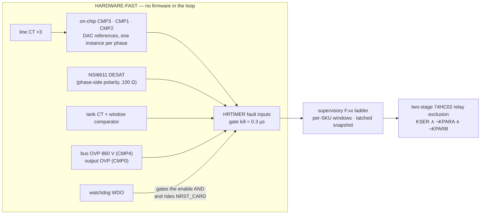
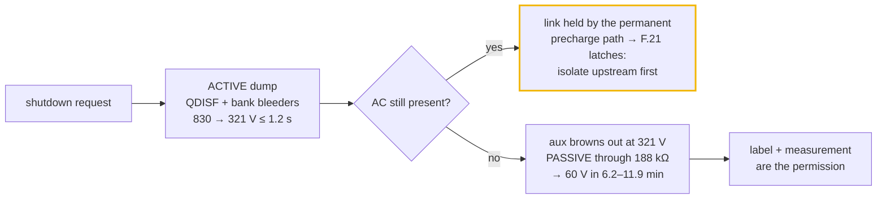

# 🛡️ Protection Thresholds

The F.xx fault ladder — hardware-fast and supervisory rows, per-SKU windows and current classes

  
  
  
  

> [!NOTE]
> **Purpose** — the F.xx fault ladder: every protection row with its threshold, response time, layer and action;
> the hardware-fast paths that act with no firmware in the loop; and the per-SKU classes and windows.
>
> **Gate coupling** — `review-checks`, `stress-audit` and `current-coordination` assert passages of this file word
> for word. The thresholds themselves live in `firmware/core/fsm.h`; the HAL programs them into the comparator DACs
> every tick, and firmware may tighten a hardware reference, never loosen it past the resistor-set ceiling.

## At a glance

| Path | 30 kW | 40 kW | 50 kW (liquid · air) | Response |
|---|---|---|---|---|
| **F.01** line over-current (CT → comparator → HRTIMER) | 120 A pk | 155 A pk | 195 A pk | ~2–3 µs design target |
| **F.11** LLC tank over-current (one window comparator on the tank CT, both polarities) | **140 A pk** | **180 A pk** | **220 A pk** | < 1 µs |
| **F.02** DESAT | Vienna 47 pF blank · LLC 18 pF blank | = | = | worst 2.21 µs · 1.34 µs |
| **F.03** bus OVP | 860 V | = | = | 10–20 µs |
| **F.13** output OVP | 560 V while the LLC runs in LOW mode · 1050 V in HIGH and whenever the LLC is off | = | = | 10–20 µs |
| **F.21** discharge window | 3 s | 4 s | 5 s | per SKU |
| **F.21b** bank bleed · measured of the registered window | 0.37 of 10.3 s | 0.49 of 15.5 s | 0.58 of 20.7 s | per SKU |
| Supervisory rows | 1 ms tick, latched pre-fault snapshot | | | 1 ms – 5 s |

```mermaid
xychart-beta
  title "Fast trip classes per SKU (A peak) — F.01 line · F.11 tank"
  x-axis ["30 kW", "40 kW", "50 kW liquid / air"]
  y-axis "A peak" 0 --> 250
  bar [120, 155, 195]
  bar [140, 180, 220]
```

## 1. The fault paths

## 2. The ladder

HW = comparator/driver hardware, independent of firmware; FW = the 1 ms supervisory core (`firmware/core/fsm.c`).
Tolerances include sense-chain error (divider 1 % + 0.1 % bottom, CT 1 % + burden 1 %, shunt 0.5 % + amp).
Every latched fault stores a pre-fault snapshot (2 kSa ring: Vbus±, Iphase×3, Vout, Iout, fsw, state).
Recovery classes: **LATCH** needs a CAN CLEAR · **AUTO_INT** is the module's own and clears itself after the
recovery hold (2 s, doubling to 64 s) and counts toward F.31 · **AUTO_EXT** is the grid's, clears the same way and
never counts. Display codes `F.xx` per [interconnect](interconnect.md) HMI.

| Fault | Threshold | Detect | Layer | Action | Class |
|---|---|---|---|---|---|
| **F.01** PFC phase OC | 120 / 155 / 195 A pk on the 22 / 18 / 13 Ω burden (§5). The comparator reference is **positive-only** — a sub-AVMID reference on a non-inverting comparator into an active-high fault input would assert the fault through every negative half-cycle. The negative polarity is a 100 kHz software magnitude trip in `app_pfc_isr` (`\|i\| > oc_line_a` → the same `trip_n`/`trip_ack` path, outputs off inside the same ISR), and Σi = 0 makes the other two comparators the hardware backstop at 2 × I_trip | < 2 µs (≤ 19 µs negative: one sample period plus the interrupt's own execution, before the CT's lag) | HW comp → HRTIMER · FW magnitude trip | PFC PWM off, latch | LATCH |
| **F.01 → F.08** line-return exception | an F.01 inside `PMP_LINE_EVT_MS` (500 ms) of a disturbed line — a phase missing, or the lowest line-line below `PMP_LINE_EVT_K` (0.90) of what the site normally shows — is filed as **F.08**. At a line return the EMI filter rings 121–199 A pk into a link that has sagged to its crest, through the boost **diodes**, which no switch can stop. On a quiet line F.01 still latches | 500 ms window | FW | bypass opens, recovery re-precharges | AUTO_EXT |
| **F.02** DESAT | V_DS > 9 V at on, blank 47 pF (Vienna) / 18 pF (the LLC bridge legs) → worst response 2.21 / 1.34 µs (§5). The NSI6611 threshold is reached at V_DS ≈ 8.1 V after the blank, i.e. 225–540 A hot through the dies: DESAT is a short-circuit detector, not an over-current row | < 3 µs | HW driver | soft-off, FLT latch | LATCH |
| **F.03** bus OVP | **860 V** total, CMP4 on SNS_VBUSP | 10–20 µs¹ | HW comp | all PWM kill | LATCH |
| **F.05** bus UV | link below max(620 V, 1.414 · V_LL,max − 20 V) for 10 ms while delivering — the crest term closes the band in which the rectifier conducts uncontrolled at high line. If the line is found outside its window within `PMP_BUSUV_GRID_MS` (200 ms) of the latch, the row is re-filed as F.07 / F.08 / F.09 and its F.31 count is taken back: the rms line values are up to a cycle stale when F.05 fires. A collapse on a healthy line — a failing PFC, a shorted link — keeps its class and its count | 10 ms | FW | controlled stop | AUTO_INT |
| **F.06** midpoint imbalance | \|ΔV\| > 40 V for 10 ms, whenever the link is above 100 V | 10 ms | FW | derate → stop | AUTO_INT |
| **F.38** half-link OV | either half above **440 V** for 10 ms. F.03 (860 V total) and F.06 (±40 V midpoint) together still allow one half of the 500 V cans to sit at 454–468 V; sensing is the calibrated ±1 % class plus the live reference (±0.2 % class, bounded at ±2 % where F.29 takes over), so the trip spans 431–449 V at that bound — under the can rating and above the normal worst half of ≈ 435 V (415 V at the 830 V reference plus the 20 V the midpoint row allows) | 10 ms | FW | stop, latch | LATCH |
| **F.07** input OV | **highest** line-line > 500 VAC, 20 ms | 20 ms | FW | stop | AUTO_EXT |
| **F.08** input UV / sag | **lowest** line-line < 260 VAC, 100 ms (ride-through below that) | 100 ms | FW | derate / stop | AUTO_EXT |
| **F.09** phase loss | fewer than three live phases for 40 ms | 40 ms | FW | fold back → stop | AUTO_EXT |
| **F.37** line frequency | outside 45–65 Hz, or no zero crossing on a live line, for 200 ms | 200 ms | FW (HAL) | stop | AUTO_EXT |
| **F.11** LLC tank OC | **140 / 180 / 220 A pk** — one window comparator on the 1:100 tank CT, both polarities, 1 MΩ hysteresis (§5, §6) | < 1 µs | HW comp | all four bridge positions off, latch | LATCH |
| **F.13** output OVP | **1050 V in HIGH, 560 V in LOW while the LLC runs** — the CMP0 reference is scheduled every tick from the mode and the LLC enable: with the bridge off the terminals carry whatever the bus does (a spare LOW-mode module beside an 800 V session reads 800 V through DOUT with nothing of its own to protect), so the absolute limit applies until the stage runs. Firmware mirror: stack above min(1050 V, mode ceiling × 1.05 + 20 V) for 2 ms (`PMP_OVP_MS`), or above command × 1.06 + 20 V for 200 ms while the module sources current (`PMP_OVP_SRC_MS`, a CV failure). A film-only bank overshoots up to +10 % on a 100 → 50 % step, which must not latch | 10–20 µs¹ / 2 ms / 200 ms | HW comp + FW | LLC off, latch | LATCH |
| **F.15** output OC | 102 % of **rated** for 100 ms · 130 % for 2 ms · and a command-relative arm, I_out > I_cmd + max(0.15 × I_rated, 5 A) for 500 ms — suppressed while `stop_ramp` is set and while the command is ≤ 0. Rated-only rows would let a failed CC loop deliver 0.96 of rated into a 0.06 request | 2 ms / 100 ms / 500 ms | FW (the CC loop is the primary limiter) | latch | LATCH |
| **F.16** output short | V_out < 50 V with I_out above max(90 % of the command, 10 % of rated) for 10 ms. Not evaluated during a controlled stop: a stop into a resistive load reads as low voltage with current | 10 ms | FW | latch — the charger decides whether to retry | LATCH |
| **F.17** bank imbalance | in SER with the stack made: \|VA − VB\| > 25 V for 10 ms once either bank passes 50 V. This is also the weld screen for a parallel relay: a welded KPARA ties the bank tops together, so the banks cannot split in SER | 10 ms | FW | stop, latch | LATCH |
| **F.18** bypass weld | the KPRE mirror contact still reads closed while the bypass is commanded open, for `PMP_WELD_MS` (200 ms) **during the commanded discharge** — the one window in which a welded pole is observable, since everywhere else the contact is commanded closed and precharge is over inside F.19's 100 ms. Reported when the dump **ends**, never during it, so the report cannot abandon a discharge. It takes precedence over F.21: a welded bypass **is** the maintained source F.21 complains about. A dump that would finish sooner than the allowance waits it out | 200 ms | FW | latch at the end of the dump, inhibit mode change | LATCH |
| **F.19** relay open-fail | commanded contacts ≠ mirror readback for 100 ms (operate ≤ 25 ms + bounce ≤ 5 ms + diode-suppressed release ≤ 35 ms). The two bypass auxiliaries are 1 Form A and wired in **series**, so the readback is low only when both poles are closed — that is the start permit, and a stuck-open pole would otherwise leave a precharge resistor in the line current. Exempt in INIT, SAFE and on the shutdown path | 100 ms | FW | latch | LATCH |
| **F.20** precharge fail | abort if t > 400 ms **and** the link is below 50 % of the line crest, or if precharge exceeds `PMP_PRECHG_MAX_MS` (5 s) on an in-range line. Tolerant of the per-SKU charge time (t95 193 / 231 / 310 ms) | 0.4–5 s | FW | abort, open KPRE | LATCH |
| **F.21** discharge fail | the link, or either bank, still above 60 V at the per-SKU window — **3 / 4 / 5 s** (`PMP_DISCH_TO_MS`; the powered path takes 830 → 60 V in ≈ 2.0 / 2.4 / 3.2 s through 640 Ω) — **or** a link that is not falling: every 100 ms the link is compared with its value 100 ms earlier, and three consecutive samples that moved less than 2 V (dV/dt > −20 V/s) end the dump. A healthy dump passes the 60 V gate at ≈ 80 V/s (30 kW) / ≈ 50 V/s (50 kW), 4× and 2.5× that threshold. Stall detection is gated on the link being up, because the tail of a healthy dump is slow by construction | 300 ms · per SKU | FW | end both dump commands, latch | LATCH |
| **F.22** over-temperature | worst NTC zone above 115 °C; per-zone derate and trip mapped onto the core's 105 / 115 °C scale — inlet 55 / 75 · PFC 95 / 105 · LLC 100 / 110 · transformer 105 / 115 °C. Derate is continuous at 4 %/°C above the derate point (60 % at the trip), recovery slew-limited to 20 %/s. The same channel reports **150 °C** when a 130 °C magnetics cutout or an NTC lead opens (§4.5 of the [thermal report](thermal-report.md)) | 1 s | FW | derate → stop | AUTO_INT |
| **F.25** fan fail | a fan is failed when its tach sits below 35 % of its commanded speed (floor 5 Hz) for 3 s, judged from 20 % duty. Derate is by failed **count** — 4-fan SKU: one failed 0.6, two 0.3; 2–3-fan: one failed 0.5. No fan able to cool latches | 3 s | FW | derate by count, then latch | AUTO_INT |
| **F.26** aux UV | V15 < 12.5 V: the driver UVLO chain holds the gates low in hardware, and 5 s in INIT or SAFE without `aux_ok` latches the row. `recovered()` reads `aux_ok` for it rather than the line, so it cannot self-clear into the same dead rail | < 100 µs (HW) · 5 s (FW) | HW driver UVLO + FW | gates hold low, latch | AUTO_INT |
| **F.28** CAN timeout | no valid control frame for the profile's timeout (VMP 1 s default, TonHe 20 s). Reported as `PMP_W_COMMS_LOST` in every state whenever `can_age_ms` is past the timeout | per profile | FW | ramp the current out in ≤ 100 ms, then standby — **not latched** | — |
| **F.29** sensor implausible | a non-finite or physically impossible sample for 3 ms · either bank channel falling by half in one sample with the matrix at rest for 100 ms (a lying channel, not a discharge) · V_out more than 20 % below a delivering stack (low side only: a stuck-low sensor blinds OVP, while V_out above the stack is a legitimate reverse-biased-diode condition) · the ADC reference beyond ±5 % for 100 ms, or the live reference tracker at its ±2 % bound · the sum of the line currents beyond 10 % of rated rms for three consecutive line cycles (60 ms) · AVMID out of window for 100 ms · a boot offset more than 150 counts from nominal · the PFC's input power and the delivered output power disagreeing by more than 2 : 1 beyond 15 % of rating for 500 ms while the LLC runs (an output current channel stuck at zero or at full scale) | 3–500 ms | FW | stop, latch | LATCH |
| **F.30** calibration / identity | at boot: a calibration record outside ±10 % gain or ±150 counts of nominal, **no** record at all, or no valid rating strap | boot | FW | no output | LATCH |
| **F.31** repeated-fault lockout | 5 counted latches inside 10 min (AUTO_EXT rows never count) | — | FW | lock until CAN clear + ENABLE | LOCK |
| **F.32** watchdog | window watchdog; the open-drain WDO gates the GATE_EN AND **and** rides NRST_CARD, so a hung MCU restarts with the enables low | HW | HW card supervisor | gates default-disabled through WDO-low and boot | LATCH |
| **F.33** reverse output | a connected pack measured below 0 V at the readiness gate | at start | FW | inhibit, latch | LATCH |
| **F.34** start / make-permit stall | energized in STANDBY — PFC or LLC on, or the banks bleeding toward the make-permit — without reaching RUN. The PFC boost ramp counts inside the window | 8 s | FW | latch | LATCH |
| **F.35** control-deadline overrun | the HAL's verdict: ≥ 10 overruns inside a 100 ms window, or three ticks inside one 100 ms window that each missed three LLC periods. One late tick is not a deadline failure; a stopped interrupt still latches inside 3 ms | 3–100 ms | FW (HAL) | latch | LATCH |
| **F.36** internal | an FSM state value the enum does not define · the painted stack's high-water mark at 90 % or more | 1 ms | FW | latch | LATCH |

¹ The iso-sense channels that feed the OVP comparators carry a 1 nF filter (pole ≈ 23 kHz) plus the AMC1311 group
delay, so the total trip path is ≈ 10–20 µs. At the trip dV/dt of a load dump (≈ 18 V/ms) the overshoot is ≤ 0.5 V.

> [!NOTE]
> **The shutdown path is exempt from every latch site.** `ST_SHUTDOWN`, `ST_DISCH` and `ST_OFF` do not latch — a latch
> there would end the dump and leave the link charged (rows F.18 / F.21). The price is registered: a DESAT or bus-OVP
> edge arriving during a commanded discharge is consumed and dropped, neither latched nor written to the event log.
> Both stages are already gated off on that path, so the edge has nothing left to protect and cannot be a driven-switch
> over-current, F.21 and F.18 still bound the dump, and the hardware kill paths act regardless of the FSM state. Such
> edges on the bench (fault-injection stage of the [EVT plan](evt-plan.md)) are a driver-noise finding, not a
> protection gap.

## 3. The hardware-fast paths

### 3.1 Comparator instances, pins and fault channels

Every fast row owns a distinct comparator instance and a distinct HRTIMER fault channel, so one trip can never mask
another, and the HAL can attribute the latch to a row.

| Row | Signal → pin | Comparator · reference | HRTIMER fault channel |
|---|---|---|---|
| F.01 phase A | I_A0 → PB0 (ADC0_IN12) | CMP3_IP · DAC2_OUT1 | FLT1 |
| F.01 phase B | I_B0 → PA3 (ADC0_IN3 keeps metering) | CMP1_IP · DAC0_OUT1 | FLT0 |
| F.01 phase C | I_C0 → PC1 | CMP2_IP · DAC2_OUT0 | FLT4 |
| F.02 · F.11 | driver FLT wire-OR + tank window → PB10 | external, active low | FLT2 |
| F.03 bus OVP | SNS_VBUSP → PB13 (ADC2_IN4) | CMP4_IP · DAC3_OUT0 | FLT5 |
| F.13 output OVP | SNS_VOUT → PA1 (ADC01_IN1) | CMP0_IP · DAC0_OUT0, MODE0 = 011 buffer-off so PA4/SNS_VAC2 keeps its pin | FLT3 |

Every channel kills every power timer (`CHxFLTOS` = inactive) and latches (`FLTAR` = 0); re-arming is a software
re-enable of the commanded outputs, per channel. At the FLT2 edge the HAL captures I_RES and reports **F.11** when the
tank current is at least 90 % of the class, otherwise **F.02**. Bank OV needs no comparator of its own: its dV/dt is
current-limited, F.11, F.13 and F.17 cover the fast cases, and SNS_VBKA/VBKB stay ADC channels on PD9/PD8 (their
CMP7_IM alternates are unusable — CMP7 is another instance's). `verify-independent` §J reads the shipped schematic
face and traces these pins to their label stubs, because a netlist can carry a remap that the delivered face does
not.

> [!IMPORTANT]
> **Comparator allocation is INSTANCE- and POLARITY-aware, not "CMP-capable pin".** Two phases landing on opposite
> inputs of the *same* comparator (PC0 = CMP2_IM, PC1 = CMP2_IP) gives one of them no independent comparison at all,
> because the DAC reference can only drive the IM side. Each phase therefore gets its own instance, on the IP side,
> with its own DAC. Phase A sits on PB0 for a second reason: it is the one current sense whose pin carries a
> comparator input on the second-source STM32G474VET7 as well, so the hardware trip survives the part swap.

### 3.2 Reverse-polarity coverage

Each Vienna common-source pair's DESAT chain senses the **phase-side** drain only; a fault of the opposite current
polarity develops V_DS on the mid-side device and is not seen by DESAT. That direction is covered by the line-CT OC
path and by the gG fuse coordination — two independent detectors per direction overall. The 100 kHz ISR re-signs
nothing: the comparator reference stays positive, and the negative half is covered by the software magnitude trip and
by Σi = 0 on the other two phases. The mid-side device must survive the reverse-fault i²t until that trip lands, and
the short-circuit characterization runs **both** polarities before any protection claim ships on a datasheet.

**Response-time honesty.** The two detectors are not the same speed class, and this register must not read as if they
were. Forward (phase-side) faults clear at DESAT speed — a µs-class blank plus soft shutdown at the device. Reverse
faults are seen by the line-CT path, which is **system-level, not device-level**: a 10–20 µs analog front end, then
the firmware latch at the 1 ms tick, with the gG fuse as the backstop for bolted faults.

The fast path itself is budgeted: burden → 200 Ω / 1 nF (τ = 0.2 µs) → comparator (≈ 50 ns) → HRTIMER fault filter at
its shortest setting (`0b0011`) → driver (≈ 60 ns) → t_d,off (≈ 50 ns) ≈ **0.3 µs to gate-off**, inside a declared
0.5 µs kill budget. The ≈ 2–3 µs figure at the head of this page is a **DESIGN TARGET until measured**: the ACX line
CT is catalogued for 50/60 Hz metering and its HF response is not vendor-specified. The EVT short-circuit row measures
the true threshold-crossing-to-gate-off time in both polarities against the device short-circuit withstand.

## 4. Discharge timeline

> [!CAUTION]
> Stored energy in the DC link and the banks is lethal. The label and the procedure below are safety requirements,
> not guidance.

The active discharge chain (QDISF + 4 × 160 Ω) is powered by V15, which the bus-fed aux flyback stops producing at its
**321 V brown-out** (1 V × (1 + 4.8 M/15 k)); V15 then collapses in milliseconds (≈ 0.2 A of bias load on 220 µF) and
the MCU browns out with it. With AC removed the timeline is therefore **two-phase**: active 830 → ≈ 321 V in ≤ 1.2 s
(τ = 640 Ω · C_link), then **passive** through the balance network — one network per module on every SKU, 188 kΩ
full-link, so 321 → 60 V takes ≈ **370 / 445 / 593 s** at 30 / 40 / 50 kW. Totals ≈ **6.2 / 7.4 / 9.9 min** nominal and
**7.4 / 8.9 / 11.9 min** at the snap-in's +20 % capacitance corner: the **50 kW is the slowest**, and the label follows
the slowest SKU. The banks are film-only and their commanded bleeders take them below 60 V in 0.37 / 0.49 / 0.58 s,
far inside both the F.21 window that supervises them and the registered F.21b bleed limit of 10.3 / 15.5 / 20.7 s.

Four consequences, all registered:

1. **The enclosure carries the IEC 62477-1 stored-energy warning label with the stated discharge time** — isolate
   upstream, **wait 15 min AND verify <60 V** at the link, both banks and the output studs before access. Tool access
   only. The wait alone is never the permission; the measurement is.
2. **F.21's real coverage is the AC-present case.** With mains still feeding the link through the permanent precharge
   paths the bus cannot fall (the rectifier holds it at ≈ 530 V or above), the aux stays alive, the window expires and
   F.21 latches — correctly signalling "discharge impossible, isolate upstream first". With AC removed the MCU dies
   mid-count and no fault is latched: safety there is the passive path plus the label.
3. **The same hold-up limit applies to the bank bleeders** (PV-driven, so they lose their MCU command with V15). Do
   **not** answer this by lowering the brown-out divider: 321 V is the flyback's full-load DCM floor (duty 22 % of the
   D-version's 44 % ceiling at that bus; at 150 V it would need 58 %).
4. **The output studs are a third store.** `COF1` + `COF2` (2 × 4.7 µF across OUTP–OUTN) sit downstream of `DOUT`, and
   the blocking diode conducts bank → output only, so no commanded path can reach them. `RBO1`–`RBO3`, three 150 kΩ HV
   2512 in series behind the diode, give τ = 4.2 s and 1000 → 60 V in ≈ **12 s** for ₹9, 2.2 W only while delivering at
   1000 V and −0.007 % η. `ST_DISCH` also waits for V_out < 60 V under its own 20 s bound, skipped entirely when a pack
   is connected — the module cannot discharge a vehicle and must not try, and that bound expiring is **not** a fault.
   Fast discharge of the shared output bus, including the paralleled-module capacitance behind every DOUT, is the
   charger/dispenser's function per IEC 61851-23.

## 5. Current-coordination classes

> [!IMPORTANT]
> **The rule, on both hardware OC paths:** the threshold sits at least **1.2 ×** above the simulated worst peak
> (tolerance and mismatch corners, grid dips and phase jumps) **and** the CT/burden/ADC chain stays inside the 3.27 V
> rail through the simulated 3 µs fault rise, so the latched snapshot shows the real fault peak. The standing gate
> [`current-coordination.mjs`](../calculations/system/current-coordination.mjs) owns all of it, and
> `fsm.c pmp_fsm_set_rating_kw()` carries the classes the HAL programs into the comparator DACs.

### Full-bridge F.11 classes

One Cr bank → one external Lr → two transformer cells with their primaries in series, one secondary per bank, and an
output blocking diode: one tank, one resonant CT (`CT1`, 1:100) in the Cr → Lr leg, one dual 40 ns comparator `U1W`
(half A above `F11_VH`, half B below `F11_VL`) diode-ORed by `D1W` onto the FLT wire-OR.

| SKU | F.01 line OC | line burden | F.01 V · ceiling | worst line peak | F.11 tank OC | tank burden | window (V) | worst tank peak | kill peak (+1 µs) | D2 fault flux |
|---|---|---|---|---|---|---|---|---|---|---|
| 30 kW | **120 A pk** | 22 Ω (1206) | 2.71 V · 184 A | 97 A (1.24×) | **140 A pk** | 0.47 Ω (2512 1 W) | 0.99 / 2.31 | 113 A (1.24×) | 210 A | 158 mT |
| 40 kW | **155 A pk** | 18 Ω · ACX-1150 | 2.77 V · 225 A | 127 A (1.22×) | **180 A pk** | 0.36 Ω (2512 1 W) | 1.00 / 2.30 | 148 A (1.22×) | 261 A | 157 mT |
| 50 kW L/A | **195 A pk** | 13 Ω · ACX-1150 | 2.66 V · 311 A | 159 A (1.22×) | **220 A pk** | 0.30 Ω (2512 2 W) | 0.99 / 2.31 | 183 A (1.21×) | 320 A | 154 mT |

D2 fault flux is taken at the kill peak on Lmax, against 217 mT = 60 % of Bsat at 130 °C. The window ladder
(`RF11H` / `RF11M` / `RF11L` = 2 k / 2.67 k / 2 k, and 2 k / 2.61 k / 2 k at 40 kW) is ratiometric from V3P3 with
AVMID = V3P3/2, so the window stays centred as the rail moves; the gate recomputes each trip from the drawn values and
fails if it drifts more than 2 % from the class. Fault races: line Δi(3 µs) = 46 / 50 / 72 A on the soft-saturating D1
at lot AL −8 %. Per-SKU CT front-end decks (`spice/protection/ct-frontend.mjs`) land every threshold within 20 mV of
the computed DAC point and keep F.xx + race inside the rail.

**A window comparator, not a threshold.** After an internal rectifier short the worst tank current swings **negative
first**, so a positive-only threshold is crossed microseconds late and the kill lands far above the class. The window
catches the first excursion of either sign, ≈ 1.5 µs after the short.

**Per-die pulse rule.** A trip-limited, non-repetitive µs pulse at low V_DS may reach **80 % of the die's 25 °C pulsed
rating I_DM** (the 20 % covers a hot start), checked per die at the F.01 fault peak. On the LLC the same rule is
applied at the **fast** kill peak the 0.5 µs budget reaches, against 0.9 × I_DM over the dies in the position.

| SKU | PFC die at the F.01 fault peak | limit (0.8 × IDM) | LLC position at the fast kill peak (+0.5 µs) | limit (0.9 × IDM × dies) |
|---|---|---|---|---|
| 30 kW | 165.3 A · one 20 mΩ class die | 168 A at **IDM ≥ 210 A** | 198.1 A · one die | 238.5 A at **IDM ≥ 265 A** |
| 40 kW | 204.9 A · one 15 mΩ class die | 208 A at **IDM ≥ 260 A** | 251.3 A · two dies | 477 A |
| 50 kW liquid · air | 266.4 A · B3M010C075Z | 384 A (IDM 480 A listing) | 308.3 A · two dies | 477 A |

The bold RFQ acceptance lines are part of the protection design: both PFC margins are under 2 % by construction, so a
die listed at the common 250 A class fails its SKU. A lot or part that misses its line reverts that SKU to two LLC
dies or to B3M010C075Z, and the incoming-lot pulse-class sample (T-41) is the screen. The same rule rejected a single
16 mΩ LLC die at 40 kW, which would have needed IDM ≥ 334 A.

**DESAT timing against the short-circuit withstand** (NSI66x1A Rev 1.1 worst-case numbers), one driver per position,
four on the bridge. Paralleled dies in a position share the driver and the DESAT diode on the common drain, so a
shoot-through through either device trips the position; a secondary or transformer short is F.11's, not DESAT's,
because the current rises through the tank and never through a desaturated device.

| Stage | Blank | Worst response (blank + 200 ns LEB + 300 ns delay + soft-off) | Rule | SCWT class |
|---|---|---|---|---|
| LLC 1200 V (ZVS turn-on) | **18 pF** | **1.34 µs** | ≤ 75 % of SCWT (1.5 µs) | 2.0 µs — discrete 1200 V SiC at ≤ 800 V |
| Vienna 750 V (hard turn-on) | **47 pF** | **2.21 µs** | ≤ 75 % of SCWT (3.15 µs) | 4.2 µs — 1200 V SiC at 50 % rated V, 175 °C |

Minimum blank stays ≥ 0.43 µs (LLC) / ≥ 0.80 µs (Vienna) so the turn-on transient cannot false-trip: below that a
two-die channel's turn-on noise sits inside the blank window. RFQ acceptance: tSC ≥ 2 µs at 800 V / 18 V for the
1200 V part, with the both-polarity short-circuit test measuring the real response.

## 6. Bond-loss cutout and the magnetics temperature loop

Three NC hermetic snap-action thermostats, **130 ± 5 °C** — one on each D3 cell and one on D2 — are wired in series
with the T_XFMR NTC. An open cutout (a lost gap pad or failed potting) or a broken NTC lead drives the channel to the
rail; the HAL guard `pmp_ntc_guard_c()` (`PMP_NTC_OPEN_FRAC` 0.98, `PMP_NTC_OPEN_C` 150 °C) reports **150 °C** and
F.22 latches. A healthy 10 k B3435 NTC reads ≤ 0.96 of Vref at −40 °C, so the guard never trips on a cold sensor.

| Row | Threshold | Time | Detector | Action | Code |
|---|---|---|---|---|---|
| Magnetics bond loss / T_XFMR loop open | any cutout ≥ 130 ± 5 °C, or the loop open | 1 s | NTC channel at the rail → 150 °C | stop, latch | F.22 |

## 7. Startup — F.01 blanked while the precharge bypass closes

The bypass closes when the link has **stopped rising** — two consecutive 20 ms samples within 3 V of each other and of
the present reading — provided it sits above `PMP_BYPASS_MIN_K` (0.85) of the highest line's rectified crest. A
settled link bounds the closing step at the resistor drop, a few volts, whatever the mains wave shape; a fixed
fraction of the *sinusoidal* crest is not reachable on flat-topped mains (crest factor 1.36–1.40) once the bus-fed
aux, two diode drops and the ±1 % sense chains are counted, and F.20 is a latching, counted row.

The coordination case is the worst closure the parts must survive: contacts making with up to 10 % of the crest still
to charge, which drives an LC pulse through the CMC leakage, D1 and the rectifier into the link while the PFC is
**not** switching. At 475 VAC on a stiff grid that pulse is above F.01 on every SKU.

| SKU | Worst closure peak (475 VAC, stiff grid, CMC leakage 12 µH, lot AL −8 %, closure instant swept) | F.01 | D1 at the peak | Pulse | Bus overshoot |
|---|---|---|---|---|---|
| 30 kW | **200 A pk** | 120 A | 24 µH of 155 µH | 1.4 ms | 605 → 726 V |
| 40 kW | **218 A pk** | 155 A | 27 µH of 115 µH | 1.4 ms | 605 → 725 V |
| 50 kW liquid · air | **280 A pk** | 195 A | 18 µH of 98 µH | 1.5 ms | 605 → 722 V |

**The rule:** F.01 is not latched for `PMP_PRE_BLANK_MS` = **60 ms** after the bypass command (relay operate ≤ 25 ms +
bounce ≤ 5 ms + the pulse, with margin), and the PFC enable waits for the window to end. The HRTIMER break stays
armed; the HAL clears the fault latch of the **three line-OC channels only** when the window ends — clearing F.03 or
F.13 sixty times in a row would undo a hardware latch the blank has nothing to say about, and the inrush overshoot
above is close enough to the 860 V trip to matter the moment a stage is enabled. A genuine short inside the window is
cleared by the gG fuses.

**Parts held to the pulse** (RFQ lines in `parts-db`): precharge relays **make ≥ 260 / 280 / 360 A pk** at ≤ 70 V
across the contacts and ≥ 30 000 makes · Vienna JBS **IFSM ≥ 250 A** (10 ms half-sine) — the pulse I²t is 20 / 27 / 45
A²s per diode, ≤ 15 % of that class · gG fuses see ≤ 3 % of their pre-arc I²t · D1 saturates softly for about 1.5 ms
(Kool Mµ), with negligible winding temperature rise.

## 8. Where the fast rows meet the control loops

| Row | What the HAL does with it | Code |
|---|---|---|
| comparator references | recomputed every tick from the rating class and the calibration in force, as the **inverse of the reference-corrected measurement**: the DACs are VREFP-referenced like the ADC (V = VREFP · code / 4096), so the code carries the same `k_ref` the reading removes — at 50 kW on a nominal rail: F.01 2.664 V · F.03 2.208 V · F.13 2.378 V (HIGH) / 1.940 V (LOW). `k_ref` is the boot VREFINT reading (the bandgap cannot be sampled inside the 10 µs frame) times a **live tracker**: the common DC of the three AC channels, which a 3-wire line cannot produce and only VREFP moving against the isolators' 1.44 V common mode can, driven to zero as an integrator (≈ 0.3 s), bounded to ±2 % (beyond that F.29). Its floor is the common drift of the three isolators' output common mode — a class figure until T-26 measures it, taken as ±0.2 % → F.03 lands in 855–865 V. The two inequalities the budget must hold: the highest normal link (833 V, the switched plant's load-dump peak at 475 VAC) is below the lowest trip (855 V); the highest trip plus the rise after detection (three boost chokes at 100 A pk into 1.88 mF: < 2 V) is 867 V, below the 880 V bench line and, for the LLC devices, inside the double-pulse line at the measured loop (C-10). Before the tracker existed a rail 1 % high put the trip at 885 V | `hal/app.c` `dac_v` · `hal/meas.c` `dcc` · `app_test` (VREFP moved after boot, no reboot) · T-26 |
| F.03 margin | every switch off 9 V above the bus reference, plus a light-load burst; while the bus is above its reference the voltage integrator may not claim more than 0.2 × `p_clamp_w` on top of the load feed-forward. The switched Vienna plant peaks at **833 V** against the 860 V trip across 30 / 40 / 50 kW × link C 1.00 / 0.80 / 0.64 at 475 VAC, with or without either lever — a regression guard, not a proof: an independent model that carries the drawn CX/CMC input filter ringing into the link on the commutation reads 856–872 V, and the plant has an ideal source behind the boost choke and no filter at all. The bench row (T-78) is the arbiter | `hal/pfc.c` |
| PFC LIMIT tier (below F.01) | a phase current above its reference by 15 % of the clamp turns that switch off for the update; the amplitude limit leaves room for the line to step back, because the 15 µs transport delay adds ΔV/L before any sample answers. Sag recoveries reach 152 A (50 %) and 144 A (75 %) at 50 kW, and 93 A for a 50 % sag of 480 VAC at 30 kW — each under F.01 / 1.2 | `hal/pfc.c` |
| F.05 | the LLC current folds back between the bus reference − 10 V and 625 V, so a sag rides on the power the PFC can still draw: 230 VAC for 60 ms at 50 kW keeps the bus above 705 V | `hal/app.c` |
| F.11 margin | the LLC frequency never sits below the tolerance-worst ZVS boundary for the load in force, and there is no burst below 100 V: the soft-start tank peak is 155 A against the 220 A class | `hal/llc.c` |
| F.22 | the junction observer `hal/dielim.c` folds availability before any zone reaches its trip — the thermal ladder's fast half ([thermal report §3](thermal-report.md#3-junction-temperatures--the-worst-point-of-the-grid)) | `hal/dielim.c` |
| relay drive | 60 ms pull-in, then 40 % hold at 20 kHz on every coil, and a 40 ms settle wait after any matrix close command (the matrix relays carry no mirror contacts). A PAR make additionally requires a bank mismatch ≤ 25 V | `hal/app.c` |

> [!TIP]
> **How this page is checked** — `review-checks`, `stress-audit` and `current-coordination` assert passages of this file **word for word**, so an edit that changes a pinned sentence fails the gate.

---

<a href="../boards/30kw/README.md">← 30 kW Module Walkthrough</a> &nbsp;·&nbsp; <a href="README.md">🧭 Documentation hub</a> &nbsp;·&nbsp; <a href="current-coordination.md">Current & Protection Coordination →</a>

Vectivolt DC-Modules · documentation rev E85 · every number reproduces with <code>sh calculations/run-all.sh</code>

