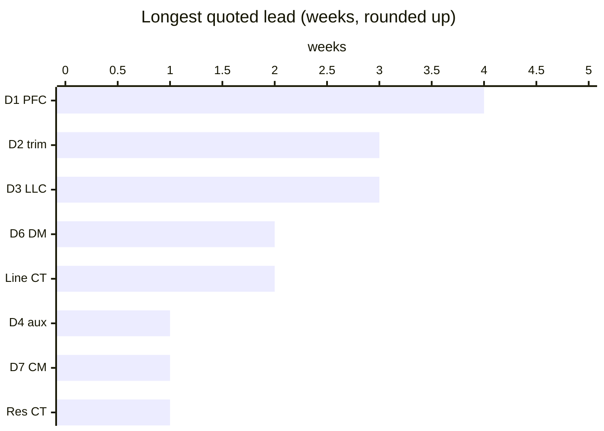
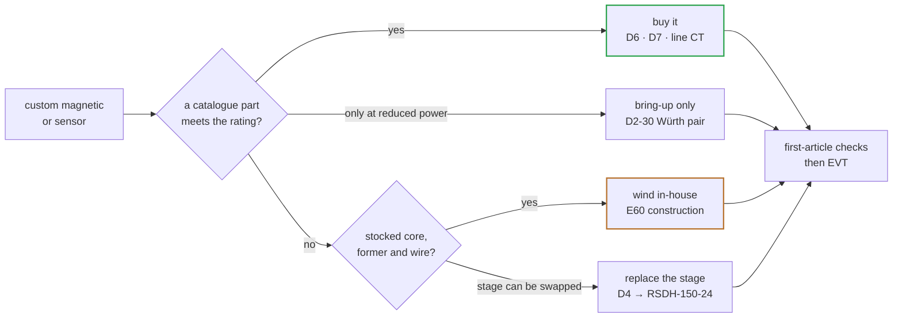

# 🚀 Prototype Fast Path

Off-the-shelf parts and wind-in-house routes that cut the custom-magnetics lead time

  
  
  
  

> [!NOTE]
> **Purpose** — cut the 8–12 week custom-magnetics wait for the first prototypes. Where a catalog part is
> genuinely equivalent, use it. Where a finished part cannot exist, buy the stocked cores, formers and wire and
> wind the **E60 construction** in-house per [`magnetics-build-instructions.md`](magnetics-build-instructions.md).
>
> Stock and prices were read on 13 Sep 2026 from element14 India first, then Mouser India, Digi-Key India and TME,
> plus the makers' catalogs. Anything not confirmed from a datasheet is marked *unverified*. Production still goes
> through the RFQ pack.

> [!IMPORTANT]
> **No catalog finished part exists for D1, D3 or D4, and none is proven for D2 at full power.** That is expected at
> 10–17 kW per LLC section with dual 1:1:1 secondaries. The fast path for those is *stocked cores + in-house
> winding*, which takes about 1–4 weeks depending on litz and flat-wire lead time. D6, D7, the CTs and the aux supply
> have real catalog routes.

## At a glance

<table>
<tr><td valign="top" width="50%">

| Route | Parts |
|---|---|
| 🧵 **Wind in-house** on stocked catalogue cores | D1 · D2-30 / 40 / 50 · D3-30 / 40 / 50 |
| 🔁 **Replace the stage** for bring-up | D4 → MEAN WELL RSDH-150-24 + 24 → 15 V |
| 📦 **Catalogue** | D6 (Würth, in series) · D7 (Schaffner) · line CT (Talema) |
| 🧩 **Catalogue + self-wound** | resonant CT — AS-404 / AS-407, 50 kW self-wound on N87 |

</td><td valign="top" width="50%">

</td></tr>
</table>

> [!TIP]
> **The critical path is wire, not cores.** Flat wire for D1 and litz, foil and TIW for D2/D3 are not stocked at
> element14 or Digi-Key India — quote Elektrisola India and Triplex India on day one; that date sets the build.

## 1. The route per part

| Slot | Fast path | Parts (stock seen) | Lead | Notes |
|---|---|---|---|---|
| **D1** PFC choke | **wind in-house** on the catalog core | Magnetics **0077908A7** (Kool Mµ 26µ, AL 37 ±8 %, Ae 221 mm², le 196 mm) — Digi-Key India 133 pcs, ₹1,744 (factory lead 16 wk) · alt Chang Sung CS778 26µ (*stock unverified*) | 2–4 wk (flat/round wire is the long pole) | 133 cores = 14 modules at ×3 or 8 at ×5. Catalog chokes top out around 25–37 A (Würth WE-TORPFC, AGP4233), so none reaches 55–92 A |
| **D2-30** trim | **wind in-house** (drawing unchanged) | TDK PQ50/50 **N97 B65981A0000R097** — element14 India 20 pairs (+108), ₹1,618; Mouser India 156 · former **B65982E0012D001** element14 150, Mouser 236 · litz 1350×0.1 (Elektrisola India, *stock unverified*) | 1–3 wk | bring-up only: 2× Würth WE-HCFT **7443763521022** (2.2 µH, 75 A DC, MnZn) in series, pair-binned ≤4.35 µH. No 140 kHz AC-loss data and no core insulation rating, so use reduced power and mount as a live part |
| **D2-40** trim (E60 rev D) | **wind in-house** | 1× E70/33/32 N95 (Mouser India 58 ungapped; DG gapped types available) · former **B66372B1000T001** · litz 4150×0.071 | 1–3 wk | N95 instead of N97 — the temp-critique basis covers the PC95/N95 class; re-check Fe at first article |
| **D2-50** trim (E60 rev D) | **wind in-house** | 2× E70/33/32 N95 · former **B66372B2000T001** — Mouser India 65 pcs, ₹778 · litz 2500×0.1 | 1–3 wk | same former as D3-40/50 |
| **D3-30** transformer | **wind in-house** | PQ50/50 N97 ×3 per section (element14 / Mouser stock above) · foil **0.10 × 28 mm** Cu · litz 2475×0.071 · TIW/FIW (Triplex India, *stock unverified*) | 2–3 wk (litz/TIW quote now) | leakage-spacer first-article curve still applies |
| **D3-40/50** transformer | **wind in-house** | 2× E70/33/32 N95 + **B66372B2000T001** (Mouser India) · foil **0.127 × 28 mm** · litz 3486 / 4370 × 0.071 | 2–3 wk | E70 N97 has a 17-week lead; N95 is in stock |
| **D4** aux flyback | **replace the stage** for bring-up | MEAN WELL **RSDH-150-24** (250–1500 VDC in, 24 V 150 W, 4 kVac reinforced, −40…+80 °C) — element14 India 2, Digi-Key India 102, ₹6,444–6,994 · plus a 24→15 V converter | ~1 wk | or wind D4 on ETD39: element14 India lists only **N87** (B66363G0000X187, 2,886 pcs); gap to AL ≈ 239 nH/T² with a spacer |
| **D6** DM choke | **catalog, in series** | Würth **74437636350333** (3.3 µH, 98 A, Isat 189 A, metal alloy) — **4× for 30/40 kW, 6× for 50 kW**. element14 India 6 (+6) ₹2,449 · Digi-Key India 10 · Mouser India 18 (+24 due 2 Oct) | 1–2 wk | 4× = 12.2 µH nominal / 9.7 µH min at 82 A (floor 7.0 ✓); at 109 A, 9.2 µH min = the 40 kW floor exactly. 6× at 136 A = 12.9 µH min ✓. No hipot rating — mount as live parts |
| **D7** CM choke | **catalog** | Schaffner **RT8131-63-2M8** (63 A convection / 100 A at 3 m/s, 2.8 mH at 10 kHz) — Mouser India 120 pcs, ₹10,060 · for 40/50 kW: forced air ≥3 m/s **or** 2× **RT8131-85-1M8** in series (element14 India 23) | ~1 wk | **listing errors:** Digi-Key shows "2.8 mH @100 kHz" and element14 "280 µH" for the -85-1M8. The datasheet values are at 10 kHz (0.6 / 0.28 mH at 100 kHz). L tolerance is +50/−30 % |
| **Line CT** | **catalog** | **ACX-1100** (30 kW) · **ACX-1150** (40/50 kW, 150 A, linear to 200 A at 33 Ω, 38.1 mm body — its own land) — **TME** 1,089 / 433 in stock (element14 and Mouser India don't carry Talema; Digi-Key India MOQ 420 / 26 wk) | 1–2 wk via TME | or direct from Talema, Salem (India) |
| **Resonant CT** | **catalog + self-wound** | **AS-404** (30 kW) · **AS-407** (1:500, 80 A, same case/Ø8 — 40 kW with a 4.55 Ω burden) · 50 kW: **self-wind** 100 T on TDK **B64290L0048X087** N87 toroid (element14 India 320, ₹513; ≈0.3 mT at 95 A — no saturation concern) | 4–6 days (cores) | **Coilcraft CST2010-100L is NOT equivalent** (47 A, built-in primary, 1.5 kVrms) |

## 2. Sourcing risks to clear before ordering

| Risk | What we found | Action |
|---|---|---|
| **Mornsun** parts | Digi-Key flags Mornsun PV-series modules as on the **US OFAC sanctions list** (not recommended for new designs, non-returnable) | Do not order Mornsun for the prototype. The gate-bias / iso-5V module classes (QA01C, ISO5V-RFC) carry the same exposure: qualify a second source (MEAN WELL / RECOM / CUI class) before volume. Registered E60 |
| Distributor mislabels | CMC inductance at the wrong test frequency (see D7) | always read the maker's datasheet row, never the distributor parametric field |
| E70 N97 lead time | 17 weeks at Mouser | prototype on **N95** (in stock) and re-measure Fe at first article |
| Litz / TIW / foil | not stocked at element14 or Digi-Key India | quote **Elektrisola India** (litz incl. taped/profiled) and **Triplex India** (TIW) now — this sets the fast-path date |

## 3. What the prototype must still prove on these parts

| Parts | Must prove | Why it matters |
|---|---|---|
| **D6 / D7 catalogue parts** | crest-biased L at 82 / 109 / 136 A · ΔT at the line current in the real airflow · LISN pre-scan against the D6 floors | catalogue ratings are DC or convection figures, not our ripple and airflow |
| **Self-wound D2 / D3** | the E60 Rac rows at 140 kHz · the leakage-spacer curve · ΔT at the class current | the in-house wind must match the drawing it stands in for |
| **CTs** | saturation margin at the E60 burdens (1.25 × (F.xx + race)) · the F.xx DAC landing | a saturating CT hides the fault it exists to see |
| **Aux module substitute** | start-up at 342 V · hold-up through the brown-out window | it does not exercise the NCP1252D design — **T-09 still runs on the real D4 before BOM freeze** |

---

<a href="symbol-pin-map.md">← Symbol → Package Pin Map</a> &nbsp;·&nbsp; <a href="README.md">🧭 Documentation hub</a> &nbsp;·&nbsp; <a href="dfm-production.md">DFM & Production Flow →</a>

Vectivolt DC-Modules · documentation rev E61 · every number reproduces with <code>sh calculations/run-all.sh</code>

