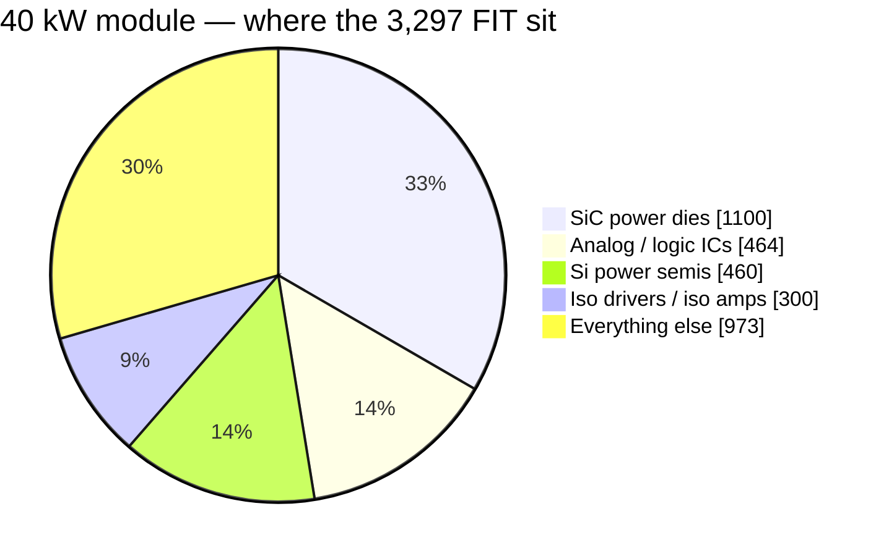

# 🛡️ Reliability Budget

Parts-count MTBF prediction with its basis declared, the wear-out clocks, and the no-single-point-of-darkness system view

  
  
  
  

> [!NOTE]
> **Purpose** — the platform's reliability position, stated the honest way: a **parts-count MTBF prediction**
> computed from the generated BOM (so it moves only when the BOM moves), the **wear-out clocks** that are *not*
> random failures and get their own table, and the **system view** that no product goes dark on one fault.
> Adopted at E64 to close the gap the [teardown benchmark](benchmark-infypower-teardown.md) exposed: the
> competitor publishes "MTBF 500 kh" and we published nothing.
>
> **Gate coupling** — `calculations/reliability/mtbf-budget.mjs` recomputes every number below from
> `calculations/out/bom-*.csv` on every battery run and fails on ±1 % drift from this page's registered table:
> a BOM change that moves the reliability picture must re-register consciously.

## The prediction — parts-count, basis declared

| Basis choice | Value | Why |
|---|---|---|
| Method | Telcordia SR-332-class parts-count (Method I style) | the industry's comparable-number convention |
| Ambient | **40 °C module internal** | the life-weighted operating mean — +55 °C full power is the *corner*, not the average |
| Environment / quality | ground fixed, controlled · quality II | conservative side of the published tables |
| Wear-out items | **excluded, tabled separately** | fans, electrolytic endurance and relay cycles are clocks, not random failures — mixing them in is how datasheet MTBFs get inflated |

| SKU | Σ failure rate | **MTBF (random-failure)** | Top drivers |
|---|---:|---:|---|
| 30 kW | 3,081 FIT | **≈ 325 kh** (≈ 37 y) | SiC dies 32 % · analog/logic ICs 15 % · Si semis 15 % · iso drive 10 % |
| 40 kW | 3,297 FIT | **≈ 303 kh** | SiC dies 33 % (paralleled PFC) · same tail |
| 50 kW liquid | 3,396 FIT | **≈ 294 kh** | SiC dies 32 % · no fans in the wear table |
| 50 kW air | 3,552 FIT | **≈ 282 kh** | SiC dies 34 % (paralleled PFC + LLC) |

> [!IMPORTANT]
> **Against the benchmark's "MTBF 500 kh":** the REG-family figure ships with no stated basis [D]. A 25 °C
> ground-benign Telcordia run is routinely **3–5×** a 40 °C one on identical hardware — recomputed at that kind of
> basis, this platform's numbers land in the same band. The honest comparison is method-for-method at EVT and in
> field data, not number-for-number; this page states its basis so that comparison is possible.

## Wear-out clocks — scheduled, not statistical

| Item | Clock | Position |
|---|---|---|
| Fans (air SKUs) | **L10 ≥ 70 kh @ 40 °C** (dual-ball spec, E52) | the first maintenance item on every air SKU; each fan carries a monitored tach and an F-row — a fan death is an alarm and a derate, not an outage. The 50 kW liquid has none |
| DC-link / bank electrolytics | E29 endurance basis at 105 °C, per-can ripple gated (≤ 1.05 A interleave residue, `verify-independent` §F) | years-scale at the 40 °C mean; E59 vent rule caps the failure mode |
| HV relays | cycle-rated per session | mirror contacts are **read back at every operation** (E30) — a welded contact is detected on the cycle it happens, not at the annual inspection |
| Acrylic coating | re-inspection at service | the E52 answer to the #1 field killer (dust + condensation) |

## No single point of darkness — the system view

| Level | Mechanism |
|---|---|
| Device | DESAT inside the SiC withstand time · comparator trips 1.2× over worst simulated peaks · F.xx ladder — a failing semiconductor becomes a *contained trip*, its energy gated by `fault-energy` (every reservoir has a rated dump path, every wire outlives the fuse ≥ 10×) |
| Module | fan-out → derate ladder (n−1 airflow covered at 0.6 duty, `fault-energy`) · aux brown-out defined to 321 V · watchdog wire-ORs the MCU reset (R5-A) — a hung brain cannot hold gates on |
| Product | **100 kW = 2 × 50, 150 kW = 3 × 50 + CSU: one module out = 50 % / 67 % power, never zero** (E55) · CSU re-shares on hot-rejoin with 300 ms staggered joins · per-module fusing and relay isolation keep a dead module off the bus |
| Fleet | CAN telemetry + lifetime counters locked at first RUN (EOL) — wear clocks are observable in service |

The one accepted module-level single point is the control card itself — deliberately (E40, one brain): its failure
mode is a safe stop (pull-downs hold every gate and relay OFF when the card is absent, unpowered or unbooted),
and availability above one module is the product ladder's job, not the card's.

## What moves these numbers

| Lever | Effect | Status |
|---|---|---|
| EVT T-00…T-32 | replaces predicted stress with measured | the campaign this page feeds |
| Vendor FIT data at RFQ (SiC dies, relays, modules) | replaces class rates with part rates | RFQ round 1 |
| Field return data | replaces prediction with observation | MES serial-keyed records are already specified (§45) |
| Fan count / liquid variant | the air SKUs' first wear item disappears on the 50 kW liquid | product mix decision |

---

<a href="final-validation-e51.md">← End-to-End Validation Verdict</a> &nbsp;·&nbsp; <a href="README.md">🧭 Documentation hub</a> &nbsp;·&nbsp; <a href="../calculations/README.md">Calculations & Gates →</a>

Vectivolt DC-Modules · documentation rev E61 · every number reproduces with <code>sh calculations/run-all.sh</code>

