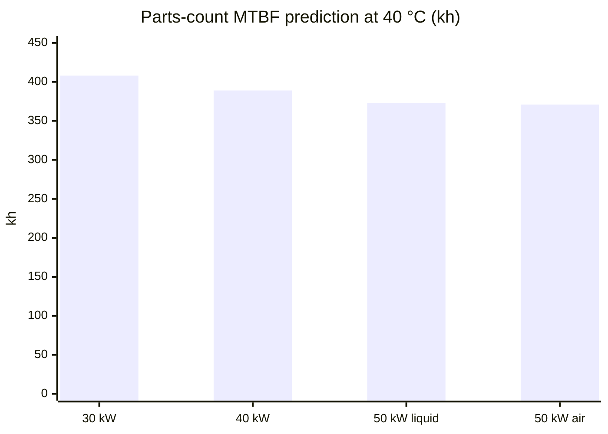
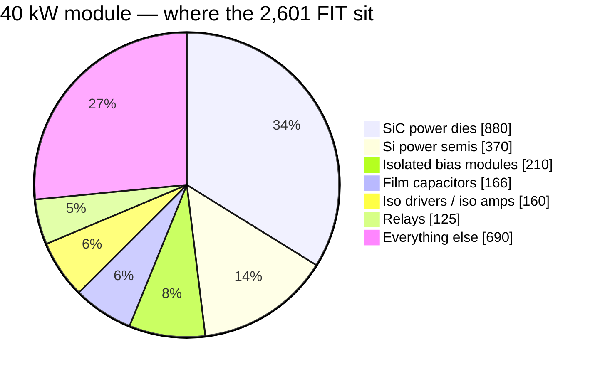

# 🛡️ Reliability Budget

Parts-count MTBF prediction with its basis declared, the wear-out clocks, and how a module fails safe

  
  
  
  

> [!NOTE]
> **Purpose** — the platform's reliability position, stated the honest way: a **parts-count MTBF prediction**
> computed from the generated BOM (so it moves only when the BOM moves), the **wear-out clocks** that are *not*
> random failures and get their own table, and the **fail-safe view** — how each level of a module contains a fault.
>
> **Gate coupling** — `calculations/reliability/mtbf-budget.mjs` recomputes every number below from
> `calculations/out/bom-*.csv` on every battery run and fails on ±1 % drift from this page's registered table:
> a BOM change that moves the reliability picture must re-register consciously.

## At a glance

| | 30 kW | 40 kW | 50 kW liquid | 50 kW air |
|---|---:|---:|---:|---:|
| **Σ failure rate** | 2,483 FIT | 2,601 FIT | 2,710 FIT | 2,724 FIT |
| **MTBF (random failure)** | **≈ 403 kh** | ≈ 385 kh | ≈ 369 kh | ≈ 367 kh |
| **Basis** | Telcordia SR-332-class parts count · **40 °C** module internal · ground fixed, controlled · quality II | | | |
| **Excluded** | wear-out clocks (fans, electrolytic endurance, relay cycles) — tabled separately in §2 | | | |

## 1. The prediction — parts-count, basis declared

| Basis choice | Value | Why |
|---|---|---|
| Method | Telcordia SR-332-class parts-count (Method I style) | the industry's comparable-number convention |
| Ambient | **40 °C module internal** | the life-weighted operating mean — +55 °C full power is the *corner*, not the average |
| Environment / quality | ground fixed, controlled · quality II | conservative side of the published tables |
| Classification | whole-word match on each part's own noun phrase (the text before its first bracket or dash) | substring matching files PFC chokes and line CTs as isolators and MLCCs as ICs — an implausible class is the classifier's fault, never a new rate |
| Wear-out items | **excluded, tabled separately** | fans, electrolytic endurance and relay cycles are clocks, not random failures — mixing them in is how datasheet MTBFs get inflated |

| SKU | Σ failure rate | **MTBF (random-failure)** | Top drivers |
|---|---:|---:|---|
| 30 kW | 2,483 FIT | **≈ 403 kh** (≈ 46 y) | SiC dies 32 % · Si semis 15 % · bias modules 8 % · iso drive 6 % · film caps 6 % |
| 40 kW | 2,601 FIT | **≈ 385 kh** | SiC dies 34 % (two LLC dies per position) · same tail |
| 50 kW liquid | 2,710 FIT | **≈ 369 kh** | SiC dies 35 % · no fans in the wear table |
| 50 kW air | 2,724 FIT | **≈ 367 kh** | SiC dies 35 % — electrically the liquid module |

A series-sum MTBF answers "when does the *first* service call happen" for one module. A charger that runs several
modules in parallel keeps delivering on the others while one is out, because each module isolates itself behind its
own fuses and output blocking diode.

> [!IMPORTANT]
> **Against the benchmark's "MTBF 500 kh":** the REG-family figure ships with no stated basis [D]. A 25 °C
> ground-benign Telcordia run is routinely **3–5×** a 40 °C one on identical hardware — recomputed at that kind of
> basis, this platform's numbers land in the same band. The honest comparison is method-for-method at EVT and in
> field data, not number-for-number; this page states its basis so that comparison is possible.

## 2. Wear-out clocks — scheduled, not statistical

| Item | Clock | Position |
|---|---|---|
| Fans (air SKUs) | **L10 ≥ 70 kh @ 40 °C**, dual-ball spec | the first maintenance item on every air SKU; each fan carries a monitored tach and an F-row — a fan death is an alarm and a derate, not an outage. The 50 kW liquid has none |
| DC-link electrolytics | endurance basis at 105 °C against the computed duty: `current-coordination` [DCLINK] / [DCLINK-VIENNA] read **1.8–2.4 A rms per can** at 2·f_sw and **5.7 / 6.5 / 5.9 A** per can at 400 VAC once the Vienna's own 50 kHz term is added, rising to **6.7 / 7.6 / 7.0 A** at 340 VAC — a declared exceedance of the ≥ 5.2 A RFQ line with its levers on the purchasing row | years-scale at the 40 °C mean; T-74 measures the real can current, and the vent rule caps the failure mode |
| HV relays | cycle-rated per session | mirror contacts are **read back at every operation** — a welded contact is detected on the cycle it happens, not at the annual inspection |
| Acrylic coating | re-inspection at service | the answer to the #1 field killer of fan-cooled modules: dust plus condensation |

## 3. How a module fails safe

| Level | Mechanism |
|---|---|
| Device | DESAT inside the SiC withstand time · comparator trips 1.2× over worst simulated peaks · F.xx ladder — a failing semiconductor becomes a *contained trip*, its energy gated by `fault-energy` (every reservoir has a rated dump path, every wire outlives the fuse ≥ 10×) |
| Module | fan-out → derate ladder (n−1 airflow covered at 0.6 duty, `fault-energy`) · aux brown-out defined to 321 V · the watchdog wire-ORs the MCU reset — a hung brain cannot hold gates on |
| Charger | per-module fuses and the output blocking diode keep a failed module off a shared bus · the group share law re-shares on hot-rejoin with 300 ms staggered joins, so the remaining modules keep delivering |
| Fleet | CAN telemetry + lifetime counters locked at first RUN (EOL) — wear clocks are observable in service |

The one accepted module-level single point is the control card itself — one brain per module, deliberately: its
failure mode is a safe stop (pull-downs hold every gate and relay OFF when the card is absent, unpowered or
unbooted), and availability above one module comes from running modules in parallel, not from the card.

## 4. What moves these numbers

| Lever | Effect | Status |
|---|---|---|
| The EVT campaign | replaces predicted stress with measured | the campaign this page feeds |
| Vendor FIT data at RFQ (SiC dies, relays, modules) | replaces class rates with part rates | RFQ round 1 |
| Field return data | replaces prediction with observation | MES serial-keyed records are specified in the production flow |
| Fan count / liquid variant | the air SKUs' first wear item disappears on the 50 kW liquid | SKU choice per site |

> [!TIP]
> **How this page is checked** — `calculations/reliability/mtbf-budget.mjs` recomputes every number here from the generated `bom-*.csv` on every battery run and fails on ±1 % drift from the registered table.

---

<a href="firmware-verification.md">← Firmware Verification Plan</a> &nbsp;·&nbsp; <a href="README.md">🧭 Documentation hub</a> &nbsp;·&nbsp; <a href="../calculations/README.md">Calculations & Gates →</a>

Vectivolt DC-Modules · documentation rev E85 · every number reproduces with <code>sh calculations/run-all.sh</code>

