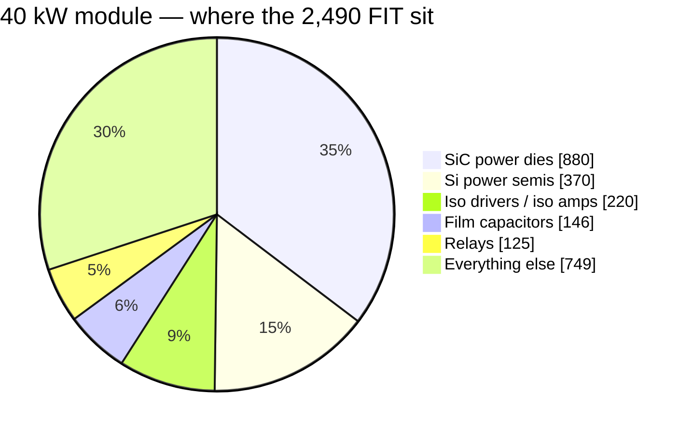

# 🛡️ Reliability Budget

Parts-count MTBF prediction with its basis declared, the wear-out clocks, and how a module fails safe

  
  
  
  

> [!NOTE]
> **Purpose** — the platform's reliability position, stated the honest way: a **parts-count MTBF prediction**
> computed from the generated BOM (so it moves only when the BOM moves), the **wear-out clocks** that are *not*
> random failures and get their own table, and the **fail-safe view** — how each level of a module contains a fault.
> Adopted at E64 to close the gap the [teardown benchmark](benchmark-infypower-teardown.md) exposed: the
> competitor publishes "MTBF 500 kh" and we published nothing.
>
> **Gate coupling** — `calculations/reliability/mtbf-budget.mjs` recomputes every number below from
> `calculations/out/bom-*.csv` on every battery run and fails on ±1 % drift from this page's registered table:
> a BOM change that moves the reliability picture must re-register consciously.

## The prediction — parts-count, basis declared

| Basis choice | Value | Why |
|---|---|---|
| Method | Telcordia SR-332-class parts-count (Method I style) | the industry's comparable-number convention |
| Ambient | **40 °C module internal** | the life-weighted operating mean — +55 °C full power is the *corner*, not the average |
| Environment / quality | ground fixed, controlled · quality II | conservative side of the published tables |
| Wear-out items | **excluded, tabled separately** | fans, electrolytic endurance and relay cycles are clocks, not random failures — mixing them in is how datasheet MTBFs get inflated |

| SKU | Σ failure rate | **MTBF (random-failure)** | Top drivers |
|---|---:|---:|---|
| 30 kW | 2,368 FIT | **≈ 422 kh** (≈ 48 y) | SiC dies 34 % · Si semis 16 % · iso drive 9 % · film caps 5 % |
| 40 kW | 2,490 FIT | **≈ 402 kh** | SiC dies 35 % (two LLC dies per position) · same tail |
| 50 kW liquid | 2,525 FIT | **≈ 396 kh** | SiC dies 35 % · no fans in the wear table |
| 50 kW air | 2,537 FIT | **≈ 394 kh** | SiC dies 35 % — electrically the liquid module since E68a |

> [!NOTE]
> **E69 re-registration.** The E64–E68 figures (325 → 383 kh at 30 kW) came from a classifier that matched keywords
> inside words and from a BOM CSV whose maker names with commas shifted the custom magnetics and CT rows out of the
> count. PFC chokes and line CTs were filed as isolators, MLCCs as ICs and bias modules, the gate-bias modules as Si
> semis. The corrected classifier reads each part's own noun phrase with whole words; the fall from E64 to E69 is
> the single dies, the deleted DM chokes and bank electrolytics, and the corrected classes together.

A series-sum MTBF answers "when does the *first* service call happen" for one module. A charger that runs several
modules in parallel keeps delivering on the others while one is out, because each module isolates itself behind its
own fuses and output blocking diode.

> [!IMPORTANT]
> **Against the benchmark's "MTBF 500 kh":** the REG-family figure ships with no stated basis [D]. A 25 °C
> ground-benign Telcordia run is routinely **3–5×** a 40 °C one on identical hardware — recomputed at that kind of
> basis, this platform's numbers land in the same band. The honest comparison is method-for-method at EVT and in
> field data, not number-for-number; this page states its basis so that comparison is possible.

## Wear-out clocks — scheduled, not statistical

| Item | Clock | Position |
|---|---|---|
| Fans (air SKUs) | **L10 ≥ 70 kh @ 40 °C** (dual-ball spec, E52) | the first maintenance item on every air SKU; each fan carries a monitored tach and an F-row — a fan death is an alarm and a derate, not an outage. The 50 kW liquid has none |
| DC-link / bank electrolytics | E29 endurance basis at 105 °C — **per-can HF ripple is the open E74-1/E76 line**: the E67 full bridge removed the interleave the old ≤ 1.05 A residue figure assumed (bridge-input AC ≈ 50–82 A rms at the worst PFM corner; the can share depends on the film/electrolytic impedance split — llc-run i(Vbus) probe + EVT T-43 close it before PO) | years-scale at the 40 °C mean once the share is proven; E59 vent rule caps the failure mode |
| HV relays | cycle-rated per session | mirror contacts are **read back at every operation** (E30) — a welded contact is detected on the cycle it happens, not at the annual inspection |
| Acrylic coating | re-inspection at service | the E52 answer to the #1 field killer (dust + condensation) |

## How a module fails safe

| Level | Mechanism |
|---|---|
| Device | DESAT inside the SiC withstand time · comparator trips 1.2× over worst simulated peaks · F.xx ladder — a failing semiconductor becomes a *contained trip*, its energy gated by `fault-energy` (every reservoir has a rated dump path, every wire outlives the fuse ≥ 10×) |
| Module | fan-out → derate ladder (n−1 airflow covered at 0.6 duty, `fault-energy`) · aux brown-out defined to 321 V · watchdog wire-ORs the MCU reset (R5-A) — a hung brain cannot hold gates on |
| Charger | per-module fuses and the output blocking diode keep a failed module off a shared bus · the group share law re-shares on hot-rejoin with 300 ms staggered joins, so the remaining modules keep delivering |
| Fleet | CAN telemetry + lifetime counters locked at first RUN (EOL) — wear clocks are observable in service |

The one accepted module-level single point is the control card itself — deliberately (E40, one brain): its failure
mode is a safe stop (pull-downs hold every gate and relay OFF when the card is absent, unpowered or unbooted),
and availability above one module comes from running modules in parallel, not from the card.

## What moves these numbers

| Lever | Effect | Status |
|---|---|---|
| EVT T-00…T-32 | replaces predicted stress with measured | the campaign this page feeds |
| Vendor FIT data at RFQ (SiC dies, relays, modules) | replaces class rates with part rates | RFQ round 1 |
| Field return data | replaces prediction with observation | MES serial-keyed records are already specified (§45) |
| Fan count / liquid variant | the air SKUs' first wear item disappears on the 50 kW liquid | SKU choice per site |

---

<a href="firmware-verification.md">← Firmware Verification Plan</a> &nbsp;·&nbsp; <a href="README.md">🧭 Documentation hub</a> &nbsp;·&nbsp; <a href="../calculations/README.md">Calculations & Gates →</a>

Vectivolt DC-Modules · documentation rev E73 · every number reproduces with <code>sh calculations/run-all.sh</code>

