# 📈 Simulation Report

The simulation-truth ledger — every executed run, its result, and what it may be used to claim

  
  
  

> [!NOTE]
> **Purpose** — the simulation-truth ledger: every executed run that describes today's design, its result, and what
> it may be used to claim. Nothing in the documentation claims beyond it. How to run and read each tool:
> [simulation toolchain](simulation-toolchain.md).

## Ledger at a glance

| Evidence | Run | Result | Status |
|---|---|---|---|
| Device edge | double-pulse per SKU at the real turn-off currents (LLC 44–163 A, Vienna 94–157 A per position), −3 V off, drawn gate networks + per-die snubber, 5 nH loop | LLC **65–84 % of 1200 V** on the repetitive corners and ≤ 88.9 % at the +6 % bus row · Vienna **70–79 % of 750 V** · LLC k_off 2.1–5.2 · Vienna k_sw 16.8–21.5 nJ/(V·A); every final row PASS at the 85 % / 90 % lines, gated by `stress-audit [DPT]` · ± 40 % energy band | ✅ current |
| PFC control loops | analytical Bode + ngspice AC sweep | fc 2,976 Hz, PM 50.2° · voltage loop 15 Hz, PM 65° | ✅ current |
| PFC line cycle | averaged-switch 3-level Vienna at the 30 kW rating | THD-40 0.59 / 0.74 / 1.05 % at 330 / 400 / 475 VAC full power · midpoint ≤ 6.7 V · phase loss bounded | ✅ current for line-cycle shape, midpoint and phase loss. The **shipped** THD claim is the `hal_test` SIL with the shipped control law: **0.76 / 0.65 / 0.69 %** per SKU |
| Vienna cycle by cycle | JS switched model, catalog L(i) | peaks **97.0 / 127.1 / 159.3 A** with dips and a 20° jump | ✅ current |
| Filter and current loop | `pfc-control` with the star-X2 filter | modulus margin **0.63 / 0.61 / 0.71** at the shipped 15 µs delay (0.32 / 0.26 / 0.39 at 30 µs — why the single-update fallback is forbidden on 40 / 50 kW) | ✅ current |
| Full-bridge LLC | power-solved ngspice per SKU, 32 corners: non-linear C_oss (371 nC at 800 V) + the per-die snubber, 20 V ZVS window, and the **dead time the firmware programs** | ZVS on every switch at every corner **except leg A in phase shift**, where the residual runs **0.11 … 0.60 of the link** (§5) · every leg in its rails · worst tank peak **112.6 / 147.9 / 182.5 A** | ✅ current |
| Tank tolerance | Monte-Carlo 10k per SKU | FHA peak gain p1 **1.211–1.216** vs 1.205 · ZVS fail 0 % | ✅ current |
| CT front ends | ngspice at the fitted burdens | F.11 + race ADC peak ≤ **3.136 V** of a 3.27 V rail | ✅ current |
| Precharge, discharge, bank bleed | ngspice per SKU | t95 193 / 231 / 310 ms · bus 1.99 / 2.39 / 3.19 s · banks 0.37 / 0.49 / 0.58 s | ✅ current |
| Precharge-bypass closure | JS switched model: D1 L(i), CMC leakage, rectifier, link | 200 / 218 / 280 A pk for ≈ 1.5 ms · F.01 blanked 60 ms · relays, diodes, fuses inside their lines | ✅ current |
| Aux flyback | drawn-circuit ngspice per SKU, D4 rev E | 16 PASS rows + 1 recorded residual | ✅ current |
| Magnetics second opinion | PyOpenMagnetics 1.4.0 (MKF), by hand | Rdc ± 2.5 % on D2 / D3 · D3 copper × 1.29–1.32 of 1-D · class lines hold · 50 kW air D3 130 °C vs the 125 °C design line | 🟡 watch — first-article short-circuit R decides (T-31) |
| Envelope grid | averaged and temperature-iterated per die, on the DPT switching terms and a 74 / 75 / 77 °C air base | **no FAIL row anywhere** · a fold map at full load (§8) · max Tj **150 °C** | ✅ current |
| Conducted pre-compliance | per-phase LISN ladder with the LLC bridge as a second CM source | DM **+ 32.9 / + 30.6 / + 28.7 dB** · CM **+ 3.1 dB** at the leg-node requirement, **+ 7.1 dB** at the design target (§8) | 🟡 estimate (Cp ASSUMED, T-08 / T-39) — never a compliance claim |
| System scenarios | JS FSM + C host suite | every scripted scenario passes · the host suites clean under ASan / UBSan across seven binaries | ✅ current at logic fidelity |
| Series / parallel physics | ngspice closure deck | 28 A through a contact at a 2 V bank mismatch on a 50 nH loop; 344 A at the 25 V permit, which is why the loop must be ≥ 69 / 92 / 107 nH | ✅ current — and why the relays close only at 0 A |

```mermaid
xychart-beta
  title "Worst simulated tank peak vs the F.11 trip class (A peak)"
  x-axis ["30 kW", "40 kW", "50 kW liquid / air"]
  y-axis "A peak" 0 --> 250
  bar [112.6, 147.9, 182.5]
  bar [140, 180, 220]
```

Solver for every SPICE run: **ngspice-46 (KLU), `method=gear`** as the decks set it, macOS arm64. Generated netlists are kept under
`spice/generated/*.cir` (waveform `.out` files are git-ignored); result CSVs under `simulation-results/<sku>/`.

## 1. Device edge — `spice/double-pulse/dpt-run.mjs`

- Netlists `dpt-llc-<sku>-*` and `dpt-pfc-<sku>-*`, timestep 0.2 ns: sweeps of Rg on / off, current, voltage, loop
  inductance, snubber and RCD clamp. Four LLC and three PFC `final` rows per SKU are the gated ones; the rest are informative.
- Pass lines: Vds peak ≤ **85 %** of rating on the repetitive corners and ≤ **90 %** at the + 6 % bus row, including ring;
  Vgs within −8 … +19 V; freewheel Vgs peak ≤ 1.4 V — the hot minimum threshold of the 1200 V class, not the 25 °C typical.
- **PFC 750 V: 526 V (70 %) at 425 V / 94 A** on the clamped half-cycle, 568 V (76 %) on the unclamped one, and 594 V (79 %)
  at the + 6 % bus. **LLC 1200 V: 963 V (80 %) at 830 V** on the 30 kW; the 880 V row reads 81 / 89 / 88 %, which is why the
  hardware OVP sits at 860 V and the bridge only sees 880 V for the F.03 kill time. The freewheel gate never goes positive
  (−2.5 V peak).
- What it decides: the parasitic split (2 nH package vs PCB loop), the RCD clamp, 0 Ω turn-off on the LLC channels against
  4.7 Ω on the Vienna, and the per-die snubber value (330 / 680 / 1000 pF).
- **Fidelity:** behavioural device models, ± 40 % switching-energy band — bench double-pulse T-01 recalibrates them.

## 2. PFC control loops — `calculations/pfc/pfc-control.mjs`

- Current loop, analytical Bode with the 1.5 · Tsw transport delay: **fc 2,976 Hz, PM 50.2°, GM 8.7 dB**; the ngspice AC sweep of the
  same loop reads fc 2,924 Hz, PM 50.6° — cross-check within 0.5°.
- Voltage loop by placement: fc 15 Hz, PM 65°.
- With the drawn filter (CMC leakage, three star-X2 stages, and the Rd–Cd damper read from the drawing: 2.2 µF / 6.8 Ω at 30–40 kW, 4.7 µF / 4.7 Ω at 50 kW): modulus margin **0.63 / 0.61 / 0.71** at the
  15 µs delay across grid inductance 0 / 30 / 100 µH. Undamped, the filter's LCL modes make the loop unstable — at the shipped
  delay an undamped 40 / 50 kW runs **76 / 195 % of fundamental** in the 2–45 kHz band — which is why the damper stays.
  Damper resistor 3.1 / 4.0 / 5.9 W.

## 3. PFC line cycle — `spice/pfc/pfc-phase-run.mjs`

- Averaged-switch 3-level Vienna on a stiff 30 µH / 20 mΩ grid with feed-forward, P control and midpoint balancing, at the
  30 kW rating.
- **THD-40 0.59 / 0.74 / 1.05 % at full power, 2.55 % at 25 % load** (spec ≤ 5 %, stretch ≤ 3 %); midpoint deviation ≤ 6.7 V with
  imbalance; phase loss bounded at 59 A with the bus drooping to 640 V and THD 9.7 % — the reason the firmware folds back on
  phase loss.
- The EMI filter is not in this model; its effect on the loop is §2.

## 4. Vienna cycle by cycle — `calculations/pfc/vienna-switched.mjs`

- Catalog L(i) of the D1 stack at lot AL − 8 %, floating neutral, 30 % and 50 % dips, a 20° phase jump, high line.
- **Peaks 97.0 / 127.1 / 159.3 A** including transients — the F.01 basis.
- Held at a 650 V bus, high line runs 15–40 % THD at 74–92 % over-modulation; the line-tracking bus floor 1.08·√2·V_LL brings
  it to ≈ 0.1 %. That is a bus-policy result, not an artefact.
- The 150 kHz band sits 0.7–1.2 dB under the LISN ripple basis, so that basis is conservative.

## 5. Full-bridge LLC — `spice/llc/llc-run.mjs` → `llc-envelope.mjs` → `llc-flux-post.mjs`

| Suite | Result |
|---|---|
| **Stress, power-solved per SKU** (12 corners + internal short + dead short) | worst tank peak **112.6 / 147.9 / 182.5 A** at SER 250 V on the 764 V bus; tank RMS 70.5 / 93.4 / 116.1 A inside the 78 / 100 / 120 A classes; **every leg inside its rails on every corner**; ZVS 64 / 64 except the three phase-shift corners per SKU below; gain-worst corner solved in PFM at 82.7–83.3 kHz |
| **20-point envelope** (bank voltage × load) | every point solved; magnetizing current, flux and iGSE factors written to `llc-flux.csv` for the magnetics gates |
| **Internal short** | kill peak at the F.11 crossing + 1 µs: **210.3 / 261.2 / 320.0 A**; + 3 µs monitor peak **321.4 / 416.2 / 510.4 A** |
| **FHA cross-check** (`llc-design.mjs`) | peak gain 1.233 / 1.229 / 1.226 at the gain-worst tolerance vs the M 1.205 mode edge |
| **Weak-leg dead time** | the deck programs the firmware edge: `weakDead` = 0.82·(π/2)·√(L_r·C_node) on leg A in phase shift = **125 / 186 / 189 ns**, `DT_MIN` 120 ns elsewhere. Residual on leg A as a fraction of the link: **PS150-Imax 0.45 / 0.60 / 0.60** · PAR200-Imax 0.19 / 0.40 / 0.41 · SER250 at 764 V 0.11 / 0.30 / 0.30 · PAR250 0. An independent switched model scored the rule over 35 swept phase-shift points: weak-leg loss summed over the grid **270 W (worst die 52 W)** with the 0.82 rule against **220 W** for a brute-force per-point oracle at the same worst die; 0.82 is the optimum of the one-constant family (0.70 → 330 W, 0.95 → 292 W). **11 of the 35 ZVS windows are ≤ 40 ns wide**, which is why the protection is the junction-observer fold, not the timing |

Every result row carries the tank fingerprint (`FB n2/Lr…/Cr…/Lm…/Coss…`); a tank change without a re-run fails `current-coordination`.

## 6. Tolerance — `calculations/system/monte-carlo.mjs`

| Batch | Result |
|---|---|
| Tank per SKU (D2 ± 3 %, cell leakage ± 30 %, loop ± 20 %, Cr ± 5 %, Lm ± 7 %) | fr 134.7–145.7 kHz (1–99 %) · FHA peak gain p1 **1.216 / 1.214 / 1.211 / 1.211** vs 1.205 → gain fail 0 % on 30 / 40 kW and 0.01 % on the 50 kW pair · ZVS fail 0 % |
| D1 choke lot ± 8 % with ± 1 turn lot-trim | acceptance yield 100 % on the catalog-minimum curve |
| Output voltage chain | pre-calibration ± 0.7 % → **EOL 2-point calibration mandatory** → ± 0.18 % over ± 40 °C |
| Output current chain | ± 0.2 % after calibration |
| Dead time on the full-bridge legs | minimum margin 42.1 ns across 10k samples |

## 7. Protection front ends and energy decks

| Deck | Result |
|---|---|
| **CT front ends** (`spice/protection/ct-frontend.mjs`) | at the fitted burdens 0.47 / 0.36 / 0.30 Ω: comparator node within 12 mV of the computed F11_VH; F.11 + race ADC peak **3.134 / 3.086 / 3.136 V** (≤ 3.27 V); line chain F.01 + race 3.111 / 3.126 / 3.038 V; AVMID buffer ripple ≈ 0, clamp-pulse dip 1.639 V |
| **Precharge, discharge, bank bleed** (`spice/protection/prechg-disch.mjs`) | precharge t95 **193 / 231 / 310 ms** (Ipk ≤ 18.6 A, ≤ 180 J per resistor) · bus < 60 V in **1.99 / 2.39 / 3.19 s** vs 3 / 4 / 5 s · film-only banks < 60 V in **0.37 / 0.49 / 0.58 s** vs the F.21b windows |
| **Precharge-bypass closure** (`current-coordination.mjs` [INRUSH]) | closure at 90 % of line peak, 475 VAC stiff grid, instant swept every 2°: **200 / 218 / 280 A pk** through D1 for ≈ 1.5 ms, D1 down to 24 / 27 / 18 µH, bus to 726 / 725 / 722 V — above F.01, so the latch is blanked for 60 ms and the relays, JBS and fuses carry RFQ lines sized to the pulse |
| **Aux flyback** (`spice/aux/aux-flyback.mjs`, D4 rev E) | per SKU at 340 / 560 / 860 V: V24 settles 22.6–23.1 V (dip ≥ 21.5 V), V15 ≥ 14.1 V, η 0.86–0.90; the FB-open limit and the V24 / V15 hard shorts stay ≤ 286 mT before the fault latch; the short at the V24 reservoir itself is recorded as a residual component-failure case at 336 mT |

## 8. System — grid, EMI and scenarios

- **Envelope grid** (`system/envelope-grid.mjs`): 4 SKUs × 6 input voltages × 8 output voltages × 7 loads × 3 temperatures,
  **none of which fails**. What is left is a fold map at full load: the 500 V series corner (30 kW 93 → 75 %, 40 kW 93 %,
  50 kW-air 93 → 80 %), the LOW-mode 150–300 V corners (30 kW and 50 kW-air) and the **Vienna die at low line on an 830 V
  link** (40 kW 93 % at 285 VAC, 50 kW-air 86–93 % at 285–330 VAC), which appears once the grid carries the modulation-index
  term and the datasheet R_DS(on) slope. Max Tj with the folds applied **150 °C** on the clip-mount basis; the peak efficiency
  the grid reaches is 97.78 / 97.84 / 97.80 / 97.79 %.
- **Conducted pre-compliance** (`emi/lisn-precompliance.mjs`, ± 20 dB estimate): the drawn per-phase star-X2 ladder holds DM margin
  **+ 32.9 / + 30.6 / + 28.7 dB** against a single-stage control at 19.6 / 19.1 / 18.4 dB. The LLC bridge is a second CM source —
  its fundamental sits inside the band above 150 kHz — so CM is scored with both, CY1-3 at 10 nF: **+ 3.1 dB** at the 200 pF
  Vienna node with the 100 pF LLC leg-node requirement, **+ 7.1 dB** at the 50 pF LLC target, and negative beyond (−1.7 dB at
  200 pF on the LLC leg, −2.9 dB at 400 pF on the Vienna node). The ladder flips sign inside that span, so the chamber
  (T-08, T-39) arbitrates.
- **Scenario suite** (`system/fsm-sim.mjs`, C `firmware/test/host_sim.c`): every scripted scenario passes — start-up chain, load steps,
  CV ↔ CC, open and short, back-feed, phase loss, swell and sag, OVP, midpoint, output-mode changes, welded relay, fan fail, OT, stuck
  sensor, aux collapse, DESAT, watchdog, CAN timeout, shutdown discharge, 5-fault lockout — and the C host suites run clean under
  ASan / UBSan across seven binaries, including the output-mode latch and hysteresis and a 1 M-frame malformed-input fuzz per profile.
- **Series / parallel physics** (`spice/llc/sp-transition.mjs`): closing a parallel contact across a 2 / 5 / 10 / 20 / 25 V bank
  mismatch on a 50 nH loop drives 28 / 69 / 138 / 275 / 344 A — the 25 V permit exceeds the 300 A relay make class unless the
  closure loop is ≥ 69 / 92 / 107 nH, which is a layout line, and the reason the relays only ever close in standby at zero current.

## 9. What simulation does not close

Real switching energy and ring (T-01), both-polarity short-circuit timing (T-30), thermal chamber and fold behaviour (T-04, T-23, T-79),
the EMI chamber (T-08, T-39), first-article magnetics — short-circuit R against the 1-D … MKF bracket, leakage, fr (T-31, T-34) — the clip-mount Rth (T-38), the die pulse
class (T-41), the commutation-loop inductance (T-71), relay life and partial discharge. These are hardware by nature; nothing else remains unrun.

> [!TIP]
> **How this page is checked** — the result CSVs under `simulation-results/<sku>/` are read by `current-coordination` and `magnetics-envelope` in `run-all`; a deck that changed without a re-run fails on its fingerprint.

---

<a href="simulation-toolchain.md">← Simulation Toolchain</a> &nbsp;·&nbsp; <a href="README.md">🧭 Documentation hub</a> &nbsp;·&nbsp; <a href="verification-matrix.md">Verification Matrix & Risk Register →</a>

Vectivolt DC-Modules · documentation rev E83 · every number reproduces with <code>sh calculations/run-all.sh</code>

