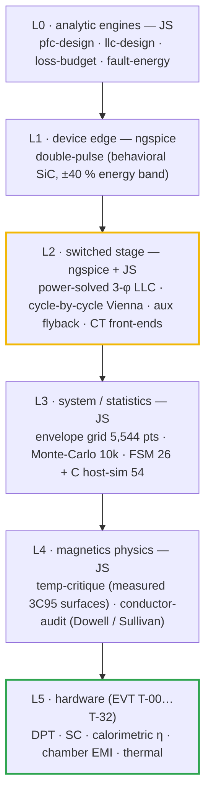

# 🧪 Simulation Toolchain

<sub>Which tool proves what, how to run it, how to read the result, and where fidelity ends</sub>

<p>
  
  
  
  
</p>

> [!NOTE]
> **Purpose** — one place that says which simulator or library is trusted for which question, the exact command
> that reproduces each result, what each result means, and where its fidelity ends.
>
> **Gate coupling** — SPICE result CSVs are consumed by
> [`current-coordination.mjs`](../calculations/system/current-coordination.mjs), which fails if a deck is stale
> (tank fingerprint) or non-physical (legs outside the rails). The JS engines run inside `run-all.sh`.

## 1. The fidelity ladder — each level answers a different question



| Level | Question it answers | Question it must NOT answer |
|---|---|---|
| L0 analytic | sizing, trends, budgets | peaks, ripple shape, ZVS |
| L1 DPT | overshoot, dv/dt, Eon/Eoff trend, gate-network choice | absolute switching energy (±40 % until vendor models / bench) |
| L2 switched | **instantaneous currents**, ZVS, Cr voltage, ripple on the real L(i), trip races | thermal, EMI spectra beyond the carrier band |
| L3 system | envelope coverage, tolerance yield, protection logic | waveform detail |
| L4 magnetics | core loss vs temperature, runaway, AC copper at simulated currents | gap-fringing 3-D effects (FEM / first article) |
| L5 hardware | everything that has a meter | — |

## 2. Tools — chosen, how used, and the credible alternatives

| Tool / library | Role here | How we run it | Why this one | Limits we accept |
|---|---|---|---|---|
| **ngspice-46** (KLU) | L1/L2 decks | `node spice/<suite>/<runner>.mjs` → `spice/run.mjs` batch + wrdata parser; decks preserved in `spice/generated/` | open, scriptable, deterministic, CI-able; the whole suite reruns unattended | vendor **encrypted** PSpice SiC models don't load → behavioral devices (L1 band) |
| **Node.js engines** | L0/L3/L4 + the cycle-by-cycle Vienna | `sh calculations/run-all.sh` | no install beyond node; exact reproducibility; gates import the same constants | model fidelity is documented per file header |
| **Frozen upb-lea materialdatabase surfaces** (3C95) | L4 core loss vs T, Bsat(T), µa(T) | `calculations/magnetics/tempdata-3c95.json` (provenance inside) | measured datasheet surfaces, not a fit | PC95/DMR95 treated as same class; like the MagNet benchmark (ferrites, zero DC bias, 50–500 kHz, ≈10 % average measurement floor) it covers **D2/D3, not the DC-biased Kool Mµ D1** |
| **Dowell / Sullivan** (in-repo) | L4 AC copper | `conductor-audit.mjs`; clean-room copy in `verify-independent.mjs` §B | closed-form, fast, textbook-validated; the right tool to choose foil gauge and strand count | 1-D fields — gap fringing and end effects need FEM or measurement |
| **PyOpenMagnetics / OpenMagnetics MKF** | optional cross-check (geometry-level Rac, leakage) | `pip install PyOpenMagnetics` in a Python 3.11/3.12 venv (not present on this host's 3.14) | open implementations of Dowell/Albach/litz models + a core database | not a battery dependency; winding results must agree with conductor-audit ±15 %. **Its core-loss outputs are never evidence:** the regression tests accept 1.54–2.48× tolerances and skip the only Kool Mµ DC-bias case (E60 research, verified 3-0) |
| **FEMMT** (upb-lea) + ONELAB | **D3 S1-foil gap fringing** at the PAR-525 currents · D2 fringing · leakage vs spacer | 2-D axisymmetric equivalent of the E70/PQ50 geometry, centre-leg gaps, **current excitation from `llc-stress` waveforms via FFT** | open, litz- and material-database-aware | release 0.5.4: **no toroids, no voltage excitation, no saturation/DC bias** (verified 3-0) → cannot model D1; run once per construction rev, not per commit |
| **Kool Mµ D1 under DC bias** | L(i) roll-off and core loss at line-frequency bias + 50 kHz ripple | engines use the **catalog DC-bias curve at lot AL −8 %**; first-article L(I) at −30/+25/+100 °C closes it | no open tool is validated here: MKF skips the case, FEMMT has no toroid, MagNet excludes bias | D1 Fe is ≈7 % of D1 loss, so even a 2× bias error moves the choke by ≈2.4 W, inside its ΔT acceptance |
| **Friedli–Kolar closed forms** (IEEE TPEL 29(2) 2014) | L0 check of the cycle-by-cycle Vienna device currents | `verify-independent.mjs` §K integrates them with the min-max offset | peer-reviewed, exact for CCM local averages | exclude ripple (the switched model adds it) |
| **LTspice** (free) / **SIMetrix** | vendor-model DPT and short-circuit transients when models arrive (A1/§K) | import vendor encrypted models; re-run the DPT matrix | vendors publish LTspice/PSpice models | GUI-first; results fed back as CSVs, never as screenshots |
| **PLECS** (commercial) | optional closed-loop + thermal co-sim of HAL controllers (FW-R6 clamp, CC loop steps) | piecewise-linear switches + datasheet thermal tables | industry standard for converter control/thermal studies | licence; reserved for the HAL phase |

## 3. Reproduce everything

```bash
sh calculations/run-all.sh
```

```bash
node spice/llc/llc-run.mjs 30kw 40kw 50kw 50kwa
```

```bash
node spice/protection/ct-frontend.mjs && node spice/protection/prechg-disch.mjs && node spice/aux/aux-flyback.mjs
```

The LLC campaign takes about 10 minutes with the four SKUs in parallel shells, and each deck about 1 s.
Result CSVs land in `simulation-results/<sku>/`; raw `.out` waveforms are git-ignored.

## 4. Results and how to read them

### 4.1 LLC — power-solved, per SKU (`simulation-results/<sku>/llc-stress.csv`)

| Reading | Meaning |
|---|---|
| **SER250-full: 45.1 / 60.1 / 74.7 A rms** — the FHA grid computes 45.6 / 60.6 / 75.8 (before thermal folds) | the envelope grid's current model is validated to ≈1 % at the worst corner; its old "A pk" label was the error, not its math |
| worst peak with ±3 %/±5 % section mismatch: **70.2 / 94.0 / 117.9 A** | this, ×1.2, is the F.11 floor. Current sharing between sections degrades peaks by up to 8 % |
| PAR525 gain-worst (Lr +3 %, Cr −5 %, Lm +7 %): full power at 77–82 kHz, ZVS 64/64 | **capability proven per SKU tank.** The Monte-Carlo only ever held the 30 kW tank |
| internal short: +42…+50 A in 3 µs | sets the CT/ADC observability ceiling. The trip itself is already latched at F.11 |
| PS surrogate corners | fidelity note: duty-limited pulses stand in for the HAL's real PS modulation; peaks there are below the PFM SER corner |
| **PAR400-full nominal: 29.0 / 38.0 / 47.0 A rms** at ~150 kHz — the grid's FHA reads 29.2 / 38.5 / 47.8 | two independent models agree ≤2 %. The loss budget had been carrying **23.3 A × k from the withdrawn deck** (~20 % low); it now reads this row, so full-power η restates −0.13…−0.17 pt |

### 4.2 Vienna — cycle-by-cycle (`calculations/out/vienna-switched.csv`)

| Reading | Meaning |
|---|---|
| peak 94.4 / 124.3 / 156.5 A at 330 VAC, bus 830, lot −8 % | the ripple rides the **soft-saturated** inductance at the true peak (61 / 51 / 38 µH), ~40 % above the pack's nominal-L ripple |
| dips and a 20° jump add only 2.6–3 A | valid **with** the FW-R6 reference clamp; without it a dip recovery commands +43 % current |
| 150 kHz band content 0.7–1.2 dB **below** the LISN basis | the triangular worst-θ EMI basis is conservative, so D6 stays unchanged |
| 475/500 VAC on a 650 V bus: 15–40 % THD | a **design** defect (bus policy), not a simulation artifact → FW-R7 floor |

### 4.3 Protection & aux decks

| Deck | Result | Meaning |
|---|---|---|
| `ct-frontend` per SKU | F.xx lands within 20 mV of the computed DAC point; operating peak 0.85–2.45 V; F.xx + race ≤ 3.17 V | the E60 burdens are right at the ADC and the comparator |
| `prechg-disch` per SKU | t95 193 / 231 / 310 ms · discharge 1.99 / 2.39 / 3.19 s vs 3 / 4 / 5 s · bleed 9 / 13.5 / 18 s vs 2.5·τ | F.20/F.21/F.21b windows correct for the **product** SKUs (the deck carried 60/120 kW rows until E60) |
| `aux-flyback` per SKU | 57 / 68 / 46 / 80 W, V24 22.5–26.4 V consumer window, V15 ≥ 15 V | 110 W stage covers every SKU; the 50 kW-liquid light load at 850 V regulates +6 % (behavioral skip — bench T-09) |

### 4.4 External anchors — the models against something they did not produce (`verify-independent` §K)

| Anchor | Result | Reading |
|---|---|---|
| Friedli–Kolar closed forms vs `vienna-switched` (330 VAC, bus 830) | switch **+0.7 %** · diode avg **−0.2…−0.4 %** · diode rms **+0.3…+0.5 %**, all three SKUs | the cycle-by-cycle model reproduces the textbook device currents; the small positive offset is its switching ripple |
| Wolfspeed CRD-30DD12N-K measured tank current (500 V series corner, scaled by bank current and turns) vs our SER-250 corner | **65.4 vs 71.1 A pk (−8 %)** · **45.1 vs 47.9 A rms (−6 %)** | a different tank (Lr/Lm) in the same class lands within ±10 %. The withdrawn deck would have failed this anchor by an order of magnitude |

## 5. Lessons the E60 campaign turned into guards

> [!WARNING]
> **A simulation that cannot fail is not evidence.** The pre-E60 LLC deck modelled switches as gate-controlled
> conductances **without body diodes**. During dead time the leg node was unclamped and swung to ±6 kV. Its
> "ZVS = YES" check (leg ≥ Vbus − 60 V at turn-on) passed *because* the node overshot the rail. Three guards now
> exist:

| Guard | Where | Catches |
|---|---|---|
| **physicality** — every leg inside −30 V … Vbus + 30 V on every corner | `llc-run.mjs` → `legsInRails` | missing clamps, unphysical nodes |
| **power-solved** — fsw/duty bisected to the target ±1.5 % | `llc-run.mjs` → `solve()` | "sim currents" measured at the wrong power (the old deck missed by −77…+71 %) |
| **tank fingerprint** — Lr·Cr·Lm·Coss string in every result | `current-coordination.mjs` §A | a tank change without a re-run (the old suite ran the 30 kW tank for every SKU) |
| **deck writes no docs** | `aux-flyback.mjs` | a re-run silently regressing a maintained drawing (it used to overwrite the D4 rev D sheet with rev C) |
| **main-guard for paths with spaces** | `fileURLToPath(import.meta.url) === process.argv[1]` | runners that silently do nothing |

## 6. Where fidelity ends (and the bench takes over)

Absolute switching energy (DPT T-01) · D3 S1-foil gap fringing (FEMMT, then T-31) · Kool Mµ loss under bias (first article) · cold soak −30 °C (T-32) · short-circuit withstand at the chosen blanks (both polarities) · closed-loop
LLC load steps and Vienna dip recovery with the real HAL · CT saturation at the fitted burdens · Rac of first
articles at 140 kHz · gap-fringing losses (FEMMT/first article) · EMI chamber (T-08) · thermal chamber.

---

<div align="center">
<sub><a href="aux-transformer-D4.md">← D4 Aux Flyback Transformer</a> &nbsp;·&nbsp; <a href="README.md">🧭 Documentation hub</a> &nbsp;·&nbsp; <a href="simulation-report.md">Simulation Report →</a></sub>

<sub>Vectivolt DC-Modules · documentation rev E61 · every number reproduces with <code>sh calculations/run-all.sh</code></sub>
</div>
