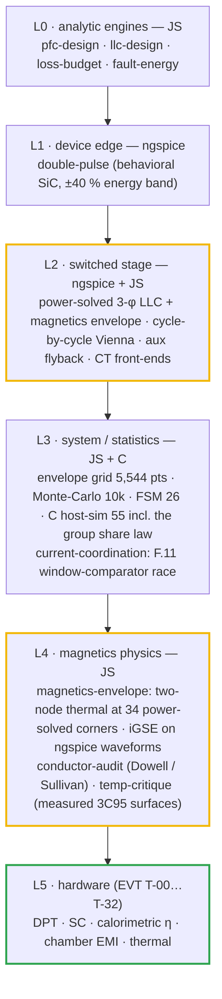
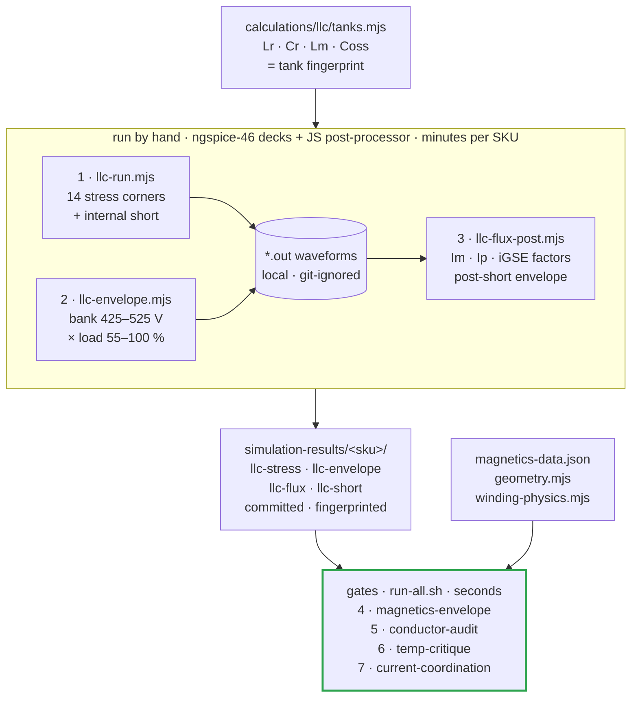

# 🧪 Simulation Toolchain

<sub>Which tool proves what, how to run it, how to read the result, and where fidelity ends</sub>

<p>
  
  
  
  
</p>

> [!NOTE]
> **Purpose** — one place that says which simulator or library is trusted for which question, the exact command
> that reproduces each result, what each result means, and where its fidelity ends.
>
> **Gate coupling** — SPICE result CSVs are consumed by
> [`current-coordination.mjs`](../calculations/system/current-coordination.mjs), which fails if a deck is stale
> (tank fingerprint) or non-physical (legs outside the rails), and by
> [`magnetics-envelope.mjs`](../calculations/magnetics/magnetics-envelope.mjs), which fails if the magnetics
> excitation table is stale or no longer matches the corners it was taken from. The JS engines run inside
> `run-all.sh`; none of them calls ngspice.

## 1. The fidelity ladder — each level answers a different question



| Level | Question it answers | Question it must NOT answer |
|---|---|---|
| L0 analytic | sizing, trends, budgets | peaks, ripple shape, ZVS |
| L1 DPT | overshoot, dv/dt, Eon/Eoff trend, gate-network choice | absolute switching energy (±40 % until vendor models / bench) |
| L2 switched | **instantaneous currents**, ZVS, Cr voltage, ripple on the real L(i), the magnetizing-current waveform at every corner, the post-short current envelope | thermal, EMI spectra beyond the carrier band |
| L3 system | envelope coverage, tolerance yield, protection logic and trip races, the multi-module share law | waveform detail |
| L4 magnetics | D3/D2 flux, core and AC copper loss, core and winding hot-spot at **every power-solved corner**, runaway and saturation margin, bond-loss survivability, the Lr split | gap-fringing and end-winding fields (the copper and leakage models are 1-D → FEM / first article), a built part's measured Rth, Kool Mµ loss under DC bias |
| L5 hardware | everything that has a meter | — |

## 2. Tools — chosen, how used, and the credible alternatives

| Tool / library | Role here | How we run it | Why this one | Limits we accept |
|---|---|---|---|---|
| **ngspice-46** (KLU) | L1/L2 decks | `node spice/<suite>/<runner>.mjs` → `spice/run.mjs` batch + wrdata parser; decks preserved in `spice/generated/` | open, scriptable, deterministic, CI-able; the whole suite reruns unattended | vendor **encrypted** PSpice SiC models don't load → behavioral devices (L1 band) |
| **Node.js engines** | L0/L3/L4 + the cycle-by-cycle Vienna | `sh calculations/run-all.sh` | no install beyond node; exact reproducibility; gates import the same constants | model fidelity is documented per file header |
| **C host-sim** | L3 production logic: FSM scenarios, CAN codec with a 100k-frame fuzz, the E66 group share law on three nodes | `sh firmware/run_tests.sh` → **55/55** under Address/UB sanitizers | it runs the shipped C99 core itself, not a model of it | no HAL, no real peripheral timing |
| **upb-lea materialdatabase** (frozen extracts) | L4 ferrite loss vs f, B and T · Bsat(T) · µa(T) | `tempdata-3c95.json` → temp-critique · `magnetics-data.json` (TDK N95 curves + LEA-measured N95, upstream commit recorded) → magnetics-envelope | measured datasheet surfaces and a university measurement, not a fit | PC95/DMR95/3C95/N95 treated as one class; like the MagNet benchmark (ferrites, zero DC bias, 50–500 kHz, ≈10 % average measurement floor) it covers **D2/D3, not the DC-biased Kool Mµ D1** · calibration and a data defect in [§5.2](#52-tool-evaluation) |
| **OpenMagnetics MAS** (data only) | L4 core geometry + a second loss surface | `core_shapes` / `core_materials` frozen into `magnetics-data.json` → `geometry.mjs`, magnetics-envelope | vendor-neutral, versioned NDJSON — the database behind MKF, usable without MKF | nominal dimensions; sine-excited, zero-bias Steinmetz fits |
| **Dowell / Sullivan** (in-repo) | L4 AC copper · 1-D leakage | `winding-physics.mjs`, shared by conductor-audit and magnetics-envelope; clean-room copy in `verify-independent.mjs` §B | closed-form, fast, textbook-validated; the right tool to choose foil gauge and strand count | 1-D fields — gap fringing and end effects need FEM or measurement |
| **PyOpenMagnetics / OpenMagnetics MKF** | cross-check engine (geometry-level Rac, leakage) — evaluated at E65, **not installable on this host** | no macOS wheel, and the source build fails in an upstream dependency ([§5.2](#52-tool-evaluation)) → the project reads its MAS data directly | open implementations of Dowell/Albach/litz models + a core database | not a battery dependency; winding results from a Linux or Windows wheel must agree with conductor-audit ±15 %. **Its core-loss outputs are never evidence:** the regression tests accept 1.54–2.48× tolerances and skip the only Kool Mµ DC-bias case (E60 research, verified 3-0) |
| **FEMMT** (upb-lea) + ONELAB | **next step, at first article:** D3 S1-foil gap fringing at the PAR525 currents · D2 distributed-gap fringing · leakage vs barrier spacing | 2-D axisymmetric equivalent of the E70 geometry, centre-leg gaps, **current excitation from the simulated waveforms via FFT** | open, litz- and material-database-aware | release 0.5.4: **no toroids, no voltage excitation, no saturation/DC bias** (verified 3-0) → cannot model D1; run once per construction rev, not per commit |
| **FEMM 4.2** | independent 2-D cross-check of the FEMMT fringing and leakage results | planar / axisymmetric time-harmonic model of the same E70 window | free, long-established 2-D magnetics solver; a second solver catches a mesh or boundary error | Windows application (Wine elsewhere), scripted by hand, not CI; 2-D only |
| **Kool Mµ D1 under DC bias** | L(i) roll-off and core loss at line-frequency bias + 50 kHz ripple | engines use the **catalog DC-bias curve at lot AL −8 %**; first-article L(I) at −30/+25/+100 °C closes it | no open tool is validated here: MKF skips the case, FEMMT has no toroid, MagNet excludes bias | D1 Fe is ≈7 % of D1 loss, so even a 2× bias error moves the choke by ≈2.4 W, inside its ΔT acceptance |
| **Friedli–Kolar closed forms** (IEEE TPEL 29(2) 2014) | L0 check of the cycle-by-cycle Vienna device currents | `verify-independent.mjs` §K integrates them with the min-max offset | peer-reviewed, exact for CCM local averages | exclude ripple (the switched model adds it) |
| **LTspice** (free) / **SIMetrix** | vendor-model DPT and short-circuit transients when models arrive (A1/§K) | import vendor encrypted models; re-run the DPT matrix | vendors publish LTspice/PSpice models | GUI-first; results fed back as CSVs, never as screenshots |
| **PLECS** (commercial) | optional closed-loop + thermal co-sim of HAL controllers (FW-R6 clamp, CC loop steps) | piecewise-linear switches + datasheet thermal tables | industry standard for converter control/thermal studies | licence; reserved for the HAL phase |

## 3. Reproduce everything

```bash
sh calculations/run-all.sh
```

```bash
node spice/llc/llc-run.mjs 30kw 40kw 50kw 50kwa
```

```bash
node spice/llc/llc-envelope.mjs 30kw 40kw 50kw 50kwa && node spice/llc/llc-flux-post.mjs 30kw 40kw 50kw 50kwa
```

```bash
node spice/protection/ct-frontend.mjs && node spice/protection/prechg-disch.mjs && node spice/aux/aux-flyback.mjs
```

The LLC campaign takes about 10 minutes with the four SKUs in parallel shells, and each deck about 1 s; the
magnetics envelope adds ≈10–15 minutes per SKU. Result CSVs land in `simulation-results/<sku>/`; raw `.out`
waveforms are git-ignored, so the flux post-processor must run on the machine that ran the decks. The magnetics
chain, step by step, is [§5.3](#53-the-pipeline-step-by-step).

## 4. Results and how to read them

### 4.1 LLC — power-solved, per SKU (`simulation-results/<sku>/llc-stress.csv`)

| Reading | Meaning |
|---|---|
| **SER250-full: 45.1 / 60.1 / 74.7 A rms** — the FHA grid computes 45.6 / 60.6 / 75.8 (before thermal folds) | the envelope grid's current model is validated to ≈1 % at the worst corner; its old "A pk" label was the error, not its math |
| worst peak with ±3 %/±5 % section mismatch: **70.2 / 94.0 / 117.9 A** | this, ×1.2, is the F.11 floor. Current sharing between sections degrades peaks by up to 8 % |
| PAR525 gain-worst (Lr +3 %, Cr −5 %, Lm +7 %): full power at 77–82 kHz, ZVS 64/64 | **capability proven per SKU tank.** The Monte-Carlo only ever held the 30 kW tank |
| bank 500–525 V corners (`llc-envelope.csv`): **77–88 kHz**, magnetizing peak up to **21.5 / 22.3 / 24.8 A** — the 30 kW peak sits at 55 % load | D3 flux follows bank voltage, not load: **142 / 176 / 158 mT** on the E65 constructions. Read in [§5](#5-magnetics-validation-workflow-e65) |
| internal short (`llc-short.csv`): the tank current crosses F.11 1.1–1.8 µs after the collapse; the window-comparator kill 1 µs later lands at **104 / 132 / 158 A** | ≥1.5× under the 162 / 198 / 238 A CT observability ceilings. E60 sampled fixed times after the short against a positive-only threshold, which the worst section crosses late because it swings negative first |
| PS surrogate corners | fidelity note: duty-limited pulses stand in for the HAL's real PS modulation; peaks there are below the PFM SER corner |
| **PAR400-full nominal: 29.0 / 38.0 / 47.0 A rms** at ~150 kHz — the grid's FHA reads 29.2 / 38.5 / 47.8 | two independent models agree ≤2 %. The loss budget had been carrying **23.3 A × k from the withdrawn deck** (~20 % low); it now reads this row, so full-power η restates −0.13…−0.17 pt |

### 4.2 Vienna — cycle-by-cycle (`calculations/out/vienna-switched.csv`)

| Reading | Meaning |
|---|---|
| peak 94.4 / 124.3 / 156.5 A at 330 VAC, bus 830, lot −8 % | the ripple rides the **soft-saturated** inductance at the true peak (61 / 51 / 38 µH), ~40 % above the pack's nominal-L ripple |
| dips and a 20° jump add only 2.6–3 A | valid **with** the FW-R6 reference clamp; without it a dip recovery commands +43 % current |
| 150 kHz band content 0.7–1.2 dB **below** the LISN basis | the triangular worst-θ EMI basis is conservative, so D6 stays unchanged |
| 475/500 VAC on a 650 V bus: 15–40 % THD | a **design** defect (bus policy), not a simulation artifact → FW-R7 floor |

### 4.3 Protection & aux decks

| Deck | Result | Meaning |
|---|---|---|
| `ct-frontend` per SKU | F.xx lands within 20 mV of the computed comparator point; operating peak 0.92–2.38 V; F.xx + race ≤ 3.13 V (limit 3.27 V) | the E65 resonant burdens (1.0 / 0.82 / 0.68 Ω) and the E60 line burdens are right at the ADC and the comparator |
| `prechg-disch` per SKU | t95 193 / 231 / 310 ms · discharge 1.99 / 2.39 / 3.19 s vs 3 / 4 / 5 s · bleed 9 / 13.5 / 18 s vs 2.5·τ | F.20/F.21/F.21b windows correct for the **product** SKUs (the deck carried 60/120 kW rows until E60) |
| `aux-flyback` per SKU | 57 / 68 / 46 / 80 W, V24 22.5–26.4 V consumer window, V15 ≥ 15 V | 110 W stage covers every SKU; the 50 kW-liquid light load at 850 V regulates +6 % (behavioral skip — bench T-09) |

### 4.4 External anchors — the models against something they did not produce (`verify-independent` §K)

| Anchor | Result | Reading |
|---|---|---|
| Friedli–Kolar closed forms vs `vienna-switched` (330 VAC, bus 830) | switch **+0.7 %** · diode avg **−0.2…−0.4 %** · diode rms **+0.3…+0.5 %**, all three SKUs | the cycle-by-cycle model reproduces the textbook device currents; the small positive offset is its switching ripple |
| Wolfspeed CRD-30DD12N-K measured tank current (500 V series corner, scaled by bank current and turns) vs our SER-250 corner | **65.4 vs 71.1 A pk (−8 %)** · **45.1 vs 47.9 A rms (−6 %)** | a different tank (Lr/Lm) in the same class lands within ±10 %. The withdrawn deck would have failed this anchor by an order of magnitude |

## 5. Magnetics validation workflow (E65)

> [!IMPORTANT]
> **Why this workflow exists.** Until E65 every D3 flux and core-loss check used the resonant point (140 kHz,
> 415 V half-cycle → 108 / 90 / 109 mT). The power-solved decks run **77–88 kHz at bank 500–525 V**, where the
> flux of the registered parts is volt-second pinned at **153–237 mT** and the ferrite loss is 2–3× the resonant
> basis. Flux follows bank voltage, not load, so a power derate cannot relieve it. Every LLC magnetic is now
> evaluated at **every power-solved corner**, from the simulated waveforms, through a thermal network that shows
> which path actually limits the heat.

### 5.1 What changed in the method

| Question | Before E65 | From E65 |
|---|---|---|
| Operating points | one resonant point per part | **34 power-solved corners per SKU** — 14 stress corners + a 20-point bank-voltage × load envelope |
| Flux | volt-seconds at resonance | D3: Lm · simulated magnetizing peak / (N·Ae) · D2: top-bin L · simulated tank peak / (N·Ae) |
| Core loss | 3C95 surface scaled to the resonant point | calibrated N95 surface × the **iGSE factor of the simulated waveform**, at each corner's frequency |
| Copper | hand-typed Pcu, AC factors taken at 140 kHz | Dowell / Sullivan at each corner's own frequency, per-winding mean turn from the radial build |
| Geometry | mean turn typed per gate | [`geometry.mjs`](../calculations/magnetics/geometry.mjs) — MAS dimensions + catalog former lengths, one source for every gate |
| Thermal | lumped Rth = ΔT acceptance ÷ loss | **two-node core / winding network** from geometry · +25 % Rth · runaway margin · one lost gap pad |
| Proof the gate can fail | none | `[CONTROL]` rejects the E60 D3 as registered, on every SKU |
| F.11 race | sampled at fixed times after the short, positive threshold only | measured from the F.11 crossing on the committed post-short envelope, both polarities |

### 5.2 Tool evaluation

Three open magnetics projects were evaluated as engines or data sources, and two FEM tools are kept for the
questions a 1-D model cannot answer.

| Tool | What it offers | What the project takes from it | Trusted for — and where it ends |
|---|---|---|---|
| **PyOpenMagnetics 1.7.13** — Python wrapper of the OpenMagnetics MKF engine | core, material and wire databases · Steinmetz, iGSE and Roshen core loss · Dowell/Wojda skin and Albach/Ferreira proximity loss · leakage and gap-reluctance models · a thermal network · a converter-driven design adviser (LLC included) · SPICE subcircuit export | **nothing executed.** PyPI ships wheels for manylinux x86_64 and win_amd64 only, so macOS arm64 must build the sdist — and that build stops in an upstream dependency (chain below) | a winding Rac / leakage cross-check on a Linux or Windows host (±15 % against conductor-audit). **Never core-loss evidence** — its regression tests accept 1.54–2.48× tolerances and skip the only Kool Mµ DC-bias case (E60, verified 3-0) |
| **OpenMagnetics MAS** data — `901af03`, 2026-09-13 | `core_shapes.ndjson` (IEC 63093 nominal dimensions) · `core_materials.ndjson` (Steinmetz fits with a temperature polynomial, saturation) | read directly and frozen into [`magnetics-data.json`](../calculations/magnetics/magnetics-data.json) with the upstream commit: E70/33/32, PQ50/50, ETD39 and T79/T57/T48 dimensions → `geometry.mjs`; N95 Steinmetz(T) → the second loss surface; 3C95 Steinmetz and PC95 saturation frozen alongside for the class comparison | shape dimensions (catalog Ae, Ve and former lengths are carried separately and self-checked); class-level loss — at 80 kHz / 200 mT / 100 °C the N95 fit reads 238 and 3C95 250 kW/m³ against 249 from the datasheet. Ends at sine excitation and zero bias |
| **upb-lea/materialdatabase** — TU Paderborn LEA, `04fff8e`, 2026-08-27 | TDK N95 datasheet curves (loss over f, B and T; B–H) · LEA-measured N95 complex permeability (R29.5×19×14.9 toroid, sinusoidal, 30 / 50 / 70 °C) · 3C95 datasheet surfaces | the N95 loss surface and its calibration → `magnetics-data.json` (magnetics-envelope); the 3C95 surfaces → `tempdata-3c95.json` (temp-critique) | ferrite loss at D3 flux levels, calibrated (table below); Bsat(T). Measured data ends at 70 °C (the datasheet temperature shape carries 70 → 100 °C); zero DC bias |
| **FEMMT** (upb-lea) + ONELAB | 2-D axisymmetric FEM of wound E-cores — litz and foil conductors, air gaps, material-database aware | not run at E65 — **the recommended next step**, once per construction rev at first article | D3 S1-foil gap fringing at the PAR525-gainWorst currents · D2 distributed-gap fringing against the ≥3 mm litz clearance · leakage against barrier spacing, which checks the 1-D 0.14–0.19 µH. Ends at 2-D; release 0.5.4 (E60 review) has no toroids, no voltage excitation and no saturation / DC bias |
| **FEMM 4.2** | 2-D planar / axisymmetric time-harmonic magnetics | not run — the independent second solver for the same checks | agreement of two solvers on fringing loss and leakage energy before either number enters a drawing. Ends at 2-D; a Windows application (Wine elsewhere), scripted by hand, not CI |

**PyOpenMagnetics on macOS arm64 — the build-failure chain** (sdist 1.7.15, current at E65; 1.7.13 publishes the
same wheel set):

| # | What happens | Cause | Workaround | Result |
|---|---|---|---|---|
| 0 | `pip install PyOpenMagnetics` finds no macOS wheel — for the host's Python 3.14 or any other — and builds the sdist (Python 3.11.14 venv) | wheels exist for manylinux x86_64 and win_amd64 only | — | source build: scikit-build-core 1.0.3 · CMake 4.1.2 · AppleClang 17.0.0 |
| 1 | CMake configuration stops inside bundled dependencies | CMake 4 removed compatibility with `cmake_minimum_required` below 3.5 | `CMAKE_POLICY_VERSION_MINIMUM=3.5` | configures |
| 2 | `quicktype: command not found` → generating `MAS/MAS.hpp` fails (exit 127) | the C++ schema headers (MAS, CAS, RAS, SAS) are generated at build time by the quicktype CLI | quicktype 26.0.0 from npm on `PATH` | headers generate |
| 3 | the kirchhoff converter-model library it fetches and builds as an ExternalProject (`libKirchhoffApi`) fails inside `nlohmann/json.hpp` — `too few template arguments for class template 'json_sax_dom_parser'`, `set_parents()` declared private — until the compiler's 20-error limit | nlohmann/json template mismatch inside kirchhoff's own build under AppleClang 17 | none short of patching upstream | **build aborted — upstream defect** |

**Why the data and not the engine.** What E65 had to answer — flux and loss at 34 simulated corners, through a
thermal network, against a control group — needs material and geometry data, not an adviser. MAS and the
materialdatabase are plain, versioned files: frozen with their upstream commits, they keep every gate reproducible
with node alone, on any host, unattended in `run-all.sh`. The engine is not installable here, and its core-loss
outputs were already rejected as evidence at E60.

**Material calibration — how far the loss surface is trusted:**

| Comparison | Window | Measured ÷ model | Consequence |
|---|---|---|---|
| LEA-measured N95 vs the datasheet surface | 70–190 kHz · ≥100 mT · 45–70 °C · 266 points | geometric mean **1.044**, worst **1.211** | the surface reads ≈4 % low on average |
| the D3 high-flux window | ≥150 mT · 70–130 kHz | **1.14** | `CAL = 1.14` multiplies the loss at every corner |
| the D2 window (E65 review) | 140–170 kHz · 82–128 mT · 70 °C | 0.92–0.945 against the datasheet | CAL over-predicts D2 core loss by ≈1.2× — conservative, deliberately not corrected |

> [!WARNING]
> **Upstream data defect — 3C95 B–H temperatures are swapped.** In `datasheet_curves/3C95/b_over_h_at_f_T.csv`
> the curve topping out at 401 mT is labelled 25 °C and the 499 mT curve 100 °C, yet saturation falls with
> temperature (the N95 file in the same database reads correctly). `temp-critique` swaps them back
> (Bsat 499 mT at 25 °C → 401 mT at 100 °C). Flag it wherever that file is used.

### 5.3 The pipeline, step by step



| Step | Command | What it does | Writes |
|---|---|---|---|
| 1 | `node spice/llc/llc-run.mjs 30kw 40kw 50kw 50kwa` | 14 power-solved stress corners per SKU (tolerance, mismatch, gain-worst, bus-floor PS, Imax); the internal short from the worst tank-peak corner; a dead short at 1.45·fr | `llc-stress.csv` · `llc-stress-summary.json` · `plots/llc-worst-corner.svg` · decks `spice/generated/llc-<sku>-<corner>.cir` (the `.out` waveforms stay local) |
| 2 | `node spice/llc/llc-envelope.mjs 30kw 40kw 50kw 50kwa` | the same deck, power solver and guards over bank 425 / 450 / 475 / 500 / 525 V × load 100 / 85 / 70 / 55 %, bus = min(830, max(650, 2·bank/0.95)) | `llc-envelope.csv` — 20 rows: fsw, Im pk, Ip rms / pk, Isec rms, Vcr, ZVS, legs in rails |
| 3 | `node spice/llc/llc-flux-post.mjs 30kw 40kw 50kw 50kwa` | reads both corner tables and the waveform of every one of their 34 corners: magnetizing current Im = ip1 − isa − isb; the iGSE factor of Im (D3) and of the tank current (D2) against a sine of the same peak and frequency (α 1.55, β 2.8); the post-short running maximum of the tank current over all three sections | `llc-flux.csv` — 34 rows · `llc-short.csv` — 201 samples, 0–10 µs after the 300 µs bank collapse. **Writes nothing and exits 1 if a waveform is missing** |
| 4 | `node calculations/magnetics/magnetics-envelope.mjs` | reads `llc-flux`, `llc-stress` and `llc-envelope`: D3 and D2 at every corner — [§5.4](#54-inside-the-envelope-gate), [§5.5](#55-reading-the-gate-output) | console → `MAGNETICS ENVELOPE CLEAN` |
| 5 | `node calculations/magnetics/conductor-audit.mjs` | reads `llc-stress` and the envelope gate's D2 / D3 tables: every winding's Rdc and Rac against its drawing's production rows | console → `CONDUCTOR AUDIT CLEAN` |
| 6 | `node calculations/magnetics/temp-critique.mjs` | reads `llc-flux` and `llc-short`: saturation margins at 130 °C from the simulated flux and the fault race; D4 runaway and cold | console → `MAGNETICS TEMP CRITIQUE CLEAN` |
| 7 | `node calculations/system/current-coordination.mjs` | reads `llc-stress` and `llc-short`: the F.11 window-comparator race; D2 operating and fault flux; every trip against its simulated peak | console → `CURRENT COORDINATION CLEAN` |

Steps 4–7 run inside `run-all.sh` and exit 1 on any FAIL, which stops the script. Step 3 prints one summary line
per SKU; from the committed tables it reads:

```text
30kw: 34 corners → simulation-results/30kw/llc-flux.csv · worst Im 21.51 A at ENV525-55 (83.6 kHz, k_iGSE 0.950)
40kw: 34 corners → simulation-results/40kw/llc-flux.csv · worst Im 22.26 A at PAR525-full (80 kHz, k_iGSE 0.943)
50kw: 34 corners → simulation-results/50kw/llc-flux.csv · worst Im 24.78 A at PAR525-full (77.1 kHz, k_iGSE 0.915)
50kwa: 34 corners → simulation-results/50kwa/llc-flux.csv · worst Im 24.75 A at PAR525-full (77.3 kHz, k_iGSE 0.916)
```

**When to re-run what:**

| What changed | Re-run | Why |
|---|---|---|
| Lr, Cr, Lm or Coss in [`tanks.mjs`](../calculations/llc/tanks.mjs) | steps 1 → 2 → 3 for that SKU, then the gates | the tank fingerprint in every CSV header stops matching; `[DATA]` and `[SIM]` fail until the chain is re-run |
| the deck itself — tolerance table, dead time, device models in `llc-run.mjs` | steps 1 → 2 → 3 for every SKU | **not caught by the fingerprint**, which describes the tank, not the deck mechanics |
| D3 / D2 core, set count, turns (ratio and Lm unchanged), conductor, mount or bond | the gates only | flux scales with 1/(N·Ae), and the iGSE factor is a waveform-shape ratio independent of N·Ae — no re-simulation |
| D2 bins | the gates only | the bins are not part of the fingerprint; `[LR]` re-checks the coverage |
| F.11 threshold, resonant-CT burden or window ladder | `current-coordination`, then the `ct-frontend` deck | the race is read from the committed post-short envelope |

### 5.4 Inside the envelope gate

| Element | How [`magnetics-envelope.mjs`](../calculations/magnetics/magnetics-envelope.mjs) computes it | Anchor | Where it ends |
|---|---|---|---|
| **D3 flux** | B̂ = Lm · Im,pk / (N·Ae), with Lm ×1.07 / ×0.93 at the deck's tolerance corners | E65 review: a volt-second integral of the winding voltage and an independently written deck reproduce it within 2.5 %; the power-solved frequencies sit within 1.3 % of the closed-form FHA no-load gain frequency | section 1 only (the sections differ only at the mismatch corner); centre-leg Ae, no local flux crowding |
| **D2 flux** | B̂ = L(top bin) · Ip,pk / (N·Ae) | current-coordination repeats it at the fault peak | the top bin's nominal L — the ±1.5 % grind tolerance is not added |
| **Core loss** | 1.14 × max(N95 datasheet surface × its temperature shape, MAS Steinmetz(T)) × iGSE factor × Ve, at each corner's frequency | the LEA calibration (§5.2) · `[CONTROL]` | measured data ends at 70 °C; iGSE is sine-referenced (no relaxation loss); N95 stands in for the PC95 / DMR95 / 3C95 class (MAS fits agree within 5 %) |
| **AC copper** | Sullivan litz (primary k 0.25 between the half-current secondaries, trim k 1) and Dowell foil, at each corner's frequency and 100 °C, per-winding mean turn from the S1–P–S2 build | conductor-audit production rows · clean-room copy in `verify-independent` §B | 1-D: fringing where a gap field crosses a conductor, and end effects, are under-read (conductor-audit `[GAP]`) |
| **Leakage (Lr split)** | 1-D MMF energy of the concentric S1–P–S2 interleave, Rogowski factor 1 (conservative high): **0.19 / 0.16 / 0.14 µH** | `[LR]` requires D2 bins that absorb ×0.5…×2.5 of it plus 0.1 µH of loop stray | a built unit's leakage is measured and selects its D2 bin; FEMMT / FEMM confirm the 1-D figure |
| **Thermal** | two nodes (core, winding) from geometry: ferrite at 4 W/m·K over the set height to one or both bonded yoke faces through a 0.5 mm, 3 W/m·K gap pad; winding to core through its build (VPI 0.6 W/m·K) and a 1.2 mm former; forced convection h = 24·√(v/2.5) + 5 W/m²·K on free faces; potted end turns bridged to the web or plate. Walls: coldplate 65 °C (50 kW liquid, internal air 65 → 110 °C with load, still-air h 5); air SKUs web = inlet + 5 + 20·load, air = inlet + 10·load | an independent physical network agreed within a few K (E65 review) | Rth is computed, not measured — the +25 % Rth row carries build and bond spread until the first-article temperature rise |
| **Verdict** | the worst corner for each criterion (§5.5), with Bsat(T) of N95 falling linearly from 525 mT at 25 °C to 410 mT at 100 °C | `[CONTROL]` must reject the E60 D3 | end-of-life mismatch corners count for flux and saturation only, never as thermal states |

### 5.5 Reading the gate output

Every gate prints one line per check — `ok`, `FAIL` or `info` — and a one-line verdict. The values below are the
E65 record.

**`magnetics-envelope`, line by line** (per SKU, in this order):

| Line | What it proves | Reading it | If it fails |
|---|---|---|---|
| `[DATA] … excitation table current` | `llc-flux.csv`, `llc-stress.csv` and `llc-envelope.csv` all carry the drawn tank's fingerprint, and the flux table has one row per stress and envelope corner, each stress corner at the same fsw | 34 corners · "matches" · "aligned" | **STALE** — a tank value changed: re-run steps 1–3 for that SKU. **MISALIGNED** — a runner was interrupted or re-run alone: re-run step 3 (or 2 and 3). Never edit a CSV header |
| `info [sku] iGSE waveform factor` | the waveform-shape multiplier applied to the sine loss | D3 **0.9–1.01** — the magnetizing current is close to a sine · D2 **up to 1.57** — the tank current departs from a sine at the PS-surrogate and far-below-resonance corners | informational. A D3 factor far from 1 means the magnetizing waveform is wrong: inspect the `.out` before trusting any loss |
| `[LR] … D2 bins cover the real transformer leakage` | the Lr split is buildable: computed D3 leakage ×0.5…×2.5 + 0.1 µH of loop stray lies inside the span the bins absorb (Lr − top bin … Lr − bottom bin, ±0.05 µH) | 30 kW: 0.2–0.59 µH needed vs 0.2–0.65 µH covered | re-bin D2 in `tanks.mjs` (bin = Lr − measured leakage − 0.1 µH) or change the D3 interleave. Lr, Cr and Lm do not move, so no re-simulation |
| `[LR] … tank table carries the D2 construction` | `tanks.mjs` nTrim and aeTrim equal the D2 table | current-coordination computes D2 flux from these two numbers | update `tanks.mjs` |
| `[D3]` / `[D2]` | temperature, runaway and saturation margins at every corner | field guide below | field guide below |
| `info [D3-BOND-LOST]` / `[D2-BOND-LOST]` | the same evaluation with one gap pad delaminated (`web2 → web1`, `plate2 → plate1`) | "survives" or "NOT survivable — needs the cutout loop". When the printed temperatures sit inside the limits, the criterion that failed is the runaway margin, which this line does not print | informational — it decides where the 130 °C cutout loop is mandatory (D3-40, D3-50 and D2-50 liquid today) |
| `[BOND]` | the parts-db mechanical line for the cutout loop exists wherever a part cannot survive a lost pad | "× 6" — one thermostat per D3 and D2 | add the mechanical line, or make the part survive the lost pad |
| `[CONTROL]` | the gate still rejects the E60 D3 as registered, on the same excitation. D3 only: the D2 path shares the loss and thermal model but has no control row of its own | 131–153 °C or RUNAWAY on the registered parts → "rejected" | "PASSES — the gate is blind": a constant, calibration or boundary change has removed the gate's ability to fail. Treat every `ok` line as unproven until the control is rejected again |

**Field guide — a `[D3]` / `[D2]` line.** The 40 kW transformer is the teaching case: its core and copper corners
differ, and the hot-spot moves between them with inlet temperature.

```text
ok    [D3] 40kw 2×E70 6:6:6 · web2 · R core→wall 0.77 · winding→core 0.88 K/W — core corner PAR525-full-gainWorst 79.7 kHz B̂ 176 mT Fe 37.3 W · copper corner SER250-full-tolLo 181.1 kHz Cu 31.5 W · hot-spot 97 °C @55 °C (SER250-full-tolLo; core 86 °C / winding 97 °C) / 104 °C @75 °C derated (PAR525-full-gainWorst) · +25 % Rth 108 °C · runaway margin 98 K · B̂ 44 % of hot Bsat
```

| Field | Reads | Pass | If it fails |
|---|---|---|---|
| `2×E70 6:6:6 · web2` | sets × core and turns P : S1 : S2. `web2` / `plate2` = both yoke faces gap-padded to the two extrusion webs / coldplates; `web1` / `plate1` = one face; `air` = unbonded | — | — |
| `R core→wall 0.77 · winding→core 0.88 K/W` | the two conduction paths: ferrite column plus gap pad; winding build plus former and impregnation | — | a high core→wall resistance wants the second face bonded; a high winding→core resistance wants VPI, a thinner former or potted end turns |
| `core corner … B̂ 176 mT Fe 37.3 W` | the corner with the most core loss (at 100 °C) — for D3 always a high-bank, below-resonance corner | — | more turns or another set (B̂ ∝ 1/(N·Ae)); a power derate changes nothing |
| `copper corner … Cu 31.5 W` | the corner with the most copper loss (at 100 °C) — the SER 250 V bank corner above resonance, where the tank current peaks. For D2 both corners coincide there | — | strand count, foil thickness, mean turn |
| `hot-spot 97 °C @55 °C (…; core 86 °C / winding 97 °C)` | the hottest node at full power and 55 °C inlet; the split names the limiting node — the winding here, the core on the 50 kW liquid D2 (84 / 81 °C) | ≤ 125 °C | work on the path of the hotter node (row above) |
| `104 °C @75 °C derated (PAR525-full-gainWorst)` | 75 °C inlet at 40 % power: copper falls with load², core loss does not, so the derated hot-spot lands on the core corner | ≤ 135 °C | a core-side fix only |
| `+25 % Rth 108 °C` | every thermal resistance ×1.25 — build and bond spread | ≤ 155 °C | the margin is thin: bond, impregnate or cut loss |
| `runaway margin 98 K` | the temperature at which the core loop gain dP/dT · R reaches 1 (at +25 % Rth), minus the hottest core equilibrium. Ferrite loss rises above its minimum, so this is the distance to thermal runaway | ≥ 25 K | lower B̂, or lower the core→wall resistance |
| `B̂ 44 % of hot Bsat` | the worst flux against N95 Bsat at the hot core temperature | ≤ 50 % | more turns or another set |

**The companion gates:**

| Gate line | Reading | If it fails |
|---|---|---|
| conductor-audit `[D2]` / `[D3]` | Rdc at 25 °C against the production row (rows sit ≤15 % above the build, so a short strand count or a thin foil is caught) · Fr and hot Rac at the registered current basis (SER250-full-bus764, 140 kHz) · "thermal proof: magnetics-envelope", which carries each corner's own frequency | the construction table and its production row disagree: find which one is wrong. Loosening the row until it passes is not a fix |
| conductor-audit `info [GAP]` | Dowell and Sullivan are 1-D and under-read loss where a gap's fringing field crosses a conductor | informational — mitigated by construction (D2 distributed gap ≤1.0 mm per segment with ≥3 mm clearance; D3 gap split per set), closed by FEMMT / FEMM and T-31 |
| temp-critique `[BSAT] D3` | the worst simulated flux on any SKU against 50 % of the 3C95 Bsat at 130 °C: **176 mT ≤ 50 % of 362 mT** (49 %) | more turns or sets. The D3 is loss-limited, so a failure here means the construction has drifted far from the envelope-proven one |
| temp-critique `[BSAT] D2 fault flux` | top-bin L × the window-comparator kill peak against 60 % of Bsat(130 °C) = 217 mT: **130 / 121 / 134 / 135 mT** | a faster kill or more D2 N·Ae |
| current-coordination `[F.11] window-comparator kill + observability` | when the tank current crosses F.11 on `llc-short.csv`; the kill peak 1 µs later ×1.2 must stay under the CT ceiling (**104.3 A vs 162 A** at 30 kW); the +3 µs monitor peak ×1.05 inside the rail; both window thresholds inside the ADC span (0.80 / 2.50 V at 30 kW) | re-burden or re-threshold, then re-run the `ct-frontend` deck. Never return to fixed-time sampling |
| current-coordination `[D2] trim flux: operating + fault` | top-bin L at the worst nominal peak ≤ 110 mT, and at the kill peak ≤ 60 % Bsat(130 °C) | as above, or more D2 N·Ae |

## 6. Where fidelity ends (and the bench takes over)

Each row is a question no tool in this repository settles; the right-hand column is where it closes.

| Where the model stops | What narrows it before hardware | Closes at |
|---|---|---|
| Absolute switching energy (behavioral SiC, ±40 % band) | vendor models in LTspice / SIMetrix | DPT T-01 |
| Short-circuit withstand at the chosen blanks, both polarities | DESAT timing rows in current-coordination | T-30 |
| Closed-loop LLC load steps and Vienna dip recovery with the real HAL | PLECS co-simulation (HAL phase) | EVT |
| CT saturation at the fitted burdens | `ct-frontend` deck (ideal CT: ADC swing and race peaks inside the rail) | T-31 |
| D3 S1-foil and D2 gap-fringing loss (under-read by the 1-D models) | construction (gap split per set, distributed D2 gap, ≥3 mm clearance) · FEMMT, with FEMM as cross-check | first-article Rac, open-secondary check and S1 thermocouple (T-31) |
| D3 leakage of a built unit (1-D estimate 0.14–0.19 µH) | FEMMT / FEMM leakage against barrier spacing | measured leakage selects the D2 bin |
| Magnetics Rth, bond and impregnation quality; ferrite loss above 70 °C | two-node network · +25 % Rth row · runaway margin · CAL conservative in the D2 window | first-article temperature rise on the bonded mount; in service the 130 °C cutout loop covers a lost bond |
| Kool Mµ D1 loss and L(I) under DC bias | catalog DC-bias curve at lot AL −8 % | first-article L(I) at −30 / +25 / +100 °C |
| Cold soak −30 °C | temp-critique cold rows | T-32 |
| EMI | LISN pre-compliance engine | chamber T-08 |
| Module thermal | envelope grid · magnetics envelope | thermal chamber |

## 7. Lessons the E60 and E65 campaigns turned into guards

> [!WARNING]
> **A simulation that cannot fail is not evidence.** The pre-E60 LLC deck modelled switches as gate-controlled
> conductances **without body diodes**. During dead time the leg node was unclamped and swung to ±6 kV. Its
> "ZVS = YES" check (leg ≥ Vbus − 60 V at turn-on) passed *because* the node overshot the rail. E65 found the same
> failure class in the magnetics and protection gates. These guards now exist:

| Guard | Where | Catches |
|---|---|---|
| **physicality** — every leg inside −30 V … Vbus + 30 V on every corner | `llc-run.mjs` → `legsInRails` | missing clamps, unphysical nodes |
| **power-solved** — fsw/duty bisected to the target ±1.5 % | `llc-run.mjs` → `solve()` | "sim currents" measured at the wrong power (the old deck missed by −77…+71 %) |
| **tank fingerprint** — Lr·Cr·Lm·Coss string in every result | `current-coordination.mjs` §A · `magnetics-envelope.mjs` `[DATA]` | a tank change without a re-run (the old suite ran the 30 kW tank for every SKU) |
| **deck writes no docs** | `aux-flyback.mjs` | a re-run silently regressing a maintained drawing (it used to overwrite the D4 rev D sheet with rev C) |
| **main-guard for paths with spaces** | `fileURLToPath(import.meta.url) === process.argv[1]` | runners that silently do nothing |
| **every corner, not the convenient one** — D3 and D2 at all 34 power-solved corners (E65) | `magnetics-envelope.mjs` | a flux or loss check pinned to the resonant point (D3 read 108 / 90 / 109 mT; the corners reach 153–237 mT) |
| **control group** — the E60 D3 as registered must be rejected on every SKU (E65) | `magnetics-envelope.mjs` → `[CONTROL]` | a model or constant change that leaves the gate unable to fail |
| **no partial excitation table** (E65) | `llc-flux-post.mjs` exits 1 without writing when a waveform is missing; `[DATA]` checks row alignment | a magnetics table silently built from a subset of corners |
| **race from the crossing, both polarities** (E65) | `current-coordination.mjs` → `shortRacePeak` + the window comparator | fixed-time sampling against a positive-only threshold — the worst section crossed 4.5–6.4 µs late, and the kill would have landed at 204–304 A |

---

<div align="center">
<sub><a href="aux-transformer-D4.md">← D4 Aux Flyback Transformer</a> &nbsp;·&nbsp; <a href="README.md">🧭 Documentation hub</a> &nbsp;·&nbsp; <a href="simulation-report.md">Simulation Report →</a></sub>

<sub>Vectivolt DC-Modules · documentation rev E61 · every number reproduces with <code>sh calculations/run-all.sh</code></sub>
</div>
