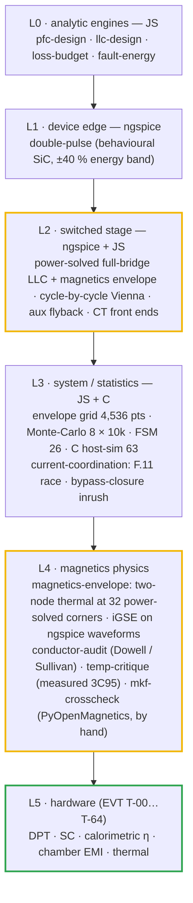
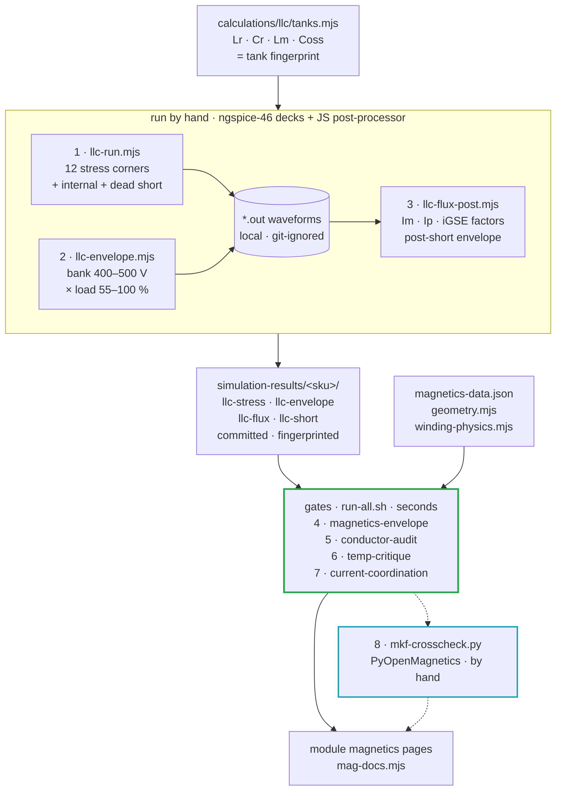

# 🧪 Simulation Toolchain

<sub>Which tool proves what, how to run it, how to read the result, and where fidelity ends</sub>

<p>
  
  
  
  
</p>

> [!NOTE]
> **Purpose** — one place that says which simulator or library is trusted for which question, the exact command that
> reproduces each result, how to read what it prints, and where its fidelity ends. The numbers themselves live in the
> [simulation report](simulation-report.md) and, per magnetic, in the module pages ([30](magnetics-30kw.md) ·
> [40](magnetics-40kw.md) · [50 L](magnetics-50kw.md) · [50 A](magnetics-50kwa.md)); this page does not repeat them.
>
> **Gate coupling** — SPICE result CSVs are consumed by
> [`current-coordination.mjs`](../calculations/system/current-coordination.mjs), which fails if a deck is stale (tank
> fingerprint) or non-physical (legs outside the rails), and by
> [`magnetics-envelope.mjs`](../calculations/magnetics/magnetics-envelope.mjs), which fails if the excitation table is
> stale or misaligned. The JS engines run inside `run-all.sh`; none of them calls ngspice. The PyOpenMagnetics
> cross-check runs by hand and never gates the battery.

## At a glance

| | |
|---|---|
| **Engine** | **ngspice-46** (KLU, trapezoidal) on macOS arm64 · Node 20 for the JS engines · PyOpenMagnetics 1.4.0 by hand |
| **Levels** | L1 closed form → L2 JS engines → L3 averaged system grid → L4 switched SPICE → **L5 hardware (EVT T-00…T-64)** |
| **What gates read** | SPICE result CSVs are consumed by `current-coordination` (stale-deck fingerprint, physicality guard) and `magnetics-envelope` |
| **Rule** | a simulation must be able to **fail** — every deck carries a physicality guard, a power-solve and a model fingerprint; fourteen falsification injections were run at E81 |
| **Where fidelity ends** | §6 — and nothing here is a compliance claim |

## 1. The fidelity ladder — each level answers a different question



| Level | Question it answers | Question it must NOT answer |
|---|---|---|
| L0 analytic | sizing, trends, budgets | peaks, ripple shape, ZVS |
| L1 DPT | overshoot, dv/dt, Eon/Eoff trend, gate-network choice | absolute switching energy (±40 % until vendor models or the bench) |
| L2 switched | **instantaneous currents**, ZVS, Cr voltage, ripple on the real L(i), the magnetizing-current waveform at every corner, the post-short current envelope | thermal, EMI spectra beyond the carrier band |
| L3 system | envelope coverage, tolerance yield, protection logic and trip races, the parallel-operation share law | waveform detail |
| L4 magnetics | D3 / D2 flux, core and AC copper loss, core and winding hot-spot at **every power-solved corner**, runaway and saturation margin, bond-loss survivability, the Lr split; a second, 2-D copper and gap opinion from MKF | a built part's measured Rth and AC resistance, foil edge loss beyond the two models' bracket, Kool Mµ loss under DC bias |
| L5 hardware | everything that has a meter | — |

## 2. Tools — chosen, how used, and the credible alternatives

| Tool / library | Role here | How we run it | Why this one | Limits we accept |
|---|---|---|---|---|
| **ngspice-46** (KLU) | L1 / L2 decks | `node spice/<suite>/<runner>.mjs` → `spice/run.mjs` batch + wrdata parser; decks kept in `spice/generated/` | open, scriptable, deterministic; the whole suite reruns unattended | vendor **encrypted** PSpice SiC models do not load → behavioural devices (L1 band) |
| **Node.js engines** | L0 / L3 / L4 + the cycle-by-cycle Vienna | `sh calculations/run-all.sh` | no install beyond node; exact reproducibility; gates import the same constants | model fidelity is stated in each file header |
| **C host-sim** | L3 production logic: FSM scenarios, CAN codec with a 100k-frame fuzz, the group share law on three nodes | `sh firmware/run_tests.sh` → **six binaries under Address / UB sanitizers** (the current count is printed by the script; E81: 37 in `hal_test` alone) | runs the shipped C99 core itself, not a model of it | no HAL, no real peripheral timing |
| **upb-lea materialdatabase** (frozen extracts) | L4 ferrite loss vs f, B and T · Bsat(T) · µa(T) | `tempdata-3c95.json` → temp-critique · `magnetics-data.json` (TDK N95 curves + LEA-measured N95, upstream commit recorded) → magnetics-envelope | measured datasheet surfaces and a university measurement, not a fit | PC95 / DMR95 / 3C95 / N95 treated as one class; ferrites at zero DC bias — it covers **D2 / D3, not the DC-biased Kool Mµ D1** · calibration and a data defect in [§5.2](#52-materials-and-calibration) |
| **OpenMagnetics MAS** (data) | L4 core geometry + a second loss surface | `core_shapes` / `core_materials` frozen into `magnetics-data.json` → `geometry.mjs`, magnetics-envelope | vendor-neutral, versioned NDJSON — the database behind MKF, usable without MKF | nominal dimensions; sine-excited, zero-bias Steinmetz fits |
| **Dowell / Sullivan** (in-repo) | L4 AC copper · 1-D leakage | `winding-physics.mjs`, shared by conductor-audit and magnetics-envelope; clean-room copy in `verify-independent.mjs` §B | closed-form, fast, textbook-validated; the right tool to choose foil gauge and strand count | 1-D fields: gap fringing and foil edge current are under-read — bracketed by MKF ([§5.5](#55-the-pyopenmagnetics-second-opinion)) |
| **PyOpenMagnetics 1.4.0** (OpenMagnetics MKF) | L4 second opinion: winding Rdc from its own turn layout, the drawn gap under five fringing models, 2-D copper loss, and the thermal network re-run at that copper | `calculations/magnetics/mkf-crosscheck.py` in a Python 3.12 venv with the **1.4.0 macOS arm64 wheel** → `calculations/out/evidence/mkf-crosscheck.json`, quoted by the module pages | an independent field and geometry model written by other people | by hand, not in the battery. The 1.7.x sdist does not build on macOS arm64 (an upstream template error in a fetched dependency). **Core-loss outputs are never evidence** (its tests accept 1.5–2.5×). **Leakage with foil turns is non-physical in 1.4.0** (90–170 µH per cell, rising with foil height) — not used |
| **FEMMT** (upb-lea) + ONELAB | **next step, at first article:** D3 foil edge loss and S1 gap fringing · D2 distributed-gap fringing · leakage vs barrier spacing | 2-D axisymmetric model of the E70 cell, current excitation from the simulated waveforms via FFT | open, litz- and material-database-aware; a third opinion where 1-D and MKF disagree | release 0.5.4: no toroids, no voltage excitation, no DC bias → cannot model D1; once per construction rev |
| **FEMM 4.2** | independent 2-D cross-check of the FEMMT fringing and leakage results | planar / axisymmetric time-harmonic model of the same window | free, long-established; a second solver catches a mesh or boundary error | Windows application (Wine elsewhere), scripted by hand; 2-D only |
| **Kool Mµ D1 under DC bias** | L(i) roll-off and core loss at line-frequency bias + 50 kHz ripple | engines use the **catalog DC-bias curve at lot AL −8 %**; first-article L(I) at −30 / +25 / +100 °C closes it | no open tool is validated here: MKF skips the case, FEMMT has no toroid, MagNet excludes bias | D1 Fe is ≈7 % of D1 loss, so a 2× bias error moves the choke by ≈2.4 W, inside its ΔT line |
| **Friedli–Kolar closed forms** (IEEE TPEL 29(2) 2014) | L0 check of the cycle-by-cycle Vienna device currents | `verify-independent.mjs` §K integrates them with the min-max offset | peer-reviewed, exact for CCM local averages | exclude ripple (the switched model adds it) |
| **LTspice** / **SIMetrix** | vendor-model DPT and short-circuit transients when models arrive | import vendor encrypted models; re-run the DPT matrix | vendors publish LTspice / PSpice models | GUI-first; results come back as CSVs, never screenshots |
| **PLECS** (commercial) | optional closed-loop + thermal co-simulation of the HAL controllers | piecewise-linear switches + datasheet thermal tables | industry standard for converter control and thermal studies | licence; reserved for the HAL phase |

## 3. Reproduce everything

```bash
sh calculations/run-all.sh
```

```bash
node spice/llc/llc-run.mjs 30kw 40kw 50kw 50kwa
```

```bash
node spice/llc/llc-envelope.mjs 30kw 40kw 50kw 50kwa && node spice/llc/llc-flux-post.mjs 30kw 40kw 50kw 50kwa
```

```bash
node spice/protection/ct-frontend.mjs && node spice/protection/prechg-disch.mjs && node spice/aux/aux-flyback.mjs
```

```bash
python3.12 -m venv .venv-mkf && .venv-mkf/bin/pip install PyOpenMagnetics==1.4.0 && .venv-mkf/bin/python calculations/magnetics/mkf-crosscheck.py
```

The LLC campaign takes about 10 minutes with the four SKUs in parallel shells; the envelope adds a few minutes per
SKU; the MKF cross-check about 3 minutes. Result CSVs land in `simulation-results/<sku>/`; raw `.out` waveforms are
git-ignored, so the flux post-processor must run on the machine that ran the decks.

## 4. How to read the decks

### 4.1 LLC — `simulation-results/<sku>/llc-stress.csv` and `llc-envelope.csv`

| Column or line | Meaning | Pass |
|---|---|---|
| header `# … 40kw:FB n2/Lr4.35u/Cr9x33n/Lm43.5u/Coss500p` | the **tank fingerprint** the deck was run on | must equal `tanks.mjs`; `current-coordination [SIM]` fails otherwise |
| `P_sim_W` · `P_err_pct` | the power the solver actually reached by bisecting fsw (PFM) or duty (PS) | ≤ 2.5 %, except BURST corners where capability exceeds the target at f_max |
| `ZVS` | switches that turned on with the leg already at the far rail, out of 64 edges | 64/64 on every corner |
| `legs_in_rails` | every leg node stayed within −30 V … Vbus + 30 V | YES — a NO means an unclamped, non-physical node |
| `Ip_rms_A` · `Ip_pk_A` | tank current at that corner — the worst peak sets the F.11 floor (× 1.2) | read against the trip in `current-coordination` |
| the corner names | SER / PAR = output mode and bank voltage; `-tolHi/-tolLo/-gainWorst` = Lr / Cr / Lm tolerance corners; `-bus764` = the bus floor at the SER 250 V corner; `-Imax` = current-limited PS corners | every corner solved |
| the two trailing `#` lines | internal-short race from the worst corner (+2 / +3 / +5 / +10 µs peaks) and the dead short at 1.45 fr | consumed by the F.11 race and the D2 fault-flux checks |
| envelope rows | bank 400 / 425 / 450 / 475 / 500 V × load 100 / 85 / 70 / 55 %, bus = min(830, max(650, 2·bank/0.95)) | every point solved; they feed the magnetics gate |

### 4.2 Vienna — `calculations/out/vienna-switched.csv`

Read the peak at 330 VAC with lot AL −8 % against the F.01 floor: the ripple rides the **soft-saturated** inductance at
the true peak, so it is larger than the nominal-L ripple. Dips and a 20° phase jump add a few amperes only **with** the
FW-R6 reference clamp. The 150 kHz band content must sit below the LISN basis. A THD rise at 475 / 500 VAC on a 650 V bus
is a bus-policy defect, not an artefact — FW-R7 raises the floor.

### 4.3 Protection and aux decks

| Deck | Read | Pass |
|---|---|---|
| `ct-frontend` per SKU | the comparator node against the computed F11 threshold, and F.11 + race at the ADC | inside the 3.27 V rail |
| `prechg-disch` per SKU | precharge t95, the bus below 60 V, and the film-bank bleed | inside the F.20 / F.21 / F.21b windows |
| `aux-flyback` per SKU | V24 inside the consumer window, V15 ≥ 15 V, and the short-circuit rows | every PASS row, residuals recorded |

## 5. Magnetics validation workflow

> [!IMPORTANT]
> **Why this workflow exists.** D3 flux follows bank voltage, not load: the power-solved decks run 83–88 kHz at the
> 500 V bank corners, where the core loss is 2–3× a resonant-point estimate, and a power derate cannot relieve it.
> Every LLC magnetic is therefore evaluated at **every power-solved corner**, from the simulated waveforms, through a
> thermal network that shows which path limits the heat — and cross-checked by a second, independent field model.

### 5.1 The pipeline, step by step



| Step | Command | What it does | Writes |
|---|---|---|---|
| 1 | `node spice/llc/llc-run.mjs 30kw 40kw 50kw 50kwa` | 12 power-solved stress corners per SKU (tolerance, gain-worst, bus floor, current-limited PS); the internal short from the worst tank-peak corner; a dead short at 1.45 fr | `llc-stress.csv` · `llc-stress-summary.json` · decks `spice/generated/llc-<sku>-<corner>.cir` |
| 2 | `node spice/llc/llc-envelope.mjs 30kw 40kw 50kw 50kwa` | the same deck, power solver and guards over the 20-point bank × load envelope | `llc-envelope.csv` |
| 3 | `node spice/llc/llc-flux-post.mjs 30kw 40kw 50kw 50kwa` | reads the waveform of all 32 corners: magnetizing current im = ip − (isa + isb)/n; the iGSE factor of im (D3) and of the tank current (D2) against a sine of the same peak and frequency (α 1.55, β 2.8); the post-short running maximum | `llc-flux.csv` (32 rows) · `llc-short.csv`. **Writes nothing and exits 1 if a waveform is missing** |
| 4 | `node calculations/magnetics/magnetics-envelope.mjs` | D3 cells and D2 at every corner — [§5.3](#53-inside-the-envelope-gate), [§5.4](#54-reading-the-gate-output) | `MAGNETICS ENVELOPE CLEAN` |
| 5 | `node calculations/magnetics/conductor-audit.mjs` | every winding's Rdc and Rac against its drawing's production rows | `CONDUCTOR AUDIT CLEAN` |
| 6 | `node calculations/magnetics/temp-critique.mjs` | saturation margins at 130 °C from the simulated flux and the fault race; D4 runaway and cold | `MAGNETICS TEMP CRITIQUE CLEAN` |
| 7 | `node calculations/system/current-coordination.mjs` | the F.11 window-comparator race; D2 operating and fault flux; every trip against its simulated peak | `CURRENT COORDINATION CLEAN` |
| 8 | `.venv-mkf/bin/python calculations/magnetics/mkf-crosscheck.py` | the D2 / D3 builds re-made in MKF — [§5.5](#55-the-pyopenmagnetics-second-opinion) | `MKF CROSS-CHECK CLEAN` · evidence JSON the module pages quote |

Steps 4–7 run inside `run-all.sh` and exit 1 on any FAIL, which stops the script.

**When to re-run what:**

| What changed | Re-run | Why |
|---|---|---|
| Lr, Cr, Lm or Coss in [`tanks.mjs`](../calculations/llc/tanks.mjs) | steps 1 → 2 → 3 for that SKU, then the gates and step 8 | the fingerprint in every CSV header stops matching; `[DATA]` and `[SIM]` fail until the chain is re-run |
| the deck itself — tolerance table, dead time, device models | steps 1 → 2 → 3 for every SKU | **not caught by the fingerprint**, which describes the tank, not the deck mechanics |
| D3 / D2 core, set count, turns (ratio and Lm unchanged), conductor, mount or bond | the gates, then step 8 | flux scales with 1/(N·Ae) and the iGSE factor is a waveform-shape ratio — no re-simulation |
| F.11 threshold, resonant-CT burden or window ladder | `current-coordination`, then the `ct-frontend` deck | the race is read from the committed post-short envelope |

### 5.2 Materials and calibration

| Source | What the project takes from it | Trusted for — and where it ends |
|---|---|---|
| **OpenMagnetics MAS** data (commit recorded in `magnetics-data.json`) | IEC 63093 shape dimensions → `geometry.mjs` (E70/33/32, ETD44, T79); N95 Steinmetz(T) → the second loss surface; 3C95 and PC95 alongside for the class comparison | shape dimensions (catalog Ae, Ve and former lengths are carried separately and self-checked); class-level loss. Ends at sine excitation and zero bias |
| **upb-lea/materialdatabase** — TU Paderborn LEA (commit recorded) | TDK N95 loss surface and its temperature shape + LEA-measured N95 → magnetics-envelope; 3C95 surfaces → temp-critique | ferrite loss at D3 flux levels, calibrated (below); Bsat(T). Measured data ends at 70 °C; zero DC bias |

| Comparison | Window | Measured ÷ model | Consequence |
|---|---|---|---|
| LEA-measured N95 vs the datasheet surface | 70–190 kHz · ≥ 100 mT · 45–70 °C · 266 points | geometric mean **1.044**, worst **1.211** | the surface reads ≈4 % low on average |
| the D3 high-flux window | ≥ 150 mT · 70–130 kHz | **1.14** | `CAL = 1.14` multiplies the loss at every corner |
| the D2 window | 140–170 kHz · 82–128 mT · 70 °C | 0.92–0.945 against the datasheet | CAL over-predicts D2 core loss by ≈1.2× — conservative, deliberately kept |

> [!WARNING]
> **Upstream data defect — 3C95 B–H temperatures are swapped.** In `datasheet_curves/3C95/b_over_h_at_f_T.csv` the curve
> topping out at 401 mT is labelled 25 °C and the 499 mT curve 100 °C, yet saturation falls with temperature (the N95
> file in the same database reads correctly). `temp-critique` swaps them back. Flag it wherever that file is used.

### 5.3 Inside the envelope gate

| Element | How [`magnetics-envelope.mjs`](../calculations/magnetics/magnetics-envelope.mjs) computes it | Anchor | Where it ends |
|---|---|---|---|
| **D3 flux** | per cell, B̂ = (Lm / 2) · Im,pk / (N·Ae) — the two cells' primaries are in series — with Lm ×1.07 / ×0.93 at the tolerance corners | `temp-critique` repeats it against Bsat(130 °C) | centre-leg Ae, no local flux crowding |
| **D2 flux** | B̂ = L(max, +3 %) · Ip,pk / (N·Ae) | `current-coordination` repeats it at the fault peak | nominal geometry |
| **Core loss** | 1.14 × max(N95 datasheet surface × its temperature shape, MAS Steinmetz(T)) × iGSE factor × Ve, at each corner's frequency | the LEA calibration (§5.2) · `[CONTROL]` | measured data ends at 70 °C; iGSE is sine-referenced; N95 stands in for the PC95 / DMR95 / 3C95 class |
| **AC copper** | Sullivan litz (primary k 0.25 between the half-current secondaries; D2 k 1) and Dowell foil with the porosity factor, at each corner's frequency and 100 °C, per-winding mean turn from the S1–P–S2 build | conductor-audit production rows · MKF Rdc within ±2.5 % | 1-D: foil edge current and gap fringing are under-read — MKF reads the D3 copper ×1.29–1.32 higher (§5.5) |
| **Leakage (Lr split)** | 1-D MMF energy of the concentric S1–P–S2 interleave: **0.172 µH** per 30 kW cell, **0.090 µH** per 40 / 50 kW cell | `[LR]`: D2 ± 3 % plus leakage ± 30 % stays inside the ± 5 % Lr the decks were solved at | a built cell's leakage is measured and labelled; FEMMT / FEMM confirm the 1-D figure (MKF 1.4.0 cannot) |
| **Thermal** | two nodes (core, winding) from geometry: ferrite over the set height to both bonded yoke faces through a 0.5 mm, 3 W/m·K gap pad; winding to core through its build (VPI) and the former; forced convection on free faces; potted end turns bridged to the web or plate. Walls: coldplate 65 °C (50 kW liquid); air SKUs web = inlet + 5 + 20 · load | an independent physical network agreed within a few K | Rth is computed, not measured — the +25 % Rth row carries build and bond spread until the first-article temperature rise |
| **Verdict** | the worst corner for each criterion, with Bsat(T) of N95 falling from 525 mT at 25 °C to 410 mT at 100 °C | `[CONTROL]` must reject the E65 section transformer in the one-bridge cell duty | end-of-life tolerance corners count for flux and saturation only, never as thermal states |

### 5.4 Reading the gate output

Every gate prints one line per check — `ok`, `FAIL` or `info` — and a one-line verdict.
[`evidence.mjs`](../calculations/evidence.mjs) captures those lines to `calculations/out/evidence/<gate>.json`, and the
module pages quote them row by row.

**`magnetics-envelope`, line by line** (per SKU, in this order):

| Line | What it proves | If it fails |
|---|---|---|
| `[DATA] … excitation table current` | `llc-flux`, `llc-stress` and `llc-envelope` carry the drawn tank's fingerprint, and the flux table has one row per corner at the same fsw | **STALE** — re-run steps 1–3 for that SKU. **MISALIGNED** — re-run step 3 (or 2 and 3). Never edit a CSV header |
| `info [sku] iGSE waveform factor` | the waveform-shape multiplier on the sine loss: D3 0.90–0.95 (im is close to a sine); D2 up to 1.66 (the tank current departs from a sine at the PS and far-below-resonance corners) | informational — a D3 factor far from 1 means the magnetizing waveform is wrong: inspect the `.out` first |
| `[LR] … leakage stack inside the simulated Lr tolerance` | D2 carries Lr minus both cells' leakage and 0.1 µH of loop stray, and D2 ± 3 % plus leakage ± 30 % stays inside ± 5 % | re-size D2 or change the D3 interleave; Lr, Cr and Lm do not move, so no re-simulation |
| `[D3]` / `[D2]` | temperature, runaway and saturation margins at every corner | field guide below |
| `info [D3-BOND-LOST]` / `[D2-BOND-LOST]` | the same evaluation with one gap pad delaminated | informational — "not survivable" parts rely on the EOL bonded thermal soak ([DFM](dfm-production.md)) |
| `info [BOND]` | which parts cannot survive a lost bond on that SKU | make the soak mandatory, or make the part survive the lost pad |
| `[FAN-OUT]` (air SKUs) | D2 and D3 with one fan dead at 55 °C inlet: airflow × (n−1)/n, the F.25 derate to 50 %, a hotter web, full core loss | a hot-spot above 135 °C or a runaway margin under 25 K — work on the bond or the core loss, not the fans |
| `[IMBALANCE]` | the share between the two D3 cells in LOW mode with a ± 7 % Lm mismatch, and that the heavier cell's copper stays inside the proven copper corner | more than 10 % imbalance or copper above the corner — tighten the Lm window or re-balance the cells |
| `[CONTROL]` | the gate still rejects the E65 section transformer when it is put in the one-bridge cell duty | "PASSES — the gate is blind": a constant or boundary change has removed the gate's ability to fail. Treat every `ok` as unproven until the control is rejected again |

**Field guide — a `[D3]` line** (40 kW, from the current evidence):

```text
ok    [D3] 40kw 3×E70 2 cells 4:4∥4 (2 foils) · web2 · R core→wall 0.52 · winding→core 0.58 K/W — core corner ENV500-55 87.3 kHz B̂ 159 mT Fe 47.6 W · copper corner SER250-full-bus764 203 kHz Cu 46.1 W · hot-spot 102 °C @55 °C (SER250-full-bus764; core 89 °C / winding 102 °C) / 103 °C @75 °C derated (ENV500-55) · +25 % Rth 108 °C · runaway margin 115 K · B̂ 39 % of hot Bsat
```

| Field | Reads | Pass | If it fails |
|---|---|---|---|
| `3×E70 2 cells 4:4∥4 (2 foils) · web2` | sets per cell × core, turns P : S1 ∥ S2, foils per turn; `web2` / `plate2` = both yoke faces gap-padded to the extrusion webs / coldplates | — | — |
| `R core→wall 0.52 · winding→core 0.58 K/W` | the two conduction paths: ferrite column plus gap pad; winding build plus former and impregnation | — | a high core→wall wants the second face bonded; a high winding→core wants VPI, a thinner former or potted end turns |
| `core corner … B̂ 159 mT Fe 47.6 W` | the corner with the most core loss — for D3 always a high-bank, below-resonance envelope corner | — | more turns or another set (B̂ ∝ 1/(N·Ae)); a power derate changes nothing |
| `copper corner … Cu 46.1 W` | the corner with the most copper loss — the SER 250 V bank corner on the bus floor, where the tank current peaks | — | strand count, foil thickness, mean turn |
| `hot-spot 102 °C @55 °C (…; core 89 °C / winding 102 °C)` | the hottest node at full power and 55 °C inlet, and which node limits | ≤ 125 °C | work on the path of the hotter node |
| `103 °C @75 °C derated (ENV500-55)` | 75 °C inlet at 40 % power: copper falls with load², core loss does not, so the derated hot-spot lands on the core corner | ≤ 135 °C | a core-side fix only |
| `+25 % Rth 108 °C` | every thermal resistance ×1.25 — build and bond spread | ≤ 155 °C | bond, impregnate or cut loss |
| `runaway margin 115 K` | distance from the hottest core equilibrium to the temperature where the core loop gain reaches 1 (at +25 % Rth) | ≥ 25 K | lower B̂, or lower the core→wall resistance |
| `B̂ 39 % of hot Bsat` | the worst flux against Bsat at the hot core temperature | ≤ 50 % | more turns or another set |

**The companion gates:**

| Gate line | Reading | If it fails |
|---|---|---|
| conductor-audit `[D2]` / `[D3]` | Rdc at 25 °C against the production row (rows sit ≤ 15 % above the build, so a short strand count or thin foil is caught) · Fr and hot Rac at the copper corner | the construction table and its production row disagree: find which is wrong. Loosening the row is not a fix |
| conductor-audit `info [GAP]` | Dowell and Sullivan are 1-D and under-read loss where a gap's fringing field crosses a conductor | informational — mitigated by construction (D2 distributed gap ≤ 1.0 mm per segment with ≥ 3 mm clearance; D3 gap split per set), closed by FEMMT / FEMM and T-31 |
| temp-critique `[BSAT] D3` | the worst simulated flux against 50 % of Bsat at 130 °C: **159 mT vs 362 mT (44 %)** | more turns or sets — the D3 is loss-limited, so a failure means the construction drifted |
| temp-critique `[BSAT] D2 fault flux` | L(max) × the window-comparator kill peak against 60 % of Bsat(130 °C) = 217 mT: **163–164 mT** | a faster kill or more D2 N·Ae |
| current-coordination `[F.11] window-comparator kill + observability` | when \|Ip\| crosses F.11 on `llc-short.csv`; the kill peak 1 µs later ×1.2 must stay under the CT ceiling (**209.1 A → 344.7 A limit** at 30 kW); the +3 µs monitor peak ×1.05 inside the rail; both window thresholds inside the ADC span | re-burden or re-threshold, then re-run `ct-frontend`. Never return to fixed-time sampling |
| current-coordination `[F.11] LLC FET pulse class at the kill peak` | the kill peak per die against 80 % of the RFQ IDM acceptance line | parallel a die or tighten the trip |
| current-coordination `[INRUSH]` | the precharge-bypass closure at 90 % of line peak (475 VAC, stiff grid, closure instant swept every 2°): peak through D1, D1 inductance at the peak, bus overshoot, the F.01 blank window, JBS I²t against the IFSM line, relay make and fuse pre-arc | an unblanked F.01, a relay or diode line below the pulse — change the window or the RFQ line, never the trip class |
| stress-audit `[D7] common-mode flux` | Cp·V_sw pushed into the converter-side Y trio for half a switching period, across the D7 turns and iron | above 10 % of the hot Bsat — more Y capacitance or turns |
| stress-audit `[D4] production Rdc rows` | the drawing's Rdc rows against the build computed from the drawn wire sizes | a row outside 1.0–1.25 × the build — fix the drawing, not the build |

### 5.5 The PyOpenMagnetics second opinion

`mkf-crosscheck.py` rebuilds each D3 cell and D2 in MKF from the gate's own construction tables — E70/33/32 sets,
the distributed gap, served litz and foil turns wound S1–P–S2 with the 0.3 mm interwinding spacer — and runs the same
copper corner. Read it in this order:

| Row | What it proves | Result at E73 | How to read it |
|---|---|---|---|
| `[MKF-RDC]` | MKF's own turn layout gives the same DC resistance as the production build rows | every D2 and D3 winding within **±2.5 %** | the mean turns and copper areas on the drawings are right; a miss here is a geometry or area slip |
| `[MKF-GAP]` D3 | Lm from the drawn gap (no position > 0.5 mm) under Zhang, Muehlethaler, Partridge, Balakrishnan and Stenglein | Zhang **+4.2 … +5.0 %** — inside Lm ± 7 %; Σ that reaches the target **2.3 / 2.0 / 2.4 mm** | the cells are ground to AL; the corrected Σ is the first-grind guide on the drawings. Stenglein reads high on short distributed gaps — the other four agree within 3 % |
| `[MKF-GAP]` D2 | L from the drawn Σ gap (segments ≤ 1.0 mm) | Zhang **+13 … +14 %** over the ± 3 % target; Σ that reaches it **9.5 / 12 / 15 mm** in 10 / 12 / 15 segments | the µ0·Ae·N²/L figure ignored fringing; the part is ground to L either way, but the grinder now starts from the right Σ and segment count |
| `[MKF-CU]` D3 | 2-D copper at the copper corner, with the short-circuit resistance both models predict | MKF **×1.29–1.32** of the 1-D figure; short-circuit R at 203 kHz, 25 °C: **8.3–10.4 mΩ** (30 kW) · **4.7–6.1 mΩ** (40 / 50 kW) | MKF resolves edge current where the 28 mm foil stops short of the 41 mm breadth; Dowell's porosity factor reads it low. The drawings now test short-circuit R against this bracket |
| `[MKF-CU]` D2 | 2-D copper of the single-layer litz | MKF **×0.40–0.61** of Sullivan | the gate's D2 copper is the conservative figure |
| `[MKF-THERMAL]` | the gate's thermal network re-run with the D3 copper scaled to MKF | 30 kW 115 °C · 40 kW 110 °C · 50 kW liquid 117 °C — design lines hold · **50 kW air 130 °C vs 125 °C** (ℹ️), +25 % Rth 146 °C ≤ 155, runaway 118 K | class lines hold everywhere. The 50 kW air cell moves past its design line only under MKF's copper: first article decides (short-circuit R + bonded thermal type test); a 32 mm foil band computes 125 °C and 36 mm 121 °C, at the cost of the side margins (an insulation-coordination change) |
| `[MKF-RDC]` D1 · D4 | the toroid and ETD 44 windings from MKF's own layouts against the builds | D1 **−1.4 … −3.2 %** · D4 primary **+6.2 %** | the D1 bundle mean turns and the D4 drawn wire sizes are right |
| `[MKF-DCBIAS]` D1 | the Kool Mµ 26 DC-bias roll-off from MKF's material data (100 °C) against the engines' fit, at the biased floor and at the bypass-closure peak | material **55.5–61.6 %** vs engine **44.7–50.4 %** at the floors · **19–30 %** vs **15–23 %** at the inrush peaks | the engines' L(i) sits below the material data everywhere — every biased-L floor and the inrush simulation are conservative |
| `[MKF-GAP]` D4 | Lp from the no-fringing centre gap | Zhang **+20.7 %** over 345 µH; ≈ **1.15 mm** reaches it | ground to AL with a 100 % Lp test at ± 5 %, so the fringing only moves the grind depth |
| `[MKF-MU]` D7 | L_cm from MKF's Nanoperm 30000 permeability on the engine's iron area and path, at −30 % | **+0.6 … +0.8 %** of the engine's 2.27 / 3.38 mH | the permeability basis holds; the cased cores are not in the MKF shape database, so geometry stays with the engine |
| `[MKF-LEAK]` | why leakage is not taken from MKF | foil turns return 90–170 µH per cell, rising with foil height | a defect in 1.4.0 — the 1-D figure and the measured, labelled leakage stand |

## 6. Where fidelity ends (and the bench takes over)

| Where the model stops | What narrows it before hardware | Closes at |
|---|---|---|
| Absolute switching energy (behavioural SiC, ±40 % band) | vendor models in LTspice / SIMetrix | DPT T-01 |
| Short-circuit withstand at the chosen blanks, both polarities | DESAT timing rows in current-coordination | T-30 |
| Closed-loop LLC load steps and Vienna dip recovery with the real HAL | PLECS co-simulation (HAL phase) | EVT |
| CT saturation at the fitted burdens | `ct-frontend` deck (ADC swing and race peaks inside the rail) | T-31 |
| D3 foil edge loss and gap fringing — the 1-D vs MKF copper gap | the short-circuit R bracket on the drawings · FEMMT, with FEMM as cross-check | first-article short-circuit R at 203 kHz, open-secondary check and S1 thermocouple (T-31) |
| D3 leakage of a built cell (1-D 0.09–0.17 µH) | FEMMT / FEMM leakage against barrier spacing | measured and labelled on every cell; T-34 checks the assembled tank |
| Magnetics Rth, bond and impregnation quality; ferrite loss above 70 °C | two-node network · +25 % Rth row · runaway margin · CAL conservative in the D2 window | first-article temperature rise on the bonded mount; the EOL bonded thermal soak screens a lost bond on every module |
| Kool Mµ D1 loss and L(I) under DC bias | catalog DC-bias curve at lot AL −8 % | first-article L(I) at −30 / +25 / +100 °C |
| Cold soak −30 °C | temp-critique cold rows | T-32 |
| Precharge-bypass closure pulse (relay operate spread, real grid impedance) | `current-coordination` [INRUSH] on a stiff grid with no relay-delay credit | T-42 |
| EMI | LISN pre-compliance engine | chamber T-08 |
| Module thermal | envelope grid · magnetics envelope | thermal chamber |

## 7. Guards that keep a simulation honest

> [!WARNING]
> **A simulation that cannot fail is not evidence.** An LLC deck without body diodes once reported "ZVS everywhere"
> *because* its unclamped leg node overshot the rail. Every guard below exists because a check of that kind passed
> something false.

| Guard | Where | Catches |
|---|---|---|
| **physicality** — every leg inside −30 V … Vbus + 30 V on every corner | `llc-run.mjs` → `legsInRails` | missing clamps, non-physical nodes |
| **power-solved** — fsw / duty bisected to the target | `llc-run.mjs` → `solve()` | currents measured at the wrong power |
| **tank fingerprint** — Lr·Cr·Lm·Coss string in every result | `current-coordination` `[SIM]` · `magnetics-envelope` `[DATA]` | a tank change without a re-run |
| **every corner, not the convenient one** — D3 and D2 at all 32 power-solved corners | `magnetics-envelope.mjs` | a flux or loss check pinned to the resonant point |
| **control group** — the E65 section transformer in the one-bridge duty must be rejected on every SKU | `magnetics-envelope.mjs` → `[CONTROL]` | a model or constant change that leaves the gate unable to fail |
| **no partial excitation table** | `llc-flux-post.mjs` exits 1 without writing when a waveform is missing; `[DATA]` checks alignment | a magnetics table built from a subset of corners |
| **race from the crossing, both polarities** | `current-coordination.mjs` → `shortRacePeak` + the window comparator | fixed-time sampling against a positive-only threshold |
| **a second field model** — MKF Rdc ±5 %, class lines at MKF's copper, the D1 DC-bias curve against material data | `mkf-crosscheck.py` | a 1-D copper model that reads a real 2-D loss low; a DC-bias fit that flatters the choke |
| **sweep the instant, not the case** — the bypass closure swept every 2° over the six-pulse period | `current-coordination.mjs` [INRUSH] | a 10° sweep read the 30 kW peak 17 % low (166 vs 200 A) |
| **a failing gate is never published** — evidence JSON carries the exit code | `evidence.mjs` · `mag-docs.mjs` | proof pages quoting a run that failed |
| **deck writes no docs** · **main-guard for paths with spaces** | `aux-flyback.mjs` · `fileURLToPath(import.meta.url) === process.argv[1]` | a re-run overwriting a maintained drawing · runners that silently do nothing |

> [!TIP]
> **How this page is checked** — the gates that consume the result files: `current-coordination` fails on a stale tank fingerprint or a non-physical deck, and `magnetics-envelope` fails on a stale or misaligned excitation table. The PyOpenMagnetics cross-check runs by hand and never gates the battery.

---

<div align="center">
<sub><a href="magnetics-50kwa.md">← 50 kW Air Module Magnetics</a> &nbsp;·&nbsp; <a href="README.md">🧭 Documentation hub</a> &nbsp;·&nbsp; <a href="simulation-report.md">Simulation Report →</a></sub>

<sub>Vectivolt DC-Modules · documentation rev E81 · every number reproduces with <code>sh calculations/run-all.sh</code></sub>
</div>
