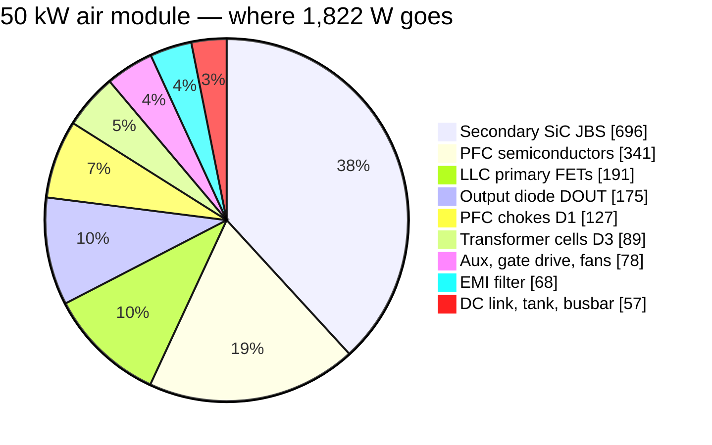
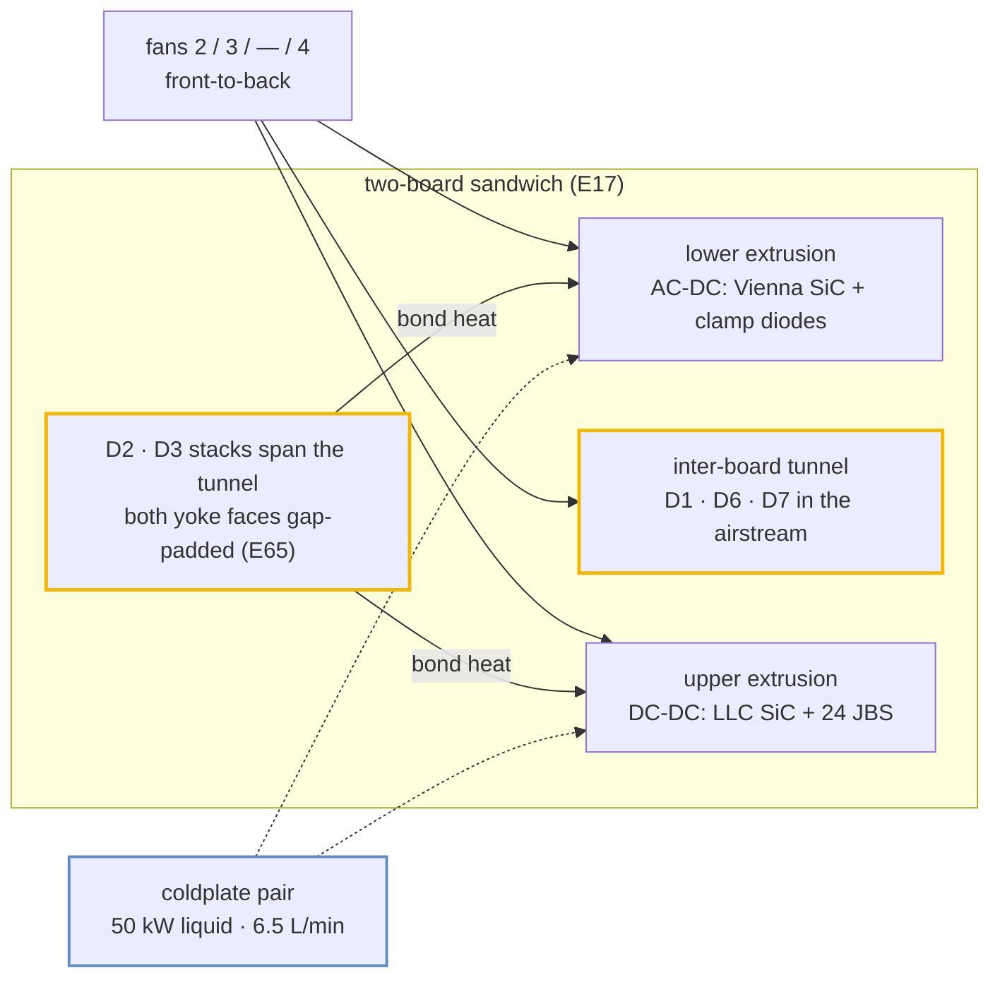
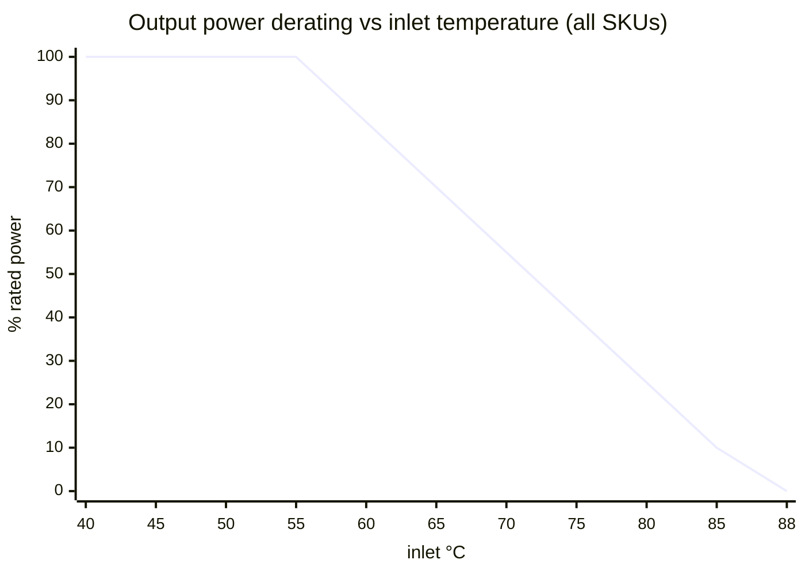

# 🌡️ Thermal Report

Where every watt goes, how it leaves the box, and the temperatures that result

  
  
  
  

> [!NOTE]
> **Purpose** — where every watt goes in the four module SKUs, how it leaves the box, and the temperatures that
> result: semiconductors, magnetics and coolant, with the derating policy.
>
> **Gate coupling** — the numbers below are copied from engine output, not hand-derived:
> `calculations/thermal/loss-budget.mjs` → `out/loss-budget.csv` · `system/envelope-grid.mjs` (Tj) ·
> `magnetics/magnetics-envelope.mjs` (D3/D2 temperatures, runaway and flux margins, bond loss) ·
> `magnetics/temp-critique.mjs` (D4/D1 equilibria, saturation at 130 °C) · `system/fault-energy.mjs` (air and
> coolant budget). Values computed from the envelope's own network, rather than printed by it, are marked
> *(network)* where they appear (§4.1–§4.3, §4.6). Change a number here only by re-running its engine. Chamber
> validation: EVT T-04 / T-23.

> [!IMPORTANT]
> **E65 magnetics re-basis.** The D3 and D2 lines now come from the `magnetics-envelope` models on the power-solved
> nominal waveform `PAR400-full` (bank 400 V, ≈150 kHz): iGSE core loss on the simulated flux plus Dowell/Sullivan
> copper, windings at 90 °C. They replace resonant-point hand values (20.5 W per D3 section, an 8 mΩ lumped trim),
> and the tank line is now D2 plus Cr film ESR (≈1.2 mΩ per phase). The LLC current stays on the E60 power-solved
> basis — **29.0 / 38.0 / 47.0 A rms** at `PAR400-full`, within 2 % of the grid's own model. The rated point is the
> efficiency basis only; the thermal corners (525 V bank, SER 250 V) are §4's.

> [!IMPORTANT]
> **E67–E69 basis, E81 corrections.** One full-bridge LLC (E67), clip-mounted dies on Al2O3 (E68a: `thermal/mount.mjs`,
> 0.8 K/W junction-to-base; on air the base is now the per-SKU air-side reference **74 / 75 / 77 °C at a 55 °C inlet**
> (`AIR_REF`, E81 F-C-2 — the earlier 70 °C sat below the outlet-air temperature the fan budget itself computes); 0.65 K/W at a
> 65 °C plate on liquid; EVT T-04 / T-38), the star-X2 EMI filter with no DM chokes (E68b), film-only output banks with the
> output diode DOUT (E67/E68c), and the right-sized PFC dies (E69a). **E81 added the two loss terms the pre-E81 ledgers lacked:**
> the LLC turn-off energy per position (k_off · V_bus · I_toff · f_sw, with k_off 3.4 / 5.3 / 4.0 nJ/(V·A) from the repo's
> double-pulse deck at the real turn-off currents with the 330 / 680 / 1000 pF C0G snubber and R_g,off 0 Ω (the snubber is bounded
> above by the weak leg's zero-voltage-switching energy window in phase shift — E81 F-L-1 — and at the phase-shift corners where
> that window does not exist the grid carries the incoming die's hard turn-on against the residual the deck reports), and I_toff calibrated on the
> power-solved decks: ≈ 1.45 · I_pk · sin φ in PFM, the tank peak on the leading leg in PSM) and the Vienna switching
> coefficient read from the same deck (22–26 nJ/(V·A) at the drawn clamp state, against the 17.4 the E3 carrier choice was made
> on). Tables §1–§3 and §4.2–§4.5 are the engines' output on that basis.

## 1. Loss budget at the rated point (400 VAC, full power, JBS secondary)

From `calculations/out/loss-budget.csv`.

| W | 30 kW | 40 kW | 50 kW liquid | 50 kW air |
|---|---:|---:|---:|---:|
| PFC semiconductors (one die per position; 20 mΩ · 15 mΩ · B3M010C075Z) | 227.6 | 303.5 | 340.9 | 340.9 |
| PFC chokes (D1) | 84.1 | 94.5 | 127.2 | 127.2 |
| DC-link ESR | 12.0 | 17.8 | 27.8 | 27.8 |
| LLC primary FETs (4 · 8 · 8 · 8 × SG2M023120LJ) | 139.9 | 125.2 | 190.6 | 190.6 |
| Transformer cells (D3 rev D, two cells) | 56.4 | 71.3 | 89.2 | 89.2 |
| Tank (D2 rev F external Lr + Cr ESR) | 11.7 | 17.5 | 23.8 | 23.8 |
| Secondary SiC JBS (16 × 40 A) | 325.7 | 492.8 | 695.8 | 695.8 |
| Output diode DOUT | 105.0 | 139.7 | 175.3 | 175.3 |
| Busbar + shunt | 1.7 | 3.1 | 4.9 | 4.9 |
| EMI filter (2 × D7 + damper) | 26.3 | 43.3 | 68.2 | 68.2 |
| Aux + gate drive | 38 | 38 | 38 | 38 |
| Fans | 20 | 20 | 0 | 40 |
| **Total** | **1,048.5** | **1,366.6** | **1,781.7** | **1,821.7** |
| **η (JBS baseline)** | **96.62 %** | **96.70 %** | **96.56 %** | **96.48 %** |
| η with a one-FET-per-position synchronous rectifier (model) | 96.29 % | 96.06 % | 95.62 % | 95.54 % |
| *E65 figure (three half-bridge sections, paralleled PFC pairs, D6 + bank electrolytics)* | *97.22 %* | *97.00 %* | *96.79 %* | *96.94 %* |

The step down from E65 is the price of the InfyPower architecture, and it was taken knowingly: the output diode alone
is 105–175 W (0.35 pt), and one full bridge per bank carries the whole bank current through each rectifier position
instead of a third of it per section. InfyPower states "> 96 %" for the REG1K0135A2; the 40 kW module is at 96.70 %.

**Peak efficiency** over the envelope (E81 grid, 475 VAC / 750–1000 V out, 50–75 % load, cold): **97.80 / 97.73 / 97.72 / 97.72 %**,
so the ≥ 97 % peak specification is met on every SKU. The grid's averaged model omits EMI-filter copper and DC-link
ESR, which at part load are worth −0.05…−0.07 pt.

**Market position:** ahead of the verified mainstream band (95.5–96.5 % peak) and at parity with the newest SiC
flagships' ≥97 % claim ([teardown benchmark](benchmark-infypower-teardown.md)).

> [!NOTE]
> **Why the JBS secondary stays.** On the E67 full bridge the synchronous-rectifier model (one 35 mΩ FET per
> position) loses **109 W more** than the JBS bridge at 30 kW, because each bridge now carries the whole bank current,
> and it still costs ₹8,670 more. `loss-budget.mjs` computes the verdict; SR is no longer a premium-η variant on this
> basis, and paralleled SR FETs would need re-costing before they are offered.

## 2. How the heat leaves the box

| SKU | Heat at rated | Face split: lower (AC-DC) / upper (DC-DC) | Cooling | Margin (`fault-energy`) |
|---|---:|---|---|---|
| 30 kW | 1,049 W | 228 / 571 W | 3 fans (E81, O-16 closed) | **1.65×** air (need 175 m³/h @ ΔT 20 K at the 55 °C inlet density vs 288) · one fan out covered |
| 40 kW | 1,367 W | 304 / 758 W | 3 fans | **1.36×** (211 vs 288) · one fan out covered |
| 50 kW liquid | 1,782 W | 341 / 1,062 W | coldplates, 0 fans | coolant ΔT **4.6 K** at 6.5 L/min 50/50 EG (≤ 5 K) |
| 50 kW air | 1,822 W | 341 / 1,062 W | 4 fans (all tachs monitored) | **1.37×** (281 vs 384) · one fan out covered |

The face split puts the PFC semiconductors on the lower extrusion and the LLC FETs, secondary JBS and DOUT on the upper
one; it counts silicon only. Since E65 the D2 and D3 stacks also bond to both faces and add their own heat
([§4.6](#46-heat-delivered-into-the-webs)). **The upper extrusion is the binding sink on every SKU.** At the 30 kW
worst continuous corner (330 VAC, full power) `loss-budget` computes 1,082 W total, of which 774 W is heatsink-mounted
silicon; at a 20 K sink-to-air rise that needs **Rth(s-a) ≤ 0.026 K/W** for the pair of extrusions. With the clip
mount the devices reach their 70 °C base basis at 55 °C inlet only if the extrusion holds that line, so the extrusion
RFQ carries it, and T-04 / T-38 measure it. The fan operating point is verified on the vendor static-pressure curve at
EVT (A8).

> [!WARNING]
> **The 30 kW airflow margin** fell from 1.45× to 1.19× as the E67 architecture added the output diode and the
> full-bridge rectifier loss, and to 1.10× once the air budget used the 55 °C inlet density it states (E81 F-C-16). The user's
> E81 decision (O-16) gives the 30 kW its third fan on the existing FAN_TACH3 / FAN_PWM2 ways: **1.65×** with n−1 covered
> (192 m³/h against a derated need of 96); the 40 kW and 50 kW-air budgets read 1.27× at the corrected density.

## 3. Junction temperatures — worst point of the 4,536-point grid

| SKU | Vienna SiC | LLC SiC | Secondary JBS | Binding corner (E81 grid: turn-off term, DPT switching coefficient, 74 / 75 / 77 °C air base) |
|---|---:|---:|---:|---|
| 30 kW | 117 °C | **149 °C** (after fold) | 92 °C | LLC at the 500 V series corner · 55 °C — the single die per position (E68, kept at E81 under the ≤ 5 % cost ceiling) |
| 40 kW | 135 °C | **149 °C** | 108 °C | LLC at the 500 V series corner · 55 °C (two dies, 680 pF snubber) |
| 50 kW liquid | **120 °C** | 135 °C | 102 °C | PFC at 285 VAC · LOW · 65 °C plate |
| 50 kW air | **147 °C** | 148 °C (after fold) | 118 °C | PFC at 285 VAC · LOW · 55 °C (k_sw 26 nJ/(V·A) as drawn; the E81 mirror clamp trims it) |

**Where the grid folds (E81, final).** The policy ceiling is **150 °C** (absolute rating 175 °C); above it the FSM derate ladder
folds power in 7 % steps. Two registered regions remain after the E81 corrections; everything else — every line, load, ambient and
output point — runs at 100 % with the worst junction at 149 / 149 / 135 / 148 °C (30 / 40 / 50 / 50-air, excluding the registered set).

| Region | 30 kW | 40 kW | 50 kW liquid | 50 kW air |
|---|---|---|---|---|
| 500 V series, full load (phase shift / high fn at the line-tracking bus floor) | 55 °C: **86 %**, 75 % at ≥ 450 VAC · 25 °C: 93 % at ≥ 450 VAC | 100 % | 100 % | 55 °C: **86 %** at ≥ 450 VAC |
| 150 V output, hot, LOW mode (30 kW only — the two-die SKUs are the F-L-1 register below) | 55 °C: **93 %** | — | — | — |

> [!WARNING]
> **F-L-1 (registered, deck-validated): the 150 V output class in continuous phase shift is NOT SUSTAINABLE on the two-die SKUs**
> (40 kW, 50 kW liquid and air) at any load or ambient. With the real output charge the weak leg cannot slew its node at that
> corner (the deck's residual is 85–95 % of the bus), and the incoming die's hard turn-on is a fixed ≈ 90–170 W per die that no
> power fold removes — a differential deck run (1 000 pF vs 100 pF snubber, fixed duty) measured the charge-replacement energy at
> 1.0–1.4 × the model now in the grid. Until the E82-1 modulation change lands (burst-PFM at low banks · reduced-frequency phase
> shift · the low-Z₀ tank of the benchmark re-read R4), **sustained delivery below ≈ 200 V on those SKUs is a documented spec
> limit** — TonHe's own TH750 floor is 200 V — and the OT ladder is the hardware guard. The 30 kW (one die, 330 pF) serves the
> corner folded at 93 %.

Every value rests on the clip-mount Rth, which EVT T-38 must confirm within +15 %, and on the air base,
which T-04 measures on both extrusions.

## 4. Magnetics — core and winding temperatures

`calculations/magnetics/magnetics-envelope.mjs` evaluates every D3 transformer and D2 trim at all 34 power-solved
corners per SKU — the 14 E60 stress corners plus the 20-point bank-voltage × load envelope, read from
`simulation-results/<sku>/llc-flux.csv` with the tank fingerprint checked — instead of at resonance. D3 flux is
volt-second pinned by the bank voltage, so its core corner is the 525 V bank at 77–84 kHz and a power derate does
not relieve it; copper peaks at the SER 250 V corners (176–189 kHz). Constructions of record:
[magnetics hub](magnetics.md) and the module magnetics pages.

> [!NOTE]
> **What E65 replaced.** The E58/E60 rows here took D3 and D2 at resonance (140 kHz; D3 108 / 90 / 109 mT) behind a
> lumped part-to-wall Rth. At the simulated 525 V-bank corners D3 flux is 1.5–2.2× that and ferrite loss 2–3×.

### 4.1 Two-node thermal network

A single part-to-wall resistance hid the two real bottlenecks: MnZn ferrite conducts only **≈ 4 W/m·K** through a
66 mm set height, and the winding reaches the core only through its former and its own build. The gate therefore
solves two nodes, core and winding, from the real geometry, with temperature-dependent loss on both, to equilibrium.
An independent network built by an E65 reviewer from the same geometry agreed within a few K. Since E67 the parts on this
network are the two D3 rev D cells and the D2 rev F external Lr (§4.2).

| Element | What it represents | Parameters (E65 basis) |
|---|---|---|
| R core→wall | Uniform loss in the ferrite column, max-point ΔT to the bonded yoke faces, plus the pads | k_Fe 4.0 W/m·K over H = 65.9 mm · both faces P·H/(8·k·2Ae) · one face P·H/(2·k·Ae), the gapped centre leg no longer conducting · pad 3.0 W/m·K, 0.5 mm per face |
| R winding→core | Conduction through the winding build, then the former in parallel with resin fill to the outer legs | VPI build k 0.6 W/m·K, both faces (dry: 0.15, inner face only) · former 1.2 mm at 0.3 W/m·K · resin 0.4 W/m·K |
| G core→air | Forced convection on the sides, unbonded yoke faces and half the core ends | h = 24·√(v/2.5) + 5 W/m²·K · v 2.0 / 2.5 / 3.2 m/s → h 26.5 / 29.0 / 32.2 (30 / 40 / 50 kW air) · sealed liquid h 5 |
| G winding→air | End turns outside the stack, unpotted parts | same h |
| G pot | Potted end turns bridged to the web or plate | 0.8 W/m·K across 5 mm |
| Wall | Extrusion web (air SKUs) or coldplate (liquid) | inlet + 5 K + 20 K × load (the §2 sink rise) · liquid 65 °C |
| Air | Tunnel air, or the sealed internal air | inlet + 10 K × load · liquid 65 °C + 45 K × load (§4.3) |
| Loss | N95 (PC95/3C95-class) sine loss × iGSE waveform factor; copper per corner | max(datasheet surface, MAS Steinmetz(T)) × 1.14 LEA-measured calibration · Cu × (1 + 0.00393·ΔT) |
| Criteria | Every part, every corner | hot-spot ≤ 125 °C at 55 °C inlet, full power · ≤ 135 °C at 75 °C inlet, derated · ≤ 155 °C at +25 % Rth · runaway margin ≥ 25 K (T_crit where dP_Fe/dT × R_core = 1, at +25 % Rth) · B̂ ≤ 50 % of Bsat at the hot temperature |

**Why one bonded face is not enough.** Core loss is generated through the whole column. Bonding both yokes halves
the conduction path and lets the full leg area (centre plus outer legs, 2·Ae) conduct. Bonding one yoke leaves the
far yoke a full 66 mm away — four times the path term — and the centre leg stops conducting across its gap, halving
the area: about **8×** in all. On a 2-set E70 (Ae 1,366 mm²) that is **0.77 K/W** two-face against
**6.07 K/W** one-face *(network)*, so the 37.3 W D3-40 core would need ≈ 29 K across the ferrite with two faces and
≈ 225 K with one. A one-face part lives on convection; §4.5 shows which parts survive that.

### 4.2 Mounting decisions per SKU

| SKU | D3 rev D transformer (two cells, primaries in series) | D2 rev F external Lr | Wall (network basis) |
|---|---|---|---|
| 30 kW | 2 × E70 per cell · 6:6∥6 · VPI · both yoke faces gap-padded to the upper and lower extrusion webs | 2 × E70 · N 5 · VPI · both faces padded · end turns potted | extrusion webs · inlet + 5 K + 20 K × load |
| 40 kW | 3 × E70 per cell · 4:4∥4 (2 foils) · VPI · both faces padded · end turns potted | 2 × E70 · N 5 · VPI · both faces padded · potted | extrusion webs |
| 50 kW liquid | 3 × E70 per cell · 4:4∥4 · VPI · both faces padded to the two coldplates · potted | 2 × E70 · N 5 · VPI · both faces padded to the plates · potted | coldplates · 65 °C |
| 50 kW air | = 50 kW liquid on the extrusion webs | = 50 kW liquid on the webs | extrusion webs |
| every SKU | 130 °C cutout on each cell | 130 °C cutout | — |

- **Two-face yoke bond.** The 66 mm stack spans the 62 mm tunnel through cut-outs in both boards, so each yoke face
  reaches its own extrusion web or coldplate. Silicone gap pads with clamp bars, CTE-compliant: no rigid epoxy to
  aluminium.
- **VPI, class H (k ≥ 0.6 W/m·K).** Impregnation fills the winding build and couples both of its faces: R winding→core
  is 0.86 K/W on D3-30 against 4.85 K/W for the same winding dry *(network)*.
- **End-turn potting** (≥ 0.8 W/m·K silicone, ≥ 5 mm bridge) gives the copper a path to the web or plate that does
  not cross the core: 1.07–1.17 W/K on the potted parts *(network)*.
- **Insulation.** A bonded face is basic insulation to the PE-bonded web or plate: a glass-reinforced insulating gap
  pad ≥ 0.5 mm with a cut-through rating above clamp pressure, and a 100 % hipot from winding to foil over the bonded
  face (2.5 kV DC on primary and mains parts, ≥ 1.5 kV DC on D3 secondaries). See
  [insulation coordination](insulation-coordination.md).

### 4.3 The sealed 50 kW liquid module — internal-air node

The liquid module is sealed and fanless (E42), but its internal air is not cool. Heat that can never reach a plate
— DC-link ESR 27.8 W, aux and gate drive 38 W, busbar and shunt 4.9 W: 70.7 W at the rated point — can leave only by
closed-cavity natural convection to the boards and through them to the plates (h ≈ 3–5 W/m²·K on ≈ 0.6 m²,
R air→plate 0.43–0.85 K/W). That holds the air at **95–125 °C** at the 60 °C coolant-inlet limit (E65 review
estimate).

The gate models it as a node at plate + 45 K × load — **110 °C at full load** — coupled to each part by still air
(h = 5 W/m²·K), with both plates at 65 °C. For the liquid SKU the two temperature columns of §4.4 are therefore full
load and 40 % load on the same plate.

> [!NOTE]
> **The air node heats a well-bonded part.** At the SER 250 V corner the D2/D3 bonds carry slightly more heat into the
> plates than the parts dissipate (§4.6). For D2 and D3 the term is small: moving the node across the whole
> 95–125 °C estimate shifts both hot-spots by under 1 K *(network)*. It is modelled rather than assumed away because
> it is the ambient of every part in the sealed box that is not plate-bonded.

### 4.4 Results — D3 and D2 at every simulated corner

From `magnetics-envelope.mjs` on the E67 excitation (`llc-flux.csv`, 32 corners per SKU, tank fingerprint checked).

| Part (mount) | R core→wall · winding→core | Core corner: B̂ · Fe | Copper corner: Cu | 55 °C inlet, full: core / winding | 75 °C inlet, derated | +25 % Rth | Runaway margin | B̂ / hot Bsat |
|---|---|---|---:|---|---:|---:|---:|---:|
| D3-30 · 2 × E70 6:6∥6 per cell (webs) | 0.77 · 0.88 K/W | 159 mT · 31.9 W | 45.8 W | 90 / **106 °C** | 102 °C | 114 °C | 116 K | 39 % |
| D2-30 · 2 × E70 N 5 (webs) | 0.77 · 0.75 K/W | 88 mT · 30.5 W | 15.1 W | **95** / 94 °C | 101 °C | 105 °C | 159 K | 21 % |
| D3-40 · 3 × E70 4:4∥4 per cell (webs, potted) | 0.52 · 0.58 K/W | 159 mT · 47.6 W | 46.1 W | 89 / **102 °C** | 103 °C | 108 °C | 115 K | 39 % |
| D2-40 · 2 × E70 N 5 (webs) | 0.77 · 0.76 K/W | 91 mT · 33.1 W | 27.3 W | 98 / **100 °C** | 102 °C | 107 °C | 158 K | 22 % |
| D3-50 liquid · 3 × E70 4:4∥4 (plates, potted) | 0.52 · 0.58 K/W | 159 mT · 47.5 W | 71.3 W | 85 / **103 °C** | 84 °C | 114 °C | 111 K | 37 % |
| D2-50 liquid · 2 × E70 N 5 (plates, potted) | 0.77 · 0.77 K/W | 90 mT · 32.8 W | 45.0 W | 94 / **98 °C** | 85 °C | 107 °C | 166 K | 22 % |
| D3-50 air · 3 × E70 4:4∥4 (webs, potted) | 0.52 · 0.58 K/W | 159 mT · 47.5 W | 71.3 W | 94 / **116 °C** | 103 °C | 127 °C | 118 K | 39 % |
| D2-50 air · 2 × E70 N 5 (webs) | 0.77 · 0.77 K/W | 90 mT · 32.8 W | 45.0 W | 102 / **109 °C** | 102 °C | 119 °C | 158 K | 22 % |
| **Limit** | | | | **≤ 125 °C** | **≤ 135 °C** | **≤ 155 °C** | **≥ 25 K** | **≤ 50 %** |

Fe and Cu are per cell (D3) or per part (D2) at 100 °C. The D3 core corner is `ENV500-55` (500 V bank, 55 % load,
≈ 87 kHz); every copper corner and every 55 °C hot-spot is `SER250-full-bus764` (≈ 203 kHz). The gate also rejects the
E65 section transformer in this one-bridge cell duty on every SKU (hot-spot 131–169 °C), so the control group can fail.

- **Derated corner.** At 75 °C inlet the air-SKU web runs 8 K warmer and full-load copper falls to 16 %, but iron
  does not derate. Every D3 is then bound by its 525 V-bank core corner, and the iron-heavy 40 kW parts run hotter
  derated than at full power (D3-40 104 °C, D2-40 97 °C).
- **Control group.** The gate rejects every E60 D3 as registered: 30 kW 3×PQ50 in air 153 °C / runaway at 75 °C
  (Fe 30.5 W at 197 mT); 40 kW 2×E70 in air 131 °C / runaway; 50 kW 2×E70 runaway on one plate face (Fe 78.8 W at
  237 mT) and in air (78.6 W at 236 mT).
- **Saturation at the cutout temperature** (`temp-critique`). The worst D3 flux, 176 mT, is 49 % of Bsat(130 °C) =
  362 mT; D2 fault flux at the F.11 kill is 130 / 121 / 134 / 135 mT against the 217 mT line (60 % of Bsat).

### 4.5 Bond loss and the 130 °C cutout loop

A delaminated gap pad is the credible single failure of a bonded part. The gate re-runs every part with one face
lost (both webs → one web, both plates → one plate) against the same limits:

| Part | One pad lost: 55 °C / 75 °C / +25 % Rth | Verdict |
|---|---|---|
| D3-30 | 110 / 115 / 126 °C | **not survivable** — runaway margin below 25 K |
| D2-30 | 106 / 112 / 122 °C | survives |
| D3-40 | 106 / 118 / 133 °C | **not survivable** |
| D2-40 | 114 / 115 / 129 °C | survives |
| D3-50 liquid | 133 / 124 °C / runaway | **not survivable** |
| D2-50 liquid | 161 / 111 °C / runaway | **not survivable** |
| D3-50 air | 124 / 117 / 139 °C | survives |
| D2-50 air | 120 / 114 / 139 °C | survives |

> [!IMPORTANT]
> **E67: a lost bond is screened, not survived.** The taller E67 cells carry more iron per part, so D3 at 30 / 40 / 50 kW
> and D2 on the liquid plate no longer survive a lost face. The gate therefore makes the **EOL bonded thermal soak
> mandatory** ([DFM](dfm-production.md)) so a bad bond never ships, and the 130 °C cutout loop below stays the field cover.

With one face gone the core's conduction resistance rises about eightfold (§4.1), and dP_Fe/dT × R_core approaches 1.
The E67 D3 cells carry 32–48 W of iron each, so on the air webs they lose their runaway margin, and on the sealed
liquid plate both D3 and D2 run away at +25 % Rth because the still internal air cannot take over the lost face. The
50 kW air parts survive on the remaining face and the tunnel air.

**The cover:** three NC hermetic snap-action thermostats, **130 ± 5 °C**, gold dry-circuit contacts, reinforced-insulated
case and leads — one on each D3 cell and one on D2 (six on the E65 sections), wired in series with the T_XFMR NTC. The
EOL bonded thermal soak keeps a bad bond from shipping; the loop covers a bond that fails in the field. It is fitted
on every SKU.

An open thermostat, or a broken NTC lead, pulls the channel to the rail. The HAL passes every NTC zone through
`pmp_ntc_guard_c()` (`fsm.h`: `PMP_NTC_OPEN_FRAC` 0.98, `PMP_NTC_OPEN_C` 150 °C) before taking the zone maximum, so
an open loop reports 150 °C and latches **F.22** instead of reading "very cold". A healthy 10 k B3435 NTC behind its
10 k pull-up reads ≤ 0.96 of Vref at −40 °C, so the threshold never trips on a cold sensor. `host_sim` proves both
cases. OT thresholds: [protection thresholds](protection-thresholds.md), row 22.

The cutout's lower tolerance edge, 125 °C, sits above every intact part at every corner on the nominal network (worst
116 °C, D3-50 air at 55 °C inlet), so it does not nuisance-trip. At +25 % Rth the D3-50 air cell reaches 127 °C, so a
degraded bond on that SKU can open the loop at the hottest corner — the intended response to a degraded bond; and at a 130 °C core the parts are still far from
saturation (§4.4).

### 4.6 Heat delivered into the webs

> [!WARNING]
> **E65 basis — not yet restated for the E67 parts.** The table below was computed for the three E65 sections. The
> E67 D3 cells and D2 dissipate more per part at their corners (§4.4), and the network does not print its wall heat
> yet, so read these rises as a lower bound until `magnetics-envelope` reports the E67 bond heat.

Bonding moves D2/D3 heat out of the tunnel air and into the extrusions, so it is part of the upper and lower
extrusion budgets. Heat through R core→wall plus the potting, at the worst coincident corner (`SER250-full-tolLo`,
55 °C inlet, full load) *(network)*:

| SKU | Into webs or plates, per module (3 sections × D3 + D2) | D3 + D2 loss at that corner (100 °C basis) | Per face | Upper-face rise at the §2 basis | Upper-face Rth(s-a) for a 20 K rise: silicon only → with bond heat |
|---|---:|---:|---:|---:|---|
| 30 kW | 62 W | 147 W | ≈ 31 W | +1.4 K | 0.045 → 0.042 K/W |
| 40 kW | 123 W | 195 W | ≈ 62 W | +1.8 K | 0.030 → 0.027 K/W |
| 50 kW liquid | 284 W | 273 W | ≈ 142 W | — | coolant ΔT 4.7 K already counts every watt |
| 50 kW air | 172 W | 272 W | ≈ 86 W | +2.1 K | 0.024 → 0.022 K/W |

The split per face assumes both faces at the same web temperature; if the lower web runs cooler, more heat goes
down, which favours the binding upper face. On the liquid SKU the plates take more than the parts dissipate, because
the 110 °C internal air feeds heat through the parts (§4.3).

> [!IMPORTANT]
> **The rise is small, but the extrusion basis must carry it.** On the upper face +1.4–2.1 K sits inside the 5 K
> that the envelope's web basis (inlet + 5 K + 20 K × load) carries above the §2 sink rise, so the magnetics results
> stand. It is not free for the silicon: §2's Rth(s-a) is a silicon-only requirement, and the 50 kW air JBS already
> sits at 149 °C against the 150 °C policy ceiling (§3). The extrusion RFQ therefore takes the right-hand column; the
> lower face takes the same watts against less silicon, so bond heat is a larger share of its rise. On the liquid SKU
> the plate RFQ must know that ≈ 142 W per plate enters at the magnetics footprint, not under the silicon. T-04
> measures both webs with the magnetics bonded.

### 4.7 D4 and D1 — E58 basis

| Part | Hot equilibrium (55 °C inlet, full / 75 °C inlet, derated) | Runaway margin | Copper basis |
|---|---|---|---|
| D4 rev E · ETD44 aux | 76 / 79 °C | 121 K | — |
| D1 · Kool Mµ stacks | ΔT ≤ 45 K acceptance (Cu 28 / 26 / 38 W) | powder core, µ tempco ≤ ±3 % | 9× / 13× 1.6 mm bundles |

All ferrite parts sit near the material's loss minimum (~80–100 °C). The loss slope is negative below it, so a
cold start self-warms toward the minimum instead of running away. Details: the
[magnetics hub](magnetics.md#failure-modes-and-what-closes-each).

## 5. Corners and failures

| Case | Result |
|---|---|
| −30 °C cold start (A11 rev C, E60 competitor parity) | Rds low, losses −18 %; electrolytic ESR ×2.5 (cans now −40 °C category) → precharge + 60 s soft power limit of 50 % below −10 °C (FW-R3); ferrite Fe 2.05× but cores self-warm (§4.7); IP55 fans rated −30 °C; chamber proof T-32 |
| +55 °C inlet | full power; grid Tj ≤ 139 °C with no folds (E68a clip mount) |
| +65 °C inlet | derate to 70 % |
| +75 °C inlet | derate to 40 % — D3/D2 are solved here with copper at 40 % load and iron undiminished, because flux follows bank voltage (§4.4) |
| Blocked filter (50 %) | airflow −30 % → treated as +8 °C inlet penalty; the firmware ΔT sink-inlet estimator shifts the derate curve left |
| One fan failed | derate 50 % (F.25); `fault-energy` proves n−1 airflow ≥ the derated need on every air SKU |
| Fan degradation −20 % | +4 °C sink, inside margin |
| Coolant flow lost (50 kW liquid) | plate-NTC dry-run ladder → derate → trip; cart-side flow assurance is a system item |
| One D2/D3 gap pad lost | D3 at 30 / 40 / 50 kW liquid and D2-50 liquid lose their runaway margin → screened by the EOL bonded thermal soak; in the field the series 130 °C cutout opens → 150 °C reported → F.22 (§4.5); the 50 kW air parts survive on the remaining face |
| Coolant near the dew point (50 kW liquid) | not permitted: coolant inlet ≥ enclosure-air dew point + 3 K whenever energised — a cooling-cart requirement at the charger level (E42/A13 boundary) |

Derating: 100 % ≤ 55 °C → linear → 40 % at 75 °C → 0 at 88 °C (fault). Data `calculations/out/derating.csv`,
plot `simulation-results/30kw/plots/derating-curve.svg`.

## 6. Open — hardware only

| Item | Test |
|---|---|
| Calorimetric η at the rated point per SKU (closes the ±0.2 pt model band) | T-03 |
| Clip-mount junction-to-base Rth within +15 % of `mount.mjs` (every Tj above rests on it) | T-38 |
| Output diode DOUT case temperature at rated current | T-36 |
| Chamber: grid hot corners, fold behaviour, fan-fail derate | T-04 · T-23 |
| Tunnel back-pressure with the 50 kW magnetics set (CFD or instrumented) | T-04 |
| First-article winding Rac and ΔT at the class current | T-31 |
| Bonded D2/D3 against §4.4 with both yoke faces padded; both web temperatures with the set bonded (§4.6); 50 kW liquid internal air against the 110 °C node | T-04 · T-31 |
| Bond durability type test: ≥ 500 cycles −40 ↔ +135 °C or ≥ 3,000 power cycles (joint resistance change ≤ 10 %, AL/Lm ±3 %, hipot pass); thermal-shock screen upper temperature ≥ 135 °C | first article |
| Cutout loop: each thermostat opened in turn reports 150 °C and latches F.22 | bring-up |
| TIM process spec (phase-change pad, 0.5 K·cm²/W class) in the DFM flow | DFM |

---

<a href="current-coordination.md">← Current & Protection Coordination</a> &nbsp;·&nbsp; <a href="README.md">🧭 Documentation hub</a> &nbsp;·&nbsp; <a href="insulation-coordination.md">Insulation Coordination →</a>

Vectivolt DC-Modules · documentation rev E81 · every number reproduces with <code>sh calculations/run-all.sh</code>

