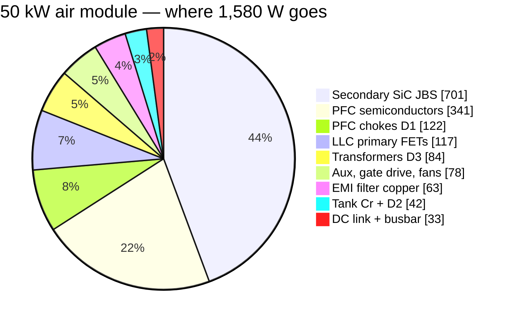
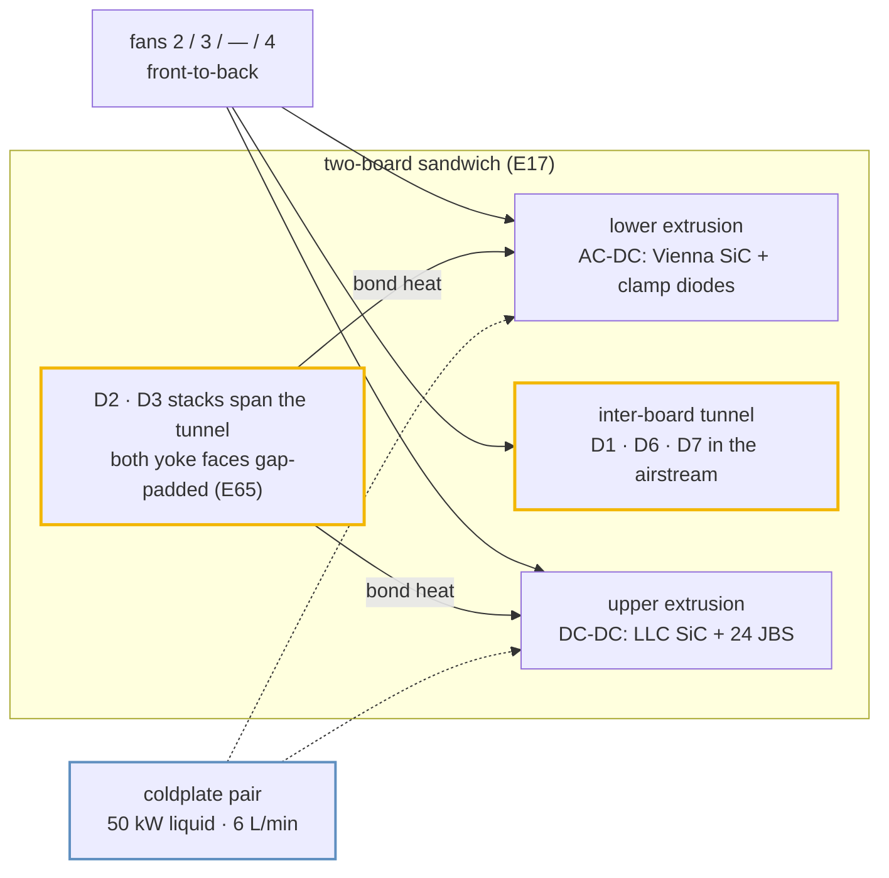
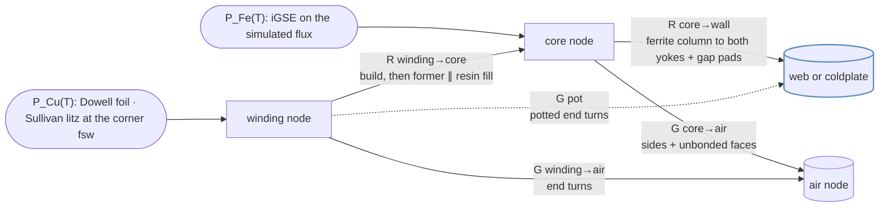
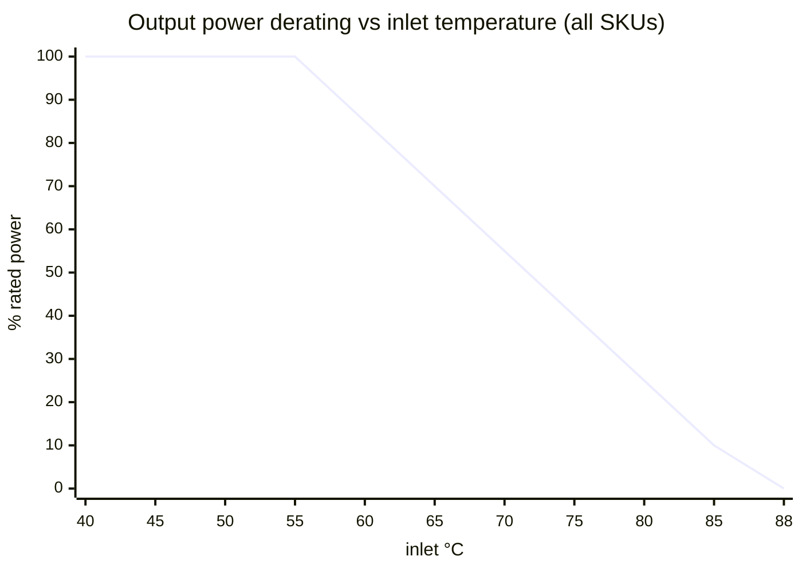

# 🌡️ Thermal Report

Where every watt goes, how it leaves the box, and the temperatures that result

  
  
  
  

> [!NOTE]
> **Purpose** — where every watt goes in the four module SKUs, how it leaves the box, and the temperatures that
> result: semiconductors, magnetics and coolant, with the derating policy.
>
> **Gate coupling** — the numbers below are copied from engine output, not hand-derived:
> `calculations/thermal/loss-budget.mjs` → `out/loss-budget.csv` · `system/envelope-grid.mjs` (Tj) ·
> `magnetics/magnetics-envelope.mjs` (D3/D2 temperatures, runaway and flux margins, bond loss) ·
> `magnetics/temp-critique.mjs` (D4/D1 equilibria, saturation at 130 °C) · `system/fault-energy.mjs` (air and
> coolant budget). Values computed from the envelope's own network, rather than printed by it, are marked
> *(network)* where they appear (§4.1–§4.3, §4.6). Change a number here only by re-running its engine. Chamber
> validation: EVT T-04 / T-23.

> [!IMPORTANT]
> **E65 magnetics re-basis.** The D3 and D2 lines now come from the `magnetics-envelope` models on the power-solved
> nominal waveform `PAR400-full` (bank 400 V, ≈150 kHz): iGSE core loss on the simulated flux plus Dowell/Sullivan
> copper, windings at 90 °C. They replace resonant-point hand values (20.5 W per D3 section, an 8 mΩ lumped trim),
> and the tank line is now D2 plus Cr film ESR (≈1.2 mΩ per phase). The LLC current stays on the E60 power-solved
> basis — **29.0 / 38.0 / 47.0 A rms** at `PAR400-full`, within 2 % of the grid's own model. The rated point is the
> efficiency basis only; the thermal corners (525 V bank, SER 250 V) are §4's.

## 1. Loss budget at the rated point (400 VAC, full power, JBS secondary)

| W | 30 kW | 40 kW | 50 kW liquid | 50 kW air |
|---|---:|---:|---:|---:|
| PFC semiconductors | 158.4 | 242.0 | 340.9 | 340.9 |
| PFC chokes (D1) | 75.2 | 98.5 | 121.8 | 121.8 |
| DC-link ESR | 12.0 | 17.8 | 27.8 | 27.8 |
| LLC primary FETs | 88.3 | 151.6 | 231.9 | 116.5 (paralleled) |
| Transformers (D3, 3 sections) | **53.5** | **72.7** | **85.1** | **83.9** |
| Tank (Cr + D2 trim) | **21.0** | **29.2** | **41.9** | **42.3** |
| Secondary SiC JBS | 360.4 | 520.6 | 701.0 | 701.0 |
| Busbar + shunt | 1.7 | 3.1 | 4.9 | 4.9 |
| EMI filter copper (D6 + D7) | 30.2 | 43.8 | 62.7 | 62.7 |
| Aux + gate drive | 38 | 38 | 38 | 38 |
| Fans | 20 | 20 | 0 | 40 |
| **Total** | **858.7** | **1,237.3** | **1,656.1** | **1,579.8** |
| **η (JBS baseline)** | **97.22 %** | **97.00 %** | **96.79 %** | **96.94 %** |
| η with synchronous rectification (premium variant) | 97.89 % | 97.62 % | 97.36 % | 97.50 % |
| *E60 figure (resonant-point D3/D2 values)* | *97.19 %* | *96.92 %* | *96.68 %* | *96.82 %* |

> [!NOTE]
> **Pending restatement.** The PFC-choke (D1) line still carries its registered copper model. The D1
> high-frequency copper correction restates that line, and with it the totals and η above.

**Peak efficiency** over the envelope (grid, half load, 475 VAC / 525 V): **98.45 / 98.49 / 98.46 / 98.58 %**, so the
≥97 % peak specification is met on every SKU. The grid's averaged model omits EMI-filter copper and DC-link ESR,
which at half load are worth −0.05…−0.07 pt.

**Market position:** ahead of the verified mainstream band (95.5–96.5 % peak) and at parity with the newest SiC
flagships' ≥97 % claim ([`competitive-benchmark-e51.md`](competitive-benchmark-e51.md)).

> [!NOTE]
> **Why the JBS secondary stays** (decision unchanged): SR saves 214 W at 30 kW but costs ₹8,670 of extra BOM against
> a ₹5,981 thermal credit at ₹28/W marginal cooling. SR becomes net-positive above ₹41/W, and remains the qualified
> premium-η variant.

## 2. How the heat leaves the box

| SKU | Heat at rated | Face split: lower (AC-DC) / upper (DC-DC) | Cooling | Margin (`fault-energy`) |
|---|---:|---|---|---|
| 30 kW | 859 W | 158 / 449 W | 2 fans | **1.45×** air (need 133 m³/h @ ΔT 20 K vs 192) · one fan out covered |
| 40 kW | 1,237 W | 242 / 672 W | 3 fans | **1.51×** (191 vs 288) · one fan out covered |
| 50 kW liquid | 1,656 W | 341 / 933 W | coldplates, 0 fans | coolant ΔT **4.7 K** at 6 L/min 50/50 EG (≤ 5 K) |
| 50 kW air | 1,580 W | 341 / 818 W | 4 fans (all tachs monitored) | **1.57×** (244 vs 384) · one fan out covered |

The face split puts PFC semiconductors on the lower extrusion and LLC FETs plus secondary JBS on the upper one; it
counts silicon only. Since E65 the D2 and D3 stacks also bond to both faces and add their own heat
([§4.6](#46-heat-delivered-into-the-webs)). **The upper extrusion is the binding sink on every SKU.** At the 30 kW worst continuous corner (330 VAC, full power) the engine computes 947 W total, of which 652 W is
heatsink-mounted silicon. Split across the two faces at a 20 K sink-to-air rise, that needs **Rth(s-a) ≤ 0.045 K/W**
on the upper face and ≤ 0.098 K/W on the lower — a silicon-only requirement; §4.6 gives the bond-heat adder. The fan
operating point is verified on the vendor static-pressure curve at EVT (A8).

## 3. Junction temperatures — worst point of the 5,544-point grid

| SKU | Vienna SiC (at 285 VAC, 400 V, hot) | LLC SiC | Secondary JBS | Binding corner → action |
|---|---:|---:|---:|---|
| 30 kW | 139 °C | **144 °C** | 109 °C | LLC at 475 VAC · SER 500 V · PS · hot → one 93 % fold |
| 40 kW | 107 °C | **150 °C** | 114 °C | LLC at 285 VAC · SER 500 V · hot → 93 % fold |
| 50 kW liquid | 94 °C | **148 °C** | 106 °C | LLC at 475 VAC · SER 500 V · PS → 93 % fold |
| 50 kW air | 122 °C | 115 °C | **149 °C** | JBS at 330 VAC · SER 500 V · hot → 93 % fold (JBS joined the fold loop at E60) |

**The SER 500 V hysteresis band binds every SKU.** Banks sit at 250 V there, so they carry twice the PAR current for
the same output voltage. Policy ceiling is **150 °C** (absolute rating 175 °C). Any point above the ceiling folds
power in 7 % steps. The folds are commercial derating rows, not failures, and are listed in `envelope-grid.csv`.

## 4. Magnetics — core and winding temperatures

`calculations/magnetics/magnetics-envelope.mjs` evaluates every D3 transformer and D2 trim at all 34 power-solved
corners per SKU — the 14 E60 stress corners plus the 20-point bank-voltage × load envelope, read from
`simulation-results/<sku>/llc-flux.csv` with the tank fingerprint checked — instead of at resonance. D3 flux is
volt-second pinned by the bank voltage, so its core corner is the 525 V bank at 77–84 kHz and a power derate does
not relieve it; copper peaks at the SER 250 V corners (176–189 kHz). Constructions of record:
[magnetics](magnetics.md) · [manufacturing pack](magnetics-manufacturing-pack.md).

> [!NOTE]
> **What E65 replaced.** The E58/E60 rows here took D3 and D2 at resonance (140 kHz; D3 108 / 90 / 109 mT) behind a
> lumped part-to-wall Rth. At the simulated 525 V-bank corners D3 flux is 1.5–2.2× that and ferrite loss 2–3×.

### 4.1 Two-node thermal network

A single part-to-wall resistance hid the two real bottlenecks: MnZn ferrite conducts only **≈ 4 W/m·K** through a
66 mm set height, and the winding reaches the core only through its former and its own build. The gate therefore
solves two nodes, core and winding, from the real geometry, with temperature-dependent loss on both, to equilibrium.
An independent network built by an E65 reviewer from the same geometry agreed within a few K.

| Element | What it represents | Parameters (E65 basis) |
|---|---|---|
| R core→wall | Uniform loss in the ferrite column, max-point ΔT to the bonded yoke faces, plus the pads | k_Fe 4.0 W/m·K over H = 65.9 mm · both faces P·H/(8·k·2Ae) · one face P·H/(2·k·Ae), the gapped centre leg no longer conducting · pad 3.0 W/m·K, 0.5 mm per face |
| R winding→core | Conduction through the winding build, then the former in parallel with resin fill to the outer legs | VPI build k 0.6 W/m·K, both faces (dry: 0.15, inner face only) · former 1.2 mm at 0.3 W/m·K · resin 0.4 W/m·K |
| G core→air | Forced convection on the sides, unbonded yoke faces and half the core ends | h = 24·√(v/2.5) + 5 W/m²·K · v 2.0 / 2.5 / 3.2 m/s → h 26.5 / 29.0 / 32.2 (30 / 40 / 50 kW air) · sealed liquid h 5 |
| G winding→air | End turns outside the stack, unpotted parts | same h |
| G pot | Potted end turns bridged to the web or plate | 0.8 W/m·K across 5 mm |
| Wall | Extrusion web (air SKUs) or coldplate (liquid) | inlet + 5 K + 20 K × load (the §2 sink rise) · liquid 65 °C |
| Air | Tunnel air, or the sealed internal air | inlet + 10 K × load · liquid 65 °C + 45 K × load (§4.3) |
| Loss | N95 (PC95/3C95-class) sine loss × iGSE waveform factor; copper per corner | max(datasheet surface, MAS Steinmetz(T)) × 1.14 LEA-measured calibration · Cu × (1 + 0.00393·ΔT) |
| Criteria | Every part, every corner | hot-spot ≤ 125 °C at 55 °C inlet, full power · ≤ 135 °C at 75 °C inlet, derated · ≤ 155 °C at +25 % Rth · runaway margin ≥ 25 K (T_crit where dP_Fe/dT × R_core = 1, at +25 % Rth) · B̂ ≤ 50 % of Bsat at the hot temperature |

**Why one bonded face is not enough.** Core loss is generated through the whole column. Bonding both yokes halves
the conduction path and lets the full leg area (centre plus outer legs, 2·Ae) conduct. Bonding one yoke leaves the
far yoke a full 66 mm away — four times the path term — and the centre leg stops conducting across its gap, halving
the area: about **8×** in all. On a 2-set E70 (Ae 1,366 mm²) that is **0.77 K/W** two-face against
**6.07 K/W** one-face *(network)*, so the 37.3 W D3-40 core would need ≈ 29 K across the ferrite with two faces and
≈ 225 K with one. A one-face part lives on convection; §4.5 shows which parts survive that.

### 4.2 Mounting decisions per SKU

| SKU | D3 transformer | D2 trim | Wall (network basis) |
|---|---|---|---|
| 30 kW | 2×E70 7:7:7 · VPI · both yoke faces gap-padded to the upper and lower extrusion webs | 1×E70 N 8 · VPI · both faces padded | extrusion webs · inlet + 5 K + 20 K × load |
| 40 kW | 2×E70 6:6:6 · VPI · both faces padded · end turns potted to the web | 2×E70 N 5 · VPI · both faces padded | extrusion webs |
| 50 kW liquid | 3×E70 5:5:5 · VPI · both faces padded to the two coldplates · end turns potted | 2×E70 N 5 · VPI · both faces padded to the plates · end turns potted | coldplates · 65 °C |
| 50 kW air | 3×E70 5:5:5 · VPI · both faces padded · end turns potted to the web | 2×E70 N 5 · VPI · both faces padded | extrusion webs |
| every SKU | 130 °C cutout on each section (§4.5) | 130 °C cutout on each section | — |

- **Two-face yoke bond.** The 66 mm stack spans the 62 mm tunnel through cut-outs in both boards, so each yoke face
  reaches its own extrusion web or coldplate. Silicone gap pads with clamp bars, CTE-compliant: no rigid epoxy to
  aluminium.
- **VPI, class H (k ≥ 0.6 W/m·K).** Impregnation fills the winding build and couples both of its faces: R winding→core
  is 0.86 K/W on D3-30 against 4.85 K/W for the same winding dry *(network)*.
- **End-turn potting** (≥ 0.8 W/m·K silicone, ≥ 5 mm bridge) gives the copper a path to the web or plate that does
  not cross the core: 1.07–1.17 W/K on the potted parts *(network)*.
- **Insulation.** A bonded face is basic insulation to the PE-bonded web or plate: a glass-reinforced insulating gap
  pad ≥ 0.5 mm with a cut-through rating above clamp pressure, and a 100 % hipot from winding to foil over the bonded
  face (2.5 kV DC on primary and mains parts, ≥ 1.5 kV DC on D3 secondaries). See
  [insulation coordination](insulation-coordination.md).

### 4.3 The sealed 50 kW liquid module — internal-air node

The liquid module is sealed and fanless (E42), but its internal air is not cool. Heat that can never reach a plate
— DC-link ESR 27.8 W, aux and gate drive 38 W, busbar and shunt 4.9 W: 70.7 W at the rated point — can leave only by
closed-cavity natural convection to the boards and through them to the plates (h ≈ 3–5 W/m²·K on ≈ 0.6 m²,
R air→plate 0.43–0.85 K/W). That holds the air at **95–125 °C** at the 60 °C coolant-inlet limit (E65 review
estimate).

The gate models it as a node at plate + 45 K × load — **110 °C at full load** — coupled to each part by still air
(h = 5 W/m²·K), with both plates at 65 °C. For the liquid SKU the two temperature columns of §4.4 are therefore full
load and 40 % load on the same plate.

> [!NOTE]
> **The air node heats a well-bonded part.** At the SER 250 V corner the D2/D3 bonds carry slightly more heat into the
> plates than the parts dissipate (§4.6). For D2 and D3 the term is small: moving the node across the whole
> 95–125 °C estimate shifts both hot-spots by under 1 K *(network)*. It is modelled rather than assumed away because
> it is the ambient of every part in the sealed box that is not plate-bonded.

### 4.4 Results — D3 and D2 at every simulated corner

| Part (mount) | R core→wall · winding→core | Core corner: B̂ · Fe | Copper corner: Cu | 55 °C inlet, full: core / winding | 75 °C inlet, 40 % | +25 % Rth | Runaway margin | B̂ / hot Bsat |
|---|---|---|---:|---|---:|---:|---:|---:|
| D3-30 · 2×E70 7:7:7 (webs) | 0.77 · 0.86 K/W | 142 mT · 22.3 W | 23.9 W | 89 / **104 °C** | 99 °C | 113 °C | 161 K | 34 % |
| D2-30 · 1×E70 N 8 (webs) | 1.55 · 1.52 K/W | 81 mT · 11.5 W | 10.6 W | 93 / **99 °C** | 97 °C | 106 °C | 163 K | 21 % |
| D3-40 · 2×E70 6:6:6 (webs, potted) | 0.77 · 0.88 K/W | 176 mT · 37.3 W | 31.5 W | 86 / **97 °C** | 104 °C | 108 °C | 98 K | 44 % |
| D2-40 · 2×E70 N 5 (webs) | 0.77 · 0.75 K/W | 80 mT · 19.7 W | 9.8 W | 91 / **93 °C** | 97 °C | 99 °C | 163 K | 21 % |
| D3-50 liquid · 3×E70 5:5:5 (plates, potted) | 0.52 · 0.58 K/W | 158 mT · 38 W | 45.7 W | 78 / **89 °C** | 80 °C | 95 °C | 139 K | 36 % |
| D2-50 liquid · 2×E70 N 5 (plates, potted) | 0.77 · 0.75 K/W | 91 mT · 26.3 W | 14.9 W | **84** / 81 °C | 81 °C | 89 °C | 176 K | 24 % |
| D3-50 air · 3×E70 5:5:5 (webs, potted) | 0.52 · 0.58 K/W | 157 mT · 37.9 W | 45.7 W | 87 / **101 °C** | 99 °C | 107 °C | 154 K | 38 % |
| D2-50 air · 2×E70 N 5 (webs) | 0.77 · 0.75 K/W | 91 mT · 26.3 W | 14.9 W | 96 / **101 °C** | 100 °C | 108 °C | 160 K | 24 % |
| **Limit** | | | | **≤ 125 °C** | **≤ 135 °C** | **≤ 155 °C** | **≥ 25 K** | **≤ 50 %** |

Fe and Cu are per section at 100 °C. The D3 core corner is the 525 V bank: `ENV525-55` (83.6 kHz) at 30 kW and
`PAR525-full-gainWorst` (76.8–79.7 kHz) at 40 and 50 kW. Every D2 core corner, every copper corner and every 55 °C
hot-spot is `SER250-full-tolLo`. D2 flux is taken at the bin-max inductance (6.8 / 6.3 / 5.8 µH).

- **Derated corner.** At 75 °C inlet the air-SKU web runs 8 K warmer and full-load copper falls to 16 %, but iron
  does not derate. Every D3 is then bound by its 525 V-bank core corner, and the iron-heavy 40 kW parts run hotter
  derated than at full power (D3-40 104 °C, D2-40 97 °C).
- **Control group.** The gate rejects every E60 D3 as registered: 30 kW 3×PQ50 in air 153 °C / runaway at 75 °C
  (Fe 30.5 W at 197 mT); 40 kW 2×E70 in air 131 °C / runaway; 50 kW 2×E70 runaway on one plate face (Fe 78.8 W at
  237 mT) and in air (78.6 W at 236 mT).
- **Saturation at the cutout temperature** (`temp-critique`). The worst D3 flux, 176 mT, is 49 % of Bsat(130 °C) =
  362 mT; D2 fault flux at the F.11 kill is 130 / 121 / 134 / 135 mT against the 217 mT line (60 % of Bsat).

### 4.5 Bond loss and the 130 °C cutout loop

A delaminated gap pad is the credible single failure of a bonded part. The gate re-runs every part with one face
lost (both webs → one web, both plates → one plate) against the same limits:

| Part | One pad lost: 55 °C / 75 °C / +25 % Rth | Verdict |
|---|---|---|
| D3-30 | 115 / 113 / 130 °C | survives |
| D2-30 | 109 / 105 / 124 °C | survives |
| D3-40 | 108 / 118 / 133 °C | **needs the loop** — runaway margin below 25 K |
| D2-40 | 103 / 106 / 115 °C | survives |
| D3-50 liquid | 118 / 106 °C / runaway | **needs the loop** |
| D2-50 liquid | 110 / 98 / 125 °C | **needs the loop** — runaway margin below 25 K |
| D3-50 air | 104 / 108 / 115 °C | survives |
| D2-50 air | 115 / 113 / 135 °C | survives |

On D3-40 and D2-50 liquid the temperatures stay inside the limits and the runaway margin fails: with one face gone
the core's conduction resistance rises about eightfold (§4.1), and dP_Fe/dT × R_core approaches 1. D3-50 liquid runs
away outright at +25 % Rth, because the still internal air cannot take over the lost face. The other parts survive
on the remaining face and the tunnel air.

**The cover:** six NC hermetic snap-action thermostats, **130 ± 5 °C**, gold dry-circuit contacts, reinforced-insulated
case and leads — one on every D3 and D2 section, wired in series with the T_XFMR NTC. The gate requires the loop on
the 40 kW and 50 kW liquid SKUs; it is fitted on every SKU.

An open thermostat, or a broken NTC lead, pulls the channel to the rail. The HAL passes every NTC zone through
`pmp_ntc_guard_c()` (`fsm.h`: `PMP_NTC_OPEN_FRAC` 0.98, `PMP_NTC_OPEN_C` 150 °C) before taking the zone maximum, so
an open loop reports 150 °C and latches **F.22** instead of reading "very cold". A healthy 10 k B3435 NTC behind its
10 k pull-up reads ≤ 0.96 of Vref at −40 °C, so the threshold never trips on a cold sensor. `host_sim` proves both
cases. OT thresholds: [protection thresholds](protection-thresholds.md), row 22.

The cutout's lower tolerance edge, 125 °C, sits above every intact part at every corner (worst 104 °C at 55 °C
inlet, 113 °C at +25 % Rth), so it does not nuisance-trip; and at a 130 °C core the parts are still far from
saturation (§4.4).

### 4.6 Heat delivered into the webs

Bonding moves D2/D3 heat out of the tunnel air and into the extrusions, so it is part of the upper and lower
extrusion budgets. Heat through R core→wall plus the potting, at the worst coincident corner (`SER250-full-tolLo`,
55 °C inlet, full load) *(network)*:

| SKU | Into webs or plates, per module (3 sections × D3 + D2) | D3 + D2 loss at that corner (100 °C basis) | Per face | Upper-face rise at the §2 basis | Upper-face Rth(s-a) for a 20 K rise: silicon only → with bond heat |
|---|---:|---:|---:|---:|---|
| 30 kW | 62 W | 147 W | ≈ 31 W | +1.4 K | 0.045 → 0.042 K/W |
| 40 kW | 123 W | 195 W | ≈ 62 W | +1.8 K | 0.030 → 0.027 K/W |
| 50 kW liquid | 284 W | 273 W | ≈ 142 W | — | coolant ΔT 4.7 K already counts every watt |
| 50 kW air | 172 W | 272 W | ≈ 86 W | +2.1 K | 0.024 → 0.022 K/W |

The split per face assumes both faces at the same web temperature; if the lower web runs cooler, more heat goes
down, which favours the binding upper face. On the liquid SKU the plates take more than the parts dissipate, because
the 110 °C internal air feeds heat through the parts (§4.3).

> [!IMPORTANT]
> **The rise is small, but the extrusion basis must carry it.** On the upper face +1.4–2.1 K sits inside the 5 K
> that the envelope's web basis (inlet + 5 K + 20 K × load) carries above the §2 sink rise, so the magnetics results
> stand. It is not free for the silicon: §2's Rth(s-a) is a silicon-only requirement, and the 50 kW air JBS already
> sits at 149 °C against the 150 °C policy ceiling (§3). The extrusion RFQ therefore takes the right-hand column; the
> lower face takes the same watts against less silicon, so bond heat is a larger share of its rise. On the liquid SKU
> the plate RFQ must know that ≈ 142 W per plate enters at the magnetics footprint, not under the silicon. T-04
> measures both webs with the magnetics bonded.

### 4.7 D4 and D1 — E58 basis

| Part | Hot equilibrium (55 °C inlet, full / 75 °C inlet, derated) | Runaway margin | Copper basis |
|---|---|---|---|
| D4 · ETD39 aux | 78 / 81 °C | ≥ 119 K | — |
| D1 · Kool Mµ stacks | ΔT ≤ 45 K acceptance (Cu 28 / 26 / 38 W) | powder core, µ tempco ≤ ±3 % | 9× / 13× 1.6 mm bundles |

All ferrite parts sit near the material's loss minimum (~80–100 °C). The loss slope is negative below it, so a
cold start self-warms toward the minimum instead of running away. Details:
[`magnetics-fmea-e58.md`](magnetics-fmea-e58.md) · [`conductor-selection.md`](conductor-selection.md).

## 5. Corners and failures

| Case | Result |
|---|---|
| −30 °C cold start (A11 rev C, E60 competitor parity) | Rds low, losses −18 %; electrolytic ESR ×2.5 (cans now −40 °C category) → precharge + 60 s soft power limit of 50 % below −10 °C (FW-R3); ferrite Fe 2.05× but cores self-warm (§4.7); IP55 fans rated −30 °C; chamber proof T-32 |
| +55 °C inlet | full power; grid Tj ≤ 150 °C with computed folds only in the hot SER/PS bands |
| +65 °C inlet | derate to 70 % |
| +75 °C inlet | derate to 40 % — D3/D2 are solved here with copper at 40 % load and iron undiminished, because flux follows bank voltage (§4.4) |
| Blocked filter (50 %) | airflow −30 % → treated as +8 °C inlet penalty; the firmware ΔT sink-inlet estimator shifts the derate curve left |
| One fan failed | derate 50 % (F.25); `fault-energy` proves n−1 airflow ≥ the derated need on every air SKU |
| Fan degradation −20 % | +4 °C sink, inside margin |
| Coolant flow lost (50 kW liquid) | plate-NTC dry-run ladder → derate → trip; cart-side flow assurance is a system item |
| One D2/D3 gap pad lost | D3-40, D3-50 liquid and D2-50 liquid lose their runaway margin → the series 130 °C cutout opens → 150 °C reported → F.22 (§4.5); every other part survives on the remaining face |
| Coolant near the dew point (50 kW liquid) | not permitted: coolant inlet ≥ enclosure-air dew point + 3 K whenever energised — a cooling-cart requirement at the charger level (E42/A13 boundary) |

Derating: 100 % ≤ 55 °C → linear → 40 % at 75 °C → 0 at 88 °C (fault). Data `calculations/out/derating.csv`,
plot `simulation-results/30kw/plots/derating-curve.svg`.

## 6. Open — hardware only

| Item | Test |
|---|---|
| Calorimetric η at the rated point per SKU (closes the ±0.2 pt model band) | T-03 |
| Chamber: grid hot corners, fold behaviour, fan-fail derate | T-04 · T-23 |
| Tunnel back-pressure with the 50 kW magnetics set (CFD or instrumented) | T-04 |
| First-article winding Rac and ΔT at the class current | T-31 |
| Bonded D2/D3 against §4.4 with both yoke faces padded; both web temperatures with the set bonded (§4.6); 50 kW liquid internal air against the 110 °C node | T-04 · T-31 |
| Bond durability type test: ≥ 500 cycles −40 ↔ +135 °C or ≥ 3,000 power cycles (joint resistance change ≤ 10 %, AL/Lm ±3 %, hipot pass); thermal-shock screen upper temperature ≥ 135 °C | first article |
| Cutout loop: each thermostat opened in turn reports 150 °C and latches F.22 | bring-up |
| TIM process spec (phase-change pad, 0.5 K·cm²/W class) in the DFM flow | DFM |

---

## Revision history (dated deltas, kept for provenance)

Rev C (2026-09-05) and rev D (2026-09-05, R2 re-audit) — single-board 30/60/120 kW era

- **Rev C:** LLC node snubbers deleted (E28), removing a silent ≈45 W/leg heat source. Vienna snubber re-sized
  (100 pF / 2 W → 0.86 W actual per phase). Clamp bleeder 470 Ω moved to 5 W axial. Aux stage E26 at ≈11 W in the aux
  corner. Per-phase film caps reduce electrolytic ripple heating.
- **Rev D:** EMI-filter losses budgeted for the first time (R2 HR-18). The 3.3 V rail became sync bucks at ≈0.4 W each;
  the deleted LDO would have dissipated 2.9–4.1 W. Aux rev C 110 W. Resonant burdens moved to 1 W 2512 (CB-16).
  Balance/star resistors split 2-series (HR-20). Bank bleeders are pulse duty only (E33).
- The 60/120 kW single-board columns of that era are retired (E40/E50). Products above 50 kW are multi-module
  (E55: 100 kW = 2 × 50, 150 kW = 3 × 50; the CSU was deleted at E66).

---

<a href="current-coordination.md">← Current & Protection Coordination</a> &nbsp;·&nbsp; <a href="README.md">🧭 Documentation hub</a> &nbsp;·&nbsp; <a href="insulation-coordination.md">Insulation Coordination →</a>

Vectivolt DC-Modules · documentation rev E61 · every number reproduces with <code>sh calculations/run-all.sh</code>

