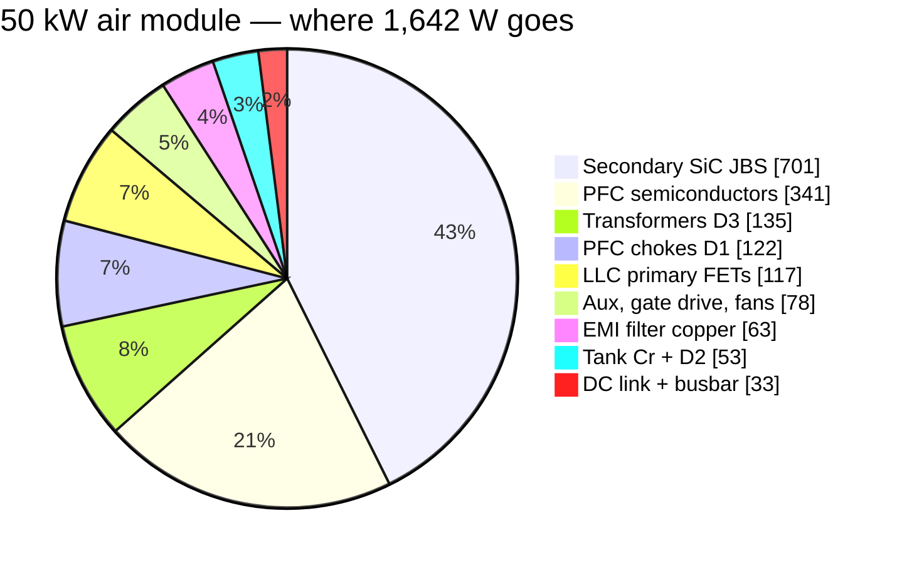
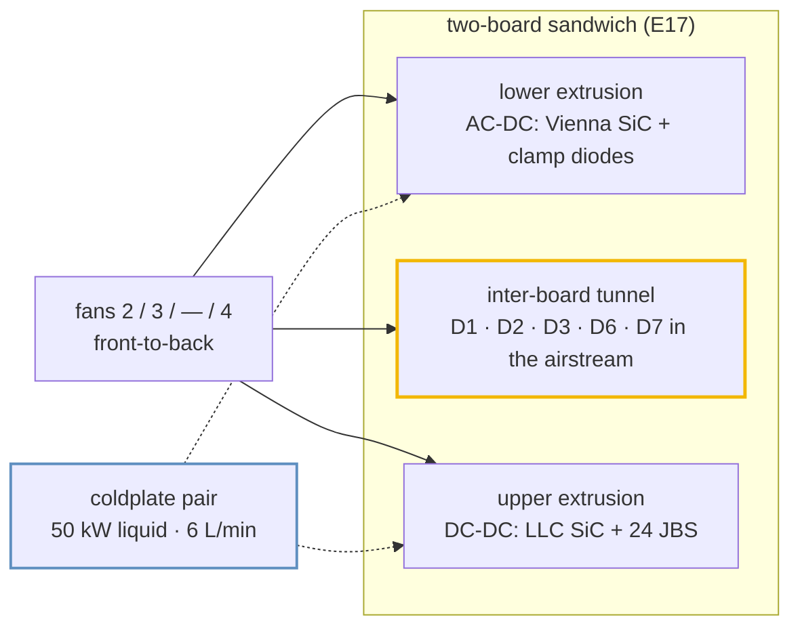
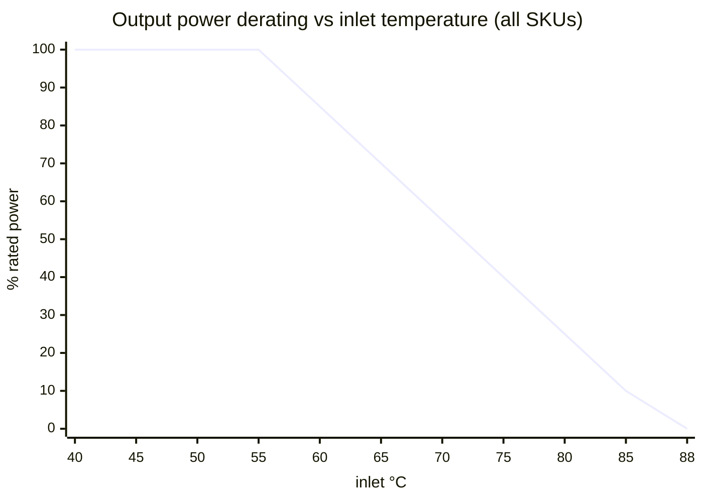

# 🌡️ Thermal Report

Where every watt goes, how it leaves the box, and the temperatures that result

  
  
  
  

> [!NOTE]
> **Purpose** — where every watt goes in the four module SKUs, how it leaves the box, and the temperatures that
> result: semiconductors, magnetics and coolant, with the derating policy.
>
> **Gate coupling** — the numbers below are copied from engine output, not hand-derived:
> `calculations/thermal/loss-budget.mjs` → `out/loss-budget.csv` · `system/envelope-grid.mjs` (Tj) ·
> `magnetics/temp-critique.mjs` (core equilibria) · `system/fault-energy.mjs` (air and coolant budget).
> Change a number here only by re-running its engine. Chamber validation: EVT T-04 / T-23.

> [!IMPORTANT]
> **E60 re-basis.** The loss budget's LLC current (23.3 A × k) came from the LLC deck that E60 withdrew (no body
> diodes). It now reads the power-solved nominal corner `PAR400-full` (bank 400 V, bus 830) from
> `simulation-results/<sku>/llc-stress.csv`: **29.0 / 38.0 / 47.0 A rms**. The envelope grid's own model reads
> 29.2 / 38.5 / 47.8 A at the same point, so two independent models agree within 2 %. LLC-primary and tank losses rise
> by the square of that ratio; nothing else in the budget moved.

## 1. Loss budget at the rated point (400 VAC, full power, JBS secondary)

| W | 30 kW | 40 kW | 50 kW liquid | 50 kW air |
|---|---:|---:|---:|---:|
| PFC semiconductors | 158.4 | 242.0 | 340.9 | 340.9 |
| PFC chokes (D1) | 75.2 | 98.5 | 121.8 | 121.8 |
| DC-link ESR | 12.0 | 17.8 | 27.8 | 27.8 |
| LLC primary FETs | **88.3** | **151.6** | **231.9** | **116.5** (paralleled) |
| Transformers (D3, 3 sections) | 61.5 | 102.9 | 135.3 | 135.3 |
| Tank (Cr + D2 trim) | **20.2** | **34.7** | **53.0** | **53.2** |
| Secondary SiC JBS | 360.4 | 520.6 | 701.0 | 701.0 |
| Busbar + shunt | 1.7 | 3.1 | 4.9 | 4.9 |
| EMI filter copper (D6 + D7) | 30.2 | 43.8 | 62.7 | 62.7 |
| Aux + gate drive | 38 | 38 | 38 | 38 |
| Fans | 20 | 20 | 0 | 40 |
| **Total** | **865.9** | **1,273.0** | **1,717.4** | **1,642.1** |
| **η (JBS baseline)** | **97.19 %** | **96.92 %** | **96.68 %** | **96.82 %** |
| η with synchronous rectification (premium variant) | 97.87 % | 97.54 % | 97.24 % | 97.38 % |
| *pre-E60 figure (withdrawn LLC current)* | *97.32 %* | *97.06 %* | *96.85 %* | *96.92 %* |

**Peak efficiency** over the envelope (grid, half load, 475 VAC / 525 V): **98.45 / 98.49 / 98.46 / 98.58 %**, so the
≥97 % peak specification is met on every SKU. The grid's averaged model omits EMI-filter copper and DC-link ESR,
which at half load are worth −0.05…−0.07 pt.

**Market position:** ahead of the verified mainstream band (95.5–96.5 % peak) and at parity with the newest SiC
flagships' ≥97 % claim ([`competitive-benchmark-e51.md`](competitive-benchmark-e51.md)).

> [!NOTE]
> **Why the JBS secondary stays** (decision unchanged): SR saves 214 W at 30 kW but costs ₹8,670 of extra BOM against
> a ₹5,981 thermal credit at ₹28/W marginal cooling. SR becomes net-positive above ₹41/W, and remains the qualified
> premium-η variant.

## 2. How the heat leaves the box

| SKU | Heat at rated | Face split: lower (AC-DC) / upper (DC-DC) | Cooling | Margin (`fault-energy`) |
|---|---:|---|---|---|
| 30 kW | 866 W | 158 / 449 W | 2 fans | **1.44×** air (need 134 m³/h @ ΔT 20 K vs 192) · one fan out covered |
| 40 kW | 1,273 W | 242 / 672 W | 3 fans | **1.47×** (197 vs 288) · one fan out covered |
| 50 kW liquid | 1,717 W | 341 / 933 W | coldplates, 0 fans | coolant ΔT **4.8 K** at 6 L/min 50/50 EG (≤ 5 K) |
| 50 kW air | 1,642 W | 341 / 818 W | 4 fans (all tachs monitored) | **1.51×** (254 vs 384) · one fan out covered |

The face split puts PFC semiconductors on the lower extrusion and LLC FETs plus secondary JBS on the upper one;
magnetics and filter copper are airstream-borne. **The upper extrusion is the binding sink on every SKU.** At the
30 kW worst continuous corner (330 VAC, full power) the engine computes 954 W total, of which 652 W is
heatsink-mounted silicon. Split across the two faces at a 20 K sink-to-air rise, that needs **Rth(s-a) ≤ 0.045 K/W**
on the upper face and ≤ 0.098 K/W on the lower. The fan operating point is verified on the vendor static-pressure
curve at EVT (A8).

## 3. Junction temperatures — worst point of the 5,544-point grid

| SKU | Vienna SiC (at 285 VAC, 400 V, hot) | LLC SiC | Secondary JBS | Binding corner → action |
|---|---:|---:|---:|---|
| 30 kW | 139 °C | **144 °C** | 109 °C | LLC at 475 VAC · SER 500 V · PS · hot → one 93 % fold |
| 40 kW | 107 °C | **150 °C** | 114 °C | LLC at 285 VAC · SER 500 V · hot → 93 % fold |
| 50 kW liquid | 94 °C | **148 °C** | 106 °C | LLC at 475 VAC · SER 500 V · PS → 93 % fold |
| 50 kW air | 122 °C | 115 °C | **149 °C** | JBS at 330 VAC · SER 500 V · hot → 93 % fold (JBS joined the fold loop at E60) |

**The SER 500 V hysteresis band binds every SKU.** Banks sit at 250 V there, so they carry twice the PAR current for
the same output voltage. Policy ceiling is **150 °C** (absolute rating 175 °C). Any point above the ceiling folds
power in 7 % steps. The folds are commercial derating rows, not failures, and are listed in `envelope-grid.csv`.

## 4. Magnetics — hot equilibria on measured 3C95 surfaces (E58 method, E60 copper)

| Part | Hot equilibrium (55 °C inlet, full / 75 °C inlet, derated) | Runaway margin | Copper basis |
|---|---|---|---|
| D3-30 · 3× PQ50 | **102 / 99 °C** | ≥ 98 K | 0.10 mm foil + 0.071 mm litz |
| D3-40 · 2× E70 | **107 / 93 °C** | ≥ 93 K | 0.127 mm foil + 0.071 mm litz |
| D3-50 · 2× E70 | **106 / 97 °C** | ≥ 94 K | 0.127 mm foil + 0.071 mm litz |
| D2-30 · 2× PQ50 N4 | 83 / 96 °C | ≥ 104 K | 1350 × 0.1 litz |
| D2-40 · 1× E70 N5 | 85 / 91 °C | ≥ 109 K | 4150 × 0.071 litz |
| D2-50 · 2× E70 N3 | 79 / 90 °C | ≥ 110 K | 2500 × 0.1 litz |
| D4 · ETD39 aux | 78 / 81 °C | ≥ 119 K | — |
| D1 · Kool Mµ stacks | ΔT ≤ 45 K acceptance (Cu 28 / 26 / 38 W) | powder core, µ tempco ≤ ±3 % | 9× / 13× 1.6 mm bundles |

All ferrite parts sit near the material's loss minimum (~80–100 °C). The loss slope is negative below it, so a
cold start self-warms toward the minimum instead of running away. Details:
[`magnetics-fmea-e58.md`](magnetics-fmea-e58.md) · [`conductor-selection.md`](conductor-selection.md).

## 5. Corners and failures

| Case | Result |
|---|---|
| −30 °C cold start (A11 rev C, E60 competitor parity) | Rds low, losses −18 %; electrolytic ESR ×2.5 (cans now −40 °C category) → precharge + 60 s soft power limit of 50 % below −10 °C (FW-R3); ferrite Fe 2.05× but cores self-warm (§4); IP55 fans rated −30 °C; chamber proof T-32 |
| +55 °C inlet | full power; grid Tj ≤ 150 °C with computed folds only in the hot SER/PS bands |
| +65 °C inlet | derate to 70 % |
| +75 °C inlet | derate to 40 % — the E58/E60 magnetics equilibria are solved at this corner |
| Blocked filter (50 %) | airflow −30 % → treated as +8 °C inlet penalty; the firmware ΔT sink-inlet estimator shifts the derate curve left |
| One fan failed | derate 50 % (F.25); `fault-energy` proves n−1 airflow ≥ the derated need on every air SKU |
| Fan degradation −20 % | +4 °C sink, inside margin |
| Coolant flow lost (50 kW liquid) | plate-NTC dry-run ladder → derate → trip; cart-side flow assurance is a system item |

Derating: 100 % ≤ 55 °C → linear → 40 % at 75 °C → 0 at 88 °C (fault). Data `calculations/out/derating.csv`,
plot `simulation-results/30kw/plots/derating-curve.svg`.

## 6. Open — hardware only

| Item | Test |
|---|---|
| Calorimetric η at the rated point per SKU (closes the ±0.2 pt model band) | T-03 |
| Chamber: grid hot corners, fold behaviour, fan-fail derate | T-04 · T-23 |
| Tunnel back-pressure with the 50 kW magnetics set (CFD or instrumented) | T-04 |
| First-article winding Rac and ΔT at the class current | T-31 |
| TIM process spec (phase-change pad, 0.5 K·cm²/W class) in the DFM flow | DFM |

---

## Revision history (dated deltas, kept for provenance)

Rev C (2026-09-05) and rev D (2026-09-05, R2 re-audit) — single-board 30/60/120 kW era

- **Rev C:** LLC node snubbers deleted (E28), removing a silent ≈45 W/leg heat source. Vienna snubber re-sized
  (100 pF / 2 W → 0.86 W actual per phase). Clamp bleeder 470 Ω moved to 5 W axial. Aux stage E26 at ≈11 W in the aux
  corner. Per-phase film caps reduce electrolytic ripple heating.
- **Rev D:** EMI-filter losses budgeted for the first time (R2 HR-18). The 3.3 V rail became sync bucks at ≈0.4 W each;
  the deleted LDO would have dissipated 2.9–4.1 W. Aux rev C 110 W. Resonant burdens moved to 1 W 2512 (CB-16).
  Balance/star resistors split 2-series (HR-20). Bank bleeders are pulse duty only (E33).
- The 60/120 kW single-board columns of that era are retired (E40/E50). Products above 50 kW are multi-module
  (E55: 100 kW = 2 × 50, 150 kW = 3 × 50 + CSU).

---

<a href="current-coordination.md">← Current & Protection Coordination</a> &nbsp;·&nbsp; <a href="README.md">🧭 Documentation hub</a> &nbsp;·&nbsp; <a href="insulation-coordination.md">Insulation Coordination →</a>

Vectivolt DC-Modules · documentation rev E61 · every number reproduces with <code>sh calculations/run-all.sh</code>

