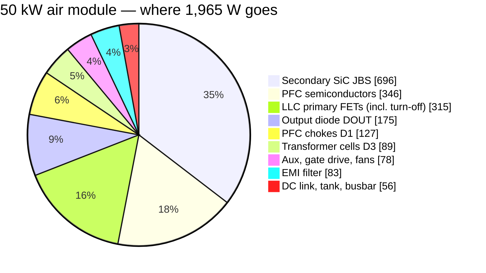
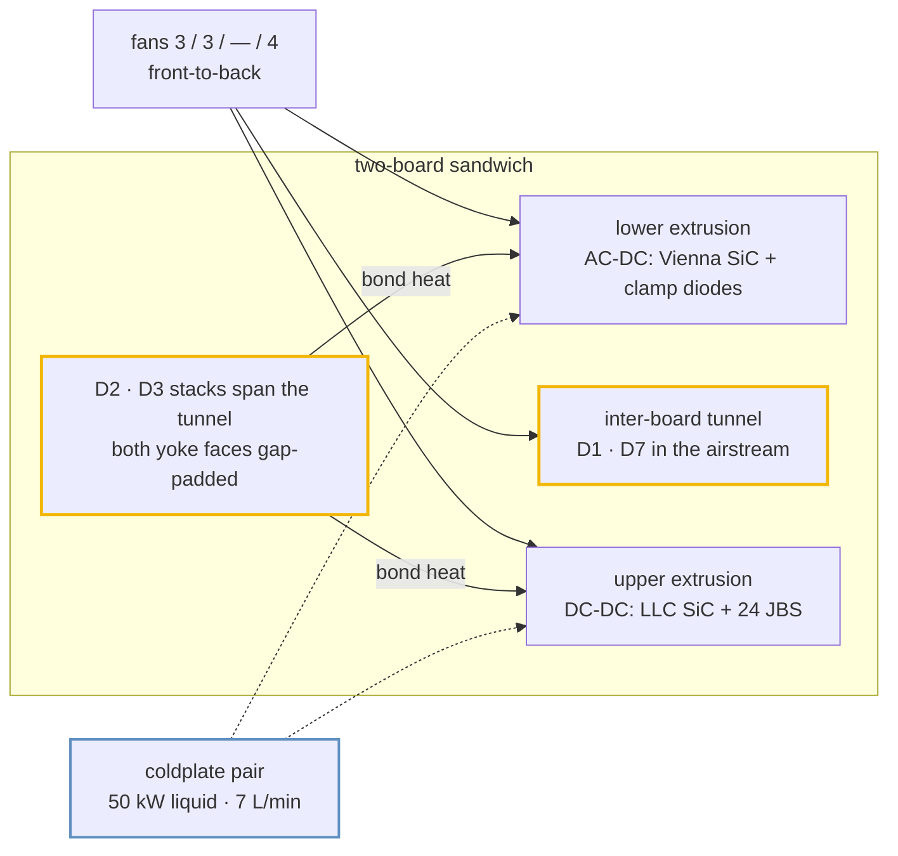
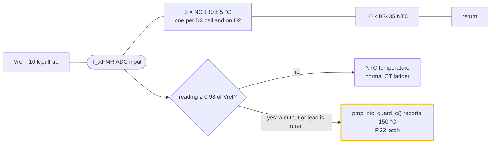
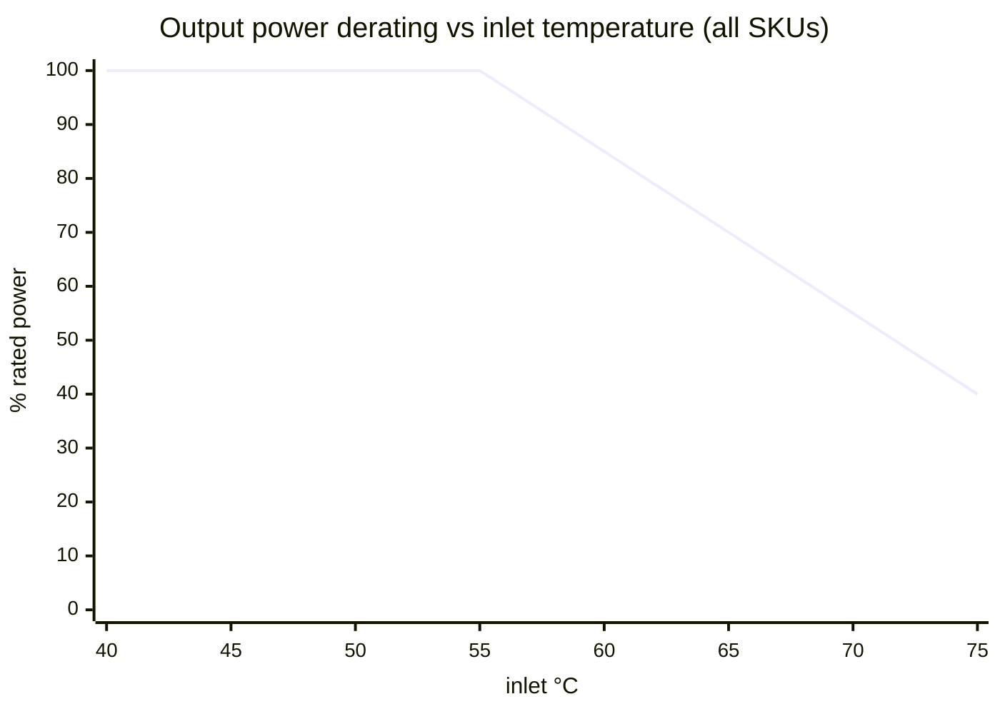

# 🌡️ Thermal Report

Where every watt goes, how it leaves the box, and the temperatures that result

  
  
  
  

> [!NOTE]
> **Purpose** — where every watt goes in the four module SKUs, how it leaves the box, and the temperatures that
> result: semiconductors, magnetics and coolant, with the derating policy.
>
> **Gate coupling** — the numbers below are copied from engine output, not hand-derived:
> `calculations/thermal/loss-budget.mjs` → `out/loss-budget.csv` · `system/envelope-grid.mjs` (Tj) ·
> `magnetics/magnetics-envelope.mjs` (D3/D2 temperatures, runaway and flux margins, bond loss) ·
> `magnetics/temp-critique.mjs` (D4/D1 equilibria, saturation at 130 °C) · `system/fault-energy.mjs` (air and
> coolant budget). Values computed from the envelope's own network, rather than printed by it, are marked
> *(network)* where they appear. Change a number here only by re-running its engine. Chamber validation:
> EVT T-04 / T-23.

> [!IMPORTANT]
> **What the ledger is built on.** One full-bridge LLC with clip-mounted dies on Al₂O₃ (`thermal/mount.mjs`,
> 0.8 K/W junction-to-base; on air the base is the per-SKU air-side reference **74 / 75 / 77 °C at a 55 °C inlet**,
> which is where the fan budget's own outlet-air temperature lands; 0.65 K/W at a 65 °C plate on liquid), the star-X2
> EMI filter, film-only output banks behind the output diode DOUT, and one right-sized PFC die per position. The
> ledger carries the LLC turn-off energy per position (k_off · V_bus · I_toff · f_sw, k_off 3.4 / 5.3 / 4.0 nJ/(V·A)
> from the repo's double-pulse deck at the real turn-off currents with the 330 / 680 / 1000 pF C0G snubber and
> R_g,off 0 Ω, and I_toff calibrated on the power-solved decks: ≈ 1.45 · I_pk · sin φ in PFM, the tank peak on the
> leading leg in phase shift) and the Vienna switching coefficient read per SKU from the same deck's final rows —
> **18.1 / 19.4 / 18.9 nJ/(V·A)**, the mean of the clamped and unclamped half-cycles. The D3 and D2 lines come from
> the `magnetics-envelope` models on the power-solved waveforms — iGSE core loss on the simulated flux plus
> Dowell/Sullivan copper, windings at 90 °C — and the tank line is D2 plus Cr film ESR (≈ 1.2 mΩ per phase).

## At a glance

| | 30 kW | 40 kW | 50 kW liquid | 50 kW air |
|---|---:|---:|---:|---:|
| **Loss at the rated point** | 1,127 W | 1,519 W | 1,925 W | 1,965 W |
| **η at 400 VAC, full power** | **96.38 %** | **96.34 %** | **96.29 %** | **96.22 %** |
| **Peak η** over the envelope | 97.78 % | 97.84 % | 97.80 % | 97.79 % |
| **Cooling** | air · 3 fans | air · 3 fans | 2 coldplates · 0 fans | air · 4 fans |
| **Airflow margin** at the 55 °C inlet density | **1.54×** | 1.14× | coolant ΔT 4.7 K | 1.17× |
| **Worst LLC Tj** on the grid, folds applied | **150 °C** | 145 °C | 139 °C | **150 °C** |
| **Worst Vienna Tj** on the grid, folds applied | 128 °C | **149 °C** | 130 °C | **149 °C** |
| **Grid** | every point passes — **no FAIL row anywhere** (§3) | | | |

## 1. Loss budget at the rated point (400 VAC, full power, JBS secondary)

From `calculations/out/loss-budget.csv`.

| W | 30 kW | 40 kW | 50 kW liquid | 50 kW air |
|---|---:|---:|---:|---:|
| PFC semiconductors (one die per position; 20 mΩ · 15 mΩ · B3M010C075Z) — incl. the measured switching share (× 1.04 / 1.12 / 1.09) | 229.0 | 308.5 | 345.7 | 345.7 |
| PFC chokes (D1) | 83.9 | 94.5 | 127.2 | 127.2 |
| DC-link ESR | 12.0 | 17.8 | 27.8 | 27.8 |
| LLC primary FETs (4 · 8 · 8 · 8 × SG2M023120LJ) — conduction + turn-off (140 + 66 · 124 + 136 · 193 + 122 W) | 206.3 | 260.6 | 315.0 | 315.0 |
| Transformer cells (D3, two cells) | 56.4 | 71.5 | 88.9 | 88.9 |
| Tank (D2 external Lr + Cr ESR) | 11.3 | 16.9 | 23.4 | 23.4 |
| Secondary SiC JBS (16 × 40 A) | 325.7 | 492.8 | 695.8 | 695.8 |
| Output diode DOUT | 105.0 | 139.7 | 175.3 | 175.3 |
| Busbar + shunt | 1.7 | 3.1 | 4.9 | 4.9 |
| EMI filter (2 × D7 + the Rd–Cd damper as drawn) | 27.7 | 45.7 | 82.9 | 82.9 |
| Aux + gate drive | 38 | 38 | 38 | 38 |
| Fans | 30 | 30 | 0 | 40 |
| **Total** | **1,127.0** | **1,519.1** | **1,924.9** | **1,964.9** |
| **η (JBS baseline)** | **96.38 %** | **96.34 %** | **96.29 %** | **96.22 %** |
| η with a one-FET-per-position synchronous rectifier (model) | 96.04 % | 95.71 % | 95.36 % | 95.28 % |

The efficiency is the price of the full-bridge architecture, and it was taken knowingly: the output diode alone is
105–175 W (0.35 pt), and one full bridge per bank carries the whole bank current through every rectifier position in
its path. InfyPower states "> 96 %" for the REG1K0135A2; the 40 kW module is at 96.34 % with the turn-off and
switching terms in the ledger.

**Peak efficiency** over the envelope (475 VAC, 1000 V out in series, 75–100 % load, cold): **97.78 / 97.84 / 97.80 /
97.79 %**, so the ≥ 97 % peak specification is met on every SKU. The grid's averaged model omits EMI-filter copper and
DC-link ESR, which at part load are worth −0.05…−0.07 pt.

**Market position:** ahead of the verified mainstream band (95.5–96.5 % peak) and at parity with the newest SiC
flagships' ≥ 97 % claim ([teardown benchmark](benchmark-infypower-teardown.md)).

> [!NOTE]
> **Why the JBS secondary stays.** On this full bridge a synchronous-rectifier secondary (one 35 mΩ FET per
> position) loses **109 W more** than the JBS bridge at 30 kW, because each bridge carries the whole bank current,
> and it still costs ₹8,670 more. `loss-budget.mjs` computes the verdict, so SR is not a premium-η variant on this
> basis; paralleled SR FETs would need re-costing before they are offered.

## 2. How the heat leaves the box

| SKU | Heat at rated | Face split: lower (AC-DC) / upper (DC-DC) | Cooling | Margin (`fault-energy`) |
|---|---:|---|---|---|
| 30 kW | 1,127 W | 229 / 637 W | 3 fans | **1.54×** air at the 55 °C inlet density (need 188 of 288 m³/h) · one fan out covered (derate 0.5): 192 against a derated need of 84 |
| 40 kW | 1,519 W | 309 / 893 W | 3 fans | **1.14×** (need 253 of 288) · one fan out (derate 0.5): 192 against 114 |
| 50 kW liquid | 1,925 W | 346 / 1,186 W | coldplates, 0 fans | coolant ΔT **4.7 K** at 7 L/min 50/50 EG (≤ 5 K) |
| 50 kW air | 1,965 W | 346 / 1,186 W | 4 fans (all tachs monitored) | **1.17×** (need 327 of 384) · one fan out (derate 0.6): 288 against 180 |

The acceptance line is 1.10× at the 55 °C inlet density, with n−1 covering the derated need — that is why the 30 kW
carries three fans rather than two. Module air rise at the delivered flow is 13 / 17.5 / — / 16.9 K.

The face split puts the PFC semiconductors on the lower extrusion and the LLC FETs, secondary JBS and DOUT on the
upper one; it counts silicon only. The D2 and D3 stacks also bond to both faces and add their own heat
([§4.6](#46-heat-delivered-into-the-webs)). **The upper extrusion is the binding sink on every SKU.** At the 30 kW
worst continuous corner (330 VAC, full power) `loss-budget` computes **≈ 1,148 W** total, of which **≈ 840 W** is
heatsink-mounted silicon; at a 20 K sink-to-air rise that needs **Rth(s-a) ≤ 0.024 K/W** for the pair of extrusions.
The dies reach their air-side base (74 / 75 / 77 °C at a 55 °C inlet) only if the extrusion holds that line, so the
extrusion RFQ carries it and T-04 / T-38 measure it. The fan operating point is verified on the vendor
static-pressure curve at EVT.

## 3. Junction temperatures — the worst point of the grid

| SKU | Vienna SiC | LLC SiC | Secondary JBS | Binding corner |
|---|---:|---:|---:|---|
| 30 kW | 128 °C | **150 °C** (after fold) | 90 °C | LLC at 200 V parallel · 450 VAC · 55 °C, folded 93 % — one die per position; the Vienna worst is 285 VAC on the 830 V link at full load |
| 40 kW | **149 °C** | 145 °C (after fold) | 108 °C | Vienna at 300 VAC on the 830 V link · 55 °C, full load and unfolded; LLC at the 500 V series corner · 475 VAC, folded 93 % |
| 50 kW liquid | **130 °C** | 139 °C | 102 °C | PFC at 285 VAC · 400 V parallel · 65 °C plate — **no fold anywhere on this SKU** |
| 50 kW air | **149 °C** (after fold) | **150 °C** (after fold) | 118 °C | LLC at the 500 V series corner · 450 VAC · 55 °C, folded 86 %; Vienna at 300 VAC on the 830 V link, folded 93 % |

The grid is evaluated per SKU over line, output voltage, mode, load and ambient, with the per-die weak-leg turn-on
term, the Vienna modulation-index term and the datasheet R_DS(on) slope.

**Where the grid folds.** The policy ceiling is **150 °C** (absolute rating 175 °C); above it the derate ladder folds
power in 7 % steps, and `hal/dielim.c` implements that against a junction *observer* rather than the heatsink NTC
(below). **Every point of the grid passes.** All four regions below are **full load**; everything not listed runs at
100 %.

| Region | 30 kW | 40 kW | 50 kW liquid | 50 kW air |
|---|---|---|---|---|
| 500 V series, hot (phase shift / high fn at the line-tracking bus floor) | 55 °C: **93 %** at 285 VAC, 86 % at 300, 80 % at 330–400, **75 %** at 450–475 · 25 °C: 93 % at 450–475 VAC | 55 °C: **93 %** at 450–475 VAC | 100 % | 55 °C: **93 %** at 330–400 VAC, 86 % at 450, **80 %** at 475 |
| LOW-mode output 150 / 200 / 250 / 300 V, hot | 55 °C: **93 %** at 150 / 200 V (86 % at 475 VAC) · 250 V 93 % to 400 VAC, 86 % at 450–475 · 300 V 93 % at 475 VAC only | 100 % | 100 % | 55 °C, 150 V: **93 %** to 400 VAC, 86 % at 450, **80 %** at 475 |
| Low line on the 830 V link — the Vienna die | 100 % | 55 °C: **93 %** at 285 VAC, output 400 / 500 V parallel and 1000 V series | 100 % | 55 °C: **86 %** at 285 VAC (93 % at 750 V series) and **93 %** at 300–330 VAC, output ≥ 400 V parallel / ≥ 750 V series |
| 25 °C ambient | 500 V series at 450–475 VAC: 93 % | 100 % | 100 % | 100 % |

> [!IMPORTANT]
> **The weak leg is why the deep phase-shift corners fold, and the observer is why they are survivable.** In deep
> phase shift the zero state ends with the rectifier conducting, so leg A — the leg whose edges *end* that state —
> does not commutate on the magnetising current: it swings on the decayed tank current through L_r alone, reaches its
> valley in about a quarter period and swings **back**. Its dead time must therefore be short and valley-timed:
> `hal/llc.c weak_dead_s()` programs 0.82 · (π/2) · √(L_r · C_node) = **125 / 186 / 189 ns** (30 / 40 / 50 kW), and
> `spice/llc/llc-run.mjs` programs the same edge (`weakDead`, `DT_MIN` 120 ns). What is left is a hard turn-on of the
> incoming die against a residual — 0.45 / 0.60 / 0.60 of the link at PS150 on a 650 V link, 0.19 / 0.40 / 0.41 at
> PAR200, 0.11 / 0.30 / 0.30 at SER250 on a 764 V link, and 0 at PAR250 — and the grid charges **that die**, not the
> leg, with the loss. An independent switched model agrees inside ten points at the same dead time. A long dead time
> computed on the magnetising current, a per-die loss counted once for a whole leg, and a fold that no firmware
> implements are the three ways this corner turns into a phantom 200–340 °C junction; all three are closed.

> [!IMPORTANT]
> **The folds are real, and they are an observer.** `hal/dielim.c` takes the worst-die loss at the operating point in
> force every millisecond, raises a first-order junction estimate above the measured zone NTC (τ `DIELIM_TAU_S` 0.5 s,
> R_th 0.80 K/W air / 0.65 K/W liquid) and folds availability proportionally over **142–150 °C** (`DIELIM_TJ_C` 150,
> `DIELIM_BAND_K` 8 — narrow on purpose: the grid folds above 150 °C, so a corner it lists at 100 % must not lose more
> than a few percent here) through `pmp_ctl_in_t.die_fold`, with `PMP_DR_THERMAL` set. A fold that reaches 1 with a
> stage running is **declined** — latched until the LLC is stopped, and not inherited through the 60 s warm-standby
> hold — so the bridge cannot idle into burst, cool, deliver and cycle. An observer rather than a static ceiling,
> because every start crosses deep phase shift for a few hundred milliseconds, where a static ceiling reads 0 A and
> the module never starts. `fw-constants-sync` holds every coefficient against `tanks.mjs`, `mount.mjs`, this grid and
> the double-pulse files, and asserts that the firmware's residual map is at least every phase-shift row of the deck.

Every value rests on the clip-mount Rth, which EVT T-38 must confirm within +15 %, and on the air base, which T-04
measures on both extrusions.

## 4. Magnetics — core and winding temperatures

`calculations/magnetics/magnetics-envelope.mjs` evaluates every D3 transformer and D2 trim at all 32 power-solved
corners per SKU — the stress corners plus the bank-voltage × load envelope, read from
`simulation-results/<sku>/llc-flux.csv` with the tank fingerprint checked — instead of at resonance, which matters
because D3 flux is volt-second pinned by the bank voltage: its core corner is the 500 V bank at ≈ 87 kHz and a power
derate does not relieve it, while copper peaks at the SER 250 V corners (≈ 203 kHz). Constructions of record:
[magnetics hub](magnetics.md) and the module magnetics pages.

### 4.1 Two-node thermal network

A single part-to-wall resistance hides the two real bottlenecks: MnZn ferrite conducts only **≈ 4 W/m·K** through a
66 mm set height, and the winding reaches the core only through its former and its own build. The gate therefore
solves two nodes, core and winding, from the real geometry, with temperature-dependent loss on both, to equilibrium.
An independently built network from the same geometry agrees within a few K.

| Element | What it represents | Parameters |
|---|---|---|
| R core→wall | Uniform loss in the ferrite column, max-point ΔT to the bonded yoke faces, plus the pads | k_Fe 4.0 W/m·K over H = 65.9 mm · both faces P·H/(8·k·2Ae) · one face P·H/(2·k·Ae), the gapped centre leg no longer conducting · pad 3.0 W/m·K, 0.5 mm per face |
| R winding→core | Conduction through the winding build, then the former in parallel with resin fill to the outer legs | VPI build k 0.6 W/m·K, both faces (dry: 0.15, inner face only) · former 1.2 mm at 0.3 W/m·K · resin 0.4 W/m·K |
| G core→air | Forced convection on the sides, unbonded yoke faces and half the core ends | h = 24·√(v/2.5) + 5 W/m²·K · v 2.0 / 2.5 / 3.2 m/s → h 26.5 / 29.0 / 32.2 (30 / 40 / 50 kW air) · sealed liquid h 5 |
| G winding→air | End turns outside the stack, unpotted parts | same h |
| G pot | Potted end turns bridged to the web or plate | 0.8 W/m·K across 5 mm |
| Wall | Extrusion web (air SKUs) or coldplate (liquid) | inlet + 5 K + 20 K × load (the §2 sink rise) · liquid 65 °C |
| Air | Tunnel air, or the sealed internal air | inlet + 10 K × load · liquid 65 °C + 45 K × load (§4.3) |
| Loss | N95 (PC95/3C95-class) sine loss × iGSE waveform factor; copper per corner | max(datasheet surface, MAS Steinmetz(T)) × 1.14 LEA-measured calibration · Cu × (1 + 0.00393·ΔT) |
| Criteria | Every part, every corner | hot-spot ≤ 125 °C at 55 °C inlet, full power · ≤ 135 °C at 75 °C inlet, derated · ≤ 155 °C at +25 % Rth · runaway margin ≥ 25 K (T_crit where dP_Fe/dT × R_core = 1, at +25 % Rth) · B̂ ≤ 50 % of Bsat at the hot temperature |

**Why one bonded face is not enough.** Core loss is generated through the whole column. Bonding both yokes halves
the conduction path and lets the full leg area (centre plus outer legs, 2·Ae) conduct. Bonding one yoke leaves the
far yoke a full 66 mm away — four times the path term — and the centre leg stops conducting across its gap, halving
the area: about **8×** in all. On a 2-set E70 (Ae 1,366 mm²) that is **0.77 K/W** two-face against
**6.07 K/W** one-face *(network)*, so a 47 W core would need ≈ 36 K across the ferrite with two faces and ≈ 285 K
with one. A one-face part lives on convection; §4.5 shows which parts survive that.

### 4.2 Mounting decisions per SKU

| SKU | D3 transformer (two cells, primaries in series) | D2 external Lr | Wall (network basis) |
|---|---|---|---|
| 30 kW | 2 × E70 per cell · 6:6∥6 · VPI · both yoke faces gap-padded to the upper and lower extrusion webs | 2 × E70 · N 5 · VPI · both faces padded · end turns potted | extrusion webs · inlet + 5 K + 20 K × load |
| 40 kW | 3 × E70 per cell · 4:4∥4 (2 foils) · VPI · both faces padded · end turns potted | 2 × E70 · N 5 · VPI · both faces padded · potted | extrusion webs |
| 50 kW liquid | 3 × E70 per cell · 4:4∥4 · VPI · both faces padded to the two coldplates · potted | 2 × E70 · N 5 · VPI · both faces padded to the plates · potted | coldplates · 65 °C |
| 50 kW air | = 50 kW liquid on the extrusion webs | = 50 kW liquid on the webs | extrusion webs |
| every SKU | 130 °C cutout on each cell | 130 °C cutout | — |

- **Two-face yoke bond.** The 66 mm stack spans the 62 mm tunnel through cut-outs in both boards, so each yoke face
  reaches its own extrusion web or coldplate. Silicone gap pads with clamp bars, CTE-compliant: no rigid epoxy to
  aluminium.
- **VPI, class H (k ≥ 0.6 W/m·K).** Impregnation fills the winding build and couples both of its faces: R winding→core
  is 0.88 K/W on D3-30 against 4.85 K/W for the same winding dry *(network)*.
- **End-turn potting** (≥ 0.8 W/m·K silicone, ≥ 5 mm bridge) gives the copper a path to the web or plate that does
  not cross the core: 1.07–1.17 W/K on the potted parts *(network)*. The gate runs the lost-potting case too, and the
  D3 cells and the liquid-plate D2 do not survive it, so the bridge is a 100 % visual and a first-article
  cross-section, and the end-of-line soak is run **loaded**.
- **Insulation.** A bonded face is basic insulation to the PE-bonded web or plate: a glass-reinforced insulating gap
  pad ≥ 0.5 mm with a cut-through rating above clamp pressure, and a 100 % hipot from winding to foil over the bonded
  face (2.5 kV DC on primary and mains parts, ≥ 1.5 kV DC on D3 secondaries). See
  [insulation coordination](insulation-coordination.md).

### 4.3 The sealed 50 kW liquid module — internal-air node

The liquid module is sealed and fanless, but its internal air is not cool. Heat that can never reach a plate
— DC-link ESR 27.8 W, aux and gate drive 38 W, busbar and shunt 4.9 W: 70.7 W at the rated point — can leave only by
closed-cavity natural convection to the boards and through them to the plates (h ≈ 3–5 W/m²·K on ≈ 0.6 m²,
R air→plate 0.43–0.85 K/W). That holds the air at **95–125 °C** at the 60 °C coolant-inlet limit.

The gate models it as a node at plate + 45 K × load — **110 °C at full load** — coupled to each part by still air
(h = 5 W/m²·K), with both plates at 65 °C. For the liquid SKU the two temperature columns of §4.4 are therefore full
load and 60 % load on the same plate.

> [!NOTE]
> **The air node heats a well-bonded part.** At the SER 250 V corner the D2/D3 bonds carry slightly more heat into the
> plates than the parts dissipate. For D2 and D3 the term is small: moving the node across the whole 95–125 °C
> estimate shifts both hot-spots by under 1 K *(network)*. It is modelled rather than assumed away because it is the
> ambient of every part in the sealed box that is not plate-bonded.

### 4.4 Results — D3 and D2 at every simulated corner

| Part (mount) | R core→wall · winding→core | Core corner: B̂ · Fe | Copper corner: Cu | 55 °C inlet, full: core / winding | 75 °C inlet, derated | +25 % Rth | Runaway margin | B̂ / hot Bsat |
|---|---|---|---:|---|---:|---:|---:|---:|
| D3-30 · 2 × E70 6:6∥6 per cell (webs) | 0.77 · 0.88 K/W | 159 mT · 31.8 W | 45.8 W | 90 / **106 °C** | 102 °C | 114 °C | 117 K | 39 % |
| D2-30 · 2 × E70 N 5 (webs) | 0.77 · 0.75 K/W | 85 mT · 28.1 W | 15.1 W | **94** / 93 °C | 100 °C | 103 °C | 160 K | 21 % |
| D3-40 · 3 × E70 4:4∥4 per cell (webs, potted) | 0.52 · 0.58 K/W | 158 mT · 47.2 W | 46.0 W | 89 / **102 °C** | 103 °C | 108 °C | 116 K | 39 % |
| D2-40 · 2 × E70 N 5 (webs) | 0.77 · 0.76 K/W | 89 mT · 31.2 W | 27.3 W | 97 / **100 °C** | 101 °C | 106 °C | 159 K | 22 % |
| D3-50 liquid · 3 × E70 4:4∥4 (plates, potted) | 0.52 · 0.58 K/W | 158 mT · 47.0 W | 71.3 W | 85 / **103 °C** | 84 °C | 114 °C | 112 K | 37 % |
| D2-50 liquid · 2 × E70 N 5 (plates, potted) | 0.77 · 0.77 K/W | 88 mT · 30.6 W | 45.0 W | 93 / **97 °C** | 84 °C | 106 °C | 167 K | 21 % |
| D3-50 air · 3 × E70 4:4∥4 (webs, potted) | 0.52 · 0.58 K/W | 158 mT · 47.0 W | 71.3 W | 94 / **116 °C** | 102 °C | 127 °C | 120 K | 39 % |
| D2-50 air · 2 × E70 N 5 (webs) | 0.77 · 0.77 K/W | 88 mT · 30.6 W | 45.0 W | 101 / **109 °C** | 101 °C | 118 °C | 159 K | 22 % |
| **Limit** | | | | **≤ 125 °C** | **≤ 135 °C** | **≤ 155 °C** | **≥ 25 K** | **≤ 50 %** |

Fe and Cu are per cell (D3) or per part (D2) at 100 °C. The D3 core corner is `ENV500-55` (500 V bank, 55 % load,
≈ 87 kHz); every copper corner and every 55 °C hot-spot is `SER250-full-bus764` (≈ 203 kHz).

- **Derated corner.** At 75 °C inlet the air-SKU web runs 8 K warmer and full-load copper falls to 36 % (60 % power, the firmware's floor at the inlet trip), but iron
  does not derate. Every D3 is then bound by its 500 V-bank core corner, and the iron-heavy 40 kW parts run as hot
  derated as at full power.
- **Control group.** The gate also runs a smaller two-set transformer in this cell duty and rejects it on every SKU
  (hot-spot 131–165 °C), so the criteria can fail.
- **One fan out** (F.25 derate 50 %, airflow × 0.67, web 74 °C, air 63 °C): D3 and D2 reach 86–89 °C against the
  135 °C derated line, with ≥ 126 K of runaway margin — core loss does not derate, copper does.
- **Cell-to-cell imbalance.** With a ±7 % Lm mismatch between the two cells in LOW mode the heavier cell's secondary
  rises ≈ 8 % rms, and its copper at the worst LOW corner stays under the copper corner the thermal proof already
  carries. In HIGH mode the series banks balance by equal charge.
- **Saturation at the cutout temperature** (`temp-critique`). The worst D3 flux, 159 mT, is 44 % of Bsat(130 °C) =
  362 mT; D2 fault flux at the F.11 kill is 158 / 157 / 154 / 154 mT against the 217 mT line (60 % of Bsat).

### 4.5 Bond loss and the 130 °C cutout loop

A delaminated gap pad is the credible single failure of a bonded part. The gate re-runs every part with one face
lost (both webs → one web, both plates → one plate) against the same limits:

| Part | One pad lost: 55 °C / 75 °C / +25 % Rth | Verdict |
|---|---|---|
| D3-30 | 110 / 115 / 126 °C | **not survivable** — runaway margin below 25 K |
| D2-30 | 104 / 110 / 118 °C | survives |
| D3-40 | 106 / 118 / 132 °C | **not survivable** |
| D2-40 | 112 / 113 / 125 °C | survives |
| D3-50 liquid | 133 / 123 °C / runaway | **not survivable** |
| D2-50 liquid | 152 / 107 °C / runaway | **not survivable** |
| D3-50 air | 123 / 116 / 139 °C | survives |
| D2-50 air | 118 / 111 / 135 °C | survives |

> [!IMPORTANT]
> **A lost bond is screened, not survived.** These cells carry 30–47 W of iron each, so with one face gone the core's
> conduction resistance rises about eightfold (§4.1), dP_Fe/dT × R_core approaches 1, and the D3 cells — plus D2 on
> the sealed liquid plate, where still internal air cannot take over the lost face — lose their runaway margin. The
> **EOL bonded thermal soak is therefore mandatory** ([DFM](dfm-production.md)) so that a bad bond never ships, and
> the cutout loop below is the field cover. The 50 kW air parts survive on the remaining face and the tunnel air.

**The cover:** three NC hermetic snap-action thermostats, **130 ± 5 °C**, gold dry-circuit contacts, reinforced-insulated
case and leads — one on each D3 cell and one on D2 — wired in series with the T_XFMR NTC, on every SKU.

An open thermostat, or a broken NTC lead, pulls the channel to the rail. The HAL passes every NTC zone through
`pmp_ntc_guard_c()` (`fsm.h`: `PMP_NTC_OPEN_FRAC` 0.98, `PMP_NTC_OPEN_C` 150 °C) before taking the zone maximum, so
an open loop reports 150 °C and latches **F.22** instead of reading "very cold". A healthy 10 k B3435 NTC behind its
10 k pull-up reads ≤ 0.96 of Vref at −40 °C, so the threshold never trips on a cold sensor. `host_sim` proves both
cases. OT thresholds: [protection thresholds](protection-thresholds.md), F.22.

The cutout's lower tolerance edge, 125 °C, sits above every intact part at every corner on the nominal network (worst
116 °C, D3-50 air at 55 °C inlet), so it does not nuisance-trip. At +25 % Rth the D3-50 air cell reaches 127 °C, so a
degraded bond on that SKU can open the loop at the hottest corner — the intended response to a degraded bond — and at
a 130 °C core the parts are still far from saturation (§4.4).

### 4.6 Heat delivered into the webs

Bonding moves D2/D3 heat out of the tunnel air and into the extrusions, so it belongs to the upper and lower
extrusion budgets, not only to the magnetics. The rise it adds to a web sits inside the 5 K that the envelope's web
basis (inlet + 5 K + 20 K × load) carries above the §2 sink rise, so the magnetics results stand — but it is **not**
free for the silicon: §2's Rth(s-a) is a silicon-only requirement, and the 50 kW air JBS already sits at 118 °C. The
extrusion RFQ therefore takes the magnetics bond heat on top of the silicon load, and the lower face takes comparable
watts against less silicon, so bond heat is a larger share of its rise. On the liquid SKU the plate RFQ must know
that a large share of the D2/D3 loss enters at the magnetics footprint, not under the silicon. T-04 measures both
webs with the magnetics bonded.

### 4.7 D4 and D1

| Part | Hot equilibrium (55 °C inlet, full / 75 °C inlet, derated) | Runaway margin | Copper basis |
|---|---|---|---|
| D4 · ETD44 aux | 76 / 79 °C | 121 K | — |
| D1 · Kool Mµ stacks | ΔT ≤ 45 K acceptance (Cu 28 / 26 / 38 W) | powder core, µ tempco ≤ ±3 % | 9× / 13× 1.6 mm bundles |

All ferrite parts sit near the material's loss minimum (~80–100 °C). The loss slope is negative below it, so a
cold start self-warms toward the minimum instead of running away. Details: the
[magnetics hub](magnetics.md#failure-modes-and-what-closes-each).

## 5. Corners and failures

| Case | Result |
|---|---|
| −30 °C cold start | Rds low, losses −18 %; link-can ESR ×2.5 (−40 °C category cans), so the cans' own ripple loss warms them within the first minutes and no power limit is applied; ferrite Fe 2.05× but cores self-warm (§4.7); IP55 fans rated −30 °C; chamber proof T-32 |
| +55 °C inlet | full power except at the folds of §3; Tj ≤ 150 °C at the policy ceiling |
| +65 °C inlet | derate to 80 % |
| +75 °C inlet | derate to 60 %, where the inlet zone trips (F.22) — D3/D2 are solved here with copper at 60 % load and iron undiminished, because flux follows bank voltage (§4.4) |
| Blocked filter (50 %) | airflow −30 % ≈ a +8 °C inlet penalty at the sinks; the sink zones' own derate ladders (T_PFC 95 → 105 °C, T_LLC 100 → 110 °C, T_XFMR 105 → 115 °C) and the junction observer reduce power — no separate estimator is needed |
| One fan failed | derate 50 % (F.25); `fault-energy` proves n−1 airflow ≥ the derated need on every air SKU |
| Fan degradation −20 % | +4 °C sink, inside margin |
| Coolant flow lost (50 kW liquid) | plate-NTC dry-run ladder → derate → trip; cart-side flow assurance is a system item |
| One D2/D3 gap pad lost | D3 at 30 / 40 / 50 kW and D2 on the liquid plate lose their runaway margin → screened by the EOL bonded thermal soak; in the field the series 130 °C cutout opens → 150 °C reported → F.22 (§4.5); the 50 kW air parts survive on the remaining face |
| Coolant near the dew point (50 kW liquid) | not permitted: coolant inlet ≥ enclosure-air dew point + 3 K whenever energised — a cooling-cart requirement at the charger level |

Derating: 100 % to 55 °C inlet, then linear to 60 % at 75 °C, where the inlet zone trips (F.22) — the law the firmware implements, held by `fw-constants-sync`. Data `calculations/out/derating.csv`, plot
`simulation-results/30kw/plots/derating-curve.svg`.

## 6. Open — hardware only

| Item | Test |
|---|---|
| Calorimetric η at the rated point per SKU (closes the ±0.2 pt model band) | T-03 |
| Clip-mount junction-to-base Rth within +15 % of `mount.mjs` (every Tj above rests on it) | T-38 |
| Output diode DOUT case temperature at rated current | T-36 |
| Chamber: grid hot corners, fold behaviour, fan-fail derate | T-04 · T-23 |
| Tunnel back-pressure with the 50 kW magnetics set (CFD or instrumented) | T-04 |
| First-article winding Rac and ΔT at the class current | T-31 |
| Bonded D2/D3 against §4.4 with both yoke faces padded; both web temperatures with the set bonded (§4.6); 50 kW liquid internal air against the 110 °C node | T-04 · T-31 |
| Bond durability type test: ≥ 500 cycles −40 ↔ +135 °C or ≥ 3,000 power cycles (joint resistance change ≤ 10 %, AL/Lm ±3 %, hipot pass); thermal-shock screen upper temperature ≥ 135 °C | first article |
| Cutout loop: each thermostat opened in turn reports 150 °C and latches F.22 | bring-up |
| TIM process spec (phase-change pad, 0.5 K·cm²/W class) in the DFM flow | DFM |

> [!TIP]
> **How this page is checked** — `loss-budget`, `envelope-grid`, `magnetics-envelope`, `temp-critique` and `fault-energy` in `run-all` — this page quotes their output files and changes only when they do.

---

<a href="current-coordination.md">← Current & Protection Coordination</a> &nbsp;·&nbsp; <a href="README.md">🧭 Documentation hub</a> &nbsp;·&nbsp; <a href="insulation-coordination.md">Insulation Coordination →</a>

Vectivolt DC-Modules · documentation rev E83 · every number reproduces with <code>sh calculations/run-all.sh</code>

