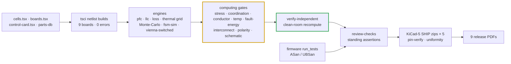

# ✅ Verification Matrix & Risk Register

Every requirement mapped to its evidence, and the risks still open

  
  
  
  

> [!NOTE]
> **Purpose** — every specification requirement mapped to the executed artifact that verifies it, the standing
> gates that keep it verified, and the risks still open. **Nothing is marked V without an artifact on disk.**
>
> **Gate coupling** — `sh calculations/run-all.sh` reproduces the battery this matrix cites; a single failing gate
> stops it.

## At a glance

| | |
|---|---|
| **One command** | `sh calculations/run-all.sh` — **exit 0** end to end; a single failing gate stops the battery |
| **Clean-room recompute** | `verify-independent` re-derives this matrix's claims from its own netlist parser and its own physics |
| **Firmware** | the host suites run under ASan/UBSan across seven binaries |
| **Release sheets** | **100 %** of connected pins across five KiCad-5 SHIP targets → nine board PDFs |
| **Documentation** | `docs-lint` clean across the registered page set |
| **Status letters** | **V** verified by an executed artifact · **P** planned, not executed · **N** not applicable at this phase |

## Scoreboard

| Gate | What it checks | Result |
|---|---|---|
| `envelope-grid` | 4 SKUs × 6 input voltages × 8 output voltages × 7 loads × 3 temperatures, in both LOW and HIGH output modes | **no FAIL row anywhere** — what is left is a fold map at full load · worst junction with the folds applied **150 °C** |
| `monte-carlo` | tank gain per SKU, choke lots, voltage and current chains, full-bridge dead time | 10k samples per batch · **pass** |
| `fsm-sim` + `run_tests.sh` | fault scenarios · the C firmware under ASan/UBSan | **every scenario passes**; the host suites are clean across seven binaries ([firmware verification](firmware-verification.md)) |
| `stress-audit` | every device, magnetic, pulse part and protection class against its acceptance line, including the PFC and LLC die classes, the `[DPT]` snubber and ZVS-budget rows, D7 CM flux and the D4 Rdc rows | **clean** |
| `current-coordination` | simulated peaks vs trips, observability, DESAT vs SCWT, fault flux, **per-die fault pulse ≤ 0.8 × IDM**, film-bank ripple, output diode, precharge-bypass closure, DC-link can duty and the weak-leg ZVS residuals | **clean** |
| `temp-critique` · `conductor-audit` · `magnetics-envelope` · `mag-sync` | core temperature, AC copper, D3 cells and D2 at every simulated corner including fan-out and cell imbalance, identity sync across five carriers | **clean** |
| `fault-energy` | stored energy, wire vs fuse, surge, air and coolant budget | **clean** |
| `verify-independent` | clean-room recompute from its own netlist parser and physics | **all clean** |
| `review-checks` *(outside run-all)* | every audit and external-review closure as a standing assertion | **all pass** |
| `kicad5-verify` | release-sheet pins against the netlists | **100 % on all five SHIP targets** |
| `docs-lint` | links, anchors, page chrome, diagram types | **clean** |
| `magnetics-rfq-audit` | every magnetic drawing on the module pages carries every field a winder quotes against | **0 missing fields** |
| `bom-gen` · `mag-docs` | one BOM page and one magnetics page per module, generated from the built boards and the gate evidence | **generated, never typed** |
| `mkf-crosscheck` *(by hand)* | PyOpenMagnetics second opinion on every custom magnetic: D1 toroid Rdc and Kool Mµ DC bias, D2 / D3 Rdc, gap fringing, 2-D copper and thermal, D4 gap and copper, D7 permeability | **Rdc within 6 % · D1 DC-bias conservative · class lines hold · 50 kW air D3 130 °C vs the 125 °C design line → T-31 watch** |
| `footprint-audit` | unnamed packages and MPN / land conflicts on the release sheets | **0 · 0 — ratchet at zero** |
| `standby-budget` | drawn HV passive network vs the registered standby arithmetic and the ≤ 10 W target | **consistent · EVT measures** |
| `mtbf-budget` | parts-count reliability prediction vs the registered table | **367–403 kh · consistent** |

## 1. Requirements → evidence

| Requirement (§2) | Evidence | Status |
|---|---|---|
| PF ≥ 0.99 · THD ≤ 5 % (stretch 3 %) | `hal_test` SIL with the shipped control law: THD-40 0.76 / 0.65 / 0.69 % at 400 VAC full load, PF 0.9999; cycle-by-cycle Vienna 0.10–0.17 % at 330 VAC | V (averaged + switched fidelity) · P bench T-02 |
| Output 150–1000 V CV/CC envelope | `simulation-results/<sku>/llc-stress.csv` — power-solved full-bridge decks, legs in rails at every corner · the thermal grid passes everywhere, with a registered fold at the corners it names. ZVS holds on every switch **except leg A in phase shift**: the deck carries non-linear C_oss plus the per-die snubber and reports the residual, which the grid charges as a hard turn-on | V analysis · P bench **T-58 / T-72** |
| Peak η ≥ 97 % | `loss-budget.csv` full load **96.38 / 96.34 / 96.29 / 96.22 %** (DOUT, LLC turn-off and the DPT switching share included); grid peaks **97.78 / 97.84 / 97.80 / 97.79 %** | V calc · P calorimetric T-03 |
| Full power to +55 °C, derate to +75 °C | `derating.csv`; worst Tj ≤ 150 °C with computed folds (`envelope-grid`, `stress-audit`) | V calc · P chamber T-04 |
| Environment −30…+75 °C (assumption A11) | `temp-critique` COLD rows at −30 °C; −40 °C-category DC-link class spec; IP55 fan spec line | V spec · P cold soak T-32 |
| Ripple ≤ ± 0.5 % | film-only banks: 9 / 12 / 14 × 2.2 µF per bank, ≤ 0.5 % RMS at −10 % C on every simulated corner (`current-coordination` [OUT]; worst 0.47 / 0.46 / 0.49 % at PS150-Imax) | V calc · P bench T-03 / T-40 |
| Voltage accuracy ± 0.5 % · current ± 1 % | Monte-Carlo C/D: ± 0.18 % / ± 0.2 % after 2-point EOL calibration | V calc · P EOL |
| Standby < 10 W | aux budget at idle | P bench |
| Input derating curve | the registered input-derating curve + `input-currents.csv` | V |
| Every hardware trip ≥ 1.2 × the simulated worst peak | `current-coordination` over `llc-stress.csv` + `vienna-switched.csv` | V sim · P T-30 |
| Trips observable through the 3 µs kill race | same + `spice/protection/ct-frontend.mjs` per SKU | V · P T-17 / T-30 |
| DESAT response ≤ 75 % of SiC short-circuit withstand | NSI66x1A worst timing vs SCWT class (18 pF LLC / 47 pF Vienna blanks) | V datasheet-class · P T-30 |
| Protection hardware paths present | DESAT chains, comparator allocation, OVP, exclusion, WDO ≡ NRST — in the netlists | V design · P injection T-06 |
| Mode-change safety | LOW/HIGH latched in standby, KSER / KPARA / KPARB switched at 0 A behind DOUT, 74HC02 exclusion; per-tick exclusion invariant in `host_sim`; welded KPARA → F.17 at the SER soft start | V sim · P bench T-07 / T-35 |
| Discharge to < 60 V | two-phase model per SKU (active 1.99 / 2.39 / 3.19 s; passive 370 / 222 / 296 s, netlist-proven strings) + the intent sealed across a reset (`app_test`) + label + F.21 AC-present latch | V calc · P hold-up waveform |
| Winding AC copper inside the drawing rows | `conductor-audit` + the clean-room copper recompute | V model · P first-article Rac T-31 |
| D3 gap fringing on the innermost foil | gap split per core set (drawing + build instructions) + FEMMT run | construction · P T-31 |
| Models anchored to sources they did not produce | `verify-independent` §K: Vienna vs Friedli–Kolar ± 0.7 %; LLC vs Wolfspeed CRD-30DD12N-K measurement −8 % pk | V |
| Loss budget and air budget use physical inputs | `loss-budget` reads the PAR400 nominal corner; `fault-energy` reads `loss-budget.csv` | V |
| EOL and EVT windows belong to the product SKUs | `dfm-production` steps 4 / 5 / 8; `evt-plan` T-08 / T-17 / T-22 | V doc · P first EOL lot |
| Device mounting basis | `thermal/mount.mjs`: clip-mounted TO-247 on Al2O3, 0.8 K/W at a 70 °C base (air), 0.65 K/W at 65 °C (liquid) — read by every Tj engine | V model · **P T-38** |
| EMI filter without DM chokes | `lisn-precompliance`: drawn star-X2 per-phase ladder, DM margin 32.9 / 30.6 / 28.7 dB against a single-stage control at 19.6 / 19.1 / 18.4 dB; `pfc-control` modulus margin **0.63 / 0.61 / 0.71** at the shipped 15 µs delay with the drawn damper (2.2 µF / 6.8 Ω at 30–40 kW, 4.7 µF / 4.7 Ω at 50 kW) | V sim · P T-08 / **T-39** |
| Right-sized SiC dies survive their trip | `current-coordination` per-die pulse: PFC 165 / 205 / 266 A per die ≤ 0.8 × IDM and LLC 198 / 126 / 154 A per die at the fast kill peak ≤ 0.9 × IDM; IDM acceptance lines in `parts-db` | V calc · P RFQ + **T-41** |
| Output diode and zero-current relays | `current-coordination` [OUT]: DOUT at 67 % of class, Tj 115 / 120 / 123 / 128 °C | V calc · P **T-36** |

## 2. Schematic and BOM verification

| Check | Result |
|---|---|
| Netlist build errors | **0 on all 9 boards** (4 SKU pairs + card) |
| Release-sheet pins | `kicad5-verify.mjs`: **every connected pin resolves** on all five SHIP targets |
| Schematic symbol overlaps | **0** on every SKU pair |
| Module interconnect | clean — studs, all 40 harness ways, the 88-way slot, RATING straps |
| Polarity | every polarized part has its + / anode on pin 1 as the glyphs draw it, gated |
| Driver channels | one `DriverCh` cell for all 7 channels per module — 3 Vienna + 4 full-bridge LLC — on the NSI6611 pin map, with a DESAT series resistor and a per-stage blanking capacitor; the seven RDY outputs wire-OR onto DRV_RDY, which is the third input of both safety AND gates and a firmware input |
| BOM coverage | 0 unmatched designators; every class part carries a value-carrying order code; `bom-maturity` MATURE |
| Supervisory logic | C99 FSM + CAN codec + group share law + the bypass-closure window, under ASan/UBSan |
| PCB layout | **N** — out of scope: the design face ends at the audited KiCad-5 schematics |

## 3. Simulation matrix

| Domain | Executed | Result |
|---|---|---|
| Device edge | double-pulse per SKU at the real turn-off currents, behavioural SiC | Vienna 70–79 % of 750 V, LLC 65–84 % of 1200 V on the repetitive corners; ± 40 % energy band |
| Vienna | line-cycle averaged + cycle-by-cycle (8 operating cases + 3 line events per SKU) | peaks 97 / 127 / 159 A; THD held at high line by the line-tracking bus floor |
| LLC | power-solved full bridge per SKU, 12 stress corners + 20-point envelope + internal-short race | worst tank peak 112.6 / 147.9 / 182.5 A (SER 250 V on the 764 V bus floor); ZVS everywhere but leg A in phase shift |
| Protection | CT front-ends per SKU · precharge / discharge / bank bleed | all pass |
| Aux | flyback per SKU at 340 / 560 / 860 V plus the fault matrix | every row passes; one component-failure residual recorded |
| System | the thermal grid · Monte-Carlo · the scenario suite | no failing grid row · pass · every scenario passes |
| EMI | LISN pre-compliance per variant on the star-X2 ladder | DM margins + 32.9 / + 30.6 / + 28.7 dB · CM + 3.1 dB with 200 pF at the Vienna node and 100 pF at the LLC leg node |

## 4. Risk register

| ID | Risk | Severity × likelihood | Mitigation / retirement | Status |
|---|---|---|---|---|
| R1 | LLC gain hole at 150–260 V per bank | H × M | hybrid phase-shift mode with the junction-observer fold; duty → power calibration in firmware | mitigated · bench pending |
| R2 | Inter-board stud joints at bus current | M × M | milliohm EOL check, Belleville hardware, torque spec | open (design done) |
| R3 | SiC RFQ pricing ± 25 % | H × M | 5-vendor RFQ round 1 after the DPT freeze | open |
| R4 | 1000 V relay make / weld qualification, mirror variant | H × M | the S/P relays switch at 0 A behind DOUT, so the make is never a live one; Hongfa RFQ — the residual is a welded KPARA (F.17, T-35) | narrowed |
| R5 | Behavioural SiC model band (± 40 % switching energy) | M × H | worst-case k_sw used for fsw; bench DPT T-01 | mitigated |
| R6 | Transformer partial discharge at the 1 kV class | H × M | D3 insulation system + PD sampling | open (specified) |
| R7 | EMI pre-compliance gap | M × H | per-variant LISN margins on the drawn star-X2 ladder (no DM chokes), with a single-stage ladder as the control. With the LLC bridge counted as a second CM source the margin is **+3.1 dB at the 100 pF leg-node requirement and +7.1 dB at the 50 pF design target** with CY1-3 at 10 nF — the analytic ladder flips sign between 200 and 400 pF of switch-node capacitance; chamber at EVT (T-08 / **T-39**) | mitigated (analysis) · **Cp is ASSUMED** |
| R8 | GD32G553 alternate-function / comparator table deltas | M × M | pin map regenerated from the vendor table; comparator instances pinned | open (narrowed) |
| R9 | PV bleeder gate drive over temperature | M × M | guaranteed 10 mA drive + 25 °C-endpoint model; EVT loaded-Vgs gates BOM freeze | open (measurement) |
| R10 | Aux cold start at low line and −30 °C | L × M | NCP1252D + 220 µF (3 × budget); T-29 / T-32 waveforms | mitigated (design) |
| R11 | COGS against the red-line | H × M | 10k basis near or below red-lines; levers in the cost roll-up | open (quote-dependent) |
| R12 | Real SiC short-circuit withstand shorter than the class used | H × L | DESAT at ≤ 75 % of the class; RFQ acceptance tSC ≥ 2 µs at 800 V; T-30 | open (vendor data) |
| R13 | D3 innermost-foil fringing loss above the 1-D model | M × M | gap split per set; FEMMT run; T-31 open-secondary check + S1 thermocouple | mitigated (construction) |
| R14 | 480 V grid customers need 530 VAC input | M × M | product-owner decision — filter already X1 530 VAC / Y1 440 VAC / MOV 550 VAC; F.07 trip at 500 VAC and 21 V of bus headroom are the real work | open (decision) |
| R15 | Sourcing restrictions on bias / isolation modules (Mornsun OFAC flag) | M × M | qualify MEAN WELL / RECOM / CUI-class second sources before volume | open |
| R16 | BOM busbar line below the computed set at 40 / 50 kW (₹953 / ₹1,188 vs ₹810 / ₹850) | L × H | reconcile at the mechanical RFQ | open (cost) |
| R19 | Clip-mount Rth basis unproven: every Tj gate reads 0.8 / 0.65 K/W from `mount.mjs`, and the single-die choice depends on it | H × M | EVT T-38 with a +15 % acceptance; a miss reopens the mount and restores paralleled dies where the grid folds | open (EVT) |
| R20 | Right-sized SiC dies miss their pulsed-current line at RFQ (SG2M023120LJ IDM ≥ 265 A; 750 V 20 / 15 mΩ classes ≥ 210 / 260 A) | M × M | acceptance lines in `parts-db`; T-41 sample pulse test; revert path per SKU (two LLC dies / B3M010C075Z) priced | open (RFQ) |
| R21 | Cost gap to InfyPower: the India 10k basis is ≈ 53 % above the teardown estimate (₹36,103 vs ≈ ₹23,600 at 40 kW) | H × H | China RFQ-target column; 2U construction scenario; deferred drive clone (−₹470) and aux / relay levers; buy and measure one REG1K0135A2 to replace estimates with data | open (commercial) |
| R22 | 2U construction prerequisites unproven: the PFC choke must lie in a well (T79 stacks 60–95 mm), a 3-core 40 kW D1 fails F.01, the chassis must hold a 70 °C base at 55 °C | M × H | scenario only — the design basis stays the 3U card; needs a flat-core D1 and a mechanical design with quotes | open (design) |
| R24 | PFC control-interrupt budget on real silicon | H × M | the interrupt runs off the ADC end-of-sequence transfer, so the deadline is the carrier roll-over at ≈ 7.2 µs rather than 5.0 µs; the single-update fallback is **forbidden** on 40 / 50 kW; the GD32G553 at 216 MHz is chosen over the STM32G474 for this margin | open (**T-64**, measured with DWT) |
| R25 | Layout promises the DPT and DC-link decks assume: link impedance 40 / 60 nH and loop inductance 5 / 7 nH | H × H | layout rules in the netlists; every final DPT row passes at those loops — a miss reopens the snubber set. At a realistic 10–30 nH the same deck reads **78–92 % of 1200 V at 10 nH and 90–103 % at 20–30 nH** with R_g,off 0 Ω, so the ≤ 10 nH rule is load-bearing, not a preference — a ring-down measurement gates every high-power run, and a miss costs a gate resistor **and** a second 30 kW die or a fold (k_off rises 3–5×) | open (**T-57 / T-59 / T-71**) |
| R26 | CV load-step overshoot on the film-only bank (+4.9 … +9.7 % at the stud) | M × M | spec ≤ 10 % with the code's F.14 thresholds; the ≈ +₹500 electrolytic route is registered — the benchmark's banks are **not** film-only | open (user decision · **T-60**) |

The bench campaign that retires the P rows is the [EVT test plan](evt-plan.md).

> [!TIP]
> **How this page is checked** — `sh calculations/run-all.sh` reproduces the whole battery this matrix cites — a single failing gate stops it — and `verify-independent` recomputes its claims from its own parser and physics.

---

<a href="simulation-report.md">← Simulation Report</a> &nbsp;·&nbsp; <a href="README.md">🧭 Documentation hub</a> &nbsp;·&nbsp; <a href="evt-plan.md">EVT Test Plan →</a>

Vectivolt DC-Modules · documentation rev E84 · every number reproduces with <code>sh calculations/run-all.sh</code>

