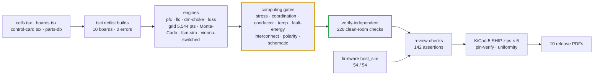

# ✅ Verification Matrix & Risk Register

Every requirement mapped to its evidence, and the risks still open

  
  
  
  

> [!NOTE]
> **Purpose** — every specification requirement mapped to the executed artifact that verifies it, the standing
> gates that keep it verified, and the risks still open. **Nothing is marked V without an artifact on disk.**
>
> **Gate coupling** — `sh calculations/run-all.sh` reproduces the battery this matrix cites; a single failing gate
> stops it.

## Scoreboard

| Gate | What it checks | Result |
|---|---|---|
| `envelope-grid` | 4 SKUs × 6 input voltages × 9 output voltages × 7 loads × 3 temperatures | **5,544 points · 0 failures** |
| `monte-carlo` | tank gain, choke lots, voltage and current chains, lane sharing, dead-time | **6 batches × 10k samples · pass** |
| `fsm-sim` + `host_sim` | fault scenarios · C firmware under ASan/UBSan | **26 / 26 · 54 / 54** |
| `stress-audit` | every device, magnetic, pulse part and protection class against its acceptance line | **102 checks · clean** |
| `current-coordination` | simulated peaks vs trips, observability, DESAT vs SCWT, fault flux | **58 checks · clean** |
| `temp-critique` · `conductor-audit` · `mag-sync` | core temperature, AC copper, identity sync across five carriers | **29 · 12 · 50 · clean** |
| `fault-energy` | stored energy, wire vs fuse, surge, air and coolant budget | **22 checks · clean** |
| `verify-independent` | clean-room recompute from its own netlist parser and physics | **226 / 226** |
| `review-checks` | every audit and external-review closure as an assertion | **142 pass** |
| `kicad5-verify` | release-sheet pins against the netlists | **7,784 / 7,784 · 6 targets** |
| `docs-lint` | links, anchors, page chrome, diagram types | **clean** |
| `footprint-audit` | unnamed packages and MPN / land conflicts on the release sheets | **held at the E61 baseline · 307 · 344** |

**Status letters:** **V** verified by an executed calculation, simulation or audit (artifact cited) · **P** planned
or specified, not yet executed · **N** not applicable at this phase.

## 1. Requirements → evidence

| Requirement (§2) | Evidence | Status |
|---|---|---|
| PF ≥ 0.99 · THD ≤ 5 % (stretch 3 %) | `pfc-phase-runs.csv`: THD 0.59–1.05 % full load, 2.55 % at 25 %; cycle-by-cycle Vienna 0.09–0.15 % at 330 VAC | V (averaged + switched fidelity) · P bench T-02 |
| Output 150–1000 V CV/CC envelope | `simulation-results/<sku>/llc-stress.csv` — power-solved, ZVS 64/64 on every corner, legs in rails · grid 5,544 points, 0 failures (folds = FSM derate rows) | V analysis · P bench |
| Peak η ≥ 97 % | `loss-budget.csv` full load 97.19 / 96.92 / 96.68 / 96.82 %; grid peaks 98.45–98.58 % | V calc · P calorimetric T-03 |
| Full power to +55 °C, derate to +75 °C | `derating.csv`; worst Tj ≤ 150 °C with computed folds (`envelope-grid`, `stress-audit`) | V calc · P chamber T-04 |
| Environment −30…+75 °C (A11 rev C) | `temp-critique` COLD rows at −30 °C; −40 °C-category DC-link class spec; IP55 fan spec line | V spec · P cold soak T-32 |
| Ripple ≤ ± 0.5 % | bank / output film + electrolytic sizing, 3-φ interleave (`verify-independent` §F) | V calc · P bench T-03 |
| Voltage accuracy ± 0.5 % · current ± 1 % | Monte-Carlo C/D: ± 0.18 % / ± 0.2 % after 2-point EOL calibration | V calc · P EOL |
| Standby < 10 W | aux budget at idle | P bench |
| Input derating curve | E1 curve + `input-currents.csv` | V |
| Every hardware trip ≥ 1.2 × the simulated worst peak | `current-coordination` over `llc-stress.csv` + `vienna-switched.csv` | V sim · P T-30 |
| Trips observable through the 3 µs kill race | same + `spice/protection/ct-frontend.mjs` per SKU | V · P T-17 / T-30 |
| DESAT response ≤ 75 % of SiC short-circuit withstand | NSI66x1A worst timing vs SCWT class (22 / 47 pF blanks) | V datasheet-class · P T-30 |
| Protection hardware paths present | DESAT chains, comparator allocation (E48), OVP, exclusion, WDO ≡ NRST — in the netlists | V design · P injection T-06 |
| Mode-change safety | `sp-transition.csv` → pre-insertion E12/E13; per-tick exclusion invariant in `host_sim` | V sim · P bench T-07 |
| Discharge to < 60 V | two-phase model per SKU (active 2.0 / 2.4 / 3.2 s; passive 370 / 222 / 296 s, netlist-proven strings) + label + F.21 AC-present latch | V calc · P hold-up waveform |
| Winding AC copper inside the pack rows | `conductor-audit` + clean-room §B | V model · P first-article Rac T-31 |
| D3 gap fringing on the innermost foil | gap split per core set (pack + build instructions) + FEMMT run | construction · P T-31 |
| Models anchored to sources they did not produce | `verify-independent` §K: Vienna vs Friedli–Kolar ± 0.7 %; LLC vs Wolfspeed CRD-30DD12N-K measurement −8 % pk | V |
| Loss budget and air budget use physical inputs | `loss-budget` reads the PAR400 nominal corner; `fault-energy` reads `loss-budget.csv` | V |
| EOL and EVT windows belong to the product SKUs | `dfm-production` steps 4 / 5 / 8; `evt-plan` T-08 / T-17 / T-22 / T-24 restated | V doc · P first EOL lot |

## 2. Schematic and BOM verification

| Check | Result |
|---|---|
| Netlist build errors | **0 on all 10 boards** (4 SKU pairs + card + cabinet) |
| Release-sheet pins | `kicad5-verify.mjs`: **7,784 / 7,784** across the six SHIP targets |
| Schematic symbol overlaps | **0** on every SKU pair |
| Module interconnect | clean — studs, all 40 harness ways, the 88-way slot, RATING straps, cabinet section |
| Polarity | every polarized part has its + / anode on pin 1 as the glyphs draw it (E38 gate + R4-1 seating fix) |
| Driver channels | one `DriverCh` cell for all 9 channels per module (real NSI6611 map R4-2, DESAT series R R5-B, per-stage blank E60) |
| BOM coverage | 0 unmatched designators; every class part carries a value-carrying order code; `bom-maturity` MATURE |
| Supervisory logic | C99 FSM + CAN codec + CSU: **54 / 54** under ASan/UBSan |
| PCB layout | **N** — out of scope by directive (E36); the layout phase reopens with the [floorplan basis](pcb-floorplan.md) |

## 3. Simulation matrix

| Domain | Executed | Result |
|---|---|---|
| Device edge | double-pulse (26 runs), behavioural SiC | overshoot 70 % with the RCD clamp; ± 40 % energy band |
| Vienna | line-cycle averaged (6) + cycle-by-cycle (7 cases + 3 events per SKU) | peaks 97 / 127 / 159 A; THD fixed at high line by FW-R7 |
| LLC | power-solved per SKU, 14 corners + internal-short race + dead short | ZVS 64/64; worst tank peak 70.2 / 94.0 / 117.9 A |
| Protection | CT front-ends per SKU · precharge / discharge / bank bleed | all pass |
| Aux | flyback per SKU at 342 / 560 / 850 V | 12 / 12 pass |
| System | grid 5,544 · Monte-Carlo 6 batches · 26 scenarios | 0 failures · pass · 26 / 26 |
| EMI | LISN pre-compliance per variant | DM margins + 4.9 / + 5.7 / + 5.6 dB |

> [!WARNING]
> The pre-E60 LLC op-point record was produced by a deck without MOSFET body diodes and is **withdrawn**; the
> power-solved decks above replace it. See [simulation report](simulation-report.md) §13 and
> [simulation toolchain](simulation-toolchain.md).

## 4. Review history

| Round | Verdict at review | Closure |
|---|---|---|
| **R1** adversarial ([record](design-review-production.md)) | NO — 15 critical | rev C, same day |
| **R2** re-audit ([record](design-review-production-r2.md)) | NO — 7 new criticals inside the rev C fixes | rev D, same day; assertion suite began |
| **R3** external PDF ([record](history/review-response-r3.md)) | "do not manufacture" on pin numbering | allocation regenerated from the datasheet |
| **E35 / E37 / E38 / E39** margin, interconnect, polarity, cabinet audits | 8 + 4 + 0 + 3 findings | same-day closure, permanent gates |
| **R4–R8** external PDF rounds (register E45–E49) | ~40 claims per round, triaged against netlists and datasheets | every real defect fixed and gated, including one retraction of our own arithmetic (E49) |
| **E51 / E58 / E60** magnetics recompute, temperature critique, current coordination | unbuildable windows, temperature-blind fits, trips below real peaks, non-physical LLC deck | re-issued constructions, computing gates |

## 5. Risk register

| ID | Risk | Severity × likelihood | Mitigation / retirement | Status |
|---|---|---|---|---|
| R1 | LLC gain hole at 150–260 V per bank | H × M | hybrid phase-shift mode, ZVS shown; duty → power calibration in firmware | mitigated · bench pending |
| R2 | Inter-board stud joints at bus current | M × M | milliohm EOL check, Belleville hardware, torque spec | open (design done) |
| R3 | SiC RFQ pricing ± 25 % | H × M | 5-vendor RFQ round 1 after the DPT freeze | open |
| R4 | 1000 V relay make / weld qualification, mirror variant | H × M | pre-insertion, matched-voltage make, two-stage exclusion; Hongfa RFQ | open |
| R5 | Behavioural SiC model band (± 40 % switching energy) | M × H | worst-case k_sw used for fsw; bench DPT T-01 | mitigated |
| R6 | Transformer partial discharge at the 1 kV class | H × M | D3 insulation system + PD sampling | open (specified) |
| R7 | EMI pre-compliance gap | M × H | per-variant D6 engine + LISN margins; chamber at EVT | mitigated (analysis) |
| R8 | GD32G553 alternate-function / comparator table deltas | M × M | pin map regenerated from the vendor table; comparator instances pinned (E48) | open (narrowed) |
| R9 | PV bleeder gate drive over temperature | M × M | guaranteed 10 mA drive + 25 °C-endpoint model; EVT loaded-Vgs gates BOM freeze | open (measurement) |
| R10 | Aux cold start at low line and −30 °C | L × M | NCP1252D + 220 µF (3 × budget); T-29 / T-32 waveforms | mitigated (design) |
| R11 | COGS against the red-line | H × M | 10k basis near or below red-lines; levers in the cost roll-up | open (quote-dependent) |
| R12 | Real SiC short-circuit withstand shorter than the class used | H × L | DESAT at ≤ 75 % of the class; RFQ acceptance tSC ≥ 2 µs at 800 V; T-30 | open (vendor data) |
| R13 | D3 innermost-foil fringing loss above the 1-D model | M × M | gap split per set; FEMMT run; T-31 open-secondary check + S1 thermocouple | mitigated (construction) |
| R14 | 480 V grid customers need 530 VAC input | M × M | product-owner decision — filter already X1 530 VAC / Y1 440 VAC / MOV 550 VAC; F.07 trip at 500 VAC and 21 V of bus headroom are the real work | open (decision) |
| R15 | Sourcing restrictions on bias / isolation modules (Mornsun OFAC flag) | M × M | qualify MEAN WELL / RECOM / CUI-class second sources before volume | open |
| R16 | BOM busbar line below the computed set at 40 / 50 kW (₹953 / ₹1,188 vs ₹810 / ₹850) | L × H | reconcile at the mechanical RFQ | open (cost) |
| R17 | Release sheets not layout-ready: 307 components name no package; 344 carry an MPN whose package differs from its land | M × H | resolve at layout entry, reading each new C-number back; `footprint-audit` fails if either count grows — [footprints to draw](footprints-to-draw.md) | open (layout entry) |

The bench campaign that retires the P rows is the [EVT test plan](evt-plan.md).

---

<a href="simulation-report.md">← Simulation Report</a> &nbsp;·&nbsp; <a href="README.md">🧭 Documentation hub</a> &nbsp;·&nbsp; <a href="evt-plan.md">EVT Test Plan →</a>

Vectivolt DC-Modules · documentation rev E61 · every number reproduces with <code>sh calculations/run-all.sh</code>

