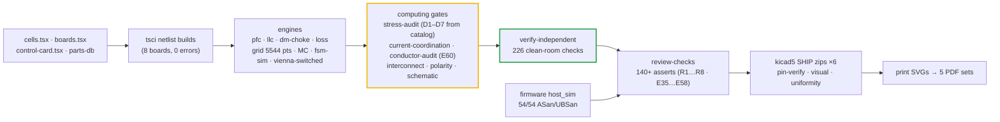

# Verification Matrix & Risk Register — rev E60 (current coordination · AC copper · simulation re-basis)

  

> **Purpose** — Requirement→evidence matrix and risk register; nothing marked V without an artifact on disk.
>
> **Gate coupling** — run-all.sh reproduces the battery this matrix cites.

> **E60 (2026-09-13):** the LLC ngspice evidence was re-based (the old deck had no body diodes — withdrawn);
> power-solved per-SKU LLC + cycle-by-cycle Vienna now feed **`current-coordination`** (F.01/F.11 classes, burdens,
> DESAT vs SCWT, D2 fault flux, caps, rectifiers) and **`conductor-audit`** (Dowell/Sullivan AC copper). Details:
> [`current-coordination.md`](current-coordination.md) · [`conductor-selection.md`](conductor-selection.md) ·
> [`simulation-toolchain.md`](simulation-toolchain.md).
>
> **E51 (2026-09-12):** independent magnetics recompute against catalog cores/formers re-issued
> D1-40/50 (catalog-AL turns + lot-trim) and D3 all-SKU constructions (window feasibility — the
> as-drawn transformers could not wind); stress-audit D1/D3 rows now COMPUTE from catalog
> constants; loss-budget carries real per-SKU transformer rows. Category verdicts:
> [`final-validation-e51.md`](final-validation-e51.md).

Status letters: **V** = verified by executed calc/sim/audit (artifact cited) · **P** =
planned/spec'd, not executed · **N** = not applicable at this phase. Nothing marked V without
an artifact on disk; `calculations/run-all.sh` reproduces the battery.

## Requirements → evidence

| Req (§2) | Evidence | Status |
|---|---|---|
| PF ≥0.99 / THD ≤5% (stretch 3%) | `pfc-phase-runs.csv`: THD 0.59–1.05% full, 2.55% @25% | V (averaged fidelity; bench at EVT T-02) |
| Output 150–1000 V CV/CC envelope | `llc-opmap.csv` + **`simulation-results/<sku>/llc-stress.csv` (E60 power-solved, ZVS 64/64 on every corner, legs in rails)** + per-variant envelope grid **6048 pts, 0 fail** (corner folds = FSM derate rows) | V analysis / P bench |
| Peak η ≥97% | `loss-budget.csv` per variant: 97.0–97.5% class (air-50 98.55% pk) | V calc / P bench |
| Full power to +55 °C, derate to 75 °C | `derating.csv`; worst Tj ≤147 °C vs the 150 °C ceiling (`stress-audit.mjs`, all variants) | V calc / P thermal chamber |
| Ripple ≤±0.5% | bank/output film+elyt sizing; 3-φ interleave | P (bench T-03) |
| V-acc ±0.5% / I-acc ±1% | divider 0.1% bottom + EOL cal flow | P (cal at EOL) |
| Standby <10 W | aux budget calc @idle | P bench |
| Input derating curve | E1 curve + `input-currents.csv` | V |
| Protections | `protection-thresholds.md` — HW paths in the netlists (DESAT chains, CMP allocation E48, OVP, exclusion, WDO≡NRST) | V design / P bench T-06 + both-polarity trip timing (E47/E48) |
| Mode-change FSM safety | `sp-transition.csv` → pre-insertion E12/E13; per-tick exclusion invariant in host_sim | V sim / P bench T-07 |
| Discharge to <60 V | two-phase model per SKU (370/222/296 s passive, netlist-proven balance strings — E49) + label + F.21 AC-present latch | V calc / P bench (hold-up waveform) |

## Schematic/BOM verification (rev E49, standing gates)

| Check | Result |
|---|---|
| Netlist build errors | **0 on all 10 boards** (4 SKU pairs + card + cabinet) |
| Sheet pin correctness | `kicad5-verify.mjs`: **7794/7794 across the six SHIP targets** |
| Schematic symbol overlaps | **0** — every SKU pair checked (battery, widened at R6) |
| Module interconnect | CLEAN — studs, all 40 harness ways, both 88-way slots, RATING straps, cabinet section |
| Polarity | **every polarized part +/anode on pin 1 as the glyphs draw it** (E38 netlist gate + the R4-1 semantic-seating fix + payload↔netlist anode lock) |
| Driver channels fully wired | V — one `DriverCh` cell = all 9 channels/module (real NSI6611 map, R4-2; DESAT series R, R5-B) |
| Independent verifier | `verify-independent.mjs`: **226 checks** — clean-room netlist parser + sections A–J (R4/R5/R6/R7/R8 electrical proofs) + **§K E60 external anchors** (Friedli–Kolar closed forms, Wolfspeed CRD-30DD12N-K measured tank current) |
| BOM coverage | unmatched designators = 0; every class part carries a value-carrying order code (R5-G/R7-C/R8-C) |
| Stress acceptance | `stress-audit.mjs` CLEAN — device/magnetic/protection/pulse/discharge/cold-start families, all variants |
| Supervisory logic (E24) | C99 fsm + CAN codec + CSU: **50/50 checks** (26 scenarios + codec + 100k fuzz + rating windows + exclusion invariant) under ASan/UBSan |
| PCB layout | **N — out of scope per customer directive (E36)**; layout phase reopens with `pcb-floorplan.md` |

## Simulation matrix status

Executed: DPT (26) · PFC loops · Vienna line-cycle (6) · precharge/discharge · LLC op-points ·
S/P mismatch (4) · envelope grid 6048 pts (0 fail) · §37 Monte-Carlo (PASS after rev-D2) · aux
flyback V-21 (PASS both corners; controller re-based NCP1252D at R6-G) · LISN pre-compliance
per variant (+4.9/+5.7/+5.6 dB with the D6 rev C engine) · §36 scenario suite 26/26 (fsm-sim).
Open in the simulation domain: none. Hardware-domain items = EVT T-01… (below).

## Review history (dated records; every finding gated)

| Round | Verdict at review | Closure |
|---|---|---|
| **R1** adversarial (`design-review-production.md`) | NO — 15 critical | rev C, same day |
| **R2** re-audit (`design-review-production-r2.md`) | NO — 7 new criticals inside the rev-C fixes | rev D, same day; gate grew to 60+ asserts |
| **R3** external PDF (`review-response-r3.md`) | "do not manufacture" on pin numbering | pin allocation regenerated from the datasheet |
| **E35/E37/E38/E39** margin, interconnect, polarity, cabinet audits | 8 + 4 + 0 + 3 findings | same-day closure, permanent gates |
| **R4–R8** external PDF rounds (register E45–E49) | ~40 claims/round, triaged against netlists + vendor datasheets | every real defect fixed same-day (diode rendering, NSI6611/NCP1252 maps, WDO≡NRST, NCP1252D cold-start, CMP instance allocation, PV drive, discharge model — incl. one retraction of our own arithmetic at E49); gates R4-*…R8-* |

## Risk register (rev E49)

| ID | Risk | Sev×Lik | Mitigation / retirement | Status |
|---|---|---|---|---|
| R1 | LLC gain hole 150–260 V bank | H×M | hybrid PS mode, ZVS shown; duty→P cal at FW | Mitigated (design), bench pending |
| R2 | Inter-board 156 A stud joints | M×M | milliohm EOL check, belleville hardware, torque spec | Open (design done) |
| R3 | SiC RFQ pricing ±25% | H×M | 5-vendor RFQ round 1 after DPT freeze | Open |
| R4 | 1000 V relay qual (make/weld) + mirror-variant confirmation | H×M | pre-insertion + matched-V make policy + two-stage exclusion; Hongfa RFQ | Open |
| R5 | Behavioral SiC model band (±40% Esw) | M×H | worst-case k_sw used for fsw; bench DPT T-01 | Mitigated |
| R6 | Transformer PD at 1 kV class | H×M | D3 insulation system + PD sample test | Open (spec'd) |
| R7 | EMI pre-compliance gap | M×H | per-variant D6 engine + LISN margins; chamber at EVT | Mitigated (analysis) |
| R8 | GD32G553 AF/CMP table deltas | M×M | A6 regeneration from the vendor table; CMP-instance constraint already pinned (E48) | Open (narrowed) |
| R9 | PV bleeder loaded gate drive over temperature | M×M | R8 drive at the guaranteed 10 mA point + 25 °C-endpoint model; **EVT loaded-Vgs gates the BOM freeze** | Open (measurement) |
| R10 | Aux cold-start at low line | L×M | NCP1252D + 220 µF (3× budget); startup waveform at EVT | Mitigated (design) |
| R11 | COGS vs red-line | H×M | 10k-basis near/below red-lines; levers in `bom-cost.md`; risk = quote realization | Open (quote-dependent) |

## EVT plan pointer

Bench campaign in [`evt-plan.md`](evt-plan.md): DPT vs sim, THD/PF, ripple/accuracy, thermal
chamber, precharge/discharge pulse ratings, protection injection **incl. both-polarity trip
timing and the CT/comparator polarity pairing (E47/E48)**, S/P transitions, EMI pre-scan, aux
cold-start/brown-out waveform, PV bleeder loaded-Vgs, HMI/CAN soak.

## E60 rows

| Requirement | Evidence | Status |
|---|---|---|
| Every hardware OC trip ≥ 1.2 × the simulated worst peak | `current-coordination.mjs` §B/§E over `llc-stress.csv` + `vienna-switched.csv` | **V** (sim) · T-30 P |
| Trip observability through the 3 µs kill race | same, + `spice/protection/ct-frontend.mjs` per SKU | **V** · T-17/T-30 P |
| DESAT response ≤ 75 % SCWT | NSI66x1A worst timing vs SCWT class (22/47 pF) | **V** (datasheet-class) · T-30 P |
| Winding Rac/Rdc inside the pack rows at simulated currents | `conductor-audit.mjs` (+ clean-room §B in verify-independent) | **V** (model) · T-31 P |
| Vienna regulates at 475–500 VAC | `vienna-switched.csv` busFloor rows + FW-R7 host_sim check | **V** (sim + firmware) · T-02 P |
| Retired-SKU simulation residue removed | 60/120 kW decks/PDFs/sim folders deleted; per-SKU decks re-keyed | **V** |
| Loss budget uses a physical LLC current | `loss-budget.mjs` reads `PAR400-full` from `llc-stress.csv`; `fault-energy` reads `loss-budget.csv` (no hand copies) | **V** · T-03 calorimetric P |
| Switched models agree with sources they did not produce | `verify-independent` §K: Vienna vs closed forms ±0.7 %; LLC vs CRD-30DD12N-K measurement −8 % pk | **V** |
| Environment matches the published competitor envelope (A11 rev C) | −30 °C floor: temp-critique COLD at −30 °C, −40 °C-category cans (class spec), IP55 fans (spec line); `competitive-benchmark-e51.md` §7 | **V** (spec) · T-32 P |
| D3 gap fringing on the innermost foil | gap split per set (pack + build instructions); T-31 open-secondary check + S1 thermocouple; FEMMT run | construction · T-31 P |
| EOL/EVT windows belong to the product SKUs | `dfm-production.md` step 4/5/8 + `evt-plan.md` T-08/T-17/T-22/T-24 restated from the per-SKU decks | **V** (doc) · first EOL lot P |
