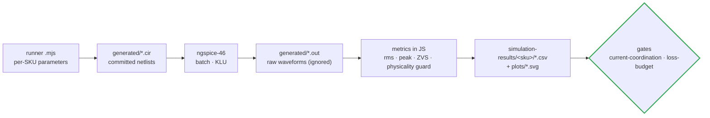

# 🖥️ SPICE Simulation Suites

<sub>The ngspice runners, what each one proves, and where its results land</sub>

<p>
  
  
  
</p>

> [!NOTE]
> **Purpose** — the ngspice runners behind the switched-circuit evidence: what each one proves, where its netlists
> and results land, and which gate consumes them.
>
> **Engine** — **ngspice-46** (`brew install ngspice`). Every runner writes its decks into `generated/`, runs them,
> computes metrics in JavaScript from the raw waveforms, and writes CSVs and SVG plots into
> `../simulation-results/`. Netlists (`*.cir`, 639 committed at E81) are kept for traceability (§49-11); raw waveform dumps
> (`*.out`, hundreds of MB) are git-ignored — re-run a suite to regenerate them.

## At a glance

| | |
|---|---|
| **Engine** | ngspice-46 (KLU, trapezoidal), batch mode |
| **Committed** | the decks — `generated/*.cir` (639 at E81); raw `*.out` waveforms are git-ignored |
| **Results** | `../simulation-results/<sku>/*.csv` + `plots/*.svg` — read by `current-coordination` and `magnetics-envelope` |
| **Guards** | physicality (legs inside the rails), power-solve (the deck must deliver the rated power), and a tank **fingerprint** so a changed tank fails the gate instead of reusing a stale result |
| **Read the results at** | [simulation report](../docs/simulation-report.md) · method in the [simulation toolchain](../docs/simulation-toolchain.md) |

## 1. How a result is produced



## 2. Runners

| Runner | What it proves | Key outputs |
|---|---|---|
| `double-pulse/dpt-run.mjs` | device-edge truth, **per SKU** (E81): reads the gate network, RC snubber and single-sided RCD clamp out of `cells.tsx` and the turn-off currents out of each SKU's `llc-stress.csv` / `vienna-switched.csv`, runs at the drawn −3 V off-bias on the datasheet-fitted `models/sic-1200-c3m.lib`, reports **channel** turn-off energy (drain integral minus the datasheet E_oss, so the `cs` snubber is credited and its recovered charge is not counted as loss), sweeps `cs` against the ZVS dead-time budget, and prints the per-SKU `cs`/`koff` for `tanks.mjs`. Both Vienna line-cycle polarities are run separately because the RCD clamps only one. `calculations/stress-audit.mjs` **[DPT]** gates every `final` row, the fingerprint, `tanks.koff` and `pfc-design`'s `k_sw` — the pre-E81 suite was read by nothing. | `simulation-results/<sku>/dpt-llc-metrics.csv`, `dpt-pfc-metrics.csv`, waveform plots |
| `pfc/pfc-phase-run.mjs` | 3-φ line-cycle behaviour at averaged-switch fidelity: THD-40, midpoint balance, phase loss, precharge / discharge sizing | `pfc-phase-runs.csv` |
| `llc/llc-run.mjs` | **per-SKU, power-solved** full-bridge LLC (E67) with body diodes: 12 stress corners (tolerance, gain-worst, high-line bus floor, nominal) plus the 20-point envelope from `llc-envelope.mjs`, an internal-short race and a dead short; **physicality guard** (legs in rails) and **tank fingerprint** | `<sku>/llc-stress.csv` · `llc-stress-summary.json` · `plots/llc-worst-corner.svg` |
| `llc/sp-transition.mjs` | why banks are never paralleled across a voltage difference — **E81 / F-G-4**: per SKU on the E68c FILM-ONLY bank (19.8 / 26.4 / 30.8 µF, was a retired 1.5 mF) and swept over the closure-loop inductance, because the loop sets the answer; the output is the minimum loop L the FW-42 \|ΔV\| ≤ 25 V permit needs against the relay make line | `<sku>/sp-transition.csv` |
| `aux/aux-flyback.mjs` | aux start, regulation and cross-regulation at 342 / 560 / 850 V per product SKU, including the current-sense clamp lesson | `aux-flyback.csv` |
| `protection/ct-frontend.mjs` | AVMID stability and the per-SKU resonant and line CT chains at the E67 burdens, thresholds and race peaks | `ct-frontend.csv` |
| `protection/prechg-disch.mjs` | precharge, discharge and bank bleed per product SKU against F.20 / F.21 / F.21b | `prechg-disch-sku.csv` |
| `dclink/dclink-ripple.mjs` | **E81 / F-G-1** — the HF ripple SHARE in the real DC link (bridge entry film · stud/pillar · split electrolytic bank · Vienna commutation films) at the committed LLC operating points; closes E74-1 / R10. Run it AFTER `llc/llc-run.mjs`: it reads the corner out of `llc-stress.csv` | `<sku>/dclink-ripple.csv` |

```bash
node spice/llc/llc-run.mjs 30kw 40kw 50kw 50kwa && node spice/llc/llc-envelope.mjs && node spice/llc/llc-flux-post.mjs
node spice/dclink/dclink-ripple.mjs
```

```bash
node spice/protection/ct-frontend.mjs && node spice/protection/prechg-disch.mjs && node spice/aux/aux-flyback.mjs && node spice/llc/sp-transition.mjs
```

## 3. Models

`models/sic-behavioral.lib` holds behavioural VDMOS and JBS fits with a full provenance header: what they
approximate, what they do not, and why vendor-encrypted PSpice models cannot run here (§8). The ± 40 %
switching-energy band is carried through every downstream decision and closes at the bench double-pulse test (T-01).

> [!WARNING]
> **A simulation that cannot fail is not evidence.** The pre-E60 LLC op-point deck modelled switches without body
> diodes (legs swung ± 6 kV on a 650 V bus); its results were withdrawn and its decks deleted. Every runner that
> produces power-stage evidence must clamp its switch nodes physically — `llc-run.mjs` now fails any corner whose
> legs leave the rails. How to run and read every suite: [simulation toolchain](../docs/simulation-toolchain.md).

> [!TIP]
> **How this page is checked** — the runners' own physicality, power-solve and fingerprint guards, and then `current-coordination` and `magnetics-envelope` in `run-all`, which refuse a stale or non-physical result file.

---

<div align="center">
<sub><a href="../calculations/README.md">← Calculations & Gates</a> &nbsp;·&nbsp; <a href="../docs/README.md">🧭 Documentation hub</a> &nbsp;·&nbsp; <a href="../docs/bom-cost.md">BOM & Cost Roll-up →</a></sub>

<sub>Vectivolt DC-Modules · documentation rev E81 · every number reproduces with <code>sh calculations/run-all.sh</code></sub>
</div>
