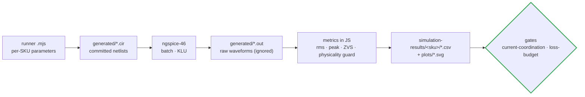

# 🖥️ SPICE Simulation Suites

<sub>The ngspice runners, what each one proves, and where its results land</sub>

<p>
  
  
  
</p>

> [!NOTE]
> **Purpose** — the ngspice runners behind the switched-circuit evidence: what each one proves, where its netlists
> and results land, and which gate consumes them.
>
> **Engine** — **ngspice-46** (`brew install ngspice`). Every runner writes its decks into `generated/`, runs them,
> computes metrics in JavaScript from the raw waveforms, and writes CSVs and SVG plots into
> `../simulation-results/`. Netlists (`*.cir`, 148 committed) are kept for traceability (§49-11); raw waveform dumps
> (`*.out`, hundreds of MB) are git-ignored — re-run a suite to regenerate them.

## How a result is produced



## Runners

| Runner | What it proves | Key outputs |
|---|---|---|
| `double-pulse/dpt-run.mjs` | device-edge truth — overshoot, dv/dt, Eon/Eoff across Rg, current, voltage, loop, snubber and clamp sweeps; froze the E5/E6 gate networks and re-selected fsw | `dpt-*-metrics.csv`, waveform plots |
| `pfc/pfc-phase-run.mjs` | 3-φ line-cycle behaviour at averaged-switch fidelity: THD-40, midpoint balance, phase loss, precharge / discharge sizing | `pfc-phase-runs.csv` |
| `llc/llc-run.mjs` | **per-SKU, power-solved** 3-φ LLC with body diodes and the star held at mid-bus: 14 corners (tolerance, mismatch, gain-worst, nominal), an internal-short race and a dead short; **physicality guard** (legs in rails) and **tank fingerprint** | `<sku>/llc-stress.csv` · `llc-stress-summary.json` · `plots/llc-worst-corner.svg` |
| `llc/sp-transition.mjs` | why hard bank paralleling is banned (205 A at a 2 V mismatch) → E12 pre-insertion | `sp-transition.csv` |
| `aux/aux-flyback.mjs` | aux start, regulation and cross-regulation at 342 / 560 / 850 V per product SKU, including the current-sense clamp lesson | `aux-flyback.csv` |
| `protection/ct-frontend.mjs` | AVMID stability and the per-SKU resonant and line CT chains at the E60 burdens, thresholds and race peaks | `ct-frontend.csv` |
| `protection/prechg-disch.mjs` | precharge, discharge and bank bleed per product SKU against F.20 / F.21 / F.21b | `prechg-disch-sku.csv` |

```bash
node spice/llc/llc-run.mjs 30kw 40kw 50kw 50kwa
```

```bash
node spice/protection/ct-frontend.mjs && node spice/protection/prechg-disch.mjs && node spice/aux/aux-flyback.mjs
```

## Models

`models/sic-behavioral.lib` holds behavioural VDMOS and JBS fits with a full provenance header: what they
approximate, what they do not, and why vendor-encrypted PSpice models cannot run here (§8). The ± 40 %
switching-energy band is carried through every downstream decision and closes at the bench double-pulse test (T-01).

> [!WARNING]
> **A simulation that cannot fail is not evidence.** The pre-E60 LLC op-point deck modelled switches without body
> diodes (legs swung ± 6 kV on a 650 V bus); its results were withdrawn and its decks deleted. Every runner that
> produces power-stage evidence must clamp its switch nodes physically — `llc-run.mjs` now fails any corner whose
> legs leave the rails. How to run and read every suite: [simulation toolchain](../docs/simulation-toolchain.md).

---

<div align="center">
<sub><a href="../calculations/README.md">← Calculations & Gates</a> &nbsp;·&nbsp; <a href="../docs/README.md">🧭 Documentation hub</a> &nbsp;·&nbsp; <a href="../docs/component-selection.md">Component Selection →</a></sub>

<sub>Vectivolt DC-Modules · documentation rev E61 · every number reproduces with <code>sh calculations/run-all.sh</code></sub>
</div>
